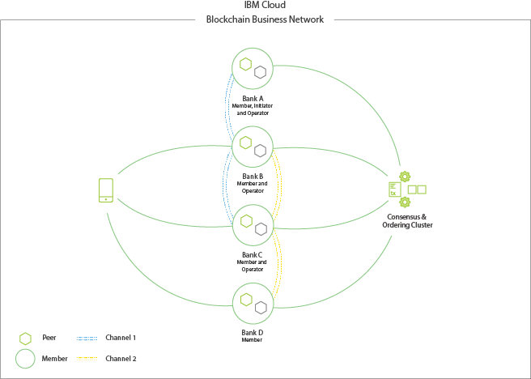

---

copyright:
  years: 2018
lastupdated: "2018-12-08"

---

{:new_window: target="_blank"}
{:shortdesc: .shortdesc}
{:screen: .screen}
{:codeblock: .codeblock}
{:pre: .pre}

# Blockchain component overview

The components and structure of the {{site.data.keyword.blockchainfull}} Platform (IBP) are based on the underlying infrastructure and tools of [Hyperledger Fabric ](https://hyperledger-fabric.readthedocs.io/en/release-1.2/), an open-source permissioned blockchain solution to which {{site.data.keyword.IBM_notm}} is a major contributor. Networks based on Fabric include several standard components that can be deployed in a number of configurations to support a wide variety of use cases.

For a more comprehensive view of Fabric networks, and the interrelation of the components that comprise it, check out [this document on the structure of a blockchain network](https://hyperledger-fabric.readthedocs.io/en/release-1.2/network/network.html) from the Fabric community documentation, which shows how a network can be started and matured.

For a high-level overview of the components in a network based on Fabric, check out the video below:

<iframe class="embed-responsive-item" id="youtubeplayer" title="Starter Plan videos" type="text/html" width="640" height="390" src="https://www.youtube.com/embed/sJaT2L99BUo" frameborder="0" webkitallowfullscreen mozallowfullscreen allowfullscreen> </iframe>

*Although this video focuses on the components from the perspective of Starter and Enterprise networks, the information is still highly relevant to the customer managed solution of IBP on ICP (IBM Cloud Platform).*

For the purposes of this overview, we'll focus just on certificate authorities (CAs), orderers, peers, smart contracts, and applications. As you can see from the [{{site.data.keyword.blockchainfull_notm}} Platform for ICP deployment guide](ibp_for_icp_deployment_guide.html) topic, this sequence is not arbitrary; it reflects the sequence in which components in a network based on Fabric will be deployed.

## Certificate Authorities
{: #ca}

The underpinning of a blockchain network based on Fabric is identities and permissions. Identities take the form of x.509 certificates that a CA issues and are like a credit card in that they *identify* someone, which can include attributes about them. These certificates are then linked to permissions by their inclusion in MSP folders at the component or channel level. So for example, a peer MSP will have an MSP subfolder called **admins**. Any user whose certificate is inside that admin folder, then, is an admin of the peer, which means they have the ability to perform any action that the admin of that peer is allowed to do. A validation system inside the peer performs a check whenever a user, identified by their signing certificate, tries to perform an administrative action. Does the certificate match the one in the "admin" folder? If it does, then the action can be performed. If not, the request to do the action will be rejected.

{{site.data.keyword.blockchainfull_notm}} CAs are based on the [Hyperledger Fabric-CA](https://hyperledger-fabric-ca.readthedocs.io/en/latest/), though it is possible to use another CA as long as it uses a PKI based on x.509 certificates. There can be, and usually should be, multiple levels of CAs. The "root CA" for a network will not usually be exposed except to provide certificates to "intermediate CAs", which will either issue certificates to users and components directly, or to more layers of intermediate CAs. For more details about how certificate authorities are used to establish identity and membership, see [Hyperledger Fabric documentation on identity ](https://hyperledger-fabric.readthedocs.io/en/latest/identity/identity.html) and on [membership ](https://hyperledger-fabric.readthedocs.io/en/latest/membership/membership.html)

## Orderers
{: #orderer}

While the ordering service is often referred to as the "heart" of a network, its function is actually quite simple: to order transactions into blocks and send them back out to the peers to be written to their ledgers. In previous versions of Fabric, this functionality was bundled inside the peer, but starting with Fabric v1.0, it was separated into a separate component to increase peer performance and avoid aberrations that could result in potential state forks.

At a physical level, this ordering function usually requires a set of orderers that are collectively known as the "ordering service", though in test or POC environments it is possible to use a single node (known as a SOLO orderer).

## Peer
{: #peer}

At a physical level, a blockchain network is comprised primarily of peer nodes (or, simply, peers). Peers are a fundamental element of the network because they host ledgers and smart contracts (which are contained in "chaincodes"). More accurately, the peer hosts **instances** of the ledger, and **instances** of smart contracts. Because smart contracts and ledgers are used to encapsulate the shared processes and shared information in a network, respectively, these aspects of a peer make them a good starting point to understand what a Fabric network actually does.

To learn more about peers specifically, check out [this document focusing just on peers](https://hyperledger-fabric.readthedocs.io/en/release-1.2/peers/peers.html) from the Fabric community documentation.

## Channels

A channel is a mechanism by which a subset of members in a network can transact with each other privately. Data on the blockchain network is stored on the channel ledgers. The channel ledgers are hosed on the peers of the organizations that have joined the channel. For more information about channels and how to use them, see the [Hyperledger Fabric documentation ](https://hyperledger-fabric.readthedocs.io/en/release-1.2/channels.html)

## Smart contracts

Before businesses can transact with each other, a common understanding about rules and processes must be reached and defined in some sort of contract. Taken together, these contracts lay out the "business model" that governs all of the interactions between business partners.

The same need exists in blockchain networks, and where the industry term for these business models is "smart contracts", Fabric (and IBP) contain these contracts in a larger structure known as "chaincode", which includes not just the business logic but the underlying infrastructure that validates the identities of the users attempting to invoke the smart contract.

Where contracts in the business world are signed and filed with law firms, smart contracts are installed on peers and "instantiated" on a channel.

## Applications

Client applications in a Fabric-based network like IBP leverage underlying infrastructures such as APIs, SDKs, and smart contracts to allow client interactions (invokes and queries) at a higher level of abstraction.

For a look at how applications interact with a network based on Fabric, check out the [documentation on writing your first application ](https://hyperledger-fabric.readthedocs.io/en/master/write_first_app.html "Writing Your First Application") and the [developing application section ](https://hyperledger-fabric.readthedocs.io/en/master/developapps/developing_applications.html "Developing Applications").

Note that the latter link refers to Fabric functionalities, such as the `Contract` class, that are not compatible with Fabric v1.2, which is what Starter Plan and the IBP on ICP release are based on. Nevertheless, the section does contain conceptual information and other useful tips that are worth keeping in mind when developing applications that will interface with Fabric v1.2 components.

## An example network

**Figure 1** depicts an example of a deployed blockchain network that consists of four members (each owning two peers), Certificate Authorities that are responsible for distributing cryptographic identity material, and an ordering service that defines policies and network participants. The blue channel contains all four network members and the yellow channel is restricted to only three members: Banks B, C, and D. You can also see that Bank A plays the role of network initiator and that Bank D exists only as a member in the context of the yellow channel. Lastly, a user or application in possession of a properly signed x509 certificate can send calls to peers on the network.

*Figure 1. An example blockchain network with four members that leverage channels to isolate data*
