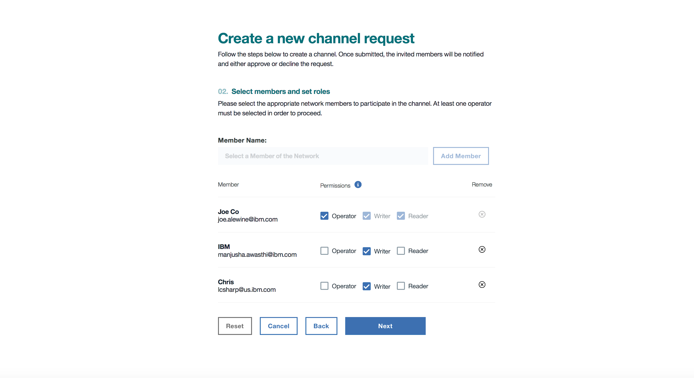

---

copyright:
  years: 2017
lastupdated: "2017-08-14"

---

{:new_window: target="_blank"}
{:shortdesc: .shortdesc}
{:screen: .screen}
{:codeblock: .codeblock}
{:pre: .pre}

# Creating Managed Channels 

**ATTENTION:** Before using an {{site.data.keyword.blockchainfull}} offering, read the technical and support information in the [Disclaimer](needtoknow.html) section.  
{:shortdesc}

In some use cases – highly regulated foreign currency exchange markets, for example – it might be necessary to put a trusted third party in charge of the administrative roles on channels that would normally be handled by various operators or members. 

The process for provisioning such a network is similar to creating any network. The main difference comes in assigning permissions to the members for how they can transact within channels.  

The steps to create a network and invite members can be found here: [Govern a network](get_start.html#creating-a-network). 

**Note**: In a real-world example, the operator of such a network might install custom chaincodes during the "Create Network" phase using the Policy Editor, but for the purpose of this example we'll assume your network configuration to be standard. 

## Create the channel

Once you’ve got a network and the members you've invited have gone through the onboarding process, navigate to **Channels** in the toolbar. 

Click **New Channel**. This will lead you to a screen where you’ll give your channel a name and a description (the description is optional). 

After clicking **Next**, you'll get to the screen where invite members to the channel and manage their permissions. For the purpose of this example, let’s say that you are acting as a trusted third party in a foreign currency exchange between two banks. You – the trusted third party – make yourself the only “Operator” for the channel and assign the other two banks as “Writers”. This will give you sole authority to edit the channel (instantiating chaincode on it, for example -- more on this later) while still giving the two banks the ability to invoke transactions. Your screen should look something like this: 

   
*Where “JoeCo” is you, the trusted third party, and “IBM” and “Chris” are the two banks (this is just an example, obviously).* 

Once you've assigned the correct permissions, click **Next**. 

This will take you to a channel policy update screen. Since there is only one operator on this channel (you), select the number of members needed to create the channel as “1”. Then click **Submit Request**. 

Note: Even though you are the sole operator of this channel, you must still navigate to the correct screen to approve and submit the request to actually create the channel. 

Emails will be sent to the members you’ve invited and prompt them to join the channel. However, because they only have “write” privileges, the ability to actually create the channel falls to you. To do this, navigate to the “Notifications” screen, where an alert to create the channel should be waiting. Click **Review Request**. This will display the channel details. Review these details and click **Approve**. Then click **Submit Request**.

Congratulations! You've just created a managed channel. 

In a network with 15 members (14 banks as well as you, the trusted third party), you could potentially see dozens of these channels. Banks A and B on a channel. Banks B and F on a channel. Banks might choose to have separate channels for each type of currency they trade. But in each case, the trusted third party creates the channel, endorses the transactions, and serves as the sole operator. 

# Instantiating the Chaincode

Your channel has been created successfully but it still needs chaincode attached to it. In a channel dedicated to foreign currency exchanges, this chaincode would presumably require all three members of the channel (the two banks in question and you, the trusted third party) to endorse **every** transaction. This chaincode might also be written to send a record of the *result* of this transaction to a managed "read-only" channel comprised of every member in the network (more on this later). Before any chaincode can be instantiated, however, it must first be installed on the members’ peers. Once it is, it can be instantiated by the channel operator (you).  

The actual procedure for installing and instantiating this kind of chaincode is no different than for any chaincode (other than the number of operators needed to approve the instantiation), so follow the instructions here: [Installing and Instantiating a Chaincode](install_instantiate_chaincode.html.html).

# A Managed Read-Only Channel

Financial regulations in the foreign currency exchange market, to continue with this use case, might demand there also be a channel in the network that has every bank on it in a passive, “read-only” mode, allowing the **result** of these currency transactions to be tracked. This is to ensure that, for example, Bank A – which has just lost millions of dollars on a “bet” with Bank B (over how much the value of a currency will rise or fall over a period of time) – does not fail to endorse the transaction that will send those millions of dollars to Bank B. 

To create this kind of a channel, follow the same channel creation procedure you followed earlier, only instead of inviting two banks and making them "Writers" (with yourself as the sole Operator), you invite **every** bank and make them all "Readers". Then follow the same process for installing and instantiating the chaincode. 

## {{site.data.keyword.IBM_notm}} Support 

{{site.data.keyword.IBM_notm}} offers support on {{site.data.keyword.IBM_notm}} implemented {{site.data.keyword.blockchain}} solutions. Access the {{site.data.keyword.blockchainfull_notm}} Support details through the [{{site.data.keyword.blockchainfull_notm}} DockerHub ](https://hub.docker.com/u/ibmblockchain/) and explore the support engagements available.

For complete details on all Hyperledger Fabric v1.0 features and functionality,
see [Hyperledger Fabric documentation ](http://hyperledger-fabric.readthedocs.io/en/latest/).
