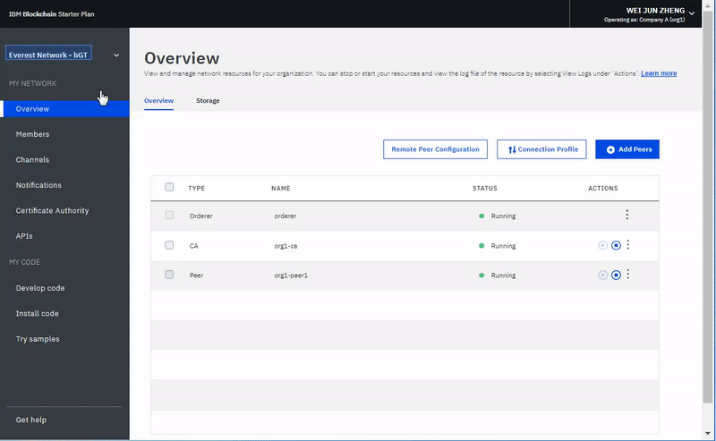

---

copyright:
  years: 2017, 2018
lastupdated: "2018-10-04"

---

{:new_window: target="_blank"}
{:shortdesc: .shortdesc}
{:codeblock: .codeblock}
{:screen: .screen}
{:pre: .pre}

# Operate Starter Plan network
{: #operate-starter-plan-network}

***[Is this page helpful? Tell us.](https://www.surveygizmo.com/s3/4501493/IBM-Blockchain-Documentation)***

{{site.data.keyword.blockchainfull}} Platform brings a Network Monitor, which is a GUI to provide an overview of your blockchain environment, including network resources, members, joined channels, transaction performance data, and deployed chaincode. The Network Monitor also offers you the entry point to run Swagger APIs, develop a network with {{site.data.keyword.blockchainfull_notm}} Platform: Develop, and try sample applications.
{:shortdesc}

You can [change the name of your Starter Plan network](#sp-network-name) or [switch between different Starter Plan networks that you create](#switch-sp-network) in the Network Monitor.

The Network Monitor exposes the following screens in three sections. You can navigate to each screen from the left navigator in the Network Monitor.
- The **My network** section contains the "[Overview](#overview)", "[Members](#members)", "[Channels](#channels)", "[Notifications](#notifications)", "[Certificate Authority](#ca)", and "[APIs](#apis)" screens.
- The **My code** section contains the "[Develop code](#write-code)", "[Install code](#chaincode)", and "[Try samples](#samples)" screens.
- The "[Get help](#support)" screen.

You can [check network preferences](#network-preferences), [switch between the organizations](#switch-organizations) that you own, and [reset your network](#reset-network) from the drop-down menu on the upper right of the Network Monitor.

This tutorial describes each of the above screens and functions.

## Update network name
{: #sp-network-name}

When you create a Starter Plan network, {{site.data.keyword.blockchainfull_notm}} Platform assigns a name to your network. However, you can update this network name at anytime in your Network Monitor.

On the top of the left navigator in the Network Monitor, click on the network name and the filed becomes editable. Type the new network name that you want to use and press **Enter**. Your network name will be updated in a few seconds.

**Figure 1** shows the steps to update the Starter Plan network name from the assigned name to "Starter Plan Network".

*Figure 1. Update network name*

## Switch between Starter Plan networks
{: #switch-sp-network}

If you create more than one network with Starter Plan, you can switch between your networks in the Network Monitor.

On the top of the left navigator in the Network Monitor, click the arrow icon beside your network name. Select and click the network name of which you want to switch to from the drop-down list. Your web browser will refresh and open the Network Monitor of the network that you switch to.

**Figure 2** shows the steps to switch to another Starter Plan network.

*Figure 2. Switch network*

## Overview
{: #overview}

The "Overview" screen contains two tabs. The "Overview" tab displays real-time status information about your blockchain resources, including the orderer, CA, and peer. Each resource is displayed under four distinct headers: **Type**, **Name**, **Status**, and **Actions**. When your network starts, one orderer, one CA, and one peer are running. The CA is specific to the organization, whereas the orderer is a common endpoint that is shared across the network. The "Storage" tab displays the storage usage status of orderer and other network resources.

**Figure 3** shows the "Overview" tab of the "Overview" screen:

*Figure 3. Overview*

### Node actions
The **Actions** header of the table provides buttons to start or stop your components. You can also start or stop a group of nodes by selecting multiple nodes and then clicking the **Start Selected** or **Stop Selected** button. The **Start Selected** or **Stop Selected** button appears on top of the table when you select one or more nodes.

You can also check component logs by clicking **View Logs** from the drop-down list under the **Actions** header. The logs expose the calls between the various network resources and are useful for debugging and troubleshooting.

**Note**: In the Starter Network Monitor, when you click the **View Logs** action on the nodes that are listed on the "Overview" screen, the {{site.data.keyword.cloud_notm}} Logging kibana interface is opened. By default, kibana is preconfigured to show logs from the last 15 minutes of activity. If there has been no activity in the last 15 minutes, you will see a message that says 'No results found'. To view all logs, you can simply click on the timer icon in the upper right corner under your username and set a broader time range, such as ‘This week’ or This month’.

To understand the effects of starting and stopping a peer, you can experiment by stopping a peer and attempting to target it with a transaction, and you will see connectivity errors in the logs. When you restart the peer and attempt the transaction again, you will see a successful connection. You can also leave a peer down for an extended period of time as your channels continue to transact. When the peer is brought back up, you will notice a synchronization of the ledger as it receives the blocks that were committed when it was down. After the ledger is fully synchronized, you can perform normal invokes and queries against it.

### Remote Peer Configuration

If you deploy a remote peer outside {{site.data.keyword.cloud_notm}}, you need to provide the API endpoint informaiton of your network to the remote peer during configuration. Click the **Remote Peer Configuration** button to retreive the API endpoint information of the network to configure your remote peer. The pop-up window provides the API endpoint information of network ID, organization MSP, CA name, CA URL, and CA TLS certificate. You can either click the copy icon at the end of each field to copy the value of that field, or click the **Download** link to save values of all fields in a JSON file. For more information about remote peers, see [About remote peers](howto/remote_peer.html).

### Connection Profile

You can view the JSON file about low-level network information of each resource by clicking the **Connection Profile** button. The connection profile contains all the configuration information that you need for an application. However, because this file contains only the addresses for your specific components and the orderer, if you need to target additional peers, you need to obtain their endpoints. The header that contains "url" displays the API endpoint of each component. These endpoints are required in order to target specific network components from a client-side application and their definitions will typically live in a JSON-modeled configuration file that accompanies the app. If you are customizing an application that requires endorsement from peers that are not part of your organization, you need to retrieve the IP addresses of those peers from the relevant operators in an out-of-band operation. Clients must be able to connect to any peers from which they need a response.

### Add peers
{: #peers}

Network members need to have peers to store their copies of network ledger and to run chaincode to query or update the ledger. If the endorsement policy defines a peer as an endorsing peer, the peer also returns endorsement results to applications.

Starter Plan creates one peer for each of the two organizations by default. You can add more peers for your organizations based on your own requirements. You might be in different scenarios when you need more peers. For example, you might want multiple peers to join the same channel for redundancy. Each peer processes the channel's transactions and writes to their respective copies of the ledger. If one of the peers fail, the other peer (or multiple other peers) can continue processing transactions and application requests. You can also symmetrically load balance all application requests across the peers, or you could target different peers for different functions. For example, you can use one peer to query the ledger and use another peer to process endorsements for ledger updates.

Click the **Add Peers** button at the upper right to add peer nodes to your network. In the pop-up "Add Peers" panel, select the number and size of peer nodes you want to add.

### Storage
{: #storage}

**Figure 4** shows the "Storage" tab that displays your network's storage consumption.

*Figure 4. Storage*

The "Resources" diagram displays the storage space that peers and certificate authorities use. All the organizations that you create or invite to your network are included in this pool. The organizations that consume resources are listed on the screen in the second bullet.

The ordering service consumes storage from a separate resource pool. Your ordering service might consume more resources when members of the network create new channels and generate new blocks of transactions.

## Members
{: #members}

The "Members" screen contains two tabs to display network member information in the "Members" tab and certificate information in the "Certificates" tab.

### Members
{: #members_tab}
**Figure 5** shows the initial "Members" screen that displays your network members in the "Members" tab:

*Figure 5. Network members*

Click **Add Member** to invite more members to your network. In Starter Plan, you have two options:
- **Invite a member**. You can invite other organizations to become members of your network. The invited organizations can then join and collaborate with you in the network.
- **Create member**. You can also create a member by using your own email address. You would have control of it just as you have of the two organizations that you receive with Starter Plan by default.

**Figure 6** shows the "Add member" window.

*Figure 6. Add member*

### Certificates
{: #certificates_tab}

**Figure 7** shows the initial "Members" screen that displays member certificates in the "Certificates" tab:

*Figure 7. Certificates*

Operators can manage the certificates for the members in the same institution in the "Certificates" tab. Click **Add Certificate** to open the "Add Certificate" panel. Give a name to your certificate, paste your client-side certificates in PEM format to the "Key" field, and click **Submit**. You need to restart your peers before the client-side certificates can take effect.

For more information about generating your certificate key, see [Enrolling your application](v10_application.html#enroll-app).

## Channels
{: #channels}

Consisting of a subset of network members who want to transact privately, channels provide data isolation and confidentiality by allowing the members of a channel to establish specific rules and a separate ledger, which only channel members can access. Every network must have at least one channel for transactions to take place. Each channel has a unique ledger and users must be properly authenticated to perform read/write operations against this ledger. If you're not on a channel, you can't see any data.

**Figure 8** shows the initial dashboard screen that displays an overview of all channels in your network:

*Figure 8. Channels*

Creating a channel results in the generation of a channel-specific ledger. For more information, see [Creating a channel](howto/create_channel.html).

You can also select an existing channel to view more precise details about the channel, membership, and active chaincode. For more information, see [Monitoring a network](howto/monitor_network.html).

If you have uploaded a new certificate to the platform by using the ["Certificates" tab](#certificates_tab) of the "Members" screen, you can use this panel to add the certificate to a channel. Click **Sync Certificate** from the drop-down list under the **Actions** header next to the relevant channel. This allows you to operate the channel from a remote client, including being able to instantiate a chaincode on the channel. For more information, see [Uploading signing certificates to {{site.data.keyword.blockchainfull_notm}} Platform](certificates.html#upload-certs) in the [Managing certificates](certificates.html) tutorial.

## Notifications
{: #notifications}

You can handle pending requests and view completed requests in the "Notifications" screen.

**Figure 9** shows the "Notifications" screen:

*Figure 9. Notifications*

When you create a channel or are invited to a new channel, a notification appears in the Network Monitor.

The requests are grouped into "All", "Pending", and "Completed" subtabs. Numbers after the header indicate the number of requests in each sub-tab.
   * You can find all your requests in the "All" subtab.
   * Requests that you have not accepted or declined, or you have not viewed, are in the "Pending" subtab. Click the **Review Request** button to view the request, which includes the channel policy and members, and voting status. If you are a channel operator, you can either **Accept** or **Decline** the request, or handle it at another time by clicking **Later**. If the request is accepted by enough channel operators, you can click **Submit Request** to activate the channel update.
   * A submitted request will appear in the "Completed" subtab.  You can click **Review Request** to view its details.

If you have a long list of requests, you can search for a request in the search field on the top.

Pending requests can be deleted by selecting the boxes in the front of them and clicking **Delete Request**.

## Certificate Authority
{: #ca}

The table on "Certificate Authority" (CA) screen displays all of the identities that have been registered with your organization, including your admin, peers, and client applications. You can also use this screen to register a new identity.

**Figure 10** shows the "Certificate Authority" screen:

*Figure 10. Certificate Authority*

Click the **Generate Certificate** button next to your admin identity to get a new public certificate and private key from your CA. The **Certificate** field contains the public certificate, also referred to as the signCert or enrollment cert, just above the **Private Key**. You can click the copy icon at the end of each field to copy the value. This panel can be used an alternative way to generate a public and private key pair for a client application which uses the Fabric SDK. To learn more, visit the [developing applications tutorial](v10_application.html#enroll-panel). **Note** that {{site.data.keyword.blockchainfull_notm}} Platform doesn't store these certificates. You need to safely save and store them.

Click the **Add User** button to register a new identity to your organization. In the **Add User** pop-up window, fill in the following fields and then click **Submit**.
  - **ID:** This will the name of your new identity, sometimes referred to as your `enroll ID`. **Save this Value** for when you configure a remote peer or enroll a new application.
  - **Secret:** This will be the password to your identity, sometimes referred to as your `enroll Secret`  **Save this Value.** for when you configure a remote peer or enroll a new application.
  - **Type:** Select the type of identity the you want to register, either peer or client application.
  - **Affiliation:** This will be the affiliation within your organization, such as `org1` for example, that the identity will belong to.
  - **Maximum Enrollments:** You can use this field to limit the number of times your can enroll or generate certificates using this identity. If you leave the field blank, the value defaults to an unlimited number of enrollments.

You can learn more about your CA by visiting the [Managing certificates on {{site.data.keyword.blockchainfull_notm}} Platform](certificates.html) tutorial.

## APIs
{: #apis}

{{site.data.keyword.blockchainfull_notm}} Platform exposes a number of REST APIs in Swagger that you can use to manage the nodes, channels, peers, and members of your network. Your applications can use these APIs to control important network resources without using the Network Monitor.

**Figure 11** shows the "APIs" screen:

*Figure 11. APIs*

Click the **Swagger UI** link to open the Swagger UI. Note that you need to authorize the Swagger UI with your network credentials (which can be found on this APIs page) before you can run the APIs. For more information, see [Using Swagger APIs](howto/swagger_apis.html).

## Develop code
{: #write-code}

Starter Plan integrates {{site.data.keyword.blockchainfull_notm}} Platform: Develop and provides a development environment with industry standard tools and technologies. You can develop your business network in the environment online or locally. After you develop a business network, you can deploy it back to your Starter Plan network.

**Figure 12** shows the "Develop code" screen:

*Figure 12. Develop code*

For more information about developing business networks and deploying it back to Starter Plan network, see [Developing business networks with Starter Plan](develop_starter.html).

## Install code
{: #chaincode}

Chaincode, which is also known as "smart contract", is pieces of software that contains a set of functions to query and update the ledger. They are installed on peers and instantiated on a channel.

**Figure 13** shows the "Install code" screen:

*Figure 13. Chaincode*

A chaincode is first installed on a peer's file system and then instantiated on a channel. For more information, see [Installing, instantiating, and updating a chaincode](howto/install_instantiate_chaincode.html).

## Try samples
{: #samples}

Sample applications help you to get a better understanding of a blockchain network and application development.  <!--Starter Plan enables you to deploy and launch sample applications in the Network Monitor. --> Follow the **View on GitHub** links to learn how to use the samples and deploy them to {{site.data.keyword.blockchainfull_notm}} Platform. For more information on how to develop and deploy your samples, see [Deploying Sample Applications](howto/prebuilt_samples.html).

**Figure 14** shows the "Try samples" screen:

*Figure 14. Samples*

<!--
The sample deployment leverages the [DevOps Toolchain service ](https://console.bluemix.net/devops/toolchains) to automate your process of source control, delivery pipeline, and chaincode enablement. Choose a sample application, and click the **Deploy via Toolchain**. For more information, see [Deploying sample applications](howto/prebuilt_samples.html).
-->

## Get help
{: #support}

The "Get help" screen contains a "Support" tab that provides a list of resources for developers and a "Release Notes" tab that describes new functions on {{site.data.keyword.blockchainfull_notm}} Platform.

**Figure 15** displays the information in the initial "Support" tab:

*Figure 15. Blockchain support*

### Blockchain resources and support forums
{: #support-forums}

Use the resources in the "Support" tab to troubleshoot problems and get help from {{site.data.keyword.IBM_notm}} and the Fabric community. For more information about the links on the "Support" tab, see [Resources and support forums](ibmblockchain_support.html#resources) in [Getting support](ibmblockchain_support.html).

[IBM dWAnswers ](https://developer.ibm.com/answers/smartspace/blockchain/) is a community forum for users of {{site.data.keyword.blockchainfull_notm}} Platform and Hyperledger Fabric and is monitored by IBM experts. You can search for answers to previously posed questions or submit a new question. If you cannot debug your issue or ascertain an answer to your question, submit a support case in the {{site.data.keyword.cloud_notm}} Service Portal. For more information, see [Submitting support cases](ibmblockchain_support.html#support-cases).

### Fabric release notes
{: #release-notes}

The "Release Notes" tab displays the latest features of your network. The "Network Monitor UI" button lists new functions and bug fixes for the {{site.data.keyword.blockchainfull}} Platform user experience. The "Hyperledger Fabric" button will direct you to the release notes for your network's version of Hyperledger Fabric and the Fabric Certificate Authority.

**Figure 16** displays the release notes for the Network Monitor UI.

*Figure 16. Release notes of Helios*

**Figure 17** displays the release notes for your networks version of Hyperledger Fabric and the Fabric Certificate Authority.

*Figure 17. Release notes of Fabric*

## Network preferences
{: #network-preferences}

Click the upper right corner and opens the drop-down menu and then the **Network preferences** button in the menu. The Network preferences window opens. The Network preferences window shows the basic information of your network, such as network name, Fabric version, network location in {{site.data.keyword.cloud_notm}}, and state database type. If you are the network initiator, you can also manage web inactivity timeout in the Network preferences window.

### Web inactivity timeout
{: #web-inactivity-timeout}

**Note**: Only **network initiator** can change the web inactivity timeout setting. This is a network level setting and will affect all network members.

The web inactivity timeout is set to **Off** by default. If you turn the web inactivity timeout to **On**, any member of the network will be logged out automatically after 10 minutes of inactivity. When the web inactivity timer reaches 10 minutes, the web inactivity timeout function ends the inactive web sessions to ensure security of the network member's account. Clicking a link or refreshing the Network Monitor resets the web inactivity timer. Before reaching 10 minutes, closing the browser window or tab also ends the web session.

**Figure 18** shows the "Network preferences" window:

*Figure 18. Network preferences*

## Switch organizations
{: #switch-organizations}

If you simulate a multi-organization blockchain network on your own, you can switch to any of the organizations that you own, for example, Organization A. Then, you can view and manage Organization A's network resources, such as peers, channels, and chaincode in the Network Monitor. This feature allows you to create a channel by following channel policies and to add peers from multiple organizations to the channel.

Click the upper right corner of the UI, where you should see your name. From the drop-down menu under **SWITCH ORGANIZATION**, choose the organization name that you want to switch to. Organization A is selected by default. After you choose an organization to switch to, your Network Monitor is automatically refreshed and you can view the network as that organization.

**Figure 19** shows the "Switch organizations" function:

*Figure 19. Switch organizations*

## Reset network
{: #reset-network}

Starter Plan offers the capability to edit your network configuration without deleting and re-creating a network. Your network is reset back to the initial network configuration, which includes two organizations, one peer per each organization, and a default channel. This is useful, for example, when you are running rounds of tests on the blockchain network, which allows you to start over from a relatively clean network.

**Caution**: After you reset the network, the API endpoints of your peers, orderer, and CA are changed. You need to adjust API endpoint information in your applications.

Click the upper right corner and opens the drop-down menu. Click the **Reset Network** button in the menu. If you are ready to reset your network, click **OK** to continue. Your Network Monitor will be refreshed to reflect your new settings.

**Figure 20** shows the "Reset network" function:

*Figure 20. Reset network*
