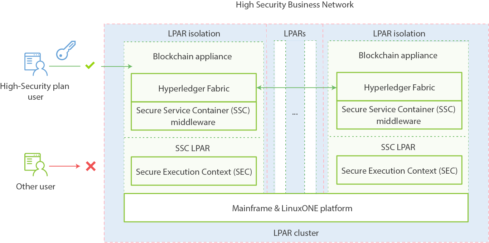

---

copyright:
  years: 2016, 2017
lastupdated: "2017-07-28"
---

{:new_window: target="_blank"}
{:shortdesc: .shortdesc}
{:codeblock: .codeblock}
{:screen: .screen}
{:pre: .pre}

# How it works

The **Enterprise Plan** runs Blockchain network in a highly secured cluster environment on LinuxONE on IBM Z and runs in an IBM Secure Service Container (SSC).  
{:shortdesc}

The fabric, shared ledger, and peer nodes all exist in an IBM Secure Service Container, providing the enterprise-level of security and impregnability that enterprise customers have come to expect from IBM Z technology.  The IBM Secure Service Container also delivers performance optimization for peer-to-peer communication, availability, scalability, hardware encryption, tamper-proof crypto keys, and securely encrypted VMs.  The IBM Secure Service Container protects blockchain appliance, chaincode, and data running within the system. The blockchain appliance within the secure boot can be signed, attested, and encrypted; and once installed in the IBM Secure Service Container, it is tamper-resistant.  Root users of the platform and system administrators cannot access or see secure container contents.  LinuxONE on IBM Z provides FIPS compliance, high Evaluation Assurance Level protection, a highly auditable operating environment, and crypto optimization.

## IBM Secure Service Container
{: #etn_ssc}

The **Enpterprise Plan** deploys the Blockchain network as an appliance into IBM Secure Service Container, which provides the base infrastructure for hosting blockchain services. The appliance combines operating systems, Docker containers, middleware, and software components that work autonomously, and provides core services and infrastructure with optimized security.
{:shortdesc}

The following architecture diagram illustrates how IBM Secure Service Container and blockchain appliances are organized:

*Figure 1. Overview of IBM Secure Service Container and blockchain appliances*

IBM Secure Service Container brings the advanced cryptography, security, and reliability of the LinuxONE on IBM Z platform to blockchain services for handling sensitive and regulated data. Blockchain is protected through a series of features from the IBM Secure Service Container: encapsulated operating system, encrypted appliance disks, tamper protection, protected memory, and strong LPAR isolation that can be configured to match EAL5+ certification.

## Key security features
IBM Secure Service Container provides the following optimized security functions for blockchain services:  

### Protection from system administrators
>Appliance code cannot be accessed even by platform or system administrators.  Data access is controlled by the appliance, therefore unauthorized access is disabled.  This is supported through a combination of signing and encrypting all data in flight and in rest. All the access to memory is also removed. Firmware supports this with a secure boot architecture.

>System administrators have the following limitations when blockchain is secured by IBM Secure Service Container:
>* Cannot access nodes
>* Cannot view the blockchain network

### Tamper protection  
>IBM Secure Service Container disables all external interfaces that provide LPAR memory access. An image boot loader is signed to ensure that it cannot be tampered or exchanged with a different one.

### Encrypted appliance disks
>All code and data stored on disk is encrypted at all times by using the Linux encryption layer:  
- Encapsulated operating system
- Protected IP
- Embedded monitoring and self-healing  
