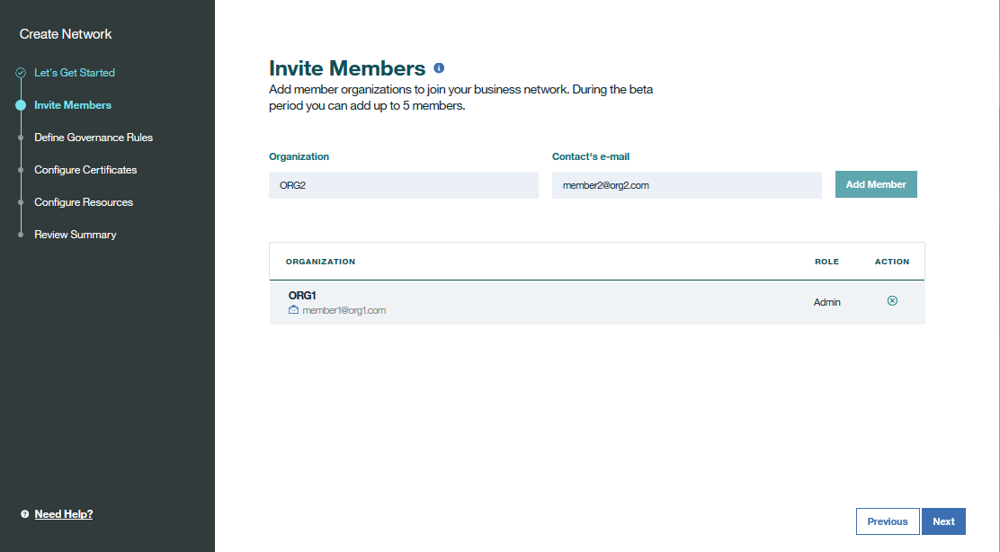

---

copyright:
  years: 2017
lastupdated: "2017-07-11"

---

{:new_window: target="_blank"}
{:shortdesc: .shortdesc}
{:screen: .screen}
{:codeblock: .codeblock}
{:pre: .pre}

# Creating a network

This tutorial shows you how to create a {{site.data.keyword.blockchain}} network on {{site.data.keyword.Bluemix_short}}.
{:shortdesc}

1. Enter your blockchain service instance, and click **Create Network**.
	
	
	If you don't have a blockchain service instance, see [Creating a Blockchain instance on Bluemix](create_service.html).  
	
2. Give a name to your network in the "Let's Get Started" screen. Then click **Next**.
	

3. (Optional) Invite members from other organizations to join your network in the "Invite Members" screen, and click **Next**.  You can also add members to your network later in the network monitor.
	  

4. Define the policies of membership, channel creation, and chaincode in the "Define Governance Rules" screen, and click **Next**.
	  

5. Give a name to your company and generate your certificates and keys in the "Configure Certificates" screen.  Click **Next** to continue.
	 

6. (Optional) Add your peers with their sizes in the "Configure Resources" screen.  Click the **Add to Order** button and you can see a summary of your requested resources under the **Resources to be Ordered** section.  Note that each member in a network can add up to six peers, with sizes of small, medium, and large.  You can also add your peers later in the network monitor.
	  

7. Verify the network configuration in the "Review Summary" screen, and click **Done**.  You will be notified that your network is successfully created. 
	  

**Note**: You can always click the **Previous** button to review or modify your configuration.
