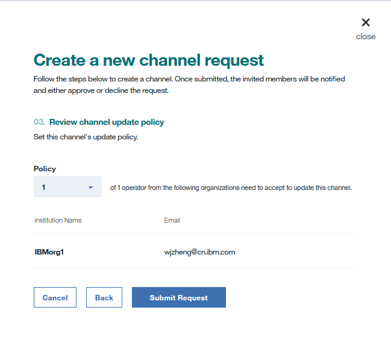

---

copyright:
  years: 2017, 2018
lastupdated: "2018-06-14"

---

{:new_window: target="_blank"}
{:shortdesc: .shortdesc}
{:screen: .screen}
{:codeblock: .codeblock}
{:pre: .pre}

# Creating or updating a channel

***[Is this page helpful? Tell us.](https://www.surveygizmo.com/s3/4501493/IBM-Blockchain-Documentation)***

Channels are an incredibly powerful mechanism for partitioning and isolating data, and they provide the primary foundation for data privacy. Only members of the same channel can access the data of this channel.
{:shortdesc}

To ensure channel security, the channel update policy is configured to define the number of channel operators who need to agree on the channel creation or update request before a channel is created or updated.

## Creating a channel
Click the **New Channel** button in the "Channels" screen of your Network Monitor, and complete the following steps to submit a channel creation request:
1. Choose a name reflective of the channel's business objective, add a description if you want, and click **Next**. The channel name must be unique in a Blockchain network. It must start with a letter and can contain only lowercase characters, numbers, or dashes.
  

2. Invite any combination of your network members by selecting network members and clicking the **Add Member** button. Customize permissions by assigning roles for each of the invited members, and click **Next**.
  

    * A channel operator can query or update the channel ledger. Channel operator has the authority to **Accept** or **Decline** a channel create request, and to submit a channel update request. There must be at least one **Operator** in each a channel.
    * A channel writer can update the channel ledger.
    * A channel reader can only query the channel ledger.

3. Configure the channel update policy by selecting the number of channel operators to approve channel update request, and click **Submit Request**.
  

The invited members will receive an invitation email. They can also find the request in the "All" or "Pending" subtabs in the **Notifications** screen of the Network Monitor.
* Members who are invited as channel operators can click the **Review Request** button to review the channel configuration, and then **Accept** or **Decline** the request. The "My Status" column shows the operator's voting status on the request:
    * _Vote Pending_: The operator has not handled the request.
    * _Vote Accepted_: The operator accepted the request.
    * _Vote Declined_: The operator declined the request.
    * _Vote Closing_: The request gets enough **Accept** votes, and the operator no long needs to accept or decline.
* Members who are invited as channel writers or readers can see *Not Required* under the "My Status" column. Before the request gets enough **Accept** votes from channel operators, writers or readers can click the **Review Request** button to check the channel configuration.

When enough channel operators agree on the request, any channel member can click the **Submit Request** button and the new channel is created. All channel members can find the channel in the "Channels" screen of their Network Monitor.

### Creating managed channels

In highly regulated foreign currency exchange markets, to use one example, it might be necessary to put a trusted third party in charge of the administrative roles on channels that would normally be handled by various operators or members.

In this case, the trusted third party would make themselves the only “Operator” for a channel and assign other members as “Writers”. This would give the third party sole authority to edit the channel while still giving the two banks the ability to invoke transactions. A managed "read only" channel could also be created by setting other members as "Readers".

## Updating a channel
If you want to modify the configuration of a channel, for example, add or remove channel members, or change the channel update policy, you can submit a channel update request. In the "Channels" screen of your Network Monitor, locate the channel that you want to modify and select **Edit Channel** from the drop-down list under the **Action** header. Navigate through the panels to make changes to the desired entities, and click **Submit Request** to initiate a channel update request.

All channel members will receive email notifications on the channel update request:
* The newly invited members receive email notifications to invite them to join the channel. They can also find the request with "Vote Pending" status in the **Notifications** screen of the Network Monitor.
    * Members who are invited as channel operators can click the **Review Request** button to review the channel configuration, and then **Accept** or **Decline** the channel update request.  The "My Status" column shows the operator's voting status on the request:
        * _Vote Pending_: The operator has not handled the request.
        * _Vote Accepted_: The operator accepted the request.
        * _Vote Declined_: The operator declined the request.
        * _Vote Closing_: The request gets enough **Accept** votes, and the operator no long needs to accept or decline.
    * Members who are invited as channel writers or readers can see *Not Required* under the "My Status" column. Before the request gets enough **Accept** votes from channel operators, writers or readers can click the **Review Request** button to check the channel configuration.
* The removed members receive email notifications on channel change.
* Existing channel operators receive email notifications on channel update. They can find the request with _Vote Pending_ status in the **Notifications** screen of the Network Monitor for them to **Accept** or **Decline**.
* Existing channel writers or readers also receive email notifications on channel update. They can find the request with _Not Required_ status in the **Notifications** screen of the Network Monitor.

When enough channel operators agree on the request, any channel member can click the **Submit Request** button and the channel is updated. All channel members can find the updated channel in the "Channels" screen of the Network Monitor.
