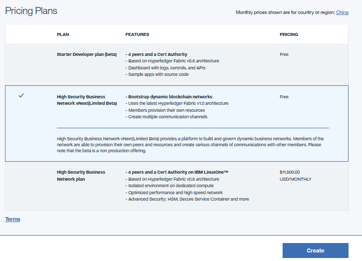

---

copyright:
  years: 2017
lastupdated: "2017-07-08"

---

{:new_window: target="_blank"}
{:shortdesc: .shortdesc}
{:screen: .screen}
{:codeblock: .codeblock}
{:pre: .pre}

# Creating a service instance

This tutorial shows you how to create a {{site.data.keyword.blockchain}} service instance using the {{site.data.keyword.Bluemix_short}} dashboard.
{:shortdesc}

1. Log in to [{{site.data.keyword.Bluemix_notm}} platform ](http://bluemix.net){:new_window} with your user name and password.  You should see your {{site.data.keyword.Bluemix_notm}} dashboard with sections for "Apps" and "Services".

2.  Click the **Catalog** link in the upper right corner.  
    

3.  Search for `{{site.data.keyword.blockchain}}` and click the {{site.data.keyword.blockchain}} service.
     

4.  In the service configuration window, enter a service name and a credential name.  In the below example, the service name is `Your blockchain network`, and the credential name is `Your credentials`:  
    

5.  Select a {{site.data.keyword.blockchain}} network plan, and click the `Create` button: 
    

6.  A service page will appear, confirming that your new {{site.data.keyword.blockchain}} service is available.  You can now create or join a {{site.data.keyword.blockchain}} network.  For more information, see [Creating a {{site.data.keyword.blockchain}} network](create_bc_network.html) and [Joining an existing {{site.data.keyword.blockchain}} network](join_bc_network.html).
