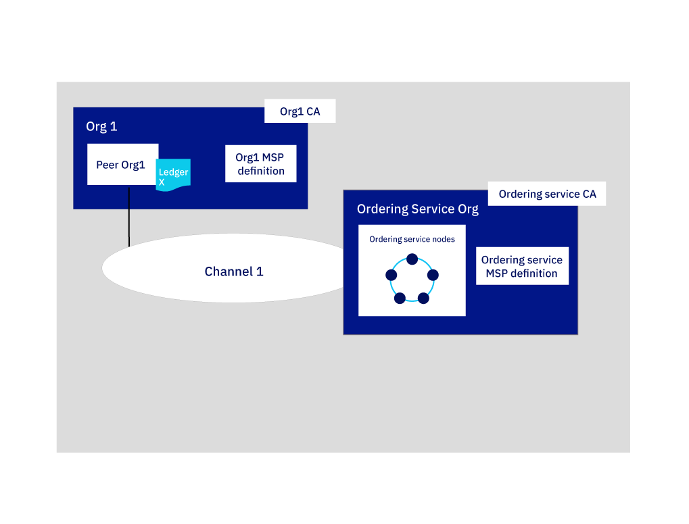

---

copyright:
  years: 2019

lastupdated: "2019-03-12"

subcollection: blockchain

---

{:new_window: target="_blank"}
{:shortdesc: .shortdesc}
{:screen: .screen}
{:codeblock: .codeblock}
{:note: .note}
{:important: .important}
{:tip: .tip}
{:pre: .pre}

# Build a network tutorial
{: #ibp-console-build-network}

{{site.data.keyword.blockchainfull}} Platform is a blockchain-as-a-service offering that enables you to develop, deploy, and operate blockchain applications and networks. You can learn more about blockchain components and how they work together by visiting the [Blockchain component overview](/docs/services/blockchain/blockchain_component_overview.html#blockchain-component-overview). This tutorial is the first part in the [sample network tutorial series](/docs/services/blockchain/howto/ibp-console-build-network.html#ibp-console-build-network-sample-tutorial) and describes how to use the {{site.data.keyword.blockchainfull_notm}} Platform console to build a fully functional network on a single {{site.data.keyword.cloud_notm}} Kubernetes Service.
{:shortdesc}

**Target audience:** This topic is designed for network operators who are responsible for creating, monitoring, and managing the blockchain network.   

If you have not already deployed the console to a Kubernetes cluster by using {{site.data.keyword.cloud_notm}} Kubernetes Service, see [Getting started with {{site.data.keyword.blockchainfull_notm}} Platform 2.0](/docs/services/blockchain/howto/ibp-v2-deploy-iks.html#ibp-v2-deploy-iks). You can create a new Kubernetes cluster for the console deployment or use an existing one in your {{site.data.keyword.cloud_notm}} account.  After you deploy the {{site.data.keyword.blockchainfull}} Platform to your Kubernetes cluster, you can launch the console to create and manage your blockchain components.

Whether you deploy to a paid or free Kubernetes cluster, use the Kubernetes dashboard to pay close attention to the resources at your disposal when you choose to deploy nodes and create channels. It is your responsibility to manage your Kubernetes cluster and deploy additional resources if necessary. While components will successfully deploy to a free cluster, the more components you add, the slower your components will run.
{: note}

## Sample network tutorial series
{: #ibp-console-build-network-sample-tutorial}

This three-part tutorial series guides you through the process of creating and interconnecting a relatively simple, multi-node Hyperledger Fabric network by using the {{site.data.keyword.blockchainfull_notm}} Platform 2.0 console to deploy a network into your Kubernetes cluster and install and instantiate a smart contract.

* **Build a network tutorial** This current tutorial guides you through the process of hosting a network by creating an orderer and peer.
* [Join a network tutorial](/docs/services/blockchain/howto/ibp-console-join-network.html#ibp-console-join-network) guides you through the process of joining an existing network by creating a peer and joining it to a channel.
* [Deploy a smart contract on the network](/docs/services/blockchain/howto/ibp-console-smart-contracts.html#ibp-console-smart-contracts) provides information on how to write a smart contract and deploy it on your network.

You can use the steps in these tutorials to build a network with multiple organizations in one cluster for the purposes of development and testing. Use the **Build a network** tutorial if you want to form a blockchain consortium by creating an orderer node and adding organizations. Use the **Join a network** tutorial to connect a peer to the network. Following the tutorials with different consortium members allows you to create a truly **distributed** blockchain network.  

### The structure of this network
{: #ibp-console-build-network-structure}

If you complete all the steps in the **Build a network** and **Join a network** tutorials, your network will resemble the one in the illustration below:
  
*Figure 1. Sample basic network structure*  

This configuration is sufficient for testing applications and smart contracts. The network contains the following components:

* **Two peer organizations**: `Org1` and `Org2`  
  The tutorial series describe how to create two peer organizations and two associated peers. Think of organizations on a blockchain network to be like two different banks that need to transact with each other. We create the Org1 and Org2 Membership Services Provider (MSP) definition which defines the organizations `Org1` and `Org2`.
* **One orderer organization**: `Orderer Org`  
  Because we are building a distributed ledger, the peers and orderers should be part of separate organization. Therefore, a separate organization is created for the orderer.  Among other things, an orderer node orders the blocks of transactions that are sent to the peers to be written to their ledgers and become the blockchain. We create the Orderer Membership Services Provider (MSP) definition which defines the organization `Orderer Org`.
* **Three Certificate Authorities (CAs)**: `Org1 CA, Org2 CA, Orderer CA`   
  A CA is the node that issues certificates to all organization members. Because it’s a best practice to deploy one CA per organization, we will deploy three CAs in total: one for each peer organization and one for the orderer organization. We will also use the CA's to create all of the nodes, identities, and organization definition for each organization.
* **One orderer:** `Orderer`  
  Currently, only a SOLO ordering service can be deployed by using the console. You can deploy more than one of these nodes, assuming you have space in your cluster, but each orderer will have its own "consortium", which is the list of peer organizations that can create and join channels. You cannot connect multiple orderers to the same channel. As the admin of this orderer, you will add the peer organization that you use to create the consortium, which allows your peer organization to create a channel. If you want to create a channel that has organizations deployed in different clusters, which is how most production networks will be structured, you also need to import a peer organization that has been deployed in another console into your console. This allows the peer organization to join the channel that is hosted by the ordering service.
* **Two peers:** `Peer Org1` and `Peer Org2`  
  The blockchain ledger, `Ledger x` in the illustration above, is maintained by distributed peers. These peers are deployed with [Couch DB ](https://hyperledger-fabric.readthedocs.io/en/release-1.4/couchdb_as_state_database.html) as the database.
* **One channel**: `channel1`  
  Channels provide data privacy. They allow sets of organizations to transact without exposing their data to organizations that are not members of the channel. Each channel has its own blockchain ledger, shared between the peers joined to that channel. The tutorial creates create one channel joined by both organizations, and instantiate smart contract on the channel that the organizations can use to transact.

This configuration isn't mandatory. The {{site.data.keyword.blockchainfull_notm}} Platform 2.0 is highly customizable. If you have resources available in your Kubernetes cluster, you can use the console to deploy an orderer node and add organizations to it, also known as to form a consortium. Additionally, you can create a peer organization that connects to multiple ordering services. This tutorial provides the steps you need to build your own network, with references to topics that provide a deeper dive into the {{site.data.keyword.blockchainfull_notm}} Platform and the console.

In this **Build a network** tutorial, we build only a portion of the network above, a simple network that can be used to host an orderer and a single peer organization and peer on a single channel. The following illustration shows the portion of the network above that we will build:
  
*Figure 2. Simple network structure*  

This configuration is useful for quickly getting started and testing a smart contract but is not very meaningful until you add other organizations to transact with, creating a truly distributed ledger.  Therefore, in the subsequent [Join a network](/docs/services/blockchain/howto/ibp-console-join-network.html#ibp-console-join-network) tutorial, we show you how to create additional peer organizations and peers, and how to add a new organization to the channel.  

Throughout this tutorial we supply **recommended values** for some of the fields in the console. This allows the names and identities to be easier to recognize in the tabs and drop-down lists. These values are not mandatory, but you will find them helpful. We provide a table of the recommended values after each task.
{:tip}

## Step one: Create your organization and your entry point to your blockchain
{: #ibp-console-build-network-create-peer-org1}

For each organization that you want to create with the console, you should deploy at least one CA. A CA is the node that issues certificates to all network participants (peers, orderers, clients, and so on). These certificates, which include a public and private key pair, allow network participants to communicate, authenticate, and ultimately transact. These CAs will create all of the identities and certificates that belong to your organization, in addition to defining the organization itself. You can then use those identities to deploy nodes, operate your network, and submit transactions to the blockchain. For more information about your CA and the identities that you will need to create, see [Managing identities](/docs/services/blockchain/howto/ibp-console-identities.html#ibp-console-identities).

In this tutorial, we create two organizations, one which will own a peer and another which will own an orderer. Each organization needs a CA to issue it's certificates, therefore we need to create **two CAs**. For the purpose of this tutorial, **we will create only one CA at a time**.

Watch the following video to learn about the process to create the peer's organization and the peer.

<iframe class="embed-responsive-item" id="youtubeplayer" title="IBM Blockchain Platform free 2.0 beta video - deployment tutorial" type="text/html" width="640" height="390" src="https://www.youtube.com/embed/JZj43n_JKIY" frameborder="0" webkitallowfullscreen mozallowfullscreen allowfullscreen> </iframe>  

*Video 1. Create the peer's organization and the peer*

### Creating your peer organization CA
{: #ibp-console-build-network-create-CA-org1CA}

As part of this tutorial, your CA issues the public and private keys for your users and nodes. These identities are not managed by {{site.data.keyword.IBM_notm}} and the keys are not stored in your Kubernetes cluster or in the console. They are only stored in your browser local storage. Therefore, make sure to export your identities and organization MSP. If you attempt to access the console from a different machine or a different browser, you need to import these identities and organization definitions.  
{:important}

Perform the following steps from your console:

1. Navigate to the **Nodes** tab on the left and click **Add Certificate Authority**. The four-step side panels will allow you to customize the CA that you want to create and the organization that this CA will issue keys for.
2. Click  **{{site.data.keyword.cloud_notm}}** under **Create Certificate Authority** and **Next**.
3. Use the second side panel to give your CA a **display name**. Our recommended value for this CA is `Org1 CA`.
4. On the next panel, give your CA admin credentials by specifying an **Admin ID** of `admin`, and giving any secret that you want. We recommend `adminpw` to help you follow along in this tutorial.
5. Click **Next** then **Add certificate authority**.

**Task: Creating the peer organization CA**

  | **Field** | **Display name** | **Enroll ID** | **Secret** |
  | ------------------------- |-----------|-----------|-----------|
  | **Create CA** | Org1 CA  | admin | adminpw |

  *Figure 3. Creating the peer organization CA*

After you deploy the CA, you will use it when you create your organization MSP, register users, and to create your entry point to a network, the **peer**.

### Using your CA to register identities
{: #ibp-console-build-network-use-CA-org1}

Each node or application that you want to create needs public and private keys to participate in the blockchain network. You also need to create admin keys for these nodes and applications so that you can manage them from the console. We will go through this process twice, once for each CA that we create. And for each CA, you will create two identities:

* **An organization admin** This identity allows you to operate nodes using the platform console.
* **A peer identity** This identity allows you to deploy a peer.

To generate these certificates, we'll need to complete the following steps:

1. In the console, use the **Nodes** tab to navigate to the `Org1 CA` you created.
2. After selecting your CA, you will need to register an admin for our first organization, `org1`, in addition to an identity for the peer itself. You should already see an identity on this page; it's the admin that you created for the CA. To register our new users, click the **Register User** button.
3. For the organization admin, give an enroll ID of `org1admin`. You can use any secret, but we suggest `org1adminpw` to help you follow along. Click **Next**.
4. On the next step, set the Type for this identity as `client` and you must select from any of the affiliated organizations from the drop-down list. The affiliation field is for advanced users and is not used by the tutorial, but is a required field for the panel. Items in the list are default affiliations from the Fabric CA. If you want to learn more about how affiliations are used by the Fabric CA see this topic on [Registering a new identity ](https://hyperledger-fabric-ca.readthedocs.io/en/release-1.4/users-guide.html#registering-a-new-identity). For now, select any affiliation from the list, for example `org1` and click **Next**.
5. Feel free to leave the **Maximum enrollments** and **Add Attributes** fields blank. They are not used by this tutorial, but you can learn more about what they are for in this topic on [Registering identities](/docs/services/blockchain/howto/ibp-console-identities.html#ibp-console-identities-register).
6. After the organization admin has been registered, repeat this same process, using the same `Org1 CA`, for the identity of the peer, giving an enroll ID of `peer1` and any secret you want. As before, we recommend a secret of `peer1pw`. This is a node identity, so select `peer` as the **Type** on the next step. Select any **Affiliation**. Then, ignore **Maximum enrollments** and **Attributes**.

**Task: Register users**

  |  **Field** | **Description** | **Enroll ID** | **Secret** |
  | ------------------------- |-----------|-----------|-----------|-----------|
  | **Register users** |  Org1 admin | org1admin | org1adminpw |
  | | Peer identity |  peer1 | peer1pw |

  *Figure 4. Using your CA to register users*

### Creating the peer organization MSP definition
{: #ibp-console-build-network-create-peers-org1}

Now that we have created the peer's CA and used it to **register** our organization identities, we need to create a formal definition of the peer's organization, which is known as the Membership Services Provider (MSP). Many peers can belong to an organization. **You do not need to create a new organization every time you create a peer.** Because this is the first time that we go through the tutorial, we will create the MSP ID for this organization. During the process of creating the MSP, we are going to generate certificates for the `org1admin` identity and add them to our console wallet.

1. Navigate to the **Organizations** tab in the left navigation and click **Create MSP definition**.
2. Give your MSP the display name `Org1 MSP` and an MSP ID of `org1msp`. If you want to specify your own MSP ID in this field, make sure to follow the specifications about the limitations to this name from the tool tip.
3. Under **Root Certificate Authority details**, specify the peer CA that we created as your root CA for your organization. If this is your first time through this tutorial, you should only see one: `Org1 CA`.
4. The **Enroll ID** and **Enroll secret** fields below this will auto populate with the enroll ID and secret for the first user that you created with your CA. You could use these values, but we do not recommend that you use your CA admin identity as your organization admin.  Instead for security reasons, we recommend that you enter the separate enroll ID and secret that you created for your organization admin, `org1admin` and `org1adminpw`. Then, give this identity a display name, `Org1 Admin`.
5. Click the **Generate** button to enroll this identity as the admin of your organization and export the identity to the wallet, where it will be used when you create the peer and creating a channel.
6. Click **Export** to export the admin certificates to your file system so you can manage the file. As we said above, this identity is not stored in your cluster or managed by {{site.data.keyword.IBM_notm}}. It is only stored in your browser. If you change browsers, you need to import this identity into your console wallet to be able to administer the peer.
7. Click **Create MSP definition**.

**Task: Create the peer organization MSP**

  |  | **Display name** | **MSP ID** | **Enroll ID**  | **Secret** |
  | ------------------------- |-----------|-----------|-----------|-----------|
  | **Create Organization** | Org1 MSP | org1msp |||
  | **Root CA** | Org1 CA ||||
  | **Org Admin Cert** | |  | org1admin | org1adminpw |
  | **Identity** | Org1 Admin |||||

  *Figure 5. Create the peer organization MSP definition*

After you have created the MSP, you should be able to see the peer organization admin in your console wallet.

**Task: Check your console wallet**

  | **Field** |  **Display name** | **Description** |
  | ------------------------- |-----------|----------|
  | **Identity** | Org1 Admin | Org1 admin identity |

  *Figure 6. Check your console wallet*

For more information about MSP's, see [managing organizations](/docs/services/blockchain/howto/ibp-console-organizations.html#ibp-console-organizations).

Exporting your organization admin identity is important because you are responsible for managing and securing these certificates.
{:important}

<!--
You are free to repeat this process as many times as times as you want. To create a network that is similar to [Starter Plan](/docs/services/blockchain/starter_plan.html#starter-plan-about), for example, you will create two organizations and one peer per organization, and this tutorial will take you through those steps. This process involves repeating the steps above, to create the CA and the relevant identities, and below, to create another peer. Remember that the best practice is to have **one CA for each organization**. This CA can, however, be used to register and enroll multiple organization admins as well as multiple peer identities **for that organization**. Make sure to keep track of the resources you are using in your Kubernetes cluster, especially if using the free cluster.
{: note}
-->

### Creating a peer
{: #ibp-console-build-network-peer-create}

After you have [created a CA](/docs/services/blockchain/howto/ibp-console-build-network.html#ibp-console-build-network-create-CA-org1CA), used it to register identities, and created the [peer organization MSP](/docs/services/blockchain/howto/ibp-console-build-network.html#ibp-console-build-network-create-peers-org1), you're ready to create a peer.

#### What role do peers play?
{: #ibp-console-build-network-peer-role}

It's important to remember that organizations themselves do not maintain ledgers. Peers do. Organizations also use peers to sign transaction proposals and approve channel configuration updates. Because having at least two peers on a channel makes them highly available, having at least two peers joined to a channel is considered a best practice for production level implementations. In this tutorial, we'll only show the process for creating a single peer.

From a resource allocation perspective, it is possible to join the same peers to multiple channels. The design of the peer ensures that the data from one channel cannot pass to another through the peer. However, because the peer will store a separate ledger for each channel, it is necessary to ensure that the peer has enough processing power and storage to handle the transaction and data load.

#### Deploying your peer
{: #ibp-console-build-network-deploy-peer-role}

Use your console to perform the following steps:

1. On the **Nodes** page, click **Add peer**.
2. Click {{site.data.keyword.cloud_notm}} under **Create a new peer** and **Next**.
3. Give your peer a **Display name** of `Peer Org1`.
4. On the next screen, select `Org1 CA` as your CA. Then, give the enroll ID and secret for the peer identity that you created for your peer, `peer1`, and `peer1pw`. Then, select your MSP, `Org1 MSP`, from the drop-down list and click **Next**.
5. The next side panel asks for TLS CA information. While it is possible to create separate admins for the TLS CA that is deployed with your CA, you do not need to.
  - Give the **TLS Enroll ID**, `admin`, and the secret `adminpw`, the same values are the Enroll ID and Enroll secret that you gave when creating the CA.
  - The **TLS CSR hostname** is for advanced users to specify a custom domain name that can be used to address the peer endpoint. Leave the **TLS CSR hostname** blank for now, it is not used in this tutorial.
6. The last side panel will ask you to **Associate an identity** and make it the admin of your peer. Select your peer admin identity `Org1 Admin`.
7. Review the summary and click **Add peer**.

**Task: Deploying a peer**

  |  | **Display name** | **MSP ID** | **Enroll ID** | **Secret** |
  | ------------------------- |-----------|-----------|-----------|-----------|
  | **Create Peer** | Peer Org1 | org1msp |||
  | **CA** | Org1 CA ||||
  | **Peer Identity** | |  | peer1 | peer1pw |
  | **Administrator certificate** | org1msp ||||
  | **TLS CA** | Org1 CA ||||
  | **TLS CA ID** | || admin | adminpw |
  | **Associate identity** | Org1 Admin |||||

  *Figure 7. Deploying a peer*

## Step two: Create the node that orders transactions
{: #ibp-console-build-network-create-orderer}

In other distributed blockchains, such as Ethereum and Bitcoin, there is no central authority that orders transactions and sends them out to peers. Hyperledger Fabric, the blockchain that the {{site.data.keyword.blockchainfull_notm}} Platform is based on, works differently. It features a node called an **orderer**.

Orderers are key components in a network because they perform a few essential functions:

- They literally **order** the blocks of transactions that are sent to the peers to be written to their ledgers. This process is called "ordering", which is why the orderer is also known as the "ordering service".
- They maintain the **orderer system channel**, the place where the **consortium**, the list of peer organizations permitted to create channels, resides. A consortium is essentially a multi-tenancy vehicle, and a single ordering service by design can host multiple consortia.
- They **enforce the policies** decided by the consortium or the channel administrators. These policies dictate everything from who gets to read or write to a channel, to who can create or modify a channel. For example, when a network participant asks to modify a channel or consortium policy, the ordering service processes the request to see if the participant has the proper administrative rights for that configuration update, validates it against the existing configuration, generates a new configuration, and relays it to the peers.

Just as with the peer, before we can create an orderer, we need to create a CA to supply the identities and the MSP of our orderer organization.

Watch the following video to learn about the process to create the orderer's organization and the orderer.

<iframe class="embed-responsive-item" id="youtubeplayer" title="IBM Blockchain Platform free 2.0 beta video - deployment tutorial" type="text/html" width="640" height="390" src="https://www.youtube.com/embed/Gomkn-JtNe8" frameborder="0" webkitallowfullscreen mozallowfullscreen allowfullscreen> </iframe>  

*Video 2. Create the orderer's organization and the orderer*

### Ordering in the console
{: #ibp-console-build-network-ordering-console}

Although different orderer implementations exist, currently the only supported ordering service is SOLO, which features a single orderer node. Because having a single node represents a single point of failure, SOLO is not recommended for production networks.

You can create as many orderers as you want by using the console. However, each of these orderers necessarily has their own distinct orderer system channel, and therefore their own consortia. Only one SOLO orderer can be connected to a channel.

In this tutorial, we will create only a single orderer.

### Creating your orderer organization CA
{: #ibp-console-build-network-create-orderer-ca}

The process for creating a CA for an orderer is identical to creating it for a peer.
1. Navigate to the **Nodes** tab and click **Add Certificate Authority**.
2. Click  **{{site.data.keyword.cloud_notm}}** under **Create a new Certificate Authority** and **Next**
3. Give this CA a unique display name, `Orderer CA`.
4. You're free to reuse the **Enroll ID** you gave for the other CA, `admin`, and then to specify any secret you want, but we recommend `adminpw`.
5. Click **Next** then **Add certificate authority**.

### Using your CA to register orderer and orderer admin identities
{: #ibp-console-build-network-use-CA-orderer}

As we did with the peer, we need to register two identities with our orderer CA.  After selecting your CA, you will need to register an admin for our orderer organization, in addition to an identity for the orderer itself. As before, you should see an identity on the `Orderer CA` tab; it's the admin that you created for the CA.

1. In the console, click the **Nodes** tab and click the `Orderer CA` you created.
2. When the admin identity you just create is visible in the table,  click the **Register User** button to register our new users.
3. For the organization admin, give an enroll ID of `ordereradmin`. We recommend a secret of `ordereradminpw`.
4. On the next step, set the Type for this identity as `client` and you must select from any of the affiliated organizations from the drop-down list. The affiliation field is for advanced users and is not used by the tutorial, but is a required field for the panel. Items in the list are default affiliations from the Fabric CA. If you want to learn more about how affiliations are used by the Fabric CA see this topic on [Registering a new identity ](https://hyperledger-fabric-ca.readthedocs.io/en/release-1.4/users-guide.html#registering-a-new-identity). For now, select any affiliation from the list and click **Next**.
5. Feel free to leave the **Maximum enrollments** and **Add Attributes** fields blank. They are not used by this tutorial, but you can learn more about what they are for in this topic on [Registering identities](/docs/services/blockchain/howto/ibp-console-identities.html#ibp-console-identities-register) in the console.
6. After the organization admin has been registered, repeat this same process, using the same `Orderer CA`, for the identity of the orderer, giving an enroll ID of `orderer1`. You can enter any secret that you want, but we recommend `orderer1pw` to help you follow along in the tutorial. This is a node identity, so select `peer` as the **Type** on the next step. Then, ignore **Maximum enrollments** and **Attributes** as before.

**Task: Create a CA and register users**

  | **Field** | **Description** | **Enroll ID** | **Secret** |
  | ------------------------- |-----------|-----------|-----------|-----------|
  | **Create CA** | Orderer CA | admin | adminpw |
  | **Register users** | Orderer admin | ordereradmin | ordereradminpw |
  |  | Orderer identity |  orderer1 | orderer1pw |

*Figure 8. Create a CA and register users*

### Creating the orderer organization MSP definition
{: #ibp-console-build-network-create-orderer-org-msp}

Create your orderer organization MSP definition and specify the admin identity for the organization. After we have registered the orderer admin and orderer users, we need to create the MSP ID and enroll the `ordereradmin` user that we registered as the admin of our organization.

1. Navigate to the **Organizations** tab in the left navigation and click **Create MSP definition**.
2. Give your MSP definition a display name such as `Orderer MSP` and an ID such as `orderermsp`, making sure to follow the specifications about the limitations to this name from the tool tip.
3. Under **Root Certificate Authority details**, select the `Orderer CA` we created.
4. The **Enroll ID** and **Enroll secret** below this will auto populate with the enroll ID and secret for the first user you created with your CA. You could use these values, but we do not recommend that you use your CA admin identity as your organization admin.  Instead for security reasons, we recommend that you enter the separate enroll ID and secret that you created for your organization admin, `ordereradmin`, and `ordereradminpw`. Then, give this identity a display name, such as `Orderer Admin`.
5. Click the **Generate** button to enroll this identity as the admin of your organization and add the identity to the console wallet, where it will be used when creating the orderer.
6. Click **Export** to export the orderer organization admin identity to your file system. As we said above, this identity is not stored in your cluster or managed by {{site.data.keyword.IBM_notm}}. It is only stored in the local storage of your browser.  If you change browsers, you need to import this identity into your console wallet to be able to administer the orderer.
7. Click **Create MSP definition**.

**Task: Create the orderer organization MSP definition**

  |  | **Display name** | **MSP ID** | **Enroll ID**  | **Secret** |
  | ------------------------- |-----------|-----------|-----------|-----------|
  | **Create Organization** | Orderer MSP | orderermsp |||
  | **Root CA** | Orderer CA ||||
  | **Org Admin Cert** | |  | ordereradmin | ordereradminpw |
  | **Identity** | Orderer Admin |||||

  *Figure 9. Create the orderer organization MSP definition*

After you have created the MSP, you should be able to see the orderer organization admin in your console wallet.

**Task: Check your console wallet**

  | **Field** |  **Display name** | **Description** |
  | ------------------------- |-----------|----------|
  | **Identity** | Org1 Admin | Org1 admin identity |
  | **Identity** | Orderer Admin | Orderer admin identity |

  *Figure 10. Create the orderer organization MSP definition*

Exporting your organization admin identity is important because you are responsible for managing and securing these certificates. If you export the orderer node and the orderer MSP definition, they can be imported into another console where another operator can create new channels on the orderer or join peers to the channel.
{:tip}

### Creating an orderer
{: #ibp-console-build-network-create-an-orderer}

Perform the following steps from your console:

1. On the **Nodes** page, click **Add orderer**.
2. Click the {{site.data.keyword.cloud_notm}} button under **Create a new orderer** and click **Next**.
3. Give your orderer a **Display name** of `Orderer`.
4. On the next step, select `Orderer CA` as your CA. Then, give the enroll ID and secret for the orderer identity that you created for your orderer, `orderer1`, and `orderer1pw`. Then, select your MSP, `Orderer MSP`, from the drop-down list and click **Next**.
5. The next side panel asks for TLS CA information. While it is possible to create separate users for the TLS CA that deployed with your CA, you do not need to.
   - Give the **TLS Enroll ID**, `admin`, and the secret `adminpw`. These values are the Enroll ID and Enroll secret that you gave when creating the CA.
   - The **TLS CSR hostname** is for advanced users to specify a custom domain name that can be used to address the orderer endpoint. Leave the **TLS CSR hostname** blank for now, it is not used in this tutorial.
6. The **Associate identity** step allows you to choose an admin for your orderer. Select `Orderer Admin` as before and click **Next**.
7. Review the summary and click **Add orderer**.

**Task: Create an orderer**

  |  | **Display name** | **MSP ID** | **Enroll ID** | **Secret** |
  | ------------------------- |-----------|-----------|-----------|-----------|
  | **Create Orderer** | Orderer | orderermsp |||
  | **CA** | Orderer CA ||||
  | **Orderer Identity** | |  | orderer1 | orderer1pw |
  | **Administrator certificate** | Orderer MSP ||||
  | **TLS CA** | Orderer CA ||||
  | **TLS CA ID** | || admin | adminpw |
  | **Associate identity** | Orderer Admin |||||

  *Figure 11. Create an orderer*

After the orderer has been created, you are able to see it on the **Nodes** panel.

## Step three: Add your organization to list of organizations that can transact
{: #ibp-console-build-network-add-org}

As we noted earlier, a peer organization must be a member of an orderer's consortium before it can create or join a channel. This is because channels are, at a technical level, **messaging paths** between peers through the orderer. Just as a peer can be joined to multiple channels without information passing from one channel to another, so too can an orderer have multiple channels running through it without exposing data to organizations on other channels.

Because only orderer admins can add peer organizations to the consortium, you will either need to **be** the orderer admin or **send** MSP information to the orderer admin.

Watch the following video to learn about the process to add the organization to the consortium, create the channel, and join your peer to the channel.

<iframe class="embed-responsive-item" id="youtubeplayer" title="IBM Blockchain Platform free 2.0 beta video - deployment tutorial" type="text/html" width="640" height="390" src="https://www.youtube.com/embed/jO3V4K9DYpY" frameborder="0" webkitallowfullscreen mozallowfullscreen allowfullscreen> </iframe>  

*Video 3. Add the organization to the consortium, create the channel, and join your peer to the channel*               

Because you are the orderer admin, this process is relatively straightforward:
1. Navigate to the **Nodes** tab.
2. Scroll down to the orderer you created and click on it to open it.
3. Under **Consortium Members**, click **Add organization**.
4. From the drop-down list, select `Org1 MSP`, as this is the MSP that represents the peer's organization `org1`.
5. Click **Add organization**.

When this process is complete, it is possible for `org1` to create or join a channel hosted on your `Orderer`.

In this tutorial, we can easily access the `Org1 MSP` because both the peer organization and the orderer organization were created in the same console. In a real life scenario, other organization MSP definitions would be created by different network operators in their own cluster using their own {{site.data.keyword.blockchainfull_notm}} console. Later, when the organization, such as a peer organization, wants to join your consortium, the network operator needs to send you their organization MSP definition in an out of band operation. Additionally, you will need to export your orderer node for them to import into their console so they can join a peer to a channel or create a new channel. This process is described in the Join a network tutorial, under [Exporting your organization information](/docs/services/blockchain/howto/ibp-console-join-network.html#ibp-console-join-network-add-org2-remote).

## Step four: Create a channel
{: #ibp-console-build-network-create-channel}

Although the members of a network are usually related business entities that want to transact with each other, there might be instances when subsets of the members want to transact without the knowledge of the others. This is possible by creating a **channel** on which these transactions will take place. Channels replicate the structure of a blockchain network in that they contain members, peers, an ordering service, a ledger, policies, and smart contracts. But by restricting the membership, and even the knowledge of the channel, to particular subsets of the network membership, channels ensure that network members can leverage the overall structure of the network while maintaining privacy, where needed.

As noted above, to join a peer from `org1` to a channel, `org1` must first be added to the consortium. If the organization is not a member of the consortium at channel creation time, it's possible to create the channel and add the organization later by clicking the **Settings** button on the page of the relevant channel and going through the **Update Channel** flow.

For more information about channels and how to use them, see the [Hyperledger Fabric documentation ](https://hyperledger-fabric.readthedocs.io/en/release-1.4/channels.html).

Watch Video 3 above to learn about the process to create channel and join your peer to the channel.

<!--
Note that even though the {{site.data.keyword.blockchainfull_notm}} Platform 2.0 uses Hyperledger Fabric v1.4 binaries, because the [gossip protocol ](https://hyperledger-fabric.readthedocs.io/en/release-1.4/gossip.html) is not being used with the console, Fabric functionalities that leverage gossip, such as [Private Data ](https://hyperledger-fabric.readthedocs.io/en/release-1.4/private-data/private-data.html)] and [Service Discovery ](https://hyperledger-fabric.readthedocs.io/en/release-1.4/discovery-overview.html)], are not available.
-->

### Creating a channel: `channel1`
{: #ibp-console-build-network-create-channel1}

Because the console uses peers to gather information about the channels that the peers belong to, **unless an organization has joined a peer to a channel, it cannot see or interact with the channel by using the console**.

Because you will operate within the scope of only nodes that are created by using the console, you need to wait until you create your CA, orderer node, and peer before you create a channel. You also need to add your peer organization to the consortium.

When you are ready, navigate to the **Channels** tab in the left navigation. This is where channel creation and management are handled.

When you first navigate to this tab, it will be empty except for the **Create channel** and **Join channel** buttons. This is because you haven't created a channel and joined a peer to it yet.

#### Creating the channel
{: #ibp-console-build-network-channels-create}

Perform the following steps from your console:

1. Click **Create channel**. A side panel will open.
2. Give the channel a **name**, `channel1`. Make a note of this value, as it is not stored in the console and you will need to share it with anyone who wants to join this channel.
3. Select the **orderer** you created, `Orderer` from the orderers drop-down list.
4. Select the **MSP** identifying the organization of the channel creator from the drop-down list. This should be `Org1 MSP (org1msp)`.
5. Specify the identity of the channel creator. Where the MSP step above notes the organization that created the channel, this step notes **your** admin identity, `Org1 Admin`.
6. Select the organizations that you want to join the channel and the permissions you want them to have. Although you entered `Org1 MSP (org1msp)` as the channel creator, you also need to select it here. Click **Add** and then give your organization a level of permissions. In real-world scenarios, as a channel creator you'll want to choose permissions carefully, matching the needs of organizations joining a channel. Because you are creating a channel with a single member, and every channel must have at least one operator, make your organization an **Operator**.

When you're ready, click **Create channel**. You should be taken back to the Channels tab.

**Task: Create a channel**

  |  **Field** | **Name** |
  | ------------------------- |-----------|
  | **Channel name** | channel1 |
  | **Orderer** | Orderer |
  | **Channel creator MSP** | Org1 MSP |
  | **Associate available identity** | Org1 Admin|
  | **Channel member** | Org1 MSP|

*Figure 12. Create a channel*

Because creating a channel and joining a peer to a channel are two separate steps, handled by the flows behind the two buttons, you will not see your created channel on this screen until you have joined a peer to the channel.
{:note}

The next step is to join a peer to this channel.

## Step five: Join your peer to the channel
{: #ibp-console-build-network-join-peer}

We are almost done. Joining the peer to the channel is the last step in setting up the basic infrastructure for your network. If you are not already there, navigate to the **Channels** tab in the left navigation.

Perform the following steps from your console:

1. Click **Join channel** to launch the side panels.
2. Select your `Orderer` and click **Next**.
3. Enter the name of the channel you just created `channel1` and click **Next**.
4. Select which peers you want to join the channel. For purposes of this tutorial, click `Peer Org1`.
5. Click **Join channel**.

## Next steps
{: #ibp-console-build-network-next-steps}

After you have created and joined your peer to a channel, you have a fully functional basic blockchain network that you can use for development and testing. Use the following steps to deploy a smart contract and begin submitting transactions to the blockchain:

- [Deploy a smart contract on your network](/docs/services/blockchain/howto/ibp-console-smart-contracts.html#ibp-console-smart-contracts) using the console.
- After you have installed and instantiated your smart contract, you can [submit transactions using your client application](/docs/services/blockchain/howto/ibp-console-smart-contracts.html#ibp-console-smart-contracts-connect-to-SDK).
- Use [the commercial paper sample](/docs/services/blockchain/howto/ibp-console-create-app.html#ibp-console-app-commercial-paper) to deploy an example smart contract and submit transactions by using sample application code.

You can also create another peer organization by using the [Join a network tutorial](/docs/services/blockchain/howto/ibp-console-join-network.html#ibp-console-join-network-structure). You can add the second organization to your channel to simulate a distributed network, with two peers that share a single channel ledger.
