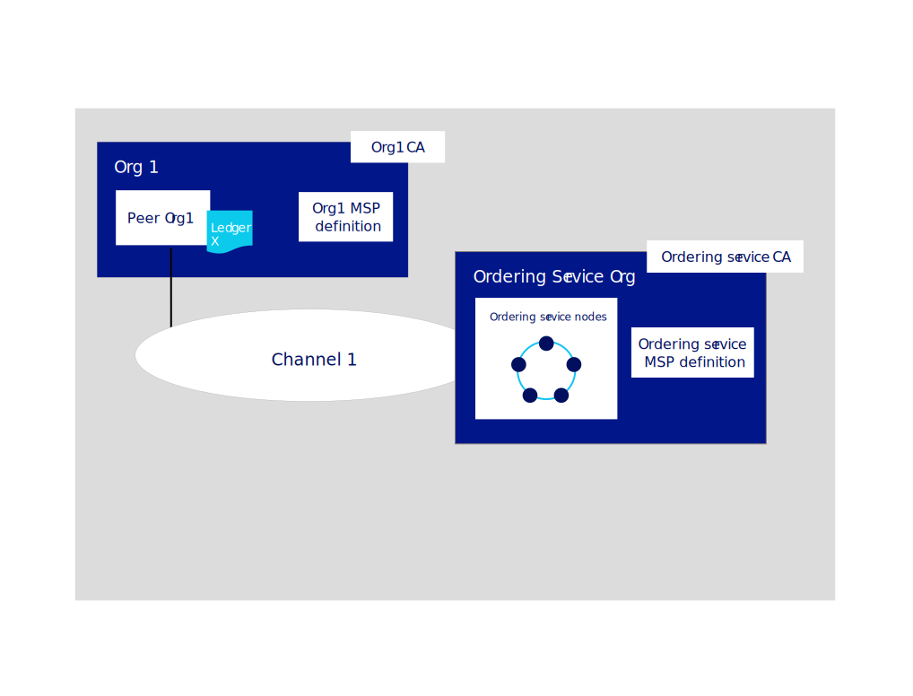

---

copyright:
  years: 2019
lastupdated: "2019-06-18"

keywords: getting started tutorials, create a CA, enroll, register, create an MSP, wallet, create a peer, create ordering service, Raft

subcollection: blockchain

---

{:external: target="_blank" .external}
{:shortdesc: .shortdesc}
{:screen: .screen}
{:codeblock: .codeblock}
{:note: .note}
{:important: .important}
{:tip: .tip}
{:pre: .pre}

# Build a network tutorial
{: #ibp-console-build-network}

{{site.data.keyword.blockchainfull}} Platform is a blockchain-as-a-service offering that enables you to develop, deploy, and operate blockchain applications and networks. You can learn more about blockchain components and how they work together by visiting the [Blockchain component overview](/docs/services/blockchain/blockchain_component_overview.html#blockchain-component-overview). This tutorial is the first part in the [sample network tutorial series](/docs/services/blockchain/howto/ibp-console-build-network.html#ibp-console-build-network-sample-tutorial) and describes how to use the {{site.data.keyword.blockchainfull_notm}} Platform console to build a fully functional network on Kubernetes cluster deployed into the cloud infrastructure of our choosing.
{:shortdesc}


If you are using the beta trial version of {{site.data.keyword.blockchainfull_notm}} Platform for {{site.data.keyword.cloud_notm}}, it is likely that some panels in your console will not match the current documentation, which is kept up to date with the generally available (GA) service instance. If you have a beta service instance and want to gain the benefits of all the latest functionality, you are encouraged at this time to provision a GA service instance by following instructions in [Getting started with {{site.data.keyword.blockchainfull_notm}} Platform for {{site.data.keyword.cloud_notm}}](/docs/services/blockchain/howto/ibp-v2-deploy-iks.html#ibp-v2-deploy-iks).
{: important}

**Target audience:** This topic is designed for network operators who are responsible for creating, monitoring, and managing the blockchain network.

If you have not already used the {{site.data.keyword.blockchainfull_notm}} Platform console to deploy components to a Kubernetes cluster by using {{site.data.keyword.cloud_notm}} Kubernetes Service, see [Getting started with {{site.data.keyword.blockchainfull_notm}} Platform for {{site.data.keyword.cloud_notm}}](/docs/services/blockchain/howto/ibp-v2-deploy-iks.html#ibp-v2-deploy-iks), if you are using an {{site.data.keyword.cloud_notm}} cluster, or [Getting started with {{site.data.keyword.blockchainfull_notm}} Platform for Multicloud](/docs/services/blockchain/get-started-console-icp.html#get-started-console-icp), if you are using {{site.data.keyword.cloud_notm}} Private to deploy on a cloud provider other than {{site.data.keyword.cloud_notm}}. Note that the console itself does not reside in your cluster. It is a tool you can use to deploy components into your cluster.

Whether you deploy components to a paid or free Kubernetes cluster, pay close attention to the resources at your disposal when you choose to deploy nodes and create channels. It is your responsibility to manage your Kubernetes cluster and deploy additional resources if necessary. While components will successfully deploy to an {{site.data.keyword.cloud_notm}} free cluster, the more components you add, the slower your components will run. For more information about component sizings and how the console interacts with your {{site.data.keyword.cloud_notm}} Kubernetes Service cluster, see [Allocating resources](/docs/services/blockchain/howto/ibp-console-govern.html#ibp-console-govern-iks-console-interaction). If you are using {{site.data.keyword.cloud_notm}} Private to deploy onto a different cloud provider, you will have to consult the documentation for that provider to learn how to monitor your resources there.

## Sample network tutorial series
{: #ibp-console-build-network-sample-tutorial}

This three-part tutorial series guides you through the process of creating and interconnecting a relatively simple, multi-node Hyperledger Fabric network by using the {{site.data.keyword.blockchainfull_notm}} Platform console to deploy a network into your Kubernetes cluster and install and instantiate a smart contract. Note that while this tutorial will show how this process works with a paid {{site.data.keyword.cloud_notm}} Kubernetes cluster, the same basic flow applies to free clusters, albeit with a few limitations (for example, you cannot size or resize nodes in a free cluster).

The process for creating and managing components described in these tutorials also applies to deployments on other cloud providers using {{site.data.keyword.cloud_notm}} Private.
{: important}

* **Build a network tutorial** This tutorial guides you through the process of hosting a network by creating two organizations, one for your peer and another for your ordering service, and a channel. Use this tutorial if you want to form a blockchain consortium by creating an ordering service and adding organizations.
* [Join a network tutorial](/docs/services/blockchain/howto/ibp-console-join-network.html#ibp-console-join-network) guides you through the process of joining an existing network by creating a peer and joining it to an existing channel. Use this tutorial if you either do not intend to host a network by creating an ordering service, or want to learn the process for joining other networks.
* [Deploy a smart contract on the network](/docs/services/blockchain/howto/ibp-console-smart-contracts.html#ibp-console-smart-contracts) shows how to write a smart contract and deploy it on a network.


### The structure of this network
{: #ibp-console-build-network-structure}

If you complete all the steps in the **Build a network** and **Join a network** tutorials, your network will resemble the one in the illustration below:

{: caption="Figure 1. Sample basic network structure" caption-side="bottom"}

This configuration is sufficient both for testing applications and smart contracts and as a guide for building components and joining production networks that will suit your own use case. The network contains the following components:

* **Two peer organizations**: `Org1` and `Org2`  
  The tutorial series describe how to create two peer organizations and two associated peers. Think of organizations on a blockchain network to be like two different banks that need to transact with each other. We will create the definitions of `Org1` and `Org2`.
* **One ordering service organization**: `Ordering Service`  
  Because we are building a distributed ledger, the peers and ordering service should be part of separate organizations. Therefore, a separate organization is created for the ordering service. Among other things, an ordering service orders the blocks of transactions that are sent to the peers to be written to their ledgers and become the blockchain. We will create the definition of the `Ordering Service` organization.
* **Three Certificate Authorities (CAs)**: `Org1 CA, Org2 CA, Ordering Service CA`   
  A CA is the node that issues certificates to both the users and the nodes associated with an organization. Because it’s a best practice to deploy one CA per organization, we will deploy three CAs in total: one for each peer organization and one for the ordering service organization. These CAs will also create the definition of each organization, which is encapsulated by a Membership Service Provider (MSP). A TLS CA is automatically deployed together with each organization CA and provides the TLS certificates that are used for communication between nodes. For more information, see [Using your TLS CA](/docs/services/blockchain/howto/ibp-console-identities.html#ibp-console-identities-tlsca).
* **One ordering service:** `Ordering Service`  
  While deployments running on a paid cluster have the option to deploy either a one node ordering service or a crash fault tolerant five node ordering service, free clusters only have the option of running a single node. The five node ordering service uses an implementation of the Raft protocol (for more information about Raft, see [The Ordering Service](https://hyperledger-fabric.readthedocs.io/en/release-1.4/orderer/ordering_service.html#raft){: external} and is the deployment option this tutorial will feature. Currently, only one ordering service organization per ordering service is supported, regardless of the number of ordering nodes associated with that organization. This ordering service will add peer organizations to its "consortium", which is the list of peer organizations that can create and join channels. If you want to create a channel that has organizations deployed in different clusters, which is how most production networks will be structured, the ordering service admin will need to import a peer organization that has been deployed in another console into their console. This allows the peer organization to join the channel that is hosted on that ordering service.
* **Two peers:** `Peer Org1` and `Peer Org2`  
  The ledger, `Ledger x` in the illustration above, is maintained by distributed peers. These peers are deployed using [Couch DB](https://hyperledger-fabric.readthedocs.io/en/release-1.4/couchdb_as_state_database.html){: external}) as the state database in a separate container associated with the peer. This database holds the current value of all "state" (as represented by key-value pairs). For example, saying that `Org1` (a value) is the current owner of a bank asset (the key). The blockchain, the list of transactions, is stored locally on the peer.
* **One channel**: `channel1`  
  Channels allow sets of organizations to transact without exposing their data to organizations that are not members of the channel. Each channel has its own ledger, collectively managed by the peers joined to that channel. The tutorial creates one channel joined by both organizations, and shows how to instantiate a smart contract on the channel that the organizations can use to transact.

This configuration isn't mandatory. The {{site.data.keyword.blockchainfull_notm}} Platform is highly customizable. If you have resources available in your Kubernetes cluster, you can use the console to deploy components in an endless array of configurations. This tutorial provides the steps you need to build your own network, with references to topics that provide a deeper dive into the {{site.data.keyword.blockchainfull_notm}} Platform and the console.

In this **Build a network** tutorial, we build only a portion of the network above, a simple network that can be used to host an ordering service and a single peer organization and peer on a single channel. The following illustration shows the portion of the network above that we will build:
{: caption="Figure 2. Simple network structure" caption-side="bottom"}

This configuration is useful for quickly getting started and testing a smart contract but is not very meaningful until you add other organizations to transact with, creating a truly distributed network. Therefore, in the subsequent [Join a network](/docs/services/blockchain/howto/ibp-console-join-network.html#ibp-console-join-network) tutorial, we show you how to create additional peer organizations and peers, and how to add a new organization to the channel.

Throughout this tutorial we supply **recommended values** for the fields in the console. This allows the names and identities to be easier to recognize in the tabs and drop-down lists. These values are not mandatory, but you will find them helpful, especially since you will have to remember certain values like IDs and secrets of registered users that you input in previous steps. As these values are not stored in the console, if you forget them, you will have to register additional users and start the process over again. We provide a table of the recommended values after each task and recommend that if you do not use the recommended values that you record your values as you proceed through the tutorial.
{:tip}

## Step one: Create a peer organization and a peer
{: #ibp-console-build-network-create-peer-org1}

For each organization that you want to create with the console, you should deploy at least one CA. A CA is the node that issues certificates to all network participants (peers, ordering services, clients, admins, and so on). These certificates, which include a signing certificate and private key, allow network participants to communicate, authenticate, and ultimately transact. These CAs will create all of the identities and certificates that belong to your organization, in addition to defining the organization itself. You can then use those identities to deploy nodes, create admin identities, and submit transactions. For more information about your CA and the identities that you will need to create, see [Managing identities](/docs/services/blockchain/howto/ibp-console-identities.html#ibp-console-identities).

In this tutorial, we create two organizations, one which will own a peer and another which will own an ordering service. Each organization needs a CA to issue its certificates, therefore we need to create **two CAs**. For the purpose of this tutorial, **we will create only one CA at a time**.

Watch the following [video](http://ibm.biz/BlockchainPlatformSeries2){: external} to learn about the process to create the peer's organization and the peer.


### Creating your peer organization's CA
{: #ibp-console-build-network-create-CA-org1CA}

As part of this tutorial, your CA issues the certificates and private keys for your users and nodes. These identities are not managed by {{site.data.keyword.IBM_notm}} and the keys are not stored in the console. They are only stored in your browser local storage. Therefore, make sure to export your identities and the MSP of your organization. If you attempt to access the console from a different machine or a different browser, you will need to import these identities and organization definitions.
{:important}

To create the CA that will issue certificates for your first organization, perform the following steps in your console:

1. Navigate to the **Nodes** tab on the left and click **Add Certificate Authority**. The side panels will allow you to customize the CA that you want to create and the organization that this CA will issue keys for.
2. In this tutorial, we're creating nodes, so make sure the option to **Create** a Certificate Authority is selected. Then click **Next**.
3. Use the second side panel to give your CA a **display name**. Our recommended value for this CA is `Org1 CA`.
4. On the next panel, give your CA admin credentials by specifying a **CA administrator enroll ID** of `admin` and a secret of `adminpw`. Again, these are **recommended values**.
5. If you are using a paid cluster, you have the opportunity to configure resource allocation for the node. For purposes of this tutorial, accept all the defaults and click **Next**. If you want to learn more about how to allocate resources in {{site.data.keyword.cloud_notm}} for your node, see this topic on [Allocating resources](/docs/services/blockchain?topic=blockchain-ibp-console-govern#ibp-console-govern-allocate-resources). If you are using a free cluster, you will see the **Summary** page.
6. Review the Summary page, then click **Add certificate authority**.

**Task: Creating the peer organization CA**

  | **Field** | **Display name** | **Enroll ID** | **Secret** |
  | ------------------------- |-----------|-----------|-----------|
  | **Create CA** | Org1 CA  | admin | adminpw |

  *Figure 3. Creating the peer organization CA*

After you deploy the CA, you will use it when you create your organization MSP, register users, and your **peer**.

Advanced users may already have their own CA, and not want to create a new CA in the console. If your existing CA can issue certificates in `X.509` format, you can use your own external CA instead of creating a new one here. See this topic on [Using certificates from an external CA with your peer or ordering service](/docs/services/blockchain/howto/ibp-console-build-network.html#ibp-console-build-network-third-party-ca) for more information.

### Using your CA to register identities
{: #ibp-console-build-network-use-CA-org1}

Each node or application that you want to create needs a certificate and private key to participate in the blockchain network. You also need to create admin identities for these nodes and applications so that you can manage them from the console. We will go through this process twice, once for each CA that we create. And for each CA, you will create two identities:

* **An organization admin**: This identity allows you to operate nodes using the platform console.
* **A peer identity**: This is the identity of the peer itself. Whenever a peer performs an action (for example, endorsing a transaction) it will sign using its certificate.

Depending on your cluster type, deployment of the CA can take up to ten minutes. When the CA is first deployed (or when the CA is otherwise unavailable), the box in the tile for the CA will be grey box. When the CA has successfully deployed and is running, this box will be green, indicating that it is "Running" and can be used to register identities. Before proceeding with the steps below to register identities, you must wait until the CA status is "Running".
{:important}

Once the CA is running, as indicated by the green box in the tile, generate these certificates by completing the following steps:

1. Click on the `Org1 CA` and ensure the `admin` identity that you created for the CA is visible in the table. Then click the **Register User** button.
2. First we'll register the organization admin, which we can do by giving an **Enroll ID** of `org1admin` and a **secret** of `org1adminpw`. Then set the `Type` for this identity as `client` (admin identities should always be registered as `client`, while node identities should always be registered using the `peer` type). You can ignore the **Maximum enrollments** field. If you want to learn more about enrollments, see [Registering identities](/docs/services/blockchain/howto/ibp-console-identities.html#ibp-console-identities-register). Click **Next**.
3. For the purpose of this tutorial, we do not need to use **Add Attribute**. If you want to learn more about identity attributes, see [Registering identities](/docs/services/blockchain/howto/ibp-console-identities.html#ibp-console-identities-register).
4. After the organization admin has been registered, repeat this same process for the identity of the peer (also using the `Org1 CA`). For the peer identity, give an enroll ID of `peer1` and a secret of `peer1pw`. This is a node identity, so select `peer` as the **Type**. You can ignore the **Maximum enrollments** field and, on the next panel, do not assign any **Attributes**, as before.

Registering these identities with the CA is only the first step in **creating** an identity. You will not be able to use these identities until they have been **enrolled**. For the `org1admin` identity, this will happen during the creation of the MSP, which we will see in the next step. In the case of the peer, it happens during the creation of the peer.
{:note}

**Task: Register users**

  |  **Field** | **Description** | **Enroll ID** | **Secret** |
  | ------------------------- |-----------|-----------|-----------|-----------|
  | **Register users** |  Org1 admin | org1admin | org1adminpw |
  | | Peer identity |  peer1 | peer1pw |

  *Figure 4. Using your CA to register users*

### Creating the peer organization MSP definition
{: #ibp-console-build-network-create-peers-org1}

Now that we have created the peer's CA and used it to **register** identities for the `Org1` admin and for the peer we'll be associating with `Org1`, we need to create a formal definition of the peer's organization, which is known as an MSP. Note that many peers can belong to an organization. **You do not need to create a new organization every time you create a peer**. Because this is the first time that we go through the tutorial, we will create the MSP ID for this organization. During the process of creating the MSP, we will enroll the `org1admin` identity and add it to our Wallet.

1. Navigate to the **Organizations** tab in the left navigation and click **Create MSP definition**.
2. Give your MSP the display name `Org1 MSP` and an MSP ID of `org1msp`. If you want to specify your own MSP ID in this field, make sure to follow the specifications about the limitations to this name from the tool tip.
3. Under **Root Certificate Authority details**, specify the CA you used to register the identities in the previous step. If this is your first time through this tutorial, you should only see one: `Org1 CA`.
4. The **Enroll ID** and **Enroll secret** fields below this will auto populate with the enroll ID and secret for the first user that you created with your CA: `admin` and `adminpw`. However, using this identity would give your organization the same admin identity as your CA, which for security reasons is not recommended. Instead, select the enroll ID you created for your organization admin from the drop-down list, `org1admin`, and enter its associated secret, `org1adminpw`. Then, give this identity a display name, `Org1 Admin`.
5. Click the **Generate** button to enroll this identity as the admin of your organization and export the identity to the Wallet, where it will be used when creating the peer and creating channels.
6. Click **Export** to export the admin certificates to your file system. As we said above, this identity is not stored in your console or managed by {{site.data.keyword.IBM_notm}}. It is only stored in local browser storage. If you change browsers, you will need to import this identity into your Wallet to be able to administer the peer.
7. Click **Create MSP definition**.

**Task: Create the peer organization MSP**

  |  | **Display name** | **MSP ID** | **Enroll ID**  | **Secret** |
  | ------------------------- |-----------|-----------|-----------|-----------|
  | **Create Organization** | Org1 MSP | org1msp |||
  | **Root CA** | Org1 CA ||||
  | **Org Admin Cert** | |  | org1admin | org1adminpw |
  | **Identity** | Org1 Admin |||||

  *Figure 5. Create the peer organization MSP definition*

After you have created the MSP, you should be able to see the peer organization admin in your **Wallet**, which can be accessed by clicking on the **Wallet** in the left navigation.

**Task: Check your Wallet**

  | **Field** |  **Display name** | **Description** |
  | ------------------------- |-----------|----------|
  | **Identity** | Org1 Admin | Org1 admin identity |

  *Figure 6. Check your Wallet*

For more information about MSPs, see [managing organizations](/docs/services/blockchain/howto/ibp-console-organizations.html#ibp-console-organizations).

Exporting your organization admin identity is important because you are responsible for managing and securing these certificates. If you switch browsers, you will need to import this admin identity otherwise you will not be able to operate Org1.
{:important}

### Creating a peer
{: #ibp-console-build-network-peer-create}

After you have [created the Org1 CA](/docs/services/blockchain/howto/ibp-console-build-network.html#ibp-console-build-network-create-CA-org1CA), used it to register Org1 identities, and created the [Org1 MSP](/docs/services/blockchain/howto/ibp-console-build-network.html#ibp-console-build-network-create-peers-org1), you're ready to create a peer for Org1.

#### What role do peers play?
{: #ibp-console-build-network-peer-role}

It's important to remember that organizations themselves do not maintain ledgers. Peers do. Organizations also use peers to sign transaction proposals and approve channel configuration updates. Because having at least two peers per organization on a channel makes them highly available, having three peers per organization joined to a channel is considered a best practice for production level implementations because it ensures high availability even while a peer is down for maintenance. In this tutorial though, we'll only show the process for creating a single peer. You can replicate the process to suit your own business needs.

From a resource allocation perspective, it is possible to join the same peers to multiple channels. The design of the peer ensures that the data from one channel cannot pass to another through the peer. However, because the peer will store a separate ledger for each channel, it is necessary to ensure that the peer has enough processing power and storage to handle the transaction and data load.

#### Deploying your peer
{: #ibp-console-build-network-deploy-peer-role}

Use your console to perform the following steps:

1. On the **Nodes** page, click **Add peer**.
2. Make sure the option to **Create** a peer is selected. Then click **Next**.
3. Give your peer a **Display name** of `Peer Org1`. For the purpose of this tutorial, do not choose to use an external CA for your peer, though if you want more information, see [Using certificates from an external CA](#ibp-console-build-network-third-party-ca). Click **Next**.
4. On the next screen, select `Org1 CA`, as this is the CA you used to register the peer identity. Select the **Enroll ID** for the peer identity that you created for your peer from the drop-down list, `peer1`, and enter its associated **secret**, `peer1pw`. Then, select `Org1 MSP` from the drop-down list and click **Next**.
5. The next side panel asks for TLS CA information. When you created the CA, a TLSCA was created alongside it. This CA is used to create certificates for the secure communication layer for nodes. Therefore, select the **Enroll ID** for the peer identity that you created for your peer from the drop-down list, `peer1`, and enter the associated **secret**, `peer1pw`. The **TLS Certificate Signing Request (CSR) hostname** is an option available to advanced users who want specify a custom domain name that can be used to address the peer endpoint. Custom domain names are not a part of this tutorial, so leave the **TLS CSR hostname** blank for now.
6. If you are using a paid cluster, on the next panel, you have the opportunity to configure resource allocation for the node. For purposes of this tutorial, you can accept all the defaults and click **Next**. If you want to learn more about how to allocate resources in {{site.data.keyword.cloud_notm}} for your node, see this topic on [Allocating resources](/docs/services/blockchain?topic=blockchain-ibp-console-govern#ibp-console-govern-allocate-resources). If you are using a free {{site.data.keyword.cloud_notm}} cluster, you will see the **Associate an identity** panel.
7. The last side panel asks you to **Associate an identity** to make it the admin of your peer. For the purpose of this tutorial, make your organization admin, `Org1 Admin`, the admin of your peer as well. It is possible to register and enroll a different identity with the `Org1 CA` and make that identity the admin of your peer, but this tutorial uses the `Org1 Admin` identity.
8. Review the summary and click **Add peer**.

**Task: Deploying a peer**

  |  | **Display name** | **MSP ID** | **Enroll ID** | **Secret** |
  | ------------------------- |-----------|-----------|-----------|-----------|
  | **Create Peer** | Peer Org1 | org1msp |||
  | **CA** | Org1 CA ||||
  | **Peer Identity** | |  | peer1 | peer1pw |
  | **Administrator certificate** | org1msp ||||
  | **TLS CA** | Org1 CA ||||
  | **TLS CA ID** | || peer1 | peer1pw |
  | **Associate identity** | Org1 Admin |||||

  *Figure 7. Deploying a peer*

In a production scenario, it is recommended that each organization deploy three peers to each channel. These can be the same three peers joined to different channels or different peers. It is up to the organization. This is to allow one peer to go down (for example, during a maintenance cycle) and still maintain highly available peers. To deploy more than one peer for an organization, use the same CA you used to register your first peer identity. In this tutorial, that would be `Org1 CA`. Then, register a new peer identity using a distinct enroll ID and secret. For example, `org1secondpeer` and `org1secondpeerpw`. Then, when creating the peer, give this enroll ID and secret. As this peer is still associated with Org1, choose `Org1 CA`, `Org1 MSP`, and `Org1 Admin` from the drop-down lists. You may choose to give this new peer a different admin, which can be registered and enrolled with `Org1 CA`, but this optional. This tutorial series will only show the process for creating a single peer for each peer organization.
{:tip}

## Step two: Create the ordering service
{: #ibp-console-build-network-create-orderer}

In other distributed blockchains, such as Ethereum and Bitcoin, there is no central authority that orders transactions and sends them out to peers. Hyperledger Fabric, the blockchain that the {{site.data.keyword.blockchainfull_notm}} Platform is based on, works differently. It features a node, or a cluster of nodes, called an **ordering service**.

The ordering service is a key component in a network because it performs a few essential functions:

- They literally **order** the blocks of transactions that are sent to the peers to be written to their ledgers. This process is called "ordering".
- They maintain the **ordering system channel**, the place where the **consortium**, the list of peer organizations permitted to create channels, resides. A consortium is essentially a multi-tenancy vehicle, and a single ordering service by design can host multiple consortia.
- They **enforce the policies** decided by the consortium or the channel administrators. These policies dictate everything from who gets to read or write to a channel, to who can create or modify a channel. For example, when a network participant asks to modify a channel or consortium policy, the ordering service processes the request to see if the participant has the proper administrative rights for that configuration update, validates it against the existing configuration, generates a new configuration, and relays it to the peers.

For more information about ordering services and the role they play in networks based on Hyperledger Fabric, see [The Ordering Service](https://hyperledger-fabric.readthedocs.io/en/release-1.4/orderer/ordering_service.html){: external}.

In a paid cluster, you have the option between creating a one node ordering service (sufficient for testing purposes) and a crash fault tolerant ordering service featuring five nodes tied to a single organization. In a free cluster, you will only be able to create a single node ordering service. In this tutorial, we will show the five node ordering service.

However, just as with the peer, before we can create an ordering service, we need to create a CA to supply the identities and the MSP of our ordering service organization.

Watch the following [video](http://ibm.biz/BlockchainPlatformSeries3){: external} to learn about the process to create the ordering service's organization and the ordering service.

### Ordering in the console
{: #ibp-console-build-network-ordering-console}

In this release, distributed ordering services, in which multiple organizations contribute nodes to an ordering service, are not supported. Every ordering node in the ordering service will be administered by a single organization.

The production level ordering service available is a crash fault tolerant (CFT) ordering service based on an implementation of Raft protocol in `etcd`. Raft follows a “leader and follower” model, where a leader node is elected (per channel) and its decisions are replicated by the followers. Raft ordering services should be easier to set up and manage than Kafka-based ordering services, and their design allows different organizations to contribute nodes to a distributed ordering service. For more information about Raft, see [The Ordering Service](https://hyperledger-fabric.readthedocs.io/en/release-1.4/orderer/ordering_service.html#raft){: external}.

Currently, the only crash fault tolerant configuration of ordering nodes currently available is **five** nodes. While it is possible to create a crash fault tolerant ordering service with as little as three nodes, this configuration incurs risk. If a node goes down, for example during a maintenance cycle, only two nodes would be left. If another node was lost during this cycle **for any reason**, only one node would left. In that state, a one node ordering service when you started with three, you would no longer have a majority of nodes available, also known as a "quorum". Without a quorum, no transactions can be pushed. The channel would cease to function.

With five nodes, you can lose two nodes and still maintain a quorum, meaning that you can undergo a maintenance cycle while maintaining high availability. As a result, paid clusters will only have the choice between one node and five nodes. Production networks should choose the five node option, as a one node ordering service is, by definition, not crash fault tolerant.

In this tutorial, we will create a five node ordering service.

### Creating your ordering service organization CA
{: #ibp-console-build-network-create-orderer-ca}

The process for creating a CA for an ordering service is identical to creating it for a peer.

1. Navigate to the **Nodes** tab and click **Add Certificate Authority**.
2. In this tutorial, we're creating nodes, so make sure the option to **Create** a Certificate Authority is selected. Then click **Next**
3. Give this CA a unique display name, `Ordering Service CA`.
4. You're free to reuse the **CA administrator enroll ID** of `admin` and a secret of `adminpw`. As this is a different CA, this identity is distinct from the CA admin identity for created for the `Org1 CA`, even though the ID and secret are identical.
5. If you are using a paid cluster, on the next panel, you have the opportunity to configure resource allocation for the CA. For purposes of this tutorial, accept all the defaults and click **Next**. If you want to learn more about how to allocate resources to {{site.data.keyword.cloud_notm}} for your node, see this topic on [Allocating resources](/docs/services/blockchain?topic=blockchain-ibp-console-govern#ibp-console-govern-allocate-resources). If you are using a free cluster, you will see the **Summary** page.
6. Review the Summary page, then click **Add certificate authority**.

As with the peer, advanced users may already have their own CA and not want to create a new CA using the console. If your existing CA can issue certificates in `X.509` format, you can use your own external CA instead of creating a new one here. See this topic on [Using certificates from an external CA with your peer or ordering service](/docs/services/blockchain/howto/ibp-console-build-network.html#ibp-console-build-network-third-party-ca) for more information.

### Using your CA to register ordering service node and ordering service admin identities
{: #ibp-console-build-network-use-CA-orderer}

As we did with the peer, we need to register two identities with our ordering service CA. After selecting your CA, you will need to register an admin for our ordering service organization and an identity for the ordering service itself. As before, you should see an identity on the `Ordering Service CA` tab; it's the admin that you created for the CA.

Depending on your cluster type, deployment of the CA can take up to ten minutes. When the CA is first deployed (or when the CA is otherwise unavailable), the box in the tile for the CA will be grey box. When the CA has successfully deployed and is running, this box will be green, indicating that it is "Running" and can be used to register identities. Before proceeding with the steps below to register identities, you must wait until the CA status is "Running".
{:important}

Once the CA is running, as indicated by the green box in the tile for the `Ordering Service CA`, generate these certificates by completing the following steps:

1. Click on the `Ordering Service CA` in the **Nodes** tab and ensure the `admin` identity that you created for the CA is visible in the table. Then click the **Register User** button.
2. First we'll register the organization admin, which we can do by giving an **Enroll ID** of `OSadmin` and a **secret** of `OSadminpw`. Then set the `Type` for this identity as `client` (admin identities should always be registered as `client`, while node identities should always be registered using the `peer` type). You can ignore the **Maximum enrollments** field. If you want to learn more about enrollments, see [Registering identities](/docs/services/blockchain/howto/ibp-console-identities.html#ibp-console-identities-register). Click **Next**.
3. For the purpose of this tutorial, we do not need to use **Add Attribute**. If you want to learn more about identity attributes, see [Registering identities](/docs/services/blockchain/howto/ibp-console-identities.html#ibp-console-identities-register).
4. After the organization admin has been registered, repeat this same process for the identity of the ordering service (also using the `Ordering Service CA`). For the ordering service node identities, give an enroll ID of `OS1` and a secret of `OS1pw`. This is a node identity, so select `peer` as the **Type**. You can ignore the **Maximum enrollments** field and, on the next panel, do not assign any **Attributes**, as before.

**Task: Create a CA and register users**

  | **Field** | **Description** | **Enroll ID** | **Secret** |
  | ------------------------- |-----------|-----------|-----------|-----------|
  | **Create CA** | Ordering Service CA | admin | adminpw |
  | **Register users** | Ordering service admin | OSadmin | OSadminpw |
  |  | Ordering service node identity |  OS1 | OS1pw |

*Figure 8. Create a CA and register users*

For the purpose of this tutorial, we are only creating one node identity. This identity will be used by all five nodes we will deploy to create the ordering service. While you would not want to do this in a multi-organizational ordering service, it is acceptable given that all of the ordering nodes are owned by the same organization.

### Creating the ordering service organization MSP definition
{: #ibp-console-build-network-create-orderer-org-msp}

Create your ordering service organization MSP definition and specify the admin identity for the organization. After we have registered the ordering service admin and ordering service users, we need to create the MSP ID and enroll the `OSadmin` user that we registered as the admin of our organization.

1. Navigate to the **Organizations** tab in the left navigation and click **Create MSP definition**.
2. Give your MSP definition the display name `Ordering Service MSP` and an MSP ID of `osmsp`. If you choose a different MSP ID, make sure to follow the specifications about the limitations to this name from the tool tip.
3. Under **Root Certificate Authority details**, select the `Ordering Service CA` we created.
4. The **Enroll ID** and **Enroll secret** fields below this will auto populate with the enroll ID and secret for the first user that you created with your CA: `admin` and `adminpw`. However, using this identity would make your organization the same identity as your CA identity, which for security reasons is not recommended. Instead, select the enroll ID that you created for your organization admin from the drop-down list, `OSadmin`, and enter its associated secret, `OSadminpw`. Then, give this identity a display name, `Ordering Service Admin`.
5. Click the **Generate** button to enroll this identity as the admin of your organization and export the identity to the Wallet.
6. Click **Export** to export the admin certificates to your file system. As we said above, this identity is not stored in your console or managed by {{site.data.keyword.IBM_notm}}. It is only stored in your browser. If you change browsers, you will need to import this identity to be able to administer the ordering service.
7. Click **Create MSP definition**.

**Task: Create the ordering service organization MSP definition**

  |  | **Display name** | **MSP ID** | **Enroll ID**  | **Secret** |
  | ------------------------- |-----------|-----------|-----------|-----------|
  | **Create Organization** | Ordering Service MSP | osmsp |||
  | **Root CA** | Ordering Service CA ||||
  | **Org Admin Cert** | |  | OSadmin | OSadminpw |
  | **Identity** | Ordering Service Admin |||||

  *Figure 9. Create the ordering service organization MSP definition*

After you have created the MSP, you should be able to see the ordering service organization admin in your **Wallet**, which can be accessed by clicking on the **Wallet** in the left navigation.

**Task: Check your Wallet**

  | **Field** |  **Display name** | **Description** |
  | ------------------------- |-----------|----------|
  | **Identity** | Org1 Admin | Org1 admin identity |
  | **Identity** | Ordering Service Admin | Ordering service admin identity |

  *Figure 10. Create the ordering service organization MSP definition*

For more information about MSPs, see [managing organizations](/docs/services/blockchain/howto/ibp-console-organizations.html#ibp-console-organizations).

Exporting your organization admin identity is important because you are responsible for managing and securing these certificates. If you export the ordering service and the ordering service MSP definition, they can be imported into another console where another operator can create new channels on the ordering service or join peers to the channel.
{:important}

### Deploy the ordering nodes
{: #ibp-console-build-network-create-an-orderer}

Perform the following steps from your console:

1. On the **Nodes** page, click **Add ordering service**.
2. Make sure the option to **Create** an ordering service is selected. Then click **Next**.
3. Give your ordering service a **Display name** of `Ordering Service` and, if in a paid cluster, choose whether you want your ordering service to have one node (sufficient for testing) or five nodes (good for production). Choose **five nodes**. And do not choose to use an external CA. This is an advanced option. For the purpose of this tutorial, do not choose to use an external CA for your ordering service, though if you want more information, see [Using certificates from an external CA](#ibp-console-build-network-third-party-ca). Click **Next**.
4. On the next panel, select `Ordering Service CA` as your CA. Then, select the **enroll ID** for the node identity that you created for your ordering service from the drop-down list, `OS1`, and enter the associated **secret**, `OS1pw`. Then, select your MSP, `Ordering Service MSP` from the drop-down list.
5. The next side panel asks for TLS CA information. When you created the CA, a TLS CA was created alongside it. This CA is used to create certificates for the secure communication layer for nodes. Therefore, select the **enroll ID** for the ordering service identity that you created from the drop-down list, `OS1`, and enter its associated **secret**, `OS1pw`. The **TLS Certificate Signing Request (CSR) hostname** is an option available to advanced users who want specify a custom domain name that can be used to address the ordering service endpoint. Custom domain names are not a part of this tutorial, so leave the **TLS CSR hostname** blank for now.
6. If you are using a paid cluster, on the next panel, you have the opportunity to configure resource allocation for the node. For purposes of this tutorial, you can accept all the defaults and click **Next**. The selections you make here are applied to all five ordering nodes. If you want to learn more about how to allocate resources in {{site.data.keyword.cloud_notm}} for your node, see this topic on [Allocating resources](/docs/services/blockchain?topic=blockchain-ibp-console-govern#ibp-console-govern-allocate-resources).
7. The **Associate identity** step allows you to choose an admin for your ordering service. Select `Ordering Service Admin` as before and click **Next**.
8. Review the Summary page and click **Add ordering service**.

**Task: Create an ordering service**

  |  | **Display name** | **MSP ID** | **Enroll ID** | **Secret** |
  | ------------------------- |-----------|-----------|-----------|-----------|
  | **Create ordering service** | Ordering Service | osmsp |||
  | **CA** | Ordering Service CA ||||
  | **Ordering Service Identity** | |  | OS1 | OS1pw |
  | **Administrator certificate** | Ordering Service MSP ||||
  | **TLS CA** | Ordering Service CA ||||
  | **TLS CA ID** | || OS1 | OS1pw |
  | **Associate identity** | Ordering Service Admin |||||

  *Figure 11. Create an ordering service*

After the ordering service has been created, you are able to see it on the **Nodes** panel.

## Step three: Join the consortium hosted by the ordering service
{: #ibp-console-build-network-add-org}

As we noted earlier, a peer organization must be known to the ordering service before it can create or join a channel (this is also known as joining the "consortium", the list of organizations known to the ordering service). This is because channels are, at a technical level, **messaging paths** between peers through the ordering service. Just as a peer can be joined to multiple channels without information passing from one channel to another, so too can an ordering service have multiple channels running through it without exposing data to organizations on other channels.

Because only ordering service admins can add peer organizations to the consortium, you will either need to **be** the ordering service admin or **send** MSP information to the ordering service admin.

Watch the following [video](http://ibm.biz/BlockchainPlatformSeries4){: external} to learn about the process to add the organization to the consortium, create the channel, and join your peer to the channel.

Because you created the ordering service admin using the console, this process is relatively straightforward:
1. Navigate to the **Nodes** tab.
2. Scroll down to the ordering service you created and click on it to open it.
3. Under **Consortium Members**, click **Add organization**.
4. From the drop-down list, select `Org1 MSP`, as this is the MSP that represents the peer's organization: `Org1`.
5. Click **Add organization**.

When this process is complete, it is possible for `Org1` to create or join a channel hosted on your `Ordering Service`.

In this tutorial, we can easily access the `Org1 MSP` because both the peer organization and the ordering service organization were created in the same console. In a production scenario, the MSP definitions of other organization would be created by different network operators in their own cluster using their own {{site.data.keyword.blockchainfull_notm}} console. In those cases, when the organization wants to join your consortium, the organization MSP definition of the organization will need to be sent to your console in an out of band operation. Additionally, you will need to export your ordering service and send it to them so they can import it into their console and join a peer to a channel (or create a new channel). This process is described in the Join a network tutorial under [Exporting your organization information](/docs/services/blockchain/howto/ibp-console-join-network.html#ibp-console-join-network-add-org2-remote).

## Step four: Create a channel
{: #ibp-console-build-network-create-channel}

For information on how to update a channel, see [Updating a channel configuration](/docs/services/blockchain/howto/ibp-console-govern.html#ibp-console-govern-update-channel).

Although the members of a network are usually related business entities that want to transact with each other, there might be instances when subsets of the members want to transact without the knowledge of the others. This is possible by creating a **channel** on which these transactions will take place. Channels replicate the structure of a blockchain network in that they contain members, peers, an ordering service, a ledger, policies, and smart contracts. But by restricting the membership, and even the knowledge of the channel, to particular subsets of the network membership, channels ensure that network members can leverage the overall structure of the network while maintaining privacy, where needed.

As noted above, to join a peer from `Org1` to a channel, `Org1` must first be added to the consortium. If the organization is not a member of the consortium at channel creation time, it's possible to create the channel and add the organization later by clicking the **Settings** button on the page of the relevant channel and going through the **Update Channel** flow.

For more information about channels and how to use them, see the [Hyperledger Fabric documentation](https://hyperledger-fabric.readthedocs.io/en/release-1.4/channels.html){: external}.

Watch Video 3 above to learn about the process to create channel and join your peer to the channel.


<!--
Note that even though the {{site.data.keyword.blockchainfull_notm}} Platform 2.0 uses Hyperledger Fabric v1.4 binaries, because the [gossip protocol](https://hyperledger-fabric.readthedocs.io/en/release-1.4/gossip.html){: external} is not being used with the console, Fabric functionalities that leverage gossip, such as [Private Data](https://hyperledger-fabric.readthedocs.io/en/release-1.4/private-data/private-data.html){: external} and [Service Discovery](https://hyperledger-fabric.readthedocs.io/en/release-1.4/discovery-overview.html){: external}, are not available.
-->

### Creating a channel: `channel1`
{: #ibp-console-build-network-create-channel1}

Because the console uses peers to gather information about the channels that the peers belong to, **unless an organization has joined a peer to a channel, it cannot interact with the channel**.

When you have created your CAs, identities, MSPs, ordering service, a peer, and have added your peer organization to the consortium, navigate to the **Channels** tab in the left navigation. This is where channel creation and management are handled.

When you first navigate to this tab, it will be empty except for the **Create channel** and **Join channel** buttons. This is because you haven't created a channel and joined a peer to it yet.

#### Creating the channel
{: #ibp-console-build-network-channels-create}

Perform the following steps from your console:

1. Navigate to the **Channels** tab.
2. Click **Create channel**. A side panel will open.
3. Give the channel a **name**, `channel1`. Make a note of this value, as you will need to share it with anyone who wants to join this channel.
4. Select `Ordering Service` from the drop-down list.
5. Choose the **Organizations** who will be a part of this channel. As we have only created one organization, this will be `Org1 MSP (org1msp)`. Make this organization an **Operator**. Note: do not use the `Ordering Service MSP` here.
6. Choose a **Channel update policy** for the channel. This is the policy that will dictate how many organizations will have to approve updates to the channel configuration. As this tutorial only involves creating a single organization, this policy should be `1 out of 1`. As you add organizations to the channel, you should change this policy to reflect the needs of your use case. A sensible standard is to use a majority of organizations. For example, `3 out of 5`.
7. Specify any **Access control** limitations you want to make. Note: this is an **advanced option**. If you set the access to a resource to a particular organization, it will restrict access to that resource for every other organization in the channel. For example, if the default access to a particular resource is the `Readers` of all organizations, and that access is changed to the `Admin` of `Org1`, then **only** the admin of Org1 will have access to that resource. Because access to certain resources is fundamental to the smooth operation of a channel, it is highly recommended to make access control decisions carefully. If you decide to limit access to a resource, make sure that the access to that resource is added, as needed, for each organization.
8. Select the **Channel creator organization**. Because the console allows multiple organizations to be owned by a single user, it is necessary to specify which organization is creating the channel. Because this tutorial is limited to the creation of a single organization, choose `Org1 MSP` (org1msp)  from the drop-down list.. Likewise, choose `Org1 Admin` as the identity creating the channel.

When you are ready, click **Create channel**. You will be taken back to the **Channels** tab and you can see a pending tile of the channel that you just created.

**Task: Create a channel**

  |  **Field** | **Name** |
  | ------------------------- |-----------|
  | **Channel name** | channel1 |
  | **Ordering Service** | Ordering Service |
  | **Organizations** | Org1 MSP |
  | **Channel update policy** | 1 out of 1 |
  | **Access control list** | None |
  | **Channel creator organization** | Org1 MSP |
  | **Wallet identity** | Org1 Admin|

*Figure 12. Create a channel*

The next step is to join a peer to this channel.

## Step five: Join your peer to the channel
{: #ibp-console-build-network-join-peer}

We are almost done. Joining the peer to the channel is the last step in setting up the basic infrastructure for your network. If you are not already there, navigate to the **Channels** tab in the left navigation.

Perform the following steps from your console:

1. Click the pending tile for `channel1` to launch the side panel.
2. Select which peers you want to join to the channel. For purposes of this tutorial, click `Peer Org1`.
3. Click **Join channel**.

## Next steps
{: #ibp-console-build-network-next-steps}

After you have created and joined your peer to a channel, you have a basic, though fully functional, blockchain network. Use the following steps to deploy a smart contract and begin submitting transactions:

- [Deploy a smart contract on your network](/docs/services/blockchain/howto/ibp-console-smart-contracts.html#ibp-console-smart-contracts) using the console.
- After you have installed and instantiated your smart contract, you can [submit transactions using your client application](/docs/services/blockchain/howto/ibp-console-smart-contracts.html#ibp-console-smart-contracts-connect-to-SDK).
- Use [the commercial paper sample](/docs/services/blockchain/howto/ibp-console-create-app.html#ibp-console-app-commercial-paper) to deploy an example smart contract and submit transactions by using sample application code.

You can also create another peer organization by using the [Join a network tutorial](/docs/services/blockchain/howto/ibp-console-join-network.html#ibp-console-join-network-structure). You can add the second organization to your channel to simulate a distributed network, with two peers that share a single channel ledger.

## Using certificates from an external CA with your peer or ordering service
{: #ibp-console-build-network-third-party-ca}

Instead of using an {{site.data.keyword.blockchainfull_notm}} Platform Certificate Authority as your peer or ordering service's CA, you can use certificates from an external CA, one that is not hosted by {{site.data.keyword.IBM_notm}}, as long as the CA issues certificates in [X.509](https://hyperledger-fabric.readthedocs.io/en/release-1.4/identity/identity.html#digital-certificates){: external} format.

### Before you begin
{: #ibp-console-build-network-third-party-ca-prereq}

1. You need to gather the following certificate information and save it to individual files that can be uploaded to the console.   
**Note:** The certificates inside the files can be in either `PEM` format or `base64 encoded` format.
 * **Peer or ordering service identity certificate** This is the signing certificate from your external CA that the peer or ordering service will use.
 * **Peer or ordering service identity private key**  This is your private key corresponding to the signed certificate from your third-party CA that this peer or ordering service will use.
 * **Peer or ordering service organization MSP definition** You must manually generate this file using instructions provided in [Manually building an MSP JSON file](/docs/services/blockchain/howto/ibp-console-organizations.html#console-organizations-build-msp).
 * **TLS CA certificate** This is the public signing certificate created by your external TLS CA that will be used by this peer or ordering service.
  * **TLS CA private key** This is the private key corresponding to the signed certificate from your TLS CA that will be used by this peer or ordering service for secure communications with other members on the network.
 * **TLS CA root certificate** (Optional) This is the root certificate of your external TLS CA. You must provide either a TLS CA root certificate or an intermediate TLS CA certificate, you may also provide both.
 * **Intermediate TLS certificate**: (Optional) This is the TLS certificate if your TLS certificate is issued by an intermediate TLS CA. Upload the intermediate TLS CA certificate. You must provide either a TLS CA root certificate or an intermediate TLS CA certificate, you may also provide both.
 * **Peer or ordering service admin identity certificate** This is the signing certificate from your external CA that the admin identity of this peer or ordering service will use. This certificate is also known as your peer or ordering service admin identity key.
 * **Peer or ordering service admin identity private key**  This is the private key corresponding to the signed certificate from your external CA that the admin identity of this peer or ordering service will use.

2. Import the generated peer or ordering service organization MSP definition file into the console, by clicking the **Organizations** tab followed by **Import MSP definition**.

Now you have the choice of creating a peer or single-node ordering service node, or, if you have a paid cluster, a five node ordering service.

### Option 1: Create a new peer or single-node ordering service using certificates from an external CA
{: #ibp-console-build-network-create-peer-orderer-third-party-ca-}

You can skip to **Option 2** if you want to create a new five node ordering service. The following instructions are only for creating a peer or single-node ordering service using certificates from your external CA.
{:note}

Now that you have gathered all the necessary certificates, you are ready to create a peer or ordering service which uses those certificates. Follow these instructions to create the peer or single-node ordering service with certificates from an external CA.

1. On the **Nodes** tab click **Add peer**  or **Add ordering service**.
2. After entering a display name for the node, select the option to use an external CA.
3. Step through the panels and upload the files corresponding to the certificate information you gathered.
4. Ensure you select the peer or ordering service organization MSP definition that you imported into the console from the drop-down list.
5. On the last step when you are asked to associate an identity with your peer or ordering service, you need to click **New identity**.
6. Specify any value as the **Display name** for this identity. The display name will be visible in the Wallet after you create the node.
7. In the **Certificate** field, upload the file that contains  the **Peer or ordering service admin identity certificate**.
8. In the **Private key** field, upload the file that contains  the **Peer or ordering service admin identity private key**.
9. Review the information on the Summary page and click **Add peer** or **Add ordering service**.

### Option 2: Create a five node ordering service using certificates from an external CA
{: #ibp-console-build-network-create-five-node}

When you have a paid {{site.data.keyword.cloud_notm}} Kubernetes Service cluster or are using a cluster hosted on another cloud provider using {{site.data.keyword.cloud_notm}} Private, you have the additional option of deploying a five node ordering service that uses the Raft consensus protocol.  Before you deploy a five node ordering service, you need to build a JSON file that contains all of the certificates for the five nodes by using the following instructions:

#### Create the certificates JSON file
{: #ibp-console-build-network-create-certs-file}

The required certificates JSON file contains an array of five `msp` entries, where each array element contains the certificates for one of the ordering nodes.  You must specify unique certificates for each node, do not reuse certificates across the different ordering nodes. The certificates in the `component` section represent the certificates for the node itself, while the `tls` section includes the certificates issued by the TLS CA.  

- **keystore**: The private key for this node
- **signcerts**: The public key (also known as a signing certificate or enrollment certificate) assigned by the CA for this node.
- **cacerts**: The certificate of the root CA.
- **admincerts**: The certificate of the admin users of the node. This might also be the admin of the organization.
- **intermediatecerts**: If your network includes multi-level CAs, paste in the certificate of the intermediate CA. If you did not use an intermediate certificate, you can leave this field blank.

Using the certificates you gathered above, paste in the corresponding certificate in the fields below, in base64 format.

You can convert the contents of your certificate file, `<cert.pem>` from `PEM` format into a base64 string by running the following command on your local machine:

```
export FLAG=$(if [ "$(uname -s)" == "Linux" ]; then echo "-w 0"; else echo "-b 0"; fi)
cat <cert.pem> | base64 $FLAG
```
{:codeblock}

```
[
    {
        "msp": {
            "component": {
                "keystore": [“<cert>“],
                "signcerts": [“<cert>“],
                "cacerts": [“<cert>“],
                "admincerts": [“<cert>“],
                "intermediatecerts": [“<cert>“]
            },
            "tls": {
                "keystore": [“<cert>“],
                "signcerts": [“<cert>“],
                "cacerts": [“<cert>“],
                "intermediatecerts": [“<cert>“]
            }
        }
    },
    {
        "msp": {
            "component": {
                "keystore": [“<cert>“],
                "signcerts": [“<cert>“],
                "cacerts": [“<cert>“],
                "admincerts": [“<cert>“],
                "intermediatecerts": [“<cert>“]
            },
            "tls": {
                "keystore": [“<cert>“],
                "signcerts": [“<cert>“],
                "cacerts": [“<cert>“],
                "intermediatecerts": [“<cert>“]
            }
        }
    },
    {
        "msp": {
            "component": {
                "keystore": [“<cert>“],
                "signcerts": [“<cert>“],
                "cacerts": [“<cert>“],
                "admincerts": [“<cert>“],
                "intermediatecerts": [“<cert>“]
            },
            "tls": {
                "keystore": [“<cert>“],
                "signcerts": [“<cert>“],
                "cacerts": [“<cert>“],
                "intermediatecerts": [“<cert>“]
            }
        }
    },
    {
        "msp": {
            "component": {
                "keystore": [“<cert>“],
                "signcerts": [“<cert>“],
                "cacerts": [“<cert>“],
                "admincerts": [“<cert>“],
                "intermediatecerts": [“<cert>“]
            },
            "tls": {
                "keystore": [“<cert>“],
                "signcerts": [“<cert>“],
                "cacerts": [“<cert>“],
                "intermediatecerts": [“<cert>“]
            }
        }
    },
    {
        "msp": {
            "component": {
                "keystore": [“<cert>“],
                "signcerts": [“<cert>“],
                "cacerts": [“<cert>“],
                "admincerts": [“<cert>“],
                "intermediatecerts": [“<cert>“]
            },
            "tls": {
                "keystore": [“<cert>“],
                "signcerts": [“<cert>“],
                "cacerts": [“<cert>“],
                "intermediatecerts": [“<cert>“]
            }
        }
    }
]
```
{:codeblock}

Save this definition as a `JSON` file.

#### Create the ordering service and use the certificates from the external CA for each ordering node
{: #ibp-console-build-network-create-five-node-os}

Now that you have created a JSON file with all of the certificates for the ordering nodes, you are ready to create the ordering service.

1. On the **Nodes** tab click **Add ordering service**.
2. Enter a single **Display name** for the five ordering nodes. The display name that you provide will be the prefix for each ordering node name and a number will be appended to it.
3. In **Number of ordering nodes**, select **Five ordering nodes**.
4. Select **I want to use certificates from an external Certificate Authority** and click **Next**.
5. Click **Add file** to Upload the JSON file that contains all of the certificates.
6. Select the **Organization MSP** definition that you imported.
7. Because you are using a paid cluster, on the next panel, you have the opportunity to configure resource allocation for the nodes. The selections you make here are applied to all five ordering nodes.  If you want to learn more about how to allocate resources to your node, see this topic on [Allocating resources](/docs/services/blockchain?topic=blockchain-ibp-console-govern#ibp-console-govern-allocate-resources).
8. Review the summary and click **Add ordering service**.

### What's next
{: #ibp-console-build-network-third-party-ca-next}

You have gathered all of your peer or ordering service certificates from your third-party CA, created their corresponding organization MSP definition and created a peer or ordering service. If you are following along in the tutorials, you can return to the next step.
- If you created the peer node, the next step is to [Create the node that orders transactions](/docs/services/blockchain/howto/ibp-console-build-network.html#ibp-console-build-network-create-orderer).
- If you created the node to join an existing network, the next step is to [Add your organization to list of organizations that can transact](/docs/services/blockchain/howto/ibp-console-join-network.html#ibp-console-join-network-add-org2).
- If you created an ordering service, the next step is to [Create a channel](/docs/services/blockchain/howto/ibp-console-build-network.html#ibp-console-build-network-create-channel).
