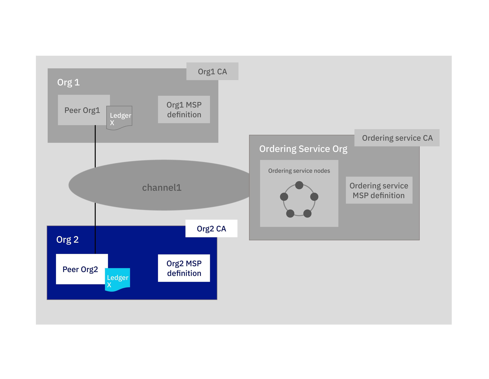

---

copyright:
  years: 2019

lastupdated: "2019-03-20"

subcollection: blockchain

---

{:new_window: target="_blank"}
{:shortdesc: .shortdesc}
{:screen: .screen}
{:codeblock: .codeblock}
{:note: .note}
{:important: .important}
{:tip: .tip}
{:pre: .pre}

# Join a network tutorial
{: #ibp-console-join-network}

{{site.data.keyword.blockchainfull}} Platform is a blockchain-as-a-service offering that enables you to develop, deploy, and operate blockchain applications and networks. You can learn more about blockchain components and how they work together by visiting the [Blockchain component overview](/docs/services/blockchain/blockchain_component_overview.html#blockchain-component-overview). This tutorial is the second part in the [sample network tutorial series](/docs/services/blockchain/howto/ibp-console-build-network.html#ibp-console-build-network-sample-tutorial) and describes how to create nodes in the {{site.data.keyword.blockchainfull_notm}} Platform console and connect them a blockchain consortium hosted in another cluster.
{:shortdesc}

**Target audience:** This topic is designed for network operators who are responsible for creating, monitoring, and managing the blockchain network.  

If you have not already deployed the console to a Kubernetes cluster by using {{site.data.keyword.cloud_notm}} Kubernetes Service, see [Getting started with {{site.data.keyword.blockchainfull_notm}} Platform 2.0](/docs/services/blockchain/howto/ibp-v2-deploy-iks.html#ibp-v2-deploy-iks). You can create a new Kubernetes cluster for the console deployment or use an existing one in your {{site.data.keyword.cloud_notm}} account. After you deploy the {{site.data.keyword.blockchainfull_notm}} Platform to your Kubernetes cluster, you can launch the console to create and manage your blockchain components.

Whether you deploy to a paid or free Kubernetes cluster, use the Kubernetes dashboard to pay close attention to the resources at your disposal when you choose to deploy nodes and create channels. It is your responsibility to manage your Kubernetes cluster and deploy additional resources if necessary. While components will successfully deploy to a free cluster, the more components you add, the slower your components will run.
{: note}

## Sample network tutorial series
{: #ibp-console-join-network-structure}

This three-part tutorial series guides you through the process of creating and interconnecting a relatively simple, multi-node Hyperledger Fabric network by using the {{site.data.keyword.blockchainfull_notm}} Platform 2.0 console to deploy a network into your Kubernetes cluster and install and instantiate a smart contract.

* [Build a network tutorial](/docs/services/blockchain/howto/ibp-console-build-network.html#ibp-console-build-network) guides you through the process of hosting a network by creating an orderer and peer.
* **Join a network tutorial** This current tutorial guides you through the process of joining an existing network by creating a peer and joining it to a channel.
* [Deploy a smart contract on the network](/docs/services/blockchain/howto/ibp-console-smart-contracts.html#ibp-console-smart-contracts) provides information on how to write a smart contract and deploy it on your network.

You can use the steps in these tutorials to build a network with multiple organizations in one cluster for the purposes of development and testing. Use the **Build a network** tutorial if you want to form a blockchain consortium by creating an orderer node and adding organizations. Use the **Join a network** tutorial to connect a peer to the network. Following the tutorials with different consortium members allows you to create a truly **distributed** blockchain network.  

This tutorial is meant to show how to join a peer to an **existing** network. It presumes an orderer, that hosts the network, already exists in your cluster or on another {{site.data.keyword.blockchainfull_notm}} Platform cluster. If you don't have an existing network to join, visit the [Build a network tutorial](/docs/services/blockchain/howto/ibp-console-build-network.html#ibp-console-build-network) tutorial to learn how to create one. The **Join a network** tutorial takes you through the steps to create the following `Org2` blockchain components, highlighted in the blue box:
  
*Figure 1. Join network structure*  
Perform the steps in the **Join a network** tutorial to create the following components and complete the following actions:

* **One peer organization** `Org2`  
  Create the Org2 Membership Services Provider (MSP) definition which defines the organization `Org2`.
* **One peer** `Peer Org2`   
  The blockchain ledger, `Ledger x` in the illustration above, is maintained by distributed peers. The peer is deployed with [Couch DB ](https://hyperledger-fabric.readthedocs.io/en/release-1.4/couchdb_as_state_database.html) as the database.
* **One Certificate Authority (CA)** `Org2 CA`
  A CA is the node that issues certificates to all organization members. We create one CA for the peer organization `Org2`.
* **Joining one channel**
  The tutorial describes how to join the channel that was created by the [Build a network tutorial](/docs/services/blockchain/howto/ibp-console-build-network.html#ibp-console-build-network) tutorial.

Throughout this tutorial we supply **recommended values** for some of the fields in the console. This allows the names and identities to be easier to recognize in the tabs and drop-down lists. These values are not mandatory, but you will find them helpful. We provide a table of the recommended values after each task.
{:tip}

## Step one: Create additional organization and your entry point to your blockchain
{: #ibp-console-join-network-create-ca-org2}

For each organization that you want to create by using the console, you should deploy at least one CA. A CA is the node that issues certificates to all network participants (peers, orderers, clients, and so on). These certificates, which include a public and private key pair, allow network participants to communicate, authenticate, and ultimately transact. These CAs will create all of the identities and certificates that belong to your organization, in addition to defining the organization itself. You can then use those identities to deploy nodes, operate your network, and submit transactions to the blockchain. For more information about your CA and the identities that you will need to create, see [Managing identities](/docs/services/blockchain/howto/ibp-console-identities.html#ibp-console-identities).

In this tutorial, we'll create one organization and create **one CA**.

### Creating your peer organization CA
{: #ibp-console-join-network-create-CA-org2CA}

As part of this tutorial, your CA issues the public and private keys for your users and nodes. These identities are not managed by {{site.data.keyword.IBM_notm}} and the keys are not stored in your Kubernetes cluster or in the console. They are only stored in your browser local storage. Therefore, make sure to export your identities and organization MSP. If you attempt to access the console from a different machine or a different browser, you need to import these identities and organization definitions.  
{:important}

Perform the following steps from your console:  

1. Navigate to the **Nodes** tab on the left and click **Add Certificate Authority**. The four-step side panels will allow you to customize the CA that you want to create and the organization that this CA will issue keys for.
2. Click **{{site.data.keyword.cloud_notm}}** under **Create Certificate Authority**.
3. Use the second side panel to give your CA a **display name**. Our recommended value for this CA is `Org2 CA`.
4. On the next panel, give your CA admin credentials by specifying an **Admin ID** of `admin`, and giving any secret that you want but we recommend `adminpw` for purposed of this tutorial.
5. Click **Next** then **Add certificate authority**.

**Task: Creating the peer organization CA**

  | **Field** | **Display name** | **Enroll ID** | **Secret** |
  | ------------------------- |-----------|-----------|-----------|
  | **Create CA** | Org2 CA  | admin | adminpw |

*Figure 2. Creating the peer organization CA*  
After you deploy the CA, you will use it when you create your organization MSP, register users, and to create your entry point to a network, the **peer**.

### Using your CA to register identities
{: #ibp-console-join-network-use-CA-org2}

Each node or application that you want to create needs public and private keys to participate in the blockchain network. You also need to create admin keys for these nodes and applications so that you can manage them from the console. You will use the CA to create two identities:

* **An organization admin** This Identity allow you to operate nodes using the platform console.
* **A peer identity** This identity will allow you to deploy a peer.

To generate these certificates, complete the following steps:

1. In the console, use the **Nodes** tab to navigate to the `Org2 CA` you created.
2. After you select your CA, you will need to register an admin for this organization, `org2`, in addition to an identity for the peer itself. You should already see an identity on this page; it's the admin that you created for the CA. To register our new users, click the **Register User** button.
3. For the organization admin, give it an enroll ID of `org2admin`. You can use any secret, but we suggest `org2adminpw` to help you follow along. Click **Next**.
4. On the next step, set the Type for this identity as `client` and you must select from any of the affiliated organizations from the drop-down list. The affiliation field is for advanced users and is not used by the tutorial, but is a required field for the panel. Items in the list are default affiliations from the Fabric CA. If you want to learn more about how affiliations are used by the Fabric CA see this topic on [Registering a new identity ](https://hyperledger-fabric-ca.readthedocs.io/en/release-1.4/users-guide.html#registering-a-new-identity). For now, select any affiliation from the list, for example `org2` and click **Next**.
5. Feel free to leave the **Maximum enrollments** and **Add Attributes** fields blank. They are not used by this tutorial, but you can learn more about what they are for in this topic on [Registering identities](/docs/services/blockchain/howto/ibp-console-identities.html#ibp-console-identities-register).
6. After the organization admin has been registered, repeat step two to step five for the identity of the peer, using the same `Org2 CA`, by giving it an enroll ID of `peer2`. As before, we recommend a secret of `peer2pw` to help you follow along. This is a node identity, so select `peer` as the **Type** on the next step. Then, ignore **Maximum enrollments** and **Attributes** as before.

**Task: Register users**

  |  **Field** | **Description** | **Enroll ID** | **Secret** |
  | ------------------------- |-----------|-----------|-----------|-----------|
  | **Register users** |  Org2 admin | org2admin | org2adminpw |
  | | Peer identity |  peer2 | peer2pw |

*Figure 3. Using your CA to register users*  

### Creating the peer organization MSP
{: #ibp-console-join-network-create-peers-org2}

Now that we have created the peer's CA and used it to **register** our organization identities, we need to create a formal definition of the peer's organization, which is known as the Membership Services Provider (MSP) definition. Many peers can belong to an organization. **You do not need to create a new organization every time you create a peer.** Because this is the first time that we go through the tutorial, we will create the MSP ID for this organization. During the process of creating the MSP, we are going to generate certificates for the `org2admin` identity and add them to our console wallet.

1. Navigate to the **Organizations** tab in the left navigation and click **Create MSP definition**.
2. Give your MSP a display name such as `Org2 MSP` and an ID such as `org2msp`. If you want to specify your own MSP ID in this field, make sure to follow the specifications about the limitations to this name from the tool tip.
3. Under **Root Certificate Authority details**, specify the peer's CA that we created as your root CA for your organization. If this is your first time through this tutorial, you should only see one: `Org2 CA`. Select it.
4. The **Enroll ID** and **Enroll secret** fields below this will auto populate with the enroll ID and secret for the first user that you created with your CA. You could use these values, but we do not recommend that you use your CA admin identity as your organization admin.  Instead for security reasons, we recommend that you enter the separate enroll ID and secret that you created for your organization admin, `org2admin`, and `org2adminpw`. Then, give this identity a display name, such as `Org2 Admin`.
5. Click the **Generate** button to enroll this identity as the admin of your organization and export the identity to the wallet, where it will be used when creating the peer and creating channels.
6. Click **Export** to export the admin certificates to your file system. As we said above, this identity is not stored in your cluster or managed by {{site.data.keyword.IBM_notm}}. It is only stored in your browser local storage. If you change browsers, you need to import this identity into your console wallet to be able to administer the peer.
7. Click **Create MSP definition**.

**Task: Create the peer organization MSP definition**

  |  | **Display name** | **MSP ID** | **Enroll ID**  | **Secret** |
  | ------------------------- |-----------|-----------|-----------|-----------|
  | **Create Organization** | Org2 MSP | org2msp |||
  | **Root CA** | Org2 CA ||||
  | **Org Admin Cert** | |  | org2admin | org2adminpw |
  | **Identity** | Org2 Admin |||||

  *Figure 4. Create the peer organization MSP definition*  

After you have created the MSP, you should be able to see the peer organization admin in your console wallet.

**Task: Check your console wallet**

  | **Field** |  **Display name** | **Description** |
  | ------------------------- |-----------|----------|
  | **Identity** | Org2 Admin | Org2 identity |

  *Figure 5. Check your console wallet*  

For more information about MSP's, see [managing organizations](/docs/services/blockchain/howto/ibp-console-organizations.html#ibp-console-organizations).

Exporting and saving your MSP are important because this allows your organization to be added to a consortium hosted in another console.
{:important}

### Creating a peer
{: #ibp-console-join-network-peer-create}

After you have [created a CA](/docs/services/blockchain/howto/ibp-console-join-network.html#ibp-console-join-network-create-CA-org2CA), used it to register identities, and created the [peer organization MSP](/docs/services/blockchain/howto/ibp-console-join-network.html#ibp-console-join-network-create-peers-org2), you're ready to create a peer.

#### What role do peers play?
{: #ibp-console-join-network-peer-role}

It's important to remember that organizations themselves do not maintain ledgers. Peers do. Organizations also use peers to sign transaction proposals and approve channel configuration updates. Because having at least two peers on a channel makes them highly available, having at least two peers joined to a channel is considered a best practice for production level implementations. In this tutorial, we'll only show the process for creating a single peer.

From a resource allocation perspective, it is possible to join the same peers to multiple channels. The design of the peer ensures that the data from one channel cannot pass to another through the peer. However, because the peer will store a separate ledger for each channel, it is necessary to ensure that the peer has enough processing power and storage to handle the transaction and data load.

#### Deploying your peer
{: #ibp-console-join-network-deploy-peer-role}

Use your console to perform the following steps:

1. On the **Nodes** page, click **Add peer**.
2. Click {{site.data.keyword.cloud_notm}} under **Create a new peer** and **Next**.
3. Give your peer a **Display name** of `Peer Org2`.
4. On the next screen, select `Org2 CA` as your CA. Then, enter the enroll ID and secret for the peer identity that you created for your peer, `peer2`, and `peer2pw`. Then, select your MSP, `Org2 MSP`, from the drop-down list and click **Next**.
5. The next side panel asks for TLS CA information. While it is possible to create separate admins for the TLS CA that deployed with your CA, you do not need to.
   - Give the **TLS Enroll ID**, `admin`, and the secret `adminpw`, the same values as the Enroll ID and Enroll secret that you gave when creating the CA.
   - The **TLS CSR hostname** is for advanced user and is used to specify a custom domain name that can be used to address the peer endpoint. Leave the **TLS CSR hostname** blank for now, it is not used in this tutorial.
6. The last side panel will ask you to **Associate an identity** and make it the admin of your peer. Select your peer admin identity `Org2 Admin`.
7. Review the summary and click **Add peer**.

**Task: Deploying a peer**

  |  | **Display name** | **MSP ID** | **Enroll ID** | **Secret** |
  | ------------------------- |-----------|-----------|-----------|-----------|
  | **Create Peer** | Peer Org2 | org2msp |||
  | **CA** | Org2 CA ||||
  | **Peer Identity** | |  | peer2 | peer2pw |
  | **Administrator certificate** | org2msp ||||
  | **TLS CA** | Org2 CA ||||
  | **TLS CA ID** | || admin | adminpw |
  | **Associate identity** | Org2 Admin |||||

  *Figure 6. Deploying a peer*  

## Step two: Add your organization to list of organizations that can transact
{: #ibp-console-join-network-add-org2}

As we noted earlier, a peer organization must be a member of an orderer's consortium before it can create or join a channel. This is because channels are, at a technical level, **messaging paths** between peers through the orderer. Just as a peer can be joined to multiple channels without information passing from one channel to another, so too can an orderer have multiple channels running through it without exposing data to organizations on other channels.

Because only orderer admins can add peer organizations to the consortium, you will either need to **be** the orderer admin or **send** MSP information to the orderer admin. In this tutorial, you can either **add the peer's organization to the orderer in your console**, if you are hosting the orderer. Or you need to **export your organization information** and give it to the orderer admin, who created the network where the orderer resides. The orderer admin can then import your organization and add you to the consortium.

### Add the peer's organization to the orderer in my console
{: #ibp-console-join-network-add-org2-local}

**Follow these steps only if your console already includes the orderer and channel you want to join.** Otherwise proceed to [Export your organization information](/docs/services/blockchain/howto/ibp-console-join-network.html#ibp-console-join-network-add-org2-remote).  

Because only orderer admins can add peer organizations to the consortium, you will need to be the orderer admin, meaning you have the orderer organization admin identity in your console wallet.  

1. Navigate to the **Nodes** tab.
2. Scroll down to the orderer you want to use and click on it to open it.
3. Under **Consortium Members**, click **Add organization**.
4. From the drop-down list, select `Org2 MSP`, as this is the MSP that represents the peer's organization `org2`.
5. Click **Add organization**.

Now add the peer organization to the channel.
1. Navigate to the **Channels** tab, click on `channel1`.
2. Click the  **Settings** icon to update the channel and add the peer organization to the channel.
3. In the **Choose from available orderers** drop down list, ensure that `Orderer` is selected.
4. In the **Channel Updater MSP ID** drop down list, ensure that `org1MSP` is selected.
5. In the **Associate available identity** drop down list, ensure that `Org1Admin` is selected.
6. Scroll down to the section titled ` Add organizations to the channel` and open the `Select a channel member` drop-down list and select the peer organization MSP, `Org2 MSP` for the tutorial.
7. Click **Add** and then assign permissions for that organization. We recommend you make them an `Operator` so they can update the channel.
8. Click **Update channel**.

When this process is complete, it is possible for `org2` to create or join a channel hosted on your `Orderer`. You can proceed to [Step three: Join your peer to the channel](/docs/services/blockchain/howto/ibp-console-join-network.html#ibp-console-join-network-join-peer-org2).

### Export your organization information
{: #ibp-console-join-network-add-org2-remote}

**Follow these steps only if the orderer and channel your peer will join resides in another {{site.data.keyword.blockchainfull_notm}} Platform service instance.** Otherwise, you can skip to [Step three: Join your peer to the channel](/docs/services/blockchain/howto/ibp-console-join-network.html#ibp-console-join-network-join-peer-org2).

You need to send your organization MSP definition to the orderer admin and be added to the consortium by using the steps below.  

When you follow these steps you need to be the admin of the **peer organization**, meaning you have the peer organization admin identity in your console wallet:  
1. Navigate to the **Organizations** tab. You can see the organizations available for export are listed under **Available organizations**. Click the **download** button inside the organization tile to download the JSON configuration file that represents the MSP of the peer organization.
2. Send this file to the orderer admin in an out of band operation.

### Import the organization definition
{: #ibp-console-join-network-import-remote-msp}
The orderer admin needs to import this JSON file to add your organization to their console:
1. Navigate to the **Organizations** tab, click the **Import MSP definition** button, and select the JSON file that represents the peer organization MSP definition.  
2. Navigate to the **Nodes** page and click on your orderer node. On the ordering node panel, under **Consortium Members**, click **Add Organization**. On the side panel that opens, select `Org2 MSP` from the list of MSP definitions from your **Organizations** tab.
3. Navigate to the **Channels** tab, click on `channel1` and then click the  **Settings** icon to update the channel and add the peer organization to the channel.
4. In the **Choose from available orderers** drop down list, ensure that `Orderer` is selected.
5. In the **Channel Updater MSP ID** drop down list, ensure that `org1MSP` is selected.
6. In the **Associate available identity** drop down list, ensure that `Org1Admin` is selected.
7. Scroll down to the section titled ` Add organizations to the channel` and open the `Select a channel member` drop-down list and select the peer organization MSP, `Org2 MSP` for the tutorial.
8. Click **Add** and then assign permissions for that organization. We recommend you make them an `Operator` so they can update the channel.
9. Click **Update channel**.

After the admin of the orderer has joined your peer organization to the consortium and the channel, you need to import the ordering node into your console. You can then join channels that are hosted by the ordering service. Complete the following steps to **import** the orderer:

The admin of the **orderer organization** needs to complete these steps first:
1. Navigate to the orderer node inside the **Nodes** tab and click the **Settings** icon to the right of the node name to open the side panel. Click the **Export** button under **Actions** to download a JSON configuration file.
2. Send this file to the peer organization in an out of band operation. The peer organization administrator can then use the configuration file to add the orderer to the console.

### Import the orderer from another cluster
{: #ibp-console-join-network-import-remote-orderer}

You can the follow these steps if you are the admin of the **peer organization**:
1. Navigate to the **Nodes** page and click **Add orderer**.
2. Click the {{site.data.keyword.cloud_notm}} under **Import an existing orderer**.
3. Then, click the **Upload JSON** button and select the JSON that represents the node itself.
4. On the subsequent step, when you are asked to associate an identity, select the Peer org identity. For the tutorial, that would be `Org2 Admin` and click **Import orderer**.

## Step three: Join your peer to the channel
{: #ibp-console-join-network-join-peer-org2}

We are almost done. Your peer can now be joined to an existing channel. You need to get the `channel name`, out-of-band, from the network operator who created the channel. In the **Build a network** tutorial, we created a channel named `channel1`. If you are not already there, navigate to the **Channels** tab in the left navigation.

Perform the following steps from your console:

1. Click the **Join channel** button to launch the side panels.
2. Select your orderer named 'Orderer' and click **Next**.
3. Enter the name of the channel you want to join,  `channel1` and click **Next**.
4. Select which peers you want to join the channel. For purposes of this tutorial, click `Peer Org2`.
5. Click **Join peer**.

If the channel that you want to join a peer to is created by yourself and you haven't joined any peer to the channel, you can click the pending tile of the channel directly to join your peer.
{:note}

If you plan to leverage the Hyperledger Fabric [Private Data ](https://hyperledger-fabric.readthedocs.io/en/latest/private-data/private-data.html "Private data") or [Service Discovery ](https://hyperledger-fabric.readthedocs.io/en/latest/discovery-overview.html "Service Discovery") features, you must configure anchor peers in your organizations from the **Channels** tab. For more information about how to configure anchor peers for private data by using the **Channels** tab in console, see [Private data](/docs/services/blockchain/howto/ibp-console-smart-contracts.html#ibp-console-smart-contracts-private-data).

You can also create a new channel if your organization is a member of the consortium. Use the steps to [create a channel](/docs/services/blockchain/howto/ibp-console-build-network.html#ibp-console-build-network-create-channel) as described in the [Build a network tutorial](/docs/services/blockchain/howto/ibp-console-build-network.html#ibp-console-build-network).

## Next steps
{: #ibp-console-join-network-next-steps}

After you have joined your peer to a channel, use the following steps to deploy a smart contract and begin submitting transactions to the blockchain:

- [Deploy a smart contract on your network](/docs/services/blockchain/howto/ibp-console-smart-contracts.html#ibp-console-smart-contracts) using the console.
- After you have installed and instantiated your smart contract, you can [submit transactions using your client application](/docs/services/blockchain/howto/ibp-console-smart-contracts.html#ibp-console-smart-contracts-connect-to-SDK).
- Use [the commercial paper sample](/docs/services/blockchain/howto/ibp-console-create-app.html#ibp-console-app-commercial-paper) to deploy an example smart contract and submit transactions from sample application code.
