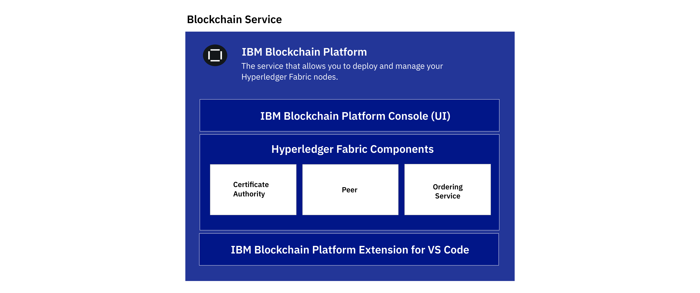
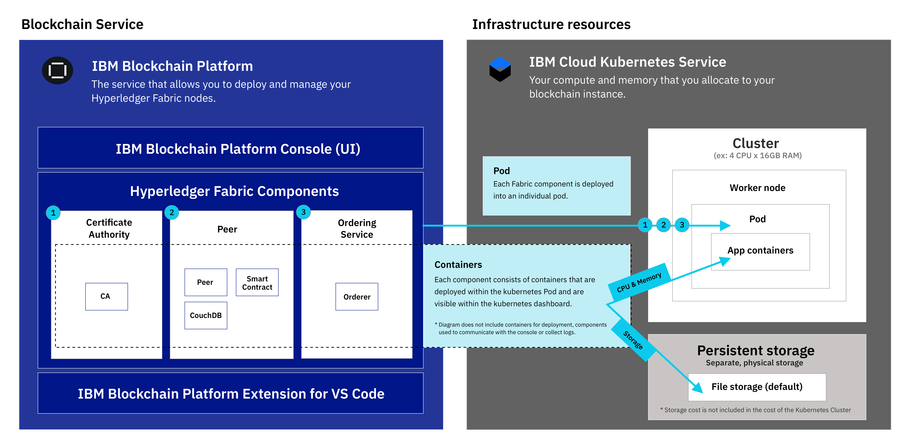
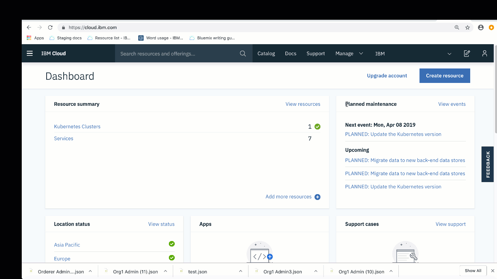

---

copyright:
  years: 2019
lastupdated: "2019-05-31"

keywords: getting started tutorials, videos, web browsers

subcollection: blockchain

---

{:external: target="_blank" .external}
{:shortdesc: .shortdesc}
{:screen: .screen}
{:codeblock: .codeblock}
{:note: .note}
{:important: .important}
{:tip: .tip}
{:pre: .pre}

# Getting started with {{site.data.keyword.blockchainfull_notm}} Platform on {{site.data.keyword.cloud_notm}}
{: #ibp-v2-deploy-iks}

{{site.data.keyword.blockchainfull}} Platform on {{site.data.keyword.cloud_notm}} includes the {{site.data.keyword.blockchainfull_notm}} Platform console, a user interface that can simplify and accelerate your journey to deploy and manage blockchain components. This tutorial describes how to get started with {{site.data.keyword.blockchainfull_notm}} Platform on {{site.data.keyword.cloud_notm}} and use the console to deploy and manage blockchain components in your {{site.data.keyword.cloud_notm}} Kubernetes Service cluster on {{site.data.keyword.cloud_notm}}. For more information about Kubernetes and {{site.data.keyword.cloud_notm}} Kubernetes Service, see [Kubernetes](/docs/services/blockchain/reference/k8s.html "Kubernetes").
{:shortdesc}

**Target audience:** This topic is designed for system administrators who are responsible for setting up a Kubernetes cluster on {{site.data.keyword.cloud_notm}} and for deploying {{site.data.keyword.blockchainfull_notm}} Platform.

After you link your {{site.data.keyword.blockchainfull_notm}} Platform to your {{site.data.keyword.cloud_notm}} Kubernetes cluster, you can launch the console to create and manage your blockchain components and experience the following important benefits:

- **Control:** You control and manage your blockchain components and certificates from one central console. Deploy only the components needed for your business and add more as your need grow.
- **Flexible Kubernetes based deployment:** You can take advantage of the compute (CPU, memory, storage) options for your Kubernetes cluster and leverage built-in HA and DR options.

## What is the Blockchain Service?
{: #ibp-v2-deploy-iks-blockhain-service}

The following diagram illustrates the three elements of the {{site.data.keyword.blockchainfull_notm}} Platform:

{: caption="Figure 1: The {{site.data.keyword.blockchainfull_notm}} Platform components" caption-side="bottom"}

- **{{site.data.keyword.blockchainfull_notm}} Console (UI)**: This is the console that allows you create and manage your blockchain components. After you provision a service instance in {{site.data.keyword.cloud_notm}}, you can deploy an instance of the {{site.data.keyword.blockchainfull_notm}} console and link it to your{{site.data.keyword.cloud_notm}} Kubernetes cluster. Then you can use the console to create an manage you blockchain components in your Kubernetes cluster. There is no charge for the console.

- **Hyperledger Fabric Components**: The console is used to create and manage blockchain components that are based on Hyperledger Fabric v1.4.1 Certificate Authority, peer, and ordering service images.  These components are deployed into your kubernetes cluster and storage is provisioned for them using the `default` storage class when they are deployed.

- **IBM VS Code extension (Development Tools)**: Download the VS Code extension from the VS Code marketplace in order to get started with developing, packaging, and testing client applications and smart contracts.

## Considerations
{: #ibp-v2-deploy-iks-considerations}

Before you deploy the console, ensure that you understand the following considerations:

- {{site.data.keyword.blockchainfull_notm}} Platform on {{site.data.keyword.cloud_notm}} is built with Hyperledger Fabric v1.4.1.
- All peers deployed with the console or APIs use CouchDB as their state database.
- You have the option to link your {{site.data.keyword.blockchainfull_notm}} Platform service instance to a free Kubernetes cluster for evaluation of the offering, however capacity and performance are limited, none of your data can be migrated, and the cluster is deleted after 30 days.
- While the beta trial is free, you still need to pay for your Kubernetes cluster, if you choose a paid cluster.
- You are responsible for the management of health monitoring, security, and logging  of your Kubernetes cluster. See this [information](/docs/containers/cs_responsibilities.html#your-responsibilities-by-using-ibm-cloud-kubernetes-service){: external} for details on what {{site.data.keyword.cloud_notm}} manages and what you are responsible for.
- You are also responsible for monitoring the resource usage of your Kubernetes cluster by using the Kubernetes dashboard. If you need to increase storage capacity or performance of your cluster, see this information on how to [modify your existing volume](/docs/containers/cs_storage_file.html#change_storage_configuration){: external}.
- You are responsible for managing and securing your certificates and private keys. {{site.data.keyword.IBM_notm}} does not store your certificates in the Kubernetes cluster.
- {{site.data.keyword.blockchainfull_notm}} Platform is available in select regions. Refer to this topic on [{{site.data.keyword.blockchainfull_notm}} Platform locations](/docs/services/blockchain/howto?topic=blockchain-ibp-regions-locations) for an updated list.
- Kubernetes must be version 1.11 or a higher stable version in your {{site.data.keyword.cloud_notm}} Kubernetes cluster. Use these instructions to [upgrade your new and existing clusters](/docs/services/blockchain/howto/ibp-v2-deploy-iks.html#ibp-v2-deploy-iks-updating-kubernetes) to this version.
- If you do not want to use the default Bronze File storage that is pre-selected for you when you provision a Kubernetes cluster in {{site.data.keyword.cloud_notm}}, you can provision storage of your choice. See this topic on [Persistent storage considerations](/docs/services/blockchain?topic=blockchain-ibp-v2-deploy-iks#ibp-console-storage) to learn more.
- If decide to include {{site.data.keyword.cloud_notm}} multi-zone support in your Kubernetes cluster, you must provision your own storage. See [Using Multizone (MZR) clusters with {{site.data.keyword.blockchainfull_notm}} Platform](/docs/services/blockchain?topic=blockchain-ibp-v2-deploy-iks#ibp-console-mzr) for more details.

## Video tutorial
{: #ibp-v2-deploy-video}

Watch the following [video series]( http://ibm.biz/BlockchainPlatformSeries) to learn more about the {{site.data.keyword.blockchainfull_notm}} Platform console and how you can get started to deploy {{site.data.keyword.blockchainfull_notm}} Platform on {{site.data.keyword.cloud_notm}}.

## Before you begin
{: #ibp-v2-deploy-iks-prereq}

Before you begin:

- Ensure that you have an [{{site.data.keyword.cloud_notm}} paid account](https://cloud.ibm.com/catalog/services/blockchain){: external}. If you do not have an account:
   1. Click the **Sign up** button.
   2. After you create a free trial account, upgrade it to a **Pay-As-You-Go** type by going to **Manage** > **Billing and Usage** > **Billing** in the {{site.data.keyword.cloud_notm}} console, and clicking **Add Credit Card**.
   3. Ensure that the user has both Administrator and Manager roles for the Kubernetes cluster that they will link to their blockchain service instance. See these steps on [how to assign Kubernetes access roles](#ibp-v2-deploy-iks-k8x-access-roles) for more information.

When you plan to use the service instance in the context of a broader organization-wide solution, it is recommended that the participating organizations use a functional email address to create their network. In this case, access to the network does not depend on any single individual's availability.
{:tip}  

- If you plan to use an existing {{site.data.keyword.cloud_notm}} Kubernetes Service cluster, check the Kubernetes version and upgrade it to 1.11 or higher, if necessary. For more information about how to determine what version of Kubernetes your cluster is running and how to upgrade the version, see [Updating the Kubernetes version of your cluster](/docs/services/blockchain/howto/ibp-v2-deploy-iks.html#ibp-v2-deploy-iks-updating-kubernetes).

### Browsers
{: #ibp-v2-deploy-iks-browsers}
The following list specifies the minimum required browser software for the {{site.data.keyword.blockchainfull_notm}} Platform console:

- Chrome: latest version for your operating system
- Firefox: latest regular (non-ESR) versions for your operating system
- Safari: latest version for Mac
- Edge: v44.17763.1.0 or higher

### Resources required
{: #ibp-v2-deploy-iks-resources-required}

#### Cluster size recommendations
{: #ibp-v2-deploy-iks-resources-required-free}

 When you link your {{site.data.keyword.blockchainfull_notm}} Platform console to an {{site.data.keyword.cloud_notm}} Kubernetes Service cluster, you need to ensure that your Kubernetes cluster meets the minimum hardware resource requirements:

|Kubernetes cluster type | Use case | CPU | RAM | Worker nodes |
|-----------|------|-----|-----------------------|
|Standard (Recommended) | Suitable for MVPs | 4 (Shared) | 16 GB (Shared)|multiple|
|Free** | Suitable for evaluation | 2 | 4 GB | 1 |  
** Preview the {{site.data.keyword.blockchainfull_notm}} Platform at no charge for 30 days when you link your {{site.data.keyword.blockchainfull_notm}} Platform service instance to an {{site.data.keyword.cloud_notm}} Kubernetes free cluster. Performance will be limited by throughput, storage and functionality. {{site.data.keyword.cloud_notm}} will delete your Kubernetes cluster after 30 days and you cannot migrate any nodes or data from a free cluster to a paid cluster.

These resources are sufficient for testing and experimentation. The [Build a network tutorial](/docs/services/blockchain/howto/ibp-console-build-network.html#ibp-console-build-network), in which you create two peers, two CAs, and an ordering service, takes up approximately 4.85 CPU, with the five node ordering service taking up 2.25 CPUs of that. Therefore, if you plan to deploy a five node ordering service, you should not deploy a Kubernetes cluster with a 2 CPU single worker node in it as the ordering service will not fit. We recommend a cluster with nodes of at least 4 CPU. The more worker nodes you add, the easier your cluster will be able to handle your deployments.
{:note}

#### Paid clusters
{: #ibp-v2-deploy-iks-resources-required-paid}

Production level deployments of the {{site.data.keyword.blockchainfull_notm}} Platform will be deployed to a paid cluster of {{site.data.keyword.cloud_notm}} Kubernetes Service. The size and configuration of this cluster will depend on the needs of your particular use case. Bigger deployments will necessarily need to be deployed on bigger clusters. How much bigger your cluster is than your projected deployment is up to you. Having at least some headroom is desirable, as it will allow peers and ordering services to be a part of additional channels and take on higher throughput without having to deploy additional resources into your Kubernetes cluster **before** adjusting the size of your nodes. For more information about how these values are adjusted, see [Reallocating resources](/docs/services/blockchain/howto/ibp-console-govern.html#ibp-console-govern-reallocate-resources).

Creating an initial deployment of sufficient size to allow growth is particularly important for users who will choose to not use the [{{site.data.keyword.cloud_notm}} Kubernetes Service autoscaler](/docs/containers?topic=containers-ca#ca){: external}, which can take on some of the burden of deploying additional nodes and pods for the user.

While it is simpler to have enough resources deployed to {{site.data.keyword.cloud_notm}} Kubernetes Service and be able to expand your pods and worker nodes as you see fit without having to increase your Kubernetes cluster deployment first, bigger Kubernetes cluster deployments will cost more money. Users will have to consider their options carefully and recognize the tradeoffs they are making regardless of the option they choose.

For a sense of how much storage and compute you will need in your cluster, refer to this chart, which contains the current defaults for the peer, ordering node, and CA:

| **Component** (all containers) | CPU  | Memory (GB) | Storage (GB) |
|--------------------------------|---------------|-----------------------|------------------------|
| **Peer**                       | 1.2            | 2.4                  | 200 (includes 100GB for peer and 100GB for CouchDB)|
| **CA**                         | 0.1            | 0.2                  | 20                     |
| **Ordering node**              | 0.45           | 0.9                  | 100                    |

If you plan to deploy a five node Raft ordering service, note that your ordering node deployment will increase by a factor of five. So a total of 2.25 CPU, 4.5 GB of memory, and 500 GB of storage for the five Raft nodes. This makes the five node ordering service larger than a 2 CPU Kubernetes single worker node.
{:tip}

## Step one: Create a service instance in {{site.data.keyword.cloud_notm}}
{: #ibp-v2-deploy-iks-create-service-instance}

Use the following steps to create a service instance of {{site.data.keyword.blockchainfull_notm}} Platform on {{site.data.keyword.cloud_notm}}.

1. Locate the [Blockchain service](https://cloud.ibm.com/catalog/services/blockchain){: external} in {{site.data.keyword.cloud_notm}} Catalog, or search for `Blockchain` in your {{site.data.keyword.cloud_notm}} Catalog page.
2. We recommend that you rename the **Service name** for your instance so you can recognize it easily in the future.
3. For Beta, **Dallas** is the only available region and it cannot be changed. Additional regions can be chosen in a paid cluster. For more information, see [Regions](/docs/services/blockchain/reference/ibp_regions.html#ibp-regions-locations).
4. You can leave the resource group and tags fields unchanged.
5. Choose **Standard** plan.
6. Click **Create** to provision the service instance.

## Step two: Deploy {{site.data.keyword.blockchainfull_notm}} Platform
{: #ibp-v2-deploy-iks-steps}

You can follow the guidance to deploy {{site.data.keyword.blockchainfull_notm}} Platform immediately after you create the service instance.

1. The **Welcome & prerequisites** step. If you already have an existing {{site.data.keyword.IBM_notm}} Kubernetes Service cluster in the **Dallas** region and you want to use it for your blockchain service, select the check box. **If you use an existing cluster, you can skip the next step; but be sure the Kubernetes version is at v1.11 or a higher stable version**. Click **Continue**.
2. The **Create cluster** step. If you select the check box in step 1 to use an existing Kubernetes cluster, this step is skipped. Otherwise, click **Create a new cluster**, which launches the {{site.data.keyword.cloud_notm}} Kubernetes dashboard to create a cluster. For more information, see [Getting started with {{site.data.keyword.cloud_notm}} Kubernetes Service](/docs/containers/getting-started.html){: external}. Allow extra time for this process to complete.
  - For information about locations for your cluster, see [Regions](/docs/services/blockchain/reference/ibp_regions.html#ibp-regions-locations).
  - Choose **Standard cluster (recommended):**  If you need a longer term option that includes multiple nodes for high availability. **Choose at least v.1.11 or a higher stable version.** To deploy a paid cluster, see [Creating a standard cluster](/docs/containers?topic=containers-clusters#clusters_ui_standard){: external}. Note that if you want high availability or disaster recovery that you will need to make a decision about the storage class you are using. The `default` storage class on the cluster will be used by the dynamic provisioning. So, customers can set any storage class as the default. For more information, see [Deciding on the file storage configuration](/docs/containers?topic=containers-file_storage#file_predefined_storageclass){: external}.
  - Choose **Free cluster:** If you want to preview the platform for less than 30 days. **Note** that it is not possible to migrate from a free cluster to a paid cluster. The free type of cluster offers limited storage and transaction throughput. For instructions on what to do when your Kubernetes cluster expires, see this topic on [Kubernetes cluster expiration](/docs/services/blockchain/howto/ibp-console-manage.html#ibp-console-manage-console-cluster-expiration).
  - For more information about the differences between the free and paid Kubernetes clusters on {{site.data.keyword.cloud_notm}}, see [Comparison of free and standard clusters](https://cloud.ibm.com/docs/containers?topic=containers-cluster_types#cluster_types){: external}.  

   You must return to this tab in your browser after you create the cluster so that you can complete the {{site.data.keyword.blockchainfull_notm}} Platform deployment process.  
   {:important}  

  You need to wait until your cluster is deployed successfully. Then, click the **I Have a Cluster** button.
3. Your Kubernetes version running in your cluster must be at version 1.11 or higher. Follow these [steps](/docs/services/blockchain/howto/ibp-v2-deploy-iks.html#ibp-v2-deploy-iks-updating-kubernetes) to check your cluster version and upgrade it if necessary. Then come back and proceed with these instructions.
4. The **Deploy onto cluster** step. Select the Kubernetes cluster that you want to deploy {{site.data.keyword.blockchainfull_notm}} Platform into from the drop-down list and click **Deploy to cluster**.  

  If your Kubernetes cluster is not visible in the drop-down list, it could be caused by the following conditions:
  - The cluster creation process can take up to 60 minutes to complete. If you created a cluster, allow some extra time until the state of your cluster becomes **Normal**.
  - Clusters that are outside the **Dallas** region are not visible and cannot be used.
  - Check to make sure you are not using the ESR version of Firefox. If you are, switch to another browser such as Chrome and retry.

5. The **Launch console** step. After your {{site.data.keyword.blockchainfull_notm}} Platform has been successfully deployed, click **Launch the {{site.data.keyword.blockchainfull_notm}} Platform** to open the {{site.data.keyword.blockchainfull_notm}} Platform console. It might take a few minutes for the button to become enabled while the console is being provisioned.

The following illustration shows how the IBM Blockchain Platform components are deployed to the Kubernetes cluster.

{: caption="Figure 2: Deploying the {{site.data.keyword.blockchainfull_notm}} Platform to the {{site.data.keyword.cloud_notm}} Kubernetes Service" caption-side="bottom"}

- **Pod**: When each Certificate Authority, peer, or ordering service is deployed, a new Pod is created in a worker node in your cluster.
- **App containers**: Containers are created inside the pods for each node that is deployed.  
- **Persistent Storage**: Storage for each node is dynamically provisioned from the Kubernetes cluster `default` storage class every time a node is deployed.

## (Optional) Add additional users to the console
{: #ibp-v2-deploy-iks-add-users}

By default, the console uses [{{site.data.keyword.cloud_notm}} Identity and Access Management (IAM)](/docs/iam?topic=iam-iamoverview#iamoverview){: external} as the {{site.data.keyword.cloud_notm}} identity service provider. Your {{site.data.keyword.blockchainfull_notm}} Platform console is provisioned by configuring the email address of the {{site.data.keyword.IBM_notm}} owner as the Administrator of the console. As an Administrator, this user is authorized to grant other users access to the console via their email addresses.  See these instructions on how to [add and remove users from the console](/docs/services/blockchain?topic=blockchain-ibp-console-manage-console#ibp-console-manage-console-add-remove) for more information.

## Next steps
{: #ibp-v2-deploy-iks-next-steps}

- Before you create any nodes, you need to decide on the storage plug-in for your Kubernetes cluster. If you are just getting started and trying things out, the default Bronze File Storage that is pre-selected for you when you provision the cluster is suitable. No further action is required at this time.  But, when you are ready to deploy a cluster for formal testing or Production usage, you need to decide on the appropriate storage plug-in for your needs. See this topic on [Persistent storage considerations](#ibp-console-storage) to get started.

- Now that your console is ready to use, you can go ahead to the [build a network tutorial](/docs/services/blockchain/howto/ibp-console-build-network.html#ibp-console-build-network).
Consider bookmarking the url of your console so you can come back at a later time if needed. Otherwise, you can follow the steps in the [Post-install instructions](#ibp-v2-deploy-iks-post-install) to get back to it from your browser.

## Updating the Kubernetes version of your cluster
{: #ibp-v2-deploy-iks-updating-kubernetes}

If you use an existing {{site.data.keyword.cloud_notm}} Kubernetes Service cluster, ensure that the Kubernetes version is at version 1.11 or higher.

You can check the Kubernetes version of your cluster in the [Kubernetes clusters page](https://cloud.ibm.com/kubernetes/clusters){: external} on {{site.data.keyword.cloud_notm}}, which lists all your clusters in a table.

If the Kubernetes version is not at version 1.11 or higher, you need to complete the following steps to update the Kubernetes version of your cluster.

1. Click the overflow menu icon at the end of the row and select **Update version**. This process takes about one hour to complete. If the version is updated successfully, you can see the updated version of your cluster in the **Kubernetes version** column.  
2. Select a Kubernetes version of v1.11 or higher from the Kubernetes version drop-down list and click **Update**.
3. Click your cluster and go to the **Worker Nodes** tab. Select the check box before the work node that you want to update and click **Update Kubernetes** from the pop-up menu bar. If your cluster contains multiple work nodes, all of them must be updated.

  Updates to worker nodes can cause downtime for your apps and services. Your worker node machine is reimaged, and data is deleted if not [stored outside the pod](https://cloud.ibm.com/docs/containers/cs_storage_planning.html#persistent_storage_overview){: external}.
  {:important}


For more information about updating Kubernetes version for an {{site.data.keyword.IBM_notm}} Kubernetes Service cluster and work nodes, see [Updating clusters, worker nodes, and add-ons](/docs/containers?topic=containers-update#update){: external}.  

You must wait for the update to complete before you can [resume the {{site.data.keyword.blockchainfull_notm}} Platform deployment](/docs/services/blockchain/howto/ibp-v2-deploy-iks.html#ibp-v2-deploy-iks-steps).

## How to assign Kubernetes access roles
{: #ibp-v2-deploy-iks-k8x-access-roles}

The user who links the blockchain service instance to the Kubernetes cluster must have the Administrator and Manager roles in Kubernetes.
To configure this access you must complete the following steps:
   1. In the {{site.data.keyword.cloud_notm}} dashboard, click the **Manage** drop-down list, then **Access (IAM)**.
   2. In the left navigation menu, click **Users** and click the ID of user who will link the service instance to the Kubernetes cluster.
   3. Click **Access Policies**, then **Assign access**.
   4. Click the tile **Assign access to resources**.
   5. In the **Services** drop-down list, select **Kubernetes Service**.
   6. Check the **Administrator** and **Manager** roles for this user.
   7. Click **Assign**.



For more information about Kubernetes access control, see [how to pick the right access policy and role for your users](/docs/containers?topic=containers-users#access_roles).

## Post-install instructions
{: #ibp-v2-deploy-iks-post-install}

After you deploy your console, you can click the **Launch the {{site.data.keyword.blockchainfull_notm}} Platform** button to open the console in your browser. You can add the console URL as a bookmark to your browser.

### Returning to your console from {{site.data.keyword.cloud_notm}}
{: #ibp-v2-deploy-iks-rtn-to-console}

If you don't have the console URL, you can find it from your {{site.data.keyword.cloud_notm}} dashboard.

1. In your browser, open [{{site.data.keyword.cloud_notm}} Resource list](https://cloud.ibm.com/resources){: external}. You need to log in with you {{site.data.keyword.IBM_notm}} ID.
2. Your {{site.data.keyword.blockchainfull_notm}} Platform service instance is visible under the **Services** twistie. Locate the {{site.data.keyword.blockchainfull_notm}} Platform service instance that you deployed and click it.
3. On the subsequent panel, click **Manage** in the left navigation and then click **Launch the {{site.data.keyword.blockchainfull_notm}} Platform**.

Your console opens in your browser.

## Persistent storage considerations
{: #ibp-console-storage}

{{site.data.keyword.blockchainfull_notm}} Platform requires persistent storage for each CA, peer, and ordering nodes. When you deploy a standard Kubernetes cluster in {{site.data.keyword.cloud_notm}}, it comes pre-configured with the [Bronze-level File Storage](/docs/containers?topic=containers-file_storage#file_predefined_storageclass){: external} plug-in as the `default` storage class. Then, when you deploy a blockchain node to that cluster by using the console or APIs, an amount of File Storage is dynamically provisioned for the node based on the amount of storage that was requested when the node was deployed. Therefore, the deployment provisions the storage in the cluster with the `default` storage class. You can choose from several [Kubernetes storage options](https://cloud.ibm.com/docs/containers/cs_storage_planning.html#persistent_storage_overview){: external} and decide on the storage type that best fits your use case. Be aware that you are charged separately for your storage usage, so you can factor in the cost of the various storage options when you make your selection.

If you want to add your own storage plug-in, you must create a customized storage class. Read about how to
[add a storage class](/docs/containers/cs_storage_basics.html#storageclasses){: external} for your solution. Because the {{site.data.keyword.blockchainfull_notm}} Platform uses [dynamic volume provisioning](https://cloud.ibm.com/docs/containers/cs_storage_basics.html#dynamic_provisioning){: external} with the `default` storage class, you need to change the default storage class to use your storage plug-in by running the following command:

```
kubectl patch storageclass <storageclass> -p '{"metadata": {"annotations":{"storageclass.kubernetes.io/is-default-class":"true"}}}'
```
{:codeblock}

Replace ``<storageclass>`` with the name of your storage class.

After you deploy blockchain nodes to your cluster, you should not change the default storage class of the Kubernetes cluster, because you will lose the storage for the CAs, peers, and ordering nodes that are already deployed. Therefore, you need to decide on your storage plug-in before you deploy any blockchain nodes.
{: important}

### Using Multizone (MZR) clusters with {{site.data.keyword.blockchainfull_notm}} Platform
{: #ibp-console-mzr}

In regions where it is offered, [multizone support](/docs/containers?topic=containers-regions-and-zones#regions_multizone){: external} is pre-selected by default when you create a standard Kubernetes cluster in {{site.data.keyword.cloud_notm}}. Although not required, this capability provides for high availability of your nodes in case any one zone, or data center, goes down. If your cluster includes multizone support, you need to bring your own storage solution. You can choose from several [persistent storage options](/docs/containers?topic=containers-storage_planning#persistent_storage_overview){: external}.

After you create the storage class, run the `kubectl patch storageclass` command above to set the storage class of the multizone region to be the `default` storage class.

### Pricing and Billing information
{: #ibp-v2-deploy-iks-pricing-billing}

- See [Pricing](/docs/services/blockchain/howto?topic=blockchain-ibp-saas-pricing) if you need to revisit the {{site.data.keyword.blockchainfull_notm}} Platform pricing information.
- Your current {{site.data.keyword.cloud_notm}} usage information is available on your [usage tile](https://cloud.ibm.com/billing/){: external} of the {{site.data.keyword.cloud_notm}} dashboard and your bill is visible under [billing information](https://cloud.ibm.com/billing/billing-items){: external}. See this topic on [Billing](/docs/services/blockchain/howto?topic=blockchain-ibp-saas-pricing#ibp-saas-pricing-billing) for more details about how {{site.data.keyword.blockchainfull_notm}} Platform billing works.

### Deleting a service instance
{: #ibp-v2-deploy-iks-delete-service-instance}

When you no longer need your service instance it can be deleted from your Kubernetes cluster to free up resources. You can use the {{site.data.keyword.cloud_notm}} dashboard to delete your {{site.data.keyword.blockchainfull_notm}} Platform service instance.

1. In your browser, open [{{site.data.keyword.cloud_notm}} Resource list](https://cloud.ibm.com/resources){: external}. You need to log in with you {{site.data.keyword.IBM_notm}} ID.
2. Under the **Services** twistie, locate the service instance you want to delete and click **Delete** on the Actions menu.

**Choose this option carefully.** If you delete a service instance, the storage associated with each node is deleted and cannot be restored. All your ledger data will be deleted.
{: important}

If your service instance deletion fails, it could be because the Kubernetes cluster is not accessible. If this occurs, open a [support ticket](/docs/services/blockchain/ibmblockchain_support.html#blockchain-support-cases) to request the service instance deletion.
