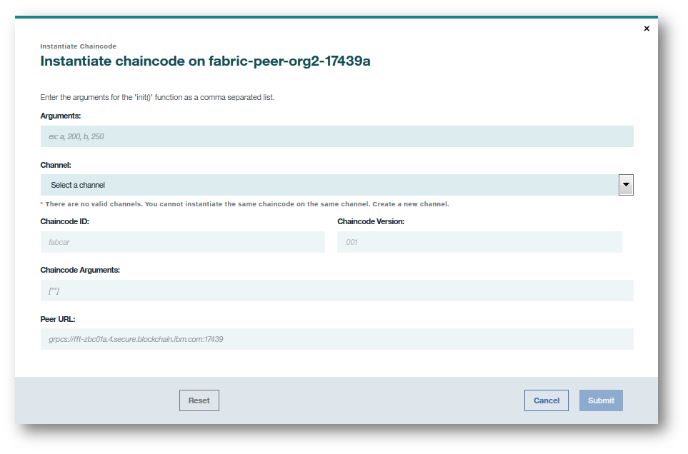

---

copyright:
  years: 2018,2019
lastupdated: "2019-04-23"

subcollection: blockchain

---

{:new_window: target="_blank"}
{:shortdesc: .shortdesc}
{:codeblock: .codeblock}
{:screen: .screen}
{:pre: .pre}

# Installing, instantiating, and updating a chaincode
{: #install-instantiate-chaincode}

Chaincode is software that encapsulates the business logic and transactional instructions for creating and modifying assets in the ledger. Chaincode can be written in different languages, and {{site.data.keyword.blockchainfull}} Platform supports Go and Node.js chaincode. A chaincode runs in a Docker container that is associated with any peer that needs to interact with it. For more information about developing chaincode, see [Chaincode Tutorials ](http://hyperledger-fabric.readthedocs.io/en/release-1.2/chaincode.html).
{:shortdesc}

Chaincode is installed on a peer, then instantiated on a channel. **All members that want to submit transactions or read data by using a chaincode need to install the chaincode on their peer.** A chaincode is defined by its name and version. Both the name and version of the installed chaincode need to be consistent across the peers on a channel.

After chaincode is installed on the peers, a single network member instantiates the chaincode on the channel. The network member needs to have joined the channel in order to perform this action. Instantiation will input the initial data used by the chaincode, and then start the chaincode containers on peers joined to the channel with the chaincode installed. The peers can then use the running containers to transact. **Note that only one network member needs to instantiate a chaincode.** If a peer with a chaincode installed joins a channel where it has already been instantiated, the chaincode container will start automatically.

The combination of **installation and instantiation** is a powerful feature because it allows for a peer to use a single chaincode across many channels. Peers may want to join multiple channels that use the same chaincode, but with different sets of network members able to access the data. A peer can the install the chaincode once, and then use the same chaincode container on any channel where it has been instantiated. This lightweight approach saves compute and storage space, and helps you scale your network.

## Installing a chaincode
{: #install-instantiate-chaincode-install-cc}

You must install the chaincode on every peer that will run this chaincode. Complete the following steps to install a chaincode:
1. In the "Install code" screen of your Network Monitor, select a peer from the drop-down list to install the chaincode onto. Click the **Install Chaincode** button.
<!--
  
-->

2. In the **Install Chaincode** pop-up panel, enter the name and version of your chaincode. **Note** that the name and version strings will be used in applications to interact with the installed chaincode. Click the **Browse** button and navigate through your local file system to wherever your chaincode source files are stored. Select one or more chaincode source files to install on the peer. Then select your chaincode language from the **Chaincode Type** dropdown.

You can install chaincode by uploading a single or multiple GO or NODE files, or you can upload chaincode inside a .zip file. Using a .zip file will maintain your chaincode with a complete directory structure. This will be helpful if you want include packages of dependencies, or use indexes with CouchDB. For more information about CouchDB and how to set up indexes, see [Best Practices when using CouchDB](/docs/services/blockchain/best_practices.html#best-practices-app-couchdb-indices) in the Developing applications tutorial. You can also find information on [managing external dependencies for chaincode written in GO ](https://hyperledger-fabric.readthedocs.io/en/release-1.2/chaincode4ade.html#managing-external-dependencies-for-chaincode-written-in-go){:new_window} in the Hyperledger Fabric documentation.

  

## Instantiate a chaincode
{: #install-instantiate-chaincode-instantiate-cc}

After a chaincode is installed onto the file system of every peer that joins a channel, the chaincode must then be instantiated on the channel so that peers can interact with the ledger via the chaincode container. The instantiation performs any necessary initialization of the chaincode. This will often involve setting the key value pairs that comprise a chaincode's initial world state.

You need to have **Operator** or **Writer** authority on the channel to instantiate the chaincode. The chaincode that has the same name and version on different peers needs to be instantiated only once to deploy the chaincode container. Complete the following steps to instantiate a chaincode:
1. In the "Install code" screen of your Network Monitor, select the peer that your installed the chaincode and locate the chaincode that you want to instantiate from the chaincode table. Then, click the **Instantiate** button under the **Action** header.
<!--
  
-->

2. In the **Instantiate Chaincode** pop-up panel, set the key value pairs as arguments for chaincode initialization, and select the channel to instantiate on.  Click **Next**.
<!--
  
-->

3. Specify your chaincode's [endorsement policy](/docs/services/blockchain/glossary.html#glossary-endorsement-policy). You can learn more about how to set endorsement policies in the [next section](#install-instantiate-chaincode-endorsement-policy).

## Specifying chaincode endorsement policies
{: #install-instantiate-chaincode-endorsement-policy}

You can use endorsement policies to specify which set of peers need to validate a new transaction. For example, an endorsement policy can specify that a transaction will be added to the ledger only if a majority of the members on the channel endorse the transaction.

The endorsement policy is set when a chaincode is instantiated on a channel. The organization that instantiates the chaincode can select from among the channel members who have installed the chaincode to become validators, and sets the endorsement policy for all channel members. You can update your endorsement policy by following the steps for [updating your chaincode](/docs/services/blockchain/howto/install_instantiate_chaincode.html#install-instantiate-chaincode-update-cc), then specifying a new policy when you reinstantiate your chaincode on the second step.

When you use the Network Monitor to set your endorsement policy, you can either use the UI to specify a **Simple Policy**, or use JSON to specify an **Advanced Policy**.

* **Use the UI to specify a Simple Policy:** First, click the **Add Member** button to select the set of members who can validate transactions. Then, in the **Endorsement Policy** section, determine how many members in the list need to validate the transaction before the transaction is approved. You can use this method to specify an endorsement policy of all channel members, a majority of them, a single member, or a simple +1 preventing members from self signing (two out of five members for example). If you do not make any changes, the default policy allows any member of the channel to endorse a transaction.

  

* **Use JSON to specify an Advanced Policy:** Use advanced policies to require endorsements from important members or administrators, or to give the endorsements of certain members more weight.

  The easiest way to specify an advanced policy is to start by building a simple policy by using the UI screen. Then, click the **Advanced Policy** button, which autofills a JSON version of the policy with the same members and rules as you set in the simple policy. You can then edit the JSON to write a more advanced version. For more information about writing endorsement policies in JSON, see [Hyperledger Fabric Node SDK documentation ](https://fabric-sdk-node.github.io/global.html#ChaincodeInstantiateUpgradeRequest). <!--You can also find examples of advanced endorsement policies in the main [Hyperledger Fabric documentation](https://hyperledger-fabric.readthedocs.io/en/release-1.2/arch-deep-dive.html#example-endorsement-policies)-->

  

Endorsement policies are not updated automatically when new organizations join the channel and install the chaincode. For example, if the policy requires two of five organizations to endorse a transaction, the policy will not be updated to require two out of six organizations when a new organization joins the channel. Instead, the new organization will not be listed on the policy, and they will not be able to endorse transactions. You can add a new organization to an endorsement policy by updating the relevant chaincode.

## Updating a chaincode
{: #install-instantiate-chaincode-update-cc}

You can update a chaincode to change the chaincode's programming while maintaining its relationship to the assets on the ledger. Because of the installation and instantiation combination, you need to update the chaincode on all peers that are on the channel with this chaincode. Complete the following steps to update your chaincode.

1. Install a chaincode with the same name as your old chaincode, but with a different version. You can follow the same steps as [Installing a chaincode](/docs/services/blockchain/howto/install_instantiate_chaincode.html#install-instantiate-chaincode-install-cc). Make sure that you select the same channel as your original chaincode.

  

2. Find your new chaincode in the table and click the **Update** button under the **Action** header. This action reinstantiates your chaincode and replaces the chaincode container with a new one. When you click the **Update** button, you have the opportunity to update the chaincode
endorsement policy, which is important to do if an organization was recently added to the channel. Note that you do not need to enter any new arguments as part of the update function. This upgrade action takes place on the channel, and only needs to be performed by one organization.

  
