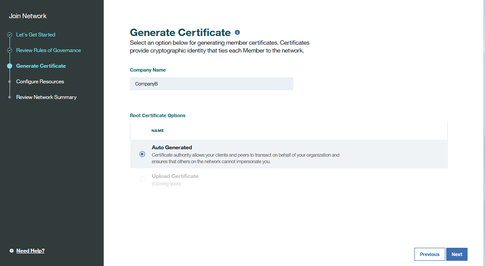

---

copyright:
  years: 2017
lastupdated: "2017-07-11"

---

{:new_window: target="_blank"}
{:shortdesc: .shortdesc}
{:screen: .screen}
{:codeblock: .codeblock}
{:pre: .pre}

# Joining an existing network

This tutorial shows you how to join an existing {{site.data.keyword.blockchain}} network on {{site.data.keyword.Bluemix_short}}.
{:shortdesc}

If you are invited to join a {{site.data.keyword.blockchain}} network, you will receive an invitation email.  Follow the steps in the email to create a {{site.data.keyword.blockchain}} service instance, and then complete the following steps.  

**Note**: You can always click **Previous** to review or modify your configuration.

1. Enter your blockchain service instance, and click **Pending Invite**.
	
	
	If you don't have a blockchain service instance, see [Creating a Blockchain instance on Bluemix](create_service.html).   

2. Select the network you want to join from the drop down list, and click **Join Network**.
	  
	
3. Verify the network name you join in the "Let's Get Started" screen, and click **Next**.

4. Review the governance rules of the network in the "Review Rules of Governance" screen, and click **Next**.

5. Give a name to your company and generate your certificates and keys in the "Generate Certificate" screen.  Click **Next** to continue.
	 

6. (Optional) Add your peers with their sizes in the "Configure Resources" screen.  Click the **Add to Order** button and you can see a summary of your requested resources under the **Resources to be Ordered** section.  Note that each member in a network can add up to 6 peers, with the size of small, medium, and large.  You can also add your peers later in the network monitor.
	 

7. Verify the network configuration in the "Review Summary" screen, and click **Done**.  You will be notified that your network is successfully created.
	 
