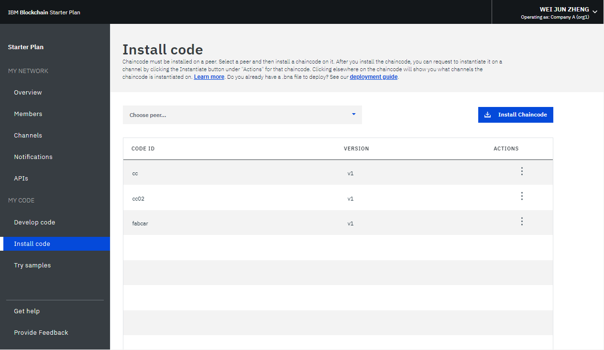

---

copyright:
  years: 2018, 2019
lastupdated: "2019-05-16"

keywords: view Logs, IBM Cloud Private, logs of a specific network component, monitor blockchain network

subcollection: blockchain

---

{:new_window: target="_blank"}
{:shortdesc: .shortdesc}
{:screen: .screen}
{:codeblock: .codeblock}
{:pre: .pre}

# Monitoring a blockchain network
{: #monitor-blockchain-network}

This tutorial shows how to view and monitor the status information of your {{site.data.keyword.blockchain}} network on {{site.data.keyword.cloud_notm}}.
{:shortdesc}


## Monitoring peers, orderers, and CAs
{: #monitor-blockchain-network-monitor-nodes}

You can issue an HTTP **HEAD** request against one of your network nodes to check the node status. A network node can be a peer, an orderer, or a CA in your blockchain network. A **HEAD** request is similar to a GET request and sends just the headers without bodies. You can get a 200 response if the node works normally.

1. In the "Overview" screen of the Network Monitor, click **Connection Profile**. Then, you can click **Raw JSON** to view the connection profile in your web browser or click **Download** to save the connection profile locally.
2. In the connection profile, find the url information of the network node that you want to check. For example, the url of the `fabric-orderer-20190b` orderer is `grpcs://fft-zbc02b.4.secure.blockchain.ibm.com:20190`.
    
3. Replace **grpcs** with **https** in the url. In the example above, the url becomes `https://fft-zbc02b.4.secure.blockchain.ibm.com:20190`.
4. Issue the **HEAD** request against the url with a tool such as curl or Chrome Postman app.
    - If you get a 200 status response, your network node works normally.
    - If the **HEAD** request fails with a connection error, your network node might not be running, the node url is wrong, or a firewall blocks your access to the node.  You must resolve this error; otherwise, your applications cannot connect the node.

The following example shows a **HEAD** request with a 200 response in curl. Note that you can ignore the grpc error because the HTTP **HEAD** request checks whether the node is accessible. If yes, the grpc request to the node also works in your application.

```
C:\>curl -i --head https://fft-zbc02b.4.secure.blockchain.ibm.com:20190
HTTP/2 200
contnent-type: application/grpc
grpc-status: 8
grpc-message: malformed method name: "/"
```

The following example shows a **HEAD** request with a connection error in curl.

```
C:\>curl -i --head https://fft-zbc02b.4.secure.blockchain.ibm.com:20190
curl: (7) Failed to connect to fft-zbc02b.4.secure.blockchain.ibm.com:20190: Connection refused
```

The following figure shows a **HEAD** request with a 200 response in Chrome Postman app.

  

## Using your network logs
{: #monitor-blockchain-network-using-logs}

The "Overview" screen of your Network Monitor displays the status of your Certificate Authority, ordering service, and peers. Click **View Logs** from the dropdown list under the **Actions** header to view the logs of a specific network component. If you use Enterprise Plan networks, you can view component logs in a text file format. If you use Starter Plan networks, component logs are gathered by the [{{site.data.keyword.cloud_notm}} Log Analysis service ](https://cloud.ibm.com/catalog/services/log-analysis) and you can view the logs in [Kibana](/docs/services/blockchain/howto/monitor_network.html#monitor-blockchain-network-viewing-kibana-logs).

Each component generates logs from different activities. This is because each component plays different roles within the Hyperledger Fabric [network architecture ](https://hyperledger-fabric.readthedocs.io/en/release-1.2/network/network.html) and [transaction flows ](https://hyperledger-fabric.readthedocs.io/en/release-1.2/txflow.html).

- **Certificate Authority logs**  
  The Certificate Authority manages the identity of participants within the network. In Certificate Authority logs, you can find logs from when participants generate public and private keys to communicate with the network (enroll), or when new members, peers, or applications register with the Certificate Authority. You can also use the CA logs to debug if there are any problems with certificate verification.

- **Ordering service logs**  
  The ordering service is the common binding component of the blockchain network. All endorsed transaction proposals from the peers, channel updates, or network membership updates are sent to the ordering service for verification. Therefore, the ordering service contains logs from when the network was started. It also contains logs for a transaction that was rejected because it was not properly endorsed by the correct organizations. You can also find logs from when channels are created or updated, or when a channel update fails.

- **Peer logs**  
  Peer logs contain the results of installing, instantiating, and invoking chaincode. You can search for a chaincodes name and version to find the logs of a certain chaincode. You can also see the logs from a specific chaincode from the [chaincode section of the channel monitor](/docs/services/blockchain/howto/monitor_network.html#monitor-blockchain-network-monitor-channel-cc). The messages, which your transaction proposals generate, or any timeout issues with your proposal requests, can be found in your peer logs. The peer logs also contain errors from transactions that were rejected for not meeting the [chaincode's endorsement policy](/docs/services/blockchain/howto/install_instantiate_chaincode.html#install-instantiate-chaincode-endorsement-policy). You can also find the results of channel join requests.

Hyperledger Fabric provides different [logging levels ](https://hyperledger-fabric.readthedocs.io/en/release-1.2/logging-control.html "logging control") based on the severity of the message. The default logging level on {{site.data.keyword.blockchainfull_notm}} Platform is `INFO`. To view additional logs, you can open a [support ticket](/docs/services/blockchain/ibmblockchain_support.html#blockchain-support-cases) to set logging level to the more verbose `DEBUG`. Be aware that the `DEBUG` level logs display a large number of gossip messages that you might need to filter. Search for `warning` or `error` in your messages to detect problems from Hyperledger Fabric components. To detect if the component container fails or is killed, search for `panic` or `killed` messages that {{site.data.keyword.cloud_notm}} sent.

## Viewing logs in Kibana in Starter Plan
{: #monitor-blockchain-network-viewing-kibana-logs}

The logs of your Starter Plan network are gathered by the [{{site.data.keyword.cloud_notm}} Log Analysis service ](https://cloud.ibm.com/catalog/services/log-analysis "Log Analysis service"). By default, your logs are collected by the Lite Plan of the Log Analysis service. This plan is free and **stores your logs for three days** before they are discarded. It also allows you to **search only the first 500 MB of your logs per day**. If your network logs exceed 500 MB, you cannot view new logs in Kibana. If your network generates more than 500 MB of logs, or you would like to retain your logs for more than three days, you can upgrade to a paid version of the Log Analysis Service.

In the "Overview" screen of your Network Monitor, click **View Logs** from the drop-down list under the **Actions** header to open each network component's logs in the Kibana interface. When Kibana opens, it displays logs that are filtered by a search bar at the top. For example, when you click to view your peer logs, the search is filtered by your network ID and your peer id: `NETWORK_ID_str:"nf8389d520c243004bb21ff5d70fc8939" && NODE_NAME_str:"org1-peer1"`. You can enter an additional field in the search bar if you want to view more specific logs. For example, you can add `&& "marbles"` to display the logs from the `"marbles"` chaincode. Deleting the specific component term and searching only with the network ID, for example, `NETWORK_ID_str:"nf8389d520c243004bb21ff5d70fc8939"`, displays the logs from all network components.

You can use the time range button at the top-right corner to change from what time period the logs are displayed. You can also use the tab on the left side of the screen to add and remove fields from the search. The most important field to display is the message field. It might be helpful to search with a message without the timestamp to find all instances of that message log. Click the **Save** button to save your current search and return to a specific view. For more information about displaying data in Kibana, see [Kibana User Guide ](https://www.elastic.co/guide/en/kibana/6.2/index.html "Kibana User Guide"). You can also [download your logs](https://cloud.ibm.com/docs/services/CloudLogAnalysis/how-to/manage-logs/downloading_logs_cloud.html#downloading_logs) to your local file system by using the Log Analysis CLI.

**Note:** By default, Kibana is preconfigured to show logs from the 30 days of activity. If there is no activity in the last 30 days, you will see a message that says *No results found*. To view other logs, you can click the timer icon in the upper right corner under your user name and set a broader time range, such as *Year to date*.

## Monitoring channels
{: #monitor-blockchain-network-monitor-channnels}

Enter Network Monitor and locate the channel that you want to view and monitor in the "Channel" screen. In the specific channel screen, you can view the data status information, members, and instantiated chaincode of this channel in three tabs:

### Channel Overview
{: #monitor-blockchain-network-monitor-channel-overview}

The "Channel Overview" tab shows the block information on this channel:
  * A series of data points, which include the total number of blocks that have been created, the time interval since the last transaction, the number of chaincode instantiations, and the number of chaincode invocations.
  * A table that lists all blocks on this channel. Expand a block and you can view the detailed information about the block.

  

### Members
{: #monitor-blockchain-network-monitor-channel-members}

The "Members" tab shows the information of the members on this channel, including the email addresses for the organizational operators.

  

### Chaincode
{: #monitor-blockchain-network-monitor-channel-cc}

The "Chaincode" tab lists all the chaincode that are instantiated on this channel with chaincode ID, version, and number of peers that are running the chaincode.

Expand a chaincode row to get detailed information about the chaincode:
  * You can click **JSON** to view the JSON file of the chaincode.
  * You can click **Logs** to view logs of the chaincode. This view displays logs from which peer you installed the chaincode and are filtered with the chaincode name and version.

    It is recommended to add unique success or error messages after each chaincode function to help you monitor and debug the chaincode. If you have a complex chaincode that uses many different files, you can add a unique keyword in your chaincode logs that can help you locate messages from different transaction stages.
   * You can click **Delete** to remove the running chaincode container. Note that deleting the running chaincode container does not actually delete the chaincode. An instantiated chaincode on blockchain network cannot be deleted.

  


## Monitoring chaincode
{: #monitor-blockchain-network-monitor-chaincode}

Enter Network Monitor and open the "Install Code" screen. If you have running chaincode, you can see the chaincode with chaincode IDs and versions in the table. Choose a peer from the drop-down list and you can see all chaincode for this peer in the table. You can view the logs of the chaincode on the ["Chaincode" tab](/docs/services/blockchain/howto/monitor_network.html#monitor-blockchain-network-monitor-channel-cc) of your specific "Channel" screen.

  

<!----
## Monitoring sample applications
{: #monitor-apps}

In a Starter Plan network, you can view and access sample applications in the "Try Samples" screen of the Network Monitor.  After you deploy a sample application, you can click the **Launch** button to enter your application interface, or the **View on GitHub** link to visit the code repository.  For more information, see [Deploying sample applications](/docs/services/blockchain/prebuilt_samples.html#deploying-sample-applications).

  
--->
