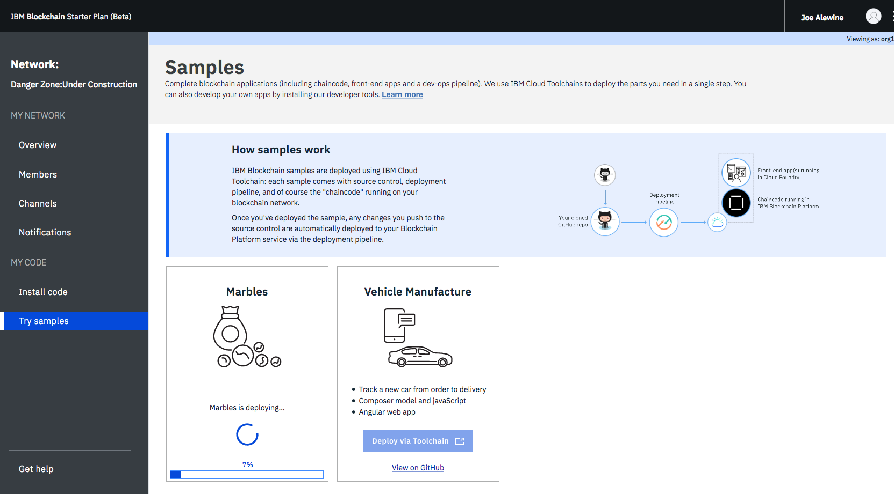

---

copyright:
  years: 2018
lastupdated: "2018-03-14"

---

{:new_window: target="_blank"}
{:shortdesc: .shortdesc}
{:screen: .screen}
{:codeblock: .codeblock}
{:pre: .pre}

# Deploying sample applications
{: #overview}

{{site.data.keyword.blockchainfull}} Platform provides sample applications you can deploy and test so that you can get a better understanding of blockchain networks and application development.
{: shortdesc}

After you've spun up a Starter Plan network, you can deploy the sample applications in the Network Monitor, which automates the steps to enable sample applications to run on your network. You can also enable the samples step by step to learn the entire process of application deployment (which you'll need to follow when deploying your own applications).

## Deploying sample applications in Starter Plan

Starter Plan provides a simple approach to deploy sample applications by leveraging the Toolchain service on {{site.data.keyword.cloud_notm}} with just a few clicks. After you deploy and launch a sample application, it will run on your blockchain network automatically.

Starter Plan provides two sample applications for you to start with.

* **Marbles**

  The Marbles sample enables users to create virtual marbles with different properties and to transfer them with other users. For more information about Marbles, see [Marbles Demo](https://github.com/IBM-Blockchain/marbles).

* **Vehicle Manufacture**

  The Vehicle Manufacture sample enables users to go through the lifecycle of a virtual vehicle. For more information about this sample, see [Vehicle Manufacture](link).

Complete the following steps to deploy a sample application:

1. Enter the **Network Monitor** of your Starter Plan network. If you don't have one, see [Creating a network](get_start_starter_plan.html#creating-a-network).

2. Open the "Try samples" screen in your Network Monitor. Choose the sample application that you want to deploy and click the **Deploy via Toolchain** button.
<!--
    
-->
3. A Toolchain service configuration window opens. Ensure that all required tools are correctly integrated. Note that if you have more than one organizations, make sure that you enter the correct organization name. The organization name should be the email address that you use to sign up for the network.
    **Tip**: You must disable pop-up blockers so that the Toolchain service configuration page can open.
<!--
    
-->
  If this is the first application that you deploy via Toolchain, you need to authorize Toolchain to access the GitHub repository.

  

  After you click the "Authorize" botton, you'll be taken to GitHub. If you don't have a GitHub account, you need to create one. Give Toolchain access to your repositories by entering your account information. If you don't want to give Toolchain this access, you can deploy the sample applications manually. For more information, see [Deploying sample applications manually](#deploy_sample_applications_manually).

5. Click the **Create** button at the bottom of the Toolchain page. This should take you back to the Network Monitor, where the deployment of Marbles should be in process. This process should take five to 10 minutes.
<!--
    
-->
After the deployment completes, you can start to use the Marbles sample on your Starter Plan network.

Because this process creates a forked GitHub repository that you have access to and control over, you can make changes to Marbles in the forked repository and commit them. These commits will trigger an automatic build of your Marbles application and allow you to demo it in {{site.data.keyword.cloud_notm}}.

## Deploying sample applications manually
{: #deploy_sample_applications_manually}

If you want to deploy sample applications without using the Network Monitor, ensure that you install all software prerequisites on your local file system. For more information, see [Setting up application development environment](../v10_application.html#setting-up-application-development-environment).

You also need a blockchain network on {{site.data.keyword.Bluemix_short}} with either Starter Plan or Enterprise Plan, and configure a channel and its peers. For more information, see [Govern Starter Plan network](get_start_starter_plan.html) and [Govern Enterprise Plan network](../get_start.html). When your network is ready to have a sample application deployed on it, retrieve the API endpoints of your network resources that your application will access, as in [Adding network API endpoints to your application](../v10_application.html#adding-network-api-endpoints-to-your-application).

You can deploy one of the following sample applications:

- **Marbles**

  In the Marbles application, multiple users can create marbles with different properties and transfer them to others. The Marbles application is written in Javascript and the chaincode is written in Go.

  You can find the sample code and instructions in [Marbles in GitHub ](https://github.com/IBM-Blockchain/marbles).

  Use the Bluemix instructions here rather than the instructions for hosting Marbles locally and input the relevant information from your network. Note that the screenshots in the Marbles github show the Enterprise Plan UI (since the Enterprise Plan only supports the manual path for deploying Marbles), which is a little different from the Starter Plan UI. Nevertheless both UIs have the same basic parts, and you'll be able to find the names of your peers, channels, and other service credential information in the appropriate panels.

- **Fabcar**

  In Fabcar, you can perform **queries** and **ledger updates** on car records in the ledger. Fabcar is written in Javascript and the chaincode is written in Go.

  You can find sample code in [Fabric car in GitHub ](https://github.com/hyperledger/fabric-samples/tree/release/fabcar), and instruction in [Writing Your First Application ](http://hyperledger-fabric.readthedocs.io/en/latest/write_first_app.html).

- **Other applications**

  For more information about how to host your own applications inside {{site.data.keyword.cloud_notm}}, see [Hosting applications](v10_application.html#hosting-applications).

## Deleting a sample application

To delete a sample application that was acquired through the Toolchain process you'll need to navigate to where the sample lives in the UI. Because sample applications are instantiated on a channel, click on "Channels" on the left navigation, then clicking on the relevant channel (Starter Plan networks will launch with a default channel called, appropriately enough, `defaultchannel`), and then "Chaincode". This will disploy the chaincodes that have been instantiated on the channel.

If you click on this app, you'll see a tab called "delete". However, clicking this alone will not delete the sample application. You'll also have to navigate to the Bluemix dashboard and the Toolchain dashboard and delete the sample there as well.
