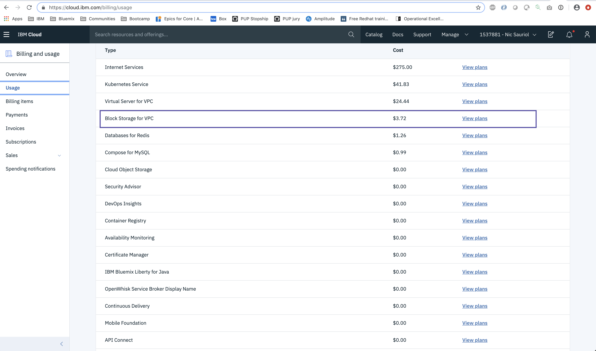
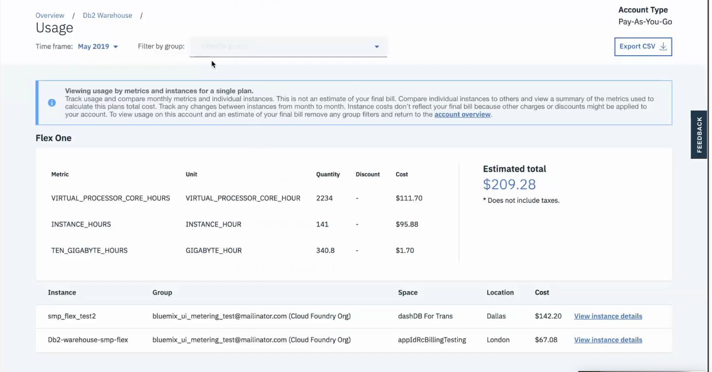

---

copyright:
  years: 2019
lastupdated: "2019-05-16"

keywords: pricing model, hourly, per hour, VPC, CPU, vCPU, virtual core, cost, scalability, estimation, optimize your cost

subcollection: blockchain

---

{:new_window: target="_blank"}
{:shortdesc: .shortdesc}
{:screen: .screen}
{:codeblock: .codeblock}
{:note: .note}
{:important: .important}
{:tip: .tip}
{:pre: .pre}

# Pricing
{: #ibp-saas-pricing}

This guide helps you understand the pricing model for {{site.data.keyword.blockchainfull}} Platform on {{site.data.keyword.cloud_notm}}, and how much you will pay when you develop and grow your blockchain network of peers, orderers, and Certificate Authorities components, which are based on Hyperledger Fabric v1.4.1.
{:shortdesc}

_This pricing model is for {{site.data.keyword.blockchainfull_notm}} Platform on {{site.data.keyword.cloud_notm}} only. If you are using Starter Plan or Enterprise Plan and have questions on pricing, see Starter Plan and Enterprise Plan [pricing](/docs/services/blockchain?topic=blockchain-ibp-pricing)._

{{site.data.keyword.blockchainfull_notm}} Platform introduces a new hourly pricing model that is based on virtual processor core (VPC) usages. This simplified model is based on the amount of CPU (or VPC) that your {{site.data.keyword.blockchainfull_notm}} Platform nodes consume on an hourly basis, at a flat rate of **$0.29 USD/VPC-hour**.

A VPC is a unit of measurement that is used to determine the licensing cost of {{site.data.keyword.IBM_notm}} products. It is based on the number of virtual cores (vCPUs) that are available to the product. A vCPU is a virtual core that is assigned to a virtual machine or a physical processor core. For {{site.data.keyword.blockchainfull_notm}} Platform cost estimation purposes, **1 VPC = 1 CPU = 1 vCPU = 1 Core**.
{:note}

For a total cost estimate, remember that your blockchain network consists of an {{site.data.keyword.cloud_notm}} Kubernetes cluster that contains {{site.data.keyword.blockchainfull_notm}} Platform components and uses storage of your choice. Your {{site.data.keyword.cloud_notm}} Kubernetes cluster and the storage that you choose incur separate charges. You will not be charged for the cluster that the Operational Tooling instance, also known as the console, is running on. See the [Architecture reference](/docs/services/blockchain/howto/ibp-console.html#ibp-console-overview-architecture) topic for an illustration. More details on how to calculate charges are described below.

Developers can get started with our free [extension for VS Code ](https://marketplace.visualstudio.com/items?itemName=IBMBlockchain.ibm-blockchain-platform "{{site.data.keyword.blockchainfull_notm}} Platform VS Code Extension"). Use this integrated developer environment to write, test, debug, and package smart contracts locally and for {{site.data.keyword.blockchainfull_notm}} Platform deployment, as well as to write client applications. Start from scratch or access tutorials and samples to learn blockchain fundamentals.

## Benefits of the new pricing model
{: #ibp-saas-pricing-benefits}

- **No membership fees**: Freedom from membership fees means that you can invest directly in your blockchain components.
- **Estimation clarity**: A simple hourly pricing model makes cost estimation clear and easy by using the cost estimator tool that is available in the {{site.data.keyword.cloud_notm}} dashboard.
- **No minimum fee required**: Pay for only what you use, no minimum VPC hourly package is required, which makes it very inexpensive to get started.
- **Scalability of compute**: You have the option to scale your compute up during peak usage periods or down to a minute fraction of capacity for when the compute is not needed to minimize expense.  

In summary, these features remove the complexity of accounting for membership limitations or purchasing compute ahead of your needs.

## Key elements of cost
{: #ibp-saas-pricing-elements}

Because your blockchain network consists of an {{site.data.keyword.cloud_notm}} Kubernetes cluster that contains {{site.data.keyword.blockchainfull_notm}} Platform components and uses storage of your choice, each of the following elements forms your total cost:

- **{{site.data.keyword.blockchainfull_notm}} Platform** flat rate of $0.29 USD/VPC-hour.
- **{{site.data.keyword.cloud_notm}} Kubernetes Service** cluster's tiered pricing that is visible in {{site.data.keyword.cloud_notm}} when you provision your paid cluster. This includes the charges for your compute, that is, CPU and memory. {{site.data.keyword.cloud_notm}} Kubernetes Services are priced on a tiered model that is based on the number of hours of usage per month. Therefore, when you examine pricing plans, consider that 24x7 usage is equivalent to 720 hours per month. Refer to the table on the [Kubernetes Service Catalog page ](https://cloud.ibm.com/kubernetes/catalog/cluster "Kubernetes Service") for more details on cluster pricing.
- Choose the **storage** plan that works for your needs. See the [Understanding Kubernetes storage basics](/docs/containers?topic=containers-kube_concepts#kube_concepts) topic to learn more about your storage class options and how much they [cost ](https://www.ibm.com/cloud/file-storage/pricing). The {{site.data.keyword.blockchainfull_notm}} Platform nodes use the default storage class for the cluster. When you provision a Kubernetes cluster in {{site.data.keyword.cloud_notm}}, it is preconfigured with [Bronze level File storage](/docs/containers?topic=containers-file_storage#file_predefined_storageclass) as the persistent storage plug-in.

## Pricing examples
{: #ibp-saas-pricing-scenarios}

The following table provides two examples of pricing with [default resource allocations]( #ibp-saas-pricing-default) unless otherwise noted.
- The **Test network** scenario is suitable for getting started and testing smart contracts.
- The **Join a production network** scenario includes two peers, which are recommended for high availability, and a Certificate Authority (CA) that is required for organization membership.
   - These peers can join a production {{site.data.keyword.blockchainfull_notm}} Platform network that is hosted elsewhere.
   - Nodes can always be dialed back to a minimal utilization state (0.001 CPU) when they are not in use to [lower costs](/docs/services/blockchain?topic=blockchain-ibp-console-govern#ibp-console-govern-reallocate-resources).
   - Because this scenario is intended for a **production** environment:
     - The default compute resources have been doubled to provide greater capacity.
     - The [Silver ](/docs/containers?topic=containers-file_storage#file_silver) storage class is chosen for faster performance.

| Pricing options** (1 VPC = 1 CPU)| **Test Network** | **Join a Production Network** |
|-|------------|-----------------------------|
| **CPU allocation** |  1.75 CPU   Includes:   - 1 peer   - 2 CAs   - 1 orderer| 4.5 CPU   Includes:   - 2 peers (for HA)   **(2x default compute)**  - 1 CA    |
| **Hourly cost: {{site.data.keyword.blockchainfull_notm}} Platform** | $0.51 USD   (1.75 CPU x $0.29 USD/VPC-hr) | $1.31 USD   (4.5 CPU x $0.29 USD/VPC-hr ) |
| **Hourly cost: {{site.data.keyword.cloud_notm}} Kubernetes cluster**    | $0.13 USD   (Compute: 2 x 4 tier)   (IP Allocation: $16 USD/month) | $0.46 USD   (Compute: 8 x 32 tier)   (IP Allocation: $16 USD/month) |
| **Hourly cost: Storage** | $0.07 USD   340GB    [Bronze ](https://www.ibm.com/cloud/file-storage/pricing)    2 IOPS/GB | $0.13 USD   420GB   [Silver ](https://www.ibm.com/cloud/file-storage/pricing)   4 IOPS/GB  |
| **Total hourly cost** | **$0.71 USD** | **$1.90 USD**| |
** Preview the {{site.data.keyword.blockchainfull_notm}} Platform at no charge for 30 days when you link your {{site.data.keyword.blockchainfull_notm}} Platform service instance to an {{site.data.keyword.cloud_notm}} Kubernetes free cluster. Performance will be limited by throughput, storage and functionality. {{site.data.keyword.cloud_notm}} will delete your Kubernetes cluster after 30 days and you cannot migrate any nodes or data from a free cluster to a paid cluster.  

Your actual costs will vary depending on additional factors such as transaction rate, the number of channels you require, the payload size on the transactions, and the maximum number of concurrent transactions.
{:note}

There is no limit to the number of service instances that you can provision and associate to a single Kubernetes cluster, but you need ensure that adequate resources are available by monitoring the CPU, memory, and storage usage to avoid disruption of service. The {{site.data.keyword.blockchainfull_notm}} Platform nodes do not have to be in their own cluster. You can have other {{site.data.keyword.cloud_notm}} services running in your cluster that your blockchain components are running in, but again you need to ensure that you have adequate compute and storage to address all the requirements of all the service instances.

## Default resource allocations
{: #ibp-saas-pricing-default}

The values in the following table are useful to estimate the hourly cost of your custom network based on CPU, compute, and storage.

| **Component** (all containers) | CPU  | Memory (GB) | Storage (GB) |
|--------------------------------|---------------|-----------------------|------------------------|
| **Peer**                       |  1.1          | 2.2                   | 200 (includes 100GB for peer and 100GB for CouchDB)|
| **CA**                         | .1            | .2                    | 20                     |
| **Orderer**                    | .45           | .9                    | 100                    |

## Billing
{: #ibp-saas-pricing-billing}

Your billing and usage information for your **Pay as you go** account is available in the {{site.data.keyword.cloud_notm}} dashboard on your [usage](https://cloud.ibm.com/billing/usage) tile. A metering service takes hourly snapshots of your total {{site.data.keyword.blockchainfull_notm}} Platform VPC usage so that the monthly cumulative usage amount is reflected in the **Usage** tile.

When you create a new node, it might take up to an hour for VPC usage to be updated in the {{site.data.keyword.cloud_notm}} dashboard **Usage** tile.
{:note}

Navigate to **Manage** on the top of your {{site.data.keyword.cloud_notm}} dashboard, click **Billing and Usage**, and then click **Usage** in the left menu. The pie chart under the **Services** subsection gives you a breakdown of your total cost by the types of service offerings that you have used and consumed this month. Use this chart to understand how your {{site.data.keyword.blockchainfull_notm}} Platform, your Kubernetes service, and storage contribute to your total cost.

<!--
  
*Figure 1. View your Usage on the dashboard*-->

When you scroll down, you can see a similar breakdown by **Type** and **Cost** in a list view. You can find "Kubernetes Service", "Block Storage for VPC", or "File Storage for VPC", and "{{site.data.keyword.blockchainfull_notm}} Platform" among others. Click **"view plans"** next to each of these items to understand your cost breakdown by metric. For example, `VIRTUAL_PROCESSOR_CORE_HOURS` will determine the total number of hours the VPCs were used and how much it cost.  Use this to understand how you are going to be charged based on various pricing metrics.

<!--
  
*Figure 2. Find out how much cost you're incurring on Blockchain Service, Storage and more*

  
*Figure 3. Track how many VPC hours you're utilizing, and more*
-->

## Optimizing the cost of your nodes
{: #ibp-saas-pricing-shutdown}

One of the key benefits of the {{site.data.keyword.blockchainfull_notm}} Platform pricing model is the ability to dial back or delete resources when they are not needed.

- **Switch your nodes to Minimum Utilization State**  
  CPU on individual nodes can be scaled down to 0.001 CPU to completely minimize charges. Taking these actions renders the node non-functional. When the compute is needed later, you can use the reallocation option in the {{site.data.keyword.blockchainfull_notm}} Platform console to scale up to what is required. For more information about how resources can be reallocated, see [Reallocating resources](/docs/services/blockchain?topic=blockchain-ibp-console-govern#ibp-console-govern-reallocate-resources).

- **Delete unused peer and deploy a new one when needed**  
  Because the ledger is stored on the orderer, when you deploy a new peer and join a channel, the peer receives a copy of the distributed ledger. The drawback to this approach is that you need to generate new certificates and join the peer to the channels again.

  It is not recommended to ever delete a CA node because the data on it can never be recovered. Likewise, if you have only a single orderer node, you should never delete it.  
  {:important}

- **Monitor and adjust your resource allocation based on your needs**  
  When you monitor your resource usage over time, you might decide that you can scale down the resources that are allocated to a node while still ensuring adequate performance. When you follow instructions for [reallocating resources](/docs/services/blockchain?topic=blockchain-ibp-console-govern#ibp-console-govern-reallocate-resources) in the console, the effects on total VPC for the node are updated and can be used to estimate revised monthly costs.
