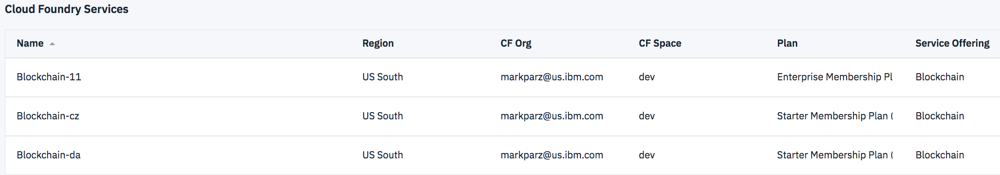

---

copyright:
  years: 2017, 2018
lastupdated: "2018-07-31"

---

{:new_window: target="_blank"}
{:shortdesc: .shortdesc}
{:screen: .screen}
{:codeblock: .codeblock}
{:pre: .pre}

# Pricing

***[Is this page helpful? Tell us.](https://www.surveygizmo.com/s3/4501493/IBM-Blockchain-Documentation)***

This guide helps you understand pricing for {{site.data.keyword.blockchainfull}} Platform membership plans, and how much you will pay as you develop and grow your blockchain network.  
{:shortdesc}

{{site.data.keyword.blockchainfull}} Platform charges monthly membership and peer fees to organizations who build blockchain networks. The fees are different depending on the membership plan that you choose and the network resources that your network uses. The following table shows the pricing overview of {{site.data.keyword.blockchainfull_notm}} Platform.

| Pricing elements | Starter Plan cost per month | Enterprise Plan cost per month |
|-----|-----|-----|
| Membership fee | $250 | $1000 |
| Peer fee | $125 | $1000 |

*Figure 1. {{site.data.keyword.blockchainfull}} Platform pricing overview*

The monthly fee is billed daily prorated. For example, a member (associated membership fee of $1,000) of two peers (per peer fee of $1,000 X 2 peers) needs to pay $3,000 every month. If the month has 30 days, the member pays $100 ($3,000/30) every day. For more information about how to pay for your networks, see [Paying mode](paying_mode.html).

**{{site.data.keyword.blockchainfull_notm}} Platform Starter Plan offers you $500 trial credits** before you are charged. For more information, see [Starter Plan pricing](#starter-plan-pricing).

## Network basic components

To understand pricing, we need to start with an introduction to basic components of a network. {{site.data.keyword.blockchainfull_notm}} Platform enables the creation of a blockchain network that is based on Hyperledger Fabric. At a high level, a Fabric blockchain network consists of the following basic components:

-	**Organizations** – Any entity who needs to maintain a copy of the blockchain ledger and needs to validate transactions. There can be multiple blockchain organizations for a single company.
-	**Peers** – The node associated with an organization that contains the blockchain ledger and validates transactions. Peers are associated with an individual blockchain organization.
-	**Ordering service** – Composed of a single orderer (SOLO) or a collection of orderers. The ordering service sequences transactions, creates blocks, and sends blocks to peers for validation.
-	**Certificate Authority (CA)** –Issues digital certificates for identification purposes to any interactive network component.

{{site.data.keyword.blockchainfull_notm}} Platform offers two membership plans, the **Starter Plan** and the **Enterprise Plan**, that you can choose in {{site.data.keyword.cloud_notm}}. Both plans allow you to create organizations and provide you with a certificate authority. The plans diverge around the peers, CAs, and the ordering service.

Enterprise Plan provides you with highly available CA's and peers with a crash fault tolerant ordering service. Starter Plan does not have high availability options and utilizes a basic, SOLO ordering service. For this reason, Starter Plan is designed to be the {{site.data.keyword.blockchainfull_notm}} Platform entry point for development, testing, and proof-of-concept environments. Enterprise Plan is the option for networks that are ready for pilot and production environments.

## Key elements of pricing

Both Starter Plan and Enterprise Plan have two pricing elements:

- **Membership fee** – Covers organization creation, access to ordering service and CA, and is charged on a **per-instance** basis. Included in this pricing element, {{site.data.keyword.blockchainfull_notm}} Platform handles the ordering service and the CA on your network’s behalf. This fee is required to have access to a network built on {{site.data.keyword.blockchainfull_notm}} Platform.

  -	Starter Plan allows for *unlimited* organizations per membership and the ability to switch between organizations in the Network Monitor. Because Starter Plan is designed for development, test, and POC environments, you can simulate in the multi-organization environments. **Note** that the total network storage is capped at 20GB, including the components, chaincode, and ledger data. Your simulated organizations share the 20GB storage in the blockchain network.

  -	Enterprise allows for a single organization per membership. Because Enterprise is designed for pilot and production environments, you are linked to your specific organization.

-	**Peer fee** – Covers an organization’s peers and is charged on a **per-peer** basis. This fee is required only if you would like to have a peer to maintain a copy of the ledger and validate transactions.

### Membership fee example

Figure 2 shows an example of network instances, which can help to understand the membership fee. In the figure, the particular {{site.data.keyword.cloud_notm}} account provisions three network instances: one Enterprise Plan instance with the name of *Blockchain-11* and two Starter Plan instances with the name of *Blockchain-cz* and *Blockchain-da*. Each instance requires its own ordering service and CA. In this case, this particular {{site.data.keyword.cloud_notm}} account needs to pay three membership fees, one for each network instance.

  
*Figure 2. Blockchain network instances*

## Starter Plan pricing

Starter Plan networks are provisioned with a default configuration of two organizations and one peer per organization, for a total of $500 per month. With the default configuration, there’s no immediate need to manipulate the environment to get started. You may add more organizations at no charge, and can add more peers to your organizations at a charge of $125 per month per peer. Your bill is reflected in Figure 3 if you create or join a Starter Plan network with the default configuration.

| Pricing components | Cost per month |
|-----|----------------|
| Membership fee | $250 |
| Peer fee | $125 |
| Peer fee | $125 |
| End of month charge | $500 |

*Figure 3. Charge of a default Starter Plan network*

### Example Starter Plan pricing

#### Starter Plan trial
The purpose of the Starter Plan is to allow anyone to get started and see the value add of {{site.data.keyword.blockchainfull_notm}} Platform. Therefore, {{site.data.keyword.blockchainfull_notm}} Platform offers $500 in cloud credits intended to cover all charges for new users that would be accrued over one month with the default network configuration that is outlined above. Your bill is reflected in Figure 4 if you create or join a Starter Plan network for the **first time** with the default configuration.

| Pricing components | Cost per month |
| ----- | ---------------- |
| Membership fee network 1 | $250 |
| Peer fee | $125 |
| Peer fee | $125 |
| Total | $500 |
| Credits | -$500 |
| End of first month charge | $0 |

*Figure 4. Charge of a default Starter Plan network with cloud credits*

**New users have to sign up for cloud credits.** They are not applied automatically. Please [sign up ](https://www.ibm.com/account/reg/us-en/signup?formid=urx-32798 "sign up") to claim the credits if you have not already. Wait 24 hours to make sure that the credits are in your [account ](https://console.bluemix.net/docs/billing-usage/viewing_usage.html#credits "account") before you access Starter Plan. Otherwise, you might get charged before the credits apply.

The offer provides lifetime credits. The credits last as long as you maintain your {{site.data.keyword.cloud_notm}} account, so you do not have to use them in the first month. The credits apply to all of {{site.data.keyword.cloud_notm}} services. They can be consumed by products other than the {{site.data.keyword.blockchainfull}} Platform that you use on {{site.data.keyword.cloud_notm}}.

| Pricing components | Cost per month |
| ----- | ---------------- |
| Membership fee network 1 | $250 |
| Peer fee | $125 |
| Total | $375 |
| Additional IBM Cloud Services | $75 |
| End of first month charge | $0 |
| Credits used | -$450 |
| Credits remaining after first month | $50 |

*Figure 5. Using trail credits with other IBM Cloud Services*

#### Additional peers
Starter Plan does not restrict the number of peers that you can add to your network. If you add, for example, two peers to the default Starter Plan network, one for each of your organizations, you increase your bill by $250 per month. Your bill is reflected in Figure 6 if you add two additional peers at the beginning of the first month when you create or join a Starter Plan network and consume the trial credits.

| Pricing components | Cost per month |
|-----|----------------|
| Membership fee network 1 | $250 |
| Peer fee | $125 |
| Peer fee | $125 |
| Peer fee | $125 |
| Peer fee | $125 |
| Total | $750 |
| Credits | -$500 |
| End of first month charge | $250 |

*Figure 6. Charge of a default Starter Plan network with additional two peers*

#### Additional networks
Starter Plan also does not restrict the number to network instances that you can provision. If you provision a second network instance of Starter Plan, you need to pay a second membership fee and a second set of peer fees associated with the second network. Therefore, you increase your bill by $500 per month to use the default network configuration. You might find yourself in the scenario where you require additional Starter networks for your development, test, and proof-of-concept environments isolated from each other. An example would be when you want to provide your quality engineers to perform significant functional testing away from your development environment.

Your bill is reflected in Figure 6 if you add an additional network at the beginning of the first month when you create or join a Starter Plan network and consume the trial credits.

| Pricing components | Cost per month |
|-----|----------------|
| Membership fee network 1 | $250 |
| Peer fee | $125 |
| Peer fee | $125 |
| Membership fee network 2 | $250 |
| Peer fee | $125 |
| Peer fee | $125 |
| Total | $1000 |
| Credits | -$500 |
| End of first month charge | $500 |

*Figure 7. Charge of two default Starter Plan network*

#### Removing peers
You can also remove a peer from the default Starter Plan network configuration. In this situation, {{site.data.keyword.blockchainfull_notm}} Platform still offers you the $500 of Cloud trial credits, but your bill will be reduced by $125 per month. The result is $125 peer credits leftover at the end of the month. You might find yourself in this scenario when you are collaborating with another member in your Starter Plan environment, where each of you need only a single peer. Your bill is reflected in Figure 8 if you remove a peer from your Starter Plan network and consume the trial credits.

| Pricing components | Cost per month |
| ----- | ---------------- |
| Membership fee network 1 | $250 |
| Peer fee | $125 |
| Peer fee | N/A |
| Total | $375 |
| Credits | -$500 |
| End of first month charge | $0 |
| Remaining membership credits | $0 |
| Remaining peer credits | $125 |

*Figure 8. Charge of a default Starter Plan network with extending credits*

## Enterprise Plan pricing

{{site.data.keyword.blockchainfull_notm}} Platform doesn't provide default configuration for an Enterprise Plan network. You can choose the configuration that you would like to start with. When you are ready to use Enterprise Plan, you should have a good understanding of what your network configuration should be. As a high availability best practice, we strongly recommend a minimum of two peers per organization to ensure your organization does not experience a network outage.

If you are in an Enterprise Plan network with the other network member, and each of you add two peers for your organization, each of your bill is reflected in Figure 8.

| Pricing components | Cost per month |
|-----|----------------|
| Membership fee | $1000 |
| Peer fee | $1000 |
| Peer fee | $1000 |
| End of month charge | $3000 |

*Figure 9. Charge of a basic Enterprise Plan network*

### Example Enterprise Plan pricing

#### Additional peers
Continue with the example above, if you add another two peers to your organization. You bill increases by $2000 per month. Your bill is reflected in Figure 10:

| Pricing components | Cost per month |
|-----|----------------|
| Membership fee | $1000 |
| Peer fee | $1000 |
| Peer fee | $1000 |
| Peer fee | $1000 |
| Peer fee | $1000 |
| End of first month charge | $5000 |

*Figure 10. Charge of an Enterprise Plan network with four peers*

If the other member keeps the same network configuration, the member’s bill looks the same as before, which is reflected in Figure 8.

#### Additional networks
Enterprise Plan also does not restrict the number to network instances that you can provision or join. If you create a second Enterprise Plan network with the same basic network configuration, that is, one single organization with two peers, your bill is reflected in Figure 11. You might find yourself in this scenario when you have created multiple networks, joined multiple networks, or a combination of the two.

| Pricing components | Cost per month |
|-----|----------------|
| Membership fee network 1 | $1000 |
| Peer fee | $1000 |
| Peer fee | $1000|
| Membership fee network 2 | $1000 |
| Peer fee | $1000 |
| Peer fee | $1000|
| Total | $6000 |

*Figure 11. Charge of two Enterprise Plan networks both with basic network configuration*

If the other member uses only one Enterprise Plan network and keeps the same network configuration, the member’s bill looks the same as before, which is reflected in Figure 9.
