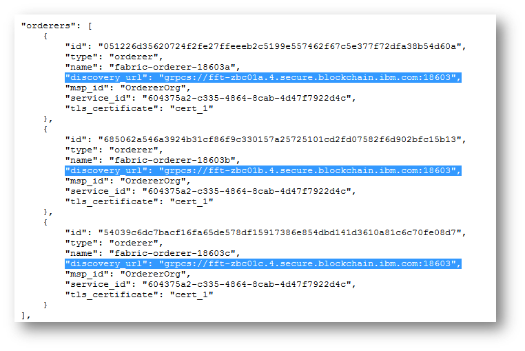

---

copyright:
  years: 2017
lastupdated: "2017-07-14"

---

{:new_window: target="_blank"}
{:shortdesc: .shortdesc}
{:screen: .screen}
{:codeblock: .codeblock}
{:pre: .pre}

# Adding service credentials to your application

This tutorial shows you how to add service credentials of your network resources to your application so that it can interact with your {{site.data.keyword.blockchain}} network on {{site.data.keyword.Bluemix_short}}.
{:shortdesc}

The service credentials are in JSON format and contain the API endpoint information and enrollIDs/secrets for your network resources (i.e. peers, ordering nodes and CAs).  Your application will interact with peers and other network components through these API endpoints.  

1. Retrieve the API endpoint information for your network resources by clicking the **Service Credentials** button in the "Resources" screen of your network monitor.
  
	
	If you don't have a {{site.data.keyword.blockchain}} network on {{site.data.keyword.Bluemix_short}}, see [Getting started with IBM Blockchain Platform](../index.html).  

2. Locate the credentials and API endpoint information of your network resources.  
    

	***Note***: If you want to target additional peers in the network (this will be the case when you require endorsement from a peer not belonging to your Org) then you will need to obtain the correct API endpoints for those peers. You also need to store the CA cert for the other Org in order to verify responses returned to your application. This information is not exposed in your Resources view, therefore you must contact the appropriate admin for the Bluemix Org and acquire this data in an out-of-band operation. The ordering service URL is common across the network; you don't need any member-specific info for this component.  

3. Plug the API endpoint information into a configuration file of your application as shown in the following example:  
	```
	orderer_url: 'grpcs://fft-zbc01a.4.secure.blockchain.ibm.com:18603'
	```
