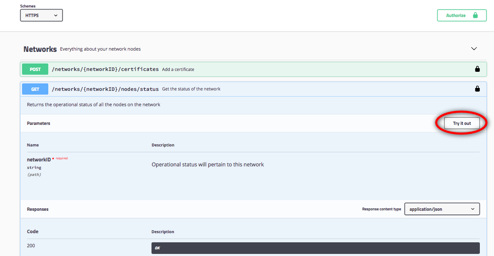

---

copyright:
  years: 2017, 2018
lastupdated: "2018-06-14"

---

{:new_window: target="_blank"}
{:shortdesc: .shortdesc}
{:screen: .screen}
{:codeblock: .codeblock}
{:pre: .pre}

# Interacting with the network using Swagger APIs

{{site.data.keyword.blockchainfull_notm}} Platform exposes a number of REST APIs in Swagger that you can use to manage the nodes, channels, peers, and members of your network. Your applications can use these API's to control important network resources without using the network monitor.

{:shortdesc}

Before you begin, you need to create a [{{site.data.keyword.blockchain}} Platform service instance ](https://console.bluemix.net/catalog/services/blockchain) on {{site.data.keyword.Bluemix_notm}} and create or join a Starter Plan <!--or Enterprise Plan -->blockchain network.

## Retrieving network credentials

{: #retrieving-network-credentials}

Enter the Network Monitor of your Blockchain network and open the "APIs" screen from the left navigator. You can see your network credentials for the REST APIs. You will later authorize the APIs by using the values of the "key" and "secret" displayed here, and run the APIs with the "network_id" as a parameter. Click **Show secret** to reveal the value of the secret field. Copy the values of the key, secret, and network_id fields, which you can used later in the Swagger UI.

**Figure 1** shows the "APIs" screen:

*Figure 1. APIs*

If you are using the Starter Plan, it is possible to switch between organizations in the Network Monitor. With the Starter Plan, two organizations are configured by default. Switching between organizations can be useful to try out the REST APIs from the perspective of each organization. To get the credentials for another organization in your network, click your username in the upper right corner of the Network Monitor console. In the menu that opens, click the drop-down arrow next to the Organization to view all Organizations. Select the organization that you would like to switch to and view the associated network credentials.

**Figure 2** shows how to Switch between organizations:

  
*Figure 2. Switching between organizations*

## Authorizing Swagger APIs

Click the **Swagger UI** link on the "APIs" screen to open the Swagger UI.  
<!-- remove this line because the link is different depending on if you are starter or enterprise plan
You can also open the Swagger UI with the URL in the connection profiles. For example, `http://blockchain-swagger-dev.stage1.mybluemix.net`.
-->

In the Swagger UI, click the **Authorize** button and the authorization window pops up. Enter the value of "key" and "secret" in your network credentials as username and password, and click **Authorize** then **Done**. Now you are ready to run the APIs. Note that if you refresh your browser, you need to re-authorize with your credentials.

Using Basic Auth authentication, any credentials that you specify in the Authorize window are stored after you click the **Authorize** and then **Done** buttons and are passed on each REST api call.

**Figure 3** shows the process to authorize Swagger APIs:

  
*Figure 3. Authorize APIs*

## Trying out APIs

Click the REST API you want to run and click the **Try it out** button.

**Figure 4** shows the "Try it out" button in the "Swagger UI":

  
*Figure 4. "Try it out" button in the "Swagger UI"*

After you click the **Try it out** button, you can enter required parameters to use the API. You can finde `networkID` in your network credentials and find other parameters in your Network Monitor. After you enter the parameters, click t**Execute** to run the REST API call against your network.

**Figure 5** shows parameters in the "Swagger UI":

  
*Figure 5. Entering parameters*  

After you click **Execute**, you can see the response of the API call against your network. You can also see a CURL command that can call the API directly from your command line.

**Figure 6** shows the API response body, URL, and CURL command:

  
*Figure 6. API response*    

## Troubleshooting tips

### 401 Unauthorized  
  Ensure that you have authorized the REST API by providing your network credentials. For more information, see [Authorizing Swagger APIs](#authorizing-swagger-apis).

### 400 Error: Bad Request
  Some APIs might take an argument in the Body of the request which acts as a filter to show results only for a specific peer. A sample snippet is provided in the Body, which if used, needs to be edited to specify the peer or list of peers that you would like to filter on. To avoid this error, either edit the snippet to specify a peer in your network or remove the snippet entirely.
