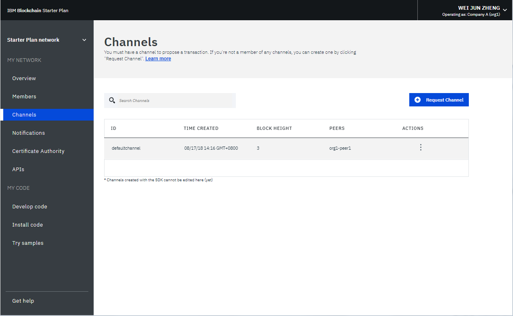
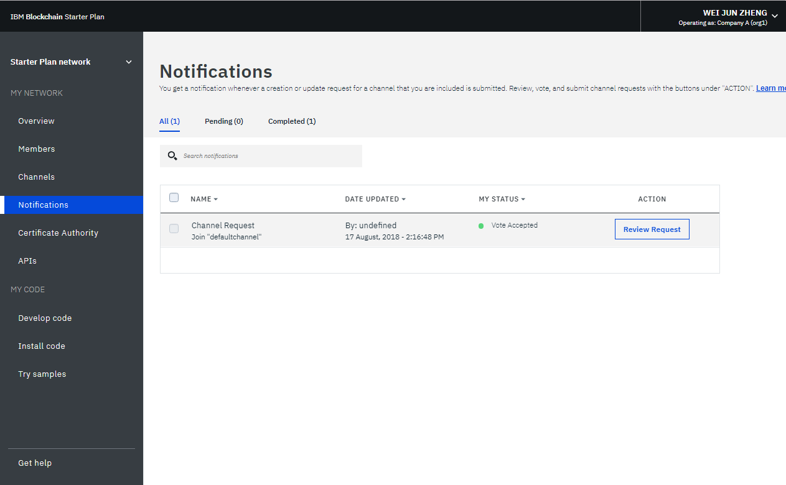
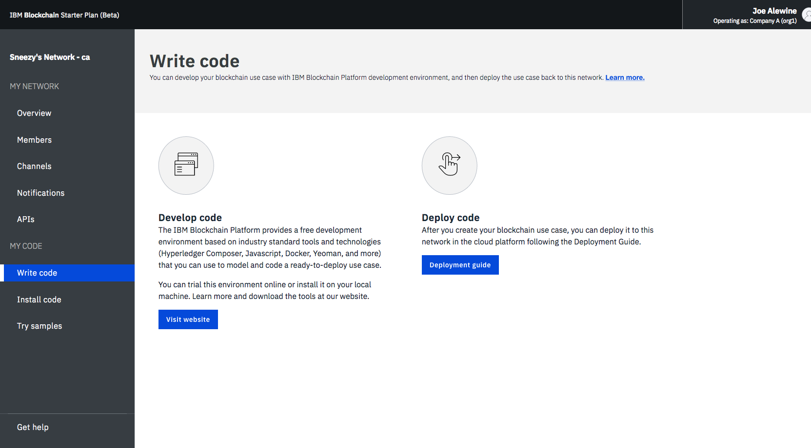
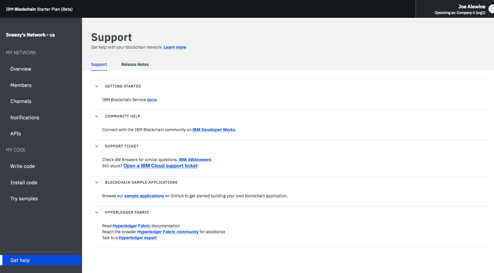
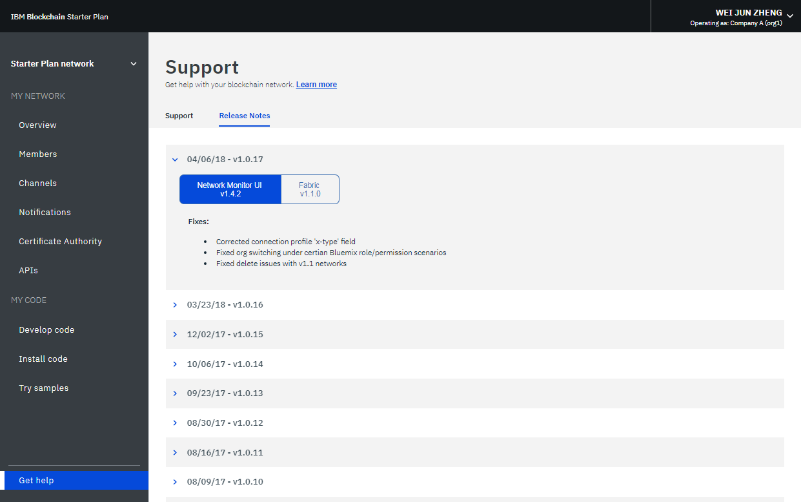
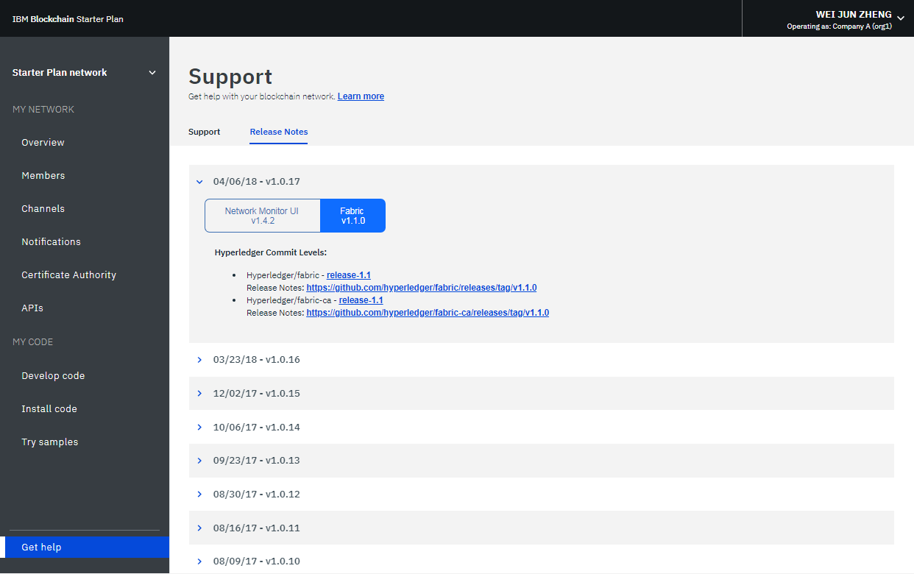
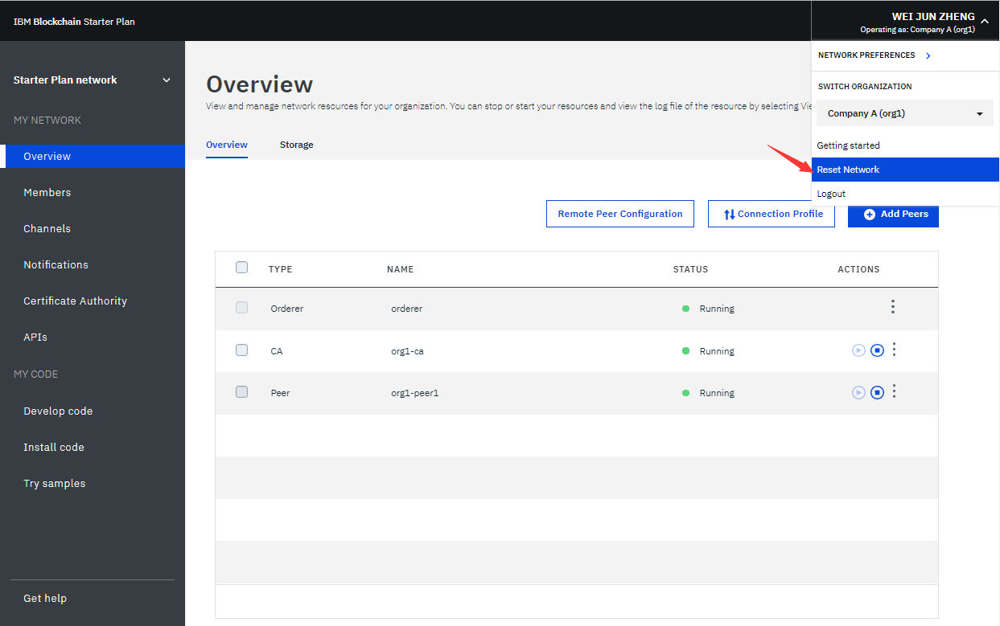

---

copyright:
  years: 2017, 2018
lastupdated: "2018-03-16"

---

{:new_window: target="_blank"}
{:shortdesc: .shortdesc}
{:codeblock: .codeblock}
{:screen: .screen}
{:pre: .pre}

# Starter Plan-Netz betreiben
{: #operate-starter-plan-network}

{{site.data.keyword.blockchainfull}} Platform enthält einen Netzmonitor, der eine Übersicht über Ihre Blockchain-Umgebung, einschließlich Netzressourcen, Mitgliedern, zugeordneter Kanäle, Transaktionsleistungsdaten und bereitgestellter Chaincodes, zur Verfügung stellt. Der Netzmonitor stellt auch den Eingangspunkt zur Ausführung von Swagger-APIs dar. Sie können ein Netz mit {{site.data.keyword.blockchainfull_notm}} Platform: Develop entwickeln und Beispielanwendungen ausprobieren.
{:shortdesc}

Der Netzmonitor präsentiert die folgenden Anzeigen in drei Abschnitten. Sie können über den Navigator auf der linken Seite zu jeder Anzeige im Netzmonitor navigieren.
- Der Abschnitt **Eigenes Netz** enthält die Anzeigen "[Übersicht](#overview)", "[Mitglieder](#members)", "[Kanäle](#channels)", "[Benachrichtigungen](#notifications)" und "[APIs](#apis)".
- Der Abschnitt **Eigener Code** enthält die Anzeigen "[Code schreiben](#write_code)", "[Code installieren](#chaincode)" und "[Beispiele ausprobieren](#samples)".
- Die Anzeige "[Hilfe anfordern](#support)".

Über das Dropdown-Menü in der rechten oberen Ecke des Netzmonitors können Sie [zwischen den Organisationen wechseln](#switch_organizations), deren Eigner Sie sind, und [Ihr Netz zurücksetzen](#reset_network).

In diesem Lernprogramm werden die oben aufgeführten Anzeigen und Funktionen beschrieben.

## Übersicht
{: #overview}

Die Anzeige "Übersicht" zeigt Statusinformationen zu Ihren Blockchain-Ressourcen (einschließlich Anordnungsservice, Zertifizierungsstelle und Peers) in Echtzeit an. Jede Ressource wird unter vier unterschiedlichen Überschriften angezeigt: **Typ**, **Name**, **Status** und **Aktionen**. Wenn Ihr Netz gestartet wird, werden ein Anordnungsknoten, eine Zertifizierungsstelle (CA) und ein Peer ausgeführt. Die Zertifizierungsstelle ist für die Organisation spezifisch, während der Anordnungsknoten ein allgemeiner Endpunkt ist, der im gesamten Netz gemeinsam genutzt wird.

**Abbildung 1** zeigt die Anzeige "Übersicht":

*Abbildung 1. Netzübersicht*

### Knotenaktionen
  Unter der Überschrift **Aktionen** befinden sich Schaltflächen zum Starten oder Stoppen der Komponenten. Sie können auch eine Gruppe von Knoten starten oder stoppen, indem Sie mehrere Knoten auswählen und dann auf **Ausgewählte starten** oder **Ausgewählte stoppen** klicken. Die Schaltfläche **Ausgewählte starten** oder **Ausgewählte stoppen** wird oben in der Tabelle angezeigt, wenn Sie einen oder mehrere Knoten auswählen.

  Sie können auch Komponentenprotokolle prüfen, indem Sie in der Dropdown-Liste unter der Überschrift **Aktionen** auf **Protokolle anzeigen** klicken. Die Protokolle zeigen die Aufrufe zwischen den verschiedenen Netzressourcen und sind für die Fehlersuche und -behebung von Nutzen. Probieren Sie dies zum Beispiel aus, indem Sie einen Peer stoppen und ihn als Ziel einer Transaktion auswählen. Dies führt zu Verbindungsfehlern in den Protokollen. Wenn Sie den Peer erneut starten und die Transaktion erneut versuchen, wird eine erfolgreiche Verbindung angezeigt. Sie können einen Peer auch für einen längeren Zeitraum inaktiv lassen, während über Ihre Kanäle weiterhin Transaktionen durchgeführt werden. Wenn der Peer wieder aktiviert wird, werden Sie eine Synchronisation des Hauptbuchs bemerken, da der Peer die Blöcke empfängt, die festgeschrieben wurden, als er inaktiv war. Wenn das Hauptbuch vollständig synchronisiert wurde, können Sie normale Aufrufe und Abfragen für das Hauptbuch ausführen.

### Verbindungsprofil
  Sie können die JSON-Datei zu Low-Level-Netzinformationen zu den einzelnen Ressourcen anzeigen, indem Sie auf die Schaltfläche **Verbindungsprofil** klicken. Das Verbindungsprofil enthält sämtliche Konfigurationsinformationen, die Sie für eine Anwendung benötigen. Da diese Datei jedoch nur die Adressen für Ihre bestimmten Komponenten und den Anordnungsknoten enthält, müssen Sie, wenn weitere Peers als Ziele hinzugefügt werden sollen, deren Endpunkte ermitteln. Der Header, der "url" enthält, zeigt den API-Endpunkt jeder Komponente an. Diese Endpunkte sind für die zielgerichtete Verwendung bestimmter Netzkomponenten von einer clientseitigen Anwendung erforderlich und ihre Definitionen befinden sich üblicherweise in einer JSON-modellierten Konfigurationsdatei, die die App begleitet. Wenn Sie eine Anwendung anpassen, für die eine Bewilligung durch Peers erforderlich ist, die nicht Teil Ihrer Organisation sind, dann müssen Sie die IP-Adressen dieser Peers von den entsprechenden Operatoren mit einer Out-of-band-Operation abrufen. Clients müssen eine Verbindung zu allen Peers herstellen können, von denen sie eine Antwort benötigen.

### Peers hinzufügen
{: #peers}
  Netzmitglieder müssen Peers haben, um ihre Kopien des Netzhauptbuchs zu speichern und Chaincode zum Abfragen und Aktualisieren des Hauptbuchs auszuführen. Wenn die Bewilligungsrichtlinie einen Peer als bewilligenden Peer definiert, gibt der Peer außerdem Bewilligungsergebnisse an Anwendungen zurück.

  Starter Plan erstellt standardmäßig einen Peer für jede der beiden Organisationen. Sie können weitere Peers für Ihre Organisationen Ihren Anforderungen entsprechend hinzufügen. In anderen Szenarios können auch mehr Peers erforderlich sein. Sie könnten mehrere Peers zum Beispiel zu Redundanzzwecken verwenden, um sie mit demselben Kanal zu verknüpfen. Jeder Peer verarbeitet die Transaktionen des Kanals und schreibt in seine jeweilige Kopie des Hauptbuchs. Wenn einer der Peers ausfällt, kann der andere Peer (oder auch mehrere andere Peers) die Verarbeitung von Transaktionen und Anwendungsanforderungen fortsetzen. Sie können außerdem alle Anwendungsanforderungen symmetrisch auf die Peers verteilen oder Sie können verschiedene Peers für verschiedene Funktionen vorsehen. Sie können zum Beispiel einen Peer zum Abfragen des Hauptbuchs und einen anderen Peer zur Verarbeitung von Bewilligungen für Hauptbuchaktualisierungen verwenden.

  Klicken Sie auf die Schaltfläche **Peers hinzufügen** in der rechten oberen Ecke, um Ihrem Netz Peerknoten hinzuzufügen. Wählen Sie im Popup-Fenster "Peers hinzufügen" die Anzahl und Größe der Peerknoten aus, die Sie hinzufügen wollen.

## Mitglieder
{: #members}

Die Anzeige "Mitglieder" enthält zwei Registerkarten. Auf der Registerkarte "Mitglieder" werden Informationen zu Netzmitgliedern angezeigt und auf der Registerkarte "Zertifikate" werden Zertifikatsinformationen angezeigt.

### Mitglieder
{: #members_tab}
**Abbildung 2** zeigt die erste Anzeige "Mitglieder", die Ihre Netzmitglieder im Netz auf der Registerkarte "Mitglieder" anzeigt:

*Abbildung 2. Netzmitglieder*

Klicken Sie auf **Mitglied hinzufügen**, um weitere Mitglieder in Ihr Netz einzuladen. In Starter Plan haben Sie zwei Optionen:
- **Mitglied einladen**. Sie können andere Organisationen einladen, Mitglieder Ihres Netzes zu werden. Die eingeladenen Organisationen können dann teilnehmen und mit Ihnen im Netz zusammenarbeiten.
- **Mitglied erstellen**. Sie können auch ein Mitglied erstellen, indem Sie Ihre eigene E-Mail-Adresse verwenden. Sie haben dann ebenso Kontrolle über dieses Mitglied wie über die beiden Organisationen, die Sie standardmäßig mit Starter Plan empfangen.

**Abbildung 3** zeigt das Fenster "Mitglied hinzufügen".

*Abbildung 3. Mitglied hinzufügen*

### Zertifikate
**Abbildung 4** zeigt die erste Anzeige "Mitglieder", die Mitgliedszertifikate auf der Registerkarte "Zertifikate" anzeigt:

*Abbildung 4. Zertifikate*

Operatoren können die Zertifikate für die Mitglieder in derselben Institution auf der Registerkarte "Zertifikate" verwalten. Klicken Sie auf **Zertifikat hinzufügen**, um die Anzeige "Zertifikat hinzufügen" zu öffnen. Geben Sie Ihrem Zertifikat einen Namen, fügen Sie die clientseitigen Zertifikate im PEM-Format in das Feld "Schlüssel" ein und klicken Sie auf **Übergeben**. Sie müssen die Peers erneut starten, damit die clientseitigen Zertifikate wirksam werden.

Weitere Informationen zur Generierung Ihres Zertifikatsschlüssels finden Sie unter [Clientseitige Zertifikate generieren](v10_application.html#generating-the-client-side-certificates).

## Kanäle
{: #channels}

Kanäle, die aus einer Untergruppe von Netzmitgliedern bestehen, die private Transaktionen ausführen wollen, sorgen für Datenisolation und Vertraulichkeit, indem sie es den Mitgliedern eines Kanals ermöglichen, bestimmte Regeln und ein separates Hauptbuch einzurichten, auf das nur die Kanalmitglieder Zugriff haben. Jedes Netz muss mindestens einen Kanal aufweisen, damit Transaktionen durchgeführt werden können. Jeder Kanal verfügt über ein eindeutiges Hauptbuch (Ledger) und Benutzer müssen ordnungsgemäß authentifiziert sein, um Lese-/Schreiboperationen für dieses Hauptbuch durchführen zu können. Befinden Sie sich nicht auf diesem Kanal, können Sie die Daten nicht sehen.

**Abbildung 5** zeigt die Anfangsanzeige des Dashboards mit einer Übersicht aller Kanäle in Ihrem Netz:

*Abbildung 5. Kanäle*

Durch das Erstellen eines Kanals wird ein kanalspezifisches Hauptbuch generiert. Weitere Informationen finden Sie unter [Kanal erstellen](howto/create_channel.html).

Sie können auch einen vorhandenen Kanal auswählen, um genauere Details zu Kanal, Mitgliedschaft und aktiven Chaincodes anzuzeigen. Weitere Informationen finden Sie unter [Netz überwachen](howto/monitor_network.html).

## Benachrichtigungen
{: #notifications}

In der Anzeige "Benachrichtigungen" können Sie anstehende Anforderungen bearbeiten und abgeschlossene Anforderungen anzeigen.

**Abbildung 6** zeigt die Anzeige "Benachrichtigungen":

*Abbildung 6. Benachrichtigungen*

Wenn Sie einen Kanal erstellen oder in einen neuen Kanal eingeladen werden, wird eine Benachrichtigung im Netzmonitor angezeigt.

Die Anforderungen werden auf den untergeordneten Registerkarten "Alle", "Anstehend" und "Abgeschlossen" gruppiert. Die Zahlen hinter der Überschrift geben die Anzahl der Anforderungen auf den einzelnen untergeordneten Registerkarten an.
   * Auf der untergeordneten Registerkarte "Alle" werden alle Ihre Anforderungen angezeigt.
   * Anforderungen, die Sie nicht akzeptiert oder abgelehnt haben oder die Sie noch nicht angezeigt haben, befinden sich auf der untergeordneten Registerkarte "Anstehend". Klicken Sie auf die Schaltfläche **Anforderung überprüfen**, um die Anforderung anzuzeigen, die die Kanalrichtlinie und Mitglieder sowie den Abstimmungsstatus enthält. Ein Kanaloperator kann die Anforderung entweder **Akzeptieren** oder **Ablehnen** oder sie zu einem anderen Zeitpunkt bearbeiten, indem er auf **Später** klickt. Wenn die Anforderung von einer ausreichenden Zahl von Kanaloperatoren akzeptiert wird, können Sie auf **Anforderung übergeben** klicken, um die Kanalaktualisierung zu aktivieren.
   * Übergebene Anforderungen werden auf der untergeordneten Registerkarte "Abgeschlossen" angezeigt.  Sie können auf **Anforderung überprüfen** klicken, um die zugehörigen Details anzuzeigen.

Wenn Sie eine lange Liste von Anforderungen haben, können Sie im Suchfeld oben nach einer Anforderung suchen.

Anstehende Anforderungen können gelöscht werden, indem Sie die davor befindlichen Felder auswählen und auf **Anforderung löschen** klicken.

## APIs
{: #apis}

Zur Vereinfachung der Anwendungsentwicklung stellt {{site.data.keyword.blockchainfull_notm}} Platform APIs zur Verfügung, die Sie für Ihr Netz in einer Swagger-Benutzerschnittstelle (UI) testen können.

**Abbildung 7** zeigt die Anzeige "APIs":

*Abbildung 7. APIs*

Klicken Sie auf den Link für die **Swagger-Benutzerschnittstelle (UI)**, um die Swagger-Benutzerschnittstelle zu öffnen. Beachten Sie, dass Sie die Swagger-Benutzerschnittstelle mit Ihren Netzberechtigungsnachweisen (die auf dieser Seite "APIs" zu finden sind) berechtigen müssen, bevor Sie die APIs ausführen können. Weitere Informationen finden Sie unter [APIs mit Swagger ausprobieren](howto/swagger_apis.html).

## Code schreiben
{: #write-code}

Starter Plan integriert {{site.data.keyword.blockchainfull_notm}} Platform: Develop und stellt eine Entwicklungsumgebung mit Tools und Technologien bereit, die dem Industriestandard entsprechen. Sie können Ihr Netz in der Umgebung online oder lokal entwickeln. Wenn Sie ein Netz entwickelt haben, können Sie es wieder in Ihrem Starter Plan-Netz bereitstellen.

**Abbildung 8** zeigt die Anzeige "Code schreiben":

*Abbildung 8. Code schreiben*

Weitere Informationen zur Entwicklung und Bereitstellung Ihres Codes mit Starter Plan finden Sie unter [Unternehmensnetze mit Starter Plan entwickeln](develop_starter.html).

## Code installieren
{: #chaincode}

Chaincodes, die auch als "Smart Contracts" bezeichnet werden, sind Stücke von Software, die eine Gruppe von Funktionen zum Abfragen und Aktualisieren des Hauptbuchs (Ledger) enthalten. Sie werden auf Peers installiert und auf einem Kanal instanziiert.

**Abbildung 9** zeigt die Anzeige "Code installieren":

*Abbildung 9. Chaincode*

Ein Chaincode wird zunächst im Dateisystem eines Peers installiert und anschließend auf einem Kanal instanziiert. Weitere Informationen finden Sie unter [Chaincode installieren und instanziieren](howto/install_instantiate_chaincode.html).

## Beispiele ausprobieren
{: #samples}

Beispielanwendungen helfen Ihnen, sich mit einem Blockchain-Netz und der Anwendungsentwicklung vertraut zu machen. Starter Plan bietet die Möglichkeit, Beispielanwendungen über den Netzmonitor bereitzustellen und zu starten.

**Abbildung 10** zeigt die Anzeige "Beispiele":

*Abbildung 10. Beispiele*

Die Beispielbereitstellung nutzt den [DevOps Toolchain-Service ](https://console.bluemix.net/devops/toolchains), um Ihren Prozess der Quellcodeverwaltung und Zustellungspipeline zu automatisieren und den Chaincode zu aktivieren. Wählen Sie eine Beispielanwendung aus und klicken Sie auf **Über Toolchain bereitstellen**. Weitere Informationen finden Sie unter [Beispielanwendungen bereitstellen](howto/prebuilt_samples.html).

## Hilfe anfordern
{: #support}

Die Anzeige "Hilfe anfordern" enthält zwei Registerkarten. Auf der Registerkarte "Support" werden Support-Informationen bereitgestellt und auf der Registerkarte "Releaseinformationen" werden neue und geänderte Funktionen für jedes Release beschrieben.

**Abbildung 11** zeigt die erste Anzeige "Hilfe anfordern" mit Unterstützungsinformationen auf der Registerkarte "Support":

*Abbildung 11. Blockchain-Support*

Über die Links und Ressourcen auf dieser Anzeige können Sie auf Fehlerbehebungs- und Unterstützungsforen zugreifen.

* [{{site.data.keyword.blockchainfull_notm}}-Servicedokumente](index.html) unter **Einführung** (d. h. diese Dokumentationssite) mit Anleitungen zum Einstieg in {{site.data.keyword.blockchainfull}} Platform on {{site.data.keyword.Bluemix_notm}}. Die entsprechenden Themen können Sie über den Navigator auf der linken Seite aufrufen oder Sie können in der Suchfunktion im oberen Bereich einen Suchbegriff eingeben.
* [IBM Developer Works ](https://developer.ibm.com/blockchain/) unter **Community-Hilfe** enthält Ressourcen und Informationen für Entwickler.
* [IBM dWAnswers ](https://developer.ibm.com/answers/smartspace/blockchain/) unter **Support-Ticket** dient als Plattform für Fragen und Antworten. Sie können nach Antworten auf bereits gestellte Fragen suchen oder eine neue Frage stellen. Achten Sie darauf, das Stichwort **blockchain** in Ihrer Frage zu verwenden.
  Sie können außerdem ein Ticket über die Option **{{site.data.keyword.Bluemix_notm}}-Support-Ticket öffnen** an das {{site.data.keyword.blockchainfull_notm}}-Support-Team senden. Hier können Sie Details und Code-Snippets aus Ihrer jeweiligen {{site.data.keyword.Bluemix_notm}}-Instanz mit anderen teilen.
* Über [Beispielanwendungen ](https://github.com/ibm-blockchain) unter **Blockchain-Beispielanwendungen** finden Sie Anleitungen und Beispielcodeausschnitte zur Unterstützung bei der Anwendungsentwicklung.
* Über [Hyperledger Fabric ](http://hyperledger-fabric.readthedocs.io/) und [Hyperledger Fabric-Community ](http://jira.hyperledger.org/secure/Dashboard.jspa) unter **Hyperledger Fabric** finden Sie nähere Details zum Hyperledger Fabric-Stack.
  Wenden Sie sich an einen [Hyperledger-Experten ](https://chat.hyperledger.org/channel/general) mit Fragen zum Hyperledger Fabric-Code.

Wenn Sie Ihr Problem nicht beheben können oder keine Antwort auf Ihre Frage finden, reichen Sie einen Supportfall im IBM Cloud Service Portal ein. Weitere Informationen finden Sie unter [Support anfordern](ibmblockchain_support.html).

**Abbildung 12** zeigt die erste Anzeige "Support", die neue und geänderte Funktionen jedes Release auf der Registerkarte "Releaseinformationen" anzeigt:

*Abbildung 12. Releaseinformationen*

## Organisationen wechseln
{: #switch-organizations}

Wenn Sie ein Blockchain-Netz mit mehreren Organisationen in Ihrem eigenen Netz simulieren, können Sie zu jeder der Organisationen wechseln, deren Eigner Sie sind, zum Beispiel zu Organisation A. Anschließend können Sie die Netzressourcen von Organisation A im Netzmonitor anzeigen und verwalten, wie zum Beispiel Peers, Kanäle und Chaincodes. Diese Funktion bietet die Möglichkeit, einen Kanal durch Befolgung von Kanalrichtlinien zu erstellen und dem Kanal Peers aus mehreren Organisationen hinzuzufügen.

Klicken Sie auf die rechte obere Ecke der Benutzerschnittstelle, in der Ihr Name angezeigt werden müsste. Wählen Sie im Dropdown-Menü unter **Organisation wechseln** (SWITCH ORGANIZATION) den Namen der Organisation aus, zu der Sie wechseln möchten. Organisation A ist standardmäßig ausgewählt. Nach der Auswahl einer Organisation, zu der gewechselt werden soll, wird die Anzeige des Netzmonitors automatisch aktualisiert, sodass das Netz aus der Perspektive der ausgewählten Organisation angezeigt wird.

**Abbildung 13** zeigt die Funktion "Organisationen wechseln":

*Abbildung 13. Organisationen wechseln*

## Netz zurücksetzen
{: #reset-network}

Starter Plan bietet die Möglichkeit, die Netzkonfiguration zu bearbeiten, ohne ein Netz zu löschen und erneut zu erstellen. Ihr Netz wird auf die Erstkonfiguration des Netzes zurückgesetzt, die zwei Organisationen, einen Peer pro Organisation und einen Standardkanal umfasst. Dies ist zum Beispiel nützlich, wenn Sie mehrere Testrunden im Blockchain-Netz ausführen, da Sie immer wieder mit einem relativ sauberen Netz starten können.

**Achtung:** Wenn Sie das Netz zurücksetzen, werden die API-Endpunkte Ihrer Peers, Ihres Anordnungsknotens und der Zertifizierungsstelle (CA) geändert. Sie müssen die Informationen zu API-Endpunkten in Ihren Anwendungen anpassen.

Klicken Sie in der rechten oberen Ecke, um das Dropdown-Menü zu öffnen. Klicken Sie im Menü auf die Schaltfläche **Netz zurücksetzen**. Wenn Sie bereit sind, Ihr Netz zurückzusetzen, klicken Sie auf **OK**, um fortzufahren. Die Anzeige Ihres Netzmonitors wird aktualisiert, um die neuen Einstellungen wiederzugeben.

**Abbildung 14** zeigt die Funktion "Netz zurücksetzen":

*Abbildung 14. Netz zurücksetzen*
