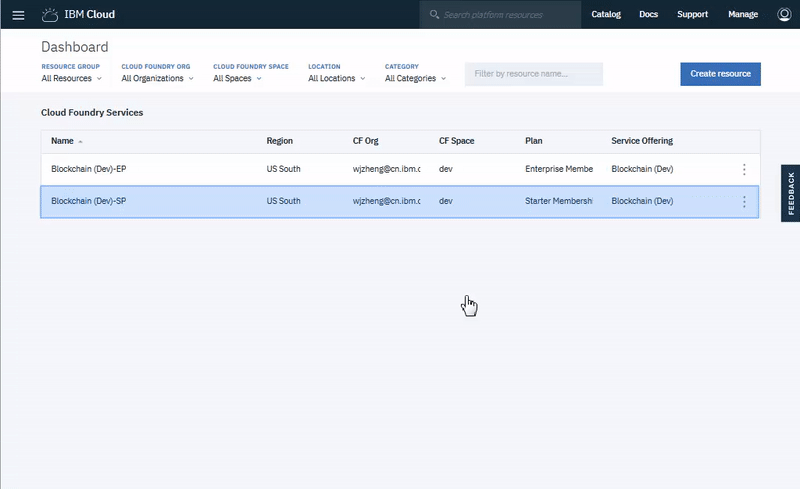

---

copyright:
  years: 2017, 2018
lastupdated: "2018-08-31"

---

{:new_window: target="_blank"}
{:shortdesc: .shortdesc}
{:screen: .screen}
{:codeblock: .codeblock}
{:pre: .pre}

# Swagger-APIs zur Netzerstellung oder Netzteilnahme verwenden


***[Ist diese Seite hilfreich? Teilen Sie uns Ihre Meinung mit.](https://www.surveygizmo.com/s3/4501493/IBM-Blockchain-Documentation)***


{{site.data.keyword.blockchainfull}} Platform stellt eine Reihe von REST-APIs bereit, die Sie verwenden können, um ein Blockchain-Netz in {{site.data.keyword.cloud_notm}} zu erstellen oder daran teilzunehmen. Sie können diese APIs mithilfe der [Swagger-Benutzerschnittstelle](/docs/services/blockchain/howto/swagger_apis.html) testen, die Ihrem Netz zugeordnet ist.
{:shortdesc}


## Basisauthentifizierungsberechtigungsnachweise für die API abrufen
{: #retrieve-id-token}

Bevor Sie beginnen, müssen Sie eine [{{site.data.keyword.blockchainfull_notm}} Platform-Serviceinstanz ](https://console.bluemix.net/catalog/services/blockchain) mit dem Starter Plan oder dem Enterprise Plan in {{site.data.keyword.cloud_notm}} erstellen.

Wenn Sie Swagger-APIs verwenden möchten, um ein Netz zu erstellen oder an einem Netz teilzunehmen, benötigen Sie einen Basisauthentifizierungsberechtigungsnachweis, um sicherzustellen, dass Sie über Zugriff auf die Serviceinstanz in {{site.data.keyword.cloud_notm}} verfügen.

1. Öffnen Sie im [{{site.data.keyword.cloud_notm}}-Dashboard ](https://console.bluemix.net/dashboard/apps/) die Serviceinstanz, die Sie erstellt haben.
2. Klicken Sie auf **Serviceberechtigungsnachweise** im linken Navigator.
3. Klicken Sie auf die Schaltfläche "Neuer Berechtigungsnachweis" auf der Seite **Serviceberechtigungsnachweise**, um einen neuen Berechtigungsnachweis zu erstellen.
    1. Legen Sie einen Namen für den Berechtigungsnachweis fest, z. B. *CreateJoin*.
    2. Geben Sie im Feld "Inline-Konfigurationsparameter hinzufügen" **{"type": "service_instance_token"}** ein.
    3. Klicken Sie auf die Schaltfläche **Hinzufügen**.

4. Klicken Sie nach dem Erstellen des neuen Berechtigungsnachweises auf **Berechtigungsnachweise anzeigen** unter der Überschrift **Aktionen** dieses Berechtigungsnachweises. Der Inhalt des Berechtigungsnachweises sieht in etwa wie das folgende Beispiel aus:

    ```
    {
      "service_instance_id": "60cc757d-1234-7866-9893-491cec2d0eaa",
      "service_instance_token": "T8-W0rHv_vEya63P8KcVUwxAXXbDmihGcDRD5AcHVXGn6S2jbxx2LikPz8w26c3k",
      "description": "Dieses Token kann mit den IBP-APIs verwendet werden, um ein Netz zu erstellen oder daran teilzunehmen. Es kann nur einmal verwendet werden."
    }
    ```
    {:codeblock}

    `service_instance_id` stellt die Basisauthentifizierungsbenutzer-ID dar, `service_instance_token` das Basisauthentifizierungskennwort. Verwenden Sie diese Werte als Basisauthentifizierungsberechtigungsnachweis beim Aufrufen der API **Netz erstellen** oder **Am Netz teilnehmen**.

    Wenn Sie ein Blockchain-Netz erstellen, bevor Sie die oben beschriebenen Schritte zur Erstellung eines Serviceberechtigungsnachweises ausführen, enthält der Berechtigungsnachweis auch die Netzinformationen und sieht in etwa wie folgt aus:

    ```
    {
      "PeerOrg1": {
        "url": "https://ibmblockchain_xyz.ng.bluemix.net",
        "network_id": "92d511f7e587413c8a9848fdae595ef2",
        "key": "PeerOrg1",
        "secret": "T8eUA65l-qtznUHL10KzQ7IK-3BVWWfHu5-hpCiDdXCRQyNfeyIm1p5NT7g17l6U"
      }
    }
    ```
    {:codeblock}

    **Hinweis**: Für die API **Einladen** dient `key` als Basisauthentifizierungsbenutzer-ID und `secret` als Basisauthentifizierungskennwort.


## Verfügbare Netzadressen überprüfen
{: #check-location}

Sie können APIs verwenden, um Blockchain-Netze ausschließlich an verfügbaren Netzadressen zu erstellen. Verwenden Sie vor dem Erstellen eines Netzes die folgende API, um eine aktuelle Liste mit verfügbaren Netzadressen abzurufen. Für diese API sind keine Berechtigungsnachweise erforderlich.

```
https://ibmblockchain-v2.ng.bluemix.net/api/v1/network-locations/available
```
{:codeblock}

Es wird eine Liste ähnlich der folgenden mit verfügbaren Netzadressen zurückgegeben:

```
{
  "DAL": {
    "location_id": "DAL",
    "description": "Dallas",
    "status": "available"
    "swagger_url": "https://ibmblockchain-v2-dal.4.secure.blockchain.ibm.com/api-docs"
  },
  "FFT": {
    "location_id": "FFT",
    "description": "Frankfurt",
    "status": "available"
    "swagger_url": "https://ibmblockchain-v2-fft.2.secure.blockchain.ibm.com/api-docs"
  },
  "TOR": {
    "location_id": "TOR",
    "description": "Toronto",
    "status": "available"
    "swagger_url": "https://ibmblockchain-v2-tor.1.secure.blockchain.ibm.com/api-docs"
  }
}
```
{:codeblock}

Wenn Sie planen, ein Netz zu erstellen, wählen Sie den Standort in der von der API zurückgegebenen Liste aus, an dem das Netz erstellt werden soll. Notieren Sie sich die Standort-ID (``location_id``) und die Swagger-URL (``swagger_url``), die zu dem betreffenden Standort gehören.  

Wenn Sie planen, an einem Netz teilzunehmen, notieren Sie sich die Swagger-URL (``swagger_url``), die zu der in der Einladungs-E-Mail angegebenen Standort-ID ``location_id`` gehört.

Die Swagger-URL (``swagger_url``) stellt den API-Endpunkt dar, den Sie beim Erstellen eines Netzes bzw. Teilnehmen an einem Netz mit den unten angegebenen APIs verwenden.


## Netz erstellen

**Hinweis**: Wenn Sie den Starter Plan verwenden, müssen Sie kein Netz mithilfe von APIs erstellen, da ein Standardnetz bereitgestellt wird, wenn Sie die Blockchain-Serviceinstanz in {{site.data.keyword.cloud_notm}} erstellen.

Wenn Sie den Enterprise Plan verwenden, müssen Sie zwei Schritte ausführen, um ein Netz mit den APIs zu erstellen.

1. Erstellen Sie eine Blockchain-Serviceinstanz in {{site.data.keyword.cloud_notm}} mit dem Enterprise Plan. <!-- or Enterprise Plus Plan-->  Rufen Sie die Serviceinstanz-ID und das zugehörige Token als Basisauthentifizierungsbenutzernamen und -kennwort ab. Weitere Informationen finden Sie in [Basisauthentifizierungsberechtigungsnachweis für API abrufen](#retrieve-id-token).

2. Rufen Sie mit diesen Serviceberechtigungsnachweisen die API **Netz erstellen** auf. Rufen Sie diese API für die API ``swagger_url`` auf, die wie im Abschnitt [Verfügbare Netzadressen überprüfen](#check-location) beschrieben abgerufen wurde. Navigieren Sie zum Link zur Swagger-URL (``swagger_url link``), um die API zum Erstellen eines Netzes über die Swagger-Benutzerschnittstelle aufzurufen, oder geben Sie den Befehl programmgesteuert über die URL-Adresse ohne ``/api-docs`` aus. Geben Sie beispielsweise Folgendes an:

    ```
    https://ibmblockchain-v2-tor.1.secure.blockchain.ibm.com/api/v1/networks
    ```
    {:codeblock}

**Parameter**:
- `location_id`: Die ID einer verfügbaren Netzadresse. Geben Sie den Wert für die Standort-ID (`loation_id`) an, den Sie zuvor (siehe [Verfügbare Netzadressen überprüfen](#check-location)) notiert haben.
- `company_name`: Ihre ID als Mitglied im Netz.
- `email`: Ihre E-Mail-Adresse für Benachrichtigungen.
- `peers`: Die Anzahl der Peers, die für dieses Mitglied erstellt werden sollen. Gültige Werte liegen im Bereich 0 - 6. Sie können auch zu einem späteren Zeitpunkt Peers für Ihr Mitglied in der Network Monitor-Benutzerschnittstelle erstellen.
- `ledger_type`: Der Ledgertyp dieses Netzes. Gültige Werte sind 'levelDB' und 'couchDB'. **levelDB** ist der Standardwert.


## Neue Mitglieder in ein Netz einladen

Nach der Erstellung eines Blockchain-Netzes können Sie andere Mitglieder einladen, am Netz teilzunehmen. Sie müssen die ID des Netzes angeben, in das Sie Mitglieder einladen möchten. Der Basisauthentifizierungsberechtigungsnachweis, der zum Einladen eines Mitglieds erforderlich ist, unterscheidet sich von dem, der in der API **Netz erstellen** verwendet wird. <!--In order to get the basic auth information you will need to follow the same steps in "Retrieving basic auth information for API". --> Sie können den Berechtigungsnachweis zum Einladen eines Mitglieds mithilfe der API **Netzberechtigungsnachweise abrufen** in der [Swagger-Benutzerschnittstelle](/docs/services/blockchain/howto/swagger_apis.html#retrieving-network-credentials) oder über die Option [Basisauthentifizierungsinformationen für API abrufen](#retrieve-id-token) in Ihrer Serviceinstanz in {{site.data.keyword.cloud_notm}} abrufen.

```
/networks/{networkID}/invite
```
{:codeblock}

**Parameter**:
- `email`: Die E-Mail-Adresse des Mitglieds, das in das Netz eingeladen werden soll.
- `company_name`: Die ID, die Sie für das Mitglied definieren, das am Netz teilnehmen soll. Eingeladene Mitglieder können ihre IDs ändern, wenn Sie am Netz teilnehmen.

Das eingeladene Mitglied erhält eine E-Mail-Einladung mit Anweisungen zur Teilnahme am Netz.


## Am Netz teilnehmen

Wenn Sie zur Teilnahme an einem Blockchain-Netz eingeladen werden, erhalten Sie eine E-Mail mit einer Netzeinladung, die die Standort-ID (`location_id`) und Netz-ID (`network id`) enthält.

1. Vor der Teilnahme an einem Netz müssen Sie eine {{site.data.keyword.blockchainfull_notm}} Platform-Serviceinstanz erstellen und die Serviceinstanz-ID sowie das zugehörige Token als Basisauthentifizierungsbenutzernamen und -kennwort abrufen. Weitere Informationen finden Sie in [Basisauthentifizierungsberechtigungsinformationen für API abrufen](#retrieve-id-token).

2. [Überprüfen Sie die verfügbaren Netzadressen](#check-location), um die Swagger-URL (`swagger_url`) für die Standort-ID (`location_id`) in Ihrer Einladungs-E-Mail zu erhalten. Dabei handelt es sich um eine URL ähnlich der folgenden:

    ```
    https://ibmblockchain-v2-tor.1.secure.blockchain.ibm.com/api-docs
    ```
    {:codeblock}

3. Navigieren Sie zu Ihrer Swagger-URL (`swagger_url`), um die API für die Teilnahme an einem Netz über die Swagger-Benutzerschnittstelle aufzurufen oder die Teilnahmeanforderung programmgesteuert mit der Swagger-URL (`swagger_url`) zu übergeben. Ersetzen Sie dabei `/api-docs` durch `/api/v1/networks/[netz-id]]/join` und tragen Sie für die Netz-ID (`netz-id`) den Wert aus der Einladungs-E-Mail ein. Daraus ergibt sich eine URL ähnlich der folgenden:

    ```
    https://ibmblockchain-v2-tor.1.secure.blockchain.ibm.com/api/v1/networks/56102acee0e4487889ef09db681bada0/join
    ```
    {:codeblock}

    **Hinweis**: Verwenden Sie für die API **Teilnehmen** die Serviceinstanz-ID und das Token, das Sie in Schritt 1 als Benutzername und Kennwort für die Basisauthentifizierung abrufen.

**Parameter**:
- `company_name`: Ihre ID als Mitglied im Netz. Dieser Wert ersetzt den Namen, der bei der Einladung zugewiesen wurde.
- `email`: Ihre E-Mail-Adresse für Benachrichtigungen.  Dieser Wert muss der E-Mail-Adresse in der Einladungsbenachrichtigung entsprechen.
- `peers`: Die Anzahl der Peers, die für dieses Mitglied erstellt werden sollen. Gültige Werte liegen im Bereich 0 bis 6. Sie können auch zu einem späteren Zeitpunkt Peers für Ihr Mitglied im Network Monitor erstellen.
