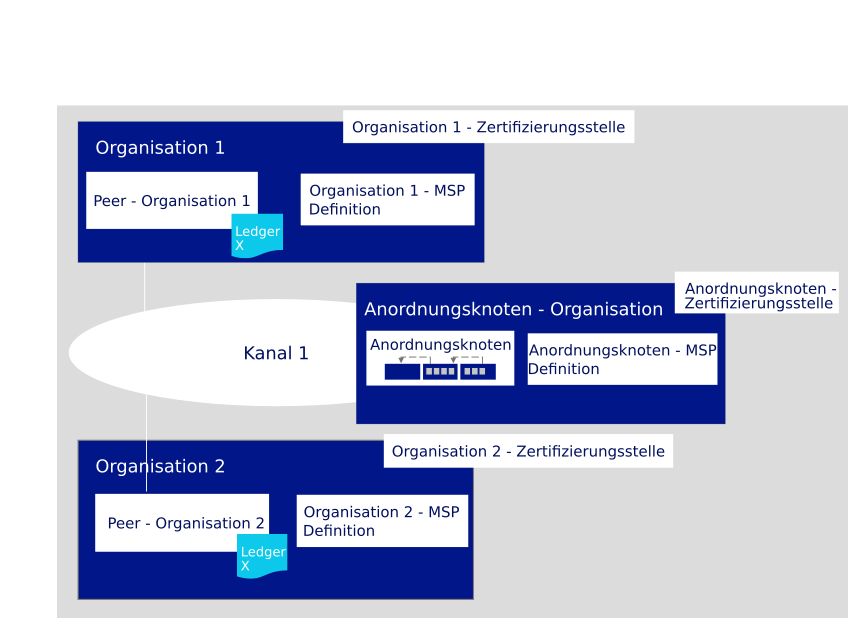
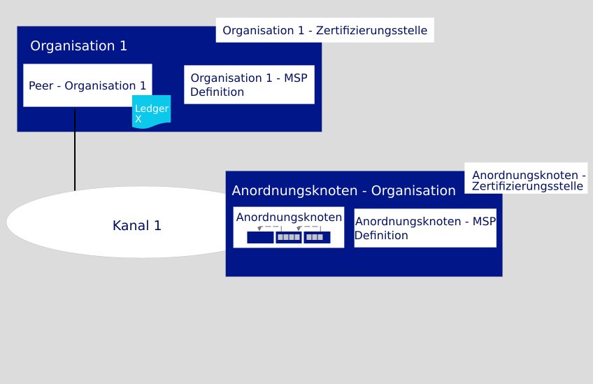

---

copyright:
  years: 2019

lastupdated: "2019-04-23"

subcollection: blockchain

---

{:new_window: target="_blank"}
{:shortdesc: .shortdesc}
{:screen: .screen}
{:codeblock: .codeblock}
{:note: .note}
{:important: .important}
{:tip: .tip}
{:pre: .pre}

# Lernprogramm zum Erstellen eines Netzes
{: #ibp-console-build-network}

{{site.data.keyword.blockchainfull}} Platform ist ein Blockchain-as-a-Service-Angebot, mit dem Sie Blockchain-Anwendungen und -Netze entwickeln, bereitstellen und betreiben können. In der [Übersicht zu den Blockchain-Komponenten](/docs/services/blockchain/blockchain_component_overview.html#blockchain-component-overview) erfahren Sie mehr zu den Blockchain-Komponenten und darüber, wie sie miteinander interagieren. Dieses Lernprogramm ist der erste Teil in der [Lernprogrammreihe für Beispielnetze](/docs/services/blockchain/howto/ibp-console-build-network.html#ibp-console-build-network-sample-tutorial) und beschreibt, wie Sie mit der {{site.data.keyword.blockchainfull_notm}} Platform-Konsole ein voll funktionsfähiges Netz in einem einzelnen {{site.data.keyword.cloud_notm}} Kubernetes-Service erstellen können.
{:shortdesc}

**Zielgruppe:** Dieser Abschnitt richtet sich an Netzoperatoren, die für die Erstellung, Überwachung und Verwaltung des Blockchain-Netzes verantwortlich sind.   

Wenn Sie die Konsole noch nicht für einen Kubernetes-Cluster unter Verwendung des {{site.data.keyword.cloud_notm}}-Kubernetes-Service implementiert haben, lesen Sie den Abschnitt [Einführung in {{site.data.keyword.blockchainfull_notm}} Platform 2.0](/docs/services/blockchain/howto/ibp-v2-deploy-iks.html#ibp-v2-deploy-iks). Sie können einen neuen Kubernetes-Cluster für die Konsolenimplementierung erstellen oder einen vorhandenen Kubernetes-Cluster in Ihrem {{site.data.keyword.cloud_notm}}-Konto verwenden.  Nachdem Sie die {{site.data.keyword.blockchainfull}} Platform-Instanz in Ihrem Kubernetes-Cluster implementiert haben, können Sie die Konsole starten, um Ihre Blockchain-Komponenten zu erstellen und zu verwalten.

Unabhängig davon, ob Sie einen bezahlten oder kostenlosen Kubernetes-Cluster bereitstellen, verwenden Sie das Kubernetes-Dashboard, um bei der Bereitstellung von Knoten und Erstellung von Kanälen ein besonderes Augenmerk auf die Ihnen zur Verfügung stehenden Ressourcen zu legen. Es liegt in Ihrer Verantwortung, Ihren Kubernetes-Cluster zu verwalten und bei Bedarf zusätzliche Ressourcen zu implementieren. Obwohl Komponenten erfolgreich in einem kostenlosen Cluster bereitgestellt werden können, gilt dennoch Folgendes: Je mehr Komponenten Sie hinzufügen, desto langsamer werden die Komponenten ausgeführt.
{: note}

## Lernprogrammreihe für Beispielnetze
{: #ibp-console-build-network-sample-tutorial}

Diese dreiteilige Lernprogrammreihe führt Sie durch den Prozess der Erstellung und Verbindung eines relativ einfachen Hyperledger Fabric-Netzes mit mehreren Knoten, indem Sie mithilfe der {{site.data.keyword.blockchainfull_notm}} Platform 2.0-Konsole ein Netz in Ihrem Kubernetes-Cluster installieren und einen Smart Contract instanziieren.

* Im **Lernprogramm zum Erstellen eines Netzes** erfahren Sie, wie Sie durch das Erstellen eines Anordnungsknotens und eines Peers ein Netz hosten.
* Im [Lernprogramm zum Teilnehmen an einem Netz](/docs/services/blockchain/howto/ibp-console-join-network.html#ibp-console-join-network) erfahren Sie, wie Sie einem vorhandenen Netz beitreten können, indem Sie einen Peer erstellen und diesen mit einem Kanal verknüpfen.
* Im [Lernprogramm zum Bereitstellen eines Smart Contract im Netz](/docs/services/blockchain/howto/ibp-console-smart-contracts.html#ibp-console-smart-contracts) erfahren Sie, wie Sie einen Smart Contract schreiben und in Ihrem Netz bereitstellen.

Sie können die Schritte in diesen Lernprogrammen verwenden, um ein Netz mit mehreren Organisationen in einem Cluster für Entwicklungs- und Testzwecke zu erstellen. Verwenden Sie das Lernprogramm zum **Erstellen eines Netzes**, wenn Sie ein Blockchain-Konsortium gründen möchten, indem Sie einen Anordnungsknoten erstellen und Organisationen hinzufügen. Verwenden Sie das Lernprogramm zum **Teilnehmen an einem Netz**, um einen Peer mit dem Netz zu verbinden. Indem Sie die Lernprogramme mit unterschiedlichen Konsortiumsmitgliedern durchführen, können Sie ein wirklich **verteiltes** Blockchain-Netz erstellen.  

### Struktur dieses Netzes
{: #ibp-console-build-network-structure}

Wenn Sie alle Schritte in den Lernprogrammen zum **Erstellen eines Netzes** und **Teilnehmen an einem Netz** ausführen, ähnelt Ihr Netz dem in der Abbildung unten:
  
*Abbildung 1. Einfache Struktur eines Beispielnetzes*  

Diese Konfiguration ist für das Testen von Anwendungen und Smart Contracts. Das Netz enthält die folgenden Komponenten:

* **Zwei Peerorganisationen**: `Org1` und `Org2`  
  In der Lernprogrammreihe wird beschrieben, wie zwei Peerorganisationen und zwei zugeordnete Peers erstellt werden. Sehen Sie dabei Organisationen in einem Blockchain-Netz beispielsweise als zwei Banken an, die Transaktionen untereinander ausführen. Sie erstellen die MSP-Definition (MSP, Membership Services Provider) für 'Org1' und 'Org2', die die Organisationen `Org1` und `Org2` definiert.
* **Eine Organisation des Anordnungsknotens**: `Orderer Org`  
  Da Sie ein verteiltes Ledger erstellen, sollten die Peers und Anordnungsknoten verschiedenen Organisationen angehören. Daher wird für den Anordnungsknoten eine separate Organisation erstellt.  Unter anderem ordnet ein Anordnungsknoten die Blöcke von Transaktionen an, die an die Peers gesendet werden, damit sie in die entsprechenden Ledger geschrieben werden und somit die Blockchain bilden. Sie erstellen die MSP-Definition (MSP, Membership Services Provider) für den Anordnungsknoten, die die Organisation `Orderer Org` definiert.
* **Drei Zertifizierungsstellen**: `Org1 CA, Org2 CA, Orderer CA`   
  Eine Zertifizierungsstelle (CA) ist der Knoten, der Zertifikate für alle Organisationsmitglieder ausgibt. Da als Best Practice eine Zertifizierungsstelle pro Organisation bereitgestellt wird, implementieren Sie insgesamt drei Zertifizierungsstellen: eine Stelle für jede Peerorganisation und eine für die Organisation des Anordnungsknotens. Außerdem verwenden Sie die Zertifizierungsstellen zum Erstellen aller Knoten, Identitäten und Organisationsdefinitionen für jede Organisation.
* **Ein Anordnungsknoten:** `Orderer`  
  Derzeit kann nur ein SOLO-Anordnungsservice über die Konsole bereitgestellt werden. Sie können mehr als einen dieser Knoten implementieren, vorausgesetzt, Sie haben Platz in Ihrem Cluster; jeder Anordnungsknoten verfügt jedoch über ein eigenes "Konsortium", bei dem es sich um die Liste der Peerorganisationen handelt, die Kanäle erstellen und verknüpfen können. Es ist nicht möglich, mehrere Anordnungsknoten mit demselben Kanal zu verbinden. Als Administrator dieses Anordnungsknotens fügen Sie die Peerorganisation hinzu, die Sie zum Erstellen des Konsortiums verwenden, wodurch diese einen Kanal erstellen kann. Wenn Sie einen Kanal erstellen möchten, der über Organisationen verfügt, die in verschiedenen Clustern implementiert sind (so, wie die meisten Produktionsnetze strukturiert sind), müssen Sie außerdem eine Peerorganisation in Ihre Konsole importieren, die in einer anderen Konsole bereitgestellt wurde. Dies ermöglicht es der Peerorganisation, dem Kanal beizutreten, der vom Anordnungsservice gehostet wird.
* **Zwei Peers:** `Peer Org1` und `Peer Org2`  
  Das Blockchain-Ledger (`Ledger x` in der Abbildung oben) wird von verteilten Peers verwaltet. Diese Peers werden mit [CouchDB ](https://hyperledger-fabric.readthedocs.io/en/release-1.4/couchdb_as_state_database.html) als Datenbank bereitgestellt.
* **Ein Kanal**: `channel1`  
  Kanäle bieten Datenschutz. Sie ermöglichen es Gruppen von Organisationen, Transaktionen auszuführen, ohne ihre Daten den Organisationen zugänglich zu machen, die keine Mitglieder des Kanals sind. Jeder Kanal verfügt über ein eigenes Blockchain-Ledger, das von den mit dem Kanal verknüpften Peers gemeinsam genutzt wird. Im Rahmen des Lernprogramms wird ein Kanal erstellt, der durch beide Organisationen verbunden ist, und ein Smart Contract für den Kanal instanziiert, über den die Organisationen Transaktionen ausführen können.

Diese Konfiguration ist nicht obligatorisch. {{site.data.keyword.blockchainfull_notm}} Platform 2.0 ist extrem anpassbar. Wenn in Ihrem Kubernetes-Cluster Ressourcen verfügbar sind, können Sie über die Konsole einen Anordnungsknoten bereitstellen und Organisationen zu diesem Knoten hinzufügen (dieser Vorgang wird auch als 'Gründen eines Konsortiums' bezeichnet). Darüber hinaus können Sie eine Peerorganisation erstellen, die Verbindungen zu mehreren Anordnungsservices herstellt. Dieses Lernprogramm enthält die Schritte, die Sie zum Erstellen eines eigenen Netzes benötigen, und Verweise auf Themen, die einen tieferen Einblick in {{site.data.keyword.blockchainfull_notm}} Platform und die Konsole bieten.

In diesem Lernprogramm zum **Erstellen eines Netzes** erstellen Sie nur einen Teil des obigen Netzes, ein einfaches Netz, in dem ein Anordnungsknoten und eine einzelne Peerorganisation und ein Peer in einem einzigen Kanal gehostet werden können. Die folgende Abbildung veranschaulicht den Teil des obigen Netzes, den Sie erstellen:
  
*Abbildung 2. Einfache Netzstruktur*  

Diese Konfiguration ist als schnelle Einführung hilfreich und unterstützt Sie beim Testen eines Smart Contract. Sie ist jedoch erst dann aussagekräftig, wenn Sie weitere Organisationen für den Austausch von Transaktionen hinzufügen und so ein wirklich verteiltes Ledger erstellen.  Daher wird im nachfolgenden Lernprogramm zum [Teilnehme an einem Netz](/docs/services/blockchain/howto/ibp-console-join-network.html#ibp-console-join-network) gezeigt, wie zusätzliche Peerorganisationen und Peers erstellt werden und wie dem Kanal eine neue Organisation hinzugefügt wird.  

In diesem Lernprogramm werden **empfohlene Werte** für einige der Felder in der Konsole angegeben. Auf diese Weise können Sie die Namen und Identitäten in den Registerkarten und Dropdown-Listen leichter erkennen. Diese Werte sind zwar nicht obligatorisch, Sie werden sie jedoch als hilfreich empfinden. Nach jeder Tasks finden Sie eine Tabelle mit den empfohlenen Werten.
{:tip}

## Schritt 1: Organisation und Einstiegspunkt zur Blockchain erstellen
{: #ibp-console-build-network-create-peer-org1}

Für jede Organisation, die Sie mit der Konsole erstellen möchten, sollten Sie mindestens eine Zertifizierungsstelle implementieren. Eine Zertifizierungsstelle (CA) ist der Knoten, der Zertifikate für alle Netzteilnehmer (Peers, Anordnungsknoten, Clients usw.) ausgibt. Mit diesen Zertifikaten, die ein öffentliches und ein privates Schlüsselpaar enthalten, können Netzteilnehmer miteinander kommunizieren, sich authentifizieren und letztendlich Transaktionen ausführen. Diese Zertifizierungsstellen erstellen alle Identitäten und Zertifikate, die zu Ihrer Organisation gehören. Außerdem definieren sie die Organisation an sich. Anschließend können Sie diese Identitäten verwenden, um Knoten zu implementieren, Ihr Netz zu betreiben und Transaktionen an die Blockchain zu übergeben. Weitere Informationen zu Ihrer Zertifizierungsstelle und zu den Identitäten, die Sie erstellen müssen, finden Sie im Abschnitt [Identitäten verwalten](/docs/services/blockchain/howto/ibp-console-identities.html#ibp-console-identities).

In diesem Lernprogramm erstellen Sie zwei Organisationen: eine mit einem Peer und eine andere mit einem Anordnungsknoten. Da jede Organisation eine Zertifizierungsstelle benötigt, um ihre Zertifikate auszugeben, müssen Sie **zwei Zertifizierungsstellen** erstellen. Im Rahmen dieses Lernprogramms **erstellen Sie jeweils immer nur eine Zertifizierungsstelle**.

Sehen Sie sich das folgende Video für Informationen zur Erstellung der Peerorganisation und zum Peer an.

<iframe class="embed-responsive-item" id="youtubeplayer" title="Kostenlose Betaversion von IBM Blockchain Platform 2.0 - Anleitungsvideo für die Bereitstellung" type="text/html" width="640" height="390" src="https://www.youtube.com/embed/JZj43n_JKIY" frameborder="0" webkitallowfullscreen mozallowfullscreen allowfullscreen> </iframe>  
*Video 1. Peerorganisation und Peer erstellen*

### Zertifizierungsstelle für die Peerorganisation erstellen
{: #ibp-console-build-network-create-CA-org1CA}

Im Rahmen dieses Lernprogramms gibt Ihre Zertifizierungsstelle die öffentlichen und privaten Schlüssel für Ihre Benutzer und Knoten aus. Diese Identitäten werden nicht von {{site.data.keyword.IBM_notm}} verwaltet und die Schlüssel nicht in Ihrem Kubernetes-Cluster oder in der Konsole gespeichert. Sie werden nur im lokalen Speicher Ihres Browsers gespeichert. Stellen Sie daher sicher, dass Sie Ihre Identitäten und den MSP der Organisation exportieren. Wenn Sie versuchen, von einer anderen Maschine oder einem anderen Browser auf die Konsole zuzugreifen, müssen Sie diese Identitäten und Organisationsdefinitionen importieren.  
{:important}

Führen Sie die folgenden Schritte in der Konsole aus:

1. Navigieren Sie zu der Registerkarte **Knoten** auf der linken Seite und klicken Sie auf **Zertifizierungsstelle hinzufügen**. In den Seitenanzeigen können Sie die Zertifizierungsstelle anpassen, die Sie erstellen möchten, und die Organisation, für die die Zertifizierungsstelle Schlüssel ausgibt.
2. Klicken Sie auf **{{site.data.keyword.cloud_notm}}** unter **Zertifizierungsstelle erstellen** und dann auf **Weiter**.
3. Verwenden Sie die zweite Seitenanzeige, um der Zertifizierungsstelle einen **Anzeigename** zu geben. Der empfohlener Wert für diese Zertifizierungsstelle ist `Org1 CA`.
4. Geben Sie in der nächsten Anzeige die Administratorberechtigungsnachweise für die Zertifizierungsstelle an, indem als **Administrator-ID** den Wert `admin` festlegen und alle von Ihnen benötigten geheimen Schlüssel angeben. Es wird empfohlen, im Rahmen des Lernprogramms `adminpw` zu verwenden.
5. Wenn Sie einen kostenpflichtigen Cluster verwenden, haben Sie die Möglichkeit, die Ressourcenzuordnung für den Knoten zu konfigurieren. Im Rahmen dieses Lernprogramms können Sie alle Standardeinstellungen akzeptieren und auf **Weiter** klicken. Weitere Informationen über die Zuordnung von Ressourcen zu Ihrem Knoten finden Sie in diesem Thema zur [Ressourcenzuordnung](/docs/services/blockchain?topic=blockchain-ibp-console-govern#ibp-console-govern-allocate-resources). Wenn Sie einen kostenlosen Cluster verwenden, wird Ihnen die Seite **Zusammenfassung** bereits angezeigt.
6. Überprüfen Sie die Seite "Zusammenfassung" und klicken Sie dann **Zertifizierungsstelle hinzufügen**.

**Task: Zertifizierungsstelle für die Peerorganisation erstellen**

  | **Feld** | **Anzeigename** | **Eintragungs-ID** | **Geheimer Schlüssel** |
  | ------------------------- |-----------|-----------|-----------|
  | **Zertifizierungsstelle erstellen** | Org1 CA  | admin | adminpw |

  *Abbildung 3. Zertifizierungsstelle für die Peerorganisation erstellen*

Nach der Bereitstellung der Zertifizierungsstelle verwenden Sie diese zum Erstellen des MSP für Ihre Organisation, zum Registrieren von Benutzern und zum Erstellen des Einstiegspunkts für ein Netz (den **Peer**).  

Fortgeschrittene Benutzer verfügen möglicherweise bereits über eine eigene Zertifizierungsstelle und möchten keine neue Zertifizierungsstelle in der Konsole erstellen. Wenn Ihre vorhandene Zertifizierungsstelle Zertifikate im Format `X.509` ausgeben kann, können Sie Ihre eigene unabhängige Zertifizierungsstelle verwenden, anstatt hier eine neue zu erstellen. Lesen Sie dazu dieses Thema über die [Verwendung von Zertifikaten einer unabhängigen Zertifizierungsstelle mit Ihrem Peer oder Anordnungsknoten](/docs/services/blockchain/howto/ibp-console-build-network.html#ibp-console-build-network-third-party-ca).

### Zertifizierungsstelle zum Registrieren von Identitäten verwenden
{: #ibp-console-build-network-use-CA-org1}

Jeder Knoten oder jede Anwendung, die Sie erstellen möchten, benötigt öffentliche und private Schlüssel für die Teilnahme am Blockchain-Netz. Außerdem müssen Sie Administratorschlüssel für diese Knoten und Anwendungen erstellen, damit Sie sie über die Konsole verwalten können. Sie werden diesen Prozess zweimal durchlaufen und zwar jeweils einmal für die beiden von Ihnen erstellten Zertifizierungsstellen. Außerdem erstellen Sie für jede Zertifizierungsstelle zwei Identitäten:

* **Organisationsadministrator** Diese Identität ermöglicht es Ihnen, Knoten über die Platform-Konsole zu bedienen.
* **Peeridentität** Diese Identität ermöglicht Ihnen die Implementierung eines Peers.

Je nach Ihrem Clustertyp kann die Bereitstellung der Zertifizierungsstelle bis zu zehn Minuten dauern. Das grüne Quadrat auf der Kachel der Zertifizierungsstelle zeigt an, dass der Status "Aktiv" ist und Identitäten registriert werden können. Bevor Sie mit den Schritten zur Registrierung von Identitäten fortfahren können, müssen Sie warten, bis der Status der Zertifizierungsstelle "Aktiv" lautet.
{:important}

Um diese Zertifikate zu generieren, müssen Sie die folgenden Schritte ausführen:

1. Klicken Sie in der Konsole auf die Registerkarte **Knoten**. Wenn der Statusanzeiger in der oberen rechten Ecke von `Org1 CA` grün ist und `Aktiv` anzeigt, klicken Sie auf die Kachel, um sie zu öffnen.
2. Nach der Auswahl Ihrer Zertifizierungsstelle überprüfen Sie, ob die Identität `Administrator`, die Sie für die Zertifizierungsstelle erstellt haben, in der Tabelle angezeigt wird, bevor Sie fortfahren. Sie müssen eine andere Administrator-ID für Ihre erste Organisation `org1` zusätzlich zu einer Identität für den Peer selbst registrieren. Um die neuen Benutzer zu registrieren, klicken Sie auf die Schaltfläche **Benutzer registrieren**.
3. Geben Sie für den Organisationsadministrator die Eintragungs-ID `org1admin` an. Sie können jeden beliebigen Schlüssel verwenden, es wird jedoch im Rahmen des Lernprogramms die Verwendung von `org1adminpw` empfohlen. Klicken Sie auf **Weiter**.
4. Geben Sie im nächsten Schritt den Typ für diese Identität als `client` an und wählen Sie in der Dropdown-Liste eine der verbundenen Organisationen aus. Das Feld für die Zugehörigkeit (affiliation) ist für fortgeschrittene Benutzer und wird in diesem Lernprogramm nicht verwendet; es ist jedoch für die Anzeige ein erforderliches Feld. Die Einträge in der Liste sind Standardzugehörigkeiten von der Fabric-Zertifizierungsstelle. Wenn Sie mehr darüber erfahren möchten, wie Zugehörigkeiten von der Fabric-Zertifizierungsstelle verwendet werden, lesen Sie die Informationen im Abschnitt zum [Registrieren einer neuen Identität ](https://hyperledger-fabric-ca.readthedocs.io/en/release-1.4/users-guide.html#registering-a-new-identity). Wählen Sie jetzt erst einmal eine Zugehörigkeit aus der Liste aus, beispielsweise `org1`, und klicken Sie auf **Weiter**.
5. Sie können die Felder **Maximale Anzahl der Eintragungen** und **Attribute hinzufügen** leer lassen. Sie werden von diesem Lernprogramm nicht verwendet. Im Abschnitt zum [Registrieren von Identitäten](/docs/services/blockchain/howto/ibp-console-identities.html#ibp-console-identities-register) finden Sie jedoch Informationen zur Verwendung dieser Felder.
6. Nachdem der Organisationsadministrator registriert wurde, wiederholen Sie diesen Prozess mit derselben `Org1 CA` für die Identität des Peers und geben Sie dabei die Eintragungs-ID `peer1` und alle geheimen Schlüssel an, die Sie verwenden möchten. Wie zuvor wird die Verwendung des geheimen Schlüssels `peer1pw` empfohlen. Dies ist eine Knotenidentität. Wählen Sie daher `Peer` als **Typ** für den nächsten Schritt aus. Wählen Sie eine beliebige **Zugehörigkeit** aus. Ignorieren Sie dann die Felder **Maximale Anzahl der Eintragungen** und **Attribute**.

**Task: Benutzer registrieren**

  |  **Feld** | **Beschreibung** | **Eintragungs-ID** | **Geheimer Schlüssel** |
  | ------------------------- |-----------|-----------|-----------|-----------|
  | **Benutzer registrieren** |  Org1 admin | org1admin | org1adminpw |
  | | Peeridentität |  peer1 | peer1pw |

  *Abbildung 4. Zertifizierungsstelle zum Registrieren von Benutzern verwenden*

### MSP-Definition der Peerorganisation erstellen
{: #ibp-console-build-network-create-peers-org1}

Nachdem Sie nun die Zertifizierungsstelle des Peers erstellt und diese zum **Registrieren** der Organisationsidentitäten verwendet haben, müssen Sie eine formale Definition der Peerorganisation erstellen, die als Membership Services Provider (MSP) bezeichnet wird. Viele Peers können zu einer Organisation gehören. **Sie müssen nicht jedes Mal, wenn Sie einen Peer erstellen, auch eine neue Organisation erstellen.** Da Sie dieses Lernprogramm zum ersten Mal durchlaufen, erstellen Sie die MSP-ID für diese Organisation. Während der Erstellung des MSP werden Sie Zertifikate für die Identität `org1admin` generieren und sie zu Ihrer Konsolenwallet hinzufügen.

1. Navigieren Sie zur Registerkarte **Organisationen** in der linken Navigationsleiste und klicken Sie auf **MSP-Definition erstellen**.
2. Geben Sie für den MSP den Anzeigenamen `Org1 MSP` und die MSP-ID `org1msp` an. Wenn Sie in diesem Feld eine eigene MSP-ID angeben möchten, müssen Sie die Spezifikationen zu den Einschränkungen für diesen Namen in der QuickInfo befolgen.
3. Geben Sie unter den **Details für die Stammzertifizierungsstelle** die Zertifizierungsstelle des Peers an, die Sie als Stammzertifizierungsstelle für Ihre Organisation erstellt haben. Wenn Sie dieses Lernprogramm zum ersten Mal verwenden, sollten Sie nur eine Zertifizierungsstelle sehen: `Org1 CA`.
4. Die Felder **Eintragungs-ID** und **Geheimer Eintragungsschlüssel** darunter werden automatisch mit der Eintragungs-ID und dem geheimen Schlüssel für den ersten Benutzer gefüllt, den Sie mit der Zertifizierungsstelle erstellt haben. Sie können diese Werte zwar verwenden, aber es wird nicht empfohlen, Ihre CA-Administratoridentität als Organisationsadministrator zu verwenden.  Aus Sicherheitsgründen wird stattdessen empfohlen, die separate Eintragungs-ID mit dem geheimen Schlüssel einzugeben, die Sie für Ihren Organisationsadministrator erstellt haben (`org1admin` und `org1adminpw`). Geben Sie dann dieser Identität einen Anzeigenamen (`Org1 Admin`).
5. Klicken Sie auf die Schaltfläche **Generieren**, um diese Identität als Administrator Ihrer Organisation einzutragen und die Identität in die Wallet zu exportieren, wo sie verwendet wird, wenn Sie den Peer und einen Kanal erstellen.
6. Klicken Sie auf **Exportieren**, um die Administratorzertifikate in Ihr Dateisystem zu exportieren, damit Sie die Datei verwalten können. Wie bereits oben erwähnt, wird diese Identität nicht in Ihrem Cluster gespeichert oder von {{site.data.keyword.IBM_notm}} verwaltet. Sie wird nur in Ihrem Browser gespeichert. Wenn Sie zu einem anderen Browser wechseln, müssen Sie diese Identität in Ihre Konsolenwallet importieren, damit Sie den Peer verwalten können.
7. Klicken Sie auf **MSP-Definition erstellen**.

**Task: MSP-Definition für die Peerorganisation erstellen**

  |  | **Anzeigename** | **MSP-ID** | **Eintragungs-ID**  | **Geheimer Schlüssel** |
  | ------------------------- |-----------|-----------|-----------|-----------|
  | **Organisation erstellen** | Org1 MSP | org1msp |||
  | **Stammzertifizierungsstelle** | Org1 CA ||||
  | **Administratorzertifikat für Organisation** | |  | org1admin | org1adminpw |
  | **Identität** | Org1 Admin |||||

  *Abbildung 5. MSP-Definition für Peerorganisation erstellen*

Nachdem Sie den MSP erstellt haben, sollten Sie den Administrator der Peerorganisation in der Konsolenwallet sehen können.

**Task: Konsolenwallet überprüfen**

  | **Feld** |  **Anzeigename** | **Beschreibung** |
  | ------------------------- |-----------|----------|
  | **Identität** | Org1 Admin | Identität von 'Org1 Admin' |

  *Abbildung 6. Konsolenwallet überprüfen*

Weitere Informationen zum MSP finden Sie im Abschnitt [Organisationen verwalten](/docs/services/blockchain/howto/ibp-console-organizations.html#ibp-console-organizations).

Das Exportieren der Identität des Organisationsadministrators ist wichtig, da Sie für die Verwaltung und Sicherung dieser Zertifikate verantwortlich sind.
{:important}

<!--
You are free to repeat this process as many times as times as you want. To create a network that is similar to [Starter Plan](/docs/services/blockchain/starter_plan.html#starter-plan-about), for example, you will create two organizations and one peer per organization, and this tutorial will take you through those steps. This process involves repeating the steps above, to create the CA and the relevant identities, and below, to create another peer. Remember that the best practice is to have **one CA for each organization**. This CA can, however, be used to register and enroll multiple organization admins as well as multiple peer identities **for that organization**. Make sure to keep track of the resources you are using in your Kubernetes cluster, especially if using the free cluster.
{: note}
-->

### Peer erstellen
{: #ibp-console-build-network-peer-create}

Nachdem Sie eine [Zertifizierungsstelle erstellt](/docs/services/blockchain/howto/ibp-console-build-network.html#ibp-console-build-network-create-CA-org1CA), diese zum Registrieren von Identitäten verwendet und den [MSP der Peerorganisation erstellt](/docs/services/blockchain/howto/ibp-console-build-network.html#ibp-console-build-network-create-peers-org1) haben, können Sie nun einen Peer erstellen.

#### Welche Rolle spielen Peers?
{: #ibp-console-build-network-peer-role}

Es ist wichtig zu wissen, dass die Organisationen selbst keine Ledger pflegen. Dies übernehmen Peers. Organisationen verwenden auch Peers, um Transaktionsvorschläge zu signieren und Kanalkonfigurationsaktualisierungen zu genehmigen. Da das Vorhandensein von mindestens zwei Peers in einem Kanal diese hoch verfügbar macht, wird die Implementierung von mindestens zwei Peers, die mit einem Kanal verbunden sind, als Best Practice für Implementierungen auf Produktionsebene betrachtet. Dieses Lernprogramm enthält jedoch nur den Prozess zum Erstellen eines einzelnen Peers.

Aus Sicht einer Ressourcenzuordnung ist es möglich, dieselben Peers mit mehreren Kanälen zu verknüpfen. Das Design des Peers stellt sicher, dass die Daten von einem Kanal nicht über den Peer an einen anderen Kanal übergeben werden können. Da der Peer jedoch für jeden Kanal ein separates Ledger speichert, muss sichergestellt werden, dass der Peer genügend Verarbeitungsleistung und Speicher hat, um die Transaktion und das Laden der Daten zu verarbeiten.

#### Peer bereitstellen
{: #ibp-console-build-network-deploy-peer-role}

Verwenden Sie die Konsole, um die folgenden Schritte auszuführen:

1. Klicken Sie auf der Seite **Knoten** auf **Peer hinzufügen**.
2. Klicken Sie auf {{site.data.keyword.cloud_notm}} unter **Neuen Peer erstellen** und dann auf **Weiter**.
3. Geben Sie für den Peer als **Anzeigename** den Namen `Peer Org1` an.
4. Wählen Sie in der nächsten Anzeige den Eintrag `Org1 CA` als Zertifizierungsstelle aus. Geben Sie dann die Eintragungs-ID und den geheimen Schlüssel für die Peeridentität an, die Sie für den Peer erstellt haben (`peer1` und `peer1pw`). Wählen Sie anschließend in der Dropdown-Liste Ihren MSP (`Org1 MSP`) aus und klicken Sie auf **Weiter**.
5. In der nächsten Seitenanzeige werden Informationen zur TLS-Zertifizierungsstelle abgefragt. Es ist zwar möglich, separate Administratoren für die TLS-Zertifizierungsstelle zu erstellen, die mit Ihrer Zertifizierungsstelle implementiert ist; dies ist jedoch nicht zwingend erforderlich.
  - Geben Sie die **TLS-Eintragungs-ID** (`admin`) und den geheimen Schlüssel (`adminpw`) an. Diese entsprechen den Werten der Eintragungs-ID und des geheimen Schlüssels, die Sie beim Erstellen der Zertifizierungsstelle angegeben haben.
  - Der **TLS-CSR-Hostname** ist für fortgeschrittener Benutzer zum Angeben eines angepassten Domänennamens für den Peerendpunkt. Lassen Sie den Wert für **TLS-CSR-Hostname** jetzt leer, da er in diesem Lernprogramm nicht verwendet wird.
6. Auf der nächsten Seitenanzeige erhalten Sie die Aufforderung **Identität zuordnen**, um diese als Administrator Ihres Peers festzulegen. Wählen Sie `Org1 Admin` als Administratoridentität für den Peer aus.
7. Wenn Sie einen kostenpflichtigen Cluster verwenden, haben Sie auf der nächsten Anzeige die Möglichkeit, die Ressourcenzuordnung für den Knoten zu konfigurieren. Im Rahmen dieses Lernprogramms können Sie alle Standardeinstellungen akzeptieren und auf **Weiter** klicken. Weitere Informationen über die Zuordnung von Ressourcen zu Ihrem Knoten finden Sie in diesem Thema zur [Ressourcenzuordnung](/docs/services/blockchain?topic=blockchain-ibp-console-govern#ibp-console-govern-allocate-resources). Wenn Sie einen kostenlosen Cluster verwenden, wird Ihnen die Seite **Zusammenfassung** angezeigt.
8. Überprüfen Sie die Zusammenfassung und klicken Sie auf **Peer hinzufügen**.

**Task: Peer bereitstellen**

  |  | **Anzeigename** | **MSP-ID** | **Eintragungs-ID** | **Geheimer Schlüssel** |
  | ------------------------- |-----------|-----------|-----------|-----------|
  | **Peer erstellen** | Peer Org1 | org1msp |||
  | **Zertifizierungsstelle** | Org1 CA ||||
  | **Peeridentität** | |  | peer1 | peer1pw |
  | **Administratorzertifikat** | org1msp ||||
  | **TLS-Zertifizierungsstelle** | Org1 CA ||||
  | **ID der TLS-Zertifizierungsstelle** | || admin | adminpw |
  | **Identität zuordnen** | Org1 Admin |||||

  *Abbildung 7. Peer bereitstellen*

## Schritt 2: Knoten erstellen, der Transaktionen anordnet
{: #ibp-console-build-network-create-orderer}

In anderen verteilten Blockchains, wie Ethereum und Bitcoin, gibt es keine zentrale Stelle, die Transaktionen anordnet und an Peers sendet. Hyperledger Fabric als Blockchain, auf der {{site.data.keyword.blockchainfull_notm}} Platform basiert, funktioniert anders. Das Framework verfügt über einen **Anordnungsknoten**.

Anordnungsknoten sind Schlüsselkomponenten in einem Netz, da sie einige wesentliche Funktionen erfüllen:

- Sie **ordnen** buchstäblich die Blöcke von Transaktionen an, die an die Peers gesendet werden, damit sie in die entsprechenden Ledger geschrieben werden können. Dieser Prozess wird als "Anordnung" bezeichnet; aus diesem Grund ist ein Anordnungsknoten auch als Anordnungsservice bekannt.
- Sie verwalten den **Systemkanal des Anordnungsknotens**, also die Position, an der das **Konsortium** (die Liste der Peerorganisationen, die Kanäle erstellen dürfen) gespeichert ist. Ein Konsortium ist im Wesentlichen eine Multi-Tenant-Einheit, und ein einzelner Anordnungsservice kann von sich aus mehrere Konsortien hosten.
- Sie **setzen die Richtlinien um**, die von dem Konsortium oder den Kanaladministratoren festgelegt wurden. Diese Richtlinien legen alles fest: wer Lese- oder Schreibzugriff auf einen Kanal erhält bis hin zu wer einen Kanal erstellen oder ändern kann. Wenn beispielsweise ein Netzteilnehmer einen Kanal oder eine Konsortiumrichtlinie ändern möchte, verarbeitet der Anforderungsservice die Anfrage, um zu ermitteln, ob der Teilnehmer über die entsprechenden Administratorberechtigungen für diese Konfigurationsaktualisierung verfügt, validiert sie für die vorhandenen Konfiguration, generiert eine neue Konfiguration und übermittelt diese dann an die Peers.

Genau wie bei dem Peer müssen Sie vor dem Erstellen eines Anordnungsknotens eine Zertifizierungsstelle erstellen, um die Identitäten und den MSP der Anordnungsorganisation bereitzustellen.

Sehen Sie sich das folgende Video für Informationen zur Erstellung der Anordnungsknotenorganisation und zum Anordnungsknoten an.

<iframe class="embed-responsive-item" id="youtubeplayer" title="Kostenlose Betaversion von IBM Blockchain Platform 2.0 - Anleitungsvideo für die Bereitstellung" type="text/html" width="640" height="390" src="https://www.youtube.com/embed/Gomkn-JtNe8" frameborder="0" webkitallowfullscreen mozallowfullscreen allowfullscreen> </iframe>  
*Video 2. Organisation des Anordnungsknotens und Anordnungsknoten erstellen*

### In der Konsole anordnen
{: #ibp-console-build-network-ordering-console}

Obwohl verschiedene Anordnungsimplementierungen vorhanden sind, ist derzeit SOLO der einzige unterstützte Anordnungsservice, der einen einzelnen Anordnungsknoten enthält. Da ein einzelner Knoten einen Single Point of Failure darstellt, wird SOLO nicht für Produktionsnetze empfohlen.

Sie können über die Konsole beliebige viele Anordnungsknoten erstellen. Jedoch verfügt jeder dieser Anordnungsknoten zwangsläufig über einen eigenen speziellen Systemkanal und daher auch über eigene Konsortien. Es kann nur ein SOLO-Anordnungsknoten mit einem Kanal verbunden werden.

In diesem Lernprogramm erstellen Sie nur einen einzigen Anordnungsknoten.

### Zertifizierungsstelle für die Organisation des Anordnungsknotens erstellen
{: #ibp-console-build-network-create-orderer-ca}

Der Prozess für die Erstellung einer Zertifizierungsstelle für einen Anordnungsknoten ist identisch mit dem Erstellen einer Zertifizierungsstelle für einen Peer.
1. Navigieren Sie zur Registerkarte **Knoten** und klicken Sie auf **Zertifizierungsstelle hinzufügen**.
2. Klicken Sie auf **{{site.data.keyword.cloud_notm}}** unter **Neue Zertifizierungsstelle erstellen** und dann auf **Weiter**
3. Geben Sie dieser Zertifizierungsstelle einen eindeutigen Anzeigenamen (`Orderer CA`).
4. Sie können die **Eintragungs-ID**, die Sie für die andere Zertifizierungsstelle (`admin`) angegeben haben, wiederverwenden und dann einen beliebigen geheimen Schlüssel angeben; es wird jedoch empfohlen, `adminpw` zu verwenden.
5. Wenn Sie einen kostenpflichtigen Cluster verwenden, haben Sie auf der nächsten Anzeige die Möglichkeit, die Ressourcenzuordnung für den Knoten zu konfigurieren. Im Rahmen dieses Lernprogramms können Sie alle Standardeinstellungen akzeptieren und auf **Weiter** klicken. Weitere Informationen über die Zuordnung von Ressourcen zu Ihrem Knoten finden Sie in diesem Thema zur [Ressourcenzuordnung](/docs/services/blockchain?topic=blockchain-ibp-console-govern#ibp-console-govern-allocate-resources). Wenn Sie einen kostenlosen Cluster verwenden, wird Ihnen die Seite **Zusammenfassung** bereits angezeigt.
6. Überprüfen Sie die Seite "Zusammenfassung" und klicken Sie dann **Zertifizierungsstelle hinzufügen**.

Auch hier verfügen fortgeschrittene Benutzer möglicherweise bereits über eine eigene Zertifizierungsstelle und möchten keine neue Zertifizierungsstelle in der Konsole erstellen. Wenn Ihre vorhandene Zertifizierungsstelle Zertifikate im Format `X.509` ausgeben kann, können Sie Ihre eigene unabhängige Zertifizierungsstelle verwenden, anstatt hier eine neue zu erstellen. Lesen Sie dazu dieses Thema über die [Verwendung von Zertifikaten einer unabhängigen Zertifizierungsstelle mit Ihrem Peer oder Anordnungsknoten](/docs/services/blockchain/howto/ibp-console-build-network.html#ibp-console-build-network-third-party-ca).

### Zertifizierungsstelle zum Registrieren von Administratorenidentitäten für den Anordnungsknoten verwenden
{: #ibp-console-build-network-use-CA-orderer}

Wie beim Peer auch müssen Sie zwei Identitäten für die Zertifizierungsstelle des Anordnungsknoten registrieren.  Nachdem Sie Ihre Zertifizierungsstelle ausgewählt haben, müssen Sie einen Administrator für die Organisation sowie eine Identität für den Anordnungsknoten selbst registrieren. Wie zuvor sollten Sie eine Identität auf der Registerkarte `Orderer CA` sehen; es handelt sich hierbei um den von Ihnen für die Zertifizierungsstelle erstellen Administrator.

Je nach Ihrem Clustertyp kann die Bereitstellung der Zertifizierungsstelle bis zu zehn Minuten dauern. Das grüne Quadrat auf der Kachel der Zertifizierungsstelle zeigt an, dass der Status "Aktiv" ist und Identitäten registriert werden können. Bevor Sie mit den Schritten zur Registrierung von Identitäten fortfahren können, müssen Sie warten, bis der Status der Zertifizierungsstelle "Aktiv" lautet.
{:important}

1. Klicken Sie in der Konsole auf die Registerkarte **Knoten**. Wenn der Statusanzeiger in der oberen rechten Ecke von `Anordnungsknoten - Zertifizierungsstelle` grün ist und `Aktiv` anzeigt, klicken Sie auf die Kachel, um sie zu öffnen.
2. Warten Sie, bis die soeben erstellte `Administrator`-ID in der Tabelle angezeigt wird, und klicken Sie dann auf die Schaltfläche **Benutzer registrieren**, um die neuen Benutzer zu registrieren.
3. Geben Sie für den Organisationsadministrator die Eintragungs-ID `ordereradmin` an. Es wird empfohlen, den geheimen Schlüssel `ordereradminpw` zu verwenden.
4. Geben Sie im nächsten Schritt den Typ für diese Identität als `client` an und wählen Sie in der Dropdown-Liste eine der verbundenen Organisationen aus. Das Feld für die Zugehörigkeit (affiliation) ist für fortgeschrittene Benutzer und wird in diesem Lernprogramm nicht verwendet; es ist jedoch für die Anzeige ein erforderliches Feld. Die Einträge in der Liste sind Standardzugehörigkeiten von der Fabric-Zertifizierungsstelle. Wenn Sie mehr darüber erfahren möchten, wie Zugehörigkeiten von der Fabric-Zertifizierungsstelle verwendet werden, lesen Sie die Informationen im Abschnitt zum [Registrieren einer neuen Identität ](https://hyperledger-fabric-ca.readthedocs.io/en/release-1.4/users-guide.html#registering-a-new-identity). Wählen Sie jetzt erst einmal eine Zugehörigkeit aus der Liste aus und klicken Sie auf **Weiter**.
5. Sie können die Felder **Maximale Anzahl der Eintragungen** und **Attribute hinzufügen** leer lassen. Sie werden von diesem Lernprogramm nicht verwendet. Im Abschnitt zum [Registrieren von Identitäten](/docs/services/blockchain/howto/ibp-console-identities.html#ibp-console-identities-register) in der Konsole finden Sie jedoch Informationen zur Verwendung dieser Felder.
6. Nachdem der Organisationsadministrator registriert wurde, wiederholen Sie diesen Prozess mit derselben `Orderer CA` für die Identität des Anordnungsknoten und geben Sie dabei die Eintragungs-ID `orderer1` an. Sie können jeden beliebigen geheimen Schlüssel verwenden. Im Einklang mit dem Lernprogramm wird jedoch die Verwendung von `orderer1pw` empfohlen. Dies ist eine Knotenidentität. Wählen Sie daher `Peer` als **Typ** für den nächsten Schritt aus. Ignorieren Sie dann wie bereits vorher die Felder **Maximale Anzahl der Eintragungen** und **Attribute**.

**Task: Zertifizierungsstelle erstellen und Benutzer registrieren**

  | **Feld** | **Beschreibung** | **Eintragungs-ID** | **Geheimer Schlüssel** |
  | ------------------------- |-----------|-----------|-----------|-----------|
  | **Zertifizierungsstelle erstellen** | Orderer CA | admin | adminpw |
  | **Benutzer registrieren** | Orderer admin | ordereradmin | ordereradminpw |
  |  | Anordnungsknotenidentität |  orderer1 | orderer1pw |

*Abbildung 8. Zertifizierungsstelle erstellen und Benutzer registrieren*

### MSP-Definition der Organisation des Anordnungsknotens erstellen
{: #ibp-console-build-network-create-orderer-org-msp}

Erstellen Sie die MSP-Definition der Organisation des Anordnungsknotens und geben Sie die Administratoridentität für die Organisation an. Nachdem Sie den Administrator und die Benutzer des Anordnungsknotens registriert haben, müssen Sie die MSP-ID erstellen und den Benutzer `ordereradmin` eintragen, den Sie als Administrator der Organisation registriert haben.

1. Navigieren Sie zur Registerkarte **Organisationen** in der linken Navigationsleiste und klicken Sie auf **MSP-Definition erstellen**.
2. Geben Sie der MSP-Definition einen Anzeigenamen, beispielsweise `Orderer MSP`, und eine ID, wie `orderermsp`. Stellen Sie dabei sicher, dass Sie die Spezifikationen zu den Einschränkungen für diesen Namen in der QuickInfo befolgen.
3. Wählen Sie unter den **Details für die Stammzertifizierungsstelle** die von Ihnen erstellte Zertifizierungsstelle des Anordnungsknotens (`Orderer CA`) aus.
4. Die Felder **Eintragungs-ID** und **Geheimer Eintragungsschlüssel** darunter werden automatisch mit der Eintragungs-ID und dem geheimen Schlüssel für den ersten Benutzer gefüllt, den Sie mit der Zertifizierungsstelle erstellt haben. Sie können diese Werte zwar verwenden, aber es wird nicht empfohlen, Ihre CA-Administratoridentität als Organisationsadministrator zu verwenden.  Aus Sicherheitsgründen wird stattdessen empfohlen, die separate Eintragungs-ID mit dem geheimen Schlüssel einzugeben, die Sie für Ihren Organisationsadministrator erstellt haben (`ordereradmin` und `ordereradminpw`). Geben Sie dann dieser Identität einen Anzeigenamen, z. B. `Orderer Admin`.
5. Klicken Sie auf die Schaltfläche **Generieren**, um diese Identität als Administrator Ihrer Organisation einzutragen und die Identität zum Konsolenwallet hinzuzufügen, wo sie beim Erstellen des Anordnungsknotens verwendet wird.
6. Klicken Sie auf **Exportieren**, um die Administratoridentität für die Organisation des Anordnungsknotens in Ihr Dateisystem zu exportieren. Wie bereits oben erwähnt, wird diese Identität nicht in Ihrem Cluster gespeichert oder von {{site.data.keyword.IBM_notm}} verwaltet. Sie wird nur im lokalen Speicher Ihres Browsers gespeichert.  Wenn Sie zu einem anderen Browser wechseln, müssen Sie diese Identität in Ihre Konsolenwallet importieren, damit Sie den Anordnungsknoten verwalten können.
7. Klicken Sie auf **MSP-Definition erstellen**.

**Task: MSP-Definition der Organisation des Anordnungsknotens erstellen**

  |  | **Anzeigename** | **MSP-ID** | **Eintragungs-ID**  | **Geheimer Schlüssel** |
  | ------------------------- |-----------|-----------|-----------|-----------|
  | **Organisation erstellen** | Orderer MSP | orderermsp |||
  | **Stammzertifizierungsstelle** | Orderer CA ||||
  | **Administratorzertifikat für Organisation** | |  | ordereradmin | ordereradminpw |
  | **Identität** | Orderer Admin |||||

  *Abbildung 9. MSP-Definition der Organisation des Anordnungsknotens erstellen*

Nachdem Sie den MSP erstellt haben, sollten Sie den Administrator der Organisation des Anordnungsknotens in der Konsolenwallet sehen können.

**Task: Konsolenwallet überprüfen**

  | **Feld** |  **Anzeigename** | **Beschreibung** |
  | ------------------------- |-----------|----------|
  | **Identität** | Org1 Admin | Identität von 'Org1 Admin' |
  | **Identität** | Orderer Admin | Orderer admin identity |

  *Abbildung 10. MSP-Definition der Organisation des Anordnungsknotens erstellen*

Das Exportieren der Identität des Organisationsadministrators ist wichtig, da Sie für die Verwaltung und Sicherung dieser Zertifikate verantwortlich sind. Wenn Sie den Anordnungsknoten und die MSP-Definition des Anordnungsknotens exportieren, können sie in eine andere Konsole importiert werden, in der ein anderer Bediener neue Kanäle im Anordnungsknoten erstellen oder Peers mit dem Kanal verknüpfen kann.
{:tip}

### Anordnungsknoten erstellen
{: #ibp-console-build-network-create-an-orderer}

Führen Sie die folgenden Schritte in der Konsole aus:

1. Klicken Sie auf der Seite **Knoten** auf **Anordnungsknoten hinzufügen**.
2. Klicken Sie auf die Schaltfläche {{site.data.keyword.cloud_notm}} unter **Neuen Anordnungsknoten erstellen** und dann auf **Weiter**.
3. Geben Sie für den Anordnungsknoten als **Anzeigename** den Namen `Orderer` an.
4. Wählen Sie in der nächsten Anzeige die Option `Orderer CA` als Zertifizierungsstelle aus. Geben Sie dann die Eintragungs-ID und den geheimen Schlüssel für die Anordnungsidentität an, die Sie für den Anordnungsknoten erstellt haben (`orderer1` und `orderer1pw`). Wählen Sie anschließend in der Dropdown-Liste Ihren MSP (`Orderer MSP`) aus und klicken Sie auf **Weiter**.
5. In der nächsten Seitenanzeige werden Informationen zur TLS-Zertifizierungsstelle abgefragt. Es ist zwar möglich, separate Benutzer für die TLS-Zertifizierungsstelle zu erstellen, die mit Ihrer Zertifizierungsstelle implementiert ist; dies ist jedoch nicht zwingend erforderlich.
   - Geben Sie die **TLS-Eintragungs-ID** (`admin`) und den geheimen Schlüssel (`adminpw`) an. Diese entsprechen den Werten der Eintragungs-ID und des geheimen Schlüssels, die Sie beim Erstellen der Zertifizierungsstelle angegeben haben.
   - Der **TLS-CSR-Hostname** ist für fortgeschrittener Benutzer zum Angeben eines angepassten Domänennamens für den Endpunkt des Anordnungsknotens bestimmt. Lassen Sie den Wert für **TLS-CSR-Hostname** jetzt leer, da er in diesem Lernprogramm nicht verwendet wird.
6. Mit dem Schritt **Identität zuordnen** können Sie einen Administrator für Ihren Anordnungsknoten auswählen. Wählen Sie wie zuvor `Orderer Admin` aus und klicken Sie auf **Weiter**.
7. Wenn Sie einen kostenpflichtigen Cluster verwenden, haben Sie auf der nächsten Anzeige die Möglichkeit, die Ressourcenzuordnung für den Knoten zu konfigurieren. Im Rahmen dieses Lernprogramms können Sie alle Standardeinstellungen akzeptieren und auf **Weiter** klicken. Weitere Informationen über die Zuordnung von Ressourcen zu Ihrem Knoten finden Sie in diesem Thema zur [Ressourcenzuordnung](/docs/services/blockchain?topic=blockchain-ibp-console-govern#ibp-console-govern-allocate-resources). Wenn Sie einen kostenlosen Cluster verwenden, wird Ihnen die Seite **Zusammenfassung** bereits angezeigt.
7. Überprüfen Sie die Seite "Zusammenfassung" und klicken Sie auf **Anordnungsknoten hinzufügen**.

**Task: Anordnungsknoten erstellen**

  |  | **Anzeigename** | **MSP-ID** | **Eintragungs-ID** | **Geheimer Schlüssel** |
  | ------------------------- |-----------|-----------|-----------|-----------|
  | **Anordnungsknoten erstellen** | Orderer | orderermsp |||
  | **Zertifizierungsstelle** | Orderer CA ||||
  | **Anordnungsknotenidentität** | |  | orderer1 | orderer1pw |
  | **Administratorzertifikat** | Orderer MSP ||||
  | **TLS-Zertifizierungsstelle** | Orderer CA ||||
  | **ID der TLS-Zertifizierungsstelle** | || admin | adminpw |
  | **Identität zuordnen** | Orderer Admin |||||

  *Abbildung 11. Anordnungsknoten erstellen

Nachdem der Anordnungsknoten erstellt wurde, wird er in der Anzeige **Knoten** angezeigt.

## Schritt 3: Organisation zur Liste der Organisationen hinzufügen, die Transaktionen durchführen können
{: #ibp-console-build-network-add-org}

Wie bereits erwähnt, muss eine Peerorganisation Mitglied des Konsortiums eines Anordnungsknotens sein, bevor sie einen Kanal erstellen oder mit ihm verknüpft werden kann. Dies liegt daran, dass Kanäle technisch gesehen **Nachrichtenübertragungswege** zwischen Peers über einen Anordnungsknoten sind. So wie ein Peer mit mehreren Kanälen verknüpft werden kann, ohne dass Informationen von einem Kanal zu einem anderen Kanal übergeben werden, kann ein Anordnungsknoten von mehreren Kanälen durchzogen sein, ohne dass Daten an Organisationen auf anderen Kanälen offengelegt werden.

Da nur Administratoren von Anordnungsknoten Peerorganisationen zum Konsortium hinzufügen können, müssen Sie entweder ein solcher Administrator **sein** oder MSP-Informationen an den Administrator des Anordnungsknotens **senden**.

Sehen Sie sich das folgende Video für Informationen zum Hinzufügen der Organisation zum Konsortium, zum Erstellen des Kanals sowie zum Verknüpfen Ihres Peers mit dem Kanal an.

<iframe class="embed-responsive-item" id="youtubeplayer" title="Kostenlose Betaversion von IBM Blockchain Platform 2.0 - Anleitungsvideo für die Bereitstellung" type="text/html" width="640" height="390" src="https://www.youtube.com/embed/jO3V4K9DYpY" frameborder="0" webkitallowfullscreen mozallowfullscreen allowfullscreen> </iframe>  
*Video 3. Hinzufügen der Organisation zum Konsortium, Erstellen des Kanals sowie Verknüpfen Ihres Peers mit dem Kanal*               

Da Sie der Administrator der Anordnungsknoten sind, ist dieser Prozess relativ einfach:
1. Navigieren Sie zur Registerkarte **Knoten**.
2. Blättern Sie abwärts zu dem Anfordnungsknoten und klicken Sie auf den Knoten, um ihn zu öffnen.
3. Klicken Sie unter **Konsortiumsmitglieder** auf **Organisation hinzufügen**.
4. Wählen Sie in der Dropdown-Liste `Org1 MSP` aus, da es sich hier um den MSP handelt, der die Organisation `org1` des Peers darstellt.
5. Klicken Sie auf **Organisation hinzufügen**.

Wenn dieser Prozess abgeschlossen ist, kann `org1` einen Kanal erstellen oder mit einem Kanal verknüpft werden, der auf Ihrem `Anordnungsknoten` gehostet ist.

In diesem Lernprogramm können Sie ohne großen Aufwand auf den `Org1 MSP` zugreifen, da sowohl die Peerorganisation als auch die Organisation des Anordnungsknoten in derselben Konsole erstellt wurden. In einem realen Szenario werden die MSP-Definitionen anderer Organisationen von verschiedenen Netzoperatoren in ihrem eigenen Cluster und mit ihrer eigenen {{site.data.keyword.blockchainfull_notm}}-Konsole erstellt. Wenn die Organisation (z. B. eine Peerorganisation) später Ihrem Konsortium beitreten möchte, muss Ihnen der Netzoperator die MSP-Definition der Organisation in einer externen Operation senden. Außerdem müssen Sie Ihren Anordnungsknoten exportieren, damit er vom Netzoperator in dessen Konsole importiert werden kann, um einen Peer einem Kanal zuzuordnen oder einen neuen Kanal zu erstellen. Dieser Prozess ist im Lernprogramm zum Teilnehmen an einem Netz unter [Organisationsinformationen exportieren](/docs/services/blockchain/howto/ibp-console-join-network.html#ibp-console-join-network-add-org2-remote) beschrieben.

## Schritt 4: Kanal erstellen
{: #ibp-console-build-network-create-channel}

Obwohl die Mitglieder eines Netzes in der Regel zusammengehörige Geschäftsentitäten sind, die miteinander agieren wollen, kann es zu Situationen kommen, in denen Untergruppen der Mitglieder ohne die Kenntnis der anderen Teilnehmer Transaktionen ausführen möchten. Dies kann durch das Erstellen eines **Kanals** erreicht werden, über den diese Transaktionen ausgeführt werden. Kanäle bilden die Struktur eines Blockchain-Netzes in der Form nach, dass sie Mitglieder, Peers, einen Anordnungsservice, ein Ledger, Richtlinien und Smart Contracts enthalten. Durch die Beschränkung die Mitgliedschaft und sogar der 'Kenntnis' des Kanals auf bestimmte Untergruppen der Zugehörigkeit stellen Kanäle sicher, dass Netzmitglieder die gesamte Struktur des Netzes zwar nutzen können, der Datenschutz jedoch bei Bedarf beibehalten werden kann.

Wenn ein Peer aus `org1` mit einem Kanal verknüpft werden soll, muss, wie oben bereits erwähnt, `org1` zunächst zum Konsortium hinzugefügt werden. Wenn die Organisation zum Zeitpunkt der Kanalerstellung nicht Mitglied des Konsortiums ist, ist es möglich, den Kanal zu erstellen und die Organisation später hinzuzufügen, indem Sie auf die Schaltfläche **Einstellungen** auf der Seite des betreffenden Kanals klicken und den Verarbeitungsablauf für **Kanal aktualisieren** durchlaufen.

Weitere Informationen zu Kanälen und zur Verwendung dieser Kanäle finden Sie in der [Hyperledger Fabric-Dokumentation ](https://hyperledger-fabric.readthedocs.io/en/release-1.4/channels.html).

Sehen Sie sich das obige Video 3 für Informationen zum Erstellen eines Kanals sowie zum Verknüpfen Ihres Peers mit dem Kanal an.

<!--
Note that even though the {{site.data.keyword.blockchainfull_notm}} Platform 2.0 uses Hyperledger Fabric v1.4 binaries, because the [gossip protocol ](https://hyperledger-fabric.readthedocs.io/en/release-1.4/gossip.html) is not being used with the console, Fabric functionalities that leverage gossip, such as [Private Data ](https://hyperledger-fabric.readthedocs.io/en/release-1.4/private-data/private-data.html)] and [Service Discovery ](https://hyperledger-fabric.readthedocs.io/en/release-1.4/discovery-overview.html)], are not available.
-->

### Kanal erstellen: `channel1`
{: #ibp-console-build-network-create-channel1}

Da die Konsole Peers verwendet, um Informationen zu den Kanälen zu sammeln, zu denen die Peers gehören, **muss eine Organisation einen Peer einem Kanal zuordnen; andernfalls kann sie den Kanal nicht über die Konsole anzeigen oder mit ihm interagieren**.

Da Sie ausschließlich mit Knoten arbeiten werden, die mithilfe der Konsole erstellt werden, müssen Sie zuerst die Zertifizierungsstelle, den Anordnungsknoten und Peer erstellen, bevor Sie einen Kanal erstellen. Außerdem müssen Sie dem Konsortium Ihre Peerorganisation hinzufügen.

Wenn Sie bereit sind, navigieren Sie zur Registerkarte **Kanäle** in der linken Navigationsleiste. Auf dieser Registerkarte können Kanäle erstellt und verwaltet werden.

Wenn Sie zum ersten Mal zu dieser Registerkarte navigieren, weist diese nur die Schaltflächen **Kanal erstellen** und **Kanal beitreten** auf und ist ansonsten leer. Das liegt daran, dass Sie noch keinen Kanal erstellt und ihn mit noch keinem Peer verknüpft haben.

#### Kanal erstellen
{: #ibp-console-build-network-channels-create}

Führen Sie die folgenden Schritte in der Konsole aus:

1. Klicken Sie auf **Kanal erstellen**. Es wird eine Seitenanzeige geöffnet.
2. Geben Sie dem Kanal einen **Namen**: `channel1`. Notieren Sie sich diesen Wert, da er nicht in der Konsole gespeichert ist und Sie ihn mit jedem teilen müssen, der diesem Kanal beitreten möchte.
3. Wählen Sie den von Ihnen erstellten **Anordnungsknoten** namens `Orderer` aus der Dropdown-Liste mit den Anordnungsknoten aus.
4. Wählen Sie in der entsprechenden Dropdown-Liste den **MSP** aus, der die Organisation des Kanalerstellers angibt. Dieser sollte `Org1 MSP (org1msp)` sein.
5. Geben Sie die Identität des Erstellers des Kanals an. Während im Schritt für den MSP oben die Organisation angegeben wird, die den Kanal erstellt hat, wird in diesem Schritt **Ihre** Administratoridentität `Org1 Admin` angegeben.
6. Wählen Sie die Organisationen aus, die dem Kanal beitreten sollen, und die Berechtigungen, die diese Organisationen haben sollen. Obwohl Sie `Org1 MSP (org1msp)` als Kanalersteller eingegeben haben, müssen Sie den Wert hier auch auswählen. Klicken Sie auf **Hinzufügen** und legen Sie für Ihre Organisation eine Berechtigungsstufe fest. In der Praxis müssen Sie als Kanalersteller Berechtigungen entsprechend den Anforderungen der Organisationen, die dem Kanal beitreten, mit Sorgfalt auswählen. Da Sie einen Kanal mit einem einzigen Mitglied erstellen und jeder Kanal über mindestens einen Operator verfügen muss, machen Sie Ihre Organisation zu einem **Operator**.

Wenn Sie bereit sind, klicken Sie auf **Kanal erstellen**. Dadurch sollten Sie zur Registerkarte 'Kanäle' zurückkehren; es wird eine offene Kachel des soeben erstellten Kanals angezeigt.

**Task: Kanal erstellen**

  |  **Feld** | **Name** |
  | ------------------------- |-----------|
  | **Kanalname** | channel1 |
  | **Anordnungsknoten** | Orderer |
  | **MSP des Kanalerstellers** | Org1 MSP |
  | **Verfügbare Identität zuordnen** | Org1 Admin|
  | **Kanalmitglied** | Org1 MSP|

*Abbildung 12. Einen Kanal erstellen*

Als nächsten Schritt verknüpfen Sie daher eine Peer mit diesem Kanal.

## Schritt 5: Peer mit dem Kanal verknüpfen
{: #ibp-console-build-network-join-peer}

Sie haben es fast geschafft. Das Verknüpfen eines Peers mit einem Kanal ist der letzte Schritt bei der Konfiguration der grundlegenden Infrastruktur für Ihr Netz. Navigieren Sie dazu ggf. zur Registerkarte **Kanäle** in der linken Navigationsleiste.

Führen Sie die folgenden Schritte in der Konsole aus:

1. Klicken Sie auf die offene Kachel für `channel1`, um die Seitenanzeigen zu starten.
2. Wählen Sie die Peers aus, die Sie mit dem Kanal verknüpfen möchten. Klicken Sie im Rahmen dieses Lernprogramms auf `Peer Org1`.
3. Klicken Sie auf **Kanal beitreten**.

## Nächste Schritte
{: #ibp-console-build-network-next-steps}

Nachdem Sie einen Peer erstellt und ihn mit einem Kanal verknüpft haben, verfügen Sie über eine voll funktionsfähiges, grundlegendes Blockchain-Netz, das Sie zu Entwicklungs- und Testzwecken verwenden können. Verwenden Sie die folgenden Schritte, um einen Smart Contract bereitzustellen und mit der Übertragung von Transaktionen an die Blockchain zu beginnen:

- [Stellen Sie einen Smart Contract in Ihrem Netz bereit](/docs/services/blockchain/howto/ibp-console-smart-contracts.html#ibp-console-smart-contracts). Verwenden Sie dazu die Konsole.
- Nachdem Sie Ihren Smart Contract installiert und instanziiert haben, können Sie [Transaktionen mit Ihrer Clientanwendung übergeben](/docs/services/blockchain/howto/ibp-console-smart-contracts.html#ibp-console-smart-contracts-connect-to-SDK).
- Verwenden Sie das [Wertpapier-Beispiel (commercial-paper)](/docs/services/blockchain/howto/ibp-console-create-app.html#ibp-console-app-commercial-paper), um einen beispielhaften Smart Contract bereitzustellen und Transaktionen mithilfe von Anwendungscode zu übergeben.

Sie können auch eine weitere Peerorganisation erstellen, indem Sie das [Lernprogramm zum Teilnehmen an einem Netz](/docs/services/blockchain/howto/ibp-console-join-network.html#ibp-console-join-network-structure) verwenden. Sie können die zweite Organisation Ihrem Kanal hinzufügen, um ein verteiltes Netz mit zwei Peers zu simulieren, die ein einziges Kanalledger gemeinsam nutzen.

## Zertifikate einer unabhängigen Zertifizierungsstelle mit Ihrem Peer oder Anordnungsknoten verwenden
{: #ibp-console-build-network-third-party-ca}

Anstatt eine Zertifizierungsstelle von {{site.data.keyword.blockchainfull_notm}} Platform als Zertifizierungsstelle des Peers oder des Anordnungsknotens zu verwenden, können Sie Zertifikate von einer unabhängigen Zertifizierungsstelle verwenden, die nicht von {{site.data.keyword.IBM_notm}} gehostet wird, vorausgesetzt, die Zertifizierungsstelle gibt die Zertifikate im Format [X.509 ](https://hyperledger-fabric.readthedocs.io/en/release-1.4/identity/identity.html#digital-certificates "Digital Certificates") aus.

### Vorbemerkungen
{: #ibp-console-build-network-third-party-ca-prereq}

1. Sie müssen die folgenden Zertifikatsinformationen zusammenstellen und sie in einzelnen Dateien speichern, die in die Konsole hochgeladen werden können.   
**Hinweis:** Die Zertifikate in den Dateien können entweder im `PEM`-Format oder in `Base64-Codierung` vorliegen.
 * **Identitätszertifikat für Peer oder Anordnungsknoten** Dies ist das öffentliche Signierzertifikat von Ihrer unabhängigen Zertifizierungsstelle, das der Peer oder Anordnungsknoten verwenden wird.
 * **Privater Schlüssel für die Identität von Peer oder Anordnungsknoten** Dies ist Ihr privater Schlüssel entsprechend dem signierten Zertifikat von Ihrer unabhängigen Zertifizierungsstelle, das dieser Peer oder Anordnungsknoten verwenden wird.
 * **MSP-Definition für Organisation des Peers oder Anordnungsknotens** Diese Datei müssen Sie manuell anhand der Anweisungen unter [MSP-JSON-Datei manuell erstellen](/docs/services/blockchain/howto/ibp-console-organizations.html#console-organizations-build-msp) generieren.
 * **Zertifikat der TLS-Zertifizierungsstelle** Dies ist das öffentliche Signierzertifikat, das von Ihrer unabhängigen TLS-Zertifizierungsstelle erstellt und von diesem Peer oder Anordnungsknoten verwendet wird.
  * **Privater Schlüssel der TLS-Zertifizierungsstelle** Dies ist der private Schlüssel entsprechend dem signierten Zertifikat von Ihrer TLS-Zertifizierungsstelle, das zur sicheren Kommunikation mit anderen Mitgliedern im Netz von diesem Peer oder Anordnungsknoten verwendet wird.
 * **Stammzertifikat der TLS-Zertifizierungsstelle** (optional) Dies ist das Stammzertifikat Ihrer unabhängigen TLS-Zertifizierungsstelle. Sie müssen entweder ein Stammzertifikat einer TLS-Zertifizierungsstelle oder ein Zertifikat einer temporären TLS-Zertifizierungsstelle angeben oder können auch beides angeben.
 * **Zertifikat einer temporären TLS-Zertifizierungsstelle**: (optional) Dies ist das TLS-Zertifikat in dem Fall, dass Ihr TLS-Zertifikat von einer temporären TLS-Zertifizierungsstelle ausgegeben wird. Laden Sie das Zertifikat der temporären TLS-Zertifizierungsstelle hoch. Sie müssen entweder ein Stammzertifikat einer TLS-Zertifizierungsstelle oder ein Zertifikat einer temporären TLS-Zertifizierungsstelle angeben oder können auch beides angeben.
 * **Identitätszertifikat für den Administrator des Peers oder Anordnungsknotens** Dies ist das öffentliche Signierzertifikat von Ihrer unabhängigen Zertifizierungsstelle, das die Administratoridentität dieses Peers oder Anordnungsknotens verwenden wird. Dieses Zertifikat wird auch als der öffentliche Schlüssel für die Administratoridentität des Peer- oder Anordnungsknotens bezeichnet.
 * **Privater Schlüssel für die Administratoridentität des Peers oder Anordnungsknotens** Dies ist der private Schlüssel entsprechend dem signierten Zertifikat von Ihrer unabhängigen Zertifizierungsstelle, das die Administratoridentität dieses Peers oder Anordnungsknotens verwenden wird.

2. Importieren Sie die generierte MSP-Definitionsdatei für die Peerorganisation in die Konsole, indem Sie auf die Registerkarte **Organisationen** und dann auf **MSP-Definition importieren** klicken.

### Neuen Peer oder Anordnungsknoten mithilfe von Zertifikaten aus einer unabhängigen Zertifizierungsstelle erstellen
{: #ibp-console-build-network-create-peer-orderer-third-party-ca-}

Nachdem Sie nun alle notwendigen Zertifikate zusammengestellt haben, können Sie anhand dieser Zertifikate einen Peer oder Anordnungsknoten erstellen. Erstellen Sie den Peer oder Anordnungsknoten anhand der folgenden Anweisungen:

1. Klicken Sie auf der Registerkarte **Knoten** auf **Peer hinzufügen** oder **Anordnungsknoten hinzufügen**.
2. Nachdem Sie einen Anzeigenamen für den Knoten eingegeben haben, wählen Sie die Option zur Verwendung einer unabhängigen Zertifizierungsstelle aus.
3. Gehen Sie schrittweise durch die Anzeigen und laden Sie die Dateien entsprechend den von Ihnen zusammengestellten Zertifikatsinformationen hoch.
4. Achten Sie darauf, die MSP-Definition für den Peer oder Anordnungsknoten auszuwählen, die Sie über die Dropdown-Liste in die Konsole importiert haben.
5. Wenn Sie im letzten Schritt zum Zuordnen einer Identität zu Ihrem Peer oder Anordnungsknoten aufgefordert werden, müssen Sie auf **Neue Identität** klicken.
6. Geben Sie einen beliebigen Wert als **Anzeigename** für diese Identität an. Der Anzeigename wird in der Konsolenwallet angezeigt, nachdem Sie den Knoten erstellt haben.
7. Laden Sie im Feld **Zertifikat** die Datei hoch, die das **Identitätszertifikat für den Administrator des Peers oder Anordnungsknotens** enthält.
8. Laden Sie im Feld **Privater Schlüssel** die Datei hoch, die den **privaten Schlüssel für die Administratoridentität des Peers oder Anordnungsknotens** enthält.
9. Überprüfen Sie die Informationen auf der Seite "Zusammenfassung" und klicken Sie auf **Peer hinzufügen** oder **Anordnungsknoten hinzufügen**.

### Nächste Schritte
{: #ibp-console-build-network-third-party-ca-next}

Sie haben alle Ihre Peer- oder Anordnungsknoten-Zertifikate von Ihrer unabhängigen Zertifizierungsstelle zusammengestellt, die entsprechende MSP-Definition für die Organisation erstellt und den Knoten erstellt. Wenn Sie den Lernprogrammen folgen, können Sie zum nächsten Schritt zurückkehren.
- Wenn Sie den Peerknoten erstellt haben, besteht der nächste Schritt im [Erstellen des Knotens, der Transaktionen anordnet](/docs/services/blockchain/howto/ibp-console-build-network.html#ibp-console-build-network-create-orderer).
- Wenn Sie den Knoten für die Verknüpfung mit einem vorhandenen Netz erstellt haben, besteht der nächste Schritt im [Hinzufügen Ihrer Organisation zur Liste der Organisationen, die Transaktionen durchführen können](/docs/services/blockchain/howto/ibp-console-join-network.html#ibp-console-join-network-add-org2).
- Wenn Sie einen Anordnungsknoten erstellt haben, besteht der nächste Schritt im [Erstellen eines Kanals](/docs/services/blockchain/howto/ibp-console-build-network.html#ibp-console-build-network-create-channel).
