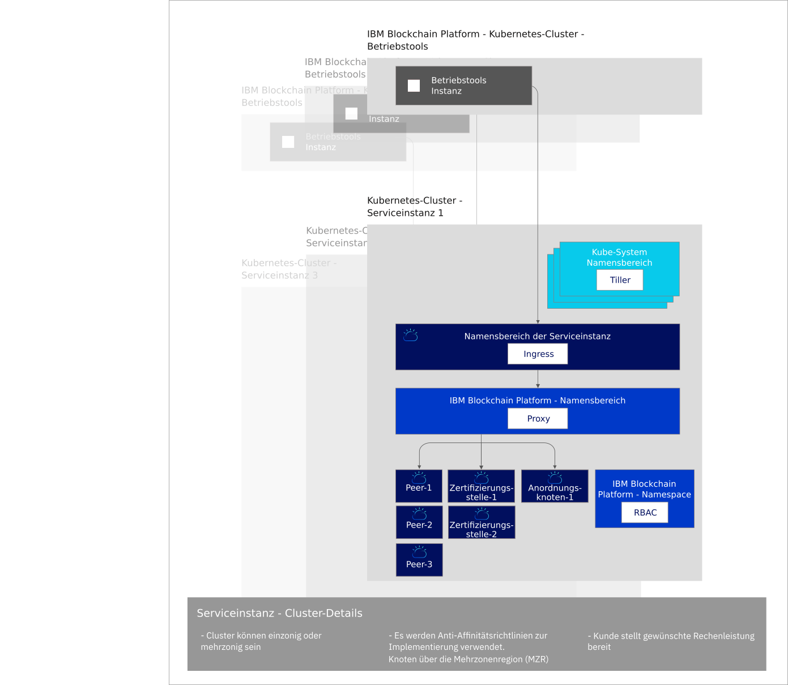

---

copyright:
  years: 2019
lastupdated: "2019-04-18"

subcollection: blockchain

---

{:new_window: target="_blank"}
{:shortdesc: .shortdesc}
{:screen: .screen}
{:codeblock: .codeblock}
{:note: .note}
{:important: .important}
{:tip: .tip}
{:pre: .pre}

# Informationen zur kostenlosen Betaversion {{site.data.keyword.blockchainfull_notm}} Platform 2.0
{: #ibp-console-overview}

Die kostenlose Betaversion {{site.data.keyword.blockchainfull}} Platform 2.0 ist die nächste Generation an {{site.data.keyword.blockchainfull_notm}} Platform-Angeboten, mit denen Sie maximale Kontrolle über Ihre Bereitstellungen sowie öffentlichen und privaten Schlüssel haben. Diese kostenlose Betaversion enthält die neue {{site.data.keyword.blockchainfull_notm}} Platform-Konsole, d. h. eine Benutzerschnittstelle, die den Prozess der Bereitstellung von Komponenten in einem von Ihnen verwalteten und gesteuerten {{site.data.keyword.cloud_notm}} Kubernetes Service vereinfachen und beschleunigen kann. Weitere Informationen zu Kubernetes und dem {{site.data.keyword.cloud_notm}} Kubernetes-Service finden Sie unter [Kubernetes](/docs/services/blockchain/reference/k8s.html "Kubernetes").
{:shortdesc}

Für die kostenlose Betaversion {{site.data.keyword.blockchainfull_notm}} Platform 2.0 wurde ein Upgrade auf die Hyperledger Fabric 1.4.0-Codebasis durchgeführt. Weitere Informationen zu den neuen Features von Hyperledger Fabric 1.4.0 finden Sie in [Neuerungen in 1.4 ](https://hyperledger-fabric.readthedocs.io/en/release-1.4/whatsnew.html "Neuerungen in Fabric 1.4"){:new_window}.

## Angebot der neuen Betaversion
{: #ibp-console-overview-capabilities}

Dieses neueste Release ist auf erfahrene {{site.data.keyword.blockchainfull_notm}}- und Hyperledger Fabric-Benutzer zugeschnitten und ermöglicht diesen Nutzern das Hosten von Netzen oder das Erstellen neuer Organisationen, die an anderen {{site.data.keyword.blockchainfull_notm}} 2.0-Netzen teilnehmen können. Wenn Sie bereits Starter Plan- oder Enterprise Plan-Kunde sind, muss nicht {{site.data.keyword.IBM_notm}} Ihr Netz verwalten, sondern Sie haben jetzt die vollständige Kontrolle und die Möglichkeit, Ihre Komponenten in Ihrem eigenen Kubernetes-Cluster bereitzustellen, zu überwachen und zu verwalten.

Die kostenlose Betaversion {{site.data.keyword.blockchainfull_notm}} Platform 2.0 enthält die folgenden Schlüsselfunktionen:

**Integrierte Entwicklererfahrung**
- **Codieren Sie ganz einfach** Ihre Smart Contracts in Node.js, Golang oder Java, schreiben Sie Clientanwendungen mit der neuen {{site.data.keyword.blockchainfull_notm}}-Erweiterung für VSCode, nutzen Sie die **SDK-Integration** mit der Konsole und lernen Sie mithilfe unserer umfangreichen Lernprogramme und Beispiele.
- **Simplified DevOps** ermöglicht es Ihnen, von der Entwicklungs- in die Test- bis in die Produktionsumgebung in einer einzigen Umgebung zu wechseln, indem Sie Ihre Kubernetes-Ressourcen skalieren, um weitere Komponenten hinzuzufügen.
- **Aktuelle Fabric-Schlüsselfunktionen.** Nutzen Sie die neuesten Funktionen von Hyperledger Fabric v1.4:
  - [**Private Datensammlungen**](/docs/services/blockchain/howto/ibp-console-smart-contracts.html#ibp-console-smart-contracts-private-data), die einen höheren Datenschutz gewährleisten, indem sichergestellt wird, dass die Ledger-Daten nur an berechtigte Peers über das Gossip-Protokoll freigegeben werden.
  - Die [Serviceerkennung ](https://hyperledger-fabric.readthedocs.io/en/release-1.4/discovery-overview.html "Service discovery") ermöglicht es Ihnen, die Interaktion Ihrer Anwendung mit Ihrem Netz dynamisch zu erkennen und zu aktualisieren.
  - Die [Kanal-Zugriffssteuerungslisten ](https://hyperledger-fabric.readthedocs.io/en/release-1.4/access_control.html "Access Control Lists") ermöglichen es Ihnen, die Governance Ihrer Kanäle und Smart Contracts zusätzlich zu steuern.
- **{{site.data.keyword.cloud_notm}}-Serviceintegration.** Nutzen Sie die in {{site.data.keyword.cloud_notm}} intergrierten Services wie z. B. {{site.data.keyword.cloud_notm}} Kubernetes Service Dashboard, {{site.data.keyword.IBM_notm}} Log Analysis with LogDNA und {{site.data.keyword.cloud_notm}} Identity and Access Management (IAM).

**Vollständige Kontrolle über Ihre Bereitstellungen**
- **Stellen Sie nur die Komponenten bereit, die Sie benötigen**. Verbinden Sie einen Peer mit mehreren Kanälen und Netzen oder hosten Sie einen Anordnungsservice, mit dem sich Geschäftspartner verbinden können.
- **Verwalten Sie Ihre vollständige Kontrolle über Ihre Identitäten**. Speichern und verwalten Sie die Schlüssel, die für die Verwaltung Ihrer Knoten verwendet werden, ohne Ihre privaten Schlüssel in {{site.data.keyword.cloud_notm}} zu speichern.
- **Zentralisierter Betrieb**. Die {{site.data.keyword.blockchainfull_notm}} Platform-Konsole ermöglicht es Ihnen, alle Ihre Organisationen und Knoten in **einer zentralen Konsole** bereitzustellen und zu verwalten, ohne sich dabei auf {{site.data.keyword.IBM_notm}} oder andere Anbieter verlassen zu müssen, um Ihre Anordnungsknoten oder Zertifizierungsstellen zu verwalten. Sie können auch Mitglieder zu einem Blockchain-Konsortium hinzufügen oder daraus entfernen, Kanäle erstellen und Kanälen beitreten sowie Smart Contracts von Ihrer Konsole aus installieren und instanziieren.
- **Netz hosten oder am Netz teilnehmen**. Stellen Sie Peers in Ihrem Cluster mehreren Kanälen in mehreren Clouds bereit oder laden Sie andere Organisationen ein, sich an Ihrem Konsortium oder an Ihren Kanälen zu beteiligen, während die Organisationen ihre Knoten unabhängig und infrastrukturübergreifend verwalten.
- **Verwalten Sie den Zugriff** der Benutzer, die Ihre Knoten verwalten oder überwachen können.
- **Direkter Zugriff auf die Protokolle** Ihrer Knoten über {{site.data.keyword.IBM_notm}} Kubernetes Service. Verwenden Sie den {{site.data.keyword.cloud_notm}} Log Analysis-Service oder einen Drittanbieter-Service, um Ihre Protokolle zu extrahieren und zu analysieren.
- **Interagieren Sie direkt mit Ihren Node-Pods** mithilfe des Kubernetes-Dashboards. Führen Sie den Befehl Exec zum Aufrufen Ihrer Pods und Container aus, um Befehle auszuführen und Zertifikate über die Befehlszeile zu aktualisieren.

**Skalierbarkeit und Flexibilität**
- **Wählen Sie Ihre Berechnung aus.** Sie haben die Flexibilität, Ihren CPU-, Hauptspeicher- und Speicherbedarf festzulegen, die Sie in Ihrem Kubernetes-Cluster bereitstellen möchten.
- **Skalieren** Sie die Ressourcen in Ihrem Kubernetes-Cluster nach oben und unten, und bezahlen Sie nur für das, was Sie benötigen.
- **Disaster Recovery and Multi-Zone High Availability:** Diese Option dupliziert Ihre Kubernetes-Bereitstellung in mehreren Zonen, wodurch die Hochverfügbarkeit (HA) Ihrer Komponenten und die Disaster-Recovery (DR) aktiviert werden.  

Informationen zu den nächsten Schritten beim Bereitstellen von Blockchain für standortunabhängige Unternehmen finden Sie [ in diesem Blog ](https://www.ibm.com/blogs/blockchain/2019/02/taking-the-next-step-towards-deploying-blockchain-anywhere "Taking the next step towards deploying blockchain for business anywhere").  

Dieses Angebot ist für erfahrene Fabric-Benutzer ausgelegt, die ihre eigenen Netze erstellen und verwalten möchten. Die Möglichkeit, ein ganzes Netz mit einem einzigen Klick bereitzustellen, ist für die Zukunft geplant. Wenn Sie ein Netz, das eine Standardkonfiguration verwendet, mit einem Klick bereitstellen möchten, finden Sie Informationen dazu in unserer Dokumentation zum [Starter Plan](/docs/services/blockchain/get_start_starter_plan.html#getting-started-with-starter-plan).

## Wichtige Hinweise
{: #ibp-console-overview-considerations}

Stellen Sie vor der Bereitstellung der Konsole sicher, dass Sie die folgenden Aspekte verstehen:

- Die kostenlose Betaversion {{site.data.keyword.blockchainfull_notm}} Platform 2.0 wird mit Hyperledger Fabric Version 1.4.0 erstellt.
- Alle Peers, die mit der kostenlosen Betaversion 2.0 verwendet werden, verwenden CouchDB als Statusdatenbank.
- Sie haben die Möglichkeit, einen kostenlosen Kubernetes-Cluster zur Bewertung des Beta-Angebots zu verwenden. Die Kapazität und Leistung sind jedoch begrenzt, Sie können keine Ihrer Daten migrieren und der Cluster wird nach 30 Tagen gelöscht.
- Sie sind für das Management der Statusüberwachung, der Sicherheit und der Protokollierung Ihres Kubernetes-Cluster verantwortlich. Weitere Informationen dazu, was {{site.data.keyword.cloud_notm}} verwaltet und wofür Sie verantwortlich sind, finden Sie in dieser [Information ](https://cloud.ibm.com/docs/containers/cs_responsibilities.html#your-responsibilities-by-using-ibm-cloud-kubernetes-service "Cluster management responsibilities") .
- Sie sind auch für die Überwachung der Ressourcennutzung Ihres Kubernetes-Clusters über das Kubernetes-Dashboard verantwortlich. Wenn Sie die Speicherkapazität oder die Leistung Ihres Clusters erhöhen müssen, lesen Sie die Informationen zum [Ändern des vorhandenen Datenträgers ](https://cloud.ibm.com/docs/containers/cs_storage_file.html#change_storage_configuration "Changing the size and IOPS of your existing storage device").
- Sie sind für die Verwaltung und Sicherung Ihrer Zertifikate sowie für Ihre öffentlichen und privaten Schlüssel verantwortlich. {{site.data.keyword.IBM_notm}} speichert Ihre Zertifikate nicht im Kubernetes-Cluster und nicht in der Konsole. Sie sind nur im lokalen Speicher Ihres Browsers gespeichert. Wenn Sie den Browser wechseln, müssen Sie Ihre erstellten Identitäten in diesen Browser importieren.
- Die kostenlose Betaversion 2.0 ist nur in der Region **Dallas** des {{site.data.keyword.cloud_notm}} Kubernetes-Service verfügbar. Diese Region umfasst Rechenzentren in Dallas, San Jose, Houston und Brasilien. Daher können sich alle Blockchain-Komponenten in jedem dieser vier Rechenzentren befinden. Sie werden an keinem anderen Ort bereitgestellt.
- Obwohl das Angebot der Betaversion {{site.data.keyword.blockchainfull_notm}} Platform 2.0 kostenlos ist, werden Ihnen Gebühren für Ihr {{site.data.keyword.cloud_notm}} Konto berechnet, wenn Sie einen kostenpflichtigen Kubernetes-Cluster anstelle des eingeschränkten kostenlosen Clusters auswählen.
- Kubernetes muss in Ihrem {{site.data.keyword.cloud_notm}} Kubernetes-Cluster die Version 1.11 oder höher haben. Führen Sie die folgenden Anweisungen aus, um [ein Upgrade für Ihre neuen und vorhandenen Cluster](/docs/services/blockchain/howto/ibp-v2-deploy-iks.html#ibp-v2-deploy-iks-updating-kubernetes) auf diese Version zu aktualisieren.

## Migration
{: #ibp-console-overview-migration}

Es kann keine Migration von einem {{site.data.keyword.blockchainfull_notm}} Platform-Produktangebot auf die kostenlose **Betaversion** {{site.data.keyword.blockchainfull_notm}} Platform 2.0 durchgeführt werden.  

Weder die kostenlosen Betaserviceinstanzen von {{site.data.keyword.blockchainfull_notm}} Platform 2.0 noch Starter Plan- oder Enterprise Plan-Instanzen können auf die allgemein verfügbare Version 2.0 migriert werden.

## Lizenz und Preisstruktur
{: #ibp-console-overview-license-and-pricing}

Die Betaversion {{site.data.keyword.blockchainfull_notm}} Platform 2.0 ist kostenlos. Eine Instanz der Konsole ist bei jeder Bereitstellung der Plattform in einen {{site.data.keyword.cloud_notm}} Kubernetes Service-Cluster enthalten. Sie benötigen einen kostenpflichtigen Kubernetes-Cluster, wenn Sie die Konsole in einem Standardcluster von {{site.data.keyword.cloud_notm}} Kubernetes Service bereitstellen.

## Einführung
{: #ibp-console-overview-deploy}

Eine Instanz der Konsole wird in einem {{site.data.keyword.IBM_notm}} Kubernetes Service-Cluster als Teil der Bereitstellung jeder Instanz der kostenlosen Betaversion {{site.data.keyword.blockchainfull_notm}} Platform 2.0 implementiert.

Weitere Informationen zum Bereitstellen der Konsole und der Plattform finden Sie im Abschnitt [Einführung in die kostenlose Betaversion {{site.data.keyword.blockchainfull_notm}} Platform 2.0](/docs/services/blockchain/howto/ibp-v2-deploy-iks.html#ibp-v2-deploy-iks).

Weitere Informationen zur Verwendung der Konsole, um Knoten bereitzustellen und Konsortien zu erstellen, finden Sie im Lernprogramm [Build a network](/docs/services/blockchain/howto/ibp-console-build-network.html#ibp-console-build-network) (Ein Netz erstellen). Dieses Lernprogramm führt Sie durch den Prozess, wie mithilfe der Konsole ein Beispielnetz mit drei Organisationen, einer Anordnungsorganisation, zwei Peer-Organisationen und einem Kanal mit zwei beigetretenen Peers erstellt wird. Sie können das Beispielnetz verwenden, um Demos oder Machbarkeitsnachweise bereitzustellen. Sie können die Schritte im Lernprogramm so anpassen und erweitern, dass Sie Ihre eigene Konfiguration erstellen.

## Architekturreferenz
{: #ibp-console-overview-architecture}

In der folgenden Abbildung sind die Komponenten Ihres Blockchain-Netzes dargestellt und es wird gezeigt, wie sie interagieren.

*Abbildung 1: Architekturreferenz*

Beachten Sie, wie eine einzelne Instanz der Konsole, die auch als "Betriebstools" bezeichnet wird, für jede {{site.data.keyword.blockchainfull_notm}} Platform Service-Instanz erstellt wird. Wenn ein Peer-, Anordnungs- oder Zertifizierungsstellenknoten mit der Konsole bereitgestellt wird, wird der Knoten in der **Kubernetes-Cluster-Serviceinstanz** bereitgestellt.

| **IBM Blockchain Platform Kubernetes-Cluster** | **Beschreibung** |
| ------------------------- |-----------|
| Betriebstools | Wird auch als `Konsole` bezeichnet; dies ist Ihre zentrale Benutzerschnittstelle für den Betrieb all Ihrer Blockchain-Komponenten. Mit dieser Konsole können Sie jetzt Peer-, Anordnungs- oder Zertifizierungsstellenknoten erstellen, Kanäle erstellen und Smart Contracts installieren und instanziieren, die mit der Erweiterung für VSCode von Hyperledger Fabric v1.4 entwickelt wurden. Die Konsole wird in einem {{site.data.keyword.IBM_notm}}-eigenen Cluster bereitgestellt.|


| **Kubernetes-Cluster-Serviceinstanz** | **Beschreibung** |
| ------------------------- |-----------|-----------|-----------|
| **Tiller** | Teil des [Helm-Tooling ](https://docs.helm.sh/glossary/#tiller "Tiller"). Der Tiller wird innerhalb des Kubernetes-Clusters ausgeführt, um die Installationen Ihrer Peer-, Zertifizierungsstellen- und Anordnungsknoten-Helm-Charts zu verwalten. |
| **Ingress** | Ein [Kubernetes-Objekt ](https://kubernetes.io/docs/concepts/services-networking/ingress/ "Ingress"), das den Zugriff auf die Clusterressourcen von außerhalb des Clusters ermöglicht. |
| **Proxy** | Der {{site.data.keyword.blockchainfull_notm}} Platform-Proxy ist für die Weiterleitung des Datenverkehrs an die richtigen Peer-, Zertifizierungsstellen- und Anordnungsknoten unter Verwendung des Host-Header-Routings verantwortlich. |
| **Peers, Zertifizierungsstellen und Anordnungen** | Dies sind die Knoten, die durch die Bereitstellung der zugrunde liegenden Helm-Diagramme erstellt werden. Hinweis: Diese Knoten können auch aus anderen Kubernetes-Cluster-Serviceinstanzen importiert werden. Da die Schlüssel von {{site.data.keyword.IBM_notm}} niemals gespeichert werden, enthält jeder Peer- und Anordnungsknoten einen gRPC-Web-Proxy, der es der Konsole ermöglicht, mit jedem Knoten zu kommunizieren, indem die Schlüssel in der Konsolenwallet verwendet werden. |
| **RBAC** | Rollenbasierte Zugriffssteuerung.  {{site.data.keyword.blockchainfull_notm}} Platform konfiguriert die [rollenbasierte Kubernetes-Zugriffssteuerung ](https://kubernetes.io/docs/reference/access-authn-authz/rbac/ "Autorisierung für rollenbasierte Zugriffssteuerung (RBAC) verwenden") in dem Cluster, der für die Verwaltung von Blockchain-Komponenten im Cluster erforderlich ist.  |

## Hochverfügbarkeit (HA) und Disaster-Recovery (DR)
{: #ibp-console-overview-hadr}

Der Mehrzonenspeicher muss in Ihrem kostenpflichtigen IBM Cloud Kubernetes-Cluster aktiviert werden, wenn eine Hochverfügbarkeit (HA) und Disaster-Recovery (DR) erforderlich sind. Es stehen eine Reihe von [Optionen für Kubernetes-Speicher](https://cloud.ibm.com/docs/containers/cs_storage_planning.html#persistent_storage_overview) zur Verfügung. In Kürze wird IBM Cloud die Portworx-Speicherlösung unterstützen, die dann die empfohlene Lösung ist. Wenn Sie bis dahin HA und DR für Ihre Bereitstellung benötigen, müssen Sie Ihre eigene Speicherlösung bereitstellen.  

Wenn Sie Ihre eigene Speicherlösung hinzufügen möchten, müssen Sie eine angepasste Speicherklasse erstellen. Hier finden Sie Informationen zum [Hinzufügen einer Speicherklasse](https://cloud.ibm.com/docs/containers/cs_storage_basics.html#storageclasses) für Ihre Lösung. {{site.data.keyword.blockchainfull_notm}} Platform verwendet die [dynamische Bereitstellung](https://cloud.ibm.com/docs/containers/cs_storage_basics.html#dynamic_provisioning) mit der `Standard`-Speicherklasse. Führen Sie daher den folgenden Befehl aus, um die Standardspeicherklasse zu ändern:
```
kubectl patch storageclass <storageclass> -p '{"metadata": {"annotations":{"storageclass.kubernetes.io/is-default-class":"true"}}}'
```
{:codeblock}

Ersetzen Sie ``<storageclass>`` durch den Namen Ihrer Speicherklasse.  

Stellen Sie abschließend sicher, dass Sie mehrere Zonen aktivieren, wenn Sie Ihren kostenpflichtigen Cluster erstellen.

## Support anfordern
{: #ibp-console-overview-support}

Weitere Informationen, wie Sie Support für {{site.data.keyword.blockchainfull_notm}} Platform 2.0 anfordern können sowie kostenlose Blockchain-Entwicklerressourcen und Unterstützungsforen erhalten, die Sie zum Beheben von Problemen verwenden können, finden Sie im Abschnitt [Support anfordern](/docs/services/blockchain/ibmblockchain_support.html#blockchain-support).

Der Support für {{site.data.keyword.blockchainfull_notm}} Platform 2.0 ist auf den Zeitraum der Betaphase beschränkt.
{: important}
