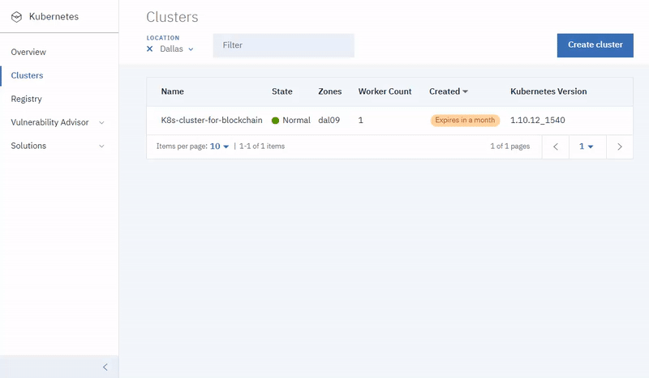

---

copyright:
  years: 2019
lastupdated: "2019-03-05"

subcollection: blockchain

---

{:new_window: target="_blank"}
{:shortdesc: .shortdesc}
{:screen: .screen}
{:codeblock: .codeblock}
{:note: .note}
{:important: .important}
{:tip: .tip}
{:pre: .pre}

# Einführung in die kostenlose Betaversion {{site.data.keyword.blockchainfull_notm}} Platform 2.0
{: #ibp-v2-deploy-iks}

{{site.data.keyword.blockchainfull}} Platform 2.0 ist ein kostenloses Beta-Release, das die die {{site.data.keyword.blockchainfull_notm}} Platform-Konsole enthält: eine grafische Benutzerschnittstelle, die Ihre Bereitstellung und Verwaltung von Blockchain-Komponenten vereinfacht und beschleunigt. In diesem Lernprogramm wird beschrieben, wie Sie mit {{site.data.keyword.blockchainfull_notm}} Platform 2.0 beginnen und die Konsole verwenden können, um Blockchain-Komponenten in Ihrem {{site.data.keyword.IBM_notm}} Kubernetes Service-Cluster unter {{site.data.keyword.cloud_notm}} bereitzustellen und zu verwalten.
{:shortdesc}

**Zielgruppe:** Dieser Abschnitt richtet sich an Systemadministratoren, die für die Einrichtung eines Kubernetes-Clusters in {{site.data.keyword.IBM_notm}} und für die Bereitstellung von {{site.data.keyword.blockchainfull_notm}} Platform verantwortlich sind.

 Nachdem Sie die {{site.data.keyword.blockchainfull}} Platform in Ihrem Kubernetes-Cluster bereitgestellt haben, können Sie die Konsole starten, um Ihre Blockchain-Komponenten zu erstellen und zu verwalten. Wenn Sie einen {{site.data.keyword.IBM_notm}} Kubernetes Service-Cluster verwenden, um die {{site.data.keyword.blockchainfull_notm}} Platform 2.0 bereitzustellen, erhalten Sie folgende wichtige Vorteile:

- **Steuerung:** Sie steuern und verwalten Ihre Blockchain-Komponenten und Zertifikate von einer zentralen Konsole aus. Stellen Sie nur die Komponenten bereit, die für Ihr Unternehmen benötigt werden, und fügen Sie mehr hinzu, wenn Sie wachsen.
- **Flexible Kubernetes-basierte Bereitstellung:** Sie können die Optionen für die Berechnung (CPU, Hauptspeicher, Speicher) für Ihren Kubernetes-Cluster verwenden und integrierte HA- und DR-Optionen nutzen.

## Wichtige Hinweise
{: #ibp-v2-deploy-iks-considerations}

Stellen Sie vor der Bereitstellung der Konsole sicher, dass Sie die folgenden Aspekte verstehen:

- Die kostenlose Betaversion {{site.data.keyword.blockchainfull_notm}} Platform 2.0 wird mit Hyperledger Fabric v1.4 erstellt.
- Alle Peers, die mit der kostenlosen Betaversion 2.0 verwendet werden, verwenden CouchDB als Statusdatenbank.
- Sie haben die Möglichkeit, einen kostenlosen Kubernetes-Cluster zur Bewertung des Betaangebotes zu verwenden. Die Kapazität und Leistung sind jedoch begrenzt, Sie können keine Ihrer Daten migrieren und der Cluster wird nach 30 Tagen gelöscht.
- Sie sind für das Management der Statusüberwachung, der Sicherheit und der Protokollierung Ihres Kubernetes-Cluster verantwortlich. Weitere Informationen dazu, was {{site.data.keyword.cloud_notm}} verwaltet und wofür Sie verantwortlich sind, finden Sie in dieser [Information ](https://cloud.ibm.com/docs/containers/cs_responsibilities.html#your-responsibilities-by-using-ibm-cloud-kubernetes-service "Cluster management responsibilities") .
- Sie sind auch für die Überwachung der Ressourcennutzung Ihres Kubernetes-Clusters über das Kubernetes-Dashboard verantwortlich. Wenn Sie die Speicherkapazität oder die Leistung Ihres Clusters erhöhen müssen, lesen Sie die Informationen zum [Ändern des vorhandenen Datenträgers ](https://cloud.ibm.com/docs/containers/cs_storage_file.html#change_storage_configuration "Changing the size and IOPS of your existing storage device").
- Sie sind für die Verwaltung und Sicherung Ihrer Zertifikate sowie für Ihre öffentlichen und privaten Schlüssel verantwortlich. IBM speichert Ihre Zertifikate nicht im Kubernetes-Cluster.
- Die kostenlose Betaversion 2.0 ist nur in der Region **Dallas** des {{site.data.keyword.cloud_notm}} Kubernetes-Service verfügbar. Diese Region umfasst Rechenzentren in Dallas, San Jose, Houston und Brasilien. Daher können sich alle Blockchain-Komponenten in jedem dieser vier Rechenzentren befinden. Sie werden an keinem anderen Ort bereitgestellt.
- Das Beta-Angebot ist zwar kostenlos, aber Sie müssen trotzdem für Ihren Kubernetes-Cluster bezahlen, wenn Sie einen kostenpflichtigen Cluster auswählen.
- Kubernetes muss in Ihrem {{site.data.keyword.cloud_notm}} Kubernetes-Cluster die Version 1.11 oder höher haben. Führen Sie die folgenden Anweisungen aus, um [ein Upgrade für Ihre neuen und vorhandenen Cluster](/docs/services/blockchain/howto/ibp-v2-deploy-iks.html#ibp-v2-deploy-iks-updating-kubernetes) auf diese Version zu aktualisieren.

## Schulungsvideo
{: #ibp-v2-deploy-video}

Das folgende Video vermittelt Informationen zur kostenlosen Betaversion {{site.data.keyword.blockchainfull}} Platform 2.0 und zum Einstieg in die Bereitstellung der kostenlosen Betaversion {{site.data.keyword.blockchainfull_notm}} Platform 2.0.

<iframe class="embed-responsive-item" id="youtubeplayer" title="Kostenlose Betaversion von IBM Blockchain Platform 2.0 - Anleitungsvideo für die Bereitstellung" type="text/html" width="640" height="390" src="https://www.youtube.com/embed/gPnkVQiHRqk" frameborder="0" webkitallowfullscreen mozallowfullscreen allowfullscreen> </iframe>

## Vorbemerkungen
{: #ibp-v2-deploy-iks-prereq}

Vorbemerkungen:

- Stellen Sie sicher, dass ein [{{site.data.keyword.cloud_notm}} gebührenpflichtiges Konto ](https://console.cloud.ibm.com/catalog/services/blockchain "Catalog") vorhanden ist. Wenn Sie kein Konto haben:
1. Klicken Sie auf die Schaltfläche **Registrieren** .
2. Nach der Erstellung eines kostenfreien Testkontos führen Sie ein Upgrade auf ein **nutzungsabhängig Konto** durch, indem Sie **Verwalten** > **Abrechnung und Nutzung** > **Abrechnung** in der {{site.data.keyword.cloud_notm}}-Konsole aufrufen und auf **Kreditkarte hinzufügen** klicken.

Wenn Sie planen, die Serviceinstanz im Kontext einer umfassenderen organisationsweiten Lösung zu verwenden, wird empfohlen, dass die teilnehmenden Organisationen eine funktionale E-Mail-Adresse verwenden, um ihr Netz zu erstellen. In diesem Fall ist der Zugriff auf das Netz nicht von der Verfügbarkeit der einzelnen Personen abhängig.
{:tip}  

- Wenn Sie einen vorhandenen {{site.data.keyword.cloud_notm}} Kubernetes Service-Cluster verwenden möchten, überprüfen Sie die Version von Kubernetes, und führen Sie bei Bedarf ein Upgrade auf Version 1.11 oder höher durch. Weitere Informationen zum Ermitteln der Version von Kubernetes, auf der Ihr Cluster ausgeführt wird, sowie zum Durchführen eines Upgrades auf eine höhere Version finden Sie im Abschnitt [Kubernetes-Version des Clusters aktualisieren](/docs/services/blockchain/howto/ibp-v2-deploy-iks.html#ibp-v2-deploy-iks-updating-kubernetes).

### Browser
{: #ibp-v2-deploy-iks-browsers}
Die folgende Liste enthält die Mindestanforderung für die Browsersoftware für die {{site.data.keyword.blockchainfull_notm}} Platform-Konsole:

- Chrome: aktuelle Version für Ihr Betriebssystem
- Firefox: aktuelle reguläre Versionen (keine ESR-Versionen) für Ihr Betriebssystem
- Safari: aktuelle Version für Mac

### Erforderliche Ressourcen
{: #ibp-v2-deploy-iks-resources-required}

Um die {{site.data.keyword.blockchainfull_notm}} Platform-Konsole in einem {{site.data.keyword.cloud_notm}} Kubernetes Service-Cluster bereitzustellen, müssen Sie sicherstellen, dass Ihr Kubernetes-Cluster die Mindestvoraussetzungen für die Hardwareressourcen erfüllt:

|Kubernetes-Cluster-Typ | Anwendungsfall | CPU | RAM | Workerknoten |
|-----------|------|-----|-----------------------|
|Standard (empfohlen) | Für MVPs geeignet | 4 (Gemeinsam genutzt) | 16 GB (gemeinsam genutzt)|Mehrere|
|Kostenlos | Für eine Evaluierung geeignet | 2 | 4 GB | 1 |  

Diese Ressourcen sind für Tests und Experimente Versuchsreihen ausreichend. Wenn Sie einen kostenlosen Kubernetes-Cluster verwenden, beachten Sie, dass der Cluster nach Ablauf der 30-tägigen Testversion gelöscht wird und alle zugehörigen Assets entfernt werden. Die Leistung ist in einem kostenlosen Cluster deutlich geringer.
{:note}

## Schritt 1: Erstellen Sie ein Verbindungsprofil für {{site.data.keyword.cloud_notm}} Platform
{: #ibp-v2-deploy-iks-create-service-instance}

Führen Sie die folgenden Schritte aus, um eine Serviceinstanz von {{site.data.keyword.blockchainfull_notm}} Platform 2.0 in {{site.data.keyword.cloud_notm}}zu erstellen.

1. Suchen Sie den [Blockchain-Service ](https://console.cloud.ibm.com/catalog/services/blockchain) im {{site.data.keyword.cloud_notm}} Katalog oder suchen Sie auf Ihrer {{site.data.keyword.cloud_notm}} Katalogseite nach `Blockchain`.
2. Sie können optional den **Service** für Ihre Instanz umbenennen, so dass Sie ihn in der Zukunft leichter erkennen können.
3. Bei der Betaversion ist **Dallas** die einzige verfügbare Region und kann nicht geändert werden.
4. Sie können die Felder für die Ressourcengruppe und die Tags unverändert lassen.
5. Klicken Sie auf **Erstellen**, um die Serviceinstanz bereitzustellen.

## Schritt 2: Stellen Sie {{site.data.keyword.blockchainfull_notm}} Platform 2.0 bereit
{: #ibp-v2-deploy-iks-steps}

Folgen Sie der Anleitung zum Bereitstellen von {{site.data.keyword.blockchainfull_notm}} Platform 2.0 nach der Erstellung der Serviceinstanz.

1. Der Schritt **Willkommen & Voraussetzungen**. Wenn Sie bereits über einen vorhandenen {{site.data.keyword.IBM_notm}} Kubernetes Service-Cluster in der Region **Dallas** verfügen und ihn für Ihren Blockchain-Service verwenden möchten, wählen Sie das Kontrollkästchen aus. **Wenn Sie einen vorhandenen Cluster verwenden, können Sie den nächsten Schritt überspringen. Stellen Sie jedoch sicher, dass die Kubernetes-Version 1.11 oder höher verwendet wird.** Klicken Sie auf **Weiter**.
2. Der Schritt **Cluster erstellen**. Wenn Sie das Kontrollkästchen in Schritt 1 auswählen, um einen vorhandenen Kubernetes-Cluster zu verwenden, wird dieser Schritt übersprungen. Klicken Sie andernfalls auf **Neuen Cluster erstellen**, wodurch das {{site.data.keyword.cloud_notm}} Kubernetes-Dashboard zum Erstellen eines Clusters gestartet wird. Weitere Informationen finden Sie im Abschnitt [Einführung in {{site.data.keyword.cloud_notm}} Kubernetes Service ](https://cloud.ibm.com/docs/containers/container_index.html). Planen Sie zusätzliche Zeit ein, um diesen Prozess abzuschließen.
  - Unabhängig vom ausgewählten Clustertyp müssen Sie bei der Betaversion die Position **Dallas** des Kubernetes-Clusters auswählen.
  - Wählen Sie **Standard-Cluster (empfohlen):** Wenn Sie eine längerfristige Option benötigen, die mehrere Knoten für die Hochverfügbarkeit umfasst und die vom Beta-Angebot zum allgemein verfügbaren Angebot (falls schon verfügbar) migriert werden kann. **Achten Sie darauf, die Kubernetes-Version 1.11 oder höher auszuwählen.**
  - Wählen Sie **Kostenloser Cluster:** aus, wenn Sie den Cluster für weniger als 30 Tage verwenden wollen. **Hinweis:** Beachten Sie, dass es nicht möglich ist, von einem kostenlosen Cluster auf einen kostenpflichtigen Cluster zu migrieren. Der kostenlose Cluster bietet nur begrenzt Speicher und einen geringeren Transaktionsdurchsatz.
  - Weitere Informationen zu den Unterschieden zwischen den kostenlosen und kostenpflichtigen Kubernetes-Clustern in {{site.data.keyword.cloud_notm}} finden Sie im Abschnitt [Vergleich von kostenlosen und Standard-Clustern ](https://console.cloud.ibm.com/docs/containers?topic=containers-cluster_types#cluster_types "Comparison of free and standard clusters").  

   Sie müssen in Ihrem Browser zu dieser Registerkarte zurückkehren, nachdem Sie den Cluster erstellt haben, damit Sie den Bereitstellungsprozess von {{site.data.keyword.blockchainfull_notm}} Platform 2.0 abschließen können.  
   {:important}  

  Sie müssen warten, bis Ihr Cluster erfolgreich bereitgestellt wurde. Klicken Sie dann auf die Schaltfläche **I Have a Cluster** (Ich habe einen Cluster).
3. Ihre Kubernetes-Version, die in Ihrem Cluster ausgeführt wird, muss die Version 1.11 oder höher haben. Führen Sie die folgenden [Schritte](/docs/services/blockchain/howto/ibp-v2-deploy-iks.html#ibp-v2-deploy-iks-updating-kubernetes) aus, um die Clusterversion zu überprüfen und gegebenenfalls ein Upgrade durchzuführen. Kehren Sie dann zurück und fahren Sie mit diesen Anweisungen fort.
4. Der Schritt **In Cluster bereitstellen**. Wählen Sie den Kubernetes-Cluster aus, auf dem Sie {{site.data.keyword.blockchainfull_notm}} Platform 2.0 bereitstellen möchten, aus der Dropdown-Liste aus, und klicken Sie auf **In Cluster bereitstellen**.  

  Wenn Ihr Kubernetes-Cluster in der Dropdown-Liste nicht sichtbar ist, kann dies durch die folgenden Bedingungen verursacht werden: 
  - Der Prozess der Clustererstellung kann bis zu 60 Minuten in Anspruch nehmen. Wenn Sie einen Cluster erstellt haben, planen Sie zusätzliche Zeit ein, bis der Status Ihres Clusters **Normal** ist.
  - Cluster, die sich außerhalb der **Dallas**-Region befinden, sind nicht sichtbar und können nicht verwendet werden.
  - Stellen Sie sicher, dass Sie nicht die ESR-Version von Firefox verwenden. Wenn ja, wechseln Sie in einen anderen Browser, wie z. B. Chrome, und wiederholen Sie den Vorgang.

5. Der Schritt **Konsole starten**. Nachdem {{site.data.keyword.blockchainfull_notm}} Platform 2.0 erfolgreich bereitgestellt wurde, klicken Sie auf **{{site.data.keyword.blockchainfull_notm}} Platform starten**, um die {{site.data.keyword.blockchainfull_notm}} Platform-Konsole zu öffnen. Es kann ein paar Minuten dauern, bis die Schaltfläche aktiviert wird, während die Konsole bereitgestellt wird.

## (Optional) Der Konsole weitere Benutzer hinzufügen
{: #ibp-v2-deploy-iks-add-users}

Standardmäßig verwendet die Konsole die [{{site.data.keyword.IBM_notm}} ID ](https://cloud.ibm.com/docs/iam/index.html#iamoverview "IBM Cloud Identity and Access Management") als Identitätsserviceprovider. Ihre {{site.data.keyword.blockchainfull_notm}} Platform-Konsole wird bereitgestellt, indem die E-Mail-Adresse des {{site.data.keyword.IBM_notm}}-Eigners als Administrator der Konsole konfiguriert wird. Als Administrator ist dieser Benutzer berechtigt, anderen Benutzern über ihre E-Mail-Adressen Zugriff auf die Konsole zu erteilen.  

### So fügen Sie einen neuen Benutzer hinzu
{: #ibp-v2-deploy-iks-add-users-howto}

Klicken Sie in der linken Navigation auf das Symbol **Benutzer**, um die Liste der Benutzer anzuzeigen, die sich an der Konsole anmelden können. Wenn Sie als Konsolenadministrator angemeldet sind, können Sie auf **Neue Benutzer hinzufügen** klicken, um neue Benutzer für die Konsole zu autorisieren und ihnen **Administrator**-Zugriff oder **allgemeinen** Zugriff zu erteilen. Benutzer mit der Rolle **Administrator** können Benutzer hinzufügen oder löschen.

## Nächste Schritte
{: #ibp-v2-deploy-iks-next-steps}

Jetzt ist Ihre Konsole einsatzbereit und Sie können mit dem [Lernprogramm zum Erstellen eines Netzes](/docs/services/blockchain/howto/ibp-console-build-network.html#ibp-console-build-network) fortfahren.

## Kubernetes-Version Ihres Clusters aktualisieren
{: #ibp-v2-deploy-iks-updating-kubernetes}

Wenn Sie einen vorhandenen {{site.data.keyword.cloud_notm}} Kubernetes Service-Cluster verwenden, stellen Sie sicher, dass die Version von Kubernetes die Version 1.11 oder höher ist.

Sie können die Kubernetes-Version Ihres Clusters auf der [Kubernetes-Cluster-Seite ](https://console.cloud.ibm.com/containers-kubernetes/clusters) unter {{site.data.keyword.cloud_notm}} überprüfen, auf der alle Ihre Cluster in einer Tabelle aufgelistet sind.

Wenn die Version von Kubernetes nicht die Version 1.11 oder höher ist, müssen Sie die folgenden Schritte ausführen, um die Kubernetes-Version Ihres Clusters zu aktualisieren.

1. Klicken Sie auf das Überlaufmenü am Ende der Zeile und wählen Sie **Version aktualisieren** aus. Dieser Vorgang dauert etwa eine Stunde. Wenn die Version erfolgreich aktualisiert wurde, wird die aktualisierte Version Ihres Clusters in der Spalte **Kubernetes-Version** angezeigt.  
2. Wählen Sie die Kubernetes-Version 1.11 oder höher in der Dropdown-Liste der Kubernetes-Versionen aus und klicken Sie auf **Aktualisieren**.
3. Klicken Sie auf den Cluster und rufen Sie die Registerkarte **Workerknoten** auf. Wählen Sie das Kontrollkästchen vor dem Workerknoten aus, den Sie aktualisieren möchten, und klicken Sie in der Popup-Menüleiste auf **Kubernetes aktualisieren**. Wenn Ihr Cluster mehrere Workerknoten enthält, dann müssen alle diese Knoten aktualisiert werden.

  Aktualisierungen der Workerknoten können zu Ausfallzeiten Ihrer Apps und Services führen. Es wird ein neues Image Ihrer Workerknoten-Maschine erstellt und Daten werden gelöscht. Speichern Sie deshalb [Ihre Daten außerhalb des Pods ](https://cloud.ibm.com/docs/containers/cs_storage_planning.html#persistent_storage_overview).
  {:important}

Weitere Informationen zum Aktualisieren der Kubernetes-Version für einen {{site.data.keyword.IBM_notm}} Kubernetes Service-Cluster und für Workerknoten finden Sie im Abschnitt [Cluster, Workerknoten und Add-ons aktualisieren ](https://cloud.ibm.com/docs/containers/cs_cluster_update.html#update).  

Sie müssen warten, bis die Aktualisierung abgeschlossen ist, bevor Sie [die Bereitstellung von {{site.data.keyword.blockchainfull_notm}} Platform 2.0](/docs/services/blockchain/howto/ibp-v2-deploy-iks.html#ibp-v2-deploy-iks-steps) fortsetzen können.

## Serviceinstanz löschen
{: #ibp-v2-deploy-iks-delete-service-instance}

Wenn Sie Ihre Serviceinstanz nicht mehr benötigen, kann sie aus Ihrem Kubernetes-Cluster gelöscht werden, um Ressourcen freizugeben. Mithilfe der IBM Cloud-Benutzerschnittstelle können Sie eine Serviceinstanz der kostenlosen Betaversion {{site.data.keyword.blockchainfull_notm}} Platform 2.0 löschen. 

1. Navigieren Sie zu Ihrem [{{site.data.keyword.cloud_notm}}-Dashboard ](https://cloud.ibm.com/ "Dashboard").
2. Lokalisieren Sie die Kachel **Ressourcenzusammenfassung** und klicken Sie auf **Services**.
3. Lokalisieren Sie unter dem Pfeilsymbol **Services** die Serviceinstanz, die Sie löschen möchten, und klicken Sie im Aktionsmenü auf **Löschen**.

Wenn das Löschen Ihrer Serviceinstanz fehlschlägt, ist der Kubernetes-Cluster möglicherweise nicht zugänglich. Wenn dies zutrifft, öffnen Sie ein [Support-Ticket](/docs/services/blockchain/ibmblockchain_support.html#blockchain-support-cases), damit die Serviceinstanz von einem Supportmitarbeiter gelöscht wird.
