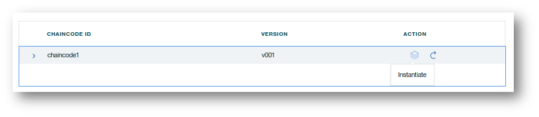
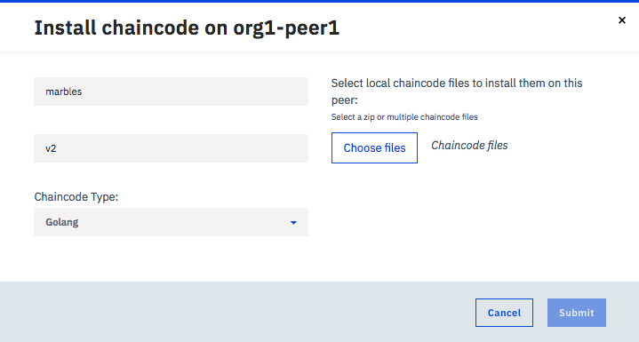

---

copyright:
  years: 2017, 2018
lastupdated: "2018-05-15"
---

{:new_window: target="_blank"}
{:shortdesc: .shortdesc}
{:codeblock: .codeblock}
{:screen: .screen}
{:pre: .pre}

# Chaincode installieren, instanziieren und aktualisieren

Bei Chaincode handelt es sich um Software (in Go, Java oder Node.js geschrieben), die die Geschäftslogik und transaktionsorientierten Anweisungen zum Erstellen und Ändern von Assets im Hauptbuch (Ledger) umfasst. Chaincode wird in einem Docker-Container ausgeführt, der den Peers zugeordnet ist, die mit diesem Container interagieren müssen.  Weitere Informationen zum Entwickeln von Chaincode finden Sie unter [Chaincode Tutorials ](http://hyperledger-fabric.readthedocs.io/en/latest/chaincode.html).
{:shortdesc}

Chaincode wird im Dateisystem eines Peers installiert und anschließend auf einem Kanal instanziiert. **Alle Kanalmitglieder müssen den Chaincode auf allen Peers installieren, auf denen dieser Chaincode ausgeführt werden soll.** Damit derselbe Chaincode verwendet wird, müssen die Kanalmitglieder für den Chaincode bei der Chaincode-Installation denselben Namen und dieselbe Version angeben. Bei der Instanziierung müssen dann Schlüssel/Wert-Paare initialisiert und der Chaincode-Container bereitgestellt werden. Für jeden Peer, über den Anwendungen mit einem Chaincode interagieren sollen, muss der Chaincode im Dateisystem des Peers installiert sein und ein aktiver Chaincode-Container muss ausgeführt werden. **Wenn ein Peer jedoch dieselbe Chaincode-Anwendung auf mehreren Kanälen verwendet, benötigt er nur eine einzelne Instanz des Chaincode-Containers.**

Die **Kombination von Installation und Instanziierung** ist eine leistungsfähige Funktion, da so ein Peer mit demselben Chaincode-Container auf mehreren Kanälen interagieren kann. Die einzige Voraussetzung ist, dass die eigentlichen Chaincode-Quellendateien im Dateisystem des Peers installiert sind. Wenn nämlich ein Teil eines allgemeinen Chaincodes auf Dutzenden von Kanälen verwendet wird, würde ein Peer nur einen einzigen Chaincode-Container benötigen, um Lese-/Schreibvorgänge für alle Kanalhauptbücher durchzuführen. Dieser einfache Ansatz ist für die Rechenleistung und den Durchsatz von Vorteil, wenn Netze skaliert werden und Chaincode komplexer wird.

**Hinweis:** Wenn Sie Ihren Chaincode interaktiv entwickeln und einen Chaincode aktualisieren müssen, müssen Sie sowohl die Installationsschritte als auch die Instanziierungsschritte für den Chaincode wiederholen.

## Chaincode installieren
{: #installchaincode}

Sie müssen den Chaincode auf allen Peers installieren, auf denen dieser Chaincode ausgeführt werden soll. Führen Sie die folgenden Schritte aus, um einen Chaincode zu installieren:
1. Wählen Sie in der Anzeige "Code installieren" Ihres Network Monitor einen Peer in der Dropdown-Liste aus, um den Chaincode zu installieren. Klicken Sie auf die Schaltfläche **Chaincode installieren**.
<!--
  
-->

2. Geben Sie in der Popup-Anzeige **Chaincode** den Namen und die Version Ihres Chaincodes ein. **Hinweis:** Die Zeichenfolgen für den Namen und die Version werden in Anwendungen für die Interaktion mit dem installierten Chaincode verwendet. Klicken Sie auf die Schaltfläche **Durchsuchen**, um im lokalen Dateisystem zur Speicherposition der Chaincode-Quellendateien zu navigieren. Wählen Sie mindestens eine Chaincode-Quellendatei aus, die für den Peer installiert werden soll. Wählen Sie dann die Chaincodesprache in der Dropdown-Liste **Chaincodetyp** aus.

  

## Chaincode instanziieren
Wenn ein Chaincode im Dateisystem jedes Peers installiert wurde, der einem Kanal beitritt, muss der Chaincode anschließend auf dem Kanal instanziiert werden, sodass die Peers mit dem Ledger über den Chaincode-Container interagieren können. Die Instanziierung führt die erforderliche Initialisierung des Chaincodes durch. Dazu ist es häufig notwendig, die Schlüssel/Wert-Paare anzugeben, die den ursprünglichen World-Status eines Chaincodes darstellen.

Sie müssen über die Berechtigung **Operator** oder **Schreibberechtigter** für den Kanal verfügen, um den Chaincode zu instanziieren. Chaincode, der auf unterschiedlichen Peers denselben Namen und die dieselbe Version hat, muss nur einmal instanziiert werden, um den Chaincode-Container bereitzustellen. Führen Sie die folgenden Schritte aus, um einen Chaincode zu instanziieren:
1. Wählen Sie in der Anzeige "Code installieren" Ihres Network Monitor den Peer aus, für den Sie den Chaincode installiert haben, und lokalisieren Sie den zu instanziierenden Chaincode in der Chaincode-Tabelle. Klicken Sie anschließend auf die Schaltfläche **Instanziieren** unter der Überschrift **Aktion**.
<!--
  
-->

2. Legen Sie in der Popup-Anzeige **Chaincode instanziieren** die Schlüssel/Wert-Paare als Argumente für die Chaincode-Initialisierung fest und wählen Sie den Kanal, auf dem instanziiert werden soll. Klicken Sie auf **Abschicken**.
<!--
  
-->

## Chaincode aktualisieren
Sie können Chaincode aktualisieren, um die Chaincodeprogrammierung zu ändern, und gleichzeitig die Beziehung beibehalten, die zwischen dem Chaincode und den Assets im Ledger besteht. Aufgrund der Kombination aus Installation und Instanziierung müssen Sie den Chaincode für alle Peers, die sich mit diesem Chaincode im Kanal befinden, aktualisieren. Führen Sie die folgenden Schritte aus, um den Chaincode zu aktualisieren.

1. Installieren Sie Chaincode, dessen Name mit dem des alten Chaincodes identisch ist, der jedoch eine andere Version aufweist. Hierzu können Sie dieselben Schritte ausführen wie für das [Installieren von Chaincode](install_instatiate_chaincode.html#Installing a chaincode). Stellen Sie sicher, dass Sie denselben Kanal auswählen wie beim ursprünglichen Chaincode.

  

2. Suchen Sie den neuen Chaincode in der Tabelle und klicken Sie auf die Schaltfläche **Aktualisieren** unter der Überschrift **Aktion**. Mit dieser Aktion wird der Chaincode erneut instanziiert und der Chaincode-Container wird durch einen neuen ersetzt. Beachten Sie, dass im Rahmen der Aktualisierungsfunktion keine neuen Argumente eingegeben werden müssen.

  
