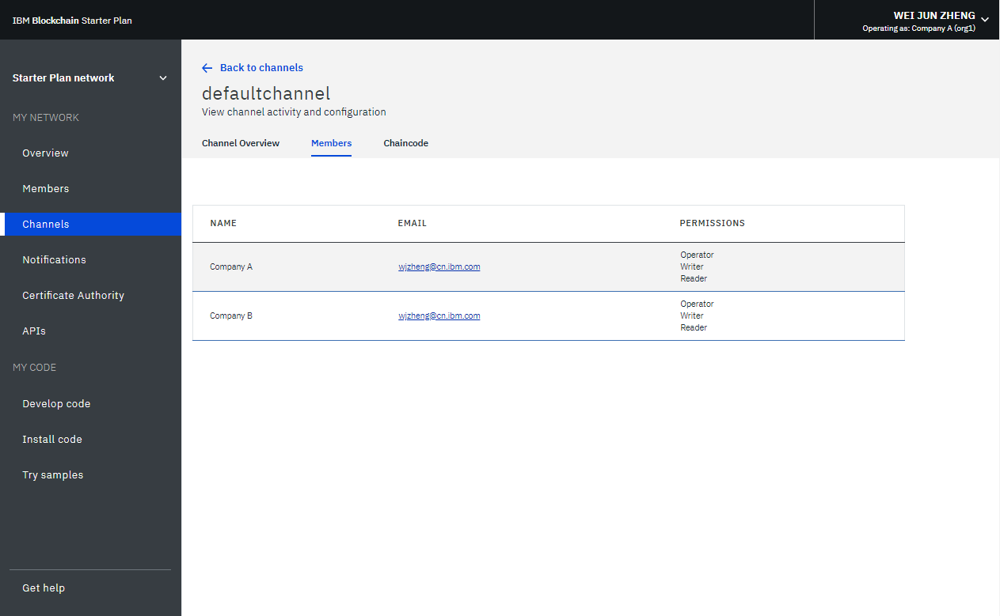

---

copyright:
  years: 2017, 2018
lastupdated: "2018-06-14"

---

{:new_window: target="_blank"}
{:shortdesc: .shortdesc}
{:screen: .screen}
{:codeblock: .codeblock}
{:pre: .pre}

# Blockchain-Netz überwachen

Dieses Lernprogramm zeigt, wie Sie Statusinformationen zu Ihrem {{site.data.keyword.blockchain}}-Netz in {{site.data.keyword.cloud_short}} anzeigen und überwachen können.
{:shortdesc}


## Peers, Anordnungsknoten und Zertifizierungsstellen überwachen
{: #monitor-nodes}

Sie können eine HTTP-Anforderung **HEAD** für einen Netzknoten ausgeben, um den Knotenstatus zu überprüfen. Bei einem Netzwerkknoten kann es sich um einen Peer, einen Anordnungsknoten oder eine Zertifizierungsstelle im Blockchain-Netz handeln. Eine **HEAD**-Anforderung gleicht einer GET-Anforderung und sendet lediglich Header ohne den Anforderungshauptteil. Sie können mit etwa 200 Antworten rechnen, wenn der Knoten ordnungsgemäß ausgeführt wird. 

1. Klicken Sie in der Anzeige "Übersicht" im Network Monitor auf **Verbindungsprofil**. Klicken Sie anschließend auf **Unaufbereiteter JSON-Code**, um das Verbindungsprofil im Web-Browser anzuzeigen, oder auf **Herunterladen**, um das Verbindungsprofil lokal zu speichern. 
2. Suchen Sie im Verbindungsprofil die URL-Informationen des Netzknotens, der überprüft werden soll. Die URL des Anordnungsknotens `fabric-orderer-20190b` lautet z. B. `grpcs://fft-zbc02b.4.secure.blockchain.ibm.com:20190`.   
    
3. Ersetzen Sie **grpcs** in der URL durch **https**. Die URL im voranstehenden Beispiel wird zu `https://fft-zbc02b.4.secure.blockchain.ibm.com:20190`. 
4. Geben Sie die **HEAD**-Anforderung für die URL mit einem Tool wie "cURL" oder der Chrome-App "Postman" aus. 
    - Wenn Sie etwa 200 Statusantworten erhalten, wird der Netzknoten ordnungsgemäß ausgeführt. 
    - Schlägt die **HEAD**-Anforderung mit einem Verbindungsfehler fehl, ist der Netzknoten nicht aktiv, die Knoten-URL falsch oder der Zugriff auf den Knoten wird durch eine Firewall blockiert. Dieser Fehler muss behoben werden. Ihre Anwendungen können ansonsten keine Verbindung zum Knoten herstellen. 

Bei dem folgenden Beispiel handelt es sich um eine **HEAD**-Anforderung mit etwa 200 Antworten in cURL. Der grpc-Fehler kann ignoriert werden, da die HTTP-Anforderung **HEAD** überprüft, ob auf den Knoten zugegriffen werden kann. Ist der Zugriff möglich, wird die grpc-Anforderung auf den Knoten auch in Ihrer Anwendung ausgeführt. 

```
C:\>curl -i --head https://fft-zbc02b.4.secure.blockchain.ibm.com:20190
HTTP/2 200
contnent-type: application/grpc
grpc-status: 8
grpc-message: malformed method name: "/"
```
{:codeblock}

Bei dem folgenden Beispiel handelt es sich um eine **HEAD**-Anforderung mit einem Verbindungsfehler in cURL. 

```
C:\>curl -i --head https://fft-zbc02b.4.secure.blockchain.ibm.com:20190
curl: (7) Failed to connect to fft-zbc02b.4.secure.blockchain.ibm.com:20190: Connection refused
```
{:codeblock}

In der folgenden Abbildung ist eine **HEAD**-Anforderung mit etwa 200 Antworten in der Chrome-App "Postman" zu sehen.   


## Kanäle überwachen
{: #monitor-channnels}

Rufen Sie den Network Monitor auf und suchen Sie nach dem Kanal in der Anzeige "Kanal", den Sie anzeigen und überwachen möchten.  In der Anzeige des betreffenden Kanals können Sie die Datenstatusinformationen, Mitglieder und den instanziierten Chaincode dieses Kanals auf drei Registerkarten anzeigen:

* **Kanalüberblick**  
  Die Registerkarte "Kanalüberblick" zeigt die Blockinformationen zu diesem Kanal:
    * Eine Reihe von Datenpunkten, zu denen die Gesamtzahl der erstellten Blöcke gehört, das Zeitintervall seit der letzten Transaktion, die Anzahl von Chaincode-Instanziierungen und die Anzahl von Chaincode-Aufrufen.
    * Eine Tabelle, in der alle Blöcke dieses Kanals aufgeführt werden.  Wenn Sie einen Block erweitern, werden detaillierte Informationen zu dem Block angezeigt.  

    

* **Mitglieder**  
  Auf der Registerkarte "Mitglieder" werden die Informationen der Mitglieder auf diesem Kanal angezeigt, einschließlich der E-Mail-Adressen für die Operatoren der Organisation.
    

* **Chaincode**  
  Auf der Registerkarte "Chaincode" wird der gesamte Chaincode aufgelistet, der auf diesem Kanal instanziiert wird - mit der Chaincode-ID, der Version und der Anzahl Peers, die den Chaincode ausführen.   

  Erweitern Sie eine Chaincode-Zeile, um detaillierte Informationen zu dem Chaincode abzurufen:  
    * Sie können auf **JSON** klicken, um die JSON-Datei des Chaincodes anzuzeigen.
    * Sie können auf **Protokolle** klicken, um Protokolle des Chaincodes anzuzeigen.
    * Sie können auf **Löschen** klicken, um die aktiven Chaincode-Container zu entfernen.
    **Hinweis**: Durch das Löschen des aktiven Chaincode-Containers wird der Chaincode selbst nicht gelöscht. Ein instanziierter Chaincode in einem Blockchain-Netz kann nicht gelöscht werden.

  


## Chaincode überwachen
{: #monitor-chaincode}

Rufen Sie den Network Monitor auf und öffnen Sie die Anzeige "Code installieren". Wenn aktiver Chaincode vorhanden ist, wählen Sie einen Peer in der Dropdown-Liste aus, sodass der gesamte Chaincode für diesen Peer in der Tabelle mit IDs und Versionen des Chaincodes angezeigt wird.  Über diese Anzeige können Sie die Installation und Instanziierung für Ihren Chaincode durchführen.  Weitere Informationen finden Sie in [Chaincode installieren, instanziieren und aktualisieren](install_instantiate_chaincode.html).

  


## Beispielanwendungen überwachen
{: #monitor-apps}

In einem Starter Plan-Netz können Sie Beispielanwendungen in der Anzeige "Beispiele ausprobieren" des Network Monitor anzeigen und darauf zugreifen.  Wenn Sie eine Beispielanwendung bereitgestellt haben, können Sie auf die Schaltfläche **Starten** klicken, um die Schnittstelle Ihrer Anwendung aufzurufen, oder Sie können auf den Link **Auf GitHub anzeigen** klicken, um das Code-Repository aufzusuchen.  Weitere Informationen finden Sie unter [Beispielanwendungen bereitstellen](prebuilt_samples.html).

  
