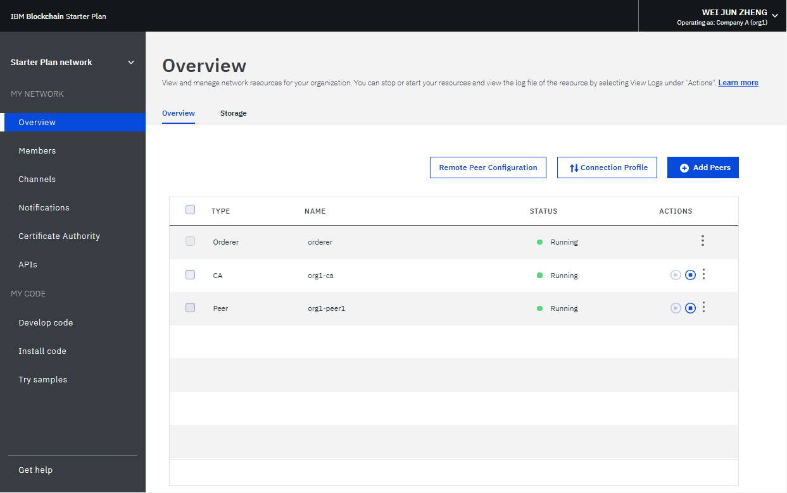

---

copyright:
  years: 2017, 2019
lastupdated: "2019-03-20"

subcollection: blockchain

---

{:new_window: target="_blank"}
{:shortdesc: .shortdesc}
{:screen: .screen}
{:codeblock: .codeblock}
{:note: .note}
{:important: .important}
{:tip: .tip}
{:pre: .pre}

# Einführung in {{site.data.keyword.blockchainfull_notm}} Platform for AWS
{: #remote-peer-aws}

Die Anweisungen in diesem Abschnitt beschreiben, wie Sie mit einer Schnelleinstiegsvorlage für Amazon Web Services (AWS) einen Peer von {{site.data.keyword.blockchainfull}}  Platform for AWS erstellen und anschließend mit einem  Netz unter {{site.data.keyword.blockchainfull_notm}} Platform verbinden können.
{:shortdesc}

Weitere Informationen zu AWS finden Sie im Dokument mit der [Übersicht über AWS-Services ](https://d1.awsstatic.com/whitepapers/aws-overview.pdf "Overview of AWS Services").

Mit {{site.data.keyword.blockchainfull_notm}} Platform for AWS können Peers das Verbindungsprofil, die Hyperledger Fabric-Zertifizierungsstellen und den Anordnungsservice eines vorhandenen Starter Plan- oder Enterprise Plan-Netzes in {{site.data.keyword.cloud_notm}} nutzen, um Transaktionen mithilfe einer AWS-Schnelleinstiegsvorlage zu verarbeiten. Der Schnelleinstieg ermöglicht Ihnen die Bereitstellung von Peers unter Verwendung von AWS CloudFormation-Vorlagen. Diese Vorlage ist für Entscheidungsträger und Systemadministratoren der IT-Infrastruktur geeignet, die von AWS gehostete und mit einem Starter Plan- oder Enterprise Plan-Netz verbundenen {{site.data.keyword.blockchainfull_notm}} Platform-Peers zeitnah konfigurieren, bereitstellen und ausführen wollen. Mithilfe der Vorlage können Sie eine neue virtuelle private Cloud (VPC) in AWS erstellen oder den Peer in einer vorhandenen VPC bereitstellen.

Der Schnelleinstieg konfiguriert Folgendes:
 * Hochverfügbarkeitsarchitektur, die sich auf zwei Verfügbarkeitszonen erstreckt.
 * Mit öffentlichen Teilnetzen gemäß den Best Practice für AWS konfigurierte VPC. Hierdurch erhalten Sie ein eigenes virtuelles Netz in AWS.
 * Internet-Gateway für den Zugriff auf das Internet.
 * Zwei Peers in zwei Verfügbarkeitszonen in den öffentlichen Teilnetzen (1 Peer pro Teilnetz).
 * Ein Peer-Container in jedem öffentlichen Teilnetz mit entweder einer integrierten LevelDB-Datenbank oder einem sekundären CouchDB-Container.

Lesen Sie vor der Bereitstellung von Peers von {{site.data.keyword.blockchainfull_notm}} Platform for AWS die [Hinweise zu Peers](/docs/services/blockchain/howto/remote_peer.html#remote-peer-aws-about-limitations).

## Voraussetzungen
{: #remote-peer-aws-prerequisites}

Zur Verwendung eines Peers von {{site.data.keyword.blockchainfull_notm}} Platform for AWS (nachfolgend kurz "ferner Peer" genannt) benötigen Sie eine Organisation, die Mitglied eines unter IBM Blockchain Platform gehosteten Blockchain-Netzes ist. Sie müssen den Network Monitor unter IBM Cloud verwenden, um auf die Netzberechtigungsnachweise und die API-Endpunkte Ihres Netzes zugreifen zu können. Wenn Sie nicht Mitglied eines Blockchain-Netzes sind, müssen Sie ein Netz erstellen oder einem Netz beitreten. Weitere Informationen hierzu finden Sie im Abschnitt [Netz erstellen](/docs/services/blockchain/get_start.html#getting-started-with-enterprise-plan-create-network) oder [Am Netz teilnehmen](/docs/services/blockchain/get_start.html#getting-started-with-enterprise-plan-join-nw).

Der standardmäßige VPC-Instanztyp für den Peer ist `m4.xlarge`.  Sie sollten den ausgewählten Instanztyp anhand Ihres CPU-, Hauptspeicher- und Speicherbedarfs optimieren. Für den Peer ist mindestens Folgendes erforderlich:  
-	2 CPUs
-	2 GB RAM
-	4 GB Speicherplatz für den Chaincode
-	10 GB Speicherplatz für das Ledger sowie Erweiterungsmöglichkeit bei einem ansteigenden Volumen des Ledgers

Diese Mindestressourcenwerte sind für Tests und Versuchsreihen ausreichend. Für eine Produktionsumgebung muss unbedingt eine ausreichende Speicherkapazität zugeordnet werden, beispielsweise 100 GB. Die verwendete Speicherkapazität richtet sich nach der Anzahl der Transaktionen und der Anzahl der Signaturen, die in Ihrem Netz benötigt werden. Falls Sie den Speicher auf Ihrem Peer überlasten, müssen Sie <!-- either expand the storage or --> einen neuen Peer mit einem größeren Dateisystem bereitstellen und über Ihre(n) anderen Peer(s) auf demselben Kanal bzw. denselben Kanälen synchronisieren lassen.


## Bereitstellungsoptionen
{: #remote-peer-aws-deploy-options}

Der Schnelleinstieg bietet zwei Bereitstellungsoptionen:

* Bereitstellung von {{site.data.keyword.blockchainfull_notm}} Platform for AWS in einer neuen VPC (End-to-End-Bereitstellung). Bei dieser Option wird eine neue AWS-Umgebung erstellt, die die VPC (virtuelle private Cloud), Teilnetze, NAT-Gateways, Sicherheitsgruppen, Bastionshosts und weitere Infrastrukturkomponenten umfasst, und der Peer anschließend in dieser neuen VPC bereitgestellt.

* Bereitstellung von {{site.data.keyword.blockchainfull_notm}} Platform for AWS in einer vorhandenen VPC. Diese Option stellt den Peer von {{site.data.keyword.blockchainfull_notm}} Platform for AWS in Ihrer bestehenden AWS-Infrastruktur bereit. Für beide Optionen gibt es separate Vorlagen, in denen Sie CIDR-Blöcke, Instanztypen und Peereinstellungen konfigurieren können; dies ist an einer späteren Stelle in diesem Handbuch beschrieben.

## Schritt 1: AWS-Konto vorbereiten
{: #remote-peer-aws-account}

1. Falls Sie noch kein AWS-Konto erstellen, erstellen Sie ein solches Konto [hier ](https://aws.amazon.com "https//aws/amazon.com"), indem Sie die in der Anzeige ausgegebenen Anweisungen befolgen.

2. Wählen Sie mit der Regionsauswahl in der Navigationsleiste die AWS-Region aus, in der der Peer in AWS bereitgestellt werden soll.

3. Erstellen Sie in Ihrer bevorzugten Region ein Schlüsselpaar.

4. Fordern Sie bei Bedarf eine Erhöhung der Servicebegrenzung für den Amazon EC2-Instanztyp <typ> an. Dieser Schritt ist möglicherweise erforderlich, wenn Sie bereits eine Bereitstellung verwenden, die diesen Instanztyp nutzt, und vermuten, dass Sie die Standardbegrenzung bei dieser Bereitstellung überschreiten könnten.

## Schritt 2: Konfigurationsinformationen des fernen Peers abrufen
{: #remote-peer-aws-network-endpoints}

Während der Konfiguration müssen Sie die API-Endpunkte Ihres Netzes für den Peer angeben. Diese Endpunkte erlauben einem Peer die Suche nach dem Netz unter  {{site.data.keyword.blockchainfull_notm}} Platform sowie die Herstellung einer Verbindung zu diesem Netz. Klicken Sie in der Anzeige **Übersicht** Ihres Network Monitor auf die Schaltfläche zur **Konfiguration ferner Peers**.


*Abbildung 1. Anzeige für die Konfiguration ferner Peers*

In einem daraufhin geöffneten Popup-Fenster werden die Werte der folgenden Felder angezeigt. Speichern Sie die Werte der folgenden Felder; Sie benötigen sie, wenn Sie den Peer mithilfe der AWS-Schnelleinstiegsvorlage konfigurieren.

- **MSP der Organisation**
- **Name der Zertifizierungsstelle (CA)**
- **URL der Zertifizierungsstelle (CA)**
- **Zertifikat der TLS-Zertifizierungsstelle­ (CA)**

Sie können jedes Feld kopieren und direkt in der Schnelleinstiegsvorlage einfügen oder die Felder als JSON-Datei speichern, indem Sie auf den Link **Download** klicken.

Die Schnelleinstiegsvorlage erwartet, dass das TLS-Zertifikat mit den Zeilenumbrüchen `\r\n` formatiert wird. Wenn Sie einen Browser mit Network Monitor auf einem `*NIX`-Betriebssystem verwenden, müssen Sie das Zertifikat, das Sie von der Benutzerschnittstelle kopieren, neu formatieren. Ersetzen Sie alle Vorkommen von `\n` global durch `\r\n`, und fügen Sie die resultierende Zeichenfolge in das Feld `Certificate Authority (CA) TLS Certificate Chain` ein.
{:important}

**Hinweis:** Falls Sie die Informationen in eine JSON-Datei herunterladen, müssen Sie das TLS-Zertifikat ins PEM-Format konvertieren, bevor Sie es für den Peer bereitstellen. Konvertieren Sie das **Zertifikat der TLS-Zertifizierungsstelle­ (CA)** in der heruntergeladenen JSON-Datei mit dem folgenden Befehl in das PEM-Format:
```
echo -e "<CERT>" > admin.pem
```
{:codeblock}

Ersetzen Sie `<CERT>` durch den Wert im Feld **Zertifikat der TLS-Zertifizierungsstelle­ (CA)**. Wenn Sie anschließend zur Angabe des **Zertifikats der TLS-Zertifizierungsstelle** in der Schnelleinstiegsvorlage aufgefordert werden, `schneiden` Sie die Datei "admin.pem" aus und kopieren Sie anschließend den Inhalt und fügen Sie ihn im Feld ein.  

## Schritt 3: Peer von {{site.data.keyword.blockchainfull_notm}} Platform for AWS registrieren
{: #remote-peer-aws-register-peer}

Sie müssen unter {{site.data.keyword.blockchainfull_notm}} Platform eine neue Peeridentität zum Netz hinzufügen, bevor der Peer von {{site.data.keyword.blockchainfull_notm}} Platform for AWS an dem Netz teilnehmen kann. Führen Sie die folgenden Schritte aus, um einen Peer zu registrieren.

**Hinweis:** Um eine Hochverfügbarkeit zu erreichen, erstellt die Schnelleinstiegsvorlage zwei Peerknoten in zwei Verfügbarkeitszonen. Daher werden zwei Eintragungs-IDs und zwei geheime Schlüssel benötigt. **Wiederholen Sie diesen Prozess zwei Mal, um zwei Eintragungs-IDs und zwei geheime Schlüssel zu generieren.**

1. Melden Sie sich beim Network Monitor Ihres Netzes unter {{site.data.keyword.blockchainfull_notm}} Platform an. In der Network Monitor-Anzeige "Zertifizierungsstelle" können Sie alle Identitäten anzeigen, die für Ihr Netz registriert wurden. Hierzu gehören der Administrator und die Clientanwendungen.
  
  *Abbildung 2. CA-Anzeige*

2. Klicken Sie in der Anzeige auf die Schaltfläche **Benutzer hinzufügen**. Daraufhin wird ein Dialogfenster geöffnet, in dem Sie Ihren Peer für das Netz registrieren können, nachdem Sie die folgenden Felder ausgefüllt haben. **Speichern Sie die Werte für die ID und den geheimen Schlüssel, die Sie später zum Konfigurieren Ihres Peers in der Schnelleinstiegsvorlage benötigen.**
  - **Eintragungs-ID**: Der Namen, den Sie für Ihren Peer verwenden wollen und der bei der Konfiguration des Peers als `Eintragungs-ID` bezeichnet wird. **Speichern Sie diesen Wert** für die weitere Verwendung.
  - **Geheimer Eintragungsschlüssel**: Das Kennwort, das Sie für Ihren  Peer verwenden wollen und das bei der Konfiguration des Peers als `geheimer Eintragungsschlüssel` bezeichnet wird. **Speichern Sie diesen Wert** für die weitere Verwendung.
  - **Typ:** Wählen Sie für dieses Feld den Wert `peer` aus.
  - **Zugehörigkeit:** Dies ist die Zugehörigkeit in Ihrer Organisation (z. B. `org1`), zu der Ihr Peer gehört. Sie können eine neue Zugehörigkeit angeben oder eine vorhandene Zugehörigkeit verwenden.
  - **Maximale Anzahl der Eintragungen:** In diesem Feld können Sie die Anzahl der Wiederholungen für die Eintragung oder die Generierung von Zertifikaten mit einer bestimmten Identität einschränken. Erfolgt hier keine Angabe, dann wird der Standardwert (Unbegrenzte Eintragungen) verwendet.

  Nachdem Sie die Felder ausgefüllt haben, klicken Sie auf **Abschicken**, um den Peer zu registrieren. Der registrierte Peer wird dann in der Tabelle als Identität in Ihrem Netz aufgelistet. Stellen Sie als Sicherheitsmaßnahme mit jeder Identität und den zugehörigen Werten für "enrollID" und "secret" nur einen einzigen Peer bereit. Verwenden Sie IDs und Kennwörter von Peers nicht erneut.

## Schritt 4: Schnelleinstieg starten
{: #remote-peer-aws-launchqs}

Die Kosten der AWS-Services, die Sie bei der Ausführung dieser Referenzbereitstellung durch den Schnelleinstieg verwenden, sind von Ihnen zu tragen. Für die Verwendung dieses Schnelleinstiegs fallen keine zusätzlichen Kosten an. Vollständige Details können Sie den Preisgestaltungsseiten für die einzelnen AWS-Services entnehmen, die Sie bei diesem Schnelleinstieg verwenden. Preisänderungen bleiben vorbehalten.

1. Wählen Sie eine der folgenden Optionen aus, um die AWS CloudFormation-Vorlage in Ihrem AWS-Konto zu starten. Hilfe bei der Auswahl einer Option bieten Ihnen die Abschnitte, in denen die Bereitstellungsoptionen bereits in diesem Handbuch beschrieben worden sind. Für jede Bereitstellung benötigen Sie ungefähr 10 Minuten.  

  * [{{site.data.keyword.blockchainfull_notm}} Platform for AWS in neuer VPC unter AWS bereitstellen ](https://fwd.aws/v43nk " {{site.data.keyword.blockchainfull_notm}} Platform for AWS in neuer VPC unter AWS bereitstellen")  

  * [{{site.data.keyword.blockchainfull_notm}} Platform for AWS in vorhandener VPC unter AWS bereitstellen ](https://fwd.aws/zrP4g " {{site.data.keyword.blockchainfull_notm}} Platform for AWS in vorhandener VPC unter AWS bereitstellen")

  **Wichtig:**     
  Falls Sie {{site.data.keyword.blockchainfull_notm}} Platform for AWS in einer vorhandenen VPC bereitstellen, müssen Sie darauf achten, dass die VPC für die  Datenbankinstanzen zwei öffentliche Teilnetze in unterschiedlichen Verfügbarkeitszonen besitzt. Diese Teilnetze erfordern NAT-Gateways oder NAT-Instanzen in ihren Routentabellen, damit die Instanzen Pakete und Software herunterladen können, ohne sie für das Internet zugänglich zu machen. Außerdem benötigen Sie die in den DHCP-Optionen konfigurierte Option für den Domänennamen (eine entsprechende Erläuterung enthält die Amazon-Dokumentation für die VPC).  

  Denken Sie ebenfalls daran, eine Sicherheitsgruppe zu erstellen, die an Ihre vorhandene VPC gebunden ist, und Regeln für eingehende Daten an den Ports 22 und 7051 zu dieser Sicherheitsgruppe hinzuzufügen. TCP-Verbindungen an Port 22 lassen den SSH-Zugriff auf die generierte Instanz zu, während TCP-Verbindungen an Port 7051 einen externen gRPC-Zugriff auf die Peerinstanz ermöglichen (dieser Zugriff wird für den Betrieb des Peers mithlife der CLI für die Fabric-Tools und der Fabric-SDKs benötigt). Diese VCP-Einstellungen werden von Ihnen angefordert, wenn Sie den Schnelleinstieg starten.

2. Überprüfen Sie die in der rechten oberen Ecke der Navigationsleiste angezeigte Region und ändern Sie sie bei Bedarf. In dieser Region wird die Netzinfrastruktur für den Peer erstellt. Standardmäßig wird die Vorlage in der Region "US East (Ohio)" gestartet.

3. Behalten Sie auf der Seite "Vorlage auswählen" die Standardeinstellung für die Vorlagen-URL bei und wählen Sie `Weiter` aus.

4. Ändern Sie auf der Seite "Details angeben" bei Bedarf den Stacknamen. Überprüfen Sie die Parameter für die Vorlage. Geben Sie Werte für die Parameter an, die eine Eingabe erfordern. Überprüfen Sie bei allen anderen Parametern die Standardeinstellungen und passen Sie sie bei Bedarf an. Wenn Sie mit der Überprüfung und Anpassung der Parameter fertig sind, wählen Sie `Weiter` aus.

In den folgenden Tabellen sind die Parameter nach Kategorien sortiert aufgelistet und für die beiden Bereitstellungsoptionen separat beschrieben:

  * [Parameter für die Bereitstellung von {{site.data.keyword.blockchainfull_notm}} Platform for AWS in neuer VPC](/docs/services/blockchain/howto/remote_peer_aws.html#remote-peer-aws-parameters-newvpc)

  * [Parameter für die Bereitstellung von {{site.data.keyword.blockchainfull_notm}} Platform for AWS in vorhandener VPC](/docs/services/blockchain/howto/remote_peer_aws.html#remote-peer-aws-parameters-existvpc)

### Parameter für die Bereitstellung von {{site.data.keyword.blockchainfull_notm}} Platform for AWS in neuer VPC
{: #remote-peer-aws-parameters-newvpc}

In der folgenden Tabelle sind die konfigurierbaren Parameter des AWS-Diagramms und die zugehörigen Standardwerte aufgelistet. Alle Werte sind erforderlich.

|  Parameter    | Beschreibung | Standardwert |
| --------------|-------------|---------|
| `Stackname` |Der Stackname ist eine ID, mit der Sie einen bestimmten Stack in einer Liste von Stacks ermitteln können. Ein Stackname darf nur alphanumerische Zeichen und Bindestriche enthalten; die Groß-/Kleinschreibung muss beachtet werden. Er muss mit einem Buchstaben beginnen und darf nicht länger als 128 Zeichen sein.| |
| | | |
| **Netzkonfiguration** | |
| `Verfügbarkeitszonen` |Die beiden Verfügbarkeitszonen, die für die Teilnetze in der VPC verwendet werden sollen. Hinweis: Die logische Reihenfolge wird beibehalten. | |
| `Zulässiger CIDR für SSH-Zugriff` | Der zulässige [CIDR-Block ](https://docs.aws.amazon.com/vpc/latest/userguide/VPC_Subnets.html#vpc-resize "VPCs und Teilnetze") für den externen SSH-Zugriff auf Peerinstanzen von IBM Blockchain. Als Wert kann 0.0.0.0/0 angegeben werden, um den Zugriff von jedem beliebigen Standort aus zuzulassen (dies wird allerdings nicht empfohlen). | |
| `CIDR für Peerendpungzugriff` | Der zulässige [CIDR-Block ](https://docs.aws.amazon.com/vpc/latest/userguide/VPC_Subnets.html#vpc-resize "VPCs und Teilnetze") für den externen gRPC-Zugriff auf die Peerinstanzen von IBM Blockchain. Als Wert ist normalerweise 0.0.0.0/0 angegeben, um den Zugriff von jedem beliebigen Standort aus zuzulassen (dies wird allerdings nicht empfohlen). | |
| | | |
| **Amazon EC2-Konfiguration** | | |
| `Instanztyp` | Der Typ der EC2-Instanz für die Peerinstanzen. | m4.xlarge |
| `Name des Schlüsselpaars` | Der Name eines vorhandenen EC2-Schlüsselpaars in der AWS-Region. Dieses Schlüsselpaar muss von Ihnen generiert werden. | |
| | | |
|**IBM Blockchain-Konfiguration** | |
| `IBM Blockchain-Version` | Die Version von IBM Blockchain, die bereitgestellt werden soll. | 1.2.1 |
| `Statusdatenbank` | Der Typ der Datenbank, die zum Speichern des Blockchainstatus verwendet wird. Diese Auswahl sollte mit dem Typ der Statusdatenbank identisch sein, die für das übrige Netz verwendet wird. | CouchDB|
| `Datenträgergröße für Peer` | Die Größe des EBS-Datenträgers in GB, auf dem persistente Daten (Ledger, Statusdatenbank, MSP) für die Peers gespeichert werden. | 100 |
| `Eintragungs-ID für Peer 1`| Die Eintragungs-ID, die Sie für Ihren ersten Peer in der Anzeige "Zertifizierungsstelle" der Benutzerschnittstelle von IBM Blockchain Platform eingegeben haben. |  |
| `Geheimer Eintragungsschlüssel für Peer 1` | Der geheime Eintragungsschlüssel, den die Sie für Ihren ersten Peer in der Anzeige "Zertifizierungsstelle" der Benutzerschnittstelle von IBM Blockchain Platform eingegeben haben. | |
| `Eintragungs-ID für Peer 2` | Die Eintragungs-ID, die Sie für Ihren zweiten Peer in der Anzeige "Zertifizierungsstelle" der Benutzerschnittstelle von IBM Blockchain Platform eingegeben haben. | |
| `Geheimer Eintragungsschlüssel für Peer 2` | Der geheime Eintragungsschlüssel, den die Sie für Ihren zweiten Peer in der Anzeige "Zertifizierungsstelle" der Benutzerschnittstelle von IBM Blockchain Platform eingegeben haben. | |
| | | |
|**Serviceberechtigungsnachweise für IBM Blockchain**| | |
| `MSP der Organisation` | Diesen Wert finden Sie in der Benutzerschnittstelle von IBM Blockchain Platform. Klicken Sie auf die Schaltfläche "Konfiguration ferner Peers" in der Anzeige "Übersicht", kopieren Sie die Informationen und fügen Sie sie hier ein. | |
| `Name der Zertifizierungsstelle (CA)` | Diesen Wert finden Sie in der Benutzerschnittstelle von IBM Blockchain Platform. Klicken Sie auf die Schaltfläche "Konfiguration ferner Peers" in der Anzeige "Übersicht", kopieren Sie die Informationen und fügen Sie sie hier ein.| |
| `URL der Zertifizierungsstelle (CA)` | Diesen Wert finden Sie in der Benutzerschnittstelle von IBM Blockchain Platform. Klicken Sie auf die Schaltfläche "Konfiguration ferner Peers" in der Anzeige "Übersicht", kopieren Sie die Informationen (inklusive Port) und fügen Sie sie hier ein. Falls kein Port angegeben ist, wird als Standardport Port 443 verwendet. | |
| `Zertifikat der TLS-Zertifizierungsstelle­ (CA)`| Diesen Wert finden Sie in der Benutzerschnittstelle von IBM Blockchain Platform. Klicken Sie auf die Schaltfläche "Konfiguration ferner Peers" in der Anzeige "Übersicht", kopieren Sie die Informationen und fügen Sie sie hier ein.| |
| | | |
|**Weitere Parameter**| | |
| `QSS3BucketName` | Der S3-Bucketname für die Schnelleinstiegsassets. Der Bucketname für den Schnelleinstieg kann Zahlen, Kleinbuchstaben, Großbuchstaben und Bindestriche (-) enthalten. Er darf nicht mit einem Bindestrich (-) beginnen oder enden. | `aws-quickstart` |
| `QSS3KeyPrefix` | Das S3-Schlüsselpräfix für die Schnelleinstiegsassets. Das Schlüsselpräfix für den Schnelleinstieg kann Zahlen, Kleinbuchstaben, Großbuchstaben, Bindestriche (-) und Schrägstriche (/) enthalten. | `quickstart-ibm-fabric/` |

1. Auf der Seite "Optionen" können Sie Tags (Schlüssel/Wert-Paare) für Ressourcen in Ihrem Stack angeben und erweiterte Optionen festlegen. Wählen Sie "Weiter" aus, wenn Sie dies durchgeführt haben.

2. Überprüfen und bestätigen Sie die Vorlageneinstellungen auf der Seite "Überprüfung". Wählen Sie unter "Funktionalität" das Kontrollkästchen aus, um zu bestätigen, dass die Vorlage IAM-Ressourcen erstellt.

3. Wählen Sie "Erstellen" aus, um den Stack bereitzustellen.

4. Überwachen Sie den Status des Stacks. Sobald der Status aller Stacks mit `CREATE_COMPLETE` angegeben ist, ist der Peer-Cluster bereit. Nach einem erfolgreichen Abschluss sollte ein Stammstack mit vier verschachtelten Stacks verfügbar sein, falls CouchDB ausgewählt wurde, bzw. mit zwei verschachtelten Stacks, falls Sie levelDB ausgewählt haben.

5. Verwenden Sie die auf der Registerkarte "Ausgaben" für den Stack angezeigten Informationen, um die erstellten Ressourcen anzuzeigen.


### Parameter für die Bereitstellung eines Peers von {{site.data.keyword.blockchainfull_notm}} Platform Peer AWS in vorhandener VPC
{: #remote-peer-aws-parameters-existvpc}

Falls Sie den Peer von {{site.data.keyword.blockchainfull_notm}} Platform for AWS in einer vorhandenen VPC bereitstellen, sollten Sie die folgenden Hinweise beachten:

 - Stellen Sie sicher, dass Ihre VPC für die Datenbankinstanzen zwei private Teilnetze in unterschiedlichen Verfügbarkeitszonen besitzt. Diese Teilnetze erfordern NAT-Gateways oder NAT-Instanzen in ihren Routentabellen, damit die Instanzen Pakete und Software herunterladen können, ohne sie für das Internet zugänglich zu machen.

 - Konfigurieren Sie die Option für den Domänennamen in den DHCP-Optionen gemäß der Erläuterung in der [Amazon-Dokumentation für die VPC ](https://docs.aws.amazon.com/AmazonVPC/latest/UserGuide/VPC_DHCP_Options.html "DHCP-Optionsgruppen").  

- Erstellen Sie Sicherheitsgruppe, die an Ihre vorhandene VPC gebunden ist, und fügen Sie Regeln für eingehende Daten an den Ports 22 und 7051 zu dieser Sicherheitsgruppe hinzu. TCP-Verbindungen an Port 22 lassen den SSH-Zugriff auf die generierte Instanz zu, während TCP-Verbindungen an Port 7051 einen externen gRPC-Zugriff auf die Peerinstanz ermöglichen (dieser Zugriff wird für den Betrieb des Peers mithlife der CLI für die Fabric-Tools und der Fabric-SDKs benötigt). Diese VCP-Einstellungen werden von Ihnen angefordert, wenn Sie den Schnelleinstieg starten.

 Bei der Bereitstellung eines Peers von {{site.data.keyword.blockchainfull_notm}} Platform for AWS in einer vorhandenen VPC ersetzen die folgenden Parameter die Parameter in den entsprechenden [obigen](/docs/services/blockchain/howto/remote_peer_aws.html#remote-peer-aws-parameters-newvpc) Abschnitten:

|  Parameter    | Beschreibung | Standardwert |
| --------------|-------------|---------|
| **Netzkonfiguration** | | |
| `VPCID` |	Die ID der vorhandenen VPC für die Bereitstellung.| |
| `Verfügbarkeitszone 1` | Die Verfügbarkeitszone, in der der erste Peerknoten bereitgestellt werden soll. | |
| `Teilnetz-ID 1` |	Die ID des Teilnetzes, das für den ersten Peerknoten verwendet werden soll. Das Teilnetz sollte zur ausgewählten VPC gehören. Um die zur VPC gehörenden Teilnetze zu ermitteln, überprüfen Sie Ihr AWS-VPC-Dashboard und wählen Sie das Menü "Teilnetze" aus.| |
| `Verfügbarkeitszone 2` | Die Verfügbarkeitszone, in der der zweite Peerknoten bereitgestellt werden soll. | |
| `Teilnetz-ID 2` |	Die ID des Teilnetzes, das für den zweiten Peerknoten verwendet werden soll. Das Teilnetz sollte zur ausgewählten VPC gehören. Um die zur VPC gehörenden Teilnetze zu ermitteln, überprüfen Sie Ihr AWS-VPC-Dashboard und wählen Sie das Menü "Teilnetze" aus. | |
| | | |
| **Amazon EC2-Konfiguration**| | |
| `Instanztyp` 	| Der Typ der EC2-Instanz für die Peerinstanzen. 	| m4.xlarge |
| `Name des Schlüsselpaars` |	Der Name eines vorhandenen EC2-Schlüsselpaars in der AWS-Region. Dieses Schlüsselpaar muss von Ihnen generiert werden. | |
| `Sicherheitsgruppe` | Die ID einer vorhandenen Sicherheitsgruppe in der AWS-Region. Sie sollten eingehende TCP-Verbindungen an den Ports 22 und 7051 zulassen. |	| |

## Schritt 5: Bereitstellung testen
{: #remote-peer-aws-test}

Nachdem die AWS CloudFormation-Vorlage den Stack erfolgreich erstellt hat, werden in Ihrem AWS-Konto zwei Peerinstanzen von {{site.data.keyword.blockchainfull_notm}} Platform for AWS ausgeführt. Die Namen der Instanzen basieren auf der Kombination der Werte für den `MSP der Organisation` und der `Eintragungs-ID für den Peer`, die in der Schnelleinstiegsvorlage angegeben wurden. Beispiel: `org1-remotepeer1`.  

  
*Abbildung 3. Peer in AWS-EC2-Instanzen*

So prüfen Sie, ob der Peer aktiv ist:

  * Stellen Sie eine SSH-Verbindung zur neu erstellten VPC her, indem Sie die Instanz in der AWS-Konsole auswählen (klicken Sie hierzu auf **Services > EC2 > Instanzen**) und anschließend auf die Schaltfläche **Verbinden** klicken. Befolgen Sie die Anweisungen in AWS, um den Befehl `ssh` auszugeben.  
  * Führen Sie in der Befehlszeile den Befehl `docker ps` aus, um die aktiven Container anzuzeigen. Jede virtuelle Maschine enthält einen Peer-Container und einen ECS-Agenten. Falls Sie CouchDB als Ledgerdatenbank ausgewählt haben, gibt es außerdem einen CouchDB-Container.

  ```
  CONTAINER ID        IMAGE                                STATUS              PORTS                          NAMES
  fb3c49fe52fe        amazon/amazon-ecs-agent:latest       Created                                            ecs-agent
  667780cf3cd3        ibmblockchain/fabric-peer:1.2.1      Up                  0.0.0.0:7051->7051/tcp         peer
  2aa143c81027        ibmblockchain/fabric-couchdb:0.4.6   Up                  4369/tcp, 5984/tcp, 9100/tcp   couchdb
  ```

  * Innerhalb des Peer-Containers können Sie eine Shellsitzung erstellen, indem Sie den Befehl `docker exec -it peer sh` ausführen.

Um zu prüfen, ob die Peerverbindung zu Ihrem {{site.data.keyword.blockchainfull_notm}} Platform-Netz funktioniert, können Sie optional innerhalb des Peer-Containers den CLI-Befehl `peer channel fetch` ausführen. Andernfalls können Sie die Anweisungen im Abschnitt für den [Betrieb Ihres Peers](/docs/services/blockchain/howto/remote_peer_operate_aws.html#remote-peer-aws-operate) überspringen.  

Führen Sie den CLI-Befehl `peer channel fetch` aus, um den Genesis-Block aus dem Kanal abzurufen:

1. Rufen Sie die Konfigurationsinformationen aus Ihrem `Verbindungsprofil` ab, das in der Network Monitor-Anzeige "Übersicht" verfügbar ist. Klicken Sie auf **Verbindungsprofil** und dann auf **Download**.

   - Suchen Sie die URL des Anordnungsknotens, indem Sie nach **orderers** suchen. Das Element befindet sich unter `orderers > url`. Notieren Sie die URL, die mit dem Netznamen beginnt. Daraufhin wird die URL wie im folgenden Beispiel angezeigt:

   ```
   ash-zbc07b.4.secure.blockchain.ibm.com:21239
   ```

   - Suchen Sie den Namen Ihrer Organisation, indem Sie bei der Suche **organizations** angeben. Hierbei sollte es sich um dieselbe Organisation handeln, die Sie zum Registrieren Ihres Peers verwenden. Der Name Ihrer Organisation wird mit dem zugehörigen Wert für `mspid` angezeigt. Dieser Wert ist ebenfalls in der Network Monitor-Anzeige "Übersicht" verfügbar. Klicken Sie auf die Schaltfläche **Konfiguration ferner Peers**. Der Wert wird unter `MSP der Organisation` angezeigt. Notieren Sie den Wert für `mspid`.

   - Erstellen Sie, sofern noch nicht geschehen, eine Shellsitzung innerhalb des Peer-Containers, indem Sie den Befehl `docker exec -it peer sh` ausführen.

   ```
   docker exec -it peer sh
   ```
   {:codeblock}

   - Kopieren Sie das TLS-Zertifikat des Anordnungsknotens aus dem Verbindungsprofil in den Peer. Navigieren Sie zum Abschnitt **orderers**. Kopieren Sie das Zertifikat, das auf "pem:" folgt; es beginnt mit -----BEGIN CERTIFICATE----- und endet mit -----END CERTIFICATE-----. Beziehen Sie nicht die Anführungszeichen ein. Führen Sie den folgenden Befehl über die Befehlszeile aus und ersetzen Sie hierbei `<orderer cert>` durch den Inhalt, den Sie aus der Datei "creds.json" kopiert haben.

   ```
   echo -e "<orderer cert>" > /etc/hyperledger/<PEER_ENROLL_ID>/orderer_tlscacert.pem
   ```
   {:codeblock}

   Ersetzen Sie `<PEER_ENROLL_ID>` durch die Eintragungs-ID, die in der Schnelleinstiegsvorlage angegeben wurde und dieser Peerinstanz zugeordnet ist.

2. Ihre Organisation muss zu einem Kanal im Netz hinzugefügt werden, bevor Sie den Genesis-Block abrufen können.

  - Sie können einen neuen Kanal für den Peer starten. Als Kanalinitiator können Sie Ihre Organisation während der [Kanalerstellung](/docs/services/blockchain/howto/create_channel.html#ibp-create-channel-creating-a-channel) automatisch einbinden.

  - Ein anderes Mitglied des Blockchain-Netzes kann Ihre Organisation ebenfalls zu einem vorhandenen Kanal hinzufügen, indem es eine [Kanalaktualisierung](/docs/services/blockchain/howto/create_channel.html#ibp-create-channel-updating-a-channel) durchführt.

  - Nachdem Ihre Organisation zu einem Kanal hinzugefügt wurde, müssen Sie das Signierzertifikat Ihres Peers zu dem Kanal hinzufügen. Der Peer lädt sein Signierzertifikat während der Installation hoch, sodass Sie das Zertifikat lediglich mit dem Kanal synchronisieren müssen. Suchen Sie in der Anzeige "Kanäle" des Network Monitor nach dem Kanal, dem Ihre Organisation beigetreten ist, und wählen Sie in der Dropdown-Liste unter der Überschrift **Aktion** die Option **Zertifikat synchronisieren** aus. Durch diese Aktion werden die Zertifikate für alle Peers auf dem Kanal synchronisiert.

3. Führen Sie die folgenden Befehle aus, um die Umgebungsvariablen im Peer-Container festzulegen.

   ```
   export ORDERER_1=<ORDERER_URL>
   export CHANNEL=<CHANNEL_NAME>
   export ORGID=<ORGANIZATION_MSP_ID>
   export PEERADDR=<PEER_ADDR>
   ```
   {:codeblock}

   Ersetzen Sie die Feldinhalte durch Ihre eigenen Angaben.
     - Ersetzen Sie `<ORDERER_URL>` durch den Hostnamen und den Port des Anordnungsknotens aus der Datei `creds.json`.
     - Ersetzen Sie `<CHANNEL_NAME>` durch den Namen des Kanals, dem der Peer beitreten soll.
     - Ersetzen Sie `<ORGANIZATION_MSP_ID>` durch den Namen der Organisation aus der Datei `creds.json`.
     - Ersetzen Sie `<PEER_ADDR>` durch `localhost:7051`

   Beispiel:

   ```
   export ORDERER_1=ash-zbc07b.4.secure.blockchain.ibm.com:21239
   export CHANNEL=defaultchannel
   export ORGID=PeerOrg1
   export PEERADDR=localhost:7051
   ```

4. Führen Sie den folgenden Befehl der CLI "peer" aus, um den Genesis-Block des Kanals abzurufen.

   **WICHTIG:** Ersetzen Sie im folgenden Befehl jedes Vorkommen von `<PEER_ENROLL_ID>` durch die  Eintragungs-ID, die dieser Peerinstanz zugeordnet ist und in der Schnelleinstiegsvorlage angegeben wurde. Diesen Wert können Sie durch Ausführung des Befehls `ls /etc/hyperledger/` ermitteln. Es werden zwei Ordner aufgelistet: Der erste ist `fabric`, der zweite ist Ihr Wert für `<PEER_ENROLL_ID>`.

   ```
   CORE_PEER_TLS_ROOTCERT_FILE=/etc/hyperledger/<PEER_ENROLL_ID>/tls/ca.crt CORE_PEER_TLS_ENABLED=true CORE_PEER_ADDRESS=${PEERADDR} CORE_PEER_LOCALMSPID=${ORGID} CORE_PEER_MSPCONFIGPATH=/etc/hyperledger/<PEER_ENROLL_ID>/msp/ GOPATH=/ peer channel fetch 0 -o ${ORDERER_1} -c ${CHANNEL} --cafile /etc/hyperledger/<PEER_ENROLL_ID>/orderer_tlscacert.pem --tls
   ```
   {:codeblock}


   **Hinweis:** Möglicherweise werden Sie bei der Ausführung eines dieser CLI-Befehle feststellen, dass die folgende Warnung angezeigt wird, die jedoch ignoriert werden kann.

   ```
   [msp] getPemMaterialFromDir -> WARN 001 Failed reading file
   /etc/hyperledger/<PEER_ENROLL_ID>/msp/intermediatecerts/<intermediate cert name>.pem: no pem content for file  /etc/hyperledger/<PEER_ENROLL_ID>/msp/intermediatecerts/<intermediate cert name>.pem
   ```

   Überprüfen Sie, ob der Befehl erfolgreich ausgeführt wurde und ob der Genesis-Block zum Peer-Container hinzugefügt wurde, indem Sie den folgenden Befehl ausführen:

   ```
   ls *.block
   ```
   {:codeblock}

   Sie wissen, dass der Genesis-Block erfolgreich hinzugefügt wurde, wenn Sie die im folgenden Beispiel dargestellte Ausgabe erhalten:

   ```
   defaultchannel_0.block
   ```

   Glückwunsch! Ihr Peer von {{site.data.keyword.blockchainfull_notm}} Platform for AWS ist hiermit erfolgreich mit Ihrem {{site.data.keyword.blockchainfull_notm}} Platform-Netz verbunden worden.

## Häufig gestellte Fragen
{: #remote-peer-aws-faq}

* **Frage**: Beim Starten des Schnelleinstiegs wurde ein Fehler CREATE_FAILED ausgegeben.
* **Antwort**: Falls die AWS CloudFormation-Vorlage den Stack nicht erstellen konnte, wird empfohlen, die Vorlage mit dem Wert `Nein` für das Durchführen einer Rollback-Operation nach einem Fehler erneut zu starten. (Diese Einstellung befindet sich auf der Seite "Optionen" der AWS CloudFormation-Konsole.) Wenn diese Einstellung ausgewählt ist, wird der Status des Stacks beibehalten und die Instanz bleibt aktiv, sodass Sie den Fehler beheben können. (Ziehen Sie die Protokolldateien an den Positionen `%ProgramFiles%\Amazon\EC2ConfigService` und `C:\cfn\log` hinzu.)

  - Bei Verwendung der Einstellung `Nein` für die Durchführung einer Rollback-Operation bei einem Fehler fallen für diesen Stack weiterhin AWS-Gebühren an. Denken Sie unbedingt daran, den Stack zu löschen, wenn Sie die Fehlerbehebung abgeschlossen haben. Weitere Informationen finden Sie auf der AWS-Website unter [AWS CloudFormation-Fehlerbehebung ](https://docs.aws.amazon.com/AWSCloudFormation/latest/UserGuide/troubleshooting.html "AWS CloudFormation-Fehlerbehebung").

* **Frage**: Beim Bereitstellen der AWS CloudFormation-Vorlagen wurde ein Fehler in Bezug auf die Größenbegrenzung ausgegeben.
* **Antwort**: Es wird empfohlen, die Schnelleinstiegsvorlagen ausgehend von der Position zu starten, die in der Dokumentation angegeben ist, oder von einem anderen S3-Bucket aus. Falls Sie die Vorlagen aus einer lokalen Kopie auf Ihrem Computer oder aus einer Position bereitstellen, bei der es sich nicht um eine S3-Position handelt, treten beim Erstellen des Stacks möglicherweise Einschränkungen für die Vorlagengröße auf. Weitere Informationen zu Begrenzungen für AWS CloudFormation finden Sie in der [AWS-Dokumentation ](http://docs.aws.amazon.com/AWSCloudFormation/latest/UserGuide/cloudformation-limits.html "Limits für AWS CloudFormation").

## Nächste Schritte
{: #remote-peer-aws-whats-next}

Nachdem Sie nun den Peer in AWS eingerichtet haben, können Sie verschiedene operative Schritte ausführen, bevor Sie Transaktionen an das Blockchain-Netz übergeben und das verteilte Ledger aus dem Blockchain-Netz lesen können. Weitere Informationen hierzu finden Sie im Abschnitt [Peers in AWS betreiben](/docs/services/blockchain/howto/remote_peer_operate_aws.html#remote-peer-aws-operate).

## Hochverfügbarkeit
{: #remote-peer-aws-high-availability}

Zur Unterstützung der Hochverfügbarkeit stellt die Schnelleinstiegsvorlage standardmäßig zwei Instanzen des Peers in zwei verschiedenen Verfügbarkeitszonen bereit.
Zur Nutzung dieser Unterstützung für die Hochverfügbarkeit müssen Sie auch Ihre [Clientanwendungen für die Hochverfügbarkeit](/docs/services/blockchain/best_practices.html#best-practices-app-ha-app) konfigurieren.

## Hinweise zur Sicherheit
{: #remote-peer-aws-security}

Die AWS-Cloud bietet eine skalierbare und zuverlässige Plattform, die Kunden bei der schnellen und sicheren Bereitstellung von Anwendungen und Daten hilft. Wenn Sie Systeme basierend auf der AWS-Infrastruktur erstellen, werden die Zuständigkeiten für die Sicherheit zwischen Ihnen und AWS aufgeteilt. Dieses gemeinsame Modell kann Ihren Betriebsaufwand verringern, da AWS die Komponenten vom Hostbetriebssystem und der Virtualisierungsebene bis hin zur physischen Sicherheit der Anlagen und Einrichtungen, in denen die Services betrieben werden, betreibt, verwaltet und steuert. Sie selbst hingegen übernehmen die Verantwortung und das Management des Gastbetriebssystems (inklusive Updates und Sicherheitspatches), anderer zugehöriger Anwendungen sowie die Konfiguration der von AWS bereitgestellten Firewall für Sicherheitsgruppen. Weitere Informationen zur Sicherheit in AWS finden Sie unter [AWS Cloud Sicherheit ](https://aws.amazon.com/security/ "AWS Cloud Sicherheit").

### Identitäts- und Zugriffsmanagement bei AWS
{: #remote-peer-aws-iam}

Diese Lösung nutzt eine Rolle für das Identitäts- und Zugriffsmanagement (Identity and Access Management, IAM), die mindestens einen privilegierten Zugriff besitzt. Es ist weder erforderlich noch empfehlenswert, SSH-Schlüssel, geheime Schlüssel oder Zugriffsschlüssel für die eingerichteten Instanzen zu speichern.

### Betriebssystemsicherheit
{: #remote-peer-aws-ossecurity}

Auf den Rootbenutzer von Clusterknoten kann ausschließlich mithilfe des SSH-Schlüssels zugegriffen werden, der während des Bereitstellungsprozesses angegeben wird. Diese SSH-Schlüssel werden von AWS nicht gespeichert, sodass Sie beim Verlust Ihrer SSH-Schlüssel den Zugriff auf diese Instanzen verlieren können. Programmkorrekturen für das Betriebssystem liegen in Ihrem Zuständigkeitsbereich und sollten regelmäßig durchgeführt werden.

### Sicherheitsgruppen
{: #remote-peer-aws-securitygroups}

Eine Sicherheitsgruppe fungiert als Firewall, die den Datenverkehr für eine oder mehrere Instanzen steuert. Wenn Sie eine Instanz starten, ordnen Sie die Instanz einer oder mehreren Sicherheitsgruppen zu. Zu jeder Sicherheitsgruppe fügen Sie Regeln hinzu, die Datenverkehr an die oder von den zugehörigen Instanzen zulassen. Die Regeln für eine Sicherheitsgruppe können Sie jederzeit ändern. Neue Regeln werden automatisch auf alle Instanzen angewendet, die zur Sicherheitsgruppe gehören. Die Sicherheitsgruppen, die den einzelnen Instanzen als Teil dieser Lösung erstellt und zugewiesen werden, sind so weit wie möglich eingeschränkt, lassen aber den Zugriff auf die verschiedenen, vom Peer benötigten Funktionen zu. Es empfiehlt sich, die Sicherheitsgruppen zu überprüfen, um den Zugriff nach Bedarf weiter einzuschränken, sobald der Cluster betriebsbereit ist.

### Peersicherheit
{: #remote-peer-aws-peer-security}

Die Peers werden außerhalb von {{site.data.keyword.blockchainfull_notm}} Platform bereitgestellt. Aus diesem Grund sind Sie für das Management der Sicherheit der Peers verantwortlich. Dies umfasst wichtige Bereiche der Sicherheit, die von Enterprise Plan-Netzen bereitgestellt werden, z. B. das Schlüsselmanagement und die Datenverschlüsselung. Machen Sie sich mit den folgenden Themen vertraut, wenn Sie sich mit der Sicherheit für Ihre Peers befassen.

#### Datensicherheit
{: #remote-peer-aws-security-data}

{{site.data.keyword.blockchainfull_notm}} Platform Enterprise Plan verwendet die Verschlüsselung ganzer Platten, die auf einer [symmetrischen Schlüsselverschlüsselung ](https://www.ibm.com/support/knowledgecenter/en/SSB23S_1.1.0.14/gtps7/s7symm.html "Symmetrische Verschlüsselung") basiert, um alle Daten zu schützen, die im Netz verwendet werden. In Ihrer eigenen Umgebung müssen Sie zum Schutz Ihrer Peerdaten ähnliche Schritte unternehmen.

Die Daten in Ihrer Statusdatenbank werden nicht verschlüsselt; hierbei ist es ohne Belang, ob Sie levelDB oder couchDB verwenden. Mithilfe der Verschlüsselung auf Anwendungsebene können Sie ruhende Daten in Ihrer Statusdatenbank schützen.

#### Datenspeicherort
{: #remote-peer-aws-data-residency}

Für den Datenspeicherort ist es erforderlich, dass die Verarbeitung und Speicherung aller Blockchain-Ledgerdaten innerhalb der Grenzen eines bestimmten Landes stattfinden.
Weitere Informationen dazu, wie dies ausgeführt werden kann, finden Sie unter [Datenspeicherort](/docs/services/blockchain/howto/remote_peer.html#remote-peer-aws-about-data-residency).

#### Schlüsselmanagement
{: #remote-peer-aws-security-key-management}

Das Schlüsselmanagement stellt einen kritischen Aspekt für die Peersicherheit dar. Wenn ein privater Schlüssel manipuliert wird oder verloren geht, dann können feindliche Akteure möglicherweise auf Daten und Funktionalität Ihres Peers zugreifen. {{site.data.keyword.blockchainfull_notm}} Platform Enterprise Plan verwendet [Hardware Security Modules](/docs/services/blockchain/glossary.html#glossary-hsm) (HSM), um die privaten Schlüssel Ihres Netzes zu speichern. Bei HSM handelt es sich um eine physische Appliance, die verhindert, dass andere Parteien auf Ihren privaten Schlüssel zugreifen können.

Wenn Sie einen Peer unter AWS bereitstellen, dann sind Sie für das Management Ihrer privaten Schlüssel verantwortlich. Obwohl {{site.data.keyword.blockchainfull_notm}} Platform Ihre privaten Schlüssel generiert, werden diese Schlüssel nicht auf der Plattform gespeichert. Es ist wichtig sicherzustellen, dass Ihre Schlüssel an einem sicheren Ort gespeichert werden, damit sie nicht manipuliert werden können. Sie finden den privaten Schlüssel Ihres Peers im Keystore-Ordner des Peer-MSP im Verzeichnis `/etc/hyperledger/<PEER_ENROLL_ID>/msp/keystore/` innerhalb Ihres Peer-Containers. Weitere Informationen zu den Zertifikaten im Peer finden Sie im Abschnitt zum [Membership Services Provider](/docs/services/blockchain/certificates.html#managing-certificates-msp) unter [Zertifikate unter {{site.data.keyword.blockchainfull_notm}} Platform verwalten](/docs/services/blockchain/certificates.html#managing-certificates).

Sie können Key Escrow verwenden, um verloren gegangene private Schlüssel wiederherzustellen. Der entsprechende Arbeitsschritt muss ausgeführt werden, bevor Sie einen Schlüssel verlieren. Wenn ein privater Schlüssel nicht wiederhergestellt werden kann, dann müssen Sie neue private Schlüssel anfordern. Hierzu müssen Sie ein neues signCert-Zertifikat bei Ihrer Zertifizierungsstelle abrufen. Außerdem sollten Sie in diesem Fall das Administratorzertifikat von allen Kanälen entfernen, denen Sie beigetreten sind, oder es auf diesen Kanälen ersetzen.

<!---
In {{site.data.keyword.blockchainfull_notm}} Platform when a private key is created, two sets of independent key material is generated, in custody of two different entities. Those two sets of key materials are then combined to create the private key.
--->

#### TLS
{: #remote-peer-aws-security-tls}

[Transport Layer Security ](https://www.ibm.com/support/knowledgecenter/en/SSFKSJ_7.1.0/com.ibm.mq.doc/sy10660_.htm "Übersicht zum SSL- oder TLS-Handshake") (TLS) ist im Vertrauensmodell von Hyperledger Fabric eingebettet. Alle Komponenten unter {{site.data.keyword.blockchainfull_notm}} Platform verwenden TLS zur Authentifizierung und Kommunikation. Aus diesem Grund müssen die Netzkomponenten unter {{site.data.keyword.blockchainfull_notm}} Platform in der Lage sein, den TLS-Handshake mit Ihren Peers auszuführen. Dies hat u. a. zur Folge, dass Sie den Durchgriff von den Client-Apps zu Ihrem Peer in Ihrer Firewall (z. B. über ein Whitelisting) aktivieren müssen.


#### Konfiguration von Membership Service Provider
{: #remote-peer-aws-security-MSP}

IBM Blockchain Platform-Komponenten verbrauchen Identitäten über Membership Service Providers (MSPs). MSPs ordnen die Zertifikate zu, die von den Zertifizierungsstellen mit den entsprechenden Netz- und Kanalrollen ausgegeben werden. Weitere Informationen zur Vorgehensweise von MSPs beim Arbeiten mit einem fernen Peer finden Sie [hier](/docs/services/blockchain/certificates.html#managing-certificates-msp).

#### Anwendungssicherheit
{: #remote-peer-aws-security-appl}

Da alle Chaincode-Aufrufe signiert werden, verwaltet Fabric die Anwendungssicherheit. Zusätzlich hierzu umfasst Fabric auch ACL-basierte Überprüfungen der Anwendungsebene.

## Lizenz und Preisstruktur
{: #remote-peer-aws-license-pricing-aws}

Damit Sie die durch den Schnelleinstieg aktivierte Bereitstellungslösung verwenden können, müssen Sie eine Lizenzversion für die Community Edition von {{site.data.keyword.blockchainfull_notm}} Platform for AWS akzeptieren. {{site.data.keyword.blockchainfull_notm}} Platform for AWS ist (inklusive aller Pakete, die vom Schnelleinstiegsangebot bereitgestellt bzw. aus diesen Paketen abgeleitet werden) nicht für den Produktionseinsatz gedacht. IBM kann die Berechtigung für den Zugriff auf diesen Code und die Verwendung des Codes jederzeit zurückziehen.
Weitere Details zu den Lizenzbedingungen enthält die Softwarelizenzvereinbarung für {{site.data.keyword.blockchainfull_notm}} Platform for AWS. Wenn Sie den Schnelleinstieg starten, werden Sie aufgefordert, die Bedingungen der Vereinbarung zu lesen und ihnen zuzustimmen.
