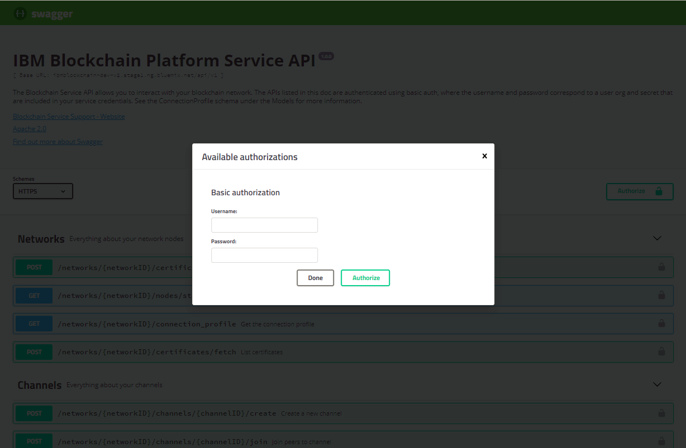

---

copyright:
  years: 2017, 2018
lastupdated: "2018-03-16"

---

{:new_window: target="_blank"}
{:shortdesc: .shortdesc}
{:screen: .screen}
{:codeblock: .codeblock}
{:pre: .pre}

# APIs mit Swagger ausprobieren

{{site.data.keyword.blockchainfull}} Platform stellt eine Reihe von REST-APIs zur Verfügung, die Ihre Anwendungsentwicklung vereinfachen. Mithilfe einer Swagger-Benutzerschnittstelle (UI) können Sie Tests für Ihre Blockchain-Netze durchführen.
{:shortdesc}

Bevor Sie beginnen, müssen Sie eine [{{site.data.keyword.blockchain}} Platform-Serviceinstanz ](https://console.bluemix.net/catalog/services/blockchain) in {{site.data.keyword.Bluemix_notm}} erstellen und ein Starter Plan-Blockchain-Netz erstellen oder an einem Starter Plan-<!--or Enterprise Plan -->Blockchain-Netz teilnehmen.


## Netzberechtigungsnachweise abrufen

Wechseln Sie in den Netzmonitor Ihres Blockchain-Netzes und öffnen Sie die Anzeige "APIs" im Navigator auf der linken Seite. Ihre Netzberechtigungsnachweise für die REST-APIs werden angezeigt. Später berechtigen Sie die APIs, indem Sie die hier angezeigten Werte des Schlüssels ("key") und des geheimen Schlüssels ("secret") verwenden und die APIs mit dem Parameter "network_id" (Netz-ID) ausführen. Klicken Sie auf **Geheimen Schlüssel anzeigen**, um den Wert des Felds für den geheimen Schlüssel ("secret") sichtbar zu machen. Kopieren Sie die Werte der Felder für Schlüssel, geheimen Schlüssel und Netz-ID, die Sie später in der Swagger-Benutzerschnittstelle verwenden können.

<!-- Removing this code snippet so people don't try to use these values
```
},
   "x-api": {
       "url": "https://ibmblockchain.bluemix.net",
       "key": "PeerOrg1",
       "network_id": "e1f5b3341b1d483bbaf829f601144023",
       "secret": "71a329aabde9ff20de0aa4bfafd72a4466d78c87f637e7ff92c2534b5ce81cc0"
   }
```
-->

**Abbildung 1** zeigt die Anzeige "APIs":

*Abbildung 1. APIs*

Wenn Sie den Starter Plan verwenden, ist es möglich, im Netzmonitor zwischen Organisationen zu wechseln. Mit dem Starter Plan werden standardmäßig zwei Organisationen konfiguriert. Das Wechseln zwischen Organisationen kann nützlich sein, um die REST-APIs aus der Perspektive jeder Organisation auszuprobieren. Zum Abrufen der Berechtigungsnachweise für eine andere Organisation in Ihrem Netz klicken Sie auf Ihren Benutzernamen in der rechten oberen Ecke der Netzmonitorkonsole. Klicken Sie in dem Menü, das sich daraufhin öffnet, auf den Dropdown-Pfeil neben der Organisation, um alle Organisationen anzuzeigen. Wählen Sie die Organisation aus, zu der Sie wechseln möchten, und zeigen Sie die zugeordneten Netzberechtigungsnachweise an.

**Abbildung 2** zeigt das Wechseln zwischen Organisationen:

*Abbildung 2. Zwischen Organisationen wechseln*


## Swagger-APIs berechtigen

Klicken Sie auf den Link für die **Swagger-Benutzerschnittstelle (UI)** in der Anzeige "APIs", um die Swagger-Benutzerschnittstelle zu öffnen.  
<!-- remove this line because the link is different depending on if you are starter or enterprise plan
You can also open the Swagger UI with the URL in the connection profiles. For example, `http://blockchain-swagger-dev.stage1.mybluemix.net`.
-->

Klicken Sie in der Swagger-Benutzerschnittstelle auf die Schaltfläche **Berechtigen**. Das Berechtigungsfenster wird angezeigt. Geben Sie den Wert für den Schlüssel ("key") und den geheimen Schlüssel ("secret") in Ihren Netzberechtigungsnachweisen als Benutzername und Kennwort ein und klicken Sie auf **Berechtigen** und anschließend auf **Fertig**. Sie können jetzt die APIs ausführen. Beachten Sie, dass Sie Ihre Berechtigungsnachweise erneut berechtigen müssen, wenn Sie Ihre Browseransicht aktualisieren.

Bei Verwendung der Basisauthentifizierung werden alle Berechtigungsnachweise, die Sie im Fenster **Berechtigen** angeben, nach dem Klick auf die Schaltflächen **Berechtigen** und **Fertig** gespeichert und mit jedem REST-API-Aufruf übergeben.

**Abbildung 3** zeigt das Popup-Fenster "Berechtigen":

*Abbildung 3. Popup-Fenster "Berechtigen"*


## APIs ausprobieren

Klicken Sie auf die REST-API, die Sie ausführen möchten, und klicken Sie auf die Schaltfläche **Ausprobieren**. Geben Sie die erforderlichen Parameter ein und klicken Sie auf **Ausführen**. Der REST-API-Aufruf wird für Ihr Netz ausgeführt.

**Abbildung 4** zeigt die Anzeige der Swagger-Benutzerschnittstelle (UI):

*Abbildung 4. Swagger-Benutzerschnittstelle*


## Tipps zur Fehlerbehebung

### 401 Keine Berechtigung  
  Stellen Sie sicher, dass Sie die REST-API durch Bereitstellen Ihrer Netzberechtigungsnachweise berechtigt haben. Weitere Informationen finden Sie unter [Swagger-APIs berechtigen](#authorizing-swagger-apis).

### 400 Fehler: Falsche Anforderung
  Einige APIs akzeptieren möglicherweise ein Argument im Hauptteil (Body) der Anforderung, das als Filter für die Anzeige von Ergebnissen nur für einen bestimmten Peer verwendet wird. Ein Beispielausschnitt wird im Hauptteil bereitgestellt. Wenn dieser Ausschnitt verwendet wird, muss er bearbeitet werden, um den Peer bzw. die Liste von Peers anzugeben, nach denen Sie filtern möchten. Zur Vermeidung dieses Fehlers bearbeiten Sie entweder den Ausschnitt, um einen Peer in Ihrem Netz anzugeben, oder Sie entfernen den Ausschnitt völlig.
