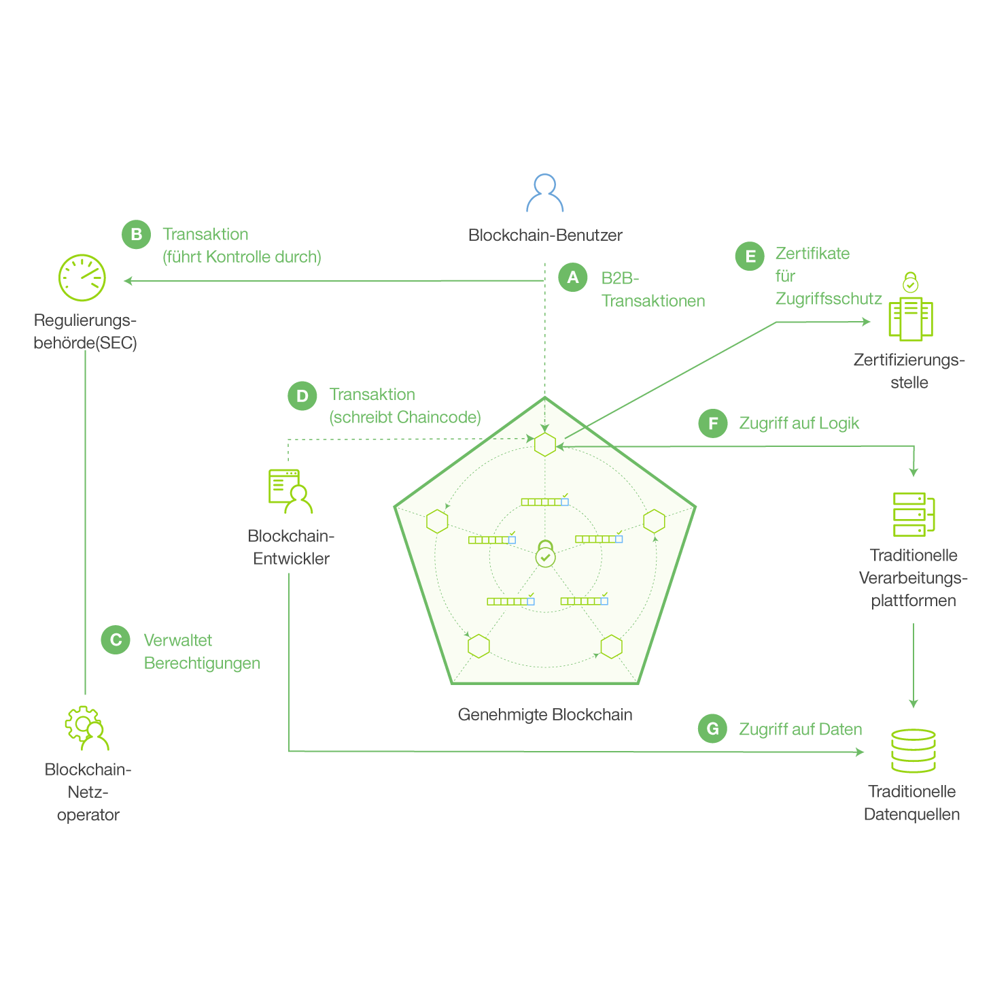

---

copyright:
  years: 2016, 2017
lastupdated: "2017-07-28"
---

{:new_window: target="_blank"}
{:shortdesc: .shortdesc}
{:codeblock: .codeblock}
{:screen: .screen}
{:pre: .pre}

# Blockchain-Grundlagen
{: #ibmblockchain_overview}

Blockchain ist eine Distributed-Ledger-Technologie (DLT), die Geschäftsprozesse optimiert, indem sie höhere Vertrauenswürdigkeit, verbesserte Überprüfbarkeit und mehr Transparenz für eine neue Generation von Transaktionsanwendungen ermöglicht. Das Blockchain-Netz wurde auf dem Markt zunächst für den Bitcoin-Handel eingeführt, aber seine Einsatzmöglichkeiten gehen weit über Kryptowährungstransaktionen hinaus. In Kombination mit dem Hyperledger Project der Linux Foundation ermöglicht {{site.data.keyword.blockchainfull}} die grundlegende Umgestaltung herkömmlicher Geschäftsprozesse und eröffnet eine Vielzahl von Möglichkeiten in der Welt digitaler Interaktionen.

{{site.data.keyword.blockchain}} reduziert die Kosten und Komplexität unternehmensübergreifender Transaktionen durch die Einrichtung effizienter, sicherer Netze, in denen im Prinzip alle relevanten Informationen ohne einen zentralen Steuerungspunkt verfolgt und verarbeitet werden kann. In der Finanzwelt beschleunigen Blockchain-Netze den Wertpapierhandel ganz erheblich - was zuvor Tage dauerte, wird nun in Minuten abgewickelt. In der Welt des Handels können diese Netze das Supply-Chain-Management vereinfachen und dafür sorgen, dass die Warenströme und der Zahlungsverkehr in Echtzeit überwacht und protokolliert werden können. 

## Blockchain-Netzübersicht

In einem {{site.data.keyword.blockchain}}-Netz werden die Datensätze zu den Netztransaktionen in einem gemeinsam genutzten Hauptbuch (Ledger) festgehalten, das für alle oder einen Teil der Netzmitglieder repliziert wird (Hauptbücher liegen im Geltungsbereich eines Kanals, d. h. wenn für den Peer eines Mitglieds keine Subskription für einen Kanal besteht, haben sie die Transaktionen dieses Kanals nicht). Die Datensätze aller Transaktionen (gültige und ungültige) werden in Blöcken erfasst und an die Hashchain (d. h. Blockchain) für jeden Kanal angehängt. Gültige Transaktionen aktualisieren die World-State-Datenbank, ungültige Transaktionen führen nicht zu einer Aktualisierung. Chaincodes (auch als "Smart Contracts" bezeichnet) sind die Softwarekomponenten, die eine Reihe von Funktionen enthalten, die Lese- und Schreibvorgänge im Hauptbuch ermöglichen. Clientseitige Anwendungen nutzen ein SDK als Schnittstelle zu einem oder mehreren Peers und rufen die Funktionen schließlich in einen bestimmten Chaincode auf. Es gibt zwei zentrale Fabric-APIs, mit denen Chaincode lesen oder schreiben kann - `getState` und `putState`.

**Abbildung 1** zeigt ein Beispiel für ein genehmigtes Blockchain-Netz mit einer verteilten, dezentralen Peer-to-Peer-Architektur sowie eine Zertifizierungsstelle, die Benutzerrollen und Berechtigungen verwaltet:

*Abbildung 1. Ein Beispiel für ein genehmigtes Blockchain-Netz: Datenfluss und Netzzugriff werden durch Mitgliederrollen gesteuert*

Die folgenden Beschreibungen entsprechen der Architektur und dem Ablauf in Abbildung 1 (Anmerkung: Es wird kein sequenzieller Prozess dargestellt):

**A:** Ein Blockchain-Benutzer übergibt eine Transaktion an das Blockchain-Netz. Die Transaktion kann eine Bereitstellung, einen Aufruf oder eine Abfrage beinhalten und wird durch eine clientseitige Anwendung, die ein SDK nutzt, oder direkt durch eine REST-API ausgegeben.  

**B:** Vertrauenswürdige Unternehmensnetze ermöglichen den Zugang zu Regulierungsbehörden und Auditoren (z. B. das SEC auf einem US Aktienmarkt).  

**C:** Ein Blockchain-Netzoperator verwaltet die Berechtigungen der Mitglieder z. B. das Eintragen der Regulierungsbehörde (B) als "Auditor" und des Blockchain-Benutzers (A) als "Kunde".
Ein Auditor kann auf das Abfragen das Hauptbuchs beschränkt werden, während der Kunde berechtigt werden kann, bestimmte Chaincode-Typen bereitzustellen, aufzurufen und abzufragen.  

**D:** Ein Blockchain-Entwickler schreibt Chaincode und clientseitige Anwendungen. Die Blockchain-Entwickler können Chaincode über eine REST-Schnittstelle direkt für das Netz bereitstellen. Um Berechtigungsnachweise von einer herkömmlichen Datenquelle in den Chaincode aufzunehmen, kann der Entwickler eine Out-of-band-Verbindung für den Datenzugriff verwenden (G). 

**E:** Ein Blockchain-Benutzer stellt eine Verbindung zum Netz über einen Peerknoten her (A). Bevor die Transaktionsverarbeitung fortgesetzt wird, ruft der Knoten die Benutzereintragung und die Transaktionszertifikate bei der Zertifizierungsstelle ab. Die Benutzer müssen diese digitalen Zertifikate besitzen, um Transaktionen für ein genehmigtes Netz ausführen zu können.

**F:** Ein Benutzer, der versucht, Chaincode auszuführen, wird möglicherweise dazu aufgefordert, seine Berechtigung für eine konventionelle Datenquelle nachzuweisen (G). Zum Bestätigen der Benutzerberechtigung kann der Chaincode eine Out-of-band-Verbindung zu diesen Daten über eine herkömmliche Verarbeitungsplattform verwenden.
