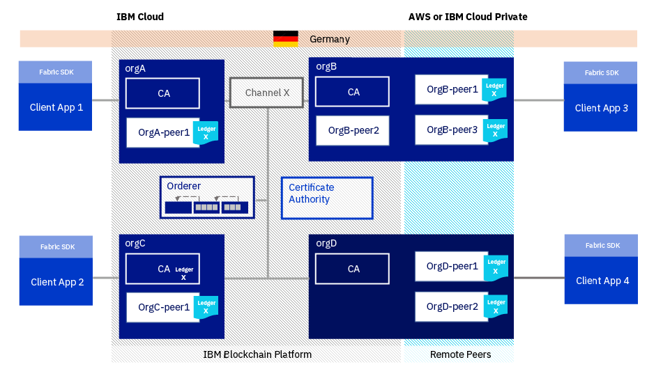

---

copyright:
  years: 2018
lastupdated: "2018-12-07"

---

{:new_window: target="_blank"}
{:shortdesc: .shortdesc}
{:screen: .screen}
{:codeblock: .codeblock}
{:pre: .pre}

# Informationen zu {{site.data.keyword.blockchainfull_notm}} Platform for {{site.data.keyword.cloud_notm}} Private
{: #overview}

***[Ist diese Seite hilfreich? Teilen Sie uns Ihre Meinung mit.](https://www.surveygizmo.com/s3/4501493/IBM-Blockchain-Documentation)***

{{site.data.keyword.blockchainfull}} Platform gibt IBM Blockchain Platform for {{site.data.keyword.cloud_notm}} Private (ICP) frei, eine Anwendungsplattform für die Entwicklung und Verwaltung von containerisierten Anwendungen, die auf Kubernetes basieren, und ermöglicht Benutzern die Bereitstellung von Zertifizierungsstellen, Anordnungsknoten und Peers unter x86, LinuxONE und IBM Z. {{site.data.keyword.blockchainfull_notm}} Platform for ICP basiert auf Hyperledger Fabric Version 1.2.1 und wird unter Verwendung von Kubernetes-Helm-Diagrammen bereitgestellt.
{:shortdesc}

{{site.data.keyword.blockchainfull_notm}} Platform for {{site.data.keyword.cloud_notm}} Private ist ein Produktpaket für ICP-Kunden, die Blockchain-Komponenten in ihrer lokalen Umgebung bereitstellen wollen. Nach dem Import des Helm-Diagramms ist es als Kachel "{{site.data.keyword.blockchainfull_notm}} Platform" im ICP-Katalog enthalten. Weitere Informationen zu ICP enthält die Dokumentation für [{{site.data.keyword.cloud_notm}} Private Version 3.1.0 ](https://www.ibm.com/support/knowledgecenter/SSBS6K_3.1.0/kc_welcome_containers.html "{{site.data.keyword.cloud_notm}} Private 3.1.0").

## Vorzüge von {{site.data.keyword.blockchainfull_notm}} Platform for ICP

Mit {{site.data.keyword.blockchainfull_notm}} Platform for IBM Cloud Private (ICP) können Sie alle grundlegenden Komponenten einer Hyperledger Fabric-Blockchain (also Zertifizierungsstelle, Anordnungsknoten und Peers) bereitstellen. Sie erhalten die Flexibilität, unterschiedliche Komponenten je nach Ihren Geschäftsanforderungen bereitzustellen. Sie können mit {{site.data.keyword.blockchainfull_notm}} for ICP ein Blockchain-Netz aufbauen, indem Sie einen Anordnungsservice erstellen und konfigurieren, der Organisationen in einem Blockchain-Konsortium miteinander verbindet. Außerdem können Sie Peers bereitstellen und an anderen Netzen teilnehmen, die auf Fabric basierende Komponenten nutzen; dies schließt auch {{site.data.keyword.blockchainfull_notm}} Platform-Netze ein, die cloudübergreifend mit ICP bereitgestellt werden, oder in IBM Cloud gehostete Starter Plan- und Enterprise Plan-Netze. Weitere Informationen zu den Bausteinen von Hyperledger Fabric-Netzen finden Sie unter [Blockchain-Komponenten im Überblick](/docs/services/blockchain/blockchain_component_overview.html).

## Eignung von {{site.data.keyword.blockchainfull_notm}} Platform for ICP für Ihre Zwecke

Die Ausführung der {{site.data.keyword.blockchainfull_notm}} Platform-Komponenten außerhalb von {{site.data.keyword.cloud_notm}} bietet ein höheres Maß an Flexibilität in Bezug auf die Vergrößerung eines Blockchain-Netzes sowie hinsichtlich der Teilnahme an einem Blockchain-Netz. Netzgründer werden bei der Vergrößerung ihrer eigenen Netze unterstützt, indem neue Mitglieder unter Verwendung der Plattform ihrer Wahl teilnehmen können. Organisationen, die an der Teilnahme an Blockchain-Netzen Interesse haben, können ihre Peers mit ihren vorhandenen Anwendungen zusammenfassen und/oder bei ihren Systems of Record integrieren.

**Wichtig:** Der Prozess für die Bereitstellung von {{site.data.keyword.blockchainfull_notm}} Platform for ICP ist komplex und setzt ein großes Fachwissen über Fabric voraus. Wenn Sie Fabric, ICP oder {{site.data.keyword.blockchainfull_notm}} Platform noch nicht kennen und eine Machbarkeitsnachweis- oder Entwicklungsumgebung einrichten wollen, sollten Sie stattdessen die Verwendung des [Starter Plans](/docs/services/blockchain/starter_plan.html) erwägen. Bitte beachten Sie außerdem, dass nicht jede potenzielle Bereitstellungskonfiguration in {{site.data.keyword.blockchainfull_notm}} Platform for ICP unterstützt wird.

Benutzer dieses Angebots verwalten ihre Sicherheit und Infrastruktur selbst. {{site.data.keyword.cloud_notm}} stellt diese Services nicht zur Verfügung. Lesen Sie vor Beginn die [Hinweise und Einschränkungen](#ibp-icp-considerations) im nächsten Abschnitt.

## Hinweise und Einschränkungen
{: #ibp-icp-considerations}

Beschäftigen Sie sich vor den ersten Schritten mit dem Produkt unbedingt mit den folgenden **Hinweisen** und **Einschränkungen**:

- Für die Statusüberwachung, die Sicherheit, die Protokollierung sowie das Management der Ressourcennutzung Ihrer Komponenten sind Sie selbst verantwortlich.
- Komponenten, die in anderen Cloudumgebungen ausgeführt werden, sind in der Network Monitor-Instanz der unter {{site.data.keyword.cloud_notm}} ausgeführten Netze nicht sichtbar.
- Die Helm-Diagramme stellen eine einzige Instanz eines Anordnungsknotens, eines Peers oder einer Zertifizierungsstelle bereit.
- Sie können mehrere Komponenten in einem einzigen Namensbereich in ICP bereitstellen, sofern diese unterschiedliche Releasenamen besitzen.
- Komponenten können nicht über die Swagger-Benutzerschnittstelle in der Benutzerschnittstelle von Network Monitor aufgerufen werden.
- Gegenseitiges TLS wird nicht unterstützt.

**Hinweise zur Zertifizierungsstelle**
- Dieses Helm-Diagramm stellt eine einzelne Instanz der Zertifizierungsstelle bereit. Da es als bewährtes Verfahren gilt, für jede Organisation eine separate Zertifizierungsstelle einzusetzen, kann es erforderlich sein, mehrere Zertifizierungsstellen bereitzustellen. Wenn Sie beispielsweise einen Anordnungsknoten und drei Peers bereitstellen wollen, benötigen Sie mindestens zwei Zertifizierungsstellen (eine für die Organisation des Anordnungsknotens und eine weitere für die Organisation der Peers).
- Sie können sich zwar für die Ausführung einer separaten MySQL-Datenbank entscheiden, aber diese Option ist im Helm-Diagramm nicht vorhanden. Allerdings stellt das Helm-Diagramm eine SQLite-Datenbank in der Zertifizierungsstelle bereit, um den Datenbankbedarf der Zertifizierungsstelle abzudecken, zu dem das Überwachen der Anzahl der Registrierungen pro Benutzer und aller widerrufenen Zertifikate gehört.

**Hinweise zu Anordnungsknoten**
- Der Anordnungsservice ist mit jeder Komponente der Version 1.2 von Hyperledger Fabric kompatibel.
- Dieses Helm-Diagramm stellt eine einzige Instanz des SOLO-Anordnungsservice (1 Anordnungsknoten) bereit. Bitte beachten Sie, dass in einem Kanal nicht mehr als ein SOLO-Anordnungsknoten bereitgestellt werden kann, damit der Anordnungsservice hoch verfügbar ist. Dies ist einer der Gründe dafür, dass SOLO-Anordnungsservices eher für Entwicklungsumgebungen als für Produktionsumgebungen gedacht sind. Sie können jedoch mehrere Instanzen des SOLO-Anordnungsservice für unterschiedliche Netze (also mit einem separaten Konsortium) bereitstellen.

**Hinweise zu Peers**

- Sie können Ihre Peers nur mit Blockchain-Netzen verbinden, die Version 1.1 oder 1.2 von Fabric verwenden. Ihre Version von Hyperledger Fabric können Sie ermitteln, indem Sie das [Fenster "Netzvorgaben"](/docs/services/blockchain/v10_dashboard.html#network-preferences) in Network Monitor öffnen. Befolgen Sie die [Anweisungen](#starter-enterprise-network-endpoints), um die Peerverbindungsinformationen aus Starter- oder Enterprise-Netzen abzurufen.
- Der Datenbanktyp des Peers muss mit dem Datenbanktyp des Blockchain-Netzes (entweder LevelDB oder CouchDB) übereinstimmen.
- Die CouchDB-Fauxton-Schnittstelle steht auf dem Peer nicht zur Verfügung.
- [Gossip](/docs/services/blockchain/glossary.html#gossip) für Peers wird momentan nicht unterstützt. Dies impliziert, dass Fabric-Funktionen, die von Gossip abhängig sind (z. B. [private Daten ](https://hyperledger-fabric.readthedocs.io/en/release-1.2/private-data-arch.html "Private Data") und [Serviceerkennung ](https://hyperledger-fabric.readthedocs.io/en/release-1.2/discovery-overview.html "Service discovery")) ebenfalls nicht unterstützt werden.

## Systemvoraussetzungen
{: #prerequisites}

{{site.data.keyword.blockchainfull_notm}} Platform for ICP unterstützt die folgenden Betriebssysteme:
- Red Hat Enterprise Linux (RHEL) 7.3, 7.4, 7.5
- Ubuntu 18.04 LTS und 16.04 LTS
- SUSE Linux Enterprise Server (SLES) 12 SP3

Die Ausführung des Helm-Diagramms von {{site.data.keyword.blockchainfull_notm}} Platform for ICP wurde in Clustern von {{site.data.keyword.cloud_notm}} Private Version 3.1.0 unter Ubuntu Linux bei Verwendung der folgenden Workerknoten und des folgenden Sicherungsspeichers validiert:

- **LinuxONE und IBM Z**: z/VM und KVM mit Verwendung von NFS.
- **x86**: Linux 64-Bit mit Verwendung von GlusterFS.

## Lizenz und Preisstruktur
{: #ibp-icp-license-pricing}
{{site.data.keyword.blockchainfull_notm}} Platform for {{site.data.keyword.cloud_notm}} Private umfasst zwei Editionen, nämlich ein gebührenpflichtiges Angebot, das bei Passport Advantage für den Download verfügbar ist, sowie eine kostenlose Community Edition, die in [GitHub ](https://github.com/IBM/charts/tree/master/stable/ibm-blockchain-platform-dev "IBM/charts") verfügbar ist.

### Lizenz
{: #ibp-icp-license}

{{site.data.keyword.blockchainfull_notm}} Platform on {{site.data.keyword.cloud_notm}} Private liefert die Komponenten, die für die Ausführung eines Blockchain-Netzes in Ihrer eigenen Infrastruktur benötigt werden, und wird als ICP-Anwendung bereitgestellt. Sie können auf PPA zugreifen und das [Helm-Diagramm herunterladen](/docs/services/blockchain/howto/helm_install_icp.html). Die technische Unterstützung für {{site.data.keyword.blockchainfull_notm}} ist im Kaufpreis enthalten.

{{site.data.keyword.blockchainfull_notm}} Platform on IBM Cloud Private Community Edition ist ein kostenloses Angebot, das sich für Evaluierungs- und Versuchszwecke eignet, und wird als ICP-Anwendung bereitgestellt. Verwenden Sie Community Edition nicht für die Produktion. {{site.data.keyword.blockchainfull_notm}} Platform bietet keinen Support für Community Edition. Sie können auf das [GitHub-Paket ](https://github.com/IBM/charts/blob/master/repo/stable/ibm-blockchain-platform-dev-1.0.0.tgz "IBM/charts") zugreifen und das Helm-Diagramm herunterladen.

### Preisstruktur
{: #ibp-icp-pricing}

Die Preisstruktur von {{site.data.keyword.blockchainfull_notm}} Platform on ICP basiert auf der Anzahl der genutzten virtuellen Prozessorkerne (Virtual Processor Cores, VPCs). Ein VPC kann entweder ein virtueller Kern sein, der einem virtuellen Server zugeordnet ist, oder ein physischer Prozessorkern in einem nicht partitionierten Server. Sie müssen für jeden VPC, der für {{site.data.keyword.blockchainfull_notm}} Platform verfügbar gemacht wird, eine Lizenzberechtigung anfordern. <!-- A VPC is a unit of measurement by which a program can be licensed.-->

Weitere Angaben über das Ermitteln Ihrer VPC-Nutzung enthält der Abschnitt [Virtuelle Prozessorkerne ](https://www.ibm.com/support/knowledgecenter/en/SS8JFY_9.2.0/com.ibm.lmt.doc/Inventory/overview/c_virtual_processor_core_licenses.html "Virtuelle Prozessorkerne") im IBM Knowledge Center. Mithilfe von [IBM License Metric Tool](https://www.ibm.com/support/knowledgecenter/en/SS8JFY_9.2.0/com.ibm.lmt.doc/welcome/LMT_welcome.html) können Sie einen Bericht konfigurieren und erstellen, in dem Sie die Anzahl der VPCs ermitteln können, für die Sie eine Lizenz benötigen.

## {{site.data.keyword.blockchainfull_notm}} Platform for ICP installieren
{: #ibp-icp-install}

{{site.data.keyword.blockchainfull_notm}} Platform on {{site.data.keyword.cloud_notm}} Private wird als Helm-Diagrammdatei geliefert, die in einem lokalen ICP-Cluster installiert werden kann. Nachdem Sie das Helm-Diagramm installiert haben, finden Sie {{site.data.keyword.blockchainfull_notm}} Platform als Anwendung im ICP-Katalog.

- {{site.data.keyword.blockchainfull_notm}} Platform for ICP wird über Passport Advantage bereitgestellt. Sie benötigen die erforderliche Lizenz, um auf [Passport Advantage Online](https://www.ibm.com/software/passportadvantage/pao_customer.html) zugreifen zu können. Die technische Unterstützung für {{site.data.keyword.blockchainfull_notm}} Platform ist im Kauf enthalten.

- {{site.data.keyword.blockchainfull_notm}} Platform Community Edition ist für Erkundung, Entwicklung und Tests gedacht. Auf diese kostenlose Version von IBM Blockchain Platform for ICP kann über GitHub zugegriffen werden. **Hinweis:** {{site.data.keyword.blockchainfull_notm}} Platform stellt für Community Edition keinen Support bereit.

Anweisungen zum Installieren des Helm-Diagramms und der erforderlichen Voraussetzungen enthält der Abschnitt [{{site.data.keyword.blockchainfull_notm}} Platform on {{site.data.keyword.cloud_notm}} Private installieren](/docs/services/blockchain/howto/helm_install_icp.html).

Falls Sie {{site.data.keyword.cloud_notm}} Private noch nicht verwendet haben und Tipps zur Installation und Bereitstellung von ICP benötigen, lesen Sie den Abschnitt [{{site.data.keyword.cloud_notm}} Private einrichten](/docs/services/blockchain/ICP_setup.html).

Nachdem Sie {{site.data.keyword.blockchainfull_notm}} Platform for ICP installiert haben, müssen Sie jede Komponente Ihres Netzes einzeln bereitstellen. Die gleichzeitige Bereitstellung von mehreren Komponenten ist nicht möglich. Im Handbuch [{{site.data.keyword.blockchainfull_notm}} Platform for ICP - Bereitstellung](/docs/services/blockchain/ibp_for_icp_deployment_guide.html) können Sie sich vor den ersten Schritten über die Best Practices für die Gründung eines Blockchain-Netzes oder die Teilnahme an einem solchen Netz informieren. Lesen Sie anschließend die Schritte in den nachfolgenden Abschnitten, um die einzelnen Komponenten bereitzustellen und in Betrieb zu nehmen.

### {{site.data.keyword.blockchainfull_notm}} Platform for ICP hinter einer Firewall installieren
{: #ibp-icp-firewall}

Sie können die Komponenten von {{site.data.keyword.blockchainfull_notm}} Platform ohne Zugriff auf das öffentliche Internet hinter einer Firewall installieren. Das heruntergeladene Paket für das Helm-Diagramm enthält alle Docker-Images für die Fabric-Komponenten, die von {{site.data.keyword.blockchainfull_notm}} Platform verwendet werden; die Komponenten werden nicht während der Bereitstellung aus Docker Hub extrahiert.

Das Paket mit dem Helm-Diagramm für {{site.data.keyword.blockchainfull_notm}} Platform Community Edition enthält nicht die erforderlichen Docker-Images für die Fabric-Komponenten. Es ist so konfiguriert, dass diese Images während der Bereitstellung bei Docker Hub heruntergeladen werden, und schlägt fehl, wenn kein Zugriff auf das öffentliche Internet besteht. Mit einigen wenigen zusätzlichen Schritten können Sie die Komponenten von Community Edition jedoch hinter einer Firewall bereitstellen. Weitere Informationen hierzu finden Sie im Abschnitt [Community Edition hinter einer Firewall installieren](/docs/services/blockchain/howto/helm_install_icp.html#helm-install-prereqs-firewall).

## Informationen zu Zertifizierungsstellen in ICP
{: #ibp-icp-ca}

Zertifizierungsstellen (CAs; Certificate Authorities) ermöglichen die Identitätsfeststellung innerhalb des Netzes. Eine Zertifizierungsstelle ist mit einem Notar vergleichbar, der zwischen mehreren Parteien als Vertrauensperson fungiert. Alle Entitäten innerhalb des Netzes erhalten ein Zertifikat, das von einer so genannten Stammzertifizierungsstelle (Root-CA) signiert wurde und in dem die digitale Identität der betreffenden Entitäten enthalten ist. Dieses Zertifikat stellt die Vertrauensgrundlage für alle Signier- und Verifizierungsoperationen dar, die innerhalb des Netzes ausgeführt werden. Weitere Informationen zu Zertifizierungsstellen sowie der Rolle, die sie in einem Blockchain-Netz übernehmen, enthält der Abschnitt [Blockchain-Komponenten im Überblick](/docs/services/blockchain/blockchain_component_overview.html).

Die Zertifizierungsstelle validiert die Identität und stellt Zertifikate für die anderen Komponenten in Ihrem Netz aus, die Sie bereitstellen müssen. Infolgedessen müssen Sie eine Zertifizierungsstelle für Ihre Organisation bereitstellen, bevor Sie andere Komponenten bereitstellen.

- Im Abschnitt [Zertifizierungsstelle in {{site.data.keyword.cloud_notm}} Private bereitstellen](/docs/services/blockchain/howto/CA_deploy_icp.html) ist beschrieben, wie Sie eine Zertifizierungsstelle konfigurieren und bereitstellen, nachdem Sie das Helm-Diagramm installiert haben.

- Informationen zum Generieren von Zertifikaten mit der Zertifizierungsstelle und zu den vorausgesetzten Schritten für die Bereitstellung weiterer Komponenten finden Sie unter [Zertifizierungsstelle in {{site.data.keyword.cloud_notm}} Private betreiben](/docs/services/blockchain/howto/CA_operate.html).

## Informationen zu Anordnungsknoten in ICP
{: #ibp-icp-orderer}

Anordnungsknoten authentifizieren Clients, ordnen Transaktionen an und senden Transaktionen in einem Blockchain-Netz. Sie sind die allgemeine Bindung von Blockchain-Netzen, die auf Hyperledger Fabric basieren. Die Organisation, die ein Netz gründet, muss daher einen "Anordnungsservice" (also den Knoten bzw. die Knotengruppe, die die Anordnung durchführen) bereitstellen und starten, bevor andere Organisationen ihre Peers bereitstellen, an Kanälen teilnehmen und Transaktionen im Netz starten können. Weitere Informationen zu Anordnungsknoten und der Rolle, die sie in einem Blockchain-Netz übernehmen, enthält der Abschnitt [Blockchain-Komponenten im Überblick](/docs/services/blockchain/blockchain_component_overview.html#orderer).

Wenn Sie ein Blockchain-Netz gründen, müssen Sie einen Anordnungsknoten bereitstellen. Nach seiner Bereitstellung können Sie andere Organisationen in Ihr Konsortium einladen, die dann eigene Kanäle erstellen können.

- Im Abschnitt [Anordnungsknoten in ICP bereitstellen](/docs/services/blockchain/howto/orderer_deploy_icp.html) ist beschrieben, wie Sie einen Anordnungsknoten konfigurieren und bereitstellen, nachdem Sie das Helm-Diagramm installiert haben.

- Weitere Informationen zum Erstellen eines Konsortiums finden Sie unter [Anordnungsknoten in ICP betreiben](/docs/services/blockchain/howto/orderer_operate.html).

## Informationen zu Peers in ICP
{: #ibp-icp-peer}

Peers sind ein grundlegendes Element des Netzes, da sie Ledger und Smart Contracts hosten. Smart Contracts und Ledger werden eingesetzt, um die gemeinsam genutzten Prozesse bzw. Informationen in einem Netzwerk zu kapseln. Weitere Informationen zu Peers und der Rolle, die sie in einem Blockchain-Netz übernehmen, enthält der Abschnitt [Blockchain-Komponenten im Überblick](/docs/services/blockchain/blockchain_component_overview.html).

- Sobald Sie bereit dafür sind, an einem Netz teilzunehmen, können Sie einen Peer bereitstellen, der Kanälen beitritt, Transaktionen zulässt und die Kanal-Ledger speichert. Informationen zum Bereitstellen eines Peers in ICP, der eine Verbindung zu anderen Komponenten in ICP herstellt, enthält der Abschnitt [Peer in ICP bereitstellen](/docs/services/blockchain/howto/peer_deploy_icp.html). Angaben über die Bereitstellung eines Peers in ICP, der eine Verbindung zu einem Starter Plan- oder Enterprise Plan-Netz herstellt, finden Sie unter [Peer für Verbindung zu Starter Plan- oder Enterprise Plan-Netz bereitstellen](/docs/services/blockchain/howto/peer_deploy_ibp.html).

- Nachdem Sie den Peer eingerichtet haben, müssen Sie verschiedene operative Schritte ausführen, bevor Sie Transaktionen an das Blockchain-Netz übergeben und das verteilte Ledger aus dem Blockchain-Netz lesen können.

  - Wenn Sie Ihren Peer mit einer Instanz von {{site.data.keyword.blockchainfull_notm}} Platform verbinden wollen, die in ICP bereitgestellt ist, lesen Sie den Abschnitt [Peers in {{site.data.keyword.cloud_notm}} Private mit einem Multi-Cloud-Netz betreiben](/docs/services/blockchain/howto/peer_operate_icp.html).
  - Wenn Sie Ihren Peer mit einem Starter Plan- oder Enterprise Plan-Netz verbinden wollen, das in {{site.data.keyword.cloud_notm}} bereitgestellt ist, lesen Sie die Informationen unter [Peers in {{site.data.keyword.cloud_notm}} Private mit Starter Plan oder Enterprise Plan betreiben](/docs/services/blockchain/howto/peer_operate_ibp.html).

## Hinweise zur Sicherheit
{: #icp-security}

Da diese Komponenten außerhalb von {{site.data.keyword.cloud_notm}} bereitgestellt werden, sind Sie für das Management ihrer Sicherheit verantwortlich. Hierzu gehören auch wichtige Bereiche der Sicherheit wie beispielweise das Schlüsselmanagement und die Datenverschlüsselung. Machen Sie sich mit den folgenden Themen vertraut, wenn Sie sich mit der Sicherheit für Ihre Komponenten befassen.

### Datensicherheit
{: #icp-security-data}

Der Starter Plan und der Enterprise Plan von {{site.data.keyword.blockchainfull_notm}} verwenden die Verschlüsselung gesamter Platten, die auf der [Verschlüsselung mit symmetrischen Schlüsseln](https://www.ibm.com/support/knowledgecenter/en/SSB23S_1.1.0.14/gtps7/s7symm.html "Symmetrische Verschlüsselung") basiert, um alle vom Netz verwendeten Daten zu schützen. In Ihrer eigenen Umgebung müssen Sie zum Schutz Ihrer Peerdaten ähnliche Schritte unternehmen.

Die Daten in Ihrer Statusdatenbank werden nicht verschlüsselt; hierbei ist es ohne Belang, ob Sie LevelDB oder CouchDB verwenden. Mithilfe der Verschlüsselung auf Anwendungsebene können Sie ruhende Daten in Ihrer Statusdatenbank schützen.

### Datenspeicherort
{: #data-residency}

Die Anforderungen an den Datenspeicherort können es erforderlich machen, dass die Verarbeitung und Speicherung aller Blockchain-Ledgerdaten innerhalb der Grenzen eines bestimmten Landes stattfinden (bzw. innerhalb anderer definierten Grenzen). Weitere Informationen zur Erfüllung der Kriterien für den Datenspeicherort finden Sie unter [Datenspeicherort](#icp-data-residency).
### Schlüsselmanagement
{: #icp-security-key-management}

Das Schlüsselmanagement stellt einen kritischen Aspekt für die Sicherheit dar. Wenn ein privater Schlüssel manipuliert wird oder verloren geht, dann können feindliche Akteure möglicherweise auf Ihre Daten und Funktionalität zugreifen. IBM verwendet mit so genannten [Hardwaresicherheitsmodulen](/docs/services/blockchain/glossary.html#hsm) (HSM) physische Einheiten, um die privaten Schlüssel der Enterprise Plan-Netze von {{site.data.keyword.blockchainfull_notm}} Platform zu speichern.

Wenn Sie eine Komponente unter ICP bereitstellen, dann sind Sie für das Management Ihrer privaten Schlüssel verantwortlich. Obwohl {{site.data.keyword.blockchainfull_notm}} Platform private Schlüssel generiert, werden diese Schlüssel nicht auf der Plattform gespeichert. Ihre Schlüssel müssen unbedingt sicher verwahrt werden, damit sie nicht manipuliert werden können. Sie finden den privaten Schlüssel Ihrer Komponente im Keystore-Ordner des Peer-MSP im Verzeichnis `/mnt/crypto/peer/peer/msp/keystore/` innerhalb der Komponente. Weitere Informationen zu den Zertifikaten im Peer finden Sie im Abschnitt zum [Membership Services Provider](/docs/services/blockchain/certificates.html#msp) im Lernprogramm [Zertifikate unter {{site.data.keyword.blockchainfull_notm}} Platform verwalten](/docs/services/blockchain/certificates.html).

Sie können Key Escrow verwenden, um verloren gegangene private Schlüssel wiederherzustellen. Der entsprechende Arbeitsschritt muss ausgeführt werden, bevor Sie einen Schlüssel verlieren. Wenn ein privater Schlüssel nicht wiederhergestellt werden kann, dann müssen Sie neue private Schlüssel anfordern. Hierzu müssen Sie eine neue Identität bei Ihrer Zertifizierungsstelle registrieren. Außerdem sollten Sie in diesem Fall das signCert-Zertifikat von allen Kanälen entfernen, denen Sie beigetreten sind, oder es auf diesen Kanälen ersetzen.

### TLS
{: #icp-security-tls}

[Transport Layer Security ](https://www.ibm.com/support/knowledgecenter/en/SSFKSJ_7.1.0/com.ibm.mq.doc/sy10660_.htm "Übersicht zum SSL- oder TLS-Handshake") (TLS) ist im Vertrauensmodell von Hyperledger Fabric eingebettet. Alle Starter- und Enterprise-Komponenten unter {{site.data.keyword.blockchainfull_notm}} Platform verwenden TLS zur Authentifizierung und Kommunikation mit anderen Komponenten. Aus diesem Grund müssen die Netzkomponenten unter {{site.data.keyword.blockchainfull_notm}} Platform in der Lage sein, den TLS-Handshake mit Ihren Peers auszuführen. Dies hat u. a. zur Folge, dass Sie den Durchgriff von den Client-Apps zu Ihrem Peer in Ihrer Firewall (z. B. über ein Whitelisting) aktivieren müssen.

<!--
You can use Mutual TLS, which requires two way (server-client) rather than one way (server only) authentication, to secure the communication between your application and Enterprise Plan networks. You can use the Network Monitor [to enable mutual TLS](/docs/services/blockchain/v10_dashboard.html#mutual-tls) for peers on {{site.data.keyword.blockchainfull_notm}} Platform. To enable Mutual TLS on your peer, follow the instructions to [enable mutual-TLS for peer nodes ](https://hyperledger-fabric.readthedocs.io/en/release-1.1/enable_tls.html "Securing Communication with Transport Layer Security") in the Hyperledger Fabric documentation. It is strongly recommended that you enable mutual-TLS for your applications.
-->

### Konfiguration von Membership Service Provider
{: #icp-security-MSP}

{{site.data.keyword.blockchainfull_notm}} Platform-Komponenten verbrauchen Identitäten über Membership Service Providers (MSPs). MSPs ordnen die Zertifikate zu, die von den Zertifizierungsstellen mit den entsprechenden Netz- und Kanalrollen ausgegeben werden. Weitere Informationen zur Vorgehensweise von MSPs beim Arbeiten mit einem Peer finden Sie im Abschnitt [Membership Service Providers (MSPs)](/docs/services/blockchain/certificates.html#msp).

### Anwendungssicherheit
{: #icp-security-appl}

Da alle Chaincode-Aufrufe signiert werden, verwaltet Fabric die Anwendungssicherheit. Zusätzlich hierzu umfasst Fabric auch ACL-basierte Überprüfungen der Anwendungsebene.

## Datenspeicherort
{: #icp-data-residency}

Da Blockchain-Netze dem Typ der verarbeiteten Daten keine Beachtung schenken, müssen bisweilen zusätzliche Schritte ausgeführt werden, damit bestimmte Arten von Daten geschützt bleiben. Die gängigste Anforderung zum Datenspeicherort besteht in Bezug auf die Gesetzgebung einiger Länder, die vorgibt, dass alle Daten, die in einem IT-System verarbeitet und gespeichert werden, innerhalb der Grenzen eines bestimmten Landes verbleiben müssen. Ähnlich wird von bestimmten Unternehmen in stark regulierten Branchen (z. B. Behörden, Gesundheitswesen und Finanzdienstleistungen) vorgegeben, dass Daten vollständig hinter einer Firewall gespeichert werden müssen. Zur Erfüllung der Kriterien für den Datenspeicherort müssen alle Komponenten des Blockchain-Netzes deshalb Teil desselben [Kanals](/docs/services/blockchain/glossary.html#channel) sein und innerhalb der Grenzen eines bestimmten Landes gespeichert werden.

Zur Erfüllung der Anforderungen für den Datenspeicherort sollten Sie sich mit der Hyperledger Fabric-Architektur vertraut machen, die die Grundlage von {{site.data.keyword.blockchainfull_notm}} Platform bildet. Die Architektur basiert auf den drei folgenden Schlüsselkomponenten: aus einem (aus Anordnungsknoten bestehenden) Anordnungsservice, aus Zertifizierungsstellen und aus Peers. Ein Peer empfängt angeordnete Statusaktualisierungen in Form von Blöcken vom Anordnungsservice und verwaltet den Status und das Ledger. Aus diesem Grund besteht eine direkte Verbindung zwischen einem Peer und einem Anordnungsservice. Das Ledger enthält die aktuellsten Werte für alle Schlüssel und die Daten, die in den Transaktionsprotokollen enthalten sind.

Darüber hinaus verwenden Clientanwendungen die [Fabric-SDKs](/docs/services/blockchain/v10_application.html#using-the-fabric-sdks) zum Senden von Transaktionen an die Peers und Anordnungsservices. Diese Transaktionen umfassen die Daten für den [Lese-/Schreibsatz ](https://hyperledger-fabric.readthedocs.io/en/release-1.2/readwrite.html "Read-Write set semantics"), der die Schlüssel/Wert-Paare des Ledgers enthält.

Wenn der landesinterne Datenspeicherort eine Anforderung darstellt, dann müssen der Anordnungsknoten, die Peers und die Clientanwendungen sich innerhalb desselben Landes befinden. Wenn ein {{site.data.keyword.blockchainfull_notm}} Platform-Netz in {{site.data.keyword.cloud_notm}} erstellt wird, dann haben Sie die Möglichkeit, einen Standort für Ihr Netz auszuwählen. <!--For a Starter Plan network, you can select from US South, United Kingdom, and Sydney. For an Enterprise Plan network, you can select from currently available locations, which include Dallas, Frankfurt, London, Sao Paulo, Tokyo, and Toronto. -->Weitere Informationen zu Regionen und Standorten finden Sie im Abschnitt zu den [{{site.data.keyword.blockchainfull_notm}} Platform-Regionen und -Standorten](/docs/services/blockchain/reference/ibp_regions.html).

### Anwendungsfall für Datenspeicherort

Zur Veranschaulichung wird ein {{site.data.keyword.blockchainfull_notm}} Platform-Netz angenommen, das den Anordnungsknoten und die Zertifizierungsstelle zusammen mit einem Konsortium aus vier Organisationen enthält. Die Organisationen besitzen einen oder mehrere Peerknoten, alle Organisationen sind Bestandteil eines einzigen Kanals und alle Komponenten des Netzes befinden sich in der Region (z. B. Frankfurt), in der das {{site.data.keyword.blockchainfull_notm}} Platform-Netz bereitgestellt wurde. Die Clientanwendungen, die mit den Peers interagieren, befinden sich ebenfalls in Deutschland.

In diesem Beispiel werden die Kriterien für den Datenspeicherort erfüllt.

*Abbildung 1. Datenspeicherort mit allen Komponenten in demselben Land*

Die Teilnahme eines **verteilten Peers** an einer der Organisationen hat nun bestimmte Auswirkungen. Ein verteilter Peer kann sich in derselben Region wie der Rest des Netzes oder an einem beliebigen anderen Standort außerhalb der Region des {{site.data.keyword.blockchainfull_notm}} Platform-Netzes befinden:

-	Wenn sich der Peer in demselben Land wie das übrige Netz befindet, werden die Kriterien für den Datenspeicherort erfüllt. Alle Ledger-Daten verbleiben wie in **Abbildung 1** oben in Deutschland.
-	Wenn sich der Peer in einem anderen Land (z. B. den USA) befindet, werden die Kriterien für den Datenspeicherort nicht mehr erfüllt, da die Daten im Peer-Ledger außerhalb der Landesgrenzen gemeinsam genutzt werden.

Zur Lösung dieses Problems können Daten mithilfe von **Kanälen** für eine Untergruppe von Peers im Netz isoliert werden. Wenn das {{site.data.keyword.blockchainfull_notm}} Platform-Netz einen verteilten Peer und Anordnungsknoten länderübergreifend enthält, können Ledger-Daten mittels Kanälen von Organisationen mit Peers, die sich außerhalb der Landesgrenze befinden, isoliert werden.

**Hinweis:** Anordnungsknoten befinden sich immer in dem Rechenzentrum, das Sie zum Hosten des Netzes ausgewählt haben. Es ist nicht möglich, mehrere Anordnungsknoten zu definieren, die sich außerhalb der Landesgrenzen befinden. Peers können sich jedoch entweder in dem Rechenzentrum oder an einem fernen Standort außerhalb von {{site.data.keyword.cloud_notm}} befinden.

*Abbildung 2. Datenspeicherort mit Peers außerhalb des Landes der IBM Blockchain Platform-Region*

In **Abbildung 2** ist der Datenspeicherort für `OrgC` und `OrgD` nicht erforderlich. `OrgD` enthält jetzt tatsächlich die verteilten Peers `OrgD-peer1` und `OrgD-peer2`, die sich in den *Vereinigten Staaten* befinden. Damit `OrgA`, `OrgB` und ihre jeweiligen Clientanwendungen und Peers, die sich in Deutschland befinden, die Ledger-Daten im Kanal `X` isolieren können, wird daher ein neuer Kanal `Y` für `OrgC` und `OrgD` erstellt.

Zum besseren Verständnis des Datenflusses im {{site.data.keyword.blockchainfull_notm}} Platform-Netz lesen Sie die [Fabric-Dokumentation zum Transaktionsfluss](https://hyperledger-fabric.readthedocs.io/en/release-1.2/txflow.html "Transaction Flow").

In Zukunft wird durch neue Hyperledger Fabric-Technologien die Möglichkeit zur Erschließung weiterer Datenspeicherorte verbessert. Hierbei werden [private Datensammlungen ](https://hyperledger-fabric.readthedocs.io/en/release-1.2/private-data/private-data.html "Private data collections") und der sogenannte "Zero-Knowledge-Beweis" (kenntnisfreier Beweis) zum Einsatz kommen.

- Eine private Datensammlung stellt sicher, dass die privaten Daten nur im Peer-to-Peer-Bereich (über das Gossip-Protokoll) gemeinsam genutzt werden und dass nur die entsprechend berechtigten Peers sie anzeigen können. Dies sind z. B. Peers, die sich innerhalb der Grenzen eines bestimmten Landes befinden. Die Daten werden in einer privaten Datenbank auf dem Peer gespeichert. Der Anordnungsservice ist hier nicht eingebunden und kann die privaten Daten nicht anzeigen. Ein Hashwert dieser Daten wird auf die Ledger aller Peers im Kanal geschrieben. Der Hashwert, der für die Statusvalidierung verwendet wird, dient als Nachweis der Transaktion und kann zu Prüfzwecken verwendet werden. Private Daten sind für Netze unter {{site.data.keyword.blockchainfull_notm}} Platform verfügbar, die mit Fabric Version 1.2.1 ausgeführt werden. Für Peers, die in ICP ausgeführt werden, ist die Funktion für private Daten jedoch nicht verfügbar, da ICP-Netze Gossip gegenwärtig nicht verwenden.

- Bei einem Zero-Knowledge-Beweis überzeugt ein sogenannter Beweiser (Prover) einen Verifizierer (Verifier) davon, dass er einen bestimmten geheimen Schlüssel (Secret) kennt, ohne dabei den geheimen Schlüssel selbst preiszugeben. 

Weitere Informationen zu diesen Technologien finden Sie im Whitepaper zu den [privaten und vertraulichen Transaktionen mit Hyperledger Fabric ](https://www.ibm.com/developerworks/cloud/library/cl-blockchain-private-confidential-transactions-hyperledger-fabric-zero-knowledge-proof/index.html "Private und vertrauliche Transaktionen mit Hyperledger Fabric").

## Support anfordern
{: #ibp-icp-support}

Angaben über digitale Unterstützungsangebote erhalten Sie beim IBM Blockchain Platform-Support in den [Foren für Ressourcen und Support](/docs/services/blockchain/ibmblockchain_support.html#resources).

### {{site.data.keyword.blockchainfull_notm}} Platform for ICP

Wenn Sie eine Lizenz für IBM Blockchain Platform for ICP erworben haben und sich mit der Kundenunterstützung in Verbindung setzen wollen, lesen Sie die Informationen zum [Zugreifen auf IBM Support Community und Öffnen eines Support-Tickets ](https://www-01.ibm.com/support/docview.wss?uid=ibm10740041 "{{site.data.keyword.blockchainfull_notm}} Platform for ICP-Support").

### {{site.data.keyword.blockchainfull_notm}} Platform Community Edition

Community Edition ist für Erkundung, Entwicklung und Tests gedacht. IBM Blockchain Platform bietet keinen Support für {{site.data.keyword.blockchainfull_notm}} Platform Community Edition.

Falls Sie im Zusammenhang mit Ihren Blockchain-Komponenten Probleme feststellen, können Sie frei zugängliche Ressourcen- und Unterstützungsforen für Blockchainentwickler nutzen und Hilfe von IBM und der Fabric-Community erhalten. Weitere Informationen finden Sie unter [Ressourcen- und Unterstützungsforen für Blockchain](/docs/services/blockchain/ibmblockchain_support.html#resources).

Bei Problemen im Zusammenhang mit IBM Cloud Private können Sie den [von IPC angebotenen digitalen Support und den gebührenpflichtigen Support nutzen](https://www.ibm.com/developerworks/community/blogs/fe25b4ef-ea6a-4d86-a629-6f87ccf4649e/entry/Learn_more_about_IBM_Cloud_Private_Support?lang=en_us).
