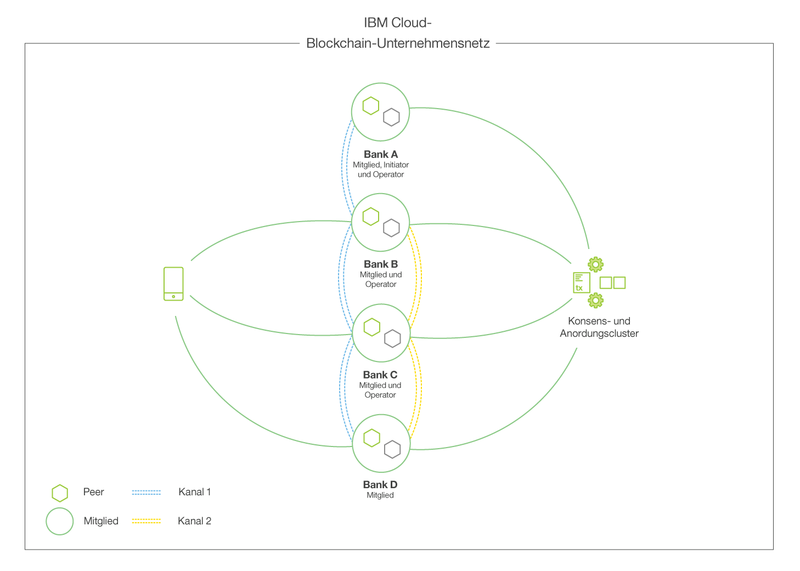

---

copyright:
  years: 2017
lastupdated: "2017-08-24"

---

{:new_window: target="_blank"}
{:shortdesc: .shortdesc}
{:screen: .screen}
{:codeblock: .codeblock}
{:pre: .pre}

# {{site.data.keyword.blockchainfull_notm}} Platform

**ACHTUNG:** Bevor Sie ein {{site.data.keyword.blockchainfull}}-Angebot verwenden, lesen Sie die technischen Angaben und Unterstützungsinformationen im Abschnitt [Haftungsausschluss](needtoknow.html).  
{:shortdesc}

Die {{site.data.keyword.blockchainfull_notm}} Platform ist die einzige integrierte und für den sofortigen Einsatz geeignete Plattform, die den gesamten Lebenszyklus (**Entwicklung**, **Steuerung** und **Betrieb**) eines organisationsübergreifenden Blockchain-Netzes umfasst.
Die Lösung wurde konzipiert, um die Einrichtung globaler, unternehmensgerechter Blockchain-Netze durch die Zusammenarbeit in allen Phasen zu beschleunigen, die Leistung und Sicherheit für die anspruchsvollsten Anwendungsfälle und regulierten Branchen bieten. Die {{site.data.keyword.blockchainfull_notm}}-Angebote basieren auf der Hyperledger Fabric V1.0-Codebasis und bieten dank ihrer modularen Architektur die für die Anforderungen Ihres Unternehmens erforderliche Sicherheit, Datenintegrität, Skalierbarkeit und Leistung.  

Im Folgenden werden die primären Aktivitäten und Rollen in einem {{site.data.keyword.blockchainfull_notm}}-Netz beschrieben und es wird gezeigt, wie sie in den Lebenszyklus eines Netzes passen.

**Hinweis**: Die nachfolgende Tabelle zeigt keine lineare Abfolge. Aufgaben wie Entwicklung und Netzmanagement müssen wiederholt ausgeführt werden, abhängig davon, wie sich die Anwendungen und die Mitgliederzahlen verändern.

|  Funktion     | Aktivitäten      | Rollen |
| ------------------------- |--------------------------|-----|
| [Entwicklung ](https://developer.ibm.com/blockchain/sandbox/) | Anwendungen entwickeln, Chaincode entwickeln | Anwendungsentwickler |
| [Steuerung](get_start.html)| Mitglieder einladen, Berechtigungsnachweise generieren, Governance-Modelle vorschlagen, Neue Mitglieder aufnehmen, Zertifikate und Endpunktinformationen verteilen | Netzoperatoren, Netzmitglieder |
| [Betrieb](v10_dashboard.html)| Zustand und Aktivität überwachen, Neue Bereitstellungen verwalten, Mitglieder verwalten (Hinzufügen/Entfernen), Chaincode-Lebenszyklus verwalten, Kanäle verwalten, Support | Netzoperatoren, Netzteilnehmer |
  
Die genannten Rollen und Aktivitäten werden im Folgenden näher beschrieben...

## **Entwicklung** des Netzes
Sie können die Blockchain-Entwicklung kennenlernen und beschleunigen und dabei von den Best Practices aus mehr als 400 Kundenprojekten (Client-Engagements) profitieren: 
* Gemeinsame Ausrichtung über Geschäftsbereiche hinweg - mit Technologie, die die Blockchain-Anwendungsentwicklungszeiten erheblich reduziert (in bestimmten Fällen kann die Entwicklungszeit von sechs Wochen auf weniger als zwei Tage verringert werden).
* Rascher Aufbau von Blockchain-Know-how unter Ihrem bestehenden Stamm von Programmierern durch die Nutzung der {{site.data.keyword.blockchainfull_notm}}-Entwicklertools.
* Flexibler Ansatz, bei dem die Entwickler in ihrer bevorzugten Umgebung Know-how aufbauen und Anwendungen entwickeln und dazu ein offenes und modernes Toolset verwenden können.  
  
Als Unternehmer können Sie Ihren Anwendungsfall mit Unterstützung der zahlreichen Branchen- und Blockchain-Experten von IBM bearbeiten, die über die {{site.data.keyword.blockchainfull_notm}} Garage erreichbar sind und die dort zusammenarbeiten, um das ganze Potenzial der IBM Blockchain Platform auszuschöpfen. 

Als Entwickler können Sie Geschäftsanforderungen schnell und einfach umsetzen und die Blockchain-Anwendungsentwicklung beschleunigen - und das ohne Kostenaufwand - mit einer cloudbasierten Sandbox und einer interaktiven Umgebung, die jeden Programmierer rasch zum Blockchain-Entwickler macht. 
Mit diesen Tools können Sie in Ihrer bevorzugten Umgebung Geschäftsregeln in Code umwandeln:
* **Online-Recherche**  
  Profitieren Sie von [Hyperledger Composer ](https://hyperledger.github.io/composer/introduction/introduction.html) - ein Open-Source-Entwicklungstool, mit dem Sie zentrale Blockchain-Konzepte kennenlernen, Netzdefinitionen erstellen und wiederverwendbare Branchenmodelle sowie Smart-Contract-Bibliotheken nutzen können. 
* **Lokale Installation**  
Nutzen Sie die IBM zertifizierten Images von Hyperledger Fabric and Composer, einem Open-Source-Framework zum Erstellen eines Unternehmensnetzes für Entwicklung und Test direkt auf Ihrem Laptop.
* **Zusammenarbeit in einer Cloudumgebung**  
  Kostenlose und gebührenpflichtige Optionen zur Entwicklung und gemeinsamen Nutzung Ihres Codes mit anderen.
  
Wenn Sie Ihr Unternehmensnetz entwickelt haben, können Sie es in einem Live-Netz auf der IBM Blockchain Platform anhand dieser [Anleitung](https://ibm-blockchain.github.io/platform-deployment/) bereitstellen.

## **Steuerung** des Netzes
Es gibt zwei Optionen für das Erstellen der Back-End-Umgebung Ihres Netzes. Entweder Sie können die veröffentlichten Hyperledger Docker-Images verwenden, wodurch Sie die Möglichkeit haben, die Composer-Bibliothek zu verwenden, um Ihre Anwendungen zu erstellen und mit dem Netz zu interagieren. Oder Sie können Chaincode nativ schreiben und den serverseitigen Code entwickeln, um Transaktionen auszuführen. Die lokale Ausführung eignet sich gut, verschiedene Netzkonfigurationen auszuprobieren, potenzielle Anwendungsfälle zu untersuchen und mit der Erarbeitung von Machbarkeitsnachweisen (Proof of Concept, PoC) zu beginnen. Wenn Ihr Machbarkeitsnachweis Gestalt gewinnt, können Sie die Implementierung durch das Hosting Ihres Netzes in der Cloud erweitern.

Bei einer Cloudbereitstellung erhalten Sie eine Reihe benutzerfreundlicher Anleitungen und Scripts, die die Bereitstellung eines Hyperledger Fabric-Netzes auf Kubernetes erleichtern. Verwenden Sie diese Phase, um das Verhalten und die Stabilität Ihres Machbarkeitsnachweises in einer gehosteten Umgebung zu prüfen. Der [{{site.data.keyword.blockchainfull_notm}}Container-Service](https://ibm-blockchain.github.io/) ist ein Testmechanismus für die Funktionalität und Ausfallsicherheit Ihrer Anwendung und somit ein natürlicher Vorläufer für den Enterprise Plan.

Wenn ein Netz eingerichtet wurde, bietet {{site.data.keyword.blockchainfull_notm}} einen Ansatz für das Netzmanagement, bei dem die Mitglieder eine gewisse Kontrolle erhalten, aber kein Mitglied die vollständige Kontrolle erhält. Die {{site.data.keyword.blockchainfull_notm}} Platform bietet das erste Set integrierter Tools, mit denen Teams das Änderungsmanagement des Netzes über anpassbare Richtlinien umsetzen können. 

Die folgende Liste zeigt die wichtigsten Features dieses Governance-Modells:

* Management-Tools für kollektives ("demokratisches") Management.
* Richtlinieneditor zur Definition flexibler, demokratischer Richtlinien, um Änderungen am Netz zu steuern.
* Vordefinierte Tools und Richtlinien zur Beschleunigung von Onboarding, Anpassung und Aktivierung.
* Workflow-Tool für mehrere Parteien mit integrierten Benachrichtigungen, einer Anzeige mit den Aktivitäten der Mitglieder und einer Sammlung sicherer Signaturen.

## **Betrieb** des Netzes
Sie können dezentrale Netze mit einem sofort einsatzbereiten und sicheren Service bereitstellen und betreiben. Starten Sie mit einer überschaubaren Lösung und passen Sie Ihr Netz flexibel an höhere Mitgliederzahlen und Transaktionsvolumen an, indem Sie folgende Features verwenden:

* Umgebung mit sehr hohem Sicherheitsniveau und mit zahlreichen Sicherheitsfeatures für Hardware, Firmware und Software.
* Robuste Architektur für Skalierbarkeit, Ausfallsicherheit und Verfügbarkeit.
* Optimierte Leistung und Ausführung auf den weltweit schnellsten Linux-Rechenressourcen.
  
Der Betrieb Ihres Netzes auf der {{site.data.keyword.blockchainfull_notm}} Platform umfasst Tools und Funktionen zur Vereinfachung administrativer Aufgaben:

* Dashboards für die Überwachung und das Management der Ressourcen im Netz. 
* Lebenszyklusmanagement für nahtlose Upgrades des vollständigen Code-Stack.
* Technische Unterstützung rund um die Uhr (24x7) - im Portal integriert.
* Robuster Sicherheitsstack ohne Zugriffsprivilegien, mit Malware- und Manipulationsschutz, 100-prozentiger Verschlüsselung und vielen weiteren Funktionen für Netze mit sensiblen Daten in regulierten Branchen.

## An einem Blockchain-Netz teilnehmen 

Der Begriff **Teilnehmer** wird hier weit gefasst und kann eine Organisation, eine Einzelperson, eine Anwendung oder ein Gerät bezeichnen, das mit dem Blockchain-Netz interagiert. Das Konzept "Teilnehmer" umfasst zwei unterschiedliche Gruppierungen – **Mitglieder** und **Benutzer**.   
 
Einfach ausgedrückt besitzt ein "Mitglied" ein gültiges digitales Zertifikat, das es ihm ermöglicht, Transaktionen in einem Blockchain-Netz auszugeben und/oder zu validieren. Ein "Benutzer" verfügt nicht über ein Zertifikat, aber er kann durch eines der vorhandenen Netzmitglieder mit dem Blockchain-Netz interagieren. Man kann sich das Zertifikat eines Mitglieds als "Mitgliedsausweis" (z. B. in einem Fitness-Club) vorstellen. Auch wenn ein Benutzer keinen solchen Mitgliedsausweis hat, kann er doch als "Gast" eines Mitglieds Zutritt erhalten. Im Folgenden sollen diese Rollen detaillierter beschrieben werden.

### Mitglieder 

Die {{site.data.keyword.blockchainfull_notm}} Platform basiert auf dem Hyperledger Fabric, bei dem es sich um eine "Permissioned Blockchain"-Technologie handelt. Alle Mitglieder werden im Netz mit einem Zertifikat eingetragen, das ihnen die Berechtigung gibt, das Netz als **Serviceanbieter** (z. B. Zertifikate erteilen, Transaktionen validieren/anordnen) oder als **Servicenutzer** (z. B. Transaktionen ausgeben) zu verwenden.   

- **Anbieter** - Ein Blockchain-Netz wird von seinen Mitgliedern betrieben. Damit ein Blockchain-Netz betrieben werden kann, muss es eine Mindestanzahl von Mitgliedern geben, die grundlegende Blockchain-Services *anbieten* (einschließlich Transaktionsvalidierung, Transaktionsanordnung und Zertifikatsmanagement). Durch die Ausführung dieser Services sorgen die Mitglieder für die Integrität des gemeinsam genutzten Hauptbuchs im Zentrum des Blockchain-Netzes. Es ergibt sich nun die Frage, wie viele Mitglieder für den Betrieb einer Blockchain erforderlich sind. Die Antwort hängt vom Vertrauensmodell des Netzes ab. Bestimmte Netze lassen ein zentralisiertes Vertrauensmodell zu, sodass weniger Mitglieder benötigt werden, die als Anbieter fungieren. Andere Netze erfordern eine stärker diversifizierte Mitgliedergruppe (z. B. rechtlich eigenständige Entitäten) und verwenden deshalb ein eher dezentralisiertes Vertrauensmodell. Ein Beispiel für ein stärker zentralisiertes Vertrauensmodell wäre ein Netz für eine transparente Supply-Chain, dessen Mitglieder ein globaler Einzelhändler, ein globaler Zustelldienst und IBM sind. In diesem Fall ermöglichen diese drei Mitglieder eine Vertrauensbasis ("Foundation of Trust") für das Netz und stellen die grundlegenden Services des Blockchain-Netzes bereit. Diese Mitglieder können Zertifikate für Importeure, Exporteure, Zollbeamte und Einzelhändler ausstellen, sodass diese am Netz teilnehmen (Transaktionen ausgeben) können. Dieses Netz kann das Vertrauensmodell dezentralisieren, indem mehr Mitglieder an der Bereitstellung der grundlegenden Services beteiligt werden, wodurch sichergestellt wird, dass alle Mitglieder Kontrolle erhalten, aber nicht ein einzelnes Mitglied die alleinige Kontrolle erhält. Ein typisches Netz hat etwa 10 Mitglieder, die die grundlegenden Blockchain-Services bereitstellen.

- **Nutzer** – Wenn eine Vertrauensbasis eingerichtet wurde, kann das Netz erweitert werden. Es ist durchaus üblich, dass die Mehrheit der Mitglieder in Ihrem Netz dieses nur nutzen, um Transaktionen für das verteilte Hauptbuch (Distributed Ledger) aufzurufen. Diese Mitglieder sind lediglich *Nutzer* und damit nicht an der Bereitstellung von grundlegenden Services für das Netz beteiligt. Ein typisches Netz hat zwischen 10 und 100 Mitglieder mit der Berechtigung, grundlegende Transaktionen im betreffenden Blockchain-Netz auszugeben.

#### Personae
 
Unter bestimmten Aspekten ist es zweckmäßig, ein Mitglied als Persona anzusehen, um die Rolle des Mitglieds in einem Unternehmensnetz zu beschreiben. Im Folgenden sind gängige Beispiele aufgeführt.
 
- **Initiator** – Ein Mitglied, das von anderen Mitgliedern dazu ausgewählt wurde, das Blockchain-Netz zu booten. Ein einzelnes Mitglied muss sich bei der IBM Blockchain Platform anmelden und bestimmte Aufgaben ausführen, um das Netz zu initiieren. Hierzu zählt das Benennen des Netzes, das Einladen der ersten Mitglieder und das Festlegen eines Standardsatzes von Richtlinien für den Netzbetrieb. Die Rolle ist nur vorübergehend gültig. Wenn das Netz gebootet wurde, verliert der Initiator die speziellen Berechtigungen und nimmt wieder die Rolle eines einfachen Mitglieds ein.  

- **Verwalter** – Ein Mitglied, das ein oder mehr Netzpeers und Zertifizierungsstellen ausführt. Diese Mitglieder sorgen für die Integrität des verteilten Hauptbuchs (Distributed Ledger), indem sie am Konsensprozess teilnehmen, der bestimmt, wie Transaktionen in einem Blockchain-Netz validiert werden. Der Verwalter hat als Eigentümer einer Zertifizierungsstelle auch die Möglichkeit, Zertifikate für Teilnehmer auszustellen und ihnen den Zugriff auf das Netz zu gewähren. 
 
- **Operator** – Ein Mitglied, das Services im Auftrag anderer Netzmitglieder ausführt (Transaktionsanordnungsservice, Zertifizierungsstellen, Transaktionsgateways und andere grundlegende Netzservices). Standardmäßig ist IBM der Netzoperator der Netze, die auf der IBM Blockchain Platform bereitgestellt werden.
 
- **Auditor** – Ein Mitglied, das vom Netz berechtigt wurde, Auditfunktionen im Netz auszuführen. Beispiele für Auditfunktionen gibt es in den Bereichen Rechnungsstellung, Konformitätsüberwachung oder Analyse. Die Auditorrolle bedeutet typischerweise, dass das Mitglied eine umfassendere Einsicht in die Transaktionen für das Hauptbuch erhält und/oder über eine umfassendere Eintragung bei Transaktionskanälen verfügt.

### Benutzer

In einem Blockchain-Netz mit Hunderten von Mitglieder kann es Tausende von Benutzern geben. Ein Benutzer ist ein Teilnehmer an einem Blockchain-Netz, der über eine "Vertrauensbeziehung" zu einem vorhandenen Mitglied indirekten Zugriff auf das Hauptbuch hat. Zum Beispiel ist es bei einigen mobilen Anwendungen üblich, eigene Schemen zur Benutzerauthentifizierung und -autorisierung (OAuth, OpenID) zu verwenden und diese Berechtigungsnachweise einem oder mehreren Mitgliedern mit entsprechendem Berechtigungsnachweis im Blockchain-Netz zuzuordnen. Normalerweise wird ein Proxy- oder Gateway-Service erstellt, um diese Zuordnungsfunktion auszuführen (wobei Außenwelt und Blockchain-Welt einander zugeordnet werden).

## Grundlegende Netzservices 

Um eine Blockchain betriebsbereit zu machen, sorgen die Mitglieder für eine entsprechende Vertrauensbasis (Foundation of Trust), indem sie ein oder mehrere grundlegende Netzservices ausführen: 

- **Anordnungsservice** – Transaktionen anordnen und synchronisieren  
  Im Grunde stellt der Anordnungsservice die Definition des Netzes dar. Er enthält Identitätsinformationen für jedes Mitglied, Informationen über Kanäle sowie einen Satz von Richtlinien, die bestimmen, welche Mitglieder berechtigt sind, bestimmte Aufgaben auszuführen (andere Mitglieder einladen, Kanäle erstellen usw.). Jede Transaktion und Konfigurationsoperation durchläuft den Anordnungsservice, d. h., es handelt sich um einen zentralen Bestandteil im Gesamtablauf. Angesichts der grundlegenden Bedeutung des Anordnungsservice sind die Risiken leicht erkennbar, die in einer autoritären Orchestrierung liegen, bei der ein einzelnes Mitglied alle Festlegungen alleine trifft. Um dem entgegenzuwirken, wird der Anordnungsservice von mehreren Mitgliedern des Netzes gemeinsam verwaltet und Governance-Implementierungen werden ebenfalls gemeinsam entwickelt. Anders ausgedrückt: Entscheidungen werden gemeinsam getroffen, nicht von Einzelpersonen. Alle Mitglieder haben ein Interesse am Netz und können deshalb auch bei Konfigurations- und Anpassungsoperationen mitbestimmen, die sie betreffen. Diese Vorstellungen von "Demokratie" und gemeinsam getroffenen Entscheidungen sind integrale Bausteine für ein vertrauenswürdiges und dezentrales Netz. IBM fungiert als "Operator" des Anordnungsservice für alle Netze, die auf der IBM Blockchain Platform bereitgestellt wurden.
 
- **Zertifizierungsstelle** – Zertifikate für Teilnehmer ausstellen  
  Einfach ausgedrückt ermöglicht die Zertifizierungsstelle (CA) die Mitgliedschaft. Alle Entitäten im Netz (Peers, Anordnungsknoten, Clients usw.) müssen eine Identität haben, um kommunizieren, sich authentifizieren und letztlich Transaktionen ausführen zu können. Diese "Identitäten" liegen in der Form von x509-Zertifikaten (d. h. Eintragungszertifikaten) vor, die für jede direkte Beteiligung am Blockchain-Netz erforderlich sind. Es gibt auch Möglichkeiten zur indirekten Beteiligung, worauf später noch eingegangen wird. Die Zertifizierungsstelle hat die Funktion eines "Stempels" zur Beglaubigung. Jedes Mitglied verfügt über eine eigene Zertifizierungsstelle. Durch diese Zertifizierungsstelle können Zertifikate nicht nur für ihre eigenen Komponenten (Peers) signieren, sondern auch für andere Clients und Anwendungen. Sie können sich die Zertifizierungsstelle eines Mitglied wie einen speziellen Stift oder einen Notarstempel vorstellen. Ein von dieser Zertifizierungsstelle signiertes Zertifikat wird für den Zugriff auf das Netz vorausgesetzt.
 
- **Peer** – Transaktionen validieren/bewilligen  
  Der Peer hat zwei Hauptfunktionen: Transaktionen ausführen/validieren und Hauptbücher verwalten. Der Peer führt sogenannte Smart Contracts aus und enthält die Transaktionshistorie und den aktuellen Status der Assets auf den Netzkanälen. Letztlich geht es um den Zugriff auf den Peer (direkt oder indirekt) und um das Ausführen von Lese- und Schreibvorgängen für das Hauptbuch. Wenn ein Mitglied einem Benutzer den Zugriff auf das Netz gewährt, dann handelt es sich eigentlich um den Zugriff auf die Funktionalität des Peers.

Wenn ein Mitglied dem Netz über die {{site.data.keyword.blockchainfull_notm}} Platform beitritt, wird standardmäßig ein Peer und eine Zertifizierungsstelle ausgegeben. Bei einem Produktionsnetz wollen die Mitglieder in der Regel mehrere Instanzen dieser Services ausführen, um die Verfügbarkeit sicherzustellen. Standardmäßig führt IBM den Anordnungsservice für Netze aus, die von der {{site.data.keyword.blockchainfull_notm}} Platform erstellt wurden.  

## {{site.data.keyword.blockchainfull_notm}} Platform

Die {{site.data.keyword.blockchainfull_notm}} Platform stellt ein sehr sicheres, genehmigtes Blockchain-Netz bereit, in dem authentifizierte Mitglieder Assets leicht definieren und die Geschäftslösungen für deren Änderung und Austausch erstellen können. Dies erspart den mühsamen und komplizierten Bootstrap-Prozess für ein produktionsfähiges Blockchain-Netz. 
Mit der {{site.data.keyword.blockchainfull_notm}} Platform können Sie die Vorteile eines Frameworks zur Orchestrierung nutzen, in dem Sie **Ihr Konsortium in kürzester Zeit in ein aktives Blockchain-Netz organisieren** können. IBM bietet für Konsortien geeignete Tools, die es Institutionen erleichtern, sich zusammenzuschließen und ein demokratisch gesteuertes Netz zu erstellen. Die Erstellungs-, Governance- und Managementaufgaben des Netzes werden durch einen integrierten Dashboard-Monitor und Dienstprogramme intuitiver und transparenter gestaltet. Anstelle der umständlichen Prozesse der Netzerstellung und Governance-Implementierung können sich Mitglieder von Konsortien **auf die Bereitstellung von Smart Contracts und die Übertragung von Assets und Informationen konzentrieren**.      
{:shortdesc}

Die **hohe Verfügbarkeit** der integralen Komponenten des Netzes (Peers, Anordnungsservice, Zertifizierungsstelle, Chaincode) eliminiert die lähmenden Effekten, die durch Single Points of Failure entstehen können. Eine integrierte Dashboard-Überwachung sorgt für ein einfaches Management dieser Komponenten und stellt einen leistungsfähigen Mechanismus für die Visualisierung von Assets und Smart Contracts bereit.

Die **Modularität** der Hyperledger Fabric V1.0-Architektur und die klare Trennung von Netzrollen liefert eine Infrastruktur, die eine hohe Skalierbarkeit und die Anpassung an zahlreiche Anwendungsfälle ermöglicht. 

Die Überprüfungen und Ausgleichungen, die während des Lebenszyklus einer Transaktion auftreten, führen zu konsistenten und vollständig überprüften Ergebnissen und die Hauptbücher bleiben während der Implementierung des gängigen Gossip-Protokolls durchgehend synchron. Die Identitäts- und Zugriffssteuerung wird ohne großen Aufwand mit **sign/verify**-Operationen durchgesetzt, die fortlaufend im Netz durchgeführt werden.  

Mit **Governance-Tools** können Mitglieder die kritischen Geschäftsregeln für ihr Netz verwalten. Beispielsweise können Sie eine Richtlinie implementieren, die festlegt, wie viele Mitglieder eines Netzes dem Beitritt eines neuen Mitglieds zustimmen müssen. Oder es gibt ein Asset, das von jedem Teilnehmer bewilligt werden muss, damit eine Änderung vorgenommen werden kann. Governance-Regeln sind von grundlegender Bedeutung für alle Unternehmensnetze und sind häufig sehr umfangreich. Governance-Tools (z. B. Richtlinieneditoren) vereinfachen diesen Prozess in hohem Maße.

Der Service wird in einer **extrem sicheren und isolierten** Umgebung ohne externen Zugriff (einschließlich Rootzugriff) auf Netzkomponenten ausgeführt. Daten werden bei der Ausführung und im Ruhezustand verschlüsselt und Module zur Hardwaresicherheitsunterstützung sorgen dafür, dass digitale Schlüssel in Übereinstimmung mit branchenspezifischen Vorschriften geschützt werden. Hardwarevirtualisierung wird verwendet, um die einzelnen Knoten in einer isolierten Umgebung auszuführen. Dadurch werden andere Knoten im Netz vor Peers mit möglicherweise nicht regelkonformem oder schädlichem Chaincode geschützt. Hashing, Operationen zum Signieren/Verifizieren und die Kommunikation zwischen Komponenten werden dank erweiterter Verschlüsselungsimplementierungen beschleunigt.

Im Folgenden wird eine einfache Konfiguration in der {{site.data.keyword.blockchainfull_notm}} Platform gezeigt. **Abbildung 1** zeigt ein Beispiel eines bereitgestellten Blockchain-Netzes bestehend aus vier Mitgliedern (mit jeweils zwei Peers), einer Zertifizierungsstelle, die für das Verteilen kryptografischer Identitätsmaterialien zuständig ist, und einem Anordnungsservice, der Richtlinien und Netzteilnehmer definiert. Der blaue Kanal enthält alle vier Mitglieder, während der gelbe Kanal auf drei Mitglieder beschränkt ist: Außerdem ist zu erkennen, dass Bank A die Rolle des Netzinitiators hatte und Bank D nur als Mitglied im Kontext des gelben Kanals vorhanden ist. Schließlich kann ein Endbenutzer oder eine Anwendung mit einem ordnungsgemäß unterzeichneten x509-Zertifikat Aufrufe an Peers im Netz senden. Wie bereits erwähnt, ist es durchaus möglich, dass ein Endbenutzer gar nicht bemerkt, dass es ein Blockchain-Netz gibt. 

*Abbildung 2. Ein Blockchain-Beispielnetz bestehend aus vier Mitgliedern, die Kanäle zum Isolieren von Daten nutzen*

## {{site.data.keyword.IBM_notm}} Mitgliedschaftsangebote

In der folgenden Tabelle sind die aktuellen und zukünftigen Mitgliedschaftsoptionen aufgeführt. Der [Enterprise Plan](enterprise_plan.html) ist die aktuell verfügbare Mitgliedschaftsoption.

|       | Entry      | [Enterprise](enterprise_plan.html)  | Enterprise Plus | Self Managed
| ------------------------- |--------------------------|-----|-----|------|
| **Inhalt** | Service-Levels (Basis)| **Service-Levels (Erweitert), bereit für Produktionseinsatz** | Dedizierte Rechenressourcen für Leistung und Isolation | Software-Stack zur Installation in Ihrer Infrastruktur + Verbindung zu einem Netz (auf diesem Cloud-Service gehostet) |
| **Abrechnungsmodell** | Auf Stundenbasis | **Monatliche Subskription** | Monatliche Subskription | Monatliche Subskription |
| **Verfügbarkeit** | In Kürze verfügbar | **Bereits verfügbar** | In Kürze verfügbar | Geplant für 2018 |

Melden Sie sich jetzt für die [{{site.data.keyword.blockchainfull_notm}}-Mitgliedschaft ](https://console.bluemix.net/catalog/services/blockchain?env_id=ibm:yp:us-south&taxonomyNavigation=apps) an!

## {{site.data.keyword.IBM_notm}} Support 

{{site.data.keyword.IBM_notm}} bietet Support für von {{site.data.keyword.IBM_notm}} implementierte {{site.data.keyword.blockchain}}-Lösungen. 
Weitere Informationen zum {{site.data.keyword.blockchainfull_notm}}-Support finden Sie unter [Support anfordern](ibmblockchain_support.html).

Umfassende Informationen zu allen Hyperledger Fabric v1.0-Features und -Funktionen finden Sie in der
[Hyperledger Fabric-Dokumentation ](http://hyperledger-fabric.readthedocs.io/en/latest/).
