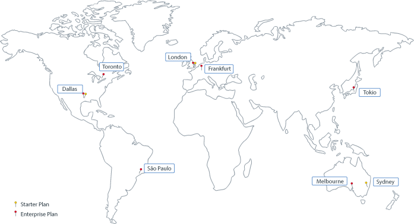

---

copyright:
  years: 2017, 2018
lastupdated: "2019-03-05"

subcollection: blockchain

---

{:new_window: target="_blank"}
{:shortdesc: .shortdesc}
{:screen: .screen}
{:pre: .pre}
{:table: .aria-labeledby="caption"}
{:codeblock: .codeblock}
{:tip: .tip}
{:download: .download}

# Standorte von {{site.data.keyword.blockchainfull_notm}} Platform
{: #ibp-regions-locations}

{{site.data.keyword.cloud}} wird weltweit an verschiedenen Standorten gehostet. Bei den Standorten handelt es sich um Rechenzentren in einem geografischen Bereich, die über einen Endpunkt zugänglich sind. {{site.data.keyword.blockchainfull_notm}} Platform bietet Mitgliedschaftspläne innerhalb von {{site.data.keyword.cloud_notm}} an, die auf globale Standorte bezogen sind. Wenn Sie eine {{site.data.keyword.blockchainfull_notm}} Platform-Serviceinstanz in {{site.data.keyword.cloud_notm}} erstellen, werden Blockchain-Netz und Netzressourcen an dem {{site.data.keyword.cloud_notm}}-Standort erstellt, an dem Sie die Serviceinstanz erstellen.
{:shortdesc}

Die {{site.data.keyword.blockchainfull_notm}} Platform-Angebote variieren je nach {{site.data.keyword.cloud_notm}}-Standort. Sie können Blockchain-Netze nur in {{site.data.keyword.cloud_notm}}-Standorten erstellen, in denen Mitgliedschaftspläne für {{site.data.keyword.blockchainfull_notm}} Platform verfügbar sind.

In Tabelle 1 und Abbildung 1 sind die {{site.data.keyword.cloud_notm}}-Regionen und -Standorte zu sehen, die von {{site.data.keyword.blockchainfull_notm}} Platform unterstützt werden.

| Standort | Starter Plan | Enterprise Plan |
|--------|----------|----------|
| Dallas | J | J |
| London | J | J |
| Tokio |  | J |
| Frankfurt |  | J |
| Sydney | J |  |
| São Paulo |  | J |
| Toronto |  | J |

_Tabelle 1. Standorte in {{site.data.keyword.blockchainfull_notm}} Platform_

  
_Abbildung 1. Standorte in {{site.data.keyword.blockchainfull_notm}} Platform_
