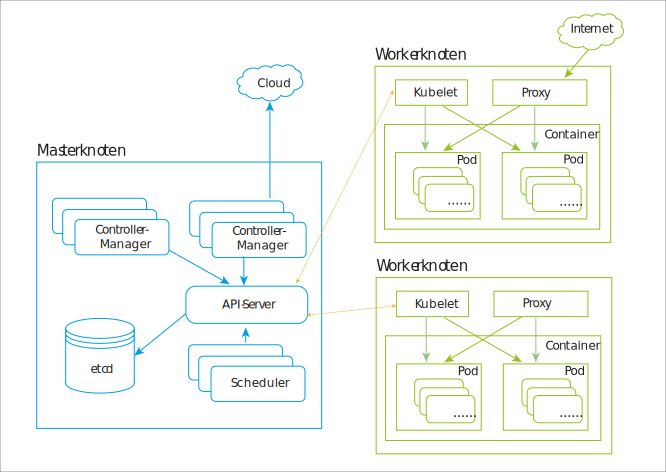

---

copyright:
  years: 2019
lastupdated: "2019-04-17"

subcollection: blockchain

---

{:new_window: target="_blank"}
{:shortdesc: .shortdesc}
{:screen: .screen}
{:codeblock: .codeblock}
{:note: .note}
{:important: .important}
{:tip: .tip}
{:pre: .pre}

# Kubernetes
{: #k8s-overview}

Die kostenlose Betaversionskonsole {{site.data.keyword.blockchainfull_notm}} Platform 2.0 wird in einem Kubernetes-Cluster bereitgestellt, und zwar über den {{site.data.keyword.cloud_notm}} Kubernetes-Service. Bei Kubernetes handelt es sich um ein Open-Source-System zur Automatisierung der Bereitstellung, zur Skalierung sowie zur Verwaltung containerisierter Anwendungen.
{:shortdesc}

Kubernetes stellt eine containerorientierte Verwaltungsumgebung bereit. Es werden Datenverarbeitung, Netzbetrieb und Speicherinfrastruktur für Benutzerworkloads koordiniert. Dabei wird die Einfachheit von PaaS (Platform as a Service) mit der Flexibilität von IaaS (Infrastructure as a Service) kombiniert und die Portierbarkeit infrastrukturproviderübergreifend ermöglicht.

Im folgenden Diagramm wird die Architektur von Kubernetes erläutert. Weitere Erläuterungen zu Knoten, Containern und Pods finden Sie im Abschnitt [Zentrale Kubernetes-Objekte](#k8s-overview-key-obj) weiter unten.

*Abbildung 1. Kubernetes-Architekturdiagramm*

## {{site.data.keyword.cloud_notm}} Kubernetes-Service
{: #k8s-overview-iks}

Der {{site.data.keyword.cloud_notm}} Kubernetes-Service stellt leistungsfähige Tools bereit und kombiniert dabei Docker-Container, die Kubernetes-Technologie, eine intuitive Funktionalität für Benutzer mit integrierter Sicherheit und Isolation, um die Bereitstellung, den Betrieb, die Skalierung sowie die Überwachung containerisierter Apps in einem Cluster von Rechenhosts zu automatisieren.

Weitere Informationen zum {{site.data.keyword.cloud_notm}} Kubernetes-Service finden Sie in den folgenden Themen der Dokumentation zum {{site.data.keyword.cloud_notm}} Kubernetes-Service:
- [Technologie des {{site.data.keyword.cloud_notm}} Kubernetes-Service](/docs/containers/cs_tech.html#ibm-cloud-kubernetes-service-technology "Dokumentation zur Technologie des {{site.data.keyword.cloud_notm}} Kubernetes-Service")
- [Warum {{site.data.keyword.cloud_notm}} Kubernetes-Service ](/docs/containers?topic=containers-cs_ov#cs_ov "Dokumentation 'Warum {{site.data.keyword.cloud_notm}} Kubernetes-Service'")
- [Kubernetes-Strategie definieren ](/docs/containers?topic=containers-strategy#strategy "Kubernetes-Strategie definieren")

## Zentrale Kubernetes-Objekte
{: #k8s-overview-key-obj}

- **Cluster**

  Eine Gruppe von Maschinen, die als Knoten bezeichnet werden und containerisierte Anwendungen ausführen, die von Kubernetes verwaltet werden. Ein Cluster verfügt über mehrere Workerknoten und mindestens einen Masterknoten.

- **Knoten**

  Ein Knoten ist eine Workermaschine in Kubernetes. Bei einem Knoten kann es sich in Abhängigkeit vom Cluster um eine VM oder um eine physische Maschine handeln. Jeder Knoten enthält die Services, die für die Ausführung von Pods erforderlich sind; er wird von den Masterkomponenten verwaltet. Zu den Services auf einem Knoten gehört die Containerlaufzeit (`kubelet` und `kube-proxy`). Weitere Informationen finden Sie im Abschnitt zu den [Kubernetes-Knoten ](https://kubernetes.io/docs/concepts/architecture/nodes/ "Kubernetes-Knoten") in der Kubernetes-Dokumentation.

- **Container**

  Ein einfaches und portierbares ausführbares Image mit Software und allen zugehörigen Abhängigkeiten. Container entkoppeln Anwendungen von der zugrunde liegenden Hostinfrastruktur, um die Bereitstellung in verschiedenen Cloud- oder Betriebssystemumgebungen zu vereinfachen und um die Skalierung zu vereinfachen.

- **Pod**

  Das kleinste und einfachste Kubernetes-Objekt. Ein Pod stellt eine Gruppe von aktiven Containern in Ihrem Cluster dar. Ein Pod ist in der Regel so konfiguriert, dass er einen einzigen primären Container ausführen kann. Ein Pod kann außerdem optionale Sidecar-Container ausführen, über die ergänzende Features wie die Protokollierung hinzugefügt werden. Pods werden allgemein durch eine Bereitstellung verwaltet. Weitere Informationen finden Sie im Abschnitt zu den [Kubernetes-Pods ](https://kubernetes.io/docs/concepts/workloads/pods/pod/) in der Kubernetes-Dokumentation.
