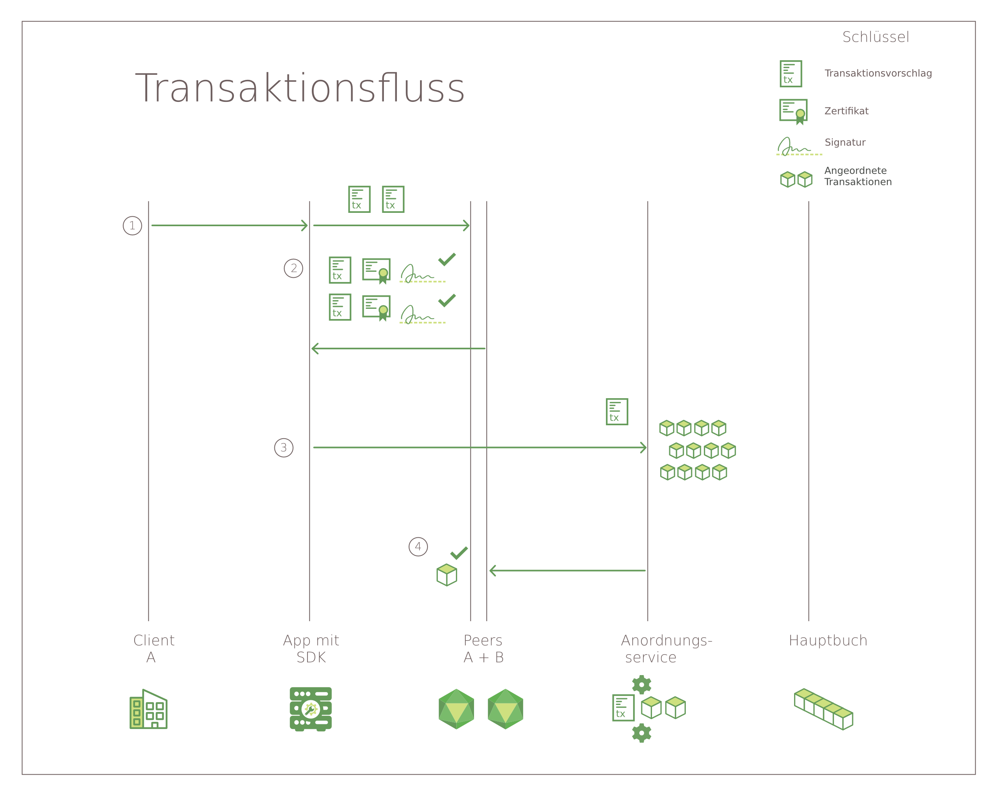

---

copyright:
  years: 2017, 2019
lastupdated: "2019-03-05"

subcollection: blockchain

---

{:new_window: target="_blank"}
{:shortdesc: .shortdesc}
{:codeblock: .codeblock}
{:screen: .screen}
{:pre: .pre}

# Hyperledger Fabric
{: #hyperledger-fabric}

Das {{site.data.keyword.blockchainfull}}-Netz basiert auf dem Hyperledger Fabric-Stack, einem der Blockchain-Projekte im Hyperledger Project der Linux Foundation. Dabei handelt es sich um ein "genehmigtes" Netz, in dem alle Benutzer und Komponenten bekannte Identitäten haben. An jeder Nahtstelle in der Kommunikation ist Signatur-/Verifizierungslogik implementiert und über die Transaktionen wird durch eine Reihe von Bewilligungs- und Validierungsprüfungen entschieden. Somit bestehen große Unterschiede zu herkömmlichen Blockchain-Implementierungen, die Anonymität unterstützen und auf Kryptowährungen und hohe Rechenleistung angewiesen sind, um Transaktionen zu validieren.
{:shortdesc}

Hyperledger Fabric bietet eine modulare Architektur zur Erhöhung von Skalierbarkeit und Leistung an. In diesem Abschnitt werden einige wichtige Komponenten von Hyperledger Fabric vorgestellt. Eine vollständige Einführung in Hyperledger Fabric finden Sie in der [Hyperledger Fabric-Dokumentation ](http://hyperledger-fabric.readthedocs.io/en/release-1.4/){:new_window}.

## Peers
{: #hyperledger-fabric-peer}

Physisch gesehen besteht ein Blockchain-Netz primär aus Peerknoten (kurz "Peers" genannt). Peers sind ein grundlegendes Element des Netzes, da sie Ledger und Smart Contracts hosten (die in so genannten ["Chaincodes" ](https://hyperledger-fabric.readthedocs.io/en/release-1.4/developapps/chaincodenamespace.html "Chaincode namespace") enthalten sind). Genauer gesagt hosten die Peers **Instanzen** des Ledgers und **Instanzen** von Smart Contracts. Da Smart Contracts und Ledgers eingesetzt werden, um die gemeinsam genutzten Prozesse bzw. Informationen in einem Netz zu kapseln, sind diese Aspekte eines Peers ein guter Ansatzpunkt für das Verständnis dessen, was ein Fabric-Netz eigentlich ausführt.

Weitere spezielle Informationen zu Peers enthält das [Dokument über Peers](https://hyperledger-fabric.readthedocs.io/en/release-1.4/peers/peers.html) in der Dokumentation der Fabric-Community.

## Zertifizierungsstelle (CA)
{: #hyperledger-fabric-certificate-authority}

Als Plattform für **genehmigte** Blockchain-Netze enthält Hyperledger Fabric eine modulare **CA-Komponente** (Zertifizierungsstelle) für das Management der Netzidentitäten aller Mitgliedsorganisationen und ihrer Benutzer. Die Voraussetzung einer genehmigten Identität für jeden Benutzer ermöglicht eine ACL-basierte Steuerung der Netzaktivität und stellt sicher, dass jede Transaktion letztlich auf einen registrierten Benutzer zurückgeführt werden kann.
* Die CA gibt ein Stammzertifikat (**rootCert**) an jedes **Mitglied** (Organisation oder Einzelperson) aus, das zur Teilnahme am Netz berechtigt ist.
* Die CA gibt auch ein Eintragungszertifikat (**eCert**) an alle Mitgliedskomponenten, serverseitigen Anwendungen und gelegentlich an Benutzer aus.
* Jeder eingetragene Benutzer erhält auch eine Zuordnung von Transaktionszertifikaten (**tCerts**). Jedes **tCert** dient zur Berechtigung einer Netztransaktion.

Diese zertifikatbasierte Steuerung der Netzmitgliedschaft und Aktionen gibt Mitgliedern die Möglichkeit, den Zugriff auf private und vertrauliche Kanäle, Anwendungen und Daten durch bestimmte Benutzeridentitäten einzuschränken.

Weitere Informationen zur CA-Komponente von Hyperledger Fabric finden Sie in der Veröffentlichung [Fabric CA User’s Guide ](https://hyperledger-fabric-ca.readthedocs.io/en/release-1.4/){:new_window}.

## Membership Service Provider
{: #hyperledger-fabric-membership-service-provider}

Hyperledger Fabric enthält eine Komponente **Membership Service Provider (MSP)**, die die Abstraktion aller kryptografischen Mechanismen und Protokolle ermöglicht, die der Ausgabe und Validierung von Zertifikaten sowie der Benutzerauthentifizierung zugrunde liegen. Die MSP-Komponente wird auf jedem Kanalpeer installiert, um sicherzustellen, dass Transaktionsanforderungen, die an den Peer ausgegeben werden, von einer authentifizierten und autorisierten Benutzeridentität stammen.

Weitere Informationen zur MSP-Komponente von Hyperledger Fabric finden Sie unter [Mitgliedschaft ](https://hyperledger-fabric.readthedocs.io/en/release-1.4/membership/membership.html){:new_window} in der [Hyperledger Fabric-Dokumentation ](http://hyperledger-fabric.readthedocs.io/en/release-1.4/){:new_window}.

## Anordnungsservice
{: #hyperledger-fabric-ordering-service}

In anderen verteilten Blockchains wie Ethereum und Bitcoin gibt es keine zentrale Autorität, die Transaktionen anfordert und an Peers aussendet. Hyperledger Fabric, die Blockchain, auf der {{site.data.keyword.blockchainfull_notm}} Plattform basiert, funktioniert anders. Hier gibt es einen Knoten, der **Anordnungsknoten** genannt wird.

Anordnungsknoten sind Schlüsselkomponenten in einem Netz, da sie einige wesentliche Funktionen ausführen:

- Sie übernehmen die **Anordnung** der Blöcke von Transaktionen, die an die Peers gesendet werden, um sie in die Ledgers zu schreiben. Dieser Prozess wird als "Anordnung" bezeichnet. Wenn diese Transaktionen stattdessen bei den Peers selbst gebündelt und angeordnet würden, würde dies die Möglichkeit erhöhen, dass ein Peer eine Transaktion in den zugehörigen Ledger schreibt, während dies bei einem anderen Peer nicht der Fall war. Dies könnte zu einer Statusverzweigung führen.
- Sie verwalten den **Anordnungsknoten-Systemkanal**, d. h., die Position, an der das **Konsortium**, die Liste der Peer-Organisationen, die Kanäle erstellen dürfen, gespeichert ist.
- Sie führen wichtige Identitätsvalidierungsprüfungen durch. Wenn eine Organisation beispielsweise versucht, einen Kanal zu erstellen, obwohl sie kein Mitglied des Konsortiums des Anordnungsknotens ist, wird die Anforderung zurückgewiesen. Anordnungsknoten validieren auch das Verhalten in Transaktionskanälen, wie z. B. die Berechtigungen zum Ändern einer Kanalkonfiguration.

Hyperledger Fabric unterstützt derzeit sowohl SOLO (ein Anordnungsknoten) als auch Kafka-basierte Anordnungsservice-Bereitstellungen. Weitere Informationen zum Hyperledger Fabric-Anordnungsservice finden Sie unter [Bringing up a Kafka-based Ordering Service ](http://hyperledger-fabric.readthedocs.io/en/release-1.4/kafka.html){:new_window} in der [Hyperledger Fabric-Dokumentation ](http://hyperledger-fabric.readthedocs.io/en/release-1.4/){:new_window}.

## Die Fabric-SDKs
{: #hyperledger-fabric-fabric-sdks}

Mit den Hyperledger Fabric-SDKs können Anwendungsentwickler Anwendungen erstellen, die mit einem Blockchain-Netz interagieren. Mit den SDKs können Anwendungen den Lebenszyklus von Kanälen und Chaincode leichter verwalten.

Hyperledger Fabric stellt SDKs sowohl für Node.js als auch Java zur Verfügung und bietet die folgenden Funktionen zur Interaktion mit dem Blockchain-Netz:

* Registrieren und Eintragen von Benutzern
* Erstellen von Kanälen
* Zuordnen von Peers zu einem Kanal
* Aktualisieren einer Systemkanal- oder Anwendungskanalkonfiguration
* Installieren von Chaincode auf Peers
* Instanziieren von Chaincode auf einem Kanal
* Upgrade von Chaincode auf einem Kanal
* Aufrufen von Chaincode-Funktionen zur Aktualisierung des Ledgers
* Abfragen des Ledgers in Bezug auf bestimmte Transaktionen, Blöcke oder Schlüssel
* Überwachen von Ereignissen auf einem Kanal (z. B. erfolgreiche Festschreibung einer Transaktion)

Weitere Informationen zu Fabric-SDKs finden Sie unter [Hyperledger Fabric-SDKs ](http://hyperledger-fabric.readthedocs.io/en/release-1.4/fabric-sdks.html){:new_window} in der [Hyperledger Fabric-Dokumentation ](http://hyperledger-fabric.readthedocs.io/en/release-1.4/){:new_window}.

## Transaktionsfluss
{: #hyperledger-fabric-transaction-flow}

Zur Sicherstellung der Datenkonsistenz und -integrität implementiert Hyperledger Fabric mehrere Prüfpunkte im Transaktionsfluss, zu denen Clientauthentifizierung, Bewilligung, Anordnung und Festschreibung im Ledger gehören.

**Abbildung 1** beschreibt den Transaktionsfluss in einem Hyperledger Fabric-Blockchain-Netz:

*Abbildung 1. Transaktionsfluss in einem Hyperledger Fabric-Netz*

In einem Hyperledger Fabric-Netz wird der Datenfluss für Abfragen und Transaktionen von einer clientseitigen Anwendung initiiert, die eine Transaktionsanforderung an einen Peer auf einem Kanal übergibt. Der erste Datenfluss über das Netz gilt für Abfragen und Transaktionen gemeinsam:

1. Mit den im SDK enthaltenen APIs signiert und übergibt eine Clientanwendung einen Transaktionsvorschlag an die entsprechenden bewilligenden Peers auf dem angegebenen Kanal. Dieser erste Transaktionsvorschlag ist eine **Anforderung** für eine Bewilligung.
2. Jeder Peer auf dem Kanal überprüft die Identität und Berechtigung des übergebenden Clients und (falls gültig) führt den angegebenen Chaincode für die übergebenen Eingaben aus. Auf der Grundlage der Transaktionsergebnisse und der Bewilligungsrichtlinie für den aufgerufenen Chaincode gibt jeder Peer eine signierte Antwort YES oder NO an die Anwendung zurück. Jede signierte Antwort YES ist eine **Bewilligung** der Transaktion.

	An diesem Punkt im Transaktionsfluss verzweigt sich der Prozess für Abfragen und Transaktionen. Wenn der Vorschlag eine Abfragefunktion im Chaincode aufgerufen hat, gibt die Anwendung die Daten an den Client zurück. Wenn der Vorschlag eine Funktion im Chaincode zum Aktualisieren des Ledgers aufgerufen hat, wird die Anwendung mit den folgenden Schritten fortgesetzt:
3. Die Anwendung leitet die Transaktion, die den Lese-/Schreibsatz und die Bewilligungen umfasst, an den **Anordnungsservice**weiter.
4. Die Transaktion wird dann an den Anordnungsservice übermittelt. Alle Kanalpeers validieren jede Transaktion im Block, indem Sie die Chaincode-spezifische Prüfrichtlinie anwenden und einen 'Concurrency Control Version Check' ausführen.
	* Alle Transaktionen, die den Validierungsprozess nicht bestehen, werden im Block als ungültig markiert und der Block wird an den Ledger des Kanals angehängt.
	* Alle gültigen Transaktionen aktualisieren die Statusdatenbank entsprechend mit den geänderten Schlüssel/Wert-Paaren.

Das **Gossip-Datenverteilungsprotokoll** überträgt kontinuierlich Ledgerdaten über den Kanal, um sicherzustellen, dass die Ledger zwischen den Peers synchronisiert sind. Weitere Informationen finden Sie im Abschnitt zum [Gossip-Datenverteilungsprotokoll ](http://hyperledger-fabric.readthedocs.io/en/release-1.4/gossip.html){:new_window} in der [Hyperledger Fabric-Dokumentation ](http://hyperledger-fabric.readthedocs.io/en/release-1.4/){:new_window}.

Eine Schritt-für-Schritt-Einführung in den Transaktionsfluss finden Sie unter [Transaction Flow ](http://hyperledger-fabric.readthedocs.io/en/release-1.4/txflow.html){:new_window} in der [Hyperledger Fabric-Dokumentation ](http://hyperledger-fabric.readthedocs.io/en/release-1.4/){:new_window}.
