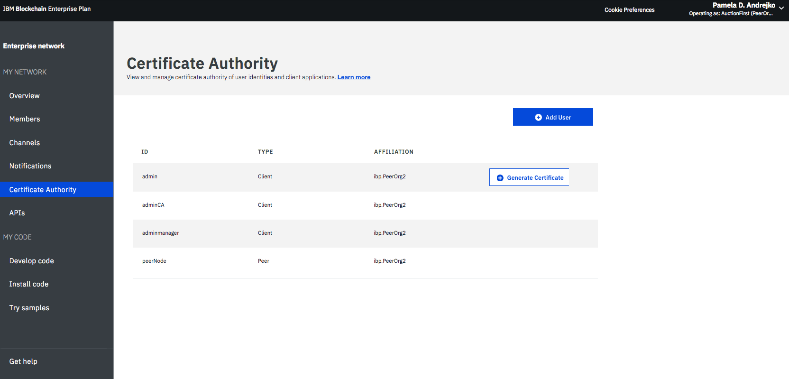

---

copyright:
  years: 2017, 2018
lastupdated: "2018-08-31"

---

{:new_window: target="_blank"}
{:shortdesc: .shortdesc}
{:codeblock: .codeblock}
{:screen: .screen}
{:pre: .pre}

# Enterprise Plan-Netz betreiben
{: #v10_dashboard}

***[Ist diese Seite hilfreich? Teilen Sie uns Ihre Meinung mit.](https://www.surveygizmo.com/s3/4501493/IBM-Blockchain-Documentation)***

{{site.data.keyword.blockchainfull}} Platform enthält einen Network Monitor, der eine Übersicht über Ihre Blockchain-Umgebung, einschließlich Netzressourcen, Mitgliedern, zugeordneter Kanäle, Transaktionsleistungsdaten und bereitgestelltem Chaincode, zur Verfügung stellt. Der Network Monitor stellt auch den Eingangspunkt zur Ausführung von Swagger-APIs dar. Sie können ein Netz mit {{site.data.keyword.blockchainfull_notm}} Platform: Develop entwickeln und Beispielanwendungen ausprobieren.
{:shortdesc}

Sie können im Network Monitor [den Namen des Enterprise Plan-Netzes ändern](#ep-network-name).

Der Network Monitor präsentiert die folgenden Anzeigen in drei Abschnitten. Sie können über den Navigator auf der linken Seite zu jeder Anzeige im Network Monitor navigieren.
- Der Abschnitt **Eigenes Netz** enthält die Anzeigen "[Übersicht](#overview)", "[Mitglieder](#members)", "[Kanäle](#channels)", "[Benachrichtigungen](#notifications)", "[Zertifizierungsstelle](#ca)" und "[APIs](#apis)".
- Der Abschnitt **Eigener Code** enthält die Anzeigen "[Code entwickeln](#write_code)", "[Code installieren](#chaincode)" und "[Beispiele ausprobieren](#samples)".
- Die Anzeige "[Hilfe anfordern](#support)" zeigt Unterstützungsinformationen und Releaseinformationen für Helios und Hyperledger Fabric (die Codebasis von {{site.data.keyword.blockchainfull_notm}} Platform) an.

Über das Dropdown-Menü in der rechten oberen Ecke im Network Monitor können Sie die [Netzvorgaben überprüfen und konfigurieren](#network-preferences).

In diesem Lernprogramm werden die oben aufgeführten Anzeigen und Funktionen beschrieben.

## Netznamen aktualisieren
{: #ep-network-name}

Wenn Sie ein Enterprise Plan-Netz erstellen, weist {{site.data.keyword.blockchainfull_notm}} Platform dem Netz einen Namen zu. Sie können diesen Netznamen jedoch zu jedem beliebigen Zeitpunkt im Network Monitor aktualisieren.

Klicken Sie oben im linken Navigator im Network Monitor auf den Netznamen. Damit wird die Datei bearbeitbar. Geben Sie den neuen Netznamen ein, den Sie verwenden möchten, und drücken Sie die **Eingabetaste**. Die Aktualisierung des Netznamens nimmt einige Sekunden in Anspruch.

**Abbildung 1** zeigt die Schritte zur Aktualisierung des Starter Plan-Netznamens vom zugewiesenen Namen in "Starter Plan Network".

*Abbildung 1. Netznamen aktualisieren*

## Übersicht
{: #overview}

Die Anzeige "Übersicht" zeigt Statusinformationen zu Blockchain-Ressourcen (einschließlich Anordnungs-, CA- und Peerknoten) in Echtzeit an. Jede Ressource wird unter vier unterschiedlichen Überschriften angezeigt: **Typ**, **Name**, **Status** und **Aktionen**. Bei der Erstellung des Blockchain-Netzes werden automatisch drei Anordnungsknoten und zwei Zertifizierungsstellenknoten (CA-Knoten) erstellt. Die Zertifizierungsstellen gehören zu einem bestimmten Mitglied, während die Anordnungsknoten allgemeine Endpunkte sind, die im gesamten Netz genutzt werden.

In **Abbildung 2** ist die Anzeige "Übersicht" zu sehen:

*Abbildung 2. Netzübersicht*

### Knotenaktionen
Unter der Überschrift **Aktionen** befinden sich Schaltflächen zum Starten oder Stoppen Ihrer Ressourcen. Sie können auch eine Gruppe von Knoten starten oder stoppen, indem Sie mehrere Knoten auswählen und dann auf **Ausgewählte starten** oder **Ausgewählte stoppen** klicken. Die Schaltfläche **Ausgewählte starten** oder **Ausgewählte stoppen** wird oben in der Tabelle angezeigt, wenn Sie einen oder mehrere Knoten auswählen.

Beachten Sie, dass die Stopp- und die Startaktion für einen Anordnungsknoten nicht verfügbar sind. Im Allgemeinen besteht keine Notwendigkeit, Peer- oder CA-Knoten in einem Netz zu stoppen oder zu starten. Die Stopp- und die Startaktion sind für den Fall vorhanden, dass Sie einen Peer erneut starten müssen, zum Beispiel um ihn in einem bereinigten Status verfügbar zu machen.

Sie können auch Komponentenprotokolle prüfen, indem Sie in der Dropdown-Liste unter der Überschrift **Aktionen** auf **Protokolle anzeigen** klicken. Die Protokolle zeigen die Aufrufe zwischen den verschiedenen Netzressourcen und sind für die Fehlersuche und -behebung von Nutzen. Probieren Sie dies zum Beispiel aus, indem Sie einen Peer stoppen und ihn als Ziel einer Transaktion auswählen. Dies führt zu Verbindungsfehlern in den Protokollen. Wenn Sie den Peer erneut starten und die Transaktion erneut versuchen, wird eine erfolgreiche Verbindung angezeigt. Sie können einen Peer auch für einen längeren Zeitraum inaktiv lassen, während über Ihre Kanäle weiterhin Transaktionen durchgeführt werden. Wenn der Peer wieder aktiviert wird, werden Sie eine Synchronisation des Ledgers bemerken, da der Peer die Blöcke empfängt, die festgeschrieben wurden, als er inaktiv war. Wenn das Ledger vollständig synchronisiert wurde, können Sie normale Aufrufe und Abfragen für das Ledger ausführen.

### Ferne Peers konfigurieren  

Wenn Sie einen fernen Peer außerhalb von {{site.data.keyword.cloud_notm}} bereitstellen, dann müssen Sie die Informationen zum API-Endpunkt Ihres Netzes für den fernen Peer während der Konfiguration angeben. Klicken Sie auf die Schaltfläche **Konfiguration ferner Peers**, um die Informationen zum API-Endpunkt des Netzes abzurufen und den fernen Peer zu konfigurieren. Das Popup-Fenster enthält die Informationen zum API-Endpunkt mit der Netz-ID, dem MSP der Organisation, dem CA-Namen, der CA-URL sowie dem CA-TLS-Zertifikat. Sie können entweder auf das Kopiersymbol klicken, das sich am Ende aller Felder befindet, um den Wert dieses Felds zu kopieren, oder auf die Schaltfläche **Download**, um die Werte aller Felder in einer JSON-Datei zu speichern. Weitere Informationen zu fernen Peers finden Sie im Abschnitt mit den [Informationen zu fernen Peers](howto/remote_peer.html).

### Verbindungsprofil
{: #connection-profile}
Sie können die JSON-Datei zu Low-Level-Netzinformationen zu den einzelnen Ressourcen anzeigen, indem Sie auf die Schaltfläche **Verbindungsprofil** klicken. Das Verbindungsprofil enthält sämtliche Konfigurationsinformationen, die Sie für eine Anwendung benötigen. Da diese Datei jedoch nur die Adressen für Ihre bestimmten Komponenten und den Anordnungsknoten enthält, müssen Sie, wenn weitere Peers als Ziele hinzugefügt werden sollen, deren Endpunkte ermitteln. Der Header, der "url" enthält, zeigt den API-Endpunkt jeder Komponente an. Diese Endpunkte sind für die zielgerichtete Verwendung bestimmter Netzkomponenten von einer clientseitigen Anwendung erforderlich und ihre Definitionen befinden sich üblicherweise in einer JSON-modellierten Konfigurationsdatei, die die App begleitet. Wenn Sie eine Anwendung anpassen, für die eine Bewilligung durch Peers erforderlich ist, die nicht Teil Ihrer Organisation sind, dann müssen Sie die IP-Adressen dieser Peers von den entsprechenden Operatoren mit einer Out-of-band-Operation abrufen. Clients müssen eine Verbindung zu allen Peers herstellen können, von denen sie eine Antwort benötigen.

### Peers hinzufügen
{: #peers}
Klicken Sie auf die Schaltfläche **Peers hinzufügen**, um Ihrem Netz Peerknoten hinzuzufügen. Im Starter Plan werden für Sie automatisch zwei Peers hinzugefügt, wenn Sie das Netz erstellen. Im Enterprise Plan können Sie Peerknoten hinzufügen, wenn Sie ein Netz zum ersten Mal erstellen oder einem Netz beitreten - oder später im Network Monitor. In anderen Szenarios kann eine höhere Anzahl an Peers erforderlich sein.  Sie könnten z. B. mehrere Peers benötigen, um sie zu Redundanzzwecken mit demselben Kanal zu verknüpfen. Jeder Peer verarbeitet die Transaktionen des Kanals und schreibt in seine jeweilige Kopie des Ledgers. Wenn einer der Peers ausfällt, können andere Peers die Verarbeitung von Transaktionen und Anwendungsanforderungen fortsetzen.  Sie können alle Anwendungsanforderungen symmetrisch auf die Peers verteilen oder Sie können verschiedene Peers für verschiedene Funktionen vorsehen. Sie können zum Beispiel einen Peer zum Abfragen des Ledgers und einen anderen Peer zur Verarbeitung von Bewilligungen für Ledgeraktualisierungen verwenden.

  Wählen Sie im Popup-Fenster "Peers hinzufügen" die Anzahl der Peerknoten aus, die Sie hinzufügen wollen. <!--Currently only "small" peers are available for purchase, however there will eventually be "medium" and "large" to help accommodate larger workloads and higher transaction throughput.-->

## Mitglieder
{: #members}
Die Anzeige "Mitglieder" enthält zwei Registerkarten. Auf der Registerkarte "Mitglieder" werden Informationen zu Netzmitgliedern angezeigt und auf der Registerkarte "Zertifikate" werden Zertifikatsinformationen angezeigt.

### Mitglieder
{: #members_tab}
In **Abbildung 3** ist die erste Anzeige "Mitglieder" zu sehen, die Ihre Netzmitglieder im Netz auf der Registerkarte "Mitglieder" anzeigt:

*Abbildung 3. Netzmitglieder*

Neben den Mitgliedern, die Sie einladen, wenn Sie das Netz erstellen, können Sie weitere Mitglieder auf der Registerkarte "Mitglieder" einladen. Um ein Mitglied in Ihr Netz einzuladen, geben Sie den Namen der Institution und die E-Mail-Adresse des Operators ein und klicken Sie auf **Mitglied hinzufügen**. Ein Netz kann insgesamt 15 Mitglieder haben (einschließlich des Netzinitiators). Um ein Mitglied aus Ihrem Netz zu entfernen, klicken Sie auf das Symbol "Entfernen" am Ende der Zeile des Mitglieds.

### Zertifikate
In **Abbildung 4** ist die erste Anzeige "Mitglieder" dargestellt, die Mitgliedszertifikate auf der Registerkarte "Zertifikate" anzeigt:

*Abbildung 4. Zertifikate*

Operatoren können die Zertifikate für die Mitglieder in derselben Institution auf der Registerkarte "Zertifikate" verwalten. Klicken Sie auf **Zertifikat hinzufügen**, um die Anzeige "Zertifikat hinzufügen" zu öffnen. Geben Sie Ihrem Zertifikat einen Namen, fügen Sie die clientseitigen Zertifikate im PEM-Format in das Feld "Schlüssel" ein und klicken Sie auf **Übergeben**. Sie müssen die Peers erneut starten, damit die clientseitigen Zertifikate wirksam werden.
<!--
For more information about generating your certificate key, see [Generating the client-side certificates](v10_application.html#generating-the-client-side-certificates).-->

## Kanäle
{: #channels}

Sie können Ihr Netz in Kanäle aufteilen, wobei jeder Kanal eine Untergruppe von Mitgliedern darstellt, die die Daten für den Chaincode anzeigen dürfen, der für diesen Kanal instanziiert ist. Jedes Netz muss mindestens einen Kanal aufweisen, damit Transaktionen durchgeführt werden können. Jeder Kanal verfügt über ein eindeutiges Ledger und Benutzer müssen ordnungsgemäß authentifiziert sein, um Lese-/Schreiboperationen für dieses Ledger durchführen zu können. Befinden Sie sich nicht auf diesem Kanal, können Sie die Daten nicht sehen.

In **Abbildung 5** ist die Anfangsanzeige des Dashboards mit einer Übersicht aller Kanäle in Ihrem Netz zu sehen:

*Abbildung 5. Kanäle*

Durch das Erstellen eines Kanals wird ein kanalspezifisches Ledger generiert. Weitere Informationen finden Sie unter [Kanal erstellen](howto/create_channel.html).

Sie können auch einen vorhandenen Kanal auswählen, um genauere Details zu Kanal, Mitgliedschaft und aktivem Chaincode anzuzeigen. Weitere Informationen finden Sie unter [Netz überwachen](howto/monitor_network.html).

## Benachrichtigungen
{: #notifications}

In der Anzeige "Benachrichtigungen" können Sie anstehende Anforderungen bearbeiten und abgeschlossene Anforderungen anzeigen.

In **Abbildung 6** ist die Anzeige "Benachrichtigungen" dargestellt:

*Abbildung 6. Benachrichtigungen*

Wenn Sie einen Kanal erstellen oder in einen neuen Kanal eingeladen werden, wird eine Benachrichtigung im Network Monitor angezeigt.

Die Anforderungen werden auf den untergeordneten Registerkarten "Alle", "Anstehend" und "Abgeschlossen" gruppiert. Die Zahlen hinter der Registerkartenüberschrift geben die Anzahl der Anforderungen auf den einzelnen untergeordneten Registerkarten an.
   * Auf der untergeordneten Registerkarte "Alle" werden alle Ihre Anforderungen angezeigt.
   * Anforderungen, die Sie nicht akzeptiert oder abgelehnt haben oder die Sie noch nicht angezeigt haben, befinden sich auf der untergeordneten Registerkarte "Anstehend". Klicken Sie auf die Schaltfläche **Anforderung überprüfen**, um die Anforderung anzuzeigen, die die Kanalrichtlinie und Mitglieder sowie den Abstimmungsstatus enthält. Ein Kanaloperator kann die Anforderung entweder **Akzeptieren** oder **Ablehnen** oder sie zu einem anderen Zeitpunkt bearbeiten, indem er auf **Später** klickt. Wenn die Anforderung von einer ausreichenden Zahl von Kanaloperatoren akzeptiert wird, können Sie auf **Anforderung übergeben** klicken, um die Kanalaktualisierung zu aktivieren.
   * Übergebene Anforderungen werden auf der untergeordneten Registerkarte "Abgeschlossen" angezeigt.  Sie können auf **Anforderung überprüfen** klicken, um die zugehörigen Details anzuzeigen.

Wenn Sie eine lange Liste von Anforderungen haben, können Sie im Suchfeld oben nach einer Anforderung suchen.

Anstehende Anforderungen können gelöscht werden, indem Sie die davor befindlichen Felder auswählen und auf **Anforderung löschen** klicken. Beachten Sie, dass eine abgeschlossene Anforderung nicht gelöscht werden kann.

## Zertifizierungsstelle (CA)
{: #ca}

Die Tabelle in der Anzeige "Zertifizierungsstelle (CA)" enthält alle Identitäten, die bei Ihrer Organisation registriert wurden (einschließlich des Administrators, der Peers und der Clientanwendungen). Sie können diese Anzeige auch zum Registrieren neuer Identitäten verwenden.

In **Abbildung 7** ist die Anzeige "Zertifizierungsstelle" dargestellt:

*Abbildung 7. Zertifizierungsstelle*

Klicken Sie auf die Schaltfläche **Zertifikat generieren**, um ein neues öffentliches Zertifikat sowie einen privaten Schlüssel von Ihrer CA abzurufen. Diese Anzeige bietet eine alternative Möglichkeit zum [Generieren eines Paars aus öffentlichem und privatem Schlüssel](v10_application.html#register-app) für eine Clientanwendung, die mit dem Fabric-SDK arbeitet. Das Feld **Zertifikat** enthält Ihr öffentliches Zertifikat, das auch als signCert-Zertifikat oder Eintragungszertifikat bezeichnet wird. Es befindet sich direkt über dem Feld **Privater Schlüssel**. Sie können auf das Kopiersymbol klicken, das sich am Ende aller Felder befindet, um den Wert zu kopieren. **Beachten Sie hierbei**, dass diese Zertifikate unter {{site.data.keyword.blockchainfull_notm}} Platform nicht gespeichert werden. Sie müssen sie an einem sicheren Ort aufbewahren und speichern. Weitere Einzelheiten zu diesem Thema finden Sie im Abschnitt mit den [MSP-Informationen](certificates.html#msp).

Klicken Sie auf die Schaltfläche **Benutzer hinzufügen**, um eine neue Identität bei Ihrer Organisation zu registrieren. Füllen Sie im Popup-Fenster  **Benutzer hinzufügen** die folgenden Felder aus und klicken Sie anschließend auf **Abschicken**.
  - **ID:** Dies ist der Name Ihrer neuen Identität, der auch als `Eintragungs-ID` bezeichnet wird. **Speichern Sie diesen Wert** zur Konfiguration eines fernen Peers oder zur Eintragung einer neuen Anwendung.
  - **Geheimer Schlüssel:** Dies ist das Kennwort für Ihre Identität, das auch als `geheimer Eintragungsschlüssel` bezeichnet wird. **Speichern Sie diesen Wert** zur Konfiguration eines fernen Peers oder zur Eintragung einer neuen Anwendung.  
  - **Typ:** Wählen Sie den Typ der Identität aus, die registriert werden soll (Peer oder Clientanwendung).
  - **Zugehörigkeit:** Dies ist die Zugehörigkeit innerhalb Ihrer Organisation, z. B. `org1`, zu der die Identität gehören wird.
  - **Maximale Anzahl der Eintragungen:** In diesem Feld können Sie die Anzahl der Wiederholungen für die Eintragung oder die Generierung von Zertifikaten mit einer bestimmten Identität einschränken. Erfolgt in dem Feld keine Angabe, dann wird standardmäßig der Wert für eine unbeschränkte Anzahl von Eintragungen verwendet.

Weitere Informationen zu Ihrer Zertifizierungsstelle (CA) erhalten Sie, wenn Sie das Lernprogramm [Zertifikate in {{site.data.keyword.blockchainfull_notm}} Platform verwalten](certificates.html) aufrufen.

## APIs
{: #apis}

{{site.data.keyword.blockchainfull_notm}} Platform stellt eine Reihe von REST-APIs in Swagger bereit, mit denen Sie die Knoten, Kanäle, Peers und Mitglieder Ihres Netzes verwalten können. Ihre Anwendungen können mithilfe dieser APIs wichtige Netzressourcen ohne den Network Monitor steuern.

In **Abbildung 8** ist die Anzeige "APIs" zu sehen:

*Abbildung 8. APIs*

Klicken Sie auf den Link für die **Swagger-Benutzerschnittstelle (UI)**, um die Swagger-Benutzerschnittstelle zu öffnen. Beachten Sie, dass Sie die Swagger-Benutzerschnittstelle mit Ihren Netzberechtigungsnachweisen (die auf dieser Seite "APIs" zu finden sind) berechtigen müssen, bevor Sie die APIs ausführen können. Weitere Informationen finden Sie in [Swagger-APIs verwenden, um mit dem Netz zu interagieren](howto/swagger_apis.html).

## Code entwickeln
{: #write-code}

Der Enterprise Plan integriert {{site.data.keyword.blockchainfull_notm}} Platform: Develop und stellt eine Entwicklungsumgebung mit Tools und Technologien bereit, die dem Industriestandard entsprechen. Sie können Ihr Netz in der Umgebung online oder lokal entwickeln. Wenn Sie ein Netz entwickelt haben, können Sie es wieder in Ihrem Enterprise Plan-Netz bereitstellen.

In **Abbildung 9** ist die Anzeige "Code entwickeln" dargestellt:

*Abbildung 9. Code entwickeln*

Weitere Informationen zur Entwicklung und Bereitstellung Ihres Codes mit dem Enterprise Plan finden Sie unter [Unternehmensnetze im Enterprise Plan entwickeln](develop_enterprise.html).

## Code installieren
{: #chaincode}

Bei Chaincode, der auch als "Smart Contract" bezeichnet wird, handelt es sich um Stücke von Software, die eine Gruppe von Funktionen zum Abfragen und Aktualisieren des Ledgers enthalten. Sie werden auf Peers installiert und auf einem Kanal instanziiert.

In **Abbildung 10** ist die Anzeige "Code installieren" zu sehen:

*Abbildung 10. Code installieren*

Ein Chaincode wird zunächst im Dateisystem eines Peers installiert und anschließend auf einem Kanal instanziiert. Weitere Informationen finden Sie in [Chaincode installieren, instanziieren und aktualisieren](howto/install_instantiate_chaincode.html).

## Beispiele ausprobieren
{: #samples}

eispielanwendungen helfen Ihnen, sich mit Blockchain-Netzen und der Anwendungsentwicklung vertraut zu machen. Rufen Sie die Links für **Auf GitHub anzeigen** auf und informieren Sie sich, wie die Beispiele genutzt und in {{site.data.keyword.blockchainfull_notm}} Platform bereitgestellt werden können. Weitere Informationen zur Entwicklung und Bereitstellung eigener Beispiele finden Sie unter [Beispielanwendungen bereitstellen](howto/prebuilt_samples.html).

In **Abbildung 11** ist die Anzeige "Beispiele ausprobieren" dargestellt:

*Abbildung 11. Beispiele*

## Hilfe anfordern
{: #support}

Die Anzeige "Hilfe anfordern" enthält zwei Registerkarten. Auf der Registerkarte "Support" werden Support-Informationen bereitgestellt und auf der Registerkarte "Releaseinformationen" werden neue und geänderte Funktionen für jedes Release beschrieben.

**Abbildung 12** zeigt die erste Anzeige "Support" mit Unterstützungsinformationen auf der Registerkarte "Support":

*Abbildung 12. Blockchain-Support*

### Blockchain-Ressourcen und Unterstützungsforen
{: #support-forums}

Über die Links und Ressourcen auf dieser Seite können Sie auf Fehlerbehebungs- und Unterstützungsforen zugreifen.

* [{{site.data.keyword.blockchainfull_notm}}-Servicedokumente](index.html) unter **Einführung** (d. h. diese Dokumentationssite) mit Anleitungen zum Einstieg in {{site.data.keyword.blockchainfull}} Platform on {{site.data.keyword.Bluemix_notm}}. Die entsprechenden Themen können Sie über den Navigator auf der linken Seite aufrufen oder Sie können in der Suchfunktion im oberen Bereich einen Suchbegriff eingeben.
* [IBM Code ](https://developer.ibm.com/code/technologies/blockchain/) enthält Codemuster und Informationen für Entwickler.
* [IBM dWAnswers ](https://developer.ibm.com/answers/smartspace/blockchain/) unter **Support-Ticket** dient als Plattform für Fragen und Antworten. Sie können nach Antworten auf bereits gestellte Fragen suchen oder eine neue Frage stellen. Achten Sie darauf, das Stichwort **blockchain** in Ihrer Frage zu verwenden.
  Sie können außerdem ein Ticket über die Option **{{site.data.keyword.Bluemix_notm}}-Support-Ticket öffnen** an das {{site.data.keyword.blockchainfull_notm}}-Support-Team senden.  Hier können Sie Details und Code-Snippets aus Ihrer jeweiligen {{site.data.keyword.Bluemix_notm}}-Instanz mit anderen teilen.
* Über [Beispielanwendungen ](https://github.com/ibm-blockchain) unter **Blockchain-Beispielanwendungen** finden Sie Anleitungen und Beispielcodeausschnitte zur Unterstützung bei der Anwendungsentwicklung.
* Über [Hyperledger Fabric ](https://hyperledger-fabric.readthedocs.io/en/release-1.1/) und [Hyperledger Fabric-Community ](http://jira.hyperledger.org/secure/Dashboard.jspa) unter **Hyperledger Fabric** finden Sie nähere Details zum Hyperledger Fabric-Stack. Wenden Sie sich an einen [Hyperledger-Experten ](https://chat.hyperledger.org/channel/general) mit Fragen zum Hyperledger Fabric-Code.
* [{{site.data.keyword.blockchainfull_notm}} Platform: Develop ](https://ibm-blockchain.github.io/develop/) unter **Hyperledger Composer** enthält weitere Einzelheiten zu Hyperledger Composer, d. h. {{site.data.keyword.blockchainfull_notm}} Platform: Develop. In der [Hyperledger Composer-Community ](https://chat.hyperledger.org/channel/general) und unter [StackOverflow ](https://stackoverflow.com/questions/tagged/hyperledger-composer) können Sie außerdem Antworten suchen oder selbst Fragen stellen.

Wenn Sie Ihr Problem nicht beheben können oder keine Antwort auf Ihre Frage finden, reichen Sie einen Supportfall im {{site.data.keyword.cloud_notm}} Service Portal ein. Weitere Informationen finden Sie unter [Support anfordern](ibmblockchain_support.html).

**Abbildung 13** und **Abbildung 14** zeigen die Eingangsanzeige "Hilfe anfordern". Diese enthält neue und geänderte Funktionen der jeweiligen Releases auf der Registerkarte "Releaseinformationen":

*Abbildung 13. Releaseinformationen zur Network Monitor-Benutzerschnittstelle*

*Abbildung 14. Releaseinformationen für Fabric*

## Netzvorgaben
{: #network-preferences}

Klicken Sie auf die rechte obere Ecke, um das Dropdown-Menü zu öffnen, und dann auf **Netzvorgaben**. Das Fenster mit den Netzvorgaben wird geöffnet. Das Fenster mit den Netzvorgaben enthält die Basisinformationen Ihres Netzes, wie z. B. den Netznamen, die Fabric-Version, die Netzadresse in {{site.data.keyword.cloud_notm}} und den Statusdatenbanktyp.

Nach dem 15. Mai 2018 erstellte Enterprise Plan-Netze werden unter Hyperledger Fabric Version 1.1 ausgeführt. Wenn Sie nach dem Upgrade Netze erstellen, können Sie auch Web-Inaktivitätszeitlimits und die gegenseitige TLS-Authentifizierung (Mutual TLS, MTLS) für Ihr Netz im Fenster mit den Netzvorgaben verwalten. Diese Einstellungen können nur vom Netzinitiator geändert werden.

### Web-Inaktivitätszeitlimit
{: #web-inactivity-timeout}

**Hinweis**: Nur der **Netzinitiator** kann die Einstellung für das Web-Inaktivitätszeitlimit ändern. Hierbei handelt es sich um eine Einstellung auf Netzebene, die sich auf alle Netzmitglieder auswirkt.

Standardmäßig ist für das Web-Inaktivitätszeitlimit der Wert **Aus** festgelegt. Wenn Sie für das Web-Inaktivitätszeitlimit den Wert **Ein** festlegen, werden Mitglieder des Netzes nach 10 Minuten Inaktivität automatisch abgemeldet. Wenn der Web-Inaktivitätszeitgeber das Zeitlimit von 10 Minuten erreicht, beendet die Web-Inaktivitätszeitlimitfunktion die inaktiven Websitzungen, um die Sicherheit der Konten der Netzmitglieder zu gewährleisten. Wenn Sie auf einen Link klicken oder den Network Monitor aktualisieren, wird der Web-Inaktivitätszeitgeber zurückgesetzt. Vor dem Erreichen des Limits von 10 Minuten kann die Websitzung auch durch das Schließen des Browserfensters oder der Browserregisterkarte beendet werden.

### Gegenseitige TLS-Authentifizierung (Mutual TLS, MTLS)
{: #mutual-tls}

Die gegenseitige TLS-Authentifizierung (Mutual TLS, MTLS) schützt die Kommunikation zwischen den Anwendungen und dem Netz.

**Hinweis**: Nur ein **Netzinitiator** kann MTLS aktivieren oder inaktivieren. Hierbei handelt es sich um eine Einstellung auf Netzebene, die sich auf alle Netzmitglieder auswirkt.

Standardmäßig ist für die TLS-Schaltfläche die Einstellung **Aus** festgelegt. Wenn Sie MTLS aktivieren, müssen Sie die Anwendungen so aktualisieren, dass sie diese Funktion unterstützen. Andernfalls können die Anwendungen nicht mit dem Netz kommunizieren.

Bei einem Enterprise Plan-Netz in Fabric 1.1 verfügt jede Organisation über eine eigene MTLS-Zertifizierungsstelle. Die Informationen, die für die Herstellung einer Verbindung zur MTLS-Zertifizierungsstelle erforderlich sind, stehen im [Verbindungsprofil](##connection-profile) zur Verfügung, auf das Sie über die Anzeige **Übersicht** im Network Monitor zugreifen können, indem Sie auf die Schaltfläche **Verbindungsprofil** klicken.  Das Verbindungsprofil enthält die Informationen, die erforderlich sind, um eine Verbindung zur Zertifizierungsstelle herzustellen und die Zertifikate abzurufen, die Sie für die Verbindung zu Ihrem Netz benötigen.

Suchen Sie im Verbindungsprofil nach dem Abschnitt `certificateAuthorities`. Hier finden Sie die folgenden Attribute, die für die Eintragung und das Abrufen der Zertifikate für die Kommunikation mit dem Netz über MTLS erforderlich sind.

- `url`: URL für das Herstellen einer Verbindung zur Zertifizierungsstelle, die MTLS-Zertifikate ausstellen kann.
- `enrollId`: Eintragungs-ID für das Abrufen eines Zertifikats.
- `enrollSecret`: Geheimer Eintragungsschlüssel für das Abrufen eines Zertifikats.
- `x-tlsCAName`: Name der Zertifizierungsstelle für das Abrufen des Zertifikats, das der Anwendung die Kommunikation über MTLS (Mutual TLS) ermöglicht.

Weitere Informationen zum Aktualisieren der Anwendungen für die Unterstützung von MTLS finden Sie in [MTLS konfigurieren](https://fabric-sdk-node.github.io/tutorial-mutual-tls.html).

<!--

### CouchDB state database
{: #couchdb}

**Note**: Only the **network initiator** can switch the state database from LevelDB to CouchDB. This is a network level setting and will affect all network members. Switching to CouchDB is permanent. You cannot revert back to LevelDB.

Before Enterprise Plan upgrades to Fabric v1.1, all network peers store data in the pure key-value LevelDB. With Fabric v1.1, you can choose to use CouchDB as your state database. CouchDB is a document datastore that permits indexing the contents of your data and allows you to issue rich queries against the data on your peer. Note that Hyperledger Fabric does not support peers running different databases. If CouchDB is used, it must be used by all of the peers.

To use CouchDB, your data must be stored in a data format that can be modeled in chaincode, such as JSON. If the decision is made to migrate from LevelDB to CouchDB, the {{site.data.keyword.blockchainfull_notm}} Platform will migrate your data from key-value format to the CouchDB format automatically.

If you switch to CouchDB, you need to update your chaincode to take advantage of indexes and rich queries. For more information about CouchDB and how to set up index, see [CouchDB as the State Database ](https://hyperledger-fabric.readthedocs.io/en/latest/couchdb_as_state_database.html) in the Hyperledger Fabric documentation. You can also find an example that uses an index with chaincode in this [Fabric tutorial](https://hyperledger-fabric.readthedocs.io/en/release-1.2/couchdb_tutorial.html){:new_window}. For more information about updating chaincode in {{site.data.keyword.blockchainfull_notm}} Platform, see [Updating a chaincode](howto/install_instantiate_chaincode.html#updating-a-chaincode).

-->

In **Abbildung 15** ist das Fenster "Netzvorgaben" dargestellt:

*Abbildung 15. Netzvorgaben*
