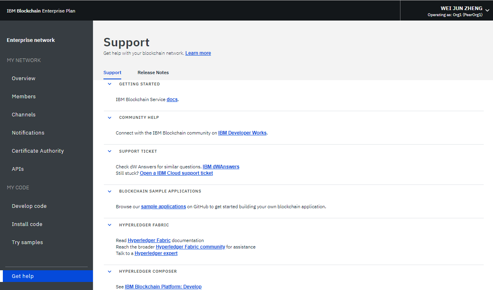
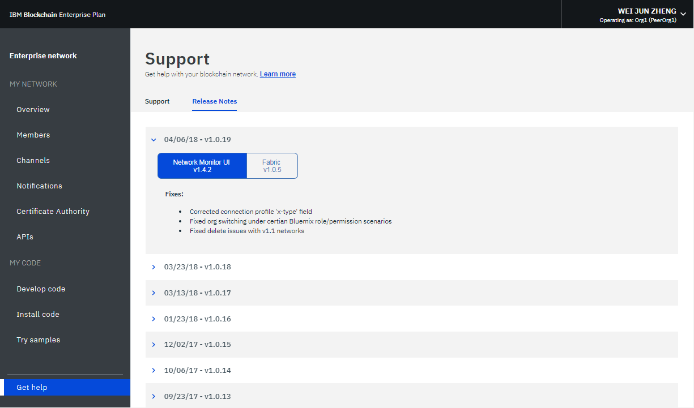

---

copyright:
  years: 2017, 2018
lastupdated: "2018-03-16"

---

{:new_window: target="_blank"}
{:shortdesc: .shortdesc}
{:codeblock: .codeblock}
{:screen: .screen}
{:pre: .pre}

# Enterprise Plan-Netz betreiben
{: #v10_dashboard}

{{site.data.keyword.blockchainfull}} Platform enthält einen Netzmonitor, der eine Übersicht über Ihre Blockchain-Umgebung, einschließlich Netzressourcen, Mitgliedern, zugeordneter Kanäle, Transaktionsleistungsdaten und bereitgestellter Chaincodes, zur Verfügung stellt. Der Netzmonitor stellt auch den Eingangspunkt zur Ausführung von Swagger-APIs dar. Sie können ein Netz mit {{site.data.keyword.blockchainfull_notm}} Platform: Develop entwickeln und Beispielanwendungen ausprobieren.
{:shortdesc}

Der Netzmonitor präsentiert die folgenden Anzeigen in drei Abschnitten. Sie können über den Navigator auf der linken Seite zu jeder Anzeige im Netzmonitor navigieren.
- Der Abschnitt **Eigenes Netz** enthält die Anzeigen "[Übersicht](#overview)", "[Mitglieder](#members)", "[Kanäle](#channels)", "[Benachrichtigungen](#notifications)" und "[APIs](#apis)".
- Der Abschnitt **Eigener Code** enthält die Anzeigen "[Code schreiben](#write_code)", "[Code installieren](#chaincode)" und "[Beispiele ausprobieren](#samples)".
- Die Anzeige "[Hilfe anfordern](#support)" zeigt Unterstützungsinformationen und Releaseinformationen für Helios und Hyperledger Fabric (die Codebasis von {{site.data.keyword.blockchainfull_notm}} Platform) an.

## Übersicht
{: #overview}

Die Anzeige "Übersicht" zeigt Statusinformationen zu Blockchain-Ressourcen (einschließlich Anordnungs-, CA- und Peerknoten) in Echtzeit an. Jede Ressource wird unter vier unterschiedlichen Überschriften angezeigt: **Typ**, **Name**, **Status** und **Aktionen**. Bei der Erstellung des Blockchain-Netzes werden automatisch drei Anordnungsknoten und zwei Zertifizierungsstellenknoten (CA-Knoten) erstellt. Die Zertifizierungsstellen gehören zu einem bestimmten Mitglied, während die Anordnungsknoten allgemeine Endpunkte sind, die im gesamten Netz genutzt werden.

**Abbildung 1** zeigt die Anzeige "Übersicht":

*Abbildung 1. Netzübersicht*

### Knotenaktionen
  Unter der Überschrift **Aktionen** befinden sich Schaltflächen zum Starten oder Stoppen Ihrer Ressourcen. Sie können auch eine Gruppe von Knoten starten oder stoppen, indem Sie mehrere Knoten auswählen und dann auf **Ausgewählte starten** oder **Ausgewählte stoppen** klicken. Die Schaltfläche **Ausgewählte starten** oder **Ausgewählte stoppen** wird oben in der Tabelle angezeigt, wenn Sie einen oder mehrere Knoten auswählen.

  Beachten Sie, dass die Stopp- und die Startaktion für einen Anordnungsknoten nicht verfügbar sind. Im Allgemeinen besteht keine Notwendigkeit, Peer- oder CA-Knoten in einem Netz zu stoppen oder zu starten. Die Stopp- und die Startaktion sind für den Fall vorhanden, dass Sie einen Peer erneut starten müssen, zum Beispiel um ihn in einem bereinigten Status verfügbar zu machen.

  Sie können auch Komponentenprotokolle prüfen, indem Sie in der Dropdown-Liste unter der Überschrift **Aktionen** auf **Protokolle anzeigen** klicken. Die Protokolle zeigen die Aufrufe zwischen den verschiedenen Netzressourcen und sind für die Fehlersuche und -behebung von Nutzen. Probieren Sie dies zum Beispiel aus, indem Sie einen Peer stoppen und ihn als Ziel einer Transaktion auswählen. Dies führt zu Verbindungsfehlern in den Protokollen. Wenn Sie den Peer erneut starten und die Transaktion erneut versuchen, wird eine erfolgreiche Verbindung angezeigt. Sie können einen Peer auch für einen längeren Zeitraum inaktiv lassen, während über Ihre Kanäle weiterhin Transaktionen durchgeführt werden. Wenn der Peer wieder aktiviert wird, werden Sie eine Synchronisation des Hauptbuchs bemerken, da der Peer die Blöcke empfängt, die festgeschrieben wurden, als er inaktiv war. Wenn das Hauptbuch vollständig synchronisiert wurde, können Sie normale Aufrufe und Abfragen für das Hauptbuch ausführen.

### Verbindungsprofil
  Sie können die JSON-Datei zu Low-Level-Netzinformationen zu den einzelnen Ressourcen anzeigen, indem Sie auf die Schaltfläche **Verbindungsprofil** klicken. Das Verbindungsprofil enthält sämtliche Konfigurationsinformationen, die Sie für eine Anwendung benötigen. Da diese Datei jedoch nur die Adressen für Ihre bestimmten Komponenten und den Anordnungsknoten enthält, müssen Sie, wenn weitere Peers als Ziele hinzugefügt werden sollen, deren Endpunkte ermitteln. Der Header, der "url" enthält, zeigt den API-Endpunkt jeder Komponente an. Diese Endpunkte sind für die zielgerichtete Verwendung bestimmter Netzkomponenten von einer clientseitigen Anwendung erforderlich und ihre Definitionen befinden sich üblicherweise in einer JSON-modellierten Konfigurationsdatei, die die App begleitet. Wenn Sie eine Anwendung anpassen, für die eine Bewilligung durch Peers erforderlich ist, die nicht Teil Ihrer Organisation sind, dann müssen Sie die IP-Adressen dieser Peers von den entsprechenden Operatoren mit einer Out-of-band-Operation abrufen. Clients müssen eine Verbindung zu allen Peers herstellen können, von denen sie eine Antwort benötigen.

### Peers hinzufügen
{: #peers}
Klicken Sie auf die Schaltfläche **Peers hinzufügen**, um Ihrem Netz Peerknoten hinzuzufügen. In Starter Plan werden für Sie automatisch zwei Peers hinzugefügt, wenn Sie das Netz erstellen. Im Enterprise Plan können Sie Peerknoten hinzufügen, wenn Sie ein Netz zum ersten Mal erstellen oder einem Netz beitreten - oder später im Netzmonitor. In anderen Szenarios können auch mehr Peers erforderlich sein. Sie könnten mehrere Peers zum Beispiel zu Redundanzzwecken verwenden, um sie mit demselben Kanal zu verknüpfen. Jeder Peer verarbeitet die Transaktionen des Kanals und schreibt in seine jeweilige Kopie des Hauptbuchs. Wenn einer der Peers ausfällt, können andere Peers die Verarbeitung von Transaktionen und Anwendungsanforderungen fortsetzen. Sie können alle Anwendungsanforderungen symmetrisch auf die Peers verteilen oder Sie können verschiedene Peers für verschiedene Funktionen vorsehen. Sie können zum Beispiel einen Peer zum Abfragen des Hauptbuchs und einen anderen Peer zur Verarbeitung von Bewilligungen für Hauptbuchaktualisierungen verwenden.

  Wählen Sie im Popup-Fenster "Peers hinzufügen" die Anzahl der Peerknoten aus, die Sie hinzufügen wollen. <!--Currently only "small" peers are available for purchase, however there will eventually be "medium" and "large" to help accommodate larger workloads and higher transaction throughput.-->

## Mitglieder
{: #members}
Die Anzeige "Mitglieder" enthält zwei Registerkarten. Auf der Registerkarte "Mitglieder" werden Informationen zu Netzmitgliedern angezeigt und auf der Registerkarte "Zertifikate" werden Zertifikatsinformationen angezeigt.

### Mitglieder
{: #members_tab}
**Abbildung 2** zeigt die erste Anzeige "Mitglieder", die Ihre Netzmitglieder im Netz auf der Registerkarte "Mitglieder" anzeigt:

*Abbildung 2. Netzmitglieder*

Neben den Mitgliedern, die Sie einladen, wenn Sie das Netz erstellen, können Sie weitere Mitglieder auf der Registerkarte "Mitglieder" einladen. Um ein Mitglied in Ihr Netz einzuladen, geben Sie den Namen der Institution und die E-Mail-Adresse des Operators ein und klicken Sie auf **Mitglied hinzufügen**. Ein Netz kann insgesamt 15 Mitglieder haben (einschließlich des Netzinitiators). Um ein Mitglied aus Ihrem Netz zu entfernen, klicken Sie auf das Symbol "Entfernen" am Ende der Zeile des Mitglieds.

### Zertifikate
**Abbildung 3** zeigt die erste Anzeige "Mitglieder", die Mitgliedszertifikate auf der Registerkarte "Zertifikate" anzeigt:

*Abbildung 3. Zertifikate*

Operatoren können die Zertifikate für die Mitglieder in derselben Institution auf der Registerkarte "Zertifikate" verwalten. Klicken Sie auf **Zertifikat hinzufügen**, um die Anzeige "Zertifikat hinzufügen" zu öffnen. Geben Sie Ihrem Zertifikat einen Namen, fügen Sie die clientseitigen Zertifikate im PEM-Format in das Feld "Schlüssel" ein und klicken Sie auf **Übergeben**. Sie müssen die Peers erneut starten, damit die clientseitigen Zertifikate wirksam werden.

Weitere Informationen zur Generierung Ihres Zertifikatsschlüssels finden Sie unter [Clientseitige Zertifikate generieren](v10_application.html#generating-the-client-side-certificates).

## Kanäle
{: #channels}

Sie können Ihr Netz in Kanäle aufteilen, wobei jeder Kanal eine Untergruppe von Mitgliedern darstellt, die die Daten für die Chaincodes anzeigen dürfen, die für diesen Kanal instanziiert sind. Jedes Netz muss mindestens einen Kanal aufweisen, damit Transaktionen durchgeführt werden können. Jeder Kanal verfügt über ein eindeutiges Hauptbuch (Ledger) und Benutzer müssen ordnungsgemäß authentifiziert sein, um Lese-/Schreiboperationen für dieses Hauptbuch durchführen zu können. Befinden Sie sich nicht auf diesem Kanal, können Sie die Daten nicht sehen.

**Abbildung 4** zeigt die Anfangsanzeige des Dashboards mit einer Übersicht aller Kanäle in Ihrem Netz:

*Abbildung 4. Kanäle*

Durch das Erstellen eines Kanals wird ein kanalspezifisches Hauptbuch generiert. Weitere Informationen finden Sie unter [Kanal erstellen](howto/create_channel.html).

Sie können auch einen vorhandenen Kanal auswählen, um genauere Details zu Kanal, Mitgliedschaft und aktiven Chaincodes anzuzeigen. Weitere Informationen finden Sie unter [Netz überwachen](howto/monitor_network.html).

## Benachrichtigungen
{: #notifications}

In der Anzeige "Benachrichtigungen" können Sie anstehende Anforderungen bearbeiten und abgeschlossene Anforderungen anzeigen.

**Abbildung 5** zeigt die Anzeige "Benachrichtigungen":

*Abbildung 5. Benachrichtigungen*

Wenn Sie einen Kanal erstellen oder in einen neuen Kanal eingeladen werden, wird eine Benachrichtigung im Netzmonitor angezeigt.

Die Anforderungen werden auf den untergeordneten Registerkarten "Alle", "Anstehend" und "Abgeschlossen" gruppiert. Die Zahlen hinter der Registerkartenüberschrift geben die Anzahl der Anforderungen auf den einzelnen untergeordneten Registerkarten an.
   * Auf der untergeordneten Registerkarte "Alle" werden alle Ihre Anforderungen angezeigt.
   * Anforderungen, die Sie nicht akzeptiert oder abgelehnt haben oder die Sie noch nicht angezeigt haben, befinden sich auf der untergeordneten Registerkarte "Anstehend". Klicken Sie auf die Schaltfläche **Anforderung überprüfen**, um die Anforderung anzuzeigen, die die Kanalrichtlinie und Mitglieder sowie den Abstimmungsstatus enthält. Ein Kanaloperator kann die Anforderung entweder **Akzeptieren** oder **Ablehnen** oder sie zu einem anderen Zeitpunkt bearbeiten, indem er auf **Später** klickt. Wenn die Anforderung von einer ausreichenden Zahl von Kanaloperatoren akzeptiert wird, können Sie auf **Anforderung übergeben** klicken, um die Kanalaktualisierung zu aktivieren.
   * Übergebene Anforderungen werden auf der untergeordneten Registerkarte "Abgeschlossen" angezeigt. Sie können auf **Anforderung überprüfen** klicken, um die zugehörigen Details anzuzeigen.

Wenn Sie eine lange Liste von Anforderungen haben, können Sie im Suchfeld oben nach einer Anforderung suchen.

Anstehende Anforderungen können gelöscht werden, indem Sie die davor befindlichen Felder auswählen und auf **Anforderung löschen** klicken. Beachten Sie, dass eine abgeschlossene Anforderung nicht gelöscht werden kann.

## APIs
{: #apis}

Zur Vereinfachung der Anwendungsentwicklung stellt {{site.data.keyword.blockchainfull_notm}} Platform APIs zur Verfügung, die Sie für Ihr Netz in einer Swagger-Benutzerschnittstelle (UI) testen können.

*Abbildung 6. APIs*

Klicken Sie auf den Link für die **Swagger-Benutzerschnittstelle (UI)**, um die Swagger-Benutzerschnittstelle zu öffnen. Beachten Sie, dass Sie die Swagger-Benutzerschnittstelle mit Ihren Netzberechtigungsnachweisen (die auf dieser Seite "APIs" zu finden sind) berechtigen müssen, bevor Sie die APIs ausführen können. Weitere Informationen finden Sie unter [APIs mit Swagger ausprobieren](howto/swagger_apis.html).

## Code schreiben
{: #write-code}

Der Enterprise Plan integriert {{site.data.keyword.blockchainfull_notm}} Platform: Develop und stellt eine Entwicklungsumgebung mit Tools und Technologien bereit, die dem Industriestandard entsprechen. Sie können Ihr Netz in der Umgebung online oder lokal entwickeln. Wenn Sie ein Netz entwickelt haben, können Sie es wieder in Ihrem Enterprise Plan-Netz bereitstellen.

*Abbildung 7. Code schreiben*

Weitere Informationen zur Entwicklung und Bereitstellung Ihres Codes mit Enterprise Plan finden Sie unter [Unternehmensnetze in Enterprise Plan entwickeln](develop_enterprise.html).

## Code installieren
{: #chaincode}

Chaincodes, die auch als "Smart Contracts" bezeichnet werden, sind Stücke von Software, die eine Gruppe von Funktionen zum Abfragen und Aktualisieren des Hauptbuchs (Ledger) enthalten. Sie werden auf Peers installiert und auf einem Kanal instanziiert.

*Abbildung 8. Code installieren*

Ein Chaincode wird zunächst im Dateisystem eines Peers installiert und anschließend auf einem Kanal instanziiert. Weitere Informationen finden Sie unter [Chaincode installieren und instanziieren](howto/install_instantiate_chaincode.html).

## Beispiele ausprobieren
{: #samples}

Mithilfe von Beispielanwendungen können Sie ein Blockchain-Netz und die Anwendungsentwicklung besser kennenlernen. Folgen Sie dem Link zum Marbles-Repository im Netzmonitor, um Informationen zur Installation der Beispielanwendung "Marbles" zu erhalten. Weitere Informationen zur Entwicklung und Bereitstellung eigener Beispiele finden Sie unter [Anwendungen entwickeln](v10_application.html).

**Abbildung 9** zeigt die Anzeige "Beispiele":

*Abbildung 9. Beispiele*

## Hilfe anfordern
{: #support}

Die Anzeige "Hilfe anfordern" enthält zwei Registerkarten. Auf der Registerkarte "Support" werden Support-Informationen bereitgestellt und auf der Registerkarte "Releaseinformationen" werden neue und geänderte Funktionen für jedes Release beschrieben.

**Abbildung 10** zeigt die erste Anzeige "Hilfe anfordern" mit Unterstützungsinformationen auf der Registerkarte "Support":

*Abbildung 10. Blockchain-Support*

Über die Links und Ressourcen auf dieser Seite können Sie auf Fehlerbehebungs- und Unterstützungsforen zugreifen.

* [{{site.data.keyword.blockchainfull_notm}}-Servicedokumente](index.html) unter **Einführung** (d. h. diese Dokumentationssite) mit Anleitungen zum Einstieg in {{site.data.keyword.blockchainfull}} Platform on {{site.data.keyword.Bluemix_notm}}. Die entsprechenden Themen können Sie über den Navigator auf der linken Seite aufrufen oder Sie können in der Suchfunktion im oberen Bereich einen Suchbegriff eingeben.
* [IBM Developer Works ](https://developer.ibm.com/blockchain/) unter **Community-Hilfe** enthält Ressourcen und Informationen für Entwickler.
* [IBM dWAnswers ](https://developer.ibm.com/answers/smartspace/blockchain/) unter **Support-Ticket** dient als Plattform für Fragen und Antworten. Sie können nach Antworten auf bereits gestellte Fragen suchen oder eine neue Frage stellen. Achten Sie darauf, das Stichwort **blockchain** in Ihrer Frage zu verwenden.
  Sie können außerdem ein Ticket über die Option **{{site.data.keyword.Bluemix_notm}}-Support-Ticket öffnen** an das {{site.data.keyword.blockchainfull_notm}}-Support-Team senden. Hier können Sie Details und Code-Snippets aus Ihrer jeweiligen {{site.data.keyword.Bluemix_notm}}-Instanz mit anderen teilen.
* Über [Beispielanwendungen ](https://github.com/ibm-blockchain) unter **Blockchain-Beispielanwendungen** finden Sie Anleitungen und Beispielcodeausschnitte zur Unterstützung bei der Anwendungsentwicklung.
* Über [Hyperledger Fabric ](http://hyperledger-fabric.readthedocs.io/) und [Hyperledger Fabric-Community ](http://jira.hyperledger.org/secure/Dashboard.jspa) unter **Hyperledger Fabric** finden Sie nähere Details zum Hyperledger Fabric-Stack.
  Wenden Sie sich an einen [Hyperledger-Experten ](https://chat.hyperledger.org/channel/general) mit Fragen zum Hyperledger Fabric-Code.

Wenn Sie Ihr Problem nicht beheben können oder keine Antwort auf Ihre Frage finden, reichen Sie einen Supportfall im IBM Cloud Service Portal ein. Weitere Informationen finden Sie unter [Support anfordern](ibmblockchain_support.html).

Die Abbildungen 11 und 12 zeigen die erste Anzeige "Hilfe anfordern", die neue und geänderte Funktionen jedes Release auf der Registerkarte "Releaseinformationen" anzeigt:

  
*Abbildung 11. Releaseinformationen für Helios*

  
*Abbildung 12. Releaseinformationen für Fabric*
