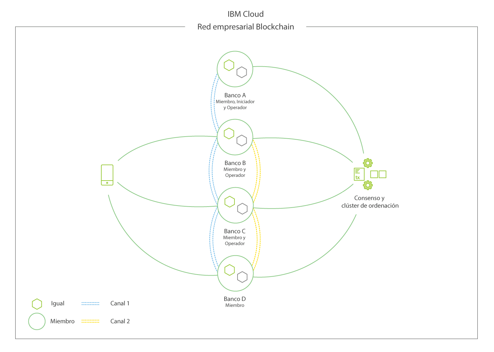

---

copyright:
  years: 2018, 2019
lastupdated: "2019-04-23"

keywords: blockchain components, ca, certificate authorities, peer, ordering service, orderer, channel, smart contract, applications

subcollection: blockchain

---

{:new_window: target="_blank"}
{:shortdesc: .shortdesc}
{:screen: .screen}
{:codeblock: .codeblock}
{:note: .note}
{:important: .important}
{:tip: .tip}
{:pre: .pre}

# Visión general de componentes de Blockchain
{: #blockchain-component-overview}

Los componentes y la estructura de {{site.data.keyword.blockchainfull}} Platform se basan en infraestructura y las herramientas subyacentes de [Hyperledger Fabric ](https://hyperledger-fabric.readthedocs.io/en/release-1.4/), una solución blockchain autorizada de código abierto para la que {{site.data.keyword.IBM_notm}} es un colaborador principal. Las redes basadas en Fabric incluyen varios componentes estándares que se pueden desplegar en una serie de configuraciones para dar soporte a una amplia variedad de casos de uso.

Para obtener una vista más completa de las redes de Fabric y de la interrelación de los componentes que la forman, consulte
[este documento sobre la estructura de una red blockchain](https://hyperledger-fabric.readthedocs.io/en/release-1.4/network/network.html) en la documentación de la comunidad de Fabric, que muestra cómo se puede iniciar y desarrollar una red.

Para obtener una visión general de alto nivel de los componentes de una red basada en Fabric, mire el siguiente vídeo:

<iframe class="embed-responsive-item" id="youtubeplayer" title="Vídeos del plan inicial" type="text/html" width="640" height="390" src="https://www.youtube.com/embed/sJaT2L99BUo" frameborder="0" webkitallowfullscreen mozallowfullscreen allowfullscreen> </iframe>

*Aunque este vídeo se centra en los componentes desde la perspectiva de las redes de Plan inicial o empresarial, la información sigue siendo adecuada en gran medida para la solución gestionada por el cliente de {{site.data.keyword.blockchainfull_notm}} Platform para
{{site.data.keyword.cloud_notm}} Private.*

Para los fines de esta visión general, nos centraremos solo en las entidades emisoras de certificados (CA), clasificadores, iguales, contratos inteligentes y aplicaciones. Como puede ver en la [guía de {{site.data.keyword.blockchainfull_notm}} Platform 2.0 para crear una red](/docs/services/blockchain/howto/ibp-console-build-network.html#ibp-console-build-network) y en la [guía de despliegue de {{site.data.keyword.blockchainfull_notm}} Platform for {{site.data.keyword.cloud_notm}} Private](/docs/services/blockchain/ibp_for_icp_deployment_guide.html#get-started-icp), esta secuencia no es arbitraria; refleja la secuencia en la que se desplegarán los componentes en una red basada en Fabric.

## Entidades emisoras de certificados
{: #blockchain-component-overview-ca}

Los puntales de una red blockchain basada en Fabric son las identidades y permisos. Las identidades toman la forma de certificados x.509 que emite una CA y son como una tarjeta de crédito en el sentido en que *identifican* a alguien, y pueden incluir atributos sobre ellos. Estos certificados se enlazan luego con permisos mediante su inclusión en carpetas de MSP a nivel de componente o a nivel de canal. Así, por ejemplo, un MSP de igual tendrá una subcarpeta de MSP denominada **admins**. Cualquier usuario cuyo certificado esté dentro de dicha carpeta admin será un administrador del igual, lo que implica que tendrá la capacidad de realizar cualquier acción que el administrador de dicho igual tenga permitido realizar. Un sistema de validación dentro del igual realiza una comprobación siempre que un usuario, identificado por su certificado de firma, intente realizar una acción administrativa. ¿Coincide el certificado con el de la carpeta "admin"? Si es así, se puede realizar la acción. Si no es así, se rechazará la solicitud para realizar la acción.

Las entidades emisoras de certificados de {{site.data.keyword.blockchainfull_notm}} Platform se basan en la [entidad emisora de certificados de Hyperledger Fabric ](https://hyperledger-fabric-ca.readthedocs.io/en/release-1.4/ "entidad emisora de certificados de Hyperledger Fabric"), aunque se puede utilizar otra CA, siempre que utilice certificados basados en PKI en x.509. Puede haber, y normalmente debe ser así, varios niveles de CA. La "CA raíz" de una red no estará expuesta normalmente, excepto para proporcionar certificados a las "CA intermedias", que emitirán certificados a usuarios y componentes directamente, o a más capas de CA intermedias. Para obtener más detalles sobre cómo se utilizan las entidades emisoras de certificados para establecer la identidad y la pertenencia, consulte la
[documentación de Hyperledger Fabric sobre la identidad
](https://hyperledger-fabric.readthedocs.io/en/release-1.4/identity/identity.html) y sobre la
[pertenencia
](https://hyperledger-fabric.readthedocs.io/en/release-1.4/membership/membership.html)

## Clasificadores
{: #blockchain-component-overview-orderer}

Aunque el servicio de ordenación se conoce con frecuencia como el "corazón" de la red, su función es bastante simple en realidad: clasificar las transacciones que han validado los iguales en bloques y enviarlas de vuelta a los iguales para que las escriban en sus libros mayores. En versiones anteriores de Fabric, esta funcionalidad se ha empaquetado dentro del igual, pero a partir de Fabric v1.0, se ha separado en un componente independiente para aumentar el rendimiento del igual y evitar los desvíos que puedan resultar en bifurcaciones de estado potenciales.

A nivel físico, esta función de ordenación requiere habitualmente un conjunto de clasificadores que se conoce colectivamente como "servicio de ordenación", aunque en entornos de prueba o pruebas de concepto es posible utilizar un único nodo (conocido como clasificador SOLO).

## Iguales
{: #blockchain-component-overview-peer}

A nivel físico, una red blockchain consta principalmente de nodos de igual (o, simplemente, iguales). Los iguales son elementos fundamentales de la red porque alojan los libros mayores y los contratos inteligentes (contenidos en el ["código de encadenamiento" ](https://hyperledger-fabric.readthedocs.io/en/release-1.4/developapps/chaincodenamespace.html "espacio de nombres de código de encadenamiento") ). Más exactamente, el igual aloja
**instancias** del libro mayor e **instancias** de contratos inteligentes. Debido a que los contratos inteligentes y los libros mayores se utilizan para encapsular los procesos compartidos y la información compartida en la red, respectivamente, estos aspectos de un igual los convierten en un buen punto de partida para entender lo que hace realmente una red de Fabric.

Para obtener más información sobre los iguales específicamente, consulte [este documento que se centra solo en los iguales ](https://hyperledger-fabric.readthedocs.io/en/release-1.4/peers/peers.html) de la documentación de la comunidad de Fabric.

## Canales
{: #blockchain-component-overview-channels}

Un canal es un mecanismo que proporciona una capa abierta de comunicación entre los miembros de la red. Se pueden crear varios canales entre subconjuntos de miembros, a fin de dar soporte a uno de los [muchos mecanismos para implementar la privacidad ](https://developer.ibm.com/tutorials/cl-blockchain-private-confidential-transactions-hyperledger-fabric-zero-knowledge-proof/ "Transacciones privadas y confidenciales con Hyperledger Fabric"). Los datos de la red blockchain se almacenan en los libros mayores del canal. Los libros mayores del canal se alojan en los iguales de las organizaciones que se han unido al canal. Para obtener más información sobre los canales y sobre cómo utilizarlos, consulte la [documentación de Hyperledger Fabric ](https://hyperledger-fabric.readthedocs.io/en/release-1.4/channels.html)

## Contratos inteligentes
{: #blockchain-component-overview-smart-contracts}

Para que las empresas puedan realizar transacciones unas con otras, primero debe definirse y llegarse a un acuerdo sobre las reglas y los procesos en algún tipo de contrato. En conjunto, estos contratos establecen el "modelo de negocio" que rige todas las interacciones entre socios comerciales.

La misma necesidad existe en las redes blockchain, donde el término del sector para estos modelos de negocio es "contratos inteligentes". Fabric e {{site.data.keyword.blockchainfull_notm}} Platform contienen estos contratos en una estructura mayor conocida como "código de encadenamiento", que incluye, no solo la lógica empresarial, sino también la infraestructura subyacente que valida las identidades de los usuarios que intentan invocar el contrato inteligente.

Cuando los contratos del mundo empresarial se firman y se rellenan con firmas legales, se instalan contratos inteligentes en los iguales y se "crea una instancia" en un canal.

## Aplicaciones
{: #blockchain-component-overview-applications}

Las aplicaciones cliente de una red basada en Fabric, como {{site.data.keyword.blockchainfull_notm}} Platform, aprovechan infraestructuras subyacentes como las API, los SDK y los contratos inteligentes para permitir interacciones de clientes (invocaciones y consultas) a un mayor nivel de abstracción.

Para ver cómo interactúan las aplicaciones con una red basada en Fabric, consulte la [documentación sobre cómo escribir su primera aplicación ](https://hyperledger-fabric.readthedocs.io/en/release-1.4/write_first_app.html "Cómo escribir su primera aplicación").  Tenga también en cuenta que el área está experimentando mejoras sustanciales en Fabric v1.4, que están disponibles en {{site.data.keyword.blockchainfull_notm}} Platform 2.0. Consulte el tema de Hyperledger Fabric de [Desarrollo de aplicaciones ](https://hyperledger-fabric.readthedocs.io/en/release-1.4/developapps/developing_applications.html "Desarrollo de aplicaciones") para obtener más información.  Aunque estas funciones directas, como la clase de contrato, no son compatibles con Fabric v1.2, que es la versión actual del Plan de inicio, contienen información conceptual y otras sugerencias útiles que valen la pena incluir en el diseño de la aplicación y en la preparación para el futuro.

Para ver cómo interactúa una aplicación con una red basada en Fabric, consulte la documentación sobre la [creación de aplicaciones](/docs/services/blockchain/howto/ibp-console-create-app.html#ibp-console-app).

## Una red de ejemplo
{: #blockchain-component-overview-example-network}

En la **Figura 1** se muestra un ejemplo de una red blockchain desplegada que consta de cuatro miembros (cada uno de los cuales posee dos nodos iguales), entidades emisoras de certificados responsables de distribuir el material de identidad criptográfico, un servicio de ordenación que define políticas y participantes en la red. El canal azul contiene los cuatro miembros de red y el canal amarillo está restringido solo a tres miembros: los bancos B, C y D. Además, vemos que el Banco A ejerce el rol de iniciador de red y que el Banco D existe solo como miembro en el contexto del canal amarillo. Por último, un usuario o una aplicación en posesión de un certificado x509 firmado adecuadamente puede enviar llamadas a iguales de la red.

*Figura 1. Una red blockchain de ejemplo con cuatro miembros que aprovechan los canales para aislar los datos*
