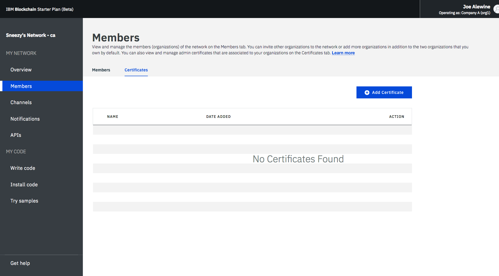
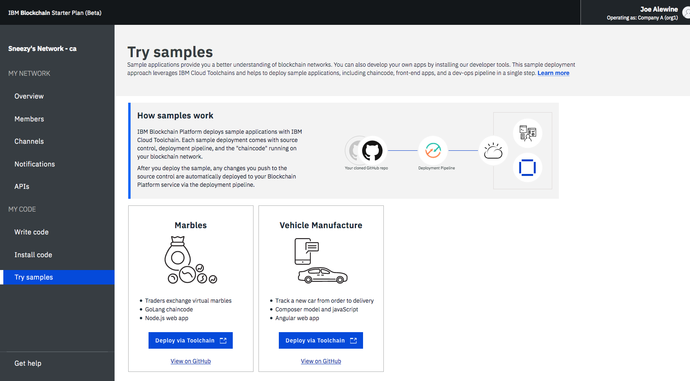

---

copyright:
  years: 2017, 2018
lastupdated: "2018-06-14"

---

{:new_window: target="_blank"}
{:shortdesc: .shortdesc}
{:codeblock: .codeblock}
{:screen: .screen}
{:pre: .pre}

# Operación de la red del Plan inicial
{: #operate-starter-plan-network}

La plataforma {{site.data.keyword.blockchainfull}} incorpora un supervisor de red proporciona una visión general del entorno de blockchain, incluidos recursos de red, miembros, canales unidos, datos de rendimiento de las transacciones y códigos de encadenamiento desplegados. El supervisor de red también le ofrece un punto de partida para ejecutar las API de Swagger y desarrollar una red con la función de la plataforma {{site.data.keyword.blockchainfull_notm}} para desarrollar y probar aplicaciones de ejemplo.
{:shortdesc}

Puede [cambiar el nombre de la red del Plan inicial](#sp-network-name) o [conmutar entre distintas redes de Planes iniciales que cree](#switch-sp-network) en el Supervisor de red.

El Supervisor de red expone las pantallas siguientes en tres secciones. Puede ir a cada pantalla desde el navegador izquierdo del supervisor de red.
- La sección **Mi red** contiene las pantallas "[Visión general](#overview)", "[Miembros](#members)", "[Canales](#channels)", "[Notificaciones](#notifications)" y "[API](#apis)".
- La sección **Mi código** contiene las pantallas "[Desarrollar código](#write-code)", "[Instalar código](#chaincode)" y "[Probar ejemplos](#samples)".
- La pantalla "[Obtener ayuda](#support)".

Puede [cambiar entre las organizaciones](#switch-organizations) de las que es propietario, [comprobar las preferencias de la red](#network-preferences) y [restablecer la red](#reset-network) desde el menú desplegable de la parte superior derecha del Supervisor de red.

En esta guía de aprendizaje se describe cada una de las pantallas y funciones anteriores.

## Actualizar el nombre de red
{: #sp-network-name}

Al crear una red de Plan inicial, la Plataforma de {{site.data.keyword.blockchainfull_notm}} asigna un nombre a la red. Sin embargo, puede actualizar este nombre de red en cualquier momento en el Supervisor de red.

En la parte superior izquierda del navegador del Supervisor de red, pulse en el nombre de red y el campo se volverá editable. Escriba el nuevo nombre de red que desee utilizar y pulse **Intro**. El nombre de red se actualizará en pocos segundos.

**Figura 1** muestra los pasos para actualizar el nombre de red del Plan inicial del nombre asignado a "Red del plan inicial".

*Figura 1. Actualizar nombre de red*

## Conmutar entre la red del Plan inicial
{: #switch-sp-network}

Si crea más de una red con el Plan inicial, puede cambiar entre las redes en el Supervisor de red.

En la parte superior izquierda del navegador del Supervisor de red, pulse el icono de flecha junto a su nombre de red. Seleccione y pulse el nombre de red al que desea cambiar desde la lista desplegable. El navegador web se renovará y abrirá el Supervisor de red de la red a la que desea cambiar.

**Figura 2** muestra los pasos para cambiar a otra red del Plan inicial.

*Figura 2. Cambiar de red*

## Visión general
{: #overview}

En la pantalla "Visión general" se muestra información de estado en tiempo real sobre los recursos de blockchain como el clasificador, la CA y los iguales. Cada recurso se muestra bajo cuatro cabeceras distintas: **Tipo**, **Nombre**, **Estado** y **Acciones**. Cuando se inicia la red, hay un clasificador, una CA y un igual en ejecución. La CA es específica de la organización, mientras que el clasificador es un punto final común que se comparte a través de la red.

**Figura 3** muestra la pantalla "Visión general":

*Figura 3. Visión general de red*

### Acciones de nodo
  La cabecera **Acciones** de la tabla proporciona botones para iniciar o detener los componentes. También puede iniciar o detener un grupo de nodos mediante la selección de varios nodos para luego pulsar el botón **Iniciar seleccionados** o **Detener seleccionados**. El botón **Iniciar seleccionados** o **Detener seleccionados** aparece en la parte superior de la tabla cuando se seleccionan uno o varios nodos.

  También puede comprobar los registros de componente pulsando **Ver registros** en la lista desplegable en cabecera **Acciones**. Los registros muestran las llamadas entre los distintos recursos de red y resultan muy útiles para la depuración y resolución de problemas.

  **Nota**: {{site.data.keyword.blockchainfull_notm}} En la IU de la Red inicial, cuando pulse la acción Ver registros en los nodos listados en el panel Visión general, se abrirá la interfaz kibana de Registro de IBM Cloud. De forma predeterminada, kibana estará preconfigurado para mostrar registros de los últimos 15 minutos de actividad. Si no ha habido actividad en los últimos 15 minutos, verá un mensaje que indica 'No results found'. Para ver todos los registros, puede tan solo pulsar el icono de temporizador de la esquina superior derecha bajo el nombre de usuario y establezca un rango de tiempo más amplio, como por ejemplo ‘Esta semana’ o ‘Este mes’.

  Para entender los efectos de iniciar y detener un igual, puede experimentar deteniendo un igual e intentando convertirlo en el destino de una transacción, y verá errores de conectividad en los registros. Cuando reinicie el igual y vuelva a intentar la transacción, verá una conexión correcta. También puede dejar un igual inactivo durante un largo periodo de tiempo mientras sus canales siguen realizando transacciones. Cuando se reactive el igual, detectará una sincronización del libro mayor a medida que recibe los bloques confirmados mientras estaba inactivo. Cuando se haya sincronizado por completo el libro mayor, podrá realizar invocaciones y consultas normales sobre el mismo.

### Perfil de conexión
  Puede ver en el archivo JSON la información de red de bajo nivel de cada recurso pulsando el botón **Perfil de conexión**. El perfil de conexión contiene toda la información de configuración que necesita para una aplicación. Sin embargo, debido a que este archivo solo contiene las direcciones de sus componentes específicos y del clasificador, si necesita más iguales como destinos, deberá obtener sus puntos finales. La cabecera que contiene "url" muestra el punto final de API de cada componente. Estos puntos finales se necesitan para marcar el destino de componentes de red específicos de una aplicación del cliente y sus definiciones suelen encontrarse en un archivo de configuración de tipo JSON que acompaña a la app. Si está personalizando una aplicación que necesita aprobación de iguales que no forman parte de la organización, deberá recuperar las direcciones IP de esos iguales de los operadores relevantes en una operación externa. Los clientes deben poder conectarse a cualquier igual del que necesiten una respuesta.

### Adición de iguales
{: #peers}
  Los miembros de la red deben tener iguales para almacenar sus copias del libro mayor de la red y para ejecutar código de encadenamiento para consultar o actualizar el libro mayor. Si la política de aprobación define un igual como igual de aprobación, el igual también devuelve resultados de aprobación a las aplicaciones.

  El Plan inicial crea un igual para cada uno de las dos organizaciones de forma predeterminada. Puede añadir más iguales a sus organizaciones, en función de sus propios requisitos. Puede estar en distintos escenarios cuando necesite más iguales. Por ejemplo, es posible que desee que varios iguales se unan al mismo canal por motivos de redundancia. Cada igual procesa las transacciones del canal y escribe en sus respectivas copias del libro mayor. Si uno de los iguales falla, el otro igual (u otros iguales) pueden continuar procesando transacciones y solicitudes de aplicación. También puede equilibrar la carga de forma simétrica de todas las solicitudes de aplicaciones entre los iguales, o puede elegir como destino diferentes iguales para diferentes funciones. Por ejemplo, puede utilizar un igual para consultar el libro mayor y utilizar otro igual para procesar las aprobaciones de actualizaciones del libro mayor.

  Pulse el botón **Añadir iguales** de la parte superior derecha para añadir nodos iguales a la red. En el panel emergente "Añadir iguales", seleccione el número y tamaño de los nodos iguales que desea agregar.

## Miembros
{: #members}

La pantalla "Miembros" contiene dos separadores para visualizar información de miembros de red en el separador "Miembros" y la información de certificado en el separador "Certificados".

### Miembros
{: #members_tab}
**Figura 4** muestra la pantalla inicial "Miembros" que muestra los miembros de la red en el separador "Miembros":

*Figura 4. Miembros de la red*

Pulse **Añadir miembro** para invitar a más miembros a la red. En el Plan inicial, tiene dos opciones:
- **Invitar a un miembro**. Puede invitar a otras organizaciones a que pasen a ser miembros de la red. Luego las organizaciones invitadas pueden unirse y colaborar con usted en la red.
- **Crear miembro**. También puede crear un miembro utilizando su propia dirección de correo electrónico. Tendría el mismo control sobre dicho miembro que el que tiene sobre las dos organizaciones que recibe de forma predeterminada con el Plan inicial.

**Figura 5** muestra la ventana "Añadir miembro".

*Figura 5. Añadir miembro*

### Certificados
**Figura 6** muestra la pantalla inicial "Miembros" que muestra los certificados de miembros en el separador "Certificados":

*Figura 6. Certificados*

Los operadores pueden gestionar los certificados de miembros de la misma institución en el separador "Certificados". Pulse **Añadir certificado** para abrir el panel "Añadir certificado". Indique un nombre para el certificado, pegue los certificados del lado de cliente en formato PEM en el campo "Clave" y pulse **Enviar**. Debe reiniciar sus iguales antes de que certificados del lado de cliente entren en vigor.

Para obtener información sobre cómo generar su clave de certificado, consulte [Generación de certificados del lado de cliente](v10_application.html#generating-the-client-side-certificates).

## Canales
{: #channels}

Los canales, consistentes en un subconjunto de miembros de red que desean realizar transacciones privadas, proporcionan aislamiento de datos y confidencialidad permitiendo que los miembros de un canal establezcan normas específicas y un libro mayor separado, al que solo pueden acceder los miembros del canal. Cada red debe tener al menos un canal para que se lleven a cabo las transacciones. Cada canal tiene un libro mayor único y los usuarios deben estar correctamente autenticados para poder realizar operaciones de lectura/escritura en este libro mayor. Si no está en un canal, no podrá ver los datos.

**Figura 7** muestra la pantalla de panel de control inicial que muestra una visión general de todos los canales de la red:

*Figura 7. Canales*

La creación de un canal genera un libro mayor específico del canal. Para obtener más información, consulte [Creación de un canal](howto/create_channel.html).

También puede seleccionar un canal existente para ver detalles más precisos sobre el canal, la pertenencia y el código de encadenamiento activo. Para obtener más información, consulte [Supervisión de una red](howto/monitor_network.html).

## Notificaciones
{: #notifications}

Puede gestionar solicitudes pendientes y visualizar las solicitudes completadas en la pantalla "Notificaciones".

**Figura 8** muestra la pantalla "Notificaciones":

*Figura 8. Notificaciones*

Cuando cree un canal o se le invite a un nuevo canal, recibirá una notificación en el Supervisor de red.

Las solicitudes se agrupan en los subseparadores "Todas", "Pendientes" y "Completadas". Los números tras la cabecera indican el número de solicitudes de cada subseparador.
   * Puede encontrar todas las solicitudes en el subseparador "Todas".
   * Las solicitudes que no ha aceptado ni rechazado, o que no ha visto, se encuentran en el subseparador "Pendientes". Pulse el botón **Revisar solicitud** para ver la solicitud, que incluye la política de canal y los miembros, y el estado de votación. Si es un operador de canal, puede **Aceptar** o **Rechazar** la solicitud, o bien puede gestionarla en otro momento pulsando **Más tarde**. Si la solicitud es aceptada por suficientes operadores de canal, puede pulsar **Enviar solicitud** para activar la actualización del canal.
   * La solicitud enviada se mostrará en el subseparador "Completadas".  Puede pulsar **Revisar solicitud** para ver sus detalles.

Si tiene una lista larga de solicitudes, puede buscar una en el campo de búsqueda situado en la parte superior.

Para suprimir solicitudes pendientes, seleccione los recuadros situados delante de las mismas y pulse **Suprimir solicitud**.

## API
{: #apis}

La plataforma {{site.data.keyword.blockchainfull_notm}} ofrece varias API REST en Swagger que puede utilizar para gestionar los nodos, canales, iguales y miembros de la red. Las aplicaciones pueden utilizar estas API para controlar los recursos de red importantes sin utilizar el Supervisor de red.

**Figura 9** muestra la pantalla "API":

*Figura 9. API*

Pulse el enlace **IU de Swagger** para abrir la IU de Swagger. Tenga en cuenta que debe autorizar la IU de Swagger con sus credenciales de red (que encontrará en esta página de API) para poder ejecutar las API. Para obtener más información, consulte [Utilización de las API de Swagger](howto/swagger_apis.html).

## Desarrollar código
{: #write-code}

El Plan inicial integra la función de desarrollo de la plataforma {{site.data.keyword.blockchainfull_notm}} y proporciona un entorno de desarrollo con herramientas y tecnologías estándar de la industria. Puede desarrollar su red empresarial en el entorno en línea o de forma local. Después de desarrollar una red empresarial, puede desplegarla de nuevo en la red del Plan inicial.

**Figura 10** muestra la pantalla "Desarrollar código":

*Figura 10. Desarrollar código*

Para obtener más información sobre el desarrollo de las redes empresarial y su despliegue de nuevo en la red del Plan inicial, consulte [Desarrollo de redes de empresa con el Plan inicial](develop_starter.html).

## Instalar código
{: #chaincode}

El código de encadenamiento, que también se conoce como "contrato inteligente", son fragmentos de software que contienen un conjunto de funciones para consultar y actualizar el libro mayor. Se instalan en iguales y se crean instancias de los mismos en un canal.

**Figura 11** muestra la pantalla "Instalar código":

*Figura 11. Código de encadenamiento*

El código de encadenamiento se instala en primer lugar en el sistema de archivos del igual y, a continuación, se crea una instancia en un canal. Para obtener más información, consulte [Instalación, creación de instancias y actualización de un código de encadenamiento](howto/install_instantiate_chaincode.html).

## Probar ejemplos
{: #samples}

Las aplicaciones de ejemplo le ayudan a comprender mejor una red blockchain y el desarrollo de aplicaciones.  <!--Starter Plan enables you to deploy and launch sample applications in the Network Monitor. --> Siga los enlaces **Ver en GitHub** para obtener más información sobre cómo utilizar las muestras y desplegarlas en la plataforma de {{site.data.keyword.blockchainfull_notm}}. Para obtener más información sobre cómo desarrollar y desplegar los ejemplos, consulte [Despliegue de aplicaciones de ejemplo](howto/prebuilt_samples.html).

**Figura 12** muestra la pantalla "Probar ejemplos":

*Figura 12. Ejemplos*

<!--
The sample deployment leverages the [DevOps Toolchain service ](https://console.bluemix.net/devops/toolchains) to automate your process of source control, delivery pipeline, and chaincode enablement. Choose a sample application, and click the **Deploy via Toolchain**. For more information, see [Deploying sample applications](howto/prebuilt_samples.html).
-->

## Obtener ayuda
{: #support}

La pantalla "Obtener ayuda" contiene dos separadores que ofrecen información de soporte dentro del separador "Soporte" y en el separador "Notas del release" se describen las funciones nuevas y modificadas de cada release.

**Figura 13** muestra la pantalla inicial "Soporte" que muestra información de soporte en el separador "Soporte":

*Figura 13. Soporte de Blockchain*

Utilice los enlaces y recursos de esta pantalla para acceder a los foros sobre resolución de problemas y soporte.

* La [documentación del servicio {{site.data.keyword.blockchainfull_notm}}](index.html) bajo **Cómo empezar**, que es un sitio de documentación, ofrece una guía sobre cómo comenzar a utilizar la plataforma {{site.data.keyword.blockchainfull}} en {{site.data.keyword.Bluemix_notm}}. Encontrará los temas correspondientes en el navegador izquierdo o buscando un término con la función de búsqueda situada en la parte superior.
* [IBM Developer Works ](https://developer.ibm.com/blockchain/) en la **Ayuda de la comunidad** contiene recursos e información para desarrolladores.
* [IBM dWAnswers ](https://developer.ibm.com/answers/smartspace/blockchain/) en **Incidencia de soporte** sirve como plataforma para preguntas y respuestas. Puede buscar respuestas de preguntas realizadas anteriormente o puede enviar una pregunta nueva. Asegúrese de incluir la palabra clave **blockchain** en la pregunta.
  También puede enviar una incidencia al equipo de soporte de {{site.data.keyword.blockchainfull_notm}} con la opción **Abrir una incidencia de soporte de {{site.data.keyword.Bluemix_notm}}**.  Comparta detalles y fragmentos de código desde la instancia de {{site.data.keyword.Bluemix_notm}} específica.
* [Aplicaciones de ejemplo ](https://github.com/ibm-blockchain) bajo **Aplicaciones de ejemplo de Blockchain** contiene una guía y fragmentos de código de ejemplo que le ayudarán en el desarrollo de aplicaciones.
* [Hyperledger Fabric ](http://hyperledger-fabric.readthedocs.io/) y la [Comunidad de Hyperledger Fabric ](http://jira.hyperledger.org/secure/Dashboard.jspa) en **Hyperledger Fabric** proporcionan más detalles sobre la pila Hyperledger Fabric.
  Converse con un [experto en Hyperledger ](https://chat.hyperledger.org/channel/general) y realice preguntas sobre el código de Hyperledger Fabric.

Si no consigue depurar el problema ni determinar una respuesta a su pregunta, envíe un caso de soporte en el portal de servicio de IBM Cloud. Para obtener más información, consulte [Obtención de soporte](ibmblockchain_support.html).

**Figura 14** y **Figura 15** muestran la pantalla inicial "Soporte" que muestra funciones nuevas y modificadas de cada release en el separador "Notas del release":

*Figura 14. Notas del release de Helios

*Figura 15. Notas del release de Fabric*

## Cambiar de organización
{: #switch-organizations}

Si decide simular una red blockchain de varias organizaciones, puede cambiar a cualquiera de las organizaciones que posee, por ejemplo a la Organización A. A continuación, puede ver y gestionar los recursos de red de la Organización A, como los iguales, canales y códigos de encadenamiento, en el supervisor de red. Esta característica le permite crear un canal siguiendo las políticas del canal y añadir al canal iguales procedentes de varias organizaciones.

Pulse la esquina superior derecha de la IU, donde debería ver su nombre. En el menú desplegable que hay bajo **CAMBIAR DE ORGANIZACIÓN**, elija el nombre de la organización a la que desea cambiar. La Organización A está seleccionada de forma predeterminada. Después de seleccionar una organización a la que cambiar, el supervisor de red se renueva automáticamente y puede ver la red como dicha organización.

**Figura 16** muestra la función "Cambiar de organización":

   
*Figura 16. Cambiar de organización*

## Preferencias de red
{: #network-preferences}

Pulse la esquina superior derecha y abra el menú desplegable y luego el botón **Preferencias de red** en el menú. Se abre la ventana Preferencias de red. La ventana Preferencias de red muestra la información básica de la red, como el nombre de la red, la versión de Fabric, la ubicación de la red en {{site.data.keyword.cloud_notm}}, y el tipo de base de datos del libro mayor. Si usted es el iniciador de la red, también puede gestionar el tiempo de espera de inactividad web en la ventana Preferencias de la red.

### Tiempo de espera de inactividad web
{: #web-inactivity-timeout}

**Nota**: Solo el **iniciador de red** puede cambiar el valor de tiempo de espera de inactividad web. Este es un valor de nivel de red y afectará a todos los miembros de la red.

El tiempo de espera de inactividad web está establecido en **Desactivado** de forma predeterminada. Si coloca el tiempo de espera de inactividad web en **Activado**, cualquier miembro de la red será desconectado automáticamente tras 10 minutos de inactividad. Cuando el temporizador de inactividad web llegue a los 10 minutos, la función de tiempo de espera de inactividad web terminará las sesiones web inactivas para garantizar la seguridad de la cuenta del miembro de la red. Al pulsar un enlace o al renovar el Supervisor de red se restablece el temporizador de inactividad web. Antes de llegar a 10 minutos, el cierre de la ventana o del separador del navegador también termina la sesión web.

**Figura 17** muestra la ventana "Preferencias de la red":

*Figura 17. Preferencias de la red*

## Restablecer la red
{: #reset-network}

El Plan inicial ofrece la posibilidad de editar la configuración de la red sin suprimir ni volver a crear la red. Se restablece la configuración inicial de la red, que incluye dos organizaciones, un igual por cada organización y un canal predeterminado. Esto resulta útil, por ejemplo, cuando se ejecutan rondas de pruebas en la red blockchain, ya que le permite volver a empezar desde una red relativamente limpia.

**Atención**: después de restablecer la red, los puntos finales de API de los iguales, el clasificador y la CA se modifican. Debe ajustar la información sobre puntos finales de API en las aplicaciones.

Pulse la esquina superior derecha para abrir el menú desplegable. Pulse el botón **Restablecer red** en el menú. Si está preparado para restablecer la red, pulse **Aceptar** para continuar. El supervisor de red se renovará para reflejar los valores nuevos.

**Figura 18** muestra la función "Restablecer red":

*Figura 18. Restablecer red*
