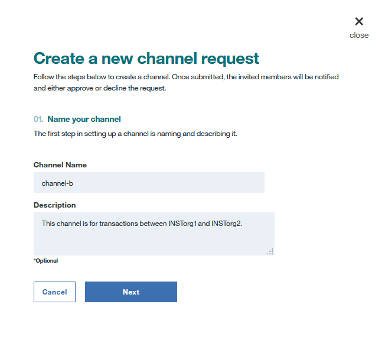

---

copyright:
  years: 2017, 2018
lastupdated: "2018-09-27"

---

{:new_window: target="_blank"}
{:shortdesc: .shortdesc}
{:screen: .screen}
{:codeblock: .codeblock}
{:pre: .pre}

# Creación o actualización de un canal

***[¿Le resulta útil esta página? Indíquenos su opinión.](https://www.surveygizmo.com/s3/4501493/IBM-Blockchain-Documentation)***

Los canales constituyen un mecanismo increíblemente potente para dividir y aislar datos y proporcionan la base principal de la privacidad de los datos. Solo los miembros del mismo canal pueden acceder a sus datos.
{:shortdesc}

Para garantizar la seguridad, su política de actualización se ha configurado de forma que define el número de operadores de canal que necesitan acordar la creación del canal o actualizar la solicitud antes de que se cree o actualice un canal.

## Creación de un canal
Pulse el botón **Nuevo canal** en la pantalla "Canales" del Supervisor de red y realice los pasos siguientes para enviar una solicitud de creación de canal:
1. Elija un nombre que refleje el objetivo empresarial del canal, añada una descripción si lo desea y pulse **Siguiente**. El nombre del canal debe ser exclusivo en una red blockchain. Debe empezar por una letra y solo puede contener caracteres en minúsculas, números o guiones.

2. Invite a una combinación de los miembros de la red seleccionando los miembros de la red y pulsando el botón **Añadir miembro**. Personalice los permisos mediante la asignación de roles a cada miembro invitado y pulse **Siguiente**.

    * Un operador de canal puede consultar o actualizar el libro mayor del canal. Un operador de canal tiene permiso para **Aceptar** o **Rechazar** una solicitud de creación de canal y para enviar una solicitud de actualización. Debe haber como mínimo un **Operador** en cada canal.
    * Un escritor de canal puede actualizar el libro mayor del canal invocando una función de código de encadenamiento, por ejemplo. Un escritor de canal puede también crear una instancia de un código de encadenamiento en un canal.
    * Un lector de canal puede consultar el libro mayor del canal invocando una función de código de encadenamiento de solo lectura, por ejemplo.

3. Configure la política de actualización de canal seleccionando el número de operadores de canal para aprobar la solicitud de actualización del canal y pulse **Enviar solicitud**.
 

Los miembros invitados recibirán un correo electrónico de invitación. También pueden encontrar la solicitud en los separadores "Todas" o "Pendientes" en la pantalla **Notificaciones** del Supervisor de red.
* Los miembros que están invitados como operadores de canal pueden pulsar el botón **Revisar solicitud** para revisar la configuración del canal y luego **Aceptar** o **Rechazar** la solicitud. La columna "Mi estado" muestra el estado de votación del operador sobre la solicitud:
    * _Voto pendiente_: El operador no ha gestionado la solicitud.
    * _Voto aceptado_: El operador ha aceptado la solicitud.
    * _Voto rechazado_: El operador ha rechazado la solicitud.
    * _Voto cerrado_: La solicitud ha obtenido suficientes votos **Aceptar** y no es necesario que el operador la acepte o la rechace.
* Los miembros que están invitados como escritores o lectores de canal verán *No es necesario* en la columna "Mi estado". Antes de que la solicitud obtenga suficientes votos **Aceptar** de los operadores de canal, los escritores o lectores pueden pulsar el botón **Revisar solicitud** para comprobar la configuración del canal.

Cuando un número suficiente de operadores de canal aceptan la solicitud, cualquier miembro del canal puede pulsar el botón **Enviar solicitud** y se creará el nuevo canal. Todos los miembros pueden encontrar el canal en la pantalla "Canales" del Supervisor de red.

### Creación de canales gestionados

En mercados de intercambio de divisas altamente regulados, por ejemplo, sería necesario poner a un tercero a cargo de las funciones administrativas en canales que normalmente gestionarían diversos operadores o miembros.

En este caso, el tercero de confianza se convertiría en "operador" único para un canal y asignaría a otros miembros el rol de "Escritores". Esto le otorgaría autoridad exclusiva para editar el canal, mientras seguiría ofreciendo a los dos bancos la posibilidad de invocar transacciones. También se podría crear un canal gestionado de "solo lectura" estableciendo otros miembros como "Lectores".

## Actualización de un canal
Si desea modificar la configuración de un canal, por ejemplo, añadir o eliminar miembros de canal o modificar su política de actualización, puede enviar una solicitud de actualización. En la pantalla "Canales" del Supervisor de red, localice el canal que desea modificar y seleccione **Editar canal** en la lista desplegable bajo la cabecera **Acción**. Muévase por los paneles para realizar cambios en las entidades que desee y pulse **Enviar solicitud** para iniciar la solicitud de actualización del canal.

Todos los miembros del canal recibirán notificaciones por correo electrónico sobre la solicitud de actualización:
* Los miembros recién invitados reciben una notificación de correo electrónico con una invitación para unirse al canal. También encontrará la solicitud con el estado "Voto pendiente" en la pantalla **Notificaciones** del Supervisor de red.
    * Los miembros que están invitados como operadores de canal pueden pulsar el botón **Revisar solicitud** para repasar la configuración del canal y luego **Aceptar** o **Rechazar** la solicitud de actualización del canal.  La columna "Mi estado" muestra el estado de votación del operador sobre la solicitud:
        * _Voto pendiente_: El operador no ha gestionado la solicitud.
        * _Voto aceptado_: El operador ha aceptado la solicitud.
        * _Voto rechazado_: El operador ha rechazado la solicitud.
        * _Voto cerrado_: La solicitud ha obtenido suficientes votos **Aceptar** y no es necesario que el operador la acepte o la rechace.
    * Los miembros que están invitados como escritores o lectores de canal verán *No es necesario* en la columna "Mi estado". Antes de que la solicitud obtenga suficientes votos **Aceptar** de los operadores de canal, los escritores o lectores pueden pulsar el botón **Revisar solicitud** para comprobar la configuración del canal.
* Los miembros eliminados reciben una notificación por correo electrónico sobre el cambio en el canal.
* Los operadores de canal existentes reciben notificaciones por correo electrónico sobre la actualización del canal. Pueden ver la solicitud con el estado _Voto pendiente_ en la pantalla **Notificaciones** del Supervisor de red para que la **Acepten** o **Rechacen**.
* Los escritores o lectores de canal existentes reciben notificaciones por correo electrónico sobre la actualización del canal. Pueden ver la solicitud con el estado _No es necesario_ en la pantalla **Notificaciones** del Supervisor de red.

Cuando un número suficiente de operadores de canal aceptan la solicitud, cualquier miembro del canal puede pulsar el botón **Enviar solicitud** y se actualizará el nuevo canal. Todos los miembros pueden ver el canal actualizado en la pantalla "Canales" del Supervisor de red.

**Importante:**
Las políticas de aprobación no se actualizan automáticamente cuando nuevas organizaciones se unen al canal e instalan el código de encadenamiento. Por ejemplo, si la política requiere que dos de cinco organizaciones aprueben una transacción, la política no se actualizará para que necesite dos de seis organizaciones cuando una nueva organización se una al canal. En su lugar, la nueva organización no aparecerá en la política y no se podrán aprobar las transacciones. Puede añadir una nueva organización a una política de aprobación [actualizando el código de encadenamiento correspondiente](/docs/services/blockchain/howto/install_instantiate_chaincode.html#updating-a-chaincode). Para obtener más información, consulte [Especificación de políticas de aprobación de código de encadenamiento](/docs/services/blockchain/howto/install_instantiate_chaincode.html#endorsement-policy).
