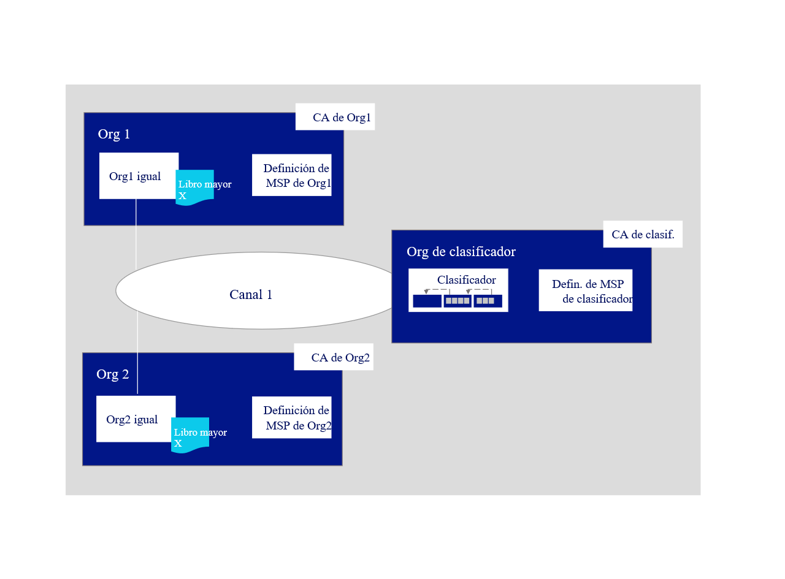
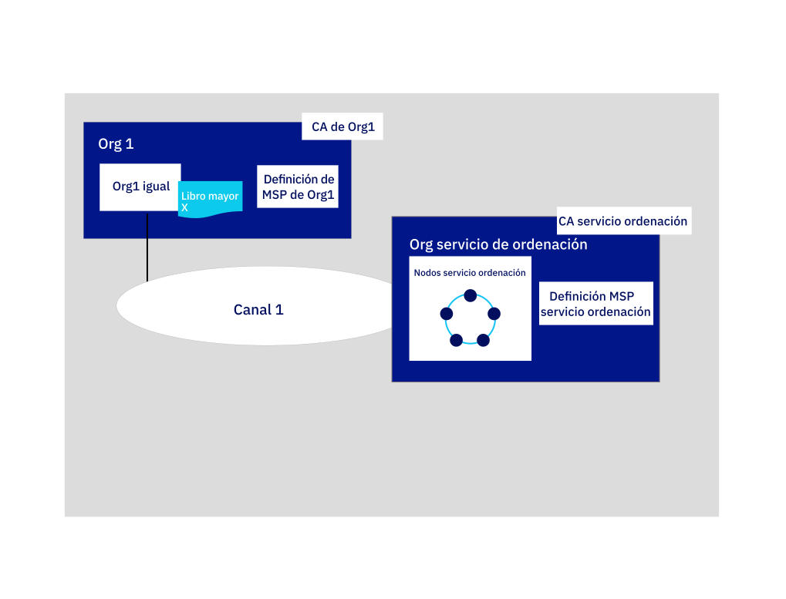

---

copyright:
  years: 2019
lastupdated: "2019-05-16"

keywords: getting started tutorials, create a CA, enroll, register, create an MSP, wallet, create a peer, create ordering service, Raft

subcollection: blockchain

---

{:new_window: target="_blank"}
{:shortdesc: .shortdesc}
{:screen: .screen}
{:codeblock: .codeblock}
{:note: .note}
{:important: .important}
{:tip: .tip}
{:pre: .pre}

# Guía de aprendizaje sobre cómo crear una red
{: #ibp-console-build-network}

{{site.data.keyword.blockchainfull}} Platform es una oferta de tipo blockchain-as-a-service que le permite desarrollar, desplegar y trabajar con redes y aplicaciones blockchain. Puede obtener más información sobre los componentes de blockchain y sobre cómo funcionan juntos en la [visión general de los componentes de blockchain](/docs/services/blockchain/blockchain_component_overview.html#blockchain-component-overview). Esta guía de aprendizaje es la primera parte de la [serie de guías de aprendizaje de red de ejemplo](/docs/services/blockchain/howto/ibp-console-build-network.html#ibp-console-build-network-sample-tutorial) y describe cómo utilizar la consola de {{site.data.keyword.blockchainfull_notm}} Platform para crear una red totalmente funcional en un solo servicio Kubernetes de {{site.data.keyword.cloud_notm}}.
{:shortdesc}

Si utiliza la versión de prueba beta de {{site.data.keyword.blockchainfull_notm}} Platform, es probable que algunos paneles de la consola no coincidan con la documentación actual, que se mantiene actualizada con la instancia de servicio con disponibilidad general (GA). Para obtener las ventajas de todas las funciones más recientes, en este momento se recomienda que suministre una nueva instancia de servicio de GA siguiendo las instrucciones de [Iniciación a {{site.data.keyword.blockchainfull_notm}} Platform on {{site.data.keyword.cloud_notm}}](/docs/services/blockchain/howto/ibp-v2-deploy-iks.html#ibp-v2-deploy-iks).
{: important}

**Audiencia de destino:** este tema está diseñado para los operadores de red responsables de crear, supervisar y gestionar la red blockchain.

Si aún no ha utilizado la consola de {{site.data.keyword.blockchainfull_notm}} Platform para desplegar componentes en un clúster Kubernetes utilizando el servicio Kubernetes de {{site.data.keyword.cloud_notm}}, consulte [Iniciación a {{site.data.keyword.blockchainfull_notm}} Platform on {{site.data.keyword.cloud_notm}}](/docs/services/blockchain/howto/ibp-v2-deploy-iks.html#ibp-v2-deploy-iks). Tenga en cuenta que la propia consola no reside en el clúster. Es una herramienta que puede utilizar para desplegar componentes en el clúster.


Tanto si realiza el despliegue de los componentes en un clúster Kubernetes de pago como si lo hace en uno gratuito, utilice el panel de control de Kubernetes para descubrir los recursos disponibles cuando elija desplegar nodos y crear canales. Es su responsabilidad gestionar el clúster de Kubernetes y desplegar recursos adicionales si es necesario. Aunque los componentes se desplegarán correctamente en un clúster gratuito, cuantos más componentes añada más lenta será su ejecución. Para obtener más información sobre el dimensionamiento de los componentes y cómo interactúa la consola con el clúster Kubernetes, consulte [Asignación de recursos](/docs/services/blockchain/howto/ibp-console-govern.html#ibp-console-govern-iks-console-interaction).
{: note}

## Serie de guías de aprendizajes de red de ejemplo
{: #ibp-console-build-network-sample-tutorial}

Esta serie de guías de aprendizaje de tres partes le guía por el proceso de creación e interconexión de una red Hyperledger Fabric de varios nodos relativamente sencilla utilizando la consola de {{site.data.keyword.blockchainfull_notm}} Platform para desplegar una red en el clúster Kubernetes e instalar y crear una instancia de un contrato inteligente. Tenga en cuenta que, aunque esta guía de aprendizaje le mostrará cómo funciona este proceso con un clúster Kubernetes de pago, se aplica el mismo flujo básico a los clústeres gratuitos, aunque con ciertas limitaciones (por ejemplo, no puede dimensionar ni redimensionar nodos en un clúster gratuito).

* **Guía de aprendizaje sobre cómo crear una red** Esta guía de aprendizaje le guiará a través del proceso de alojar una red mediante la creación de dos organizaciones, una para el igual y otra para el servicio de ordenación, y un canal. Utilice esta guía de aprendizaje si desea formar un consorcio de blockchain mediante la creación de un servicio de ordenación y la adición de organizaciones.
* La [guía de aprendizaje sobre cómo unirse a una red](/docs/services/blockchain/howto/ibp-console-join-network.html#ibp-console-join-network) le guiará a través del proceso de unirse a una red existente mediante la creación de un igual y su unión a un canal existente. Utilice esta guía de aprendizaje si no tiene intención de alojar una red mediante la creación de un servicio de ordenación, o si desea aprender el proceso para unirse a otras redes.
* [Desplegar un contrato inteligente en la red](/docs/services/blockchain/howto/ibp-console-smart-contracts.html#ibp-console-smart-contracts) muestra cómo escribir un contrato inteligente y desplegarlo en una red.


### La estructura de esta red
{: #ibp-console-build-network-structure}

Si sigue todos los pasos de las guías de aprendizaje **Crear una red** y **Unirse a una red**, su red se parecerá a la de la ilustración siguiente:

*Figura 1. Estructura básica de red de ejemplo*  

Esta configuración es suficiente para probar aplicaciones y contratos, y también como guía para la creación de componentes y la unión a redes de producción que se ajustarán a su propio caso de uso. La red contiene los componentes siguientes:

* **Dos organizaciones iguales**: `Org1` y `Org2`  
  En esta serie de guías de aprendizaje se describe cómo crear dos organizaciones iguales y dos iguales asociados. Imagine que las organizaciones de una red blockchain son como dos bancos distintos que tienen que realizar transacciones entre sí. Crearemos las definiciones de `Org1` y `Org2`.
* **Una organización de servicio de ordenación**: `Ordering Service`  
  Como estamos construyendo un libro mayor distribuido, los iguales y el servicio de ordenación deben formar parte de organizaciones independientes. Por lo tanto, se crea una organización independiente para el servicio de ordenación. Entre otras cosas, un servicio de ordenación ordena los bloques de transacciones que se envían a los iguales para que se escriban en sus libros mayores y formen parte de blockchain. Crearemos la definición de la organización `Ordering Service`.
* **Tres entidades emisoras de certificados (CA)**: `CA de Org1, CA de Org2, CA de servicio de ordenación`   
  Una CA es el nodo que emite certificados tanto para los usuarios como para los nodos asociados con una organización. Debido a que se recomienda desplegar una CA por organización, desplegaremos tres CA en total: una para cada organización igual y otra para la organización del servicio de ordenación. Estas CA también crearán la definición de cada organización, encapsulada por un Proveedor de servicios de pertenencia (MSP). Se despliega una CA de TLS junto a la CA de la organización. Esta CA proporciona certificados que se utilizan para la comunicación entre nodos. Aunque se trata de una buena práctica establecer un administrador independiente para la CA de TLS, en esta guía de aprendizaje no mostraremos dicho proceso. Para obtener más información, consulte [Utilización de la CA de TLS](/docs/services/blockchain/howto/ibp-console-identities.html#ibp-console-identities-tlsca).
* **Un servicio de ordenación:** `Ordering Service`  
  Aunque los despliegues que se ejecutan en un clúster de pago tienen la opción de realizar el despliegue en un servicio de ordenación de un nodo o un servicio de ordenación de cinco nodos con tolerancia a errores y bloqueos, los clústeres gratuitos solo tienen la opción de ejecutarse en un único nodo. El servicio de ordenación de cinco nodos utiliza una implementación del protocolo Raft (para obtener más información acerca de Raft, consulte [El servicio de ordenación ](https://hyperledger-fabric.readthedocs.io/en/release-1.4/orderer/ordering_service.html#raft)) y es la opción de despliegue que presentará esta guía de aprendizaje. Actualmente, solo hay soporte para una organización de servicio de ordenación por servicio de ordenación, independientemente del número de nodos de ordenación asociados a dicha organización. Este servicio de ordenación añadirá organizaciones iguales a su "consorcio", que es la lista de organizaciones iguales que pueden crear y unirse a canales. Si desea crear un canal que tenga organizaciones desplegadas en distintos clústeres, que es el modo en que se estructurarán la mayoría de las redes de producción, el administrador del servicio de ordenación también tiene que importar en su consola una organización igual que se haya desplegado en otra consola. Esto permite a la organización igual unirse al canal que se aloja en dicho servicio de ordenación.
* **Dos iguales:** `Org1 igual` y `Org2 igual`  
  El libro mayor, `Ledger x` en la ilustración anterior, se mantiene mediante iguales distribuidos. Estos iguales se despliegan utilizando [Couch DB ](https://hyperledger-fabric.readthedocs.io/en/release-1.4/couchdb_as_state_database.html) como base de datos de estado en un contenedor independiente asociado con el igual. Esta base de datos contiene el valor actual de todo el "estado" (representado por pares de clave-valor). Por ejemplo, supongamos que `Org1` (un valor) es el propietario actual de un activo bancario (la clave). El blockchain, la lista de transacciones, se almacena de forma lógica en el igual.
* **Un canal**: `channel1`  
  Los canales permiten que los conjuntos de organizaciones realicen transacciones sin exponer sus datos a organizaciones que no sean miembros del canal. Cada canal tiene su propio libro mayor, gestionado de forma colectiva por los iguales que se han unido a dicho canal. En la guía de aprendizaje se crea un canal al que se han unido ambas organizaciones, y muestra cómo crear una instancia del contrato inteligente en el canal que las organizaciones pueden utilizar para realizar transacciones.

Esta configuración no es obligatoria. {{site.data.keyword.blockchainfull_notm}} Platform permite un alto grado de personalización. Si tiene recursos disponibles en el clúster de Kubernetes, puede utilizar la consola para desplegar componentes en una matriz sin fin de configuraciones. En esta guía de aprendizaje se muestran los pasos a seguir para crear su propia red, con referencias a temas que proporcionan información más detallada sobre {{site.data.keyword.blockchainfull_notm}} Platform y sobre la consola.

En esta guía de aprendizaje sobre cómo **crear una red**, solo creamos una parte de la red anterior, una red simple que se puede utilizar para alojar un servicio de ordenación y una sola organización igual y un igual en un solo canal. En la siguiente ilustración se muestra la parte de la red anterior que vamos a crear:   
*Figura 2. Estructura de una red simple*  

Esta configuración resulta útil para empezar rápidamente a trabajar con un contrato inteligente y para probarlo, pero no tiene mucho sentido si añade otras organizaciones con las que realizar transacciones, creando una red realmente distribuida. Por lo tanto, en la siguiente guía de aprendizaje sobre cómo [unirse a una red](/docs/services/blockchain/howto/ibp-console-join-network.html#ibp-console-join-network), mostramos cómo crear organizaciones iguales e iguales adicionales y cómo añadir una nueva organización al canal.

En esta guía de aprendizaje, suministramos **valores recomendados** para los campos de la consola. Esto permite reconocer más fácilmente los nombres e identidades en los separadores y listas desplegables. Estos valores no son obligatorios, pero los encontrará útiles, especialmente teniendo en cuenta que deberá recordar determinados valores como ID y secretos de usuarios registrados que especifique en pasos anteriores. Debido a que estos valores no se almacenan en la consola, si los olvida, tendrá que registrar usuarios adicionales y empezar el proceso una y otra vez. Ofrecemos una tabla de valores recomendados tras cada tarea y recomendamos que, si no utiliza los valores recomendados, registre sus valores a medida que avanza por la guía de aprendizaje.
{:tip}

## Paso uno: crear una organización y su punto de entrada al blockchain
{: #ibp-console-build-network-create-peer-org1}

Para cada organización que desee crear mediante la consola, debe desplegar al menos una CA. Una CA es el nodo que emite certificados a todos los participantes en la red (iguales, servicios de ordenación, clientes, administradores, etc.). Estos certificados, que incluyen un certificado para firmas y una clave privada, permiten que los participantes de la red se comuniquen, se autentiquen y, en última instancia, realicen transacciones. Estas CA crearán todas las identidades y certificados que pertenecen a su organización, además de definir la propia organización. A continuación, puede utilizar estas identidades para desplegar nodos, crear identidades de administrador y enviar transacciones. Para obtener más información sobre la CA y las identidades que tendrá que crear, consulte [Gestión de identidades](/docs/services/blockchain/howto/ibp-console-identities.html#ibp-console-identities).

En esta guía de aprendizaje, crearemos dos organizaciones: una será propietaria de un igual y la otra que será propietaria de un servicio de ordenación. Cada organización necesita una CA para emitir sus certificados, por lo tanto debemos crear **dos CA**. En esta guía de aprendizaje, **crearemos las CA de una en una**.

Vea el siguiente [vídeo ](http://ibm.biz/BlockchainPlatformSeries2 "Desplegar un igual en {{site.data.keyword.blockchainfull_notm}} Platform") y conozca el proceso de crear la organización del igual y el igual.


### Creación de la CA de la organización del igual
{: #ibp-console-build-network-create-CA-org1CA}

Como parte de esta guía de aprendizaje, su CA emite los certificados y claves privadas para sus usuarios y nodos. Estas identidades no están gestionadas por {{site.data.keyword.IBM_notm}} y las claves no se almacenan en la consola. Solo se almacenan en el almacenamiento local del navegador. Por lo tanto, asegúrese de exportar sus identidades y el MSP de la organización. Si intenta acceder a la consola desde una máquina distinta o desde otro navegador, deberá importar estas identidades y definiciones de organización.
{:important}

Para crear la CA que emitirá certificados para la primera organización, realice los pasos siguientes en la consola:

1. Vaya a separador **Nodos** de la izquierda y pulse **Añadir entidad emisora de certificados**. Los paneles laterales le permitirán personalizar la CA que desea crear y la organización para la que esta CA emitirá claves.
2. Pulse **{{site.data.keyword.cloud_notm}}** en **Crear entidad emisora de certificados** y pulse **Siguiente**.
3. Utilice el segundo panel lateral para dar a la CA un **nombre de visualización**. El valor recomendado para esta CA es `CA de Org1`.
4. En el siguiente panel, proporcione sus credenciales de administrador de CA especificando un **ID de inscripción de administrador de CA** de `admin` y un secreto de `adminpw`. Una vez más, estos son los **valores recomendados**.
5. Si utiliza un clúster de pago, tiene la oportunidad de configurar la asignación de recursos del nodo. A efectos de esta guía de aprendizaje, acepte todos los valores predeterminados y pulse **Siguiente**. Si desea obtener más información sobre cómo asignar recursos al nodo, consulte este tema sobre [Asignación de recursos](/docs/services/blockchain?topic=blockchain-ibp-console-govern#ibp-console-govern-allocate-resources). Si utiliza un clúster gratuito, podrá ver la página **Resumen**.
6. Revise la página Resumen y luego pulse **Añadir entidad emisora de certificados**.

**Tarea: creación de la CA de la organización igual**

  | **Campo** | **Nombre de visualización** | **ID de inscripción** | **Secreto** |
  | ------------------------- |-----------|-----------|-----------|
  | **Crear CA** | CA de Org1  | admin | adminpw |

  *Figura 3. Creación de la CA de la organización igual*

Después de desplegar la CA, la utilizará cuando cree el MSP de la organización, registre usuarios y cree su punto de entrada en una red, el **igual**.

Es posible que los usuarios avanzados tengan ya su propia CA y que no deseen crear una nueva CA en la consola. Si la CA existente puede emitir certificados en formato `X.509`, puede utilizar su propia CA externa en lugar de crear una nueva aquí. Consulte este tema sobre la [Utilización de certificados de una CA externa con su igual o servicio de ordenación](/docs/services/blockchain/howto/ibp-console-build-network.html#ibp-console-build-network-third-party-ca) para obtener más información.

### Utilización de la CA para registrar identidades
{: #ibp-console-build-network-use-CA-org1}

Cada nodo o aplicación que desee crear necesita un certificado o una clave privada para participar en la red blockchain. También tiene que crear identidades de administración para estos nodos y aplicaciones para que pueda gestionarlos desde la consola. Pasaremos por este proceso dos veces, una para cada CA que creemos. Y, para cada CA, creará dos identidades:

* **Un administrador de la organización**: esta identidad le permite trabajar con nodos utilizando la consola de la plataforma.
* **Una identidad de igual**: esta es la identidad del propio igual. Siempre que un igual realice una acción (por ejemplo, aprobar una transacción), la firmará utilizando este certificado.

En función de su tipo de clúster, el despliegue de la CA puede tardar hasta diez minutos. Cuando la CA se despliegue por primera vez (o cuando la CA no esté disponible), el recuadro en el mosaico de la CA estará en color gris. Cuando la CA se haya desplegado correctamente y esté en ejecución, el recuadro estará en color verde, indicando que está "En ejecución" y que se puede utilizar para registrar identidades. Antes de continuar con los pasos siguientes para registrar identidades, debe esperar a que el estado de la CA sea "En ejecución".
{:important}

Una vez que la CA esté en ejecución, tal como lo indica el recuadro verde del mosaico, genere estos certificados realizando los pasos siguientes:

1. Pulse sobre `CA de Org1` y asegúrese de que la identidad `admin` que ha creado para la CA sea visible en la tabla. A continuación, pulse el botón **Registrar usuario**.
2. En primer lugar, registraremos el administrador de la organización, lo cual se puede hacer proporcionando un **ID de inscripción** de `org1admin` y un **secreto** de `org1adminpw`. A continuación, establezca el `Tipo` de esta identidad en `cliente` (las identidades de administrador siempre se deben registrar como `cliente`, mientras que las identidades de nodo siempre se deben registrar utilizando el tipo `igual`). Puede pasar por alto el campo **Inscripciones máximas**. Si desea obtener más información sobre las inscripciones, consulte [Registro de identidades](/docs/services/blockchain/howto/ibp-console-identities.html#ibp-console-identities-register). Pulse **Siguiente**.
3. Para los fines de esta guía de aprendizaje, no es necesario utilizar **Añadir atributo**. Si desea obtener más información sobre los atributos de identidad, consulte [Registro de identidades](/docs/services/blockchain/howto/ibp-console-identities.html#ibp-console-identities-register).
4. Una vez que se haya registrado el administrador de la organización, repita este mismo proceso para la identidad del igual (utilizando también `CA de Org1`). Para la identidad del igual, proporcione un ID de inscripción de `peer1` y un secreto de `peer1pw`. Se trata de una identidad de nodo, de modo que seleccione `igual` como **Tipo**. Puede pasar por alto el campo **Inscripciones máximas** y, en el siguiente panel, no asigne **Atributos**, igual que antes.

El registro de estas identidades con la CA es solo el primer paso para **crear** una identidad. No podrá utilizar estas identidades hasta que se hayan **inscrito**. Para la identidad `org1admin`, esto se producirá durante la creación del MSP, que veremos en el siguiente paso. En el caso del igual, esto ocurre durante la creación del igual.
{:note}

**Tarea: registrar usuarios**

  |  **Campo** | **Descripción** | **ID de inscripción** | **Secreto** |
  | ------------------------- |-----------|-----------|-----------|-----------|
  | **Registrar usuarios** |  Admin de Org1 | org1admin | org1adminpw |
  | | Identidad del igual |  peer1 | peer1pw |

  *Figura 4. Utilización de su CA para registrar usuarios*

### Creación de la definición de MSP de la organización igual
{: #ibp-console-build-network-create-peers-org1}

Ahora que hemos creado la CA del igual y la hemos utilizado para **registrar** identidades para el administrador de `Org1` y para el igual que asociaremos con `Org1`, necesitamos crear una definición formal de la organización del igual, conocida como MSP. Tenga en cuenta que muchos iguales pueden pertenecer a una organización. **No es necesario que cree una nueva organización cada vez que cree un igual**. Como esta es la primera vez que revisamos la guía de aprendizaje, crearemos el ID de MSP para esta organización. Durante el proceso de creación del MSP, vamos a generar certificados para la identidad `org1admin` y los vamos a añadir a nuestra cartera.

1. Vaya al separador **Organizaciones** en el panel de navegación izquierdo y pulse **Crear definición de MSP**.
2. Asigne a su MSP el nombre de visualización `MSP de Org1` y el ID de MSP `org1msp`. Si desea especificar su propio ID de MSP en este campo, asegúrese de seguir las especificaciones de la herramienta de sugerencias sobre las limitaciones de este nombre.
3. En **Detalles de la entidad emisora de certificados raíz**, especifique la CA que ha utilizado para registrar las identidades en el paso anterior. Si esta es su primera vez que examina esta guía de aprendizaje, solo debería ver una: `CA de Org1`.
4. Los campos **ID de inscripción** y **Secreto de inscripción** bajo la misma contendrán el ID y el secreto de inscripción del primer usuario que ha creado con la CA: `admin` y `adminpw`. No obstante, el uso de esta identidad haría que la organización tuviera la misma identidad que su identidad de CA, lo que no se recomienda por motivos de seguridad. En su lugar, seleccione el ID de inscripción que ha creado para el administrador de la organización en la lista desplegable, `org1admin`, y especifique su secreto asociado, `org1adminpw`. A continuación, asigne a esta identidad un nombre de visualización, `Admin de Org1`.
5. Pulse el botón **Generar** para inscribir esta identidad como administrador de la organización y exporte la identidad a la cartera, donde se utilizará cuando se cree el igual y cuando se creen canales.
6. Pulse **Exportar** para exportar los certificados de administrador al sistema de archivos. Como se ha dicho anteriormente, esta identidad no se almacena en la consola ni la gestiona {{site.data.keyword.IBM_notm}}. Se almacena únicamente en el almacenamiento del navegador local. Si cambia de navegador, deberá importar esta identidad en su cartera para poder administrar el igual.
7. Pulse **Crear definición de MSP**.

**Tarea: crear el MSP de la organización igual**

  |  | **Nombre de visualización** | **ID de MSP** | **ID de inscripción**  | **Secreto** |
  | ------------------------- |-----------|-----------|-----------|-----------|
  | **Crear organización** | MSP de Org1 | org1msp |||
  | **CA raíz** | CA de Org1 ||||
  | **Cert de administrador de la org** | |  | org1admin | org1adminpw |
  | **Identidad** | Admin de Org1 |||||

  *Figura 5. Crear la definición de MSP de la organización igual*

Una vez que haya creado el MSP, debe poder ver el administrador de la organización igual en la **cartera**, a la que se puede acceder pulsando sobre **Cartera** en la navegación de la izquierda.

**Tarea: comprobar la cartera**

  | **Campo** |  **Nombre de visualización** | **Descripción** |
  | ------------------------- |-----------|----------|
  | **Identidad** | Admin de Org1 | Identidad de administrador de Org1 |

  *Figura 6. Comprobar la cartera*

Para obtener más información sobre los MSP, consulte [Gestión de organizaciones](/docs/services/blockchain/howto/ibp-console-organizations.html#ibp-console-organizations).

Es importante exportar la identidad del administrador de la organización porque usted es el responsable de gestionar y proteger estos certificados.
{:important}

### Creación de un igual
{: #ibp-console-build-network-peer-create}

Después de [crear una CA](/docs/services/blockchain/howto/ibp-console-build-network.html#ibp-console-build-network-create-CA-org1CA), de utilizarla para registrar identidades y de crear el [MSP de la organización igual](/docs/services/blockchain/howto/ibp-console-build-network.html#ibp-console-build-network-create-peers-org1), está listo para crear un igual.

#### ¿Qué rol juegan los iguales?
{: #ibp-console-build-network-peer-role}

Es importante recordar que las propias organizaciones no mantienen libros mayores. Los iguales sí lo hacen. Las organizaciones también utilizan iguales para firmar propuestas de transacciones y para aprobar actualizaciones de configuraciones de canal. Como el hecho de tener al menos dos iguales en un canal hace que esté altamente disponible, se recomienda tener al menos dos iguales unidos a un canal para implementaciones de nivel de producción. En esta guía de aprendizaje, solo mostraremos el proceso para crear un único igual.

Desde una perspectiva de asignación de recursos, es posible unir los mismos iguales a varios canales. El diseño del igual garantiza que los datos procedentes de un canal no pueden pasar a otro a través del igual. Sin embargo, debido a que el igual almacenará un libro mayor independiente para cada canal, es necesario asegurarse de que el igual tiene suficiente potencia de proceso y almacenamiento para manejar la transacción y la carga de datos.

#### Despliegue del igual
{: #ibp-console-build-network-deploy-peer-role}

Utilice la consola para seguir los pasos siguientes:

1. En la página **Nodos**, pulse **Añadir igual**.
2. Pulse {{site.data.keyword.cloud_notm}} en **Crear un nuevo igual** y pulse **Siguiente**.
3. Asigne a su igual el **Nombre de visualización** `Org1 igual`.
4. En la pantalla siguiente, seleccione `CA de Org1`, ya que esta es la CA que ha utilizado para registrar la identidad del igual. Seleccione el **ID de inscripción** de la identidad de igual que ha creado para el igual en la lista desplegable, `peer1`, y especifique su **secreto** asociado, `peer1pw`. A continuación, seleccione `MSP de Org1` en la lista desplegable y pulse **Siguiente**.
5. El siguiente panel lateral solicita la información de la CA de TLS. Cuando haya creado la CA, se habrá creado una CA de TLS junto a ella. Esta CA se utiliza para crear certificados para la capa de comunicación segura para los nodos. Por lo tanto, seleccione el **ID de inscripción** de la identidad de igual que haya creado para el igual en la lista desplegable, `peer1`, y especifique el **secreto** asociado, `peer1pw`. El **Nombre de host de CSR de TLS** es una opción disponible para los usuarios avanzados que deseen especificar un nombre de dominio personalizado que se puede utilizar para direccionar el punto final del igual. Los nombres de dominio personalizados no forman parte de esta guía de aprendizaje, por lo que debe dejar el **Nombre de host de CSR de TLS** en blanco por ahora.
6. El siguiente panel lateral le solicita **Asociar una identidad** para convertirla en el administrador del igual. Para los fines de esta guía de aprendizaje, haga que el administrador de su organización, `Admin de Org1`, sea también el administrador del igual. Es posible registrar e inscribir una identidad distinta con `CA de Org1` y convertir dicha identidad en el administrador del igual, pero esta guía de aprendizaje utiliza la identidad `Admin de Org1`.
7. Si utiliza un clúster de pago, en el panel siguiente, tendrá la oportunidad de configurar la asignación de recursos del nodo. A efectos de esta guía de aprendizaje, puede aceptar todos los valores predeterminados y pulsar **Siguiente**. Si desea obtener más información sobre cómo asignar recursos al nodo, consulte este tema sobre [Asignación de recursos](/docs/services/blockchain?topic=blockchain-ibp-console-govern#ibp-console-govern-allocate-resources). Si utiliza un clúster gratuito, podrá ver la página **Resumen**.
8. Revise el resumen y pulse **Añadir igual**.

**Tarea: despliegue de un igual**

  |  | **Nombre de visualización** | **ID de MSP** | **ID de inscripción** | **Secreto** |
  | ------------------------- |-----------|-----------|-----------|-----------|
  | **Crear igual** | Org1 igual | org1msp |||
  | **CA** | CA de Org1 ||||
  | **Identidad de igual** | |  | peer1 | peer1pw |
  | **Certificado de administrador** | org1msp ||||
  | **CA de TLS** | CA de Org1 ||||
  | **ID de CA de TLS** | || admin | adminpw |
  | **Asociar identidad** | Admin de Org1 |||||

  *Figura 7. Despliegue de un igual*

En un escenario de producción, se recomienda desplegar tres iguales en cada canal. Eso es para permitir que un igual pueda estar inactivo (por ejemplo, durante un ciclo de mantenimiento) y seguir teniendo iguales de alta disponibilidad. Para desplegar más de un igual para una organización, utilice la misma CA que ha utilizado para registrar la primera identidad de igual. En esta guía de aprendizaje, esto sería `CA de Org1`. A continuación, registre una nueva identidad de igual utilizando un ID de inscripción y un secreto distintos. Por ejemplo, `org1secondpeer` y `org1secondpeerpw`. A continuación, al crear el igual, proporcione este ID de inscripción y este secreto. Debido a que este igual sigue estando asociado a Org1, elija `CA de Org1`, `MSP de Org1` y `Admin de Org1` en las listas desplegables. Puede optar por proporcionar a este nuevo igual un administrador distinto, que se puede registrar e inscribir con `CA de Org1`, pero esto es opcional. Esta serie de guías de aprendizaje solo mostrarán el proceso para crear un igual individual para cada organización de igual.
{:tip}

## Paso dos: crear el nodo que ordena las transacciones
{: #ibp-console-build-network-create-orderer}

En otros blockchains distribuidos, como Ethereum y Bitcoin, no hay ninguna autoridad central que ordene las transacciones y las envíe a los iguales. Hyperledger Fabric, el blockchain en el que se basa {{site.data.keyword.blockchainfull_notm}} Platform, funciona de otra forma. Presenta un nodo, o un clúster de nodos, denominado **servicio de ordenación**.

El servicio de ordenación es un componente clave en una red, ya que realiza varias funciones esenciales:

- Literalmente **clasifican** los bloques de transacciones que se envían a los iguales para que se escriban en sus libros mayores. Este proceso se denomina "ordenación".
- Mantienen el **canal del sistema de ordenación**, el lugar en el que reside el **consorcio**, la lista de organizaciones de iguales que tienen permiso para crear canales. Un consorcio es básicamente un vehículo de varios arrendamientos y un solo servicio de ordenación, por diseño, puede alojar varios consorcios.
- **Imponen las políticas** decididas por el consorcio o por los administradores del canal. Estas políticas controlan desde quién tiene acceso de lectura o de escritura en un canal hasta quién puede crear o modificar un canal. Por ejemplo, cuando un participante en la red solicita modificar un canal o una política de consorcio, el servicio de ordenación procesa la solicitud para ver si el participante tiene los derechos de administración adecuados para dicha actualización de la configuración, lo valida en la configuración existente, genera una nueva configuración y la transmite a los iguales.

Para obtener más información sobre los servicios de ordenación y el papel que desempeñan en las redes basadas en Hyperledger Fabric, consulte [El servicio de ordenación ](https://hyperledger-fabric.readthedocs.io/en/release-1.4/orderer/ordering_service.html).

En un clúster de pago, tiene la opción de crear un servicio de ordenación de un nodo (suficiente para fines de prueba) y un servicio de ordenación con tolerancia a fallos por bloqueo que ofrezca cinco nodos vinculados a una única organización. En un clúster gratuito, únicamente podrá crear un servicio de ordenación de un solo nodo. En esta guía de aprendizaje, mostraremos el servicio de ordenación de cinco nodos.

No obstante, al igual que sucede con el igual, para poder crear un servicio de ordenación, es necesario crear una CA para proporcionar las identidades y el MSP de nuestra organización del servicio de ordenación.

Vea el siguiente [vídeo ](http://ibm.biz/BlockchainPlatformSeries3 "Desplegar un servicio de ordenación en {{site.data.keyword.blockchainfull_notm}} Platform") para obtener información sobre el proceso para crear la organización del servicio de ordenación y el propio servicio de ordenación.

### Ordenación en la consola
{: #ibp-console-build-network-ordering-console}

En este release, no se admiten servicios de ordenación distribuidos, en los que varias organizaciones aportan nodos a un servicio de ordenación. Cada nodo de ordenación del servicio de ordenación lo administrará una organización individual.

El servicio de ordenación de nivel de producción disponible es un servicio de ordenación con tolerancia a errores de bloqueo (CFT) basado en una implementación del protocolo Raft en `etcd`. Raft sigue un modelo de "líder y seguidor", donde se elige un nodo líder (por canal) y sus decisiones se reproducen en los seguidores. Los servicios de ordenación de Raft deben ser más fáciles de configurar que los servicios de ordenación basados en Kafka, y su diseño permite que las diversas organizaciones puedan aportar nodos a un servicio de ordenación distribuido. Para obtener más información sobre Raft, consulte [El servicio de ordenación ](https://hyperledger-fabric.readthedocs.io/en/release-1.4/orderer/ordering_service.html#raft).

Actualmente, la única configuración de tolerancia a errores de bloqueo disponible es la de **cinco** nodos. Aunque técnicamente es posible crear un servicio de ordenación con tolerancia a errores de bloqueo con un mínimo de tres nodos (los servicios de ordenación de dos nodos no se recomiendan en ningún caso), disponer de solo tres nodos puede ocasionar problemas potenciales cuando los nodos pasan a estar inactivos, por ejemplo, durante una actualización.

Como resultado, los clústeres de pago solo ofrecen elegir entre un nodo y cinco nodos. Las redes de producción deben elegir la opción de cinco nodos, ya que un servicio de ordenación de un nodo es, por definición, no tolerante a errores de bloqueo.

En esta guía de aprendizaje, crearemos un servicio de ordenación de cinco nodos.

### Creación de la CA de organización del servicio de ordenación
{: #ibp-console-build-network-create-orderer-ca}

El proceso de creación de una CA para un servicio de ordenación es idéntico al proceso de creación de la misma para un igual.

1. Vaya a separador **Nodos** y pulse **Añadir entidad emisora de certificados**.
2. Pulse **{{site.data.keyword.cloud_notm}}** en **Crear una nueva entidad emisora de certificados** y pulse **Siguiente**
3. Asigne a esta CA un nombre de visualización exclusivo, `CA de servicio de ordenación`.
4. Tiene libertad para reutilizar el **ID de inscripción de administrador de CA** de `admin` y un secreto de `adminpw`. Como esta es una CA distinta, esta identidad es diferente a la identidad de administrador de CA creada para `CA de Org1`, aunque el ID y el secreto son idénticos.
5. Si utiliza un clúster de pago, en el panel siguiente, tendrá la oportunidad de configurar la asignación de recursos de la CA. A efectos de esta guía de aprendizaje, acepte todos los valores predeterminados y pulse **Siguiente**. Si desea obtener más información sobre cómo asignar recursos al nodo, consulte este tema sobre [Asignación de recursos](/docs/services/blockchain?topic=blockchain-ibp-console-govern#ibp-console-govern-allocate-resources).  Si utiliza un clúster gratuito, podrá ver la página **Resumen**.
6. Revise la página Resumen y luego pulse **Añadir entidad emisora de certificados**.

Al igual que con el igual, es posible que los usuarios avanzados tengan ya su propia CA y no deseen crear una nueva CA utilizando la consola. Si la CA existente puede emitir certificados en formato `X.509`, puede utilizar su propia CA externa en lugar de crear una nueva aquí. Consulte este tema sobre la [Utilización de certificados de una CA externa con su igual o servicio de ordenación](/docs/services/blockchain/howto/ibp-console-build-network.html#ibp-console-build-network-third-party-ca) para obtener más información.

### Utilización de la CA para registrar las identidades del nodo del servicio de ordenación y el administrador del servicio de ordenación
{: #ibp-console-build-network-use-CA-orderer}

Al igual que hemos hecho con el igual, tenemos que registrar dos identidades con nuestra CA de servicio de ordenación.  Después de seleccionar la CA, tendrá que registrar un administrador para nuestra organización de servicio de ordenación y una identidad para el propio servicio de ordenación. Como antes, debería ver una identidad en el separador `CA de servicio de ordenación`; es el administrador que ha creado para la CA.

En función de su tipo de clúster, el despliegue de la CA puede tardar hasta diez minutos. Cuando la CA se despliegue por primera vez (o cuando la CA no esté disponible), el recuadro en el mosaico de la CA estará en color gris. Cuando la CA se haya desplegado correctamente y esté en ejecución, el recuadro estará en color verde, indicando que está "En ejecución" y que se puede utilizar para registrar identidades. Antes de continuar con los pasos siguientes para registrar identidades, debe esperar a que el estado de la CA sea "En ejecución".
{:important}

Una vez que la CA esté en ejecución, tal como lo indica el recuadro verde del mosaico de la `CA de servicio de ordenación`, genere estos certificados realizando los pasos siguientes:

1. Pulse sobre `CA de servicio de ordenación` en el separador **Nodos** y asegúrese de que la identidad `admin` que ha creado para la CA sea visible en la tabla. A continuación, pulse el botón **Registrar usuario**.
2. En primer lugar, registraremos el administrador de la organización, lo cual se puede hacer proporcionando un **ID de inscripción** de `OSadmin` y un **secreto** de `OSadminpw`. A continuación, establezca el `Tipo` de esta identidad en `cliente` (las identidades de administrador siempre se deben registrar como `cliente`, mientras que las identidades de nodo siempre se deben registrar utilizando el tipo `igual`). Puede pasar por alto el campo **Inscripciones máximas**. Si desea obtener más información sobre las inscripciones, consulte [Registro de identidades](/docs/services/blockchain/howto/ibp-console-identities.html#ibp-console-identities-register). Pulse **Siguiente**.
3. Para los fines de esta guía de aprendizaje, no es necesario utilizar **Añadir atributo**. Si desea obtener más información sobre los atributos de identidad, consulte [Registro de identidades](/docs/services/blockchain/howto/ibp-console-identities.html#ibp-console-identities-register).
4. 5. Una vez que se haya registrado el administrador de la organización, repita este mismo proceso para la identidad del servicio de ordenación (utilizando también `CA de servicio de ordenación`). Para las identidades de nodo del servicio de ordenación, proporcione un ID de inscripción de `OS1` y un secreto de `OS1pw`. Se trata de una identidad de nodo, de modo que seleccione `igual` como **Tipo**. Puede pasar por alto el campo **Inscripciones máximas** y, en el siguiente panel, no asigne **Atributos**, igual que antes.

**Tarea: crear una CA y registrar usuarios**

  | **Campo** | **Descripción** | **ID de inscripción** | **Secreto** |
  | ------------------------- |-----------|-----------|-----------|-----------|
  | **Crear CA** | CA de servicio de ordenación | admin | adminpw |
  | **Registrar usuarios** | Administrador de servicio de ordenación | OSadmin | OSadminpw |
  |  | Identidad del nodo del servicio de ordenación |  OS1 | OS1pw |

*Figura 8. Crear una CA y registrar usuarios*

Para los fines de esta guía de aprendizaje, solo vamos a crear una identidad de un nodo. Esta identidad la utilizarán los cinco nodos que se desplegarán para crear el servicio de ordenación. Aunque no querría hacer esto en un servicio de ordenación de varias organizaciones, es aceptable debido a que todos los nodos de ordenación son propiedad de la misma organización.

### Creación de la definición de MSP de la organización del servicio de ordenación
{: #ibp-console-build-network-create-orderer-org-msp}

Cree la definición de MSP de la organización del servicio de ordenación y especifique la identidad del administrador para la organización. Después de registrar el administrador del servicio de ordenación y los usuarios del servicio de ordenación, tenemos que crear el ID de MSP y registrar el usuario `OSadmin` que hemos registrado como administrador de nuestra organización.

1. Vaya al separador **Organizaciones** en el panel de navegación izquierdo y pulse **Crear definición de MSP**.
2. Asigne a su definición de MSP el nombre de visualización `MSP de servicio de ordenación` y el ID de MSP `osmsp`. Si ha elegido un ID de MSP distinto, asegúrese de seguir las especificaciones acerca de las limitaciones de este nombre que muestra la ayuda contextual.
3. En **Detalles de la entidad emisora de certificados raíz**, seleccione la `CA de servicio de ordenación` que hemos creado.
4. Los campos **ID de inscripción** y **Secreto de inscripción** bajo la misma contendrán el ID y el secreto de inscripción del primer usuario que ha creado con la CA: `admin` y `adminpw`. No obstante, el uso de esta identidad haría que la organización tuviera la misma identidad que su identidad de CA, lo que no se recomienda por motivos de seguridad. En su lugar, seleccione el ID de inscripción que ha creado para el administrador de la organización en la lista desplegable, `OSadmin`, y especifique su secreto asociado, `OSadminpw`. A continuación, asigne a esta identidad un nombre de visualización, `Administrador de servicio de ordenación`.
5. Pulse el botón **Generar** para inscribir esta identidad como administrador de la organización y exporte la identidad a la cartera.
6. Pulse **Exportar** para exportar los certificados de administrador al sistema de archivos. Como se ha dicho anteriormente, esta identidad no se almacena en la consola ni la gestiona {{site.data.keyword.IBM_notm}}. Solo se almacena en el navegador. Si cambia de navegador, deberá importar esta identidad para poder administrar el servicio de ordenación.
7. Pulse **Crear definición de MSP**.

**Tarea: crear la definición de MSP de la organización del servicio de ordenación**

  |  | **Nombre de visualización** | **ID de MSP** | **ID de inscripción**  | **Secreto** |
  | ------------------------- |-----------|-----------|-----------|-----------|
  | **Crear organización** | MSP de servicio de ordenación | osmsp |||
  | **CA raíz** | CA de servicio de ordenación ||||
  | **Cert de administrador de la org** | |  | OSadmin | OSadminpw |
  | **Identidad** | Administrador de servicio de ordenación |||||

  *Figura 9. Crear la definición de MSP de la organización del servicio de ordenación*

Una vez que haya creado el MSP, debe poder ver el administrador de la organización del servicio de ordenación en la **cartera**, a la que se puede acceder pulsando sobre **Cartera** en la navegación de la izquierda.

**Tarea: comprobar la cartera**

  | **Campo** |  **Nombre de visualización** | **Descripción** |
  | ------------------------- |-----------|----------|
  | **Identidad** | Admin de Org1 | Identidad de administrador de Org1 |
  | **Identidad** | Administrador de servicio de ordenación | Identidad de administrador del servicio de ordenación |

  *Figura 10. Crear la definición de MSP de la organización del servicio de ordenación*

Para obtener más información sobre los MSP, consulte [Gestión de organizaciones](/docs/services/blockchain/howto/ibp-console-organizations.html#ibp-console-organizations).

Es importante exportar la identidad del administrador de la organización porque usted es el responsable de gestionar y proteger estos certificados. Si exporta el servicio de ordenación y la definición de MSP del servicio de ordenación, se pueden importar en otra consola en la que otro operador pueda crear nuevos canales en el servicio de ordenación o unir iguales al canal.
{:important}

### Creación de un servicio de ordenación
{: #ibp-console-build-network-create-an-orderer}

Siga los pasos siguientes desde la consola:

1. En la página **Nodos**, pulse **Añadir servicio de ordenación**.
2. Pulse el botón {{site.data.keyword.cloud_notm}} bajo **Crear un servicio de ordenación de IBM Cloud** y pulse **Siguiente**.
3. Proporcione al servicio de ordenación un **Nombre de visualización** de `Servicio de ordenación` y, si está en un clúster de pago, elija si desea que el servicio de ordenación tenga un nodo (suficiente para pruebas) o cinco nodos (bueno para producción). Elija **cinco nodos**. Y no seleccione el uso de una CA externa. Esta es una opción avanzada.
4. En el siguiente panel, seleccione `CA de servicio de ordenación` como CA. A continuación, seleccione el **ID de inscripción** de la identidad de nodo que ha creado para el servicio de ordenación en la lista desplegable, `OS1`, y especifique el **secreto** asociado, `OS1pw`. A continuación, seleccione el MSP, `MSP de servicio de ordenación` en la lista desplegable. Para los fines de esta guía de aprendizaje, no seleccione el uso de una CA externa para el servicio de ordenación y, si desea más información, consulte [Utilización de certificados de una entidad emisora de certificados externa](#ibp-console-build-network-third-party-ca). Pulse **Siguiente**.
5. El siguiente panel lateral solicita la información de la CA de TLS. Cuando haya creado la CA, se habrá creado una CA de TLS junto a ella. Esta CA se utiliza para crear certificados para la capa de comunicación segura para los nodos. Por lo tanto, seleccione el **ID de inscripción** de la identidad del servicio de ordenación que ha creado en la lista desplegable, `OS1`, y especifique su secreto **secret** asociado, `OS1pw`. El **Nombre de host de CSR de TLS** es una opción disponible para los usuarios avanzados que deseen especificar un nombre de dominio personalizado que se puede utilizar para direccionar el punto final del servicio de ordenación. Los nombres de dominio personalizados no forman parte de esta guía de aprendizaje, por lo que debe dejar el **Nombre de host de CSR de TLS** en blanco por ahora.
6. El paso **Asociar identidad** le permite elegir un administrador para el servicio de ordenación. Seleccione `Administrador del servicio de ordenación` como antes y pulse **Siguiente**.
7. Si utiliza un clúster de pago, en el panel siguiente, tendrá la oportunidad de configurar la asignación de recursos del nodo. A efectos de esta guía de aprendizaje, puede aceptar todos los valores predeterminados y pulsar **Siguiente**. Las selecciones que realice aquí se aplicarán a los cinco nodos de ordenación. Si desea obtener más información sobre cómo asignar recursos al nodo, consulte este tema sobre [Asignación de recursos](/docs/services/blockchain?topic=blockchain-ibp-console-govern#ibp-console-govern-allocate-resources).
7. Revise la página Resumen y pulse **Añadir servicio de ordenación**.

**Tarea: crear un servicio de ordenación**

  |  | **Nombre de visualización** | **ID de MSP** | **ID de inscripción** | **Secreto** |
  | ------------------------- |-----------|-----------|-----------|-----------|
  | **Crear servicio de ordenación** | Servicio de ordenación | osmsp |||
  | **CA** | CA de servicio de ordenación ||||
  | **Identidad de servicio de ordenación** | |  | OS1 | OS1pw |
  | **Certificado de administrador** | MSP de servicio de ordenación ||||
  | **CA de TLS** | CA de servicio de ordenación ||||
  | **ID de CA de TLS** | || admin | adminpw |
  | **Asociar identidad** | Administrador de servicio de ordenación |||||

  *Figura 11. Crear un servicio de ordenación*

Una vez que se haya creado el servicio de ordenación, podrá verlo en el panel **Nodos**.

## Paso tres: añadir su organización a la lista de organizaciones que pueden realizar transacciones
{: #ibp-console-build-network-add-org}

Como ya hemos observado anteriormente, una organización igual debe ser conocida por el servicio de ordenación para poder crear o unirse a un canal (esto se conoce también como unirse al "consorcio", la lista de organizaciones conocidas por el servicio de ordenación). Esto se debe a que los canales son, a nivel técnico, **vías de acceso de mensajería** entre iguales a través del servicio de ordenación. Del mismo modo que un igual se puede unir a varios canales sin que la información pase de un canal a otro, un servicio de ordenación puede tener varios canales que se ejecutan a través del mismo sin exponer datos a organizaciones de otros canales.

Puesto que solo los administradores del servicio de ordenación pueden añadir organizaciones iguales al consorcio, tendrá que **ser** el administrador del servicio de ordenación o deberá **enviar** la información de MSP al administrador del servicio de ordenación.

Vea el siguiente [vídeo ](http://ibm.biz/BlockchainPlatformSeries4 "Crear y unirse a un canal en {{site.data.keyword.blockchainfull_notm}} Platform") para obtener información sobre el proceso de añadir la organización al consorcio, crear el canal y hacer que el igual se una al canal.

Debido a que ha creado el administrador del servicio de ordenación utilizando la consola, este proceso es relativamente sencillo:
1. Vaya al separador **Nodos**.
2. Desplácese hasta el servicio de ordenación que ha creado y pulse en el mismo para abrirlo.
3. En **Miembros del consorcio**, pulse **Añadir organización**.
4. En la lista desplegable, seleccione `MSP de Org1`, ya que este es el MSP que representa la organización del igual: `org1`.
5. Pulse **Añadir organización**.

Cuando finalice este proceso, `org1` podrá crear o unir un canal alojado en el `Servicio de ordenación`.

En esta guía de aprendizaje, podemos acceder fácilmente al `MSP de Org1` porque tanto la organización igual como la organización del servicio de ordenación se han creado en la misma consola. En un escenario de producción, las definiciones de MSP de otra organización las crearían distintos operadores de red en su propio clúster utilizando su propia consola de {{site.data.keyword.blockchainfull_notm}}. En dichos casos, cuando la organización desee unirse al consorcio, será necesario enviar la definición de MSP de la organización a la consola en una operación fuera de banda. Además, necesitará exportar el servicio de ordenación y enviárselo a ellos para que lo puedan importar en su consola y unir un igual a un canal (o crear un nuevo canal). Este proceso se describe en la guía de aprendizaje sobre cómo unirse a una red, en [Exportación de la información de la organización](/docs/services/blockchain/howto/ibp-console-join-network.html#ibp-console-join-network-add-org2-remote).

## Paso cuatro: crear un canal
{: #ibp-console-build-network-create-channel}

Para obtener información sobre la actualización de un canal, consulte [Actualización de una configuración de canal](/docs/services/blockchain/howto/ibp-console-govern.html#ibp-console-govern-update-channel).

Aunque los miembros de una red suelen ser entidades empresariales relacionadas que desean realizar transacciones entre sí, es posible que haya instancias en las que subconjuntos de sus miembros deseen realizar transacciones sin el conocimiento de los demás. Esto es posible mediante la creación de un **canal** en el que se llevarán a cabo estas transacciones. Los canales duplican la estructura de una red de blockchain en el sentido de que contienen miembros, iguales, un servicio de ordenación, un libro mayor, políticas y contratos inteligentes. Sin embargo, al restringir la pertenencia al grupo, e incluso el conocimiento del canal, a determinados subconjuntos de miembros de la red, los canales garantizan que los miembros de la red puedan aprovechar la estructura general de la red mientras se mantiene la privacidad donde sea necesario.

Tal como se ha indicado anteriormente, para unir un igual de `org1` a un canal, primero se debe añadir `org1` al consorcio. Si la organización no es miembro del consorcio en el momento de crear el canal, se puede crear el canal y añadir la organización más adelante pulsando el botón **Valores** de la página del canal relevante y pasando por el flujo del proceso para **Actualizar canal**.

Para obtener más información sobre los canales y sobre cómo utilizarlos, consulte la [documentación de Hyperledger Fabric ](https://hyperledger-fabric.readthedocs.io/en/release-1.4/channels.html).

Vea el vídeo 3 anterior y conozca el proceso para crear y unir el igual al canal.


<!--
Note that even though the {{site.data.keyword.blockchainfull_notm}} Platform 2.0 uses Hyperledger Fabric v1.4 binaries, because the [gossip protocol ](https://hyperledger-fabric.readthedocs.io/en/release-1.4/gossip.html) is not being used with the console, Fabric functionalities that leverage gossip, such as [Private Data ](https://hyperledger-fabric.readthedocs.io/en/release-1.4/private-data/private-data.html)] and [Service Discovery ](https://hyperledger-fabric.readthedocs.io/en/release-1.4/discovery-overview.html)], are not available.
-->

### Creación de un canal: `channel1`
{: #ibp-console-build-network-create-channel1}

Como la consola utiliza iguales para recopilar información acerca de los canales a los que pertenecen los iguales, **a menos que una organización haya unido un igual a un canal, no puede interactuar con el canal**.

Cuando haya creado las CA, las identidades, los MSP, el servicio de ordenación y el igual, vaya al separador **Canales** de la navegación de la izquierda. Desde aquí se crean y se gestionan los canales.

Cuando vaya por primera vez a este separador, estará vacía excepto los botones **Crear canal** y **Unir a canal**. Esto se debe a que aún no ha creado un canal ni ha unido a un igual al mismo.

#### Creación del canal
{: #ibp-console-build-network-channels-create}

Siga los pasos siguientes desde la consola:

1. Pulse **Crear canal**. Se abrirá un panel lateral.
2. Asigne al canal el **nombre** `channel1`. Tome nota de este valor, ya que necesitará compartirlo con todo aquel que desee unirse a este canal.
3. Seleccione `Servicio de ordenación` en la lista desplegable.
4. Elija las **Organizaciones** que formarán parte de este canal. Como solo hemos creado una organización, esto será `MSP de Org1 (org1msp)`. Haga que esta organización sea un **Operador**. Nota: no utilice aquí el `MSP del servicio de ordenación`.
5. Elija una **Política de actualización de canal** para este canal. Esta es la política que dictará cuántas organizaciones deberán aprobar las actualizaciones en la configuración del canal. Debido a que esta guía de aprendizaje solo incluye la creación de una única organización, esta política debe ser `1 de 1`. A medida que añada organizaciones al canal, debe cambiar esta política para reflejar las necesidades de su caso de uso. Un estándar que tiene sentido utilizar es por mayoría de organizaciones. Por ejemplo, `3 de 5`.
6. Especifique cualquier limitación de **Control de acceso** que desee realizar. Nota: esta es una **opción avanzada**. Si establece el acceso a un recurso para una organización concreta, se restringirá el acceso a dicho recurso para cada organización. Por ejemplo, si el acceso predeterminado a un recurso concreto es `Lectores` de todas las organizaciones, y dicho acceso se cambia al `Administrador` de `Org1`, entonces **únicamente** el administrador de Org1 podrá acceder al recurso. Debido a que el acceso a determinados recursos es fundamental para el buen funcionamiento de un canal, se recomienda encarecidamente tomar las decisiones sobre el control de acceso cuidadosamente. Si decide limitar el acceso a un recurso, asegúrese de que añada acceso a dicho recurso a cada organización según sea necesario.
7. Seleccione **Organización creadora del canal**. Debido a que la consola permite que un único usuario sea propietario de varias organizaciones, es necesario especificar qué organización crea el canal. Ya que esta guía de aprendizaje está limitada a la creación de una organización individual, elija `MSP de Org1` en la lista desplegable. Del mismo modo, elija `Administrador de Org1` como identidad que crea el canal.

Cuando esté listo, pulse **Enviar propuesta**. Volverá al separador Canales para poder ver un mosaico pendiente del canal que acaba de crear.

**Tarea: crear un canal**

  |  **Campo** | **Nombre** |
  | ------------------------- |-----------|
  | **Nombre del canal** | channel1 |
  | **Servicio de ordenación** | Servicio de ordenación |
  | **Organizaciones** | MSP de Org1 |
  | **Política de actualización del canal** | 1 de 1 |
  | **Lista de control de acceso** | Ninguna |
  | **Organización creadora del canal** | MSP de Org1 |
  | **Identidad de cartera** | Admin de Org1|

*Figura 12. Crear un canal*

El paso siguiente consiste en unir un igual a este canal.

## Paso cinco: unir el igual al canal
{: #ibp-console-build-network-join-peer}

Ya casi hemos terminado. Unir el igual al canal es el último paso de la configuración de la infraestructura básica de la red. Si aún no está allí, vaya al separador **Canales** en el panel de navegación de la izquierda.

Siga los pasos siguientes desde la consola:

1. Pulse el mosaico pendiente para que `channel1` inicie los paneles laterales.
2. Seleccione los iguales que desea unir al canal. A efectos de esta guía de aprendizaje, pulse `Org1 igual`.
3. Pulse **Unir canal**.

## Siguientes pasos
{: #ibp-console-build-network-next-steps}

Después de crear un canal y de unir un igual al mismo, tiene una red de blockchain básica totalmente funcional que puede utilizar para desarrollo y pruebas. Siga los pasos siguientes para desplegar un contrato inteligente y para empezar a enviar transacciones a blockchain:

- [Despliegue un contrato inteligente en la red](/docs/services/blockchain/howto/ibp-console-smart-contracts.html#ibp-console-smart-contracts) mediante la consola.
- Una vez que haya instalado el contrato inteligente y haya creado instancias del mismo, puede [enviar transacciones utilizando la aplicación cliente](/docs/services/blockchain/howto/ibp-console-smart-contracts.html#ibp-console-smart-contracts-connect-to-SDK).
- Utilice [el ejemplo de documento comercial](/docs/services/blockchain/howto/ibp-console-create-app.html#ibp-console-app-commercial-paper) para desplegar un contrato inteligente de ejemplo y enviar transacciones utilizando el código de aplicación de ejemplo.

También puede crear otra organización igual utilizando la [guía de aprendizaje sobre cómo unirse a una red](/docs/services/blockchain/howto/ibp-console-join-network.html#ibp-console-join-network-structure). Puede añadir una segunda organización al canal para simular una red distribuida, con dos iguales que comparten un libro mayor de un solo canal.

## Utilización de certificados de una CA externa con su igual o servicio de ordenación
{: #ibp-console-build-network-third-party-ca}

En lugar de utilizar una entidad emisora de certificados de {{site.data.keyword.blockchainfull_notm}} Platform como CA del igual o el servicio de ordenación, puede utilizar certificados de una CA externa, una que no se aloje en {{site.data.keyword.IBM_notm}}, siempre que la CA emita certificados en formato [X.509 ](https://hyperledger-fabric.readthedocs.io/en/release-1.4/identity/identity.html#digital-certificates "Certificados digitales").

### Antes de empezar
{: #ibp-console-build-network-third-party-ca-prereq}

1. Necesita recopilar la información siguiente acerca de los certificados y guardarla en archivos individuales que se puedan cargar en la consola.   
**Nota:** los certificados dentro de los archivos pueden estar en formato `PEM` o `codificados en base64`.
 * **Certificado de identidad de igual o servicio de ordenación** Este es el certificado de firma de la CA externa que utilizará el igual o el servicio de ordenación.
 * **Clave privada de identidad de igual o servicio de ordenación**  Esta es la clave privada que corresponde al certificado firmado de la CA de terceros que utilizará este igual o servicio de ordenación.
 * **Definición de MSP de organización del igual o servicio de ordenación** Debe generar manualmente este archivo utilizando las instrucciones proporcionadas en [Creación manual de un archivo JSON de MSP](/docs/services/blockchain/howto/ibp-console-organizations.html#console-organizations-build-msp).
 * **Certificado de CA de TLS** Este es el certificado de firma público creado por su CA de TLS externa que utilizará este igual o servicio de ordenación.
  * **Clave privada de CA de TLS** Esta es la clave privada correspondiente al certificado firmado de la CA de TLS que utilizará este igual o servicio de ordenación para las comunicaciones seguras con otros miembros de la red.
 * **Certificado raíz de CA de TLS** (Opcional) Este es el certificado raíz de la CA de TLS externa. Debe proporcionar un certificado raíz de CA de TLS o un certificado de CA de TLS intermedio, o ambos.
 * **Certificado TLS intermedio** (Opcional) Este es el certificado TLS si el certificado TLS lo emite una CA de TLS intermedia. Cargue el certificado de CA de TLS intermedio. Debe proporcionar un certificado raíz de CA de TLS o un certificado de CA de TLS intermedio, o ambos.
 * **Certificado de identidad de administrador de igual o servicio de ordenación** Este es el certificado de firma de la CA externa que utilizará la identidad de administrador del igual o del servicio de ordenación. Este certificado se conoce también como clave de identidad de administrador del igual o servicio de ordenación.
 * **Clave privada de identidad de administrador de igual o servicio de ordenación** Esta es la clave privada correspondiente al certificado firmado de la CA externa que utilizará la identidad de administrador del igual o del servicio de ordenación.

2. Importe el archivo de definición de MSP de organización del igual o servicio de ordenación generado en la consola, pulsando el separador **Organizaciones** seguido por **Importar definición de MSP**.

Ahora tiene la opción de crear un nodo de igual o un nodo de servicio de ordenación de un solo nodo, o bien, si tiene un clúster de pago, un servicio de ordenación de cinco nodos.

### Opción 1: crear un nuevo igual o servicio de ordenación de un solo nodo utilizando certificados de una CA externa
{: #ibp-console-build-network-create-peer-orderer-third-party-ca-}

Puede saltar a la **Opción 2** si desea crear un nuevo servicio de ordenación de cinco nodos. Las instrucciones siguientes son solo para crear un igual o un servicio de ordenación de un solo nodo utilizando certificados de su CA externa.
{:note}

Ahora que ha recopilado todos los certificados necesarios, está listo para crear un igual o servicio de ordenación que utilice dichos certificados. Siga estas instrucciones para crear el igual o el servicio de ordenación de un solo nodo con certificados de una CA externa.

1. En el separador **Nodos**, pulse **Añadir igual** o **Añadir servicio de ordenación**.
2. Tras especificar un nombre de visualización para el nodo, seleccione la opción de utilizar una CA externa.
3. Pase a través de los paneles y cargue los archivos correspondientes a la información de certificados que ha recopilado.
4. Asegúrese de seleccionar la definición de MSP de organización del igual o servicio de ordenación que haya importado en la consola en la lista desplegable.
5. En el último paso, cuando se le solicite que asocie una identidad con el igual o el servicio de ordenación, deberá pulsar **Nueva identidad**.
6. Especifique cualquier valor como **Nombre de visualización** para esta identidad. El nombre de visualización estará visible en la cartera después de crear el nodo.
7. En el campo **Certificado**, cargue el archivo que contiene el **Certificado de identidad de administrador del igual o servicio de ordenación**.
8. En el campo **Clave privada**, cargue el archivo que contiene el **Clave privada de identidad de administrador del  igual o servicio de ordenación**.
9. Revise la información en la página Resumen y pulse **Añadir igual** o **Añadir servicio de ordenación**.

### Opción 2: crear un servicio de ordenación de cinco nodos utilizando certificados de una CA externa
{: #ibp-console-build-network-create-five-node}

Cuando tenga un clúster Kubernetes de pago, tiene la opción adicional de desplegar un servicio de ordenación de cinco nodos que utilice el protocolo de consenso de Raft.  Antes de desplegar un servicio de ordenación de cinco nodos, deberá crear un archivo JSON que contenga todos los certificados de los cinco nodos.

#### Crear el archivo JSON de certificados
{: #ibp-console-build-network-create-certs-file}

El archivo JSON de certificados necesario contiene una matriz de cinco entradas `msp`, donde cada elemento de matriz contiene los certificados para uno de los nodos de ordenación. En circunstancias normales, cada nodo utilizará el mismo conjunto de certificados exacto. Sin embargo, también tiene la opción de especificar certificados distintos para cada nodo. Los certificados de la sección `component` representan los certificados para el propio nodo, mientras que la sección `tls` incluye los certificados emitidos por la CA de TLS.  

- **keystore**: la clave privada para este nodo
- **signcerts**: la clave pública (también conocida como certificado para firmas o certificado de inscripción) asignada por la CA para este nodo.
- **cacerts**: el certificado de la CA raíz.
- **admincerts**: el certificado de los usuarios administradores del nodo. También podría ser el administrador de la organización.
- **intermediatecerts**: si la red incluye CA de varios niveles, pegue el certificado de la CA intermedia. Si no ha utilizado un certificado intermedio, puede dejar este campo en blanco.

Utilizando los certificados que ha recopilado anteriormente, pegue el certificado correspondiente en los campos siguientes, en formato base64.

Puede convertir el contenido del archivo de certificado, `<cert.pem>`, del formato `PEM` a una serie base64 ejecutando el mandato siguiente en la máquina local:

```
export FLAG=$(if [ "$(uname -s)" == "Linux" ]; then echo "-w 0"; else echo "-b 0"; fi)
cat <cert.pem> | base64 $FLAG
```
{:codeblock}

```
[
    {
        "msp": {
            "component": {
                "keystore": [],
                "signcerts": [],
                "cacerts": [],
                "admincerts": [],
                "intermediatecerts": []
            },
        "tls": {
                "keystore": [],
                "signcerts": [],
                "cacerts": [],
                "intermediatecerts": []
            }
        }
    },
    {
        "msp": {
            "component": {
                "keystore": [],
                "signcerts": [],
                "cacerts": [],
                "admincerts": [],
                "intermediatecerts": []
            },
        "tls": {
                "keystore": [],
                "signcerts": [],
                "cacerts": [],
                "intermediatecerts": []
            }
        }
    },
    {
        "msp": {
            "component": {
                "keystore": [],
                "signcerts": [],
                "cacerts": [],
                "admincerts": [],
                "intermediatecerts": []
            },
        "tls": {
                "keystore": [],
                "signcerts": [],
                "cacerts": [],
                "intermediatecerts": []
            }
        }
    },
    {
        "msp": {
            "component": {
                "keystore": [],
                "signcerts": [],
                "cacerts": [],
                "admincerts": [],
                "intermediatecerts": []
            },
        "tls": {
                "keystore": [],
                "signcerts": [],
                "cacerts": [],
                "intermediatecerts": []
            }
        }
    },
    {
        "msp": {
            "component": {
                "keystore": [],
                "signcerts": [],
                "cacerts": [],
                "admincerts": [],
                "intermediatecerts": []
            },
        "tls": {
                "keystore": [],
                "signcerts": [],
                "cacerts": [],
                "intermediatecerts": []
            }
        }
    }
]
```
{:codeblock}

Guarde esta definición como un archivo `JSON`.

#### Crear el servicio de ordenación y utilizar los certificados de la CA externa para cada nodo de ordenación
{: #ibp-console-build-network-create-five-node-os}

Ahora que ha creado un archivo JSON con todos los certificados para los nodos de ordenación, está listo para crear el servicio de ordenación.

1. En el separador **Nodos**, pulse **Añadir servicio de ordenación**.
2. Especifique un **Nombre de visualización** único para los cinco nodos de ordenación. El nombre de visualización que proporcione será el prefijo de cada nombre de nodo de ordenación con un número añadido.
3. En **Número de nodos de ordenación**, seleccione **Cinco nodos de ordenación**.
4. Seleccione **Deseo utilizar certificados de una entidad emisora de certificados externa** y pulse **Siguiente**.
5. Pulse **Añadir archivo** para cargar el archivo JSON que contiene todos los certificados.
6. Seleccione la definición de **MSP de organización** que ha importado.  
7. Debido a que utiliza un clúster de pago, en el panel siguiente, tendrá la oportunidad de configurar la asignación de recursos de los nodos. Las selecciones que realice aquí se aplicarán a los cinco nodos de ordenación.  Si desea obtener más información sobre cómo asignar recursos al nodo, consulte este tema sobre [Asignación de recursos](/docs/services/blockchain?topic=blockchain-ibp-console-govern#ibp-console-govern-allocate-resources).
8. Revise el resumen y pulse **Añadir servicio de ordenación**.

### Qué hacer a continuación
{: #ibp-console-build-network-third-party-ca-next}

Ha recopilado todos los certificados del igual o el servicio de ordenación de la CA de terceros, ha creado su definición de MSP de organización correspondiente y ha creado un igual o servicio de ordenación. Si está siguiendo las guías de aprendizaje, puede volver al paso siguiente.
- Si ha creado el nodo igual, el siguiente paso será [Crear el nodo que ordena las transacciones](/docs/services/blockchain/howto/ibp-console-build-network.html#ibp-console-build-network-create-orderer).
- Si ha creado el nodo para unirse a una red existente, el siguiente paso será [Añadir su organización a la lista de organizaciones que pueden realizar transacciones](/docs/services/blockchain/howto/ibp-console-join-network.html#ibp-console-join-network-add-org2).
- Si ha creado un servicio de ordenación, el siguiente paso será [Crear un canal](/docs/services/blockchain/howto/ibp-console-build-network.html#ibp-console-build-network-create-channel).
