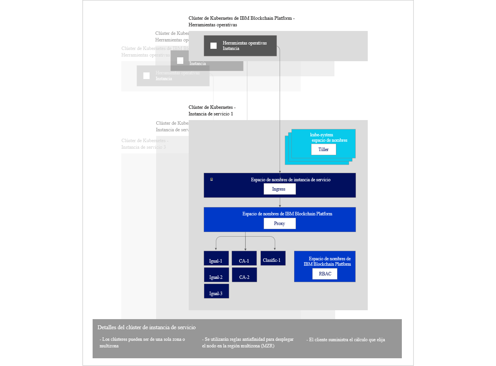

---

copyright:
  years: 2019
lastupdated: "2019-02-11"

---

{:new_window: target="_blank"}
{:shortdesc: .shortdesc}
{:screen: .screen}
{:codeblock: .codeblock}
{:note: .note}
{:important: .important}
{:tip: .tip}
{:pre: .pre}

# Acerca de {{site.data.keyword.blockchainfull_notm}} Platform gratuita 2.0 beta
{: #ibp-console-overview}

***[¿Le resulta útil esta página? Indíquenos su opinión.](https://www.surveygizmo.com/s3/4501493/IBM-Blockchain-Documentation)***

La versión {{site.data.keyword.blockchainfull_notm}} Platform gratuita 2.0 beta constituye la próxima generación de ofertas de {{site.data.keyword.blockchainfull_notm}} Platform, que le ofrecen un control total sobre sus despliegues y certificados. Esta versión gratuita beta incluye la nueva consola de {{site.data.keyword.blockchainfull_notm}} Platform, una interfaz de usuario que puede simplificar y acelerar el proceso de despliegue de componentes en un servicio Kubernetes de {{site.data.keyword.cloud_notm}} gestionado y controlado por usted.
{:shortdesc}

## Lo que ofrece la nueva versión beta
{: #ibp-console-overview-capabilities}

Este último release se adapta a los usuarios experimentados de {{site.data.keyword.blockchainfull_notm}} e Hyperledger Fabric y les permite alojar redes o crear nuevas organizaciones que pueden unirse a otras redes de {{site.data.keyword.blockchainfull_notm}} 2.0. Si es cliente de un Plan inicial o de empresa, en lugar de que {{site.data.keyword.IBM_notm}} gestione la red, ahora tiene un control total con capacidad para suministrar, supervisar y gestionar los componentes dentro del clúster de Kubernetes.

La versión {{site.data.keyword.blockchainfull_notm}} Platform gratuita 2.0 beta incluye las siguientes características principales:

**Experiencia integrada del desarrollador**
- **Codifique fácilmente** sus contratos inteligentes en Node.js, Golang o Java, escriba aplicaciones cliente con la nueva extensión de {{site.data.keyword.blockchainfull_notm}} VSCode, aproveche la **integración de SDK** con la consola y aprenda con nuestras completas guías de aprendizaje y ejemplos.
- **DevOps simplificado** le permite pasar de la fase de desarrollo a la de prueba y producción en un solo entorno mediante la ampliación de los recursos de Kubernetes para añadir más componentes.
- **Características principales de Fabric actualizadas.** Aproveche las características más recientes de Hyperledger Fabric v1.4:
  - [Recopilaciones de **datos privados**](/docs/services/blockchain/howto/ibp-console-smart-contracts.html#ibp-console-smart-contracts-private-data) que mejoran la privacidad de los datos al garantizar que los datos del libro mayor solo se comparten entre iguales autorizados mediante el protocolo gossip.
  - [Service Discovery ](https://hyperledger-fabric.readthedocs.io/en/release-1.4/discovery-overview.html "Service Discovery"), que le permite descubrir y actualizar de forma dinámica la forma en que la aplicación interactúa con la red.
  - [Listas de control de accesos a canal ](https://hyperledger-fabric.readthedocs.io/en/release-1.4/access_control.html "Listas de control de accesos") que le ofrecen un control adicional sobre los canales y los contratos inteligentes.
- **Integración del servicio {{site.data.keyword.cloud_notm}}.** Aproveche los servicios integrados de {{site.data.keyword.cloud_notm}}, como el panel de control del servicio Kubernetes de {{site.data.keyword.cloud_notm}}, el servicio de registro y métricas de {{site.data.keyword.cloud_notm}} e {{site.data.keyword.cloud_notm}} Identity Service.

**Control total de sus despliegues**
- **Despliegue solo los componentes que necesite**. Conecte un igual a varios canales y redes, o aloje un servicio de ordenación al que pueden conectarse los socios de la empresa.
- **Mantenga un control completo de sus identidades**. Almacene y gestione las claves que se utilizan para administrar los nodos sin almacenar las claves privadas en {{site.data.keyword.cloud_notm}}.
- **Operación centralizada** La consola de {{site.data.keyword.blockchainfull_notm}} Platform le permite desplegar y gestionar todas las organizaciones y nodos en **una consola central** sin tener que depender de {{site.data.keyword.IBM_notm}} ni de otros proveedores para gestionar los clasificadores o la entidad emisora de certificados. También puede añadir o eliminar miembros de un consorcio de blockchain, crear y unir canales e instalar y crear instancias de contratos inteligentes desde la consola.
- **Aloje o únase a una red** Despliegue iguales alojados en el clúster en varios canales en varias nubes, o invite a otras organizaciones a unirse a su consorcio o canales mientras las organizaciones gestionan sus nodos de forma independiente entre infraestructuras.
- **Gestione el acceso** de los usuarios que pueden administrar o supervisar los nodos.
- **Acceso directo a los registros** de los nodos desde el servicio Kubernetes de {{site.data.keyword.IBM_notm}}. Utilice el servicio {{site.data.keyword.cloud_notm}} Log Analysis o un servicio de terceros para extraer y analizar los registros.
- **Interactúe directamente con los pods de su nodo** mediante el panel de control de Kubernetes. Emita mandatos exec en los pods y contenedores para ejecutar mandatos y actualizar certificados desde la línea de mandatos.

**Escalabilidad y flexibilidad**
- **Elija su capacidad de cálculo.** Tiene flexibilidad para decidir la cantidad de CPU, de memoria y de almacenamiento que desea suministrar en el clúster de Kubernetes.
- **Escale** al alza o a la baja los recursos del clúster de Kubernetes y pague solo lo que necesite.
- **Recuperación en caso de error y alta disponibilidad multizona.** Esta opción duplica el despliegue de Kubernetes entre zonas, ofreciendo alta disponibilidad (HA) de sus componentes y recuperación en caso de error (DR).

Esta oferta es para usuarios experimentados de Fabric que deseen crear y gestionar sus propias redes. Próximamente se incorporará la capacidad para desplegar una red completa con una simple pulsación. Mientras tanto, para desplegar una red con una sola pulsación que utilice una configuración estándar, consulte nuestra documentación sobre el [Plan inicial](/docs/services/blockchain/get_start_starter_plan.html#getting-started-with-starter-plan).

## Consideraciones
{: #ibp-console-overview-considerations}

Antes de desplegar la consola, asegúrese de que comprende las consideraciones siguientes:

- {{site.data.keyword.blockchainfull_notm}} Platform gratuita 2.0 beta se basa en Hyperledger Fabric v1.4.
- Todos los iguales desplegados con la versión beta 2.0 gratuita utilizan CouchDB como base de datos de estado.
- Tiene la opción de utilizar un clúster de Kubernetes gratuito para la evaluación de la oferta beta; sin embargo, la capacidad y el rendimiento están limitados, no se pueden migrar datos y el clúster se suprime después de 30 días.
- El usuario es responsable de gestionar la supervisión del estado, la seguridad y el registro del clúster de Kubernetes. Consulte esta [información ](https://console.bluemix.net/docs/containers/cs_responsibilities.html#your-responsibilities-by-using-ibm-cloud-kubernetes-service "Responsabilidades de gestión del clúster") para ver detalles sobre lo que gestiona {{site.data.keyword.cloud_notm}} y sobre cuáles son sus responsabilidades.
- También es responsable de supervisar el uso de recursos del clúster de Kubernetes utilizando el panel de control de Kubernetes. Si tiene que aumentar la capacidad de almacenamiento o el rendimiento del clúster, consulte esta información sobre cómo [modificar el volumen existente ](https://console.bluemix.net/docs/containers/cs_storage_file.html#change_storage_configuration "Cambiar el tamaño y el IOPS del dispositivo de almacenamiento existente").
- Es responsable de gestionar y proteger sus certificados, sus claves públicas y privadas. {{site.data.keyword.IBM_notm}} no almacena los certificados en el clúster de Kubernetes ni en la consola. Solo se conservan en el almacenamiento local del navegador. Si cambia de navegador, tendrá que importar las identidades creadas en dicho navegador.
- La oferta gratuita 2.0 beta solo está disponible en la región **Dallas** de {{site.data.keyword.cloud_notm}}. Por lo tanto, todos los componentes de blockchain residirán en el centro de datos de Dallas. No se despliegan en ningún otro sitio.
- Aunque la oferta beta de {{site.data.keyword.blockchainfull_notm}} Platform 2.0 es gratuita, si elige un clúster de Kubernetes de pago en lugar del clúster gratuito limitado, incurrirá en cargos en su cuenta de {{site.data.keyword.cloud_notm}}.
- Kubernetes debe tener la versión 1.11 o superior en el clúster de Kubernetes de {{site.data.keyword.cloud_notm}}. Utilice estas instrucciones para [actualizar los clústeres nuevos y existentes](/docs/services/blockchain/howto/ibp-v2-deploy-iks.html#ibp-v2-deploy-iks-updating-kubernetes) a esta versión.

## Migración
{: #ibp-console-overview-migration}

No se da soporte a la migración a {{site.data.keyword.blockchainfull_notm}} Platform gratuita 2.0 beta. Pero se podrá migrar a un release de disponibilidad general (GA) en los siguientes casos:
- Los clientes del plan empresarial podrán migrar a {{site.data.keyword.blockchainfull_notm}} Platform 2.0 cuando esté disponible a nivel general.
- Si utiliza un servicio Kubernetes de {{site.data.keyword.cloud_notm}} de pago, podrá migrar la red {{site.data.keyword.blockchainfull_notm}} Platform gratuita 2.0 beta al release de disponibilidad general (GA).

Los despliegues del servicio Kubernetes de {{site.data.keyword.cloud_notm}} gratuito no se migrarán, ni habrá migraciones desde el plan inicial.

## Licencias y precios
{: #ibp-console-overview-license-and-pricing}

{{site.data.keyword.blockchainfull_notm}} Platform gratuita 2.0 beta es una versión gratuita. Se incluye una instancia de la consola con cada despliegue de la plataforma en un clúster del servicio Kubernetes de {{site.data.keyword.cloud_notm}}. Debe pagar el clúster de Kubernetes si decide desplegar la consola en un clúster estándar del servicio Kubernetes de {{site.data.keyword.cloud_notm}}.

## Guía de inicio
{: #ibp-console-overview-deploy}

Se despliega una instancia de la consola en un clúster del servicio Kubernetes de {{site.data.keyword.IBM_notm}} como parte del despliegue de cada instancia de {{site.data.keyword.blockchainfull_notm}} Platform gratuita 2.0 beta.

Para obtener más información sobre el despliegue de la consola y de la plataforma, consulte [Iniciación a {{site.data.keyword.blockchainfull_notm}} Platform gratuita 2.0 beta](/docs/services/blockchain/howto/ibp-v2-deploy-iks.html#ibp-v2-deploy-iks).

Para obtener más información sobre cómo utilizar la consola para empezar a desplegar nodos y a crear un consorcio, consulte la guía de aprendizaje sobre cómo [crear una red](/docs/services/blockchain/howto/ibp-console-build-network.html#ibp-console-build-network). Esta guía de aprendizaje le guiará por el proceso de utilizar la consola para crear una red de ejemplo con tres organizaciones (una organización de clasificador y dos organizaciones iguales) y un canal con dos iguales unidos. Puede utilizar la red de ejemplo para desplegar demostraciones o pruebas de concepto o puede ajustar y ampliar los pasos de la guía de aprendizaje para crear su propia configuración.

## Referencia de la arquitectura
{: #ibp-console-overview-architecture}

En la siguiente ilustración se muestran los componentes de la red blockchain y cómo interactúan.

*Figura 1. Referencia de arquitectura*

Observe cómo se crea una única instancia de la consola, también conocida como Herramientas operativas, para cada instancia del servicio {{site.data.keyword.blockchainfull_notm}} Platform. Cuando se despliega un igual, un clasificador o un nodo de CA mediante la consola, se despliega en la **instancia de servicio del clúster Kubernetes**.

| **Clúster Kubernetes de IBM Blockchain** | **Descripción** |
| ------------------------- |-----------|
| Herramientas operativas | También conocida como `consola`, es la interfaz de usuario central para trabajar con todos los componentes de blockchain. Con esta consola ahora puede crear nodos de CA, igual y clasificador, crear canales e instalar y crear instancias de contratos inteligentes desarrollados con la extensión Hyperledger Fabric v1.4 VSCode. La consola se despliega en un clúster propiedad de {{site.data.keyword.IBM_notm}}.|


| **Instancia de servicio del clúster Kubernetes** | **Descripción** |
| ------------------------- |-----------|-----------|-----------|
| **Tiller** | Tiller, que forma parte de las [herramientas de Helm ](https://docs.helm.sh/glossary/#tiller "Tiller"), se ejecuta dentro del clúster de Kubernetes para gestionar las instalaciones del igual, de la CA y de los diagramas de Helm del clasificador. |
| **Ingress** | Un [objeto de Kubernetes ](https://kubernetes.io/docs/concepts/services-networking/ingress/ "Ingress") que permite el acceso a los recursos del clúster desde fuera del mismo. |
| **Proxy** | El proxy de {{site.data.keyword.blockchainfull_notm}} Platform es el responsable de direccionar el tráfico a los nodos de igual, CA y clasificador correctos mediante el direccionamiento de cabeceras de host. |
| **Iguales, CA, clasificadores** | Son los nodos que se crean mediante el despliegue de los diagramas de Helm subyacentes. Nota: estos nodos también se pueden importar desde otras instancias del servicio de clúster de Kubernetes. Puesto que {{site.data.keyword.IBM_notm}} nunca almacena las claves, cada nodo igual y clasificador incluye un proxy web gRPC que permite que la consola se comunique con cada nodo utilizando las claves de la cartera de la consola. |
| **RBAC** | Control de acceso basado en roles.  {{site.data.keyword.blockchainfull_notm}} Platform configura [RBAC de Kubernetes ](https://kubernetes.io/docs/reference/access-authn-authz/rbac/ "Utilización de la autorización de RBAC") en el clúster, necesario para gestionar los componentes de blockchain en el clúster.  |

## Alta disponibilidad (HA) y recuperación en caso de error (DR)
{: #ibp-console-overview-hadr}

El almacenamiento multizona debe estar habilitado en el clúster Kubernetes de IBM Cloud de pago si necesita HA y DR. Hay varias [opciones
de almacenamiento de Kubernetes](https://console.bluemix.net/docs/containers/cs_storage_planning.html#persistent_storage_overview) disponibles. Próximamente IBM Cloud dará soporte a la solución de almacenamiento Portworx, que es la solución recomendada. Hasta entonces, si se necesitan HA y DR para una implementación, es necesario traer su propia solución de almacenamiento.

Para añadir su propia solución de almacenamiento, tendrá que crear una clase de almacenamiento personalizada. Consulte cómo [añadir
una clase de almacenamiento](https://console.bluemix.net/docs/containers/cs_storage_basics.html#storageclasses) para la solución. IBP utiliza el [suministro de volumen dinámico](https://console.bluemix.net/docs/containers/cs_storage_basics.html#dynamic_provisioning) con la clase de almacenamiento predeterminada. Por lo tanto, para cambiar la clase de almacenamiento predeterminada, ejecute el mandato siguiente:
```
kubectl patch storageclass <storageclass> -p '{"metadata": {"annotations":{"storageclass.kubernetes.io/is-default-class":"true"}}}'
```
{:codeblock}

Sustituya ``<storageclass>`` por el nombre de su clase de almacenamiento.  

Por último, asegúrese de habilitar las regiones multizona cuando cree el clúster de pago.

## Obtención de soporte
{: #ibp-console-overview-support}

Para obtener más información sobre cómo obtener soporte en {{site.data.keyword.blockchainfull_notm}} Platform 2.0, recursos gratuitos del desarrollador de blockchain y foros de soporte que puede utilizar para solucionar problemas, consulte [Obtención de soporte](/docs/services/blockchain/ibmblockchain_support.html#blockchain-support).

El soporte de {{site.data.keyword.blockchainfull_notm}} Platform 2.0 se limitará al periodo beta.
{: important}
