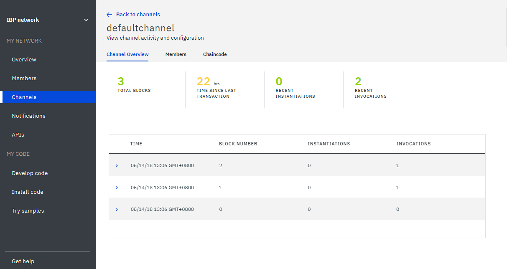
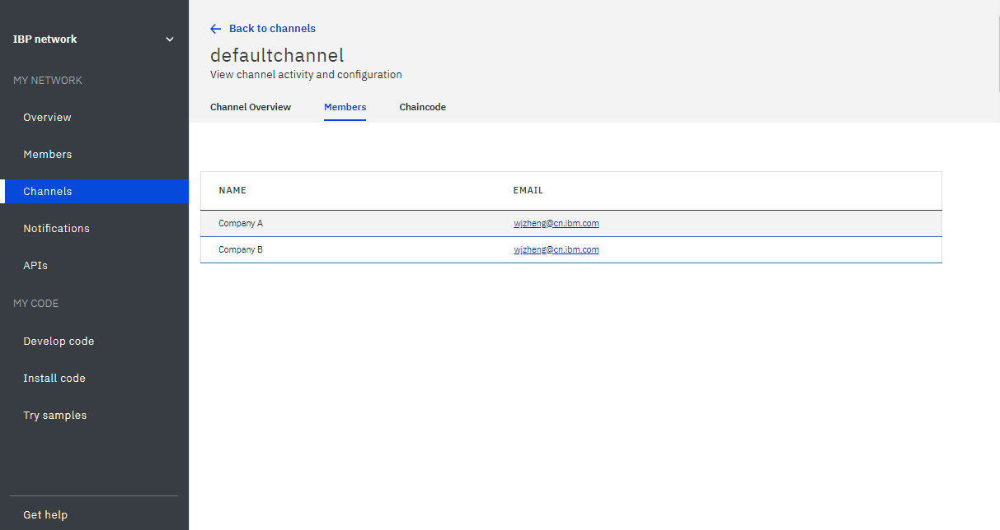

---

copyright:
  years: 2017, 2018
lastupdated: "2018-10-04"

---

{:new_window: target="_blank"}
{:shortdesc: .shortdesc}
{:screen: .screen}
{:codeblock: .codeblock}
{:pre: .pre}

# Supervisión de una red blockchain


***[¿Le resulta útil esta página? Indíquenos su opinión.](https://www.surveygizmo.com/s3/4501493/IBM-Blockchain-Documentation)***


En esta guía de aprendizaje se muestra cómo visualizar la información de estado de la red de {{site.data.keyword.blockchain}} on {{site.data.keyword.cloud_notm}}.
{:shortdesc}


## Supervisión de iguales, clasificadores y CA
{: #monitor-nodes}

Puede emitir una solicitud **HEAD** HTTP en uno de los nodos de red para comprobar el estado del nodo. Un nodo de red puede ser un igual, un clasificador o una CA en la red blockchain. Una solicitud **HEAD** es similar a una solicitud GET y solo envía las cabeceras sin cuerpos. Puede obtener una respuesta 200 si el nodo funciona normalmente.

1. En la pantalla "Visión general" del Supervisor de red, pulse **Perfil de conexión**. A continuación, puede pulsar **JSON en bruto** para ver el perfil de conexión en el navegador web o pulse **Descargar** para guardar el perfil de conexión localmente.
2. En el perfil de conexión, busque la información de URL del nodo de red que desea comprobar. Por ejemplo, el URL del clasificador
`fabric-orderer-20190b` es `grpcs://fft-zbc02b.4.secure.blockchain.ibm.com:20190`.
    
3. Sustituya **grpcs** por **https** en el URL. En el ejemplo anterior, el URL se convierte en `https://fft-zbc02b.4.secure.blockchain.ibm.com:20190`.
4. Emita la solicitud **HEAD** en el URL con una herramienta como curl o una app Postman de Chrome.
    - Si obtiene una respuesta de estado 200, el nodo de red funcionará normalmente.
    - Si la solicitud **HEAD** falla con un error de conexión, el nodo de red podría no estar en ejecución, el URL del nodo podría ser incorrecto, o un cortafuegos bloquea el acceso al nodo.  Debe resolver este error; de lo contrario, las aplicaciones no pueden conectarse al nodo.

El ejemplo siguiente muestra una solicitud **HEAD** con una respuesta 200 en curl. Tenga en cuenta que puede ignorar el error grpc porque la solicitud **HEAD** HTTP comprueba si el nodo es accesible. Si lo es, la solicitud grpc al nodo funcionará también en la aplicación.

```
C:\>curl -i --head https://fft-zbc02b.4.secure.blockchain.ibm.com:20190
HTTP/2 200
contnent-type: application/grpc
grpc-status: 8
grpc-message: malformed method name: "/"
```
{:codeblock}

El ejemplo siguiente muestra una solicitud **HEAD** con un error de conexión en curl.

```
C:\>curl -i --head https://fft-zbc02b.4.secure.blockchain.ibm.com:20190
curl: (7) Failed to connect to fft-zbc02b.4.secure.blockchain.ibm.com:20190: Connection refused
```
{:codeblock}

La figura siguiente muestra una solicitud **HEAD** con una respuesta 200 en la app Postman de Chrome.

  

## Utilización de los registros de red
La pantalla "Visión general" de su supervisor de red muestra el estado del servicio de pedido, la entidad emisora de certificados y los iguales. Pulse **Ver registros** en la lista desplegable bajo la cabecera **Acciones** para ver los registros de un componente de red específico. Si utiliza redes del plan de empresa, puede ver los registros de los componentes en formato de archivo de texto. Si utiliza redes del plan inicial, los registros de los componentes se recopilan mediante el [{{site.data.keyword.cloud_notm}}servicio Log Analysis ](https://console.bluemix.net/catalog/services/log-analysis) y puede ver los registros en [Kibana](#viewing-logs-in-kibana-in-starter-plan).

Cada componente genera registros de distintas actividades. Esto se debe a que cada componente juega distintos roles dentro de la [arquitectura de red ](https://hyperledger-fabric.readthedocs.io/en/release-1.2/network/network.html) de Hyperledger Fabric y en los [flujos de transacciones ](https://hyperledger-fabric.readthedocs.io/en/release-1.1/txflow.html).

- **Registros del servicio de ordenación**
  El servicio de ordenación es el componente de enlace común de la red blockchain. Todas las propuestas de transacción aprobadas de los iguales, actualizaciones de canal o actualizaciones de pertenencia a red se envían al servicio de ordenación para su verificación. Por lo tanto, el servicio de ordenación contiene registros de cuando se ha iniciado la red. También contiene registros correspondientes a una transacción que se ha rechazado porque las organizaciones adecuadas no la han aprobado. También encontrará registros de cuando se crean o actualizan canales o de cuando falla una actualización de canal.

- **Registros de entidad emisora de certificados**
  La entidad emisora de certificados gestiona la identidad de los participantes dentro de la red. En los registros de la entidad emisora de certificados, puede encontrar registros de cuando los participantes generan claves públicas y privadas para comunicarse con la red (inscribirse) o de cuando los miembros nuevos, iguales o aplicaciones se registran con la entidad emisora de certificados. También puede utilizar los registros de CA para depurar si hay algún problema con la verificación de certificados.

- **Registros de iguales**  
  Los registros de iguales contienen los resultados de instalar, crear instancias e invocar código de encadenamiento. Puede buscar un nombre y versión de código de encadenamiento para encontrar los registros de un determinado código de encadenamiento. También puede ver los registros de un determinado código de encadenamiento desde la [sección del código de encadenamiento del supervisor del canal](#monitor-channel-cc). Los mensajes, que generan las propuestas de transacción, o cualquier problema de tiempo de espera con sus solicitudes de propuesta, se pueden encontrar en los registros de iguales. Los registros del igual contienen también errores de transacciones que se han rechazado por no cumplir la
[política de aprobación del código de encadenamiento](/docs/services/blockchain/howto/install_instantiate_chaincode.html#endorsement-policy). También puede encontrar los resultados de las solicitudes de unión de canal.

Hyperledger Fabric ofrece distintos [niveles de registro ](https://hyperledger-fabric.readthedocs.io/en/release-1.1/logging-control.html "control de registro") que dependen de la gravedad del mensaje. El nivel de registro predeterminado en la plataforma {{site.data.keyword.blockchainfull_notm}} es `INFO`. Para ver registros adicionales, puede abrir una [incidencia de soporte](/docs/services/blockchain/ibmblockchain_support.html#submitting-support-cases) para definir el nivel de registro en `DEBUG`, que ofrece más detalles. Tenga en cuenta que los registros de nivel `DEBUG` muestran una gran cantidad de mensajes de rumores que posiblemente tenga que filtrar. Busque `warning` o `error` en los mensajes para detectar problemas procedentes de componentes de Hyperledger Fabric. Para detectar si el contenedor del componente falla o está inactivo, busque los mensajes `panic` o `killed` que ha enviado {{site.data.keyword.cloud_notm}}.

## Visualización de registros en Kibana en el plan inicial
Los registros de la red del Plan inicial los recopila el [servicio {{site.data.keyword.cloud_notm}} Log Analysis ](https://console.bluemix.net/catalog/services/log-analysis "servicio Log Analysis"). De forma predeterminada, los registros los recopila el Plan Lite del servicio Log Analysis. Este plan es gratuito y **guarda los registros durante tres días** antes de descartarlos. También le permite **buscar loso los primeros 500 MB de registros al día**. Si los registros de la red superan los 500 MB, no podrá ver registros nuevos en Kibana. Si la red genera más de 500 MB de registros, o si desea conservar los registros durante más de tres días, puede actualizar a una versión de pago del servicio Log Analysis.

En la pantalla "Visión general" del supervisor de red, pulse **Ver registros** en la lista desplegable que hay bajo la cabecera **Acciones** para abrir los registros de los componentes de las redes en la interfaz Kibana. Cuando se abre Kibana, muestra los registros que filtrados por una barra de búsqueda en la parte superior. Por ejemplo, si pulsa para ver los registros de iguales, la búsqueda se filtra por ID de red y por id de igual: `NETWORK_ID_str:"nf8389d520c243004bb21ff5d70fc8939" && NODE_NAME_str:"org1-peer1"`. Puede especificar un campo adicional en la barra de búsqueda si desea ver registros más específicos. Por ejemplo, puede añadir `&& "marbles"` para visualizar los registros del código de encadenamiento `"marbles"`. Si se suprime el término del componente específicos y solo se busca por el ID de red, por ejemplo `NETWORK_ID_str:"nf8389d520c243004bb21ff5d70fc8939"`, se muestran los registros procedentes de todos los componentes de la red.

Puede utilizar el botón de rango de tiempo de la esquina superior derecha para desde qué periodo de tiempo se visualizan los registros. También puede utilizar el separador de la izquierda de la pantalla para añadir y eliminar campos de la búsqueda. El campo más importante que se debe visualizar es el campo de mensaje. Puede ser útil para realizar una búsqueda con un mensaje sin indicación de fecha y hora para encontrar todas las instancias de dicho registro de mensaje. Pulse el botón **Guardar** para guardar la búsqueda actual y volver a una vista específica. Para obtener más información sobre la visualización de datos en Kibana, consulte la [Guía del usuario de Kibana ](https://www.elastic.co/guide/en/kibana/6.2/index.html "Guía del usuario de Kibana"). También puede [descargar los registros](https://console.bluemix.net/docs/services/CloudLogAnalysis/how-to/manage-logs/downloading_logs_cloud.html#downloading_logs) en su sistema de archivos local con la CLI de Log Analysis.

**Nota:** de forma predeterminada, Kibana está preconfigurado para mostrar los registros de 30 días de actividad. Si no ha habido actividad en los últimos 30 días, verá un mensaje que indica que *No se han encontrado resultados*. Para ver otros registros, puede pulsar el icono de temporizador en la esquina superior derecha bajo el nombre de usuario y establecer un rango de tiempo más amplio, por ejemplo *Año hasta la fecha*.

## Supervisión de canales
{: #monitor-channnels}

Entre en el Supervisor de red y localice el canal que desea ver y supervisar en la pantalla "Canal". En la pantalla del canal específico, puede ver la información de estado de los datos, los miembros así como una instancia del código de encadenamiento de este canal en tres separadores:

### Visión general del canal
{: #monitor-channel-overview}

El separador "Visión general del canal" muestra la información de bloque de este canal:
  * Una serie de puntos de datos, que incluyen el número total de bloques que se han creado, el intervalo de tiempo desde la última transacción, el número de instancias de código de encadenamiento y el número de invocaciones al mismo.
  * Una tabla con todos los bloques de este canal. Expanda un bloque para ver su información detallada.

  

### Miembros
{: #monitor-channel-members}

El separador "Miembros" muestra la información de los miembros de este canal, incluidas las direcciones de correo electrónico de los operadores de la organización.

  

### Código de encadenamiento
{: #monitor-channel-cc}

El separador "Código de encadenamiento" presenta todo el código de encadenamiento del que se ha creado instancias en este canal con el ID y la versión del código de encadenamiento, además del número de iguales que lo ejecutan.

Expanda una fila del código de encadenamiento para obtener información detallada sobre el mismo:
  * Puede pulsar **JSON** para ver el archivo JSON del código de encadenamiento.
  * Puede pulsar **Registros** para ver los registros del código de encadenamiento. Esta vista muestra los registros de los iguales desde los que ha instalado el código de encadenamiento y están filtrados por nombre y versión de código de encadenamiento.

    Se recomienda añadir mensajes de error o de éxito exclusivos después de cada función de código de encadenamiento para ayudarle a supervisar y depurar el código de encadenamiento. Si tiene un código de encadenamiento complejo que utiliza muchos archivos diferentes, puede añadir una palabra clave exclusiva en los registros de código de encadenamiento que le pueda ayudar a localizar mensajes de diferentes etapas de la transacción.
   * Puede pulsar **Suprimir** para eliminar el contenedor del código de encadenamiento. Tenga en cuenta que la supresión del contenedor de código de encadenamiento en ejecución no suprime realmente el código de encadenamiento. Un código de encadenamiento del que se ha creado una instancia en una red blockchain no se puede suprimir.

  


## Supervisión del código de encadenamiento
{: #monitor-chaincode}

Especifique el Supervisor de red y abra la pantalla "Instalar código". Si tiene un código de encadenamiento en ejecución, puede ver el código de encadenamiento con los ID de código de encadenamiento y las versiones en la tabla. Elija un igual en la lista desplegable y verá todo el código de encadenamiento correspondiente a este igual en la tabla. Puede ver los registros del código de encadenamiento en el [separador "Código de encadenamiento"](#monitor-channel-cc) de la pantalla de "Canal" específica.

  

<!----
## Monitoring sample applications
{: #monitor-apps}

In a Starter Plan network, you can view and access sample applications in the "Try Samples" screen of the Network Monitor.  After you deploy a sample application, you can click the **Launch** button to enter your application interface, or the **View on GitHub** link to visit the code repository.  For more information, see [Deploying sample applications](/docs/services/blockchain/howto/prebuilt_samples.html).

  
--->
