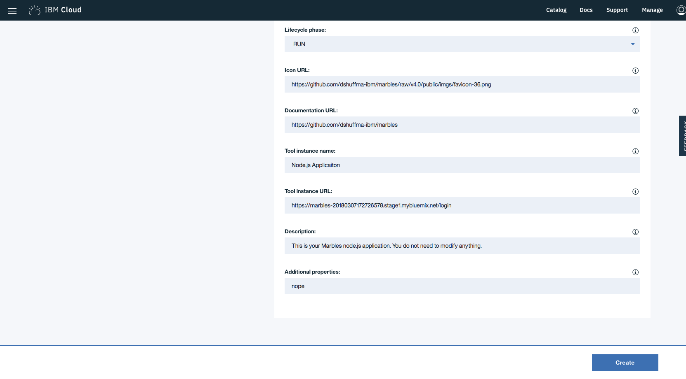

---

copyright:
  years: 2018
lastupdated: "2018-03-16"

---

{:new_window: target="_blank"}
{:shortdesc: .shortdesc}
{:screen: .screen}
{:codeblock: .codeblock}
{:pre: .pre}

# Despliegue de aplicaciones de ejemplo
{: #overview}

La plataforma {{site.data.keyword.blockchainfull}} proporciona aplicaciones de ejemplo que puede desplegar y probar, a fin de comprender mejor las redes de blockchain y el proceso de desarrollo de aplicaciones.
{: shortdesc}

Después de suministrar una red del Plan inicial, puede desplegar las aplicaciones de ejemplo en el supervisor de red, que automatiza los pasos para permitir que las aplicaciones de ejemplo se ejecuten en la red. También puede habilitar los ejemplos paso a paso para aprender todo el proceso de despliegue de aplicaciones, que deberá seguir cuando despliegue sus propias aplicaciones.

## Despliegue de aplicaciones de ejemplo en el Plan inicial

El Plan inicial proporciona un enfoque sencillo al despliegue de aplicaciones de ejemplo utilizando el servicio Toolchain de {{site.data.keyword.cloud_notm}} con unas pocas pulsaciones. Después de desplegar e iniciar una aplicación de ejemplo, esta se ejecutará automáticamente en la red de blockchain.

El Plan inicial proporciona dos aplicaciones de ejemplo con las que comenzar a trabajar.

* **Canicas**

  El ejemplo Canicas permite a los usuarios crear canicas virtuales con diferentes propiedades y transferirlas a otros usuarios. Para obtener más información sobre Canicas, consulte la [demo de Canicas ](https://github.com/IBM-Blockchain/marbles).

<!--
* **Perishable Goods**

  The Perishable Goods sample enables users to deploy legal contracts that purchase goods in a supply chain based on delivery and temperature readings. For more information about this sample, see [Perishable Goods ](https://github.com/clauseHQ/demo-clause-ibm-perishable-goods).

-->

* **Fabricación de vehículos**

  El ejemplo Fabricación de vehículos permite a los usuarios seguir el ciclo de vida de un vehículo virtual. Para obtener más información sobre este ejemplo, consulte [Fabricación de vehículos ](https://github.com/IBM-Blockchain/vehicle-manufacture).

Siga los pasos siguientes para desplegar una aplicación de ejemplo:

1. Entre en el **Supervisor de red** de su red del Plan inicial. Si no dispone de una, consulte [Creación de una red](../get_start_starter_plan.html#creating-a-network).

2. Abra la pantalla "Probar ejemplos" en el supervisor de red. Elija la aplicación de ejemplo que desee desplegar y pulse el botón **Desplegar mediante Toolchain**.
<!--
    
-->
3. Se abrirá una ventana de configuración del servicio Toolchain. Asegúrese de que todas las herramientas necesarias estén correctamente integradas. Tenga en cuenta que, si tiene más de una organización, debe asegurarse de especificar el nombre de la organización correcta. El nombre de la organización debe ser la dirección de correo electrónico que se utiliza para iniciar una sesión en la red.
    **Sugerencia**: debe inhabilitar los bloqueadores emergentes para que se pueda abrir la página de configuración del servicio Toolchain.
<!--
    
-->
  Si esta es la primera aplicación que despliega mediante Toolchain, debe autorizar a Toolchain a que acceda al repositorio de GitHub.

  

  Después de pulsar el botón "Autorizar", irá a GitHub. Si no tiene una cuenta de GitHub, debe crear una. Para otorgar a Toolchain acceso a los repositorios, escriba la información de su cuenta. Si no desea otorgar a Toolchain este acceso, puede desplegar las aplicaciones de ejemplo manualmente. Para obtener más información, consulte [Despliegue manual de aplicaciones de ejemplo](#deploy_sample_applications_manually).

5. Pulse el botón **Crear** de la parte inferior de la página Toolchain. Debería volver al supervisor de red, donde debería estar procesándose el despliegue de la aplicación Canicas. Este proceso debería tardar entre cinco y 10 minutos.
<!--
    
-->
Una vez finalizado el despliegue, puede empezar a utilizar el ejemplo Canicas en su red del Plan inicial.

Puesto que este proceso crea un repositorio GitHub bifurcado al que tiene acceso y sobre el que tiene control, puede realizar cambios en Canicas en el repositorio bifurcado y confirmarlos. Estas confirmaciones activarán una compilación automática de la aplicación Canicas y le permitirán ver la demo en {{site.data.keyword.cloud_notm}}.

## Despliegue manual de aplicaciones de ejemplo
{: #deploy_sample_applications_manually}

Si desea desplegar aplicaciones de ejemplo sin utilizar el supervisor de red, asegúrese de instalar todos los requisitos previos de software en el sistema de archivos local. Para obtener más información, consulte [Configuración del entorno de desarrollo de aplicaciones](../v10_application.html#setting-up-application-development-environment).

También necesita una red de blockchain en {{site.data.keyword.cloud_notm}} o con el Plan inicial o el Plan empresarial y configurar un canal y sus iguales. Para obtener más información, consulte [Gobierno de la red del Plan inicial](../get_start_starter_plan.html) y [Gobierno de la red del Plan empresarial](../get_start.html). Después de suministrar una red y de desplegar aplicaciones en la misma, recupere los puntos finales de API de los recursos de red a los que accederá la aplicación. Para obtener más información, consulte [Adición de puntos finales de API de red a la aplicación](../v10_application.html#adding-network-api-endpoints-to-your-application).

Puede desplegar una de las siguientes aplicaciones de ejemplo en su red:

- **Canicas**

  En la aplicación Canicas, varios usuarios pueden crear canicas con diferentes propiedades y transferirlas a otros. La aplicación Canicas se está escrita en JavaScript y el código de encadenamiento está escrito en Go.

  Puede consultar el código de ejemplo y las instrucciones en [Canicas en GitHub ](https://github.com/IBM-Blockchain/marbles).

  Siga las instrucciones de Bluemix en lugar de las instrucciones para alojar la aplicación Canicas localmente y especifique la información relevante de su red. Observe que las capturas de pantalla de GitHub de Canicas muestran la IU del Plan empresarial (ya que el Plan empresarial solo da soporte al método manual para desplegar Canicas), que es un poco distinta de la IU del Plan inicial. Sin embargo, ambas IU tienen las mismas partes básicas y encontrará los nombres de sus iguales, canales y otra información de credenciales de servicio en las pantallas adecuadas.

- **Fabcar**

  En Fabcar, puede realizar **consultas** y **actualizaciones del libro mayor** de los registros de coches del libro mayor. Fabcar está escrito en JavaScript y el código de encadenamiento está escrito en Go.

  Puede consultar el código de ejemplo de [Fabric car en GitHub ](https://github.com/hyperledger/fabric-samples/tree/release/fabcar) y las instrucciones sobre [cómo escribir su primer aplicación ](http://hyperledger-fabric.readthedocs.io/en/latest/write_first_app.html).

- **Otras aplicaciones**

  Para obtener más información sobre cómo alojar sus propias aplicaciones dentro de {{site.data.keyword.cloud_notm}}, consulte [Alojamiento de aplicaciones](../v10_application.html#hosting-applications).

## Supresión de una aplicación de ejemplo

Para suprimir una aplicación de ejemplo que se ha adquirido a través del proceso de Toolchain, vaya a donde reside el ejemplo en la IU. Puesto que se ha creado una instancia de las aplicaciones en un canal, puede encontrar el ejemplo en los canales. Pulse **Canales** en el panel de navegación izquierdo para abrir la pantalla "Canales". Pulse el canal relevante en el que se ha creado la instancia del ejemplo y luego pulse **Código de encadenamiento**. Aparecerá el código de encadenamiento del que se ha creado una instancia en este canal.

Si pulsa el código de encadenamiento de la aplicación, verá un separador **Suprimir**. Sin embargo, el hecho de pulsar **Suprimir** no suprime la aplicación de ejemplo; solo suprime el contenedor del código de encadenamiento.  Tiene que ir al panel de control de {{site.data.keyword.cloud_notm}} y al panel de control de Toolchain para suprimir ahí el ejemplo.
