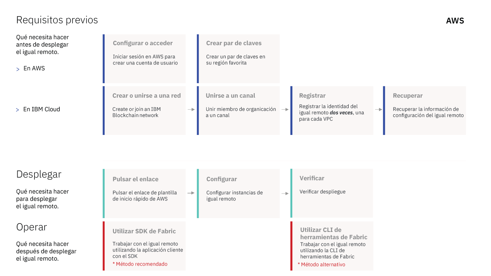

---

copyright:
  years: 2017, 2019
lastupdated: "2019-03-05"

subcollection: blockchain

---

{:new_window: target="_blank"}
{:shortdesc: .shortdesc}
{:screen: .screen}
{:codeblock: .codeblock}
{:note: .note}
{:important: .important}
{:tip: .tip}
{:pre: .pre}

# Acerca de {{site.data.keyword.blockchainfull_notm}} Platform para Amazon Web Services
{: #remote-peer-aws-about}

**Nota:** el programa de igual remoto de {{site.data.keyword.blockchainfull}} Platform en {{site.data.keyword.cloud_notm}} Private (Beta) ha finalizado. Si todavía desea ejecutar iguales en su entorno de {{site.data.keyword.cloud_notm}} Private, utilice la oferta de la **{{site.data.keyword.blockchainfull_notm}} Platform para {{site.data.keyword.cloud_notm}} Private** en su lugar. Para obtener más información, consulte [Acerca de los iguales en {{site.data.keyword.cloud_notm}} Private](/docs/services/blockchain/ibp-for-icp-about.html#ibp-icp-about-peer).

Puede ejecutar el igual de {{site.data.keyword.blockchainfull_notm}} Platform en la nube de AWS tras conectarlo a una red blockchain existente en {{site.data.keyword.cloud_notm}}. La ejecución de iguales remotos que estén fuera de {{site.data.keyword.cloud_notm}} proporciona más flexibilidad para crecer o unirse a una red blockchain al tiempo que se aprovecha una red existente dentro de {{site.data.keyword.cloud_notm}}. Los iguales remotos de la nube AWS aprovechan las entidades emisoras de certificados (CA) y el servicio de ordenación de la plataforma, pero puede colocar sus iguales con otras aplicaciones fuera de {{site.data.keyword.cloud_notm}}.
{:shortdesc}

## Consideraciones
{: #remote-peer-aws-about-limitations}

{{site.data.keyword.blockchainfull_notm}} Platform para AWS no tiene acceso a toda la funcionalidad ni al soporte de los iguales alojados en la plataforma {{site.data.keyword.blockchainfull_notm}}. Antes de ejecutar {{site.data.keyword.blockchainfull_notm}} Platform para AWS, asegúrese de que comprende las restricciones y limitaciones siguientes:
- Los iguales que se ejecutan en otros entornos de nube no son visibles en el supervisor de la red en {{site.data.keyword.cloud_notm}}.
- No se puede direccionar a los iguales que se ejecutan en {{site.data.keyword.blockchainfull_notm}} Platform para AWS mediante la interfaz de usuario de Swagger en la interfaz de usuario del supervisor de red.
- El usuario es el responsable de la gestión de la supervisión del estado, la seguridad, el registro y el uso de recursos de sus nodos de igual de {{site.data.keyword.blockchainfull_notm}} Platform para AWS.
- Puede conectar sus iguales de {{site.data.keyword.blockchainfull_notm}} Platform para AWS únicamente a redes blockchain que tengan el nivel v1.1 o v1.2.1 de Fabric. Puede encontrar la versión de Fabric abriendo la [ventana Preferencias de red](/docs/services/blockchain/v10_dashboard.html#ibp-dashboard-network-preferences) en el supervisor de red.
- El tipo de base de datos del igual de {{site.data.keyword.blockchainfull_notm}} Platform para AWS debe coincidir con el tipo de base de datos de la red blockchain, ya sea LevelDB o CouchDB.
- La interfaz CouchDB Fauxton no está disponible en el igual de AWS.
- Actualmente no se da soporte a [gossip (rumor)](/docs/services/blockchain/glossary.html#glossary-gossip) para los iguales de AWS. Esto implica que tampoco hay soporte para las características de Fabric que dependen de rumores (gossip), como
[datos privados
](https://hyperledger-fabric.readthedocs.io/en/release-1.2/private-data-arch.html "datos privados") y
[descubrimiento de servicios
](https://hyperledger-fabric.readthedocs.io/en/release-1.2/discovery-overview.html "descubrimiento de servicios").

## Requisitos previos
{: #remote-peer-aws-about-prereq}

Para utilizar un igual de {{site.data.keyword.blockchainfull_notm}} Platform para AWS, debe tener una organización que sea miembro de una red del Plan inicial o del Plan empresarial en la plataforma {{site.data.keyword.blockchainfull_notm}}. El igual de {{site.data.keyword.blockchainfull_notm}} Platform para AWS aprovecha los puntos finales de API, las CA de Hyperledger Fabric y el servicio de ordenación de la red de la plataforma {{site.data.keyword.blockchainfull_notm}} para funcionar. Si no es miembro de ninguna red blockchain, tiene que crear o unirse a una red. Para obtener más información, consulte [Creación de una red](/docs/services/blockchain/get_start.html#getting-started-with-enterprise-plan-create-network) o [Cómo unirse a una red](/docs/services/blockchain/get_start.html#getting-started-with-enterprise-plan-join-nw).

## Licencias y precios
{: #remote-peer-aws-about-license-pricing}

{{site.data.keyword.blockchainfull_notm}} Platform para AWS se ofrece actualmente como Community Edition, que es gratuita; en el futuro, {{site.data.keyword.blockchainfull_notm}} Platform para AWS podría cambiar a un modelo BYOL (Bring-Your-Own-License), que requerirá la compra de una licencia de IBM.

**Nota:** para trabajar con un igual de AWS, debe tener una organización que pertenezca a una red del Plan inicial o del Plan empresarial en la plataforma {{site.data.keyword.blockchainfull_notm}}. Esto implica que usted u otro miembro de la red deberá pagar la [cuota de miembro](/docs/services/blockchain/howto/pricing.html#ibp-pricing-key-elements) de {{site.data.keyword.blockchainfull_notm}} de la organización. Para obtener más información sobre cómo pagar las cuotas, consulte [Modalidad de pago](/docs/services/blockchain/howto/paying_mode.html#paying-mode).

## Despliegue de un igual de AWS
{: #remote-peer-aws-about-deploy}

Utilice la [Plantilla de inicio rápido ](https://aws.amazon.com/quickstart/architecture/ibm-blockchain-platform/ "Plantilla de Inicio rápido") de AWS para desplegar {{site.data.keyword.blockchainfull_notm}} Platform para AWS con facilidad. Para obtener más información, consulte
[Guía de despliegue del Inicio rápido de {{site.data.keyword.blockchainfull_notm}} Platform para AWS
](https://s3.amazonaws.com/aws-quickstart/quickstart-ibm-fabric/doc/ibm-blockchain-platform-for-aws.pdf "Despliegue de referencia de Inicio rápido de la plataforma IBM Blockchain para AWS").

Para ver instrucciones sobre cómo desplegar {{site.data.keyword.blockchainfull_notm}} Platform para AWS, consulte el apartado sobre [Despliegue de iguales en Amazon Web Services](/docs/services/blockchain/howto/remote_peer_aws.html#remote-peer-aws).

En el diagrama siguiente se describe el proceso para desplegar un igual de {{site.data.keyword.blockchainfull_notm}} Platform para AWS.

<map name="home_map1" id="home_map1">
<area href="/docs/services/blockchain/howto/remote_peer_aws.html#remote-peer-aws-account" alt="Configurar o acceder a AWS" title="Configurar o acceder" shape="rect" coords="157.05, 52.53, 283.62, 127.11" />
<area href="/docs/services/blockchain/howto/remote_peer_aws.html#remote-peer-aws-account" alt="Crear par de claves" title="Crear par de claves" shape="rect" coords="300.97, 52.53, 427.54, 127.11" />
<area href="/docs/services/blockchain/howto/remote_peer_aws.html#remote-peer-aws-prerequisites" alt="Crear o unirse a una red" title="Crear o unirse a una red" shape="rect" coords="157.05, 131.8, 283.62, 206.37" />
<area href="/docs/services/blockchain/howto/remote_peer_operate_aws.html#remote-peer-aws-operate-sdk" alt="Unirse a un canal" title="Unirse a un canal" shape="rect" coords="300.97, 131.8, 427.54, 206.37" />
<area href="/docs/services/blockchain/howto/remote_peer_aws.html#remote-peer-aws-register-peer" alt="Registrar la identidad del igual" title="Registrar la identidad del igual" shape="rect" coords="443.95, 131.8, 570.53, 206.37" />
<area href="/docs/services/blockchain/howto/remote_peer_aws.html#remote-peer-aws-network-endpoints" alt="Recuperar la información de configuración del igual" title="Recuperar la información de configuración del igual" shape="rect" coords="585.53, 131.8, 712.1, 206.37" />
<area href="/docs/services/blockchain/howto/remote_peer_aws.html#remote-peer-aws-launchqs" alt="Pulsar el enlace" title="Pulsar el enlace" shape="rect" coords="157.05, 258.43, 283.62, 333.48" />
<area href="/docs/services/blockchain/howto/remote_peer_aws.html#remote-peer-aws-launchqs" alt="Configurar instancias de igual" title="Configurar instancias de igual" shape="rect" coords="300.97, 258.43, 427.54, 333.48" />
<area href="/docs/services/blockchain/howto/remote_peer_aws.html#remote-peer-aws-test" alt="Verificar despliegue" title="Verificar despliegue" shape="rect" coords="443.95, 258.43, 570.53, 333.48" />
<area href="/docs/services/blockchain/howto/remote_peer_operate_aws.html#remote-peer-aws-operate-sdk" alt="Utilizar SDK de Fabric" title="Utilizar SDK de Fabric" shape="rect" coords="157.05, 338.64, 283.62, 413" />
<area href="/docs/services/blockchain/howto/remote_peer_operate_aws.html#remote-peer-aws-operate-cli-operate" alt="Utilizar la CLI de herramientas de Fabric" title="Utilizar la CLI de herramientas de Fabric" shape="rect" coords="443.95, 338.64, 570.53, 413" />
</map>

*Figura 1. Flujo de despliegue de {{site.data.keyword.blockchainfull_notm}} Platform para AWS en AWS*

## Funcionamiento de un igual de AWS
{: #remote-peer-aws-about-operate-remote-peer}

Después de desplegar el igual de AWS, tiene que completar varios pasos operativos para que el igual pueda enviar transacciones a la red. Los pasos operativos incluyen añadir su organización a un canal, unir el igual al canal, instalar el código de encadenamiento en el igual,
crear una instancia del código de encadenamiento en el canal y conectar aplicaciones al igual. Para obtener más información, consulte [Funcionamiento de iguales en Amazon Web Services](/docs/services/blockchain/howto/remote_peer_operate_aws.html#remote-peer-aws-operate).

## Residencia de datos
{: #remote-peer-aws-about-data-residency}

Debido a que las redes blockchain no conocen qué tipo de datos se procesa, en ocasiones deben realizarse pasos adicionales para mantener seguros determinados tipos de datos. El requisito más común en cuanto a residencia de datos está asociado a las leyes de determinados países, según las cuales todos los datos que se procesan y almacenan en un sistema de TI deben permanecer dentro de las fronteras del país específico. Paralelamente, algunas empresas de sectores muy regulados, como las gubernamentales, de sanidad y de servicios financieros, obligan a que los datos se almacenen tras su cortafuegos. Por lo tanto, para conseguir la residencia de datos, todos los componentes de la red blockchain deben formar parte del mismo [canal](/docs/services/blockchain/glossary.html#glossary-channel) y deben residen dentro de las fronteras de un solo país.

Para hacer frente a los requisitos de residencia de datos, es importante comprender la arquitectura de Hyperledger Fabric subyacente a la plataforma {{site.data.keyword.blockchainfull_notm}}. La arquitectura se centra en torno a tres componentes clave: la entidad emisora de certificados (CA), el clasificador y el igual. Un igual recibe actualizaciones de estado ordenadas en forma de bloques desde el servicio de ordenación y mantiene el estado y el libro mayor. Por lo tanto, un igual y un clasificador tienen una relación directa. El libro mayor contiene los valores más recientes de todas las claves y los datos que incluyen los registros de transacciones.

Además, las aplicaciones cliente utilizan los [SDK de Fabric](/docs/services/blockchain/v10_application.html#dev-app-fabric-sdks) para enviar transacciones a los iguales y al servicio de ordenación. Estas transacciones incluyen datos del [conjunto de lectura-escritura ](https://hyperledger-fabric.readthedocs.io/en/release-1.2/readwrite.html "semántica del conjunto de lectura-escritura"), que contienen los valores de clave-valor en el libro mayor.

Si la residencia de datos en el país es un requisito para su empresa, el clasificador, el igual y las aplicaciones cliente deben residir en el mismo país. Cuando se crea una red de {{site.data.keyword.blockchainfull_notm}} Platform en {{site.data.keyword.cloud_notm}}, tiene la opción de seleccionar la ubicación de la red. <!--For a Starter Plan network, you can select from US South, United Kingdom, and Sydney. For an Enterprise Plan network, you can select from currently available locations, which include Dallas, Frankfurt, London, Sao Paulo, Tokyo, and Toronto. -->Para obtener más información sobre regiones y ubicaciones, consulte el tema sobre [Regiones y ubicaciones de {{site.data.keyword.blockchainfull_notm}} Platform](/docs/services/blockchain/reference/ibp_regions.html#ibp-regions-locations). Para conseguir la residencia de datos en uno de estos países, el igual debe residir en el mismo país que la red de la plataforma {{site.data.keyword.blockchainfull_notm}}.

### Un caso de uso para la residencia de datos
{: #remote-peer-aws-about-data-res-use-case}

Tenga en cuenta una red de {{site.data.keyword.blockchainfull_notm}} Platform que incluye el clasificador y la entidad emisora de certificados junto con un consorcio de cuatro organizaciones. Las organizaciones tienen uno o más nodos de igual. Las cuatro organizaciones forman parte de un único canal y todos los componentes de la red se encuentran en la región (por ejemplo, Frankfurt) donde se ha desplegado la red de la plataforma {{site.data.keyword.blockchainfull_notm}}. Por último, las aplicaciones cliente que interactúan con los iguales también residen en Alemania. Se mantiene la residencia de datos.  

  
*Figura 3. Residencia de datos cuando todos los componentes se encuentran en el mismo país*

Ahora, tengamos en cuenta las implicaciones de que un **igual** se una a una de las organizaciones.  Un igual puede residir en la misma región que el resto de la red o en cualquier lugar fuera de la región de la red de {{site.data.keyword.blockchainfull_notm}} Platform:

-	Si el igual reside en el mismo país que el resto de la red, se mantiene la residencia de datos. Todos los datos del libro mayor permanecen dentro de Alemania, como indica la **Figura 3** anterior.
-	En caso de que el igual resida en un país distinto (como EE. UU. por ejemplo), ya no se mantiene la residencia de datos, pues los datos del libro mayor del igual se comparten fuera de la frontera del país.

Para resolver este problema, se pueden utilizar **canales** para aislar los datos en un subconjunto de iguales de la red. Cuando la red de {{site.data.keyword.blockchainfull_notm}} Platform contiene iguales y clasificadores entre fronteras, los canales proporcionan el aislamiento de los datos de libro mayor de organizaciones que tienen iguales fuera de la frontera del país.  

**Nota:** las clasificadores siempre están ubicados en la región del centro de datos que haya seleccionado para alojar la red. No es posible tener varios clasificadores entre países. Sin embargo, los iguales pueden estar ubicados en el centro de datos o en una ubicación remota fuera de {{site.data.keyword.cloud_notm}}.

  
*Figura 4. Residencia de datos cuando los iguales residen fuera del país de la región de la plataforma IBM Blockchain*

En la **Figura 4**, no se requiere residencia de datos para `OrgC` y `OrgD`. De hecho,
`OrgD` incluye ahora dos iguales, `OrgD-peer1` y `OrgD-peer2`, que residen en *Estados Unidos*. Por lo tanto, para que `OrgA`, `OrgB` y sus respectivas aplicaciones cliente e iguales que residen en Alemania puedan aislar los datos de libro mayor en el canal `X`, se crea un nuevo canal `Y` para
`OrgC` y `OrgD`.

Para estudiar con mayor detalle el flujo de datos en la red de la plataforma
{{site.data.keyword.blockchainfull_notm}}, consulte la
[documentación de Fabric sobre el flujo de transacciones
](https://hyperledger-fabric.readthedocs.io/en/release-1.2/txflow.html "Flujo de transacciones").

En el futuro, la nueva tecnología de Hyperledger Fabric mejorará la capacidad de obtener una mejor residencia de datos utilizando [Recopilaciones de datos privados ](https://hyperledger-fabric.readthedocs.io/en/release-1.2/private-data/private-data.html "Recopilaciones de datos privados") y Zero Knowledge Proof.

- Una recopilación de datos privados garantiza que los datos privados se comparten entre igual e igual (mediante el protocolo gossip) solo con los iguales que tienen autorización para verlos, por ejemplo iguales que están dentro de las fronteras del país. Los datos se almacenan en una base de datos privada en el igual.  El servicio de ordenación no está implicado y no ve los datos privados. Se escribe un hash de esos datos en los libros mayores de cada igual del canal. El hash que se utiliza para la validación de estado sirve como prueba de la transacción y se puede utilizar para fines de auditoría. Los datos privados están disponibles para las redes de {{site.data.keyword.blockchainfull_notm}} Platform que se ejecutan en la versión 1.2.1 de Fabric. No obstante, la característica de datos privados no está disponible para los iguales remotos.

- Zero-Knowledge Proof (ZKP) permite que un “comprobador” asegure a un “verificador” que conoce un secreto sin tener que revelar el propio secreto. Es una forma de mostrar que sabes algo que satisface una declaración sin mostrar lo que sabes.

Puede obtener más información sobre estas tecnologías en el documento técnico sobre [Transacciones privadas y confidenciales con Hyperledger Fabric ](https://www.ibm.com/developerworks/cloud/library/cl-blockchain-private-confidential-transactions-hyperledger-fabric-zero-knowledge-proof/index.html "Transacciones privadas y confidenciales con Hyperledger Fabric").

## Obtención de soporte
{: #remote-peer-aws-about-support}

La plataforma IBM Blockchain no proporciona soporte para esta oferta. Si detecta algún problema relacionado con el igual, puede hacer uso de los recursos gratuitos de desarrollador de blockchain y de los foros de soporte para obtener ayuda de la comunidad de Fabric y de
{{site.data.keyword.IBM_notm}}. Para obtener más información, consulte [Recursos de blockchain y foros de soporte](/docs/services/blockchain/ibmblockchain_support.html#blockchain-support-resources). También puede consultar los recursos de soporte en la pantalla **Obtener ayuda** del supervisor de red.

- Para ver los problemas relacionados con AWS, puede utilizar tanto los
[foros de soporte de la comunidad
](https://forums.aws.amazon.com/index.jspa "Foros de soporte de la comunidad de AWS") y como el
[soporte Premium de AWS
](https://aws.amazon.com/premiumsupport/ "soporte Premium de AWS").

{{site.data.keyword.blockchainfull_notm}} no tiene soporte para casos que se hayan abierto en
{{site.data.keyword.cloud_notm}} y que estén relacionados con {{site.data.keyword.blockchainfull_notm}} Platform para AWS. Community Edition se ha diseñado para fines de exploración, desarrollo y pruebas, y no se utiliza para producción.
