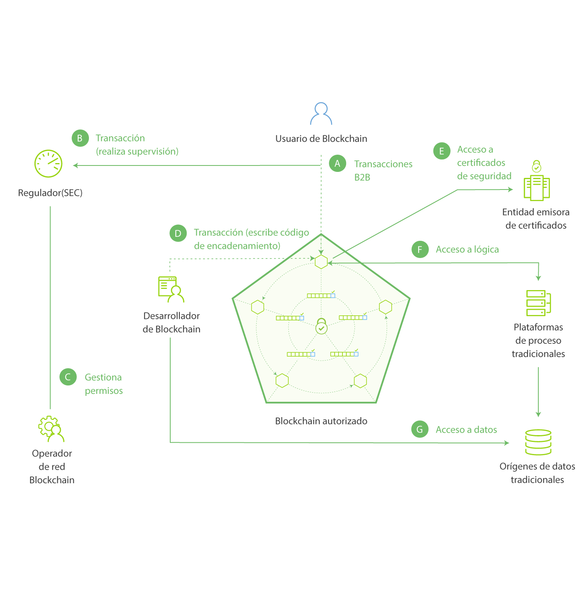

---

copyright:
  years: 2016, 2017
lastupdated: "2017-07-28"
---

{:new_window: target="_blank"}
{:shortdesc: .shortdesc}
{:codeblock: .codeblock}
{:screen: .screen}
{:pre: .pre}

# Aspectos básicos de Blockchain
{: #ibmblockchain_overview}

Blockchain es una tecnología de libro mayor distribuida (DLT) que agiliza los procesos empresariales gracias a nuevos niveles de confianza, responsabilidad y transparencia para una nueva generación de aplicaciones transaccionales. La red de blockchain fue introducida por primera vez para bitcoin, pero sus usos prácticos van más allá de las transacciones de criptomonedas. Junto con Hyperledger Project de Linux Foundation, {{site.data.keyword.blockchainfull}} está reinventando los intercambios empresariales más fundamentales y abre la puerta a un nuevo mundo de interacciones digitales. 

{{site.data.keyword.blockchain}} reduce el coste y la complejidad de las transacciones entre empresas mediante la creación de redes eficientes y altamente seguras, donde virtualmente se puede realizar el seguimiento de, y comerciar con, todo lo que tenga valor sin tener que depender de un punto de control centralizado. En el mundo de las finanzas, las redes de blockchain permiten establecer operaciones con valores en minutos en lugar de días. En el mundo de los negocios, estas redes podrían facilitar la gestión de la cadena de suministro y permitir que el flujo de bienes y pagos se pueda registrar y seguir en tiempo real.  

## Visión general de la red de Blockchain

En una red de {{site.data.keyword.blockchain}}, los registros de transacciones de red se realizan en un libro mayor que se replica en todos los miembros de la red o en un subconjunto de los mismos (los libros mayores existen en el ámbito de un canal, por lo que si un igual de un miembro no está suscrito a un canal, no dispondrá de las transacciones del canal). Los registros de todas las transacciones, tanto válidas como no válidas, se registran en bloques y se añaden a la cadena hash (es decir, blockchain) para cada canal. Las transacciones válidas actualizarán la base de datos de estados, mientras que una transacción no válida no la actualizará. Los códigos de encadenamiento (también conocidos como "contratos digitales") son los fragmentos de software que contienen un conjunto de funciones que permiten lecturas y grabaciones en el libro mayor. Las aplicaciones del lado de cliente utilizan un SDK para interactuar con un igual o iguales y realizar funciones de llamada a un código de encadenamiento específico. Existen dos API claves de Fabric que permiten la lectura o escritura de un código de encadenamiento: `getState` y `putState`.

En la **Figura 1**, se ofrece un ejemplo de red de blockchain autorizada, que presenta una arquitectura distribuida de igual a igual y descentralizada así como una entidad emisora de certificados que gestiona roles de usuario y permisos: 
*Figura 1. Una red de blockchain autorizada: roles de miembros controlan el flujo de datos y el acceso a red*

Las siguientes descripciones corresponden a la arquitectura y al flujo que se muestra en la Figura 1 (nota: esos no representan un proceso secuencial): 

**A:** Un usuario de Blockchain somete una transacción a la red de Blockchain. La transacción puede ser un despliegue, una invocación o una consulta, y se emite a través de una aplicación del lado del cliente haciendo uso de un SDK, o directamente a través de una API REST.  

**B:** Las redes empresariales fiables proporcionan acceso a reguladores y auditores (por ejemplo, el organismo SEC en el mercado de valores de Estados Unidos).   

**C:** Un operador de red de Blockchain gestiona permisos de miembros como la inscripción del regulador (B) como "auditor" y del usuario de Blockchain (A) como "cliente". Un auditor podría estar restringido a realizar consultas en el libro mayor, mientras que un cliente puede tener autorización para desplegar, invocar y consultar determinados tipos de código de encadenamiento.  

**D:** Un desarrollador de Blockchain escribe código de encadenamiento y aplicaciones del lado de cliente. El desarrollador de Blockchain puede desplegar código de encadenamiento directamente en la red, a través de una interfaz REST. Para incluir credenciales desde un origen de datos tradicional en el código de encadenamiento, el desarrollador podría utilizar una conexión fuera de banda para acceder a los datos (G). 

**E:** Un usuario de Blockchain se conecta a la red a través de un nodo de igual (A). Antes de continuar con las transacciones, el nodo recupera la inscripción del usuario y los certificados de transacción de la entidad emisora de certificados. Los usuarios deben poseer estos certificados digitales para poder negociar en una red autorizada.

**F:** Un usuario encadenamiento puede ser requerido a que verifique sus credenciales en un origen de datos tradicional (G). Para confirmar la autorización del usuario, el código de encadenamiento puede utilizar una conexión fuera de banda para estos datos a través de una plataforma de proceso tradicional. 
