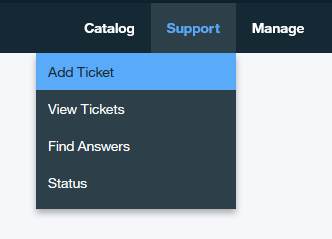

---

copyright:
  years: 2017
lastupdated: "2017-07-13"
---

{:new_window: target="_blank"}
{:shortdesc: .shortdesc}
{:codeblock: .codeblock}
{:screen: .screen}
{:pre: .pre}

# Obtención de soporte
{: #ibmblockchain_support}

Hay varios mecanismos disponibles para obtener soporte y resolución de problemas asociados con la instancia de blockchain en Bluemix.
{:shortdesc}

## Problemas sin defectos

Vaya a la pantalla "Soporte" en el **Supervisor de red**, como se muestra en la **Figura 1**. Ahí encontrará enlaces a recursos que proporcionan información técnica y soporte. Para ver una descripción detallada de la pantalla "Soporte", consulte la sección *Soporte* del [Supervisor de red](v10_dashboard.html).

*Figura 1. Pantalla soporte*

## Problemas de defectos de software

Para defectos de software o si el problema no se puede resolver mediante ninguna de las rutas anteriores, puede buscar respuestas con el soporte de {{site.data.keyword.Bluemix_notm}}. Pulse el enlace **Soporte** situado en la esquina superior derecha de la consola de {{site.data.keyword.Bluemix_notm}}, como se muestra en la **Figura 2**. Para obtener más información, consulte [Resolución de problemas](../../troubleshoot/troubleshoot.html){:new_window}.

*Figura 2. Enlace a Soporte*

Si el problema sigue sin resolverse, siga estos pasos para enviar una incidencia de ayuda:

1. Pulse el enlace **Soporte** situado en la esquina superior derecha de la consola de {{site.data.keyword.Bluemix_notm}}, como se muestra en la Figura 2.
2. Pulse el enlace **Añadir incidencia** de la lista desplegable como se muestra en la Figura 3.  
    
  *Figura 3. Añadir incidencia*  
3. Elija la categoría de soporte en el panel "Soporte".
4. Indique el asunto y una descripción breve del problema. De forma opcional, puede cargar adjuntos y añadir otras direcciones de correo electrónico para que reciban las notificaciones. Asegúrese de incluir la palabra clave **blockchain** en la pregunta.
5. Pulse el botón **Enviar**. Recibirá una notificación por correo electrónico en pocos minutos para la Incidencia de servicio abierta para la solicitud.  Siga las instrucciones del correo electrónico para obtener comunicaciones adicionales sobre el problema.
