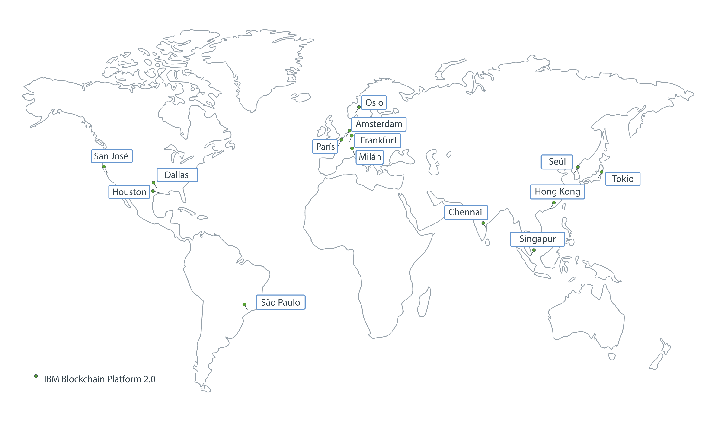
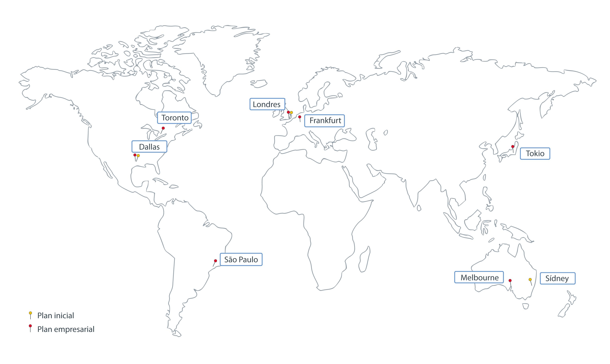

---

copyright:
  years: 2017, 2019
lastupdated: "2019-05-16"

keywords: data centers, IBM Cloud regions, available locations

subcollection: blockchain

---

{:new_window: target="_blank"}
{:shortdesc: .shortdesc}
{:screen: .screen}
{:pre: .pre}
{:table: .aria-labeledby="caption"}
{:codeblock: .codeblock}
{:tip: .tip}
{:download: .download}

# Ubicaciones de {{site.data.keyword.blockchainfull_notm}} Platform
{: #ibp-regions-locations}

{{site.data.keyword.cloud}} está alojado en varias ubicaciones en todo el mundo. Las ubicaciones son centros de datos de un área geográfica a la que se accede mediante un punto final. {{site.data.keyword.blockchainfull_notm}} Platform despliega redes blockchain dentro de
{{site.data.keyword.cloud_notm}} de manera global en distintas ubicaciones. Al crear una instancia del servicio {{site.data.keyword.blockchainfull_notm}} Platform en {{site.data.keyword.cloud_notm}}, se crea la red blockchain y los recursos de red y se almacenan en la ubicación de {{site.data.keyword.cloud_notm}} en la que se crea la instancia de servicio.
{:shortdesc}

Hay disponibles distintas ofertas de {{site.data.keyword.blockchainfull_notm}} Platform en distintas ubicaciones de {{site.data.keyword.cloud_notm}}. Solo puede crear redes de blockchain en ubicaciones de {{site.data.keyword.cloud_notm}} en que estén disponibles los planes de {{site.data.keyword.blockchainfull_notm}} Platform.

La Tabla 1 y la Figura 1 muestran las regiones y las ubicaciones de {{site.data.keyword.cloud_notm}} a las que da soporte {{site.data.keyword.blockchainfull_notm}} Platform v2.0.

Si desea utilizar un clúster Kubernetes de {{site.data.keyword.cloud_notm}} gratuito, no elija un clúster gratuito en Asia Pacífico. De lo contrario, el clúster gratuito se creará en Melbourne en AP sur en lugar de en AP norte. Los clústeres de AP sur no se pueden utilizar para desplegar {{site.data.keyword.blockchainfull_notm}} Platform v2.0 por ahora. Seleccione las ubicaciones **EE.UU. sur** o **UE central** si tiene pensado utilizar un clúster gratuito.
{: note}

| Región | Ubicaciones de {{site.data.keyword.cloud_notm}} |
|--------|--------------------|
| EE.UU. sur | San José, Sao Paulo, Dallas, Houston |
| AP norte | Tokio, Chennai, Hong Kong, Seúl, Singapur |
| UE central | Frankfurt, Amsterdam, Milán, Oslo, París |

_Tabla 1. Ubicaciones de {{site.data.keyword.blockchainfull_notm}} Platform v2.0_

  

_Figura 1. Ubicaciones de {{site.data.keyword.blockchainfull_notm}} Platform v2.0_

La Tabla 2 y la Figura 2 muestran las regiones y las ubicaciones de {{site.data.keyword.cloud_notm}} a las que dan soporte el Plan inicial y el Plan empresarial de {{site.data.keyword.blockchainfull_notm}} Platform.

| Ubicación | Plan inicial | Plan empresarial |
|--------|----------|----------|
| Dallas | S | S |
| Londres | S | S |
| Tokio |  | S |
| Frankfurt |  | S |
| Sídney | S |  |
| Melbourne |  | S |
| São Paulo |  | S |
| Toronto |  | S |

_Tabla 2. Ubicaciones del Plan inicial y el Plan empresarial_

  
_Figura 2. Ubicaciones del Plan inicial y el Plan empresarial_
