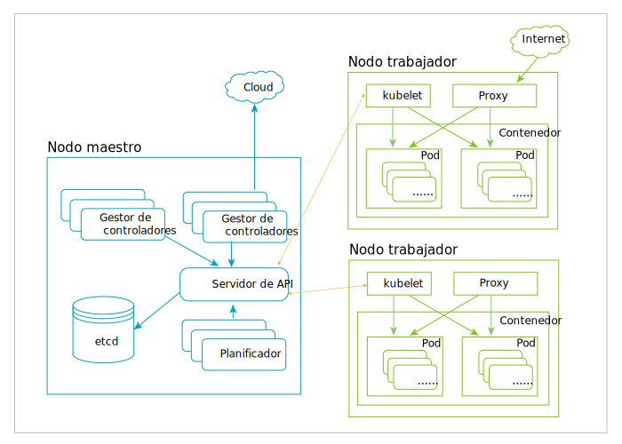

---

copyright:
  years: 2019
lastupdated: "2019-03-20"

subcollection: blockchain

---

{:new_window: target="_blank"}
{:shortdesc: .shortdesc}
{:screen: .screen}
{:codeblock: .codeblock}
{:note: .note}
{:important: .important}
{:tip: .tip}
{:pre: .pre}

# Kubernetes
{: #k8s-overview}

La consola de {{site.data.keyword.blockchainfull_notm}} Platform gratuita 2.0 beta se despliega en un clúster de Kubernetes a través del servicio de {{site.data.keyword.cloud_notm}} Kubernetes. Kubernetes es un sistema de código abierto para automatizar el despliegue, el escalado y la gestión de aplicaciones contenerizadas.
{:shortdesc}

Kubernetes proporciona un entorno de gestión centrado en contenedores. Coordina la infraestructura de almacenamiento, redes y computación en nombre de las caras de trabajo del usuario. De esta manera, se obtiene la simplicidad de una plataforma como servicio (PaaS) con la flexibilidad de una infraestructura como servicio (IaaS), además de habilitar la portabilidad entre proveedores de infraestructura.

En el siguiente diagrama se expone la arquitectura de Kubernetes. Para obtener más detalles sobre nodos, contenedores y pod, consulte la sección [Objetos Kubernetes clave](#k8s-overview-key-obj) a continuación.

*Figura 1. Diagrama de la arquitectura de Kubernetes*

## Servicio de Kubernetes de {{site.data.keyword.cloud_notm}}
{: #k8s-overview-iks}

El servicio Kubernetes de {{site.data.keyword.cloud_notm}} proporciona potentes herramientas que combinan contenedores Docker, la tecnología Kubernetes, una experiencia del usuario intuitiva, seguridad integrada y aislamiento para automatizar el despliegue, el funcionamiento, el escalado y la supervisión de apps contenerizadas en un clúster de hosts de cálculo.

Para obtener más información sobre el servicio Kubernetes de {{site.data.keyword.cloud_notm}}, consulte los siguientes temas de la documentación del servicio Kubernetes de {{site.data.keyword.cloud_notm}}:
- [Tecnología del servicio Kubernetes de {{site.data.keyword.cloud_notm}} ](https://cloud.ibm.com/docs/containers/cs_tech.html#ibm-cloud-kubernetes-service-technology "{{site.data.keyword.cloud_notm}} Documentación sobre la tecnología del servicio Kubernetes")
- [Por qué elegir el servicio Kubernetes de {{site.data.keyword.cloud_notm}}](https://cloud.ibm.com/docs/containers?topic=containers-cs_ov#cs_ov "Documentación Por qué elegir el servicio Kubernetes de {{site.data.keyword.cloud_notm}}")

## Objetos de Kubernetes clave
{: #k8s-overview-key-obj}

- **Clúster**

  Un conjunto de máquinas, llamados nodos, que ejecutan aplicaciones contenerizadas gestionadas por Kubernetes. Un clúster tiene varios nodos trabajadores y al menos un nodo maestro.

- **Nodo**

  Un nodo es una máquina de trabajador en Kubernetes. Un nodo puede ser una máquina virtual o una máquina física, en función del clúster. Cada nodo contiene los servicios necesarios para ejecutar pods y es gestionado por los componentes maestros. Los servicios de un nodo incluyen el tiempo de ejecución del contenedor, `kubelet` y `kube-proxy`. Para obtener más información, consulte la [sección Nodo de Kubernetes ](https://kubernetes.io/docs/concepts/architecture/nodes/ "sección Nodo de Kubernetes") en la documentación de Kubernetes.

- **Contenedor**

  Una imagen ejecutable, portátil y ligera que contiene el software y todas sus dependencias. Los contenedores desacoplan aplicaciones de la infraestructura de host subyacente para facilitar el despliegue en distintos entornos de sistema operativo o cloud, y para facilitar el escalado.

- **Pod**

  El objeto de Kubernetes más pequeño y más sencillo. Un pod representa un conjunto de contenedores en ejecución en su clúster. Un pod se suele configurar para ejecutar un solo contenedor primario. También puede ejecutar contenedores sidecar opcionales que añaden características complementarias, como el registro. Los pods normalmente son gestionados por un Despliegue. Para obtener más información, consulte la [sección de Pod de Kubernetes ](https://kubernetes.io/docs/concepts/workloads/pods/pod/) en la documentación de Kubernetes.
