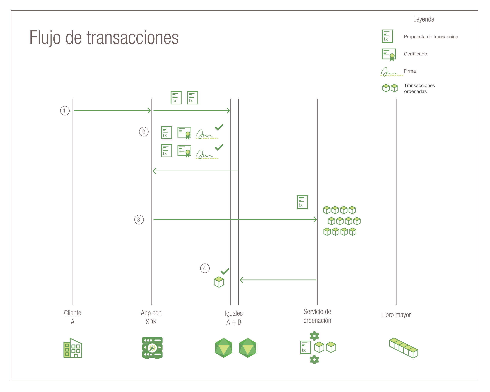

---

copyright:
  years: 2017, 2018
lastupdated: "2018-08-31"
---

{:new_window: target="_blank"}
{:shortdesc: .shortdesc}
{:codeblock: .codeblock}
{:screen: .screen}
{:pre: .pre}

# Hyperledger Fabric

***[¿Le resulta útil esta página? Indíquenos su opinión.](https://www.surveygizmo.com/s3/4501493/IBM-Blockchain-Documentation)***

La red de {{site.data.keyword.blockchainfull}} se basa en la pila de Hyperledger Fabric, uno de los proyectos de blockchain en Hyperledger Project de Linux Foundation.  Es una red "autorizada" donde todos los usuarios y componentes tienen identidades conocidas.  La lógica sign/verify se implementa en cada punto de encuentro de la comunicación y las transacciones acceden a través de una serie de verificaciones de aprobación y validación.  En este sentido, difiere mucho de las implementaciones de blockchain tradicionales que promueven el anonimato y se ven forzadas a depender de criptomonedas y obligaciones de cálculo intenso para validar las transacciones.  
{:shortdesc}

Hyperledger Fabric ofrece una arquitectura modular para ampliar la escalabilidad y el rendimiento.  En este tema se presentan algunos componentes clave de Hyperledger Fabric.  Para ver una introducción completa de Hyperledger Fabric, consulte la [documentación de Hyperledger Fabric ](http://hyperledger-fabric.readthedocs.io/en/release-1.1/){:new_window}.  

## Entidad
emisora de certificados  
Como plataforma para redes de blockchain **autorizadas**, Hyperledger Fabric incluye un componente **entidad emisora de certificados (CA)** para la gestión de las identidades de red de todas las organizaciones miembro y sus usuarios. El requisito de identidad autorizada para cada usuario habilita el control basado en ACL sobre la actividad de red y garantiza que los usuarios registrados puedan rastrear cada transacción.  
* La CA (de forma predeterminada, Fabric CA) emite un certificado raíz (**rootCert**) a cada **miembro** (organización o individual) con autorización para unirse a la red.
* La CA también emite un certificado de inscripción (**eCert**) a cada componente miembro, a aplicaciones del lado de servidor y ocasionalmente a usuarios.
* También se otorga a cada usuario inscrito una asignación de certificados de transacción (**tCerts**).  Cada **tCert** autoriza una transacción de red.

Este control basado en certificados sobre la pertenencia a red y las acciones permite restringir que identidades de usuario específicas accedan a canales privados y confidenciales, aplicaciones y datos.

Para obtener más información sobre el componente de entidad emisora de certificados de Hyperledger Fabric, consulte la [guía del usuario de Fabric CA ](https://hyperledger-fabric-ca.readthedocs.io/en/release-1.1/){:new_window}.

## Proveedor de servicios de pertenencia  
Hyperledger Fabric incluye un componente de **proveedor de servicios de pertenencia (MSP)** que ofrece una abstracción de todos los mecanismos de cifrado y protocolos tras la emisión y validación de certificados y la autenticación de usuario.  El componente MSP se instala en cada igual de canal para garantizar que las solicitudes de transacción que se emiten al igual proceden de una identidad de usuario autorizada y autenticada.

Para obtener más información sobre el componente Proveedor de servicios de pertenencia de Hyperledger Fabric, consulte *[Proveedores de servicios de pertenencia (MSP) ](http://hyperledger-fabric.readthedocs.io/en/release-1.1/msp.html){:new_window}* en la [documentación de Hyperledger Fabric ](http://hyperledger-fabric.readthedocs.io/en/release-1.1/){:new_window}.

## Flujo de transacciones  
Para garantizar la coherencia e integridad de los datos, Hyperledger Fabric implementa varios puntos de comprobación en todo el flujo de transacciones, incluidas la autenticación de cliente, aprobación, ordenación y confirmación en el libro mayor.

En la **Figura 1** se describe el flujo de transacciones de una red blockchain de Hyperledger Fabric: 
*Figura 1. Flujo de transacciones de una red Hyperledger Fabric*

En una red de Hyperledger Fabric, el flujo de datos para consultas y transacciones se inicia desde una aplicación del lado de cliente mediante el envío de una solicitud de transacción a un igual de un canal. El flujo de datos inicial a través de la red es común para consultas y transacciones:

1. Mediante la API `channel.SendTransactionProposal` disponible en el SDK, una aplicación cliente firma y envía una propuesta de transacción a los iguales de aprobación adecuados en el canal especificado.  Esta propuesta de transacción inicial es una **solicitud** de aprobación.  
2. Cada igual del canal verifica la identidad y la autoridad del cliente que realiza el envío y (si es válido) ejecuta el código de encadenamiento especificado en las entradas proporcionadas (clave/valores).  Según los resultados de la transacción y la Política de aprobación del código de encadenamiento invocado, cada igual devuelve a la aplicación una respuesta YES o NO firmada.  Cada respuesta YES firmada es una **aprobación** de la transacción.

	En este punto del flujo de transacción, el proceso difiere para consultas y transacciones.  Si la propuesta ha invocado una función de consulta en el código de encadenamiento, la aplicación devuelve los datos al cliente.  Si la propuesta ha invocado una función en el código de encadenamiento para actualizar el libro mayor, la aplicación continúa con los pasos siguientes:  
3. La aplicación reenvía la transacción (conjunto de lectura/escritura y aprobaciones) al **servicio de ordenación** de la red.  
4. La transacción se transmite al tema de partición del canal en el clúster de Kafka para su ordenación.  Todos los iguales del canal validan las transacciones del bloque mediante la aplicación de la Política de validación específica del código de encadenamiento y la ejecución de la comprobación de versiones de control de simultaneidad.  
	* Las transacciones que no superan el proceso de validación se marcan como no válida en el bloque y el bloque se añade a la cadena hash del canal.  
	* Todas las transacciones válidas actualizan la base de datos de estado según los pares clave/valor modificados.  

El **protocolo de rumores ("gossip") de diseminación de datos** difunde continuamente los datos del libro mayor a todo el canal para garantizar la sincronización de los libros mayores de los iguales.  Para más detalles, consulte información sobre el *[protocolo de rumores ("gossip") diseminación de datos ](http://hyperledger-fabric.readthedocs.io/en/release-1.1/gossip.html){:new_window}* en la [documentación de Hyperledger Fabric ](http://hyperledger-fabric.readthedocs.io/en/release-1.1/){:new_window}.

Para obtener una introducción paso a paso sobre el flujo de las transacciones, consulte *[Flujo de transacciones ](http://hyperledger-fabric.readthedocs.io/en/release-1.1/txflow.html){:new_window}* en la [documentación de Hyperledger Fabric ](http://hyperledger-fabric.readthedocs.io/en/release-1.1/){:new_window}.  

## Servicio de ordenación
Hyperledger Fabric incluye un servicio basado en Kafka para la ordenación y difusión de transacciones de red. Kafka también proporciona tolerancia a errores de bloqueo en la red; es decir, que si un número aceptado de nodos del servicio de ordenación no está disponible, el servicio seguirá ordenando y distribuyendo bloques de transacciones a los iguales del canal.

Las aplicaciones del lado de cliente invocan la API "channel.sendTransaction" para reenviar transacciones aprobadas al servicio de ordenación. Los nodos del servicio de ordenación utilizan el servicio Kafka y su servidor ZooKeeper asociado, para ordenar las transacciones en un bloque. El bloque de transacciones ordenado se "entrega" a los iguales del canal para su validación y confirmación en el libro mayor.

Los nodos del servicio de ordenación también prestan los servicios siguientes:
1. Autenticación de clientes
2. Mantenimiento de una cadena del sistema que define las configuraciones del servicio de ordenación, los certificados raíz y los ID de MSP de organizaciones autenticadas y de un grupo de perfiles que contiene los diversos consorcios dentro de la red.
3. Filtrado y validación de las transacciones de configuración que crean o vuelven a configurar un canal.  

Para obtener más información sobre el servicio de ordenación de Hyperledger Fabric, consulte la información acerca de la *[puesta en marcha de un servicio de ordenación basado en Kafka ](http://hyperledger-fabric.readthedocs.io/en/release-1.1/kafka.html){:new_window}* en la [documentación de Hyperledger Fabric ](http://hyperledger-fabric.readthedocs.io/en/release-1.1/){:new_window}.

## SDK de HFC
Los SDK de Hyperledger Fabric Client (HFC) permiten a los desarrolladores de aplicaciones crear aplicaciones que interactúan con una red blockchain. El SDK de HFC facilita la gestión en las aplicaciones del ciclo de vida de los canales y del código de encadenamiento.

Hyperledger Fabric proporciona SDK de Node.js y Java y ofrece las funciones siguientes para la interacción con la red blockchain:
* Registrar e inscribir usuarios
* Crear canales
* Unir iguales a un canal
* Actualizar la configuración del canal de sistema o canal de aplicación
* Instalar código de encadenamiento en iguales
* Crear instancias de código de encadenamiento en un canal
* Actualizar el código de encadenamiento en un canal
* Invocar funciones de código de encadenamiento para actualizar el libro mayor
* Realizar consultar al libro mayor sobre transacciones, bloques o claves específicos
* Supervisar sucesos de un canal (por ejemplo, la correcta confirmación de una transacción)

Para obtener más información sobre los SDK de HFC, consulte los *[SDK de Hyperledger Fabric ](http://hyperledger-fabric.readthedocs.io/en/release-1.1/fabric-sdks.html){:new_window}* en la [documentación de Hyperledger Fabric ](http://hyperledger-fabric.readthedocs.io/en/release-1.1/){:new_window}.
