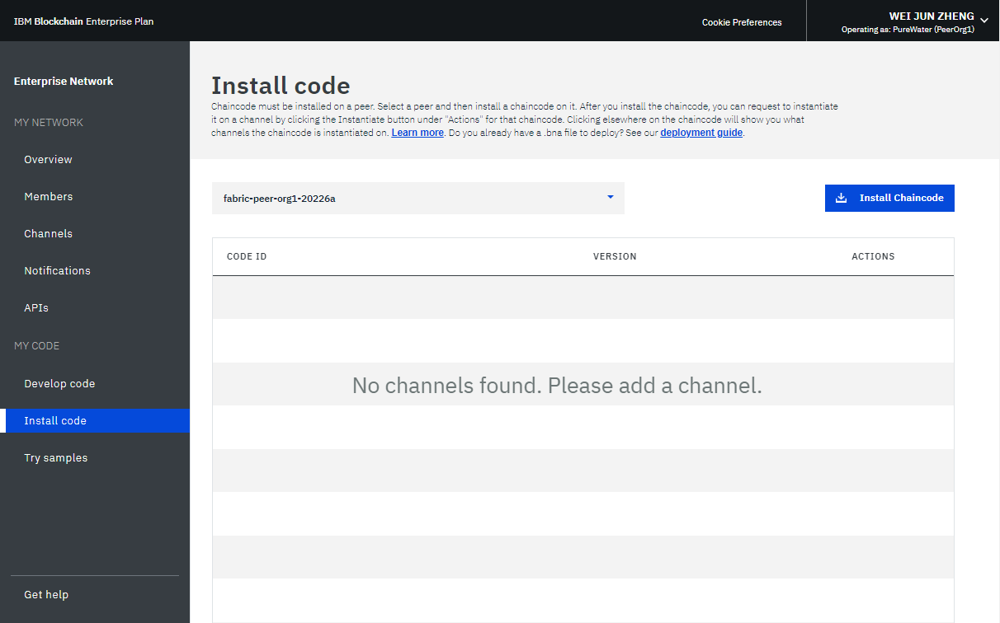
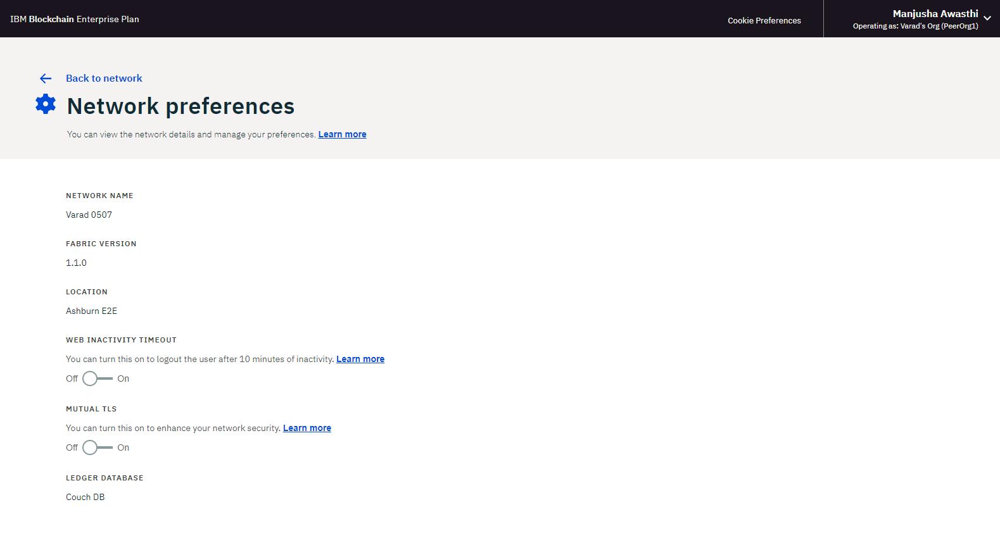

---

copyright:
  years: 2017, 2019
lastupdated: "2019-03-05"

subcollection: blockchain

---

{:new_window: target="_blank"}
{:shortdesc: .shortdesc}
{:codeblock: .codeblock}
{:screen: .screen}
{:pre: .pre}
{:note: .note}
{:important: .important}
{:tip: .tip}

# Utilización del supervisor de red
{: #ibp-dashboard}

{{site.data.keyword.blockchainfull}} Platform incorpora un supervisor de red proporciona una visión general del entorno de blockchain, incluidos recursos de red, miembros, canales unidos, datos de rendimiento de las transacciones y códigos de encadenamiento desplegados. El supervisor de red también le ofrece un punto de partida para ejecutar las API de Swagger, desarrollar una red con {{site.data.keyword.blockchainfull_notm}} Platform y probar aplicaciones de ejemplo.
{:shortdesc}

Utilice esta guía de aprendizaje para obtener información sobre el uso del supervisor de red para trabajar con una red del Plan inicial o el Plan empresarial. Aunque la mayoría de las capturas de pantalla de esta guía de aprendizaje son para el Plan empresarial, las instrucciones también son válidas para el Plan inicial. Cuando determinadas características solo sean accesibles para un plan, la sección correspondiente estará etiquetada con
**para redes del Plan inicial** o **para redes del Plan empresarial**.

## Panel de navegación izquierdo
{: #ibp-dashboard-left-navigation}

El Supervisor de red expone las pantallas siguientes en tres secciones. Puede ir a cada pantalla desde el navegador izquierdo del supervisor de red.
- La sección **Mi red** contiene las pantallas "[Visión general](/docs/services/blockchain/v10_dashboard.html#ibp-dashboard-overview)", "[Miembros](/docs/services/blockchain/v10_dashboard.html#ibp-dashboard-members)", "[Canales](/docs/services/blockchain/v10_dashboard.html#ibp-dashboard-channels)", "[Notificaciones](/docs/services/blockchain/v10_dashboard.html#ibp-dashboard-notifications)", "[Entidad emisora de certificados](/docs/services/blockchain/v10_dashboard.html#ibp-dashboard-ca)" y "[API](/docs/services/blockchain/v10_dashboard.html#ibp-dashboard-apis)".
- La sección **Mi código** contiene las pantallas "[Desarrollar código](/docs/services/blockchain/v10_dashboard.html#ibp-dashboard-write_code)", "[Instalar código](/docs/services/blockchain/v10_dashboard.html#ibp-dashboard-chaincode)" y "[Probar ejemplos](/docs/services/blockchain/v10_dashboard.html#ibp-dashboard-samples)".
- La pantalla "[Obtener ayuda](/docs/services/blockchain/v10_dashboard.html#ibp-dashboard-support)" muestra información de soporte, así como las notas del release para helios e Hyperledger Fabric (la base de código en la que se basa la plataforma {{site.data.keyword.blockchainfull_notm}}).

El nombre de la red blockchain está en la parte superior del panel de navegación de la izquierda. Puede [cambiar el nombre de la red](/docs/services/blockchain/v10_dashboard.html#ibp-dashboard-network-name) en el Supervisor de red.

Puede [comprobar y configurar las preferencias de red](/docs/services/blockchain/v10_dashboard.html#ibp-dashboard-network-preferences) desde el menú desplegable de la parte superior derecha del Supervisor de red.

En esta guía de aprendizaje se describe cada una de las pantallas y funciones anteriores.

## Visión general
{: #ibp-dashboard-overview}

En la pantalla "Visión general" se muestra información de estado en tiempo real sobre los recursos de blockchain, como el clasificador, la CA y los nodos iguales. Cada recurso se muestra bajo cuatro cabeceras distintas: **Tipo**, **Nombre**, **Estado** y **Acciones**. Durante la creación de la red blockchain, se crean automáticamente tres nodos clasificadores y dos nodos de CA. Las CA son específicas del miembro y los clasificadores son puntos finales comunes compartidos en la red.

En la **Figura 1**, se muestra la pantalla "Visión general":

*Figura 1. Visión general de red*

### Acciones de nodo
{: #ibp-dashboard-node-actions}

La cabecera **Acciones** de la tabla proporciona botones para iniciar o detener los recursos. También puede iniciar o detener un grupo de nodos mediante la selección de varios nodos para luego pulsar el botón **Iniciar seleccionados** o **Detener seleccionados**. El botón **Iniciar seleccionados** o **Detener seleccionados** aparece en la parte superior de la tabla cuando se seleccionan uno o varios nodos.

Las acciones Detener e Iniciar no están disponibles para un nodo clasificador. En general, no es necesario detener ni iniciar los nodos iguales o CA en una red. Las acciones Detener e Iniciar se proporcionan en caso de que sea necesario reiniciar un igual, por ejemplo para activarlo en un estado limpio.

También puede comprobar los registros de componente pulsando **Ver registros** en la lista desplegable en cabecera **Acciones**. Los registros muestran las llamadas entre los distintos recursos de red y resultan muy útiles para la depuración y resolución de problemas. Para obtener más información sobre el uso de los registros de red, consulte
[Supervisión de una red blockchain](/docs/services/blockchain/howto/monitor_network.html#monitor-blockchain-network)

Para entender los efectos de iniciar y detener un igual, puede experimentar deteniendo un igual e intentando convertirlo en el destino de una transacción, y verá errores de conectividad en los registros. Cuando reinicie el igual y vuelva a intentar la transacción, verá una conexión correcta. También puede dejar un igual inactivo durante un largo periodo de tiempo mientras sus canales siguen realizando transacciones. Cuando se reactive el igual, detectará una sincronización del libro mayor a medida que recibe los bloques confirmados mientras estaba inactivo. Cuando se haya sincronizado por completo el libro mayor, podrá realizar invocaciones y consultas normales sobre el mismo.

### Configuración de igual remoto
{: #ibp-dashboard-peer-connection-information}

Si despliega un igual fuera de {{site.data.keyword.cloud_notm}}, debe proporcionar la información del punto final de API de la red durante la configuración. Pulse el botón **Configuración de igual remoto** para recuperar la información de punto final de API de la red para configurar el igual. La ventana emergente proporciona la información de punto final de API del ID de red, el MSP de la organización, el nombre de CA, el URL de CA y el certificado de CA TLS. Puede pulsar el icono de copia al final de cada campo para copiar el valor de dicho campo, o bien pulsar el botón **Descargar** para guardar valores de todos los campos en un archivo JSON. Para obtener más información, consulte [Acerca de {{site.data.keyword.blockchainfull_notm}} Platform para Amazon Web Services](/docs/services/blockchain/howto/remote_peer.html#remote-peer-aws-about) y [Acerca de {{site.data.keyword.blockchainfull_notm}} Platform para {{site.data.keyword.cloud_notm}} Private](/docs/services/blockchain/ibp-for-icp-about.html#ibp-icp-about).

### Perfil de conexión
{: #ibp-dashboard-connection-profile}

Puede ver en el archivo JSON la información de red de bajo nivel de cada recurso pulsando el botón **Perfil de conexión**. El perfil de conexión contiene toda la información de configuración que necesita para una aplicación. Sin embargo, debido a que este archivo solo contiene las direcciones de sus componentes específicos y del clasificador, si necesita más iguales como destinos, deberá obtener sus puntos finales. La cabecera que contiene "url" muestra el punto final de API de cada componente. Estos puntos finales se necesitan para marcar el destino de componentes de red específicos de una aplicación del cliente y sus definiciones suelen encontrarse en un archivo de configuración de tipo JSON que acompaña a la app. Si está personalizando una aplicación que necesita aprobación de iguales que no forman parte de la organización, deberá recuperar las direcciones IP de esos iguales de los operadores relevantes en una operación externa. Los clientes deben poder conectarse a cualquier igual del que necesiten una respuesta.

### Adición de iguales
{: #ibp-dashboard-peers}

Los miembros de la red despliegan [iguales](/docs/services/blockchain/blockchain_component_overview.html#blockchain-component-overview-peer) para almacenar sus copias del libro mayor de red y ejecutar código de encadenamiento para consultar o actualizar el libro mayor. Si la política de aprobación define un igual como igual de aprobación, el igual también devuelve resultados de aprobación a las aplicaciones.

Pulse el botón **Añadir iguales** de la parte superior derecha para añadir nodos iguales a la red. En el panel emergente "Añadir iguales", seleccione el número y tamaño de los nodos iguales que desea agregar. Puede añadir más iguales a sus organizaciones, en función de sus propios requisitos. Puede estar en distintos escenarios cuando necesite más iguales. Por ejemplo, es posible que desee que varios iguales se unan al mismo canal por motivos de redundancia. Cada igual procesa las transacciones del canal y escribe en sus respectivas copias del libro mayor. Si uno de los iguales falla, el otro igual (u otros iguales) pueden continuar procesando transacciones y solicitudes de aplicación. También puede equilibrar la carga de forma simétrica de todas las solicitudes de aplicaciones entre los iguales, o puede elegir como destino diferentes iguales para diferentes funciones. Por ejemplo, puede utilizar un igual para consultar el libro mayor y utilizar otro igual para procesar las aprobaciones de actualizaciones del libro mayor.

El **Plan inicial** crea un igual para cada una de las dos organizaciones que se han formado al iniciarse la red de forma predeterminada.

### Almacenamiento (para redes del Plan inicial)
{: #ibp-dashboard-storage}

En la **Figura 2** se muestra el separador "Almacenamiento" que muestra el consumo de almacenamiento de la red.

*Figura 2. Almacenamiento*

El diagrama "Recursos" muestra el espacio de almacenamiento que utilizan los iguales y las entidades emisoras de certificados. Todas las organizaciones que cree o que invite a la red están incluidas en esta agrupación. Las organizaciones que consumen recursos aparecen en la pantalla en la segunda viñeta.

El servicio de ordenación consume almacenamiento de una agrupación de recursos aparte. Es posible que el servicio de ordenación consuma más recursos cuando los miembros de la red creen nuevos canales y generen nuevos bloques de transacciones.

## Miembros
{: #ibp-dashboard-members}

La pantalla "Miembros" contiene dos separadores para visualizar información de miembros de red en el separador "Miembros" y la información de certificado en el separador "Certificados".

### Añadir miembros a redes del Plan empresarial
{: #ibp-dashboard-members-tab}

**Figura 3** muestra la pantalla inicial "Miembros" que muestra los miembros de la red en el separador "Miembros":

*Figura 3. Miembros de la red*

Puede invitar a otros miembros del separador "Miembros" para que se añadan a aquellos que ha invitado inicialmente al crear la red. Para invitar a un miembro a la red, especifique el nombre de la institución y la dirección de correo electrónico del operador y pulse **Añadir miembro**. Una red puede tener un total de 15 miembros (incluido el iniciador de red). Para eliminar un miembro de la red, pulse el símbolo de "eliminación" al final de la fila del miembro.

### Añadir miembros a redes del Plan inicial

En la **Figura 4** se muestra la ventana "Añadir miembro".

*Figura 4. Añadir miembro*

Al pulsar **Añadir miembro**, se le ofrecerán dos opciones:
- **Invitar a un miembro**. Puede invitar a otras organizaciones a que pasen a ser miembros de la red. Luego las organizaciones invitadas pueden unirse y colaborar con usted en la red.
- **Crear miembro**. También puede crear un miembro utilizando su propia dirección de correo electrónico. Tendría el mismo control sobre dicho miembro que el que tiene sobre las dos organizaciones que recibe de forma predeterminada con el Plan inicial.

### Certificados
{: #ibp-dashboard-certificates}

En la **Figura 5** se muestra la pantalla inicial "Miembros" con los certificados de los miembros en el separador "Certificados":

*Figura 5. Certificados*

Los operadores pueden gestionar los certificados de miembros de la misma institución en el separador "Certificados". Pulse **Añadir certificado** para abrir el panel "Añadir certificado". Indique un nombre para el certificado, pegue los certificados del lado de cliente en formato PEM en el campo "Clave" y pulse **Enviar**. Debe reiniciar sus iguales antes de que certificados del lado de cliente entren en vigor.

Para obtener información sobre cómo generar su clave de certificado, consulte [Inscripción de la aplicación](/docs/services/blockchain/v10_application.html#dev-app-enroll).

## Canales
{: #ibp-dashboard-channels}

Los canales, consistentes en un subconjunto de miembros de red que desean realizar transacciones privadas, proporcionan aislamiento de datos y confidencialidad permitiendo que los miembros de un canal establezcan normas específicas y un libro mayor separado, al que solo pueden acceder los miembros del canal. Cada red debe tener al menos un canal para que se lleven a cabo las transacciones. Cada canal tiene un libro mayor único y los usuarios deben estar correctamente autenticados para poder realizar operaciones de lectura/escritura en este libro mayor. Si no está en un canal, no podrá ver los datos.

En la **Figura 6** se muestra la pantalla inicial del panel de control con una visión general de todos los canales de la red:

*Figura 6. Canales*

La creación de un canal genera un libro mayor específico del canal. Para obtener más información, consulte [Creación de un canal](/docs/services/blockchain/howto/create_channel.html#ibp-create-channel).

También puede seleccionar un canal existente para ver detalles más precisos sobre el canal, la pertenencia y el código de encadenamiento activo. Para obtener más información, consulte [Supervisión de una red](/docs/services/blockchain/howto/monitor_network.html#monitor-blockchain-network).

Si ha cargado un nuevo certificado en la plataforma utilizando el [separador "Certificados"](/docs/services/blockchain/v10_dashboard.html#ibp-dashboard-certificates) de la pantalla "Miembros", puede utilizar este panel para añadir el certificado a un canal. Pulse **Sincronizar certificado** en la lista desplegable bajo la cabecera **Acciones** situada junto al canal apropiado. Esto le permite operar el canal desde un cliente remoto, incluyendo la capacidad de crear una instancia de código de encadenamiento en el canal. Para obtener más información, consulte [Carga de certificados de firma en {{site.data.keyword.blockchainfull_notm}} Platform](/docs/services/blockchain/certificates.html#managing-certificates-upload-certs)
en la guía de aprendizaje sobre [Gestión de certificados](/docs/services/blockchain/certificates.html#managing-certificates).

## Notificaciones
{: #ibp-dashboard-notifications}

Cuando cree un canal o se le invite a un nuevo canal, recibirá una notificación en el Supervisor de red. Puede ver y responder a estas solicitudes en la pantalla "Notificaciones".

En la **Figura 7**, se muestra la pantalla "Notificaciones":

*Figura 7. Notificaciones*

Las solicitudes se agrupan en los subseparadores "Todas", "Pendientes" y "Completadas". Los números tras la cabecera del subseparador indican el número de solicitudes de cada subseparador.
   * Puede encontrar todas las solicitudes en el subseparador "Todas".
   * Las solicitudes que no ha aceptado ni rechazado, o que no ha visto, se encuentran en el subseparador "Pendientes". Pulse el botón **Revisar solicitud** para ver la solicitud, que incluye la política de canal y los miembros, y el estado de votación. Si es un operador de canal, puede **Aceptar** o **Rechazar** la solicitud, o bien puede gestionarla en otro momento pulsando **Más tarde**. Si la solicitud es aceptada por suficientes operadores de canal, puede pulsar **Enviar solicitud** para activar la actualización del canal.
   * La solicitud enviada se mostrará en el subseparador "Completadas". Puede pulsar **Revisar solicitud** para ver sus detalles.

Si tiene una lista larga de solicitudes, puede buscar una en el campo de búsqueda situado en la parte superior.

Para suprimir solicitudes pendientes, seleccione los recuadros situados delante de las mismas y pulse **Suprimir solicitud**. Tenga en cuenta que no se pueden suprimir solicitudes completadas.

## Entidad emisora de certificados
{: #ibp-dashboard-ca}

La tabla de la pantalla "Entidad emisora de certificados" (CA) muestra todas las identidades que se han registrado con su organización, incluidas las aplicaciones de administrador, de iguales y de cliente. También puede utilizar esta pantalla para registrar una nueva identidad.

En la **Figura 8** se muestra la pantalla "Entidad emisora de certificados":

*Figura 8. Entidad emisora de certificados*

Pulse el botón **Generar certificado** situado junto a la identidad de administrador para obtener un nuevo certificado público y una clave privada de la entidad emisora de certificados. El campo **Certificado** contiene el certificado público, al que también se denomina signCert o certificado de inscripción, justo encima de la **Clave privada**. Puede pulsar el icono de copia que hay al final de cada campo para copiar el valor. Este panel se puede utilizar como alternativa a la generación de un par de claves pública y privada para una aplicación cliente que utiliza el SDK de Fabric. Para obtener más información, consulte la [guía de aprendizaje de desarrollo de aplicaciones](/docs/services/blockchain/v10_application.html#dev-app). **Tenga en cuenta** que {{site.data.keyword.blockchainfull_notm}} Platform no almacena estos certificados. Tiene que guardarlos y almacenarlos de forma segura.

Pulse el botón **Añadir usuario** para registrar una nueva identidad en la organización. En la ventana emergente **Añadir usuario**, rellene los campos siguientes y luego pulse **Enviar**.
  - **ID de inscripción:** el nombre de la nueva identidad, a la que a veces se denomina `ID de inscripción`. **Guarde este valor**, ya que necesitará utilizarlo cuando configure un igual remoto o inscriba una nueva aplicación.
  - **Secreto de inscripción:** la contraseña de la identidad, que a veces recibe el nombre de `Secreto de inscripción`. **Guarde este valor**, ya que necesitará utilizarlo cuando configure un igual remoto o inscriba una nueva aplicación.
  - **Tipo:** seleccione el tipo de identidad que desea registrar, que puede ser una aplicación igual o de cliente.
  - **Afiliación** la afiliación dentro de la organización, como por ejemplo `org1`, a la que pertenece la identidad.
  - **Número máximo de inscripciones:** puede utilizar este campo para limitar el número de veces que puede inscribir o generar certificados con esta identidad. Si deja el campo en blanco, el valor predeterminado es un número ilimitado de inscripciones.

Puede obtener más información sobre la CA en la guía de aprendizaje de [Gestión de certificados en {{site.data.keyword.blockchainfull_notm}} Platform](/docs/services/blockchain/certificates.html#managing-certificates).

## API
{: #ibp-dashboard-apis}

{{site.data.keyword.blockchainfull_notm}} Platform ofrece varias API REST en Swagger que puede utilizar para gestionar los nodos, canales, iguales y miembros de la red. Las aplicaciones pueden utilizar estas API para controlar los recursos de red importantes sin utilizar el supervisor de red.

En la **Figura 9** se muestra la pantalla "API":

*Figura 9. API*

Pulse el enlace **IU de Swagger** para abrir la IU de Swagger. Tenga en cuenta que debe autorizar la IU de Swagger con sus credenciales de red (que encontrará en esta página de API) para poder ejecutar las API. Para obtener más información, consulte [Cómo interactuar con la red con las API de Swagger](/docs/services/blockchain/howto/swagger_apis.html#ibp-swagger).

## Desarrollar código
{: #ibp-dashboard-write-code}

{{site.data.keyword.IBM_notm}} no proporciona soporte para redes que utilicen Hyperledger Composer en producción, incluyendo la CLI de Composer, las API de JavaScript, el servidor REST y Web Playground.{:note}

El Plan inicial y el Plan empresarial proporcionan un entorno de desarrollo con herramientas y tecnologías estándares del sector. Después de desarrollar una red, puede desplegarla en la red.

En la **Figura 10** se muestra la pantalla "Desarrollar código":

*Figura 10. Desarrollar código*

Para obtener más información sobre el desarrollo y el despliegue de las redes empresariales, consulte [Despliegue de redes empresariales en el plan inicial y de empresa](/docs/services/blockchain/develop_starter_enterprise.html#deploying-a-business-network).

## Instalar código
{: #ibp-dashboard-chaincode}

El código de encadenamiento, que también se conoce como "contrato inteligente", son fragmentos de software que contienen un conjunto de funciones para consultar y actualizar el libro mayor. Se instalan en iguales y se crean instancias de los mismos en un canal.

En la **Figura 11** se muestra la pantalla "Instalar código":

*Figura 11. Instalar código*

El código de encadenamiento se instala en primer lugar en el sistema de archivos del igual y, a continuación, se crea una instancia en un canal. Para obtener más información, consulte [Instalación, creación de instancias y actualización de un código de encadenamiento](/docs/services/blockchain/howto/install_instantiate_chaincode.html#install-instantiate-chaincode).

## Probar ejemplos
{: #ibp-dashboard-samples}

Las aplicaciones de ejemplo le ayudan a comprender mejor una red blockchain y el desarrollo de aplicaciones. Siga los enlaces **Ver en GitHub** para obtener más información sobre cómo utilizar las muestras y desplegarlas en la plataforma de {{site.data.keyword.blockchainfull_notm}}. Para obtener más información sobre cómo desarrollar y desplegar los ejemplos, consulte [Despliegue de aplicaciones de ejemplo](/docs/services/blockchain/howto/prebuilt_samples.html#deploying-sample-applications).

En la **Figura 12** se muestra la pantalla "Probar ejemplos":

*Figura 12. Ejemplos*

## Obtener ayuda
{: #ibp-dashboard-support}

La pantalla "Obtener ayuda" contiene un separador "Soporte" que proporciona una lista de recursos para desarrolladores y un separador "Notas del release" que describe las funciones nuevas de la plataforma {{site.data.keyword.blockchainfull_notm}}.

En la **Figura 13** se muestra la información en el separador "Soporte" inicial:

*Figura 13. Soporte de Blockchain*

### Foros de soporte y recursos de Blockchain
{: #ibp-dashboard-support-forums}

Utilice los recursos del separador "Soporte" para resolver problemas y obtener ayuda de {{site.data.keyword.IBM_notm}} y la comunidad de Fabric. Para obtener más información sobre los enlaces del separador "Soporte", consulte [Recursos y foros de soporte](/docs/services/blockchain/ibmblockchain_support.html#blockchain-support-resources) en [Obtención de soporte](/docs/services/blockchain/ibmblockchain_support.html#blockchain-support).

[IBM dWAnswers ](https://developer.ibm.com/answers/smartspace/blockchain/) es un foro de la comunidad para usuarios de {{site.data.keyword.blockchainfull_notm}} Platform y de Hyperledger Fabric y está supervisado por expertos de IBM. Puede buscar respuestas a preguntas realizadas anteriormente o enviar una nueva pregunta. Si no puede depurar su problema ni determinar una respuesta a su pregunta, envíe un caso de soporte en el portal de servicio de {{site.data.keyword.cloud_notm}}. Para obtener más información, consulte
[Envío de casos de soporte](/docs/services/blockchain/ibmblockchain_support.html#blockchain-support-cases).

### Notas del release de Fabric
{: #ibp-dashboard-release-notes}

El separador "Notas del release" muestra las características más recientes de la red. El botón "Interfaz de usuario del supervisor de red" enumera nuevas funciones y correcciones de errores de la experiencia del usuario de la plataforma {{site.data.keyword.blockchainfull_notm}}. El botón "Hyperledger Fabric" le dirigirá a las notas del release de la versión de Hyperledger Fabric y de la entidad emisora de certificados de Fabric de su red.

En la **Figura 14** se muestran las notas del release para la interfaz de usuario del supervisor de red.

*Figura 14. Notas del release de la interfaz de usuario de Network Monitor*

En la **Figura 15** se muestran las notas del release de la versión de Hyperledger Fabric y de la entidad emisora de certificados de Fabric de sus redes.

*Figura 15. Notas del release para Fabric*

## Preferencias de red
{: #ibp-dashboard-network-preferences}

Pulse la esquina superior derecha y abra el menú desplegable y luego las **Preferencias de red**. Se abre la ventana Preferencias de red. La ventana Preferencias de red muestra la información básica de la red, como por ejemplo el nombre de red, la versión de Fabric, la ubicación de la red en {{site.data.keyword.cloud_notm}} y el tipo de base de datos de estado.

Las **redes del Plan empresarial** que se creen después del 15 de mayo de 2018 se ejecutarán en Hyperledger Fabric v1.1.1. Si crea redes después de la actualización, también puede gestionar el tiempo de espera de inactividad web y TLS mutuo para la red en la ventana Preferencias de red. Estos valores puede cambiarlos solo el iniciador de la red.

### Tiempo de espera de inactividad web
{: #ibp-dashboard-web-inactivity-timeout}

**Nota**: Solo el **iniciador de red** puede cambiar el valor de tiempo de espera de inactividad web. Este es un valor de nivel de red y afectará a todos los miembros de la red.

El tiempo de espera de inactividad web está establecido en **Desactivado** de forma predeterminada. Si coloca el tiempo de espera de inactividad web en **Activado**, cualquier miembro de la red será desconectado automáticamente tras 10 minutos de inactividad. Cuando el temporizador de inactividad web llegue a los 10 minutos, la función de tiempo de espera de inactividad web terminará las sesiones web inactivas para garantizar la seguridad de la cuenta del miembro de la red. Al pulsar un enlace o al renovar el Supervisor de red se restablece el temporizador de inactividad web. Antes de llegar a 10 minutos, el cierre de la ventana o del separador del navegador también termina la sesión web.

En la **Figura 16** se muestra la ventana "Preferencias de la red":

*Figura 16. Preferencias de la red*

### TLS mutuo (para redes del Plan empresarial)
{: #ibp-dashboard-mutual-tls}

Las **redes del Plan empresarial** le ofrecen la posibilidad de habilitar TLS mutuo para proteger la comunicación entre la aplicación y los componentes de blockchain.

**Nota**: Solo un **iniciador de red** puede habilitar o inhabilitar TLS mutuo. Este es un valor de nivel de red y afectará a todos los miembros de la red.

El botón TLS mutuo está establecido en **Desactivado** de forma predeterminada. Si habilita TLS mutuo, debe actualizar las aplicaciones para dar soporte a esta función. De lo contrario, las aplicaciones no podrán comunicarse con la red.

Para una red de Plan empresarial de Fabric 1.1, cada organización tiene su propia entidad emisora de certificados (CA) de TLS mutuo. La información necesaria para conectarse a la CA de TLS mutuo está disponible en el [Perfil de conexión](/docs/services/blockchain/v10_dashboard.html#ibp-dashboard-connection-profile) accesible desde la pantalla **Visión general** del Supervisor de red pulsando el botón **Perfil de conexión**. El perfil de conexión contiene la información necesaria para conectarse a la CA y para obtener los certificados que necesite para conectarse a la red.

En el Perfil de conexión, localice la sección `certificateAuthorities` donde encontrará los siguientes atributos que son necesarios para registrarse y obtener los certificados para comunicarse con la red utilizando TLS mutuo.

- `url`: URL para conectarse a la CA que puede proporcionar certificados de TLS mutuo
- `enrollId`: ID de inscripción a utilizar para obtener un certificado
- `enrollSecret`: Secreto de inscripción a utilizar para obtener un certificado
- `x-tlsCAName`: Nombre de la CA a utilizar para obtener el certificado que permitirá que la aplicación se comunique con TLS mutuo.

Para obtener más información sobre cómo actualizar las aplicaciones para dar soporte a TLS mutuo, consulte [Cómo configurar TLS mutuo ](https://fabric-sdk-node.github.io/tutorial-mutual-tls.html)

<!--

### CouchDB state database
{: #couchdb}

**Note**: Only the **network initiator** can switch the state database from LevelDB to CouchDB. This is a network level setting and will affect all network members. Switching to CouchDB is permanent. You cannot revert back to LevelDB.

Before Enterprise Plan upgrades to Fabric v1.1, all network peers store data in the pure key-value LevelDB. With Fabric v1.1, you can choose to use CouchDB as your state database. CouchDB is a document datastore that permits indexing the contents of your data and allows you to issue rich queries against the data on your peer. Note that Hyperledger Fabric does not support peers running different databases. If CouchDB is used, it must be used by all of the peers.

To use CouchDB, your data must be stored in a data format that can be modeled in chaincode, such as JSON. If the decision is made to migrate from LevelDB to CouchDB, the {{site.data.keyword.blockchainfull_notm}} Platform will migrate your data from key-value format to the CouchDB format automatically.

If you switch to CouchDB, you need to update your chaincode to take advantage of indexes and rich queries. For more information about CouchDB and how to set up indexes, see [Best practices when using CouchDB](/docs/services/blockchain/v10_application.html#couchdb-indices) in the Developing applications tutorial. For more information about updating chaincode in {{site.data.keyword.blockchainfull_notm}} Platform, see [Updating a chaincode](/docs/services/blockchain/howto/install_instantiate_chaincode.html#install-instantiate-chaincode-update-cc).

-->

En la **Figura 17** se muestra la ventana "Preferencias de la red":

*Figura 17. Preferencias de la red*

## Actualizar el nombre de red
{: #ibp-dashboard-network-name}

Al crear una instancia del Plan inicial o el Plan empresarial, {{site.data.keyword.blockchainfull_notm}} Platform asigna un nombre a la red. Sin embargo, puede actualizar este nombre de red en cualquier momento en el Supervisor de red.

En la parte superior izquierda del navegador del Supervisor de red, pulse sobre el nombre de red y el campo se volverá editable. Escriba el nuevo nombre de red que desee utilizar y pulse la tecla **Intro**. El nombre de red se actualizará en pocos segundos.

En la **Figura 18** se muestran los pasos para actualizar el nombre de red del Plan inicial del nombre asignado a "Red del Plan inicial".

*Figura 18. Actualizar el nombre de red*

## Conmutar entre redes (para redes del Plan inicial)
{: #ibp-dashboard-switch-network}

Si crea más de una red con el Plan inicial, puede cambiar entre las redes en el Supervisor de red.

En la parte superior izquierda del navegador del Supervisor de red, pulse el icono de flecha junto a su nombre de red. Seleccione y pulse el nombre de red al que desea cambiar desde la lista desplegable. El navegador web se renovará y abrirá el Supervisor de red de la red a la que desea cambiar.

En la **Figura 19** se muestran los pasos para cambiar a otra red del Plan inicial.

*Figura 19. Cambiar de red*

## Restablecer red (para redes del plan Inicial)
{: #ibp-dashboard-reset-network}

Las redes del Plan inicial ofrecen la posibilidad de editar la configuración de la red sin suprimir ni volver a crear la red. Se restablece la configuración inicial de la red, que incluye dos organizaciones, un igual por cada organización y un canal predeterminado. Esto resulta útil, por ejemplo, cuando se ejecutan rondas de pruebas en la red blockchain y tiene que volver a empezar desde una red limpia.

**Atención**: después de restablecer la red, los puntos finales de API de los iguales, el clasificador y la CA se modifican. Debe ajustar la información sobre puntos finales de API en las aplicaciones.

Pulse la esquina superior derecha para abrir el menú desplegable. Pulse el botón **Restablecer red** en el menú. Si está preparado para restablecer la red, pulse **Aceptar** para continuar. El supervisor de red se renovará para reflejar los valores nuevos.

En la **Figura 20** se muestra la función "Restablecer red":

*Figura 20. Restablecer red*
